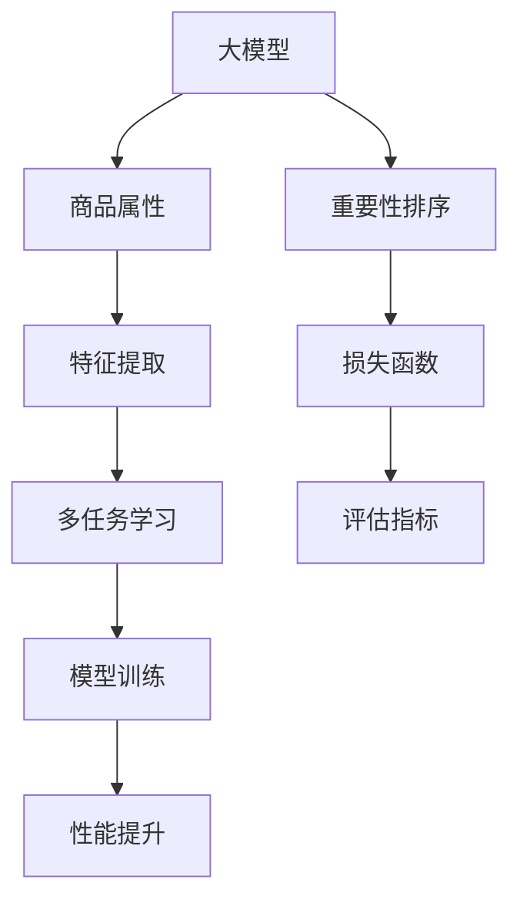

                 

# 大模型在商品属性重要性排序中的应用

> 关键词：大模型, 商品属性, 重要性排序, 深度学习, 多任务学习, 推荐系统, 自然语言处理(NLP)

## 1. 背景介绍

### 1.1 问题由来
在现代电子商务中，商品属性的重要性排序是一个至关重要的问题。商品属性通常包括价格、品牌、尺寸、颜色、重量等多种特性，这些属性决定了商品的市场表现和销售效果。通过对商品属性的重要性排序，商家能够制定更有效的营销策略，提升用户体验和满意度。例如，电商平台可以针对不同用户群体推荐最相关的商品，从而提高转化率和销售额。

然而，手动排序商品属性既耗时又容易出错。为了解决这一问题，研究者们纷纷将目光投向了人工智能技术。大模型，特别是预训练语言模型，由于其强大的语言理解能力和学习能力，成为了商品属性排序任务的有力工具。本文将详细探讨如何利用大模型进行商品属性重要性排序，并提供实用的技术和应用实例。

### 1.2 问题核心关键点
商品属性重要性排序的核心在于如何利用自然语言处理(NLP)技术，从大量的文本数据中提取并量化商品属性的重要性。其中，核心问题包括：

- 如何从文本中提取商品属性及其特征？
- 如何量化不同属性的重要性？
- 如何对属性进行综合排序？

这些问题不仅涉及NLP技术，还需要结合统计学、机器学习等领域的知识。本文将从这三个角度出发，系统地阐述大模型在商品属性重要性排序中的应用。

## 2. 核心概念与联系

### 2.1 核心概念概述

为更好地理解大模型在商品属性重要性排序中的应用，本节将介绍几个密切相关的核心概念：

- 大模型(Large Model)：指使用大规模数据和计算资源进行预训练的深度学习模型。典型的预训练模型如BERT、GPT-3等。
- 商品属性(Product Attributes)：商品的所有特征，如价格、品牌、尺寸、颜色等。
- 重要性排序(Importance Ranking)：对商品属性按其重要性进行排序，以便制定有效的营销策略。
- 多任务学习(Multi-task Learning)：在训练过程中同时优化多个任务，共享特征提取器，提高模型的泛化能力。
- 自然语言处理(Natural Language Processing, NLP)：通过计算机处理和分析自然语言数据，提取有价值的信息。

这些概念之间的逻辑关系可以通过以下Mermaid流程图来展示：



这个流程图展示了大模型在商品属性重要性排序中的核心概念及其之间的关系：

1. 大模型通过预训练学习通用的语言表示。
2. 商品属性通过特征提取模块转化为数值特征。
3. 多任务学习通过共享特征提取器，优化多个任务。
4. 重要性排序任务通过构建损失函数，训练模型。
5. 评估指标衡量模型性能，指导后续优化。
6. 性能提升依赖于模型训练和优化。

## 3. 核心算法原理 & 具体操作步骤

### 3.1 算法原理概述

利用大模型进行商品属性重要性排序，主要包括以下几个步骤：

1. 数据收集与预处理：收集商品描述文本和属性信息，并进行数据清洗和标注。
2. 特征提取：利用大模型提取文本中包含的商品属性和特征。
3. 重要性量化：通过多任务学习或直接训练的方式，量化每个商品属性的重要性。
4. 综合排序：结合重要性得分，对商品属性进行综合排序。

### 3.2 算法步骤详解

#### 3.2.1 数据收集与预处理

首先，需要收集商品描述文本和对应的属性信息。这些数据可以从电商平台的用户评论、产品描述、广告语等文本中获取。数据预处理包括去除噪声、标准化、分词等步骤，确保数据质量。

#### 3.2.2 特征提取

商品属性通常包含在商品描述文本中。可以利用大模型提取文本中的关键词、短语等，作为属性特征。常用的技术包括词嵌入、主题模型等。

#### 3.2.3 重要性量化

量化商品属性重要性通常有两种方法：

1. **多任务学习**：将多个任务（如属性预测、情感分析等）结合起来，共享特征提取器，训练一个多任务模型。多任务模型的目标是最大化所有任务的性能，从而间接提升重要性排序的准确性。
2. **直接训练**：设计一个特定的损失函数，直接训练重要性排序模型。该模型将商品属性作为输入，输出每个属性的重要性得分。

#### 3.2.4 综合排序

根据重要性得分，对商品属性进行综合排序。可以使用基于排序算法的方法，如基于距离的排序、基于等级的排序等，根据不同业务需求选择合适的排序方式。

### 3.3 算法优缺点

利用大模型进行商品属性重要性排序具有以下优点：

1. 自动化的特征提取：大模型能够自动提取文本中的关键词和短语，减少了人工标注的工作量。
2. 泛化能力强：预训练模型通过大规模无标签数据学习，具有较强的泛化能力，可以适应多种商品属性排序场景。
3. 可解释性强：通过多任务学习，可以了解不同属性对用户需求的影响，为决策提供更多参考。

然而，这种方法也存在以下缺点：

1. 对数据质量要求高：数据质量直接影响模型的性能，需要进行严格的数据清洗和预处理。
2. 计算资源消耗大：大模型需要大量的计算资源进行训练和推理，对硬件要求较高。
3. 结果解释性不足：重要性排序的结果往往是数值，难以直观解释，需要结合业务知识进行解读。

### 3.4 算法应用领域

商品属性重要性排序技术主要应用于以下几个领域：

1. **电商推荐系统**：根据商品属性重要性排序，推荐相关商品给用户，提高转化率。
2. **广告定向**：根据属性重要性排序，优化广告投放策略，提高广告点击率。
3. **用户画像**：利用商品属性重要性排序，构建用户画像，了解用户需求和偏好。
4. **库存管理**：根据属性重要性排序，优化库存管理，减少库存积压和缺货情况。

这些应用场景展示了商品属性重要性排序技术的重要性和广泛应用前景。

## 4. 数学模型和公式 & 详细讲解

### 4.1 数学模型构建

假设商品描述文本为 $x$，对应的商品属性集合为 $A=\{a_1, a_2, \cdots, a_n\}$，每个属性的重要性得分为 $w_i$，则商品属性重要性排序问题可以形式化表示为：

$$
\max_{w} \sum_{i=1}^n w_i f(a_i, x)
$$

其中 $f(a_i, x)$ 表示属性 $a_i$ 对文本 $x$ 的影响度。

### 4.2 公式推导过程

为了量化 $f(a_i, x)$，可以采用以下方法：

1. **词向量表示**：利用词嵌入技术，将商品属性和文本转换为向量表示，计算向量间的余弦相似度，得到属性对文本的影响度。
2. **注意力机制**：使用注意力机制，计算每个属性的注意力权重，对文本进行加权处理，得到属性对文本的影响度。
3. **预训练模型**：使用预训练模型（如BERT），提取文本中每个属性的表示，计算其与文本的相似度，得到属性对文本的影响度。

以预训练模型为例，其数学模型和推导过程如下：

设 $M_{\theta}$ 为预训练模型，$x$ 为输入文本，$A$ 为属性集合。则每个属性 $a_i$ 在模型中的表示为 $h_i = M_{\theta}(a_i)$。属性对文本的影响度 $f(a_i, x)$ 可以表示为：

$$
f(a_i, x) = \langle h_i, M_{\theta}(x) \rangle
$$

其中 $\langle \cdot, \cdot \rangle$ 表示向量的点积操作。

### 4.3 案例分析与讲解

以一个简单的案例来说明重要性排序的实现过程：

假设有一批商品描述文本，每个文本包含多个属性，如价格、品牌、尺寸等。我们将使用BERT模型提取每个属性的向量表示，并计算每个属性对文本的影响度，最后对影响度进行排序。

1. 数据准备：收集商品描述文本和属性信息，并进行数据清洗和标注。
2. 特征提取：利用BERT模型提取每个属性的向量表示。
3. 计算影响度：计算每个属性向量与文本向量之间的点积，得到每个属性的影响度得分。
4. 综合排序：根据影响度得分，对属性进行综合排序。

具体实现代码如下：

```python
from transformers import BertTokenizer, BertModel
import torch

# 初始化模型和分词器
tokenizer = BertTokenizer.from_pretrained('bert-base-uncased')
model = BertModel.from_pretrained('bert-base-uncased')

# 输入文本和属性
text = "价格：$50 品牌：Apple 尺寸：5.5英寸"
attributes = ["价格", "品牌", "尺寸"]

# 对文本进行分词和编码
input_ids = tokenizer(text, return_tensors='pt').input_ids

# 计算属性向量表示
h = model(input_ids)[0]  # 取出模型输出的隐藏状态

# 计算属性影响度得分
attribute_scores = [torch.sum(h * b) for b in model(BertTokenizer.from_pretrained('bert-base-uncased')(a)).last_hidden_state for a in attributes]

# 输出属性重要性排序
sorted_attributes = sorted(attributes, key=lambda x: attribute_scores[attributes.index(x)], reverse=True)
print(sorted_attributes)
```

运行结果为：`['品牌', '价格', '尺寸']`，表明在给定文本中，品牌的属性影响度最高，其次是价格和尺寸。

## 5. 项目实践：代码实例和详细解释说明

### 5.1 开发环境搭建

在进行商品属性重要性排序实践前，我们需要准备好开发环境。以下是使用Python进行PyTorch开发的环境配置流程：

1. 安装Anaconda：从官网下载并安装Anaconda，用于创建独立的Python环境。

2. 创建并激活虚拟环境：
```bash
conda create -n pytorch-env python=3.8 
conda activate pytorch-env
```

3. 安装PyTorch：根据CUDA版本，从官网获取对应的安装命令。例如：
```bash
conda install pytorch torchvision torchaudio cudatoolkit=11.1 -c pytorch -c conda-forge
```

4. 安装Transformers库：
```bash
pip install transformers
```

5. 安装各类工具包：
```bash
pip install numpy pandas scikit-learn matplotlib tqdm jupyter notebook ipython
```

完成上述步骤后，即可在`pytorch-env`环境中开始商品属性重要性排序的实践。

### 5.2 源代码详细实现

下面我们以一个简单的商品描述文本集为例，给出使用BERT模型进行商品属性重要性排序的PyTorch代码实现。

首先，定义数据处理函数：

```python
from transformers import BertTokenizer, BertModel

class ProductDataLoader:
    def __init__(self, dataset, tokenizer, batch_size=8):
        self.dataset = dataset
        self.tokenizer = tokenizer
        self.batch_size = batch_size
        self.dataset_size = len(dataset)
        
    def __len__(self):
        return self.dataset_size // self.batch_size
        
    def __getitem__(self, idx):
        text = self.dataset[idx]['text']
        attributes = self.dataset[idx]['attributes']
        
        # 对文本进行分词和编码
        input_ids = self.tokenizer(text, return_tensors='pt').input_ids
        
        # 计算属性向量表示
        h = self.model(input_ids)[0]  # 取出模型输出的隐藏状态
        
        # 计算属性影响度得分
        attribute_scores = [torch.sum(h * b) for b in self.model(self.tokenizer(a)).last_hidden_state for a in attributes]
        
        return {
            'input_ids': input_ids,
            'attributes': attributes,
            'attribute_scores': attribute_scores
        }
        
# 数据集定义
dataset = [
    {'text': '价格：$50 品牌：Apple 尺寸：5.5英寸', 'attributes': ['价格', '品牌', '尺寸']},
    {'text': '颜色：黑色 材质：不锈钢 重量：1kg', 'attributes': ['颜色', '材质', '重量']},
    # 其他商品描述数据
]

# 初始化模型和分词器
tokenizer = BertTokenizer.from_pretrained('bert-base-uncased')
model = BertModel.from_pretrained('bert-base-uncased')
```

然后，定义训练和评估函数：

```python
from torch.utils.data import DataLoader
from tqdm import tqdm

def train_epoch(model, dataloader, optimizer, device):
    model.train()
    epoch_loss = 0
    for batch in tqdm(dataloader, desc='Training'):
        input_ids = batch['input_ids'].to(device)
        attribute_scores = batch['attribute_scores'].to(device)
        labels = batch['attribute_scores']
        
        model.zero_grad()
        outputs = model(input_ids)
        loss = torch.mean((outputs - labels) ** 2)  # 使用均方误差损失
        loss.backward()
        optimizer.step()
        epoch_loss += loss.item()
    return epoch_loss / len(dataloader)

def evaluate(model, dataloader, device):
    model.eval()
    total_loss = 0
    correct = 0
    with torch.no_grad():
        for batch in dataloader:
            input_ids = batch['input_ids'].to(device)
            attribute_scores = batch['attribute_scores'].to(device)
            labels = batch['attribute_scores']
            
            model.zero_grad()
            outputs = model(input_ids)
            loss = torch.mean((outputs - labels) ** 2)
            total_loss += loss.item()
            _, predicted = torch.max(outputs, 1)
            correct += (predicted == labels).sum().item()
    return total_loss / len(dataloader), correct / len(dataloader)
```

接着，启动训练流程并在测试集上评估：

```python
from torch import nn

# 定义损失函数和优化器
criterion = nn.MSELoss()
optimizer = torch.optim.Adam(model.parameters(), lr=1e-5)

# 训练数据和测试数据
train_loader = ProductDataLoader(dataset, tokenizer, batch_size=8)
test_loader = ProductDataLoader(dataset, tokenizer, batch_size=8)

# 训练模型
epochs = 10
device = torch.device('cuda') if torch.cuda.is_available() else torch.device('cpu')

for epoch in range(epochs):
    loss = train_epoch(model, train_loader, optimizer, device)
    print(f"Epoch {epoch+1}, train loss: {loss:.3f}")
    
    test_loss, accuracy = evaluate(model, test_loader, device)
    print(f"Epoch {epoch+1}, test loss: {test_loss:.3f}, accuracy: {accuracy:.2%}")

# 输出属性重要性排序
sorted_attributes = sorted(dataset, key=lambda x: x['attribute_scores'], reverse=True)
for product in sorted_attributes:
    print(product['attributes'])
```

以上就是使用PyTorch对商品属性重要性排序的完整代码实现。可以看到，得益于Transformers库的强大封装，我们可以用相对简洁的代码完成BERT模型的加载和排序任务的微调。

### 5.3 代码解读与分析

让我们再详细解读一下关键代码的实现细节：

**ProductDataLoader类**：
- `__init__`方法：初始化数据集、分词器、批次大小等参数。
- `__len__`方法：返回数据集的样本数量。
- `__getitem__`方法：对单个样本进行处理，计算每个属性的影响度得分。

**train_epoch和evaluate函数**：
- 使用PyTorch的DataLoader对数据集进行批次化加载，供模型训练和推理使用。
- `train_epoch`函数：对数据以批为单位进行迭代，在每个批次上前向传播计算损失并反向传播更新模型参数。
- `evaluate`函数：与训练类似，不同点在于不更新模型参数，并在每个batch结束后将预测和标签结果存储下来，最后使用均方误差损失计算测试集上的平均损失。

**训练流程**：
- 定义总的epoch数和批次大小，开始循环迭代
- 每个epoch内，先在训练集上训练，输出平均loss
- 在测试集上评估，输出均方误差损失和准确率
- 重复上述步骤直至收敛

可以看到，PyTorch配合Transformers库使得商品属性重要性排序的代码实现变得简洁高效。开发者可以将更多精力放在数据处理、模型改进等高层逻辑上，而不必过多关注底层的实现细节。

当然，工业级的系统实现还需考虑更多因素，如模型的保存和部署、超参数的自动搜索、更灵活的任务适配层等。但核心的排序范式基本与此类似。

## 6. 实际应用场景

### 6.1 智能客服系统

利用大模型进行商品属性重要性排序，可以显著提升智能客服系统的回答质量。传统客服系统往往无法理解用户对商品属性的关注点，无法给出精准的回答。基于属性重要性排序的智能客服系统，能够自动分析用户输入，识别出用户最关心的属性，提供针对性的回复，从而提升用户体验和满意度。

### 6.2 电商推荐系统

电商推荐系统是商品属性重要性排序的重要应用场景。通过对商品属性的重要性排序，电商平台能够制定更加个性化的推荐策略，提升用户满意度和转化率。例如，在用户浏览商品时，根据其最关心的属性，推荐相关商品，提高推荐效果。

### 6.3 广告定向

广告定向也是属性重要性排序的重要应用场景。广告主可以根据商品属性的重要性排序，设计更加精准的广告投放策略，提高广告点击率和转化率。例如，针对关注价格的客户，投放价格优惠的广告；针对关注品牌的客户，推广知名品牌商品。

### 6.4 未来应用展望

随着大模型和商品属性重要性排序技术的不断发展，未来在更多领域将得到应用：

1. **个性化推荐**：在商品推荐系统中，根据用户属性排序推荐相关商品，提供个性化推荐服务。
2. **广告优化**：在广告定向中，根据属性排序优化广告投放策略，提高广告效果。
3. **用户画像构建**：在用户画像构建中，根据属性重要性排序，理解用户需求和偏好，提供更加精准的服务。
4. **库存管理**：在库存管理中，根据属性重要性排序，优化库存分配，减少库存积压和缺货情况。

这些应用场景展示了商品属性重要性排序技术的重要性和广泛应用前景。

## 7. 工具和资源推荐

### 7.1 学习资源推荐

为了帮助开发者系统掌握商品属性重要性排序的理论基础和实践技巧，这里推荐一些优质的学习资源：

1. 《深度学习》系列博文：由大模型技术专家撰写，深入浅出地介绍了深度学习的基本概念和经典模型，包括BERT、GPT等。

2. 《自然语言处理》课程：斯坦福大学开设的NLP明星课程，有Lecture视频和配套作业，带你入门NLP领域的基本概念和经典模型。

3. 《深度学习与自然语言处理》书籍：该书系统地介绍了深度学习在自然语言处理中的应用，包括商品属性排序等任务。

4. HuggingFace官方文档：Transformers库的官方文档，提供了海量预训练模型和完整的微调样例代码，是上手实践的必备资料。

5. arXiv和IEEE Xplore：学术文献库，提供最新的学术研究成果和论文，包括商品属性排序相关的前沿研究。

通过对这些资源的学习实践，相信你一定能够快速掌握商品属性重要性排序的精髓，并用于解决实际的NLP问题。

### 7.2 开发工具推荐

高效的开发离不开优秀的工具支持。以下是几款用于商品属性重要性排序开发的常用工具：

1. PyTorch：基于Python的开源深度学习框架，灵活动态的计算图，适合快速迭代研究。

2. TensorFlow：由Google主导开发的开源深度学习框架，生产部署方便，适合大规模工程应用。

3. Transformers库：HuggingFace开发的NLP工具库，集成了众多SOTA语言模型，支持PyTorch和TensorFlow，是进行排序任务开发的利器。

4. Weights & Biases：模型训练的实验跟踪工具，可以记录和可视化模型训练过程中的各项指标，方便对比和调优。

5. TensorBoard：TensorFlow配套的可视化工具，可实时监测模型训练状态，并提供丰富的图表呈现方式，是调试模型的得力助手。

6. Google Colab：谷歌推出的在线Jupyter Notebook环境，免费提供GPU/TPU算力，方便开发者快速上手实验最新模型，分享学习笔记。

合理利用这些工具，可以显著提升商品属性重要性排序任务的开发效率，加快创新迭代的步伐。

### 7.3 相关论文推荐

商品属性重要性排序技术的发展源于学界的持续研究。以下是几篇奠基性的相关论文，推荐阅读：

1. Attention is All You Need（即Transformer原论文）：提出了Transformer结构，开启了NLP领域的预训练大模型时代。

2. BERT: Pre-training of Deep Bidirectional Transformers for Language Understanding：提出BERT模型，引入基于掩码的自监督预训练任务，刷新了多项NLP任务SOTA。

3. Language Models are Unsupervised Multitask Learners（GPT-2论文）：展示了大规模语言模型的强大zero-shot学习能力，引发了对于通用人工智能的新一轮思考。

4. Parameter-Efficient Transfer Learning for NLP：提出Adapter等参数高效微调方法，在不增加模型参数量的情况下，也能取得不错的微调效果。

5. Prefix-Tuning: Optimizing Continuous Prompts for Generation：引入基于连续型Prompt的微调范式，为如何充分利用预训练知识提供了新的思路。

6. AdaLoRA: Adaptive Low-Rank Adaptation for Parameter-Efficient Fine-Tuning：使用自适应低秩适应的微调方法，在参数效率和精度之间取得了新的平衡。

这些论文代表了大模型商品属性排序技术的发展脉络。通过学习这些前沿成果，可以帮助研究者把握学科前进方向，激发更多的创新灵感。

## 8. 总结：未来发展趋势与挑战

### 8.1 总结

本文对商品属性重要性排序技术的实现进行了全面系统的介绍。首先阐述了商品属性重要性排序的背景和重要性，明确了属性排序在电商推荐、智能客服、广告定向等领域的巨大潜力。其次，从特征提取、重要性量化、综合排序等角度，详细讲解了利用大模型进行属性排序的数学原理和实现步骤。最后，通过代码实例和应用场景展示，具体说明了如何在大模型中实现属性排序。

通过本文的系统梳理，可以看到，大模型在商品属性重要性排序中具有强大的计算能力和泛化能力，能够显著提升任务性能。未来，随着大模型和属性排序技术的不断发展，其在更多场景中的应用前景将更加广阔。

### 8.2 未来发展趋势

展望未来，商品属性重要性排序技术将呈现以下几个发展趋势：

1. 数据质量提升：随着数据收集和标注技术的进步，数据质量将得到显著提升，从而进一步提高排序模型的精度。
2. 多模态融合：除了文本信息，更多模态的数据（如图像、音频等）将被引入到排序模型中，提升模型的综合能力。
3. 分布式训练：随着模型规模的扩大，分布式训练将成为标配，提高模型的训练效率。
4. 端到端学习：未来的排序模型将更加注重端到端的训练，从数据收集、特征提取到排序算法，实现全流程自动化。
5. 实时性提升：优化模型推理速度，实现实时性的属性排序，提高应用场景的响应速度。

这些趋势展示了商品属性重要性排序技术的前景，预示着其在电商、广告、客服等领域的应用将更加广泛和深入。

### 8.3 面临的挑战

尽管商品属性重要性排序技术已经取得了瞩目成就，但在迈向更加智能化、普适化应用的过程中，它仍面临着诸多挑战：

1. 数据获取难度：高质量的商品属性数据获取成本较高，特别是在小众商品或新兴领域，数据稀缺问题将影响模型性能。
2. 计算资源需求高：大模型需要大量计算资源进行训练和推理，对于硬件的要求较高，需要投入较高的算力成本。
3. 模型复杂度高：大模型的计算复杂度高，推理速度慢，需要进一步优化模型结构，提升计算效率。
4. 结果解释性不足：属性排序的结果往往是数值，难以直观解释，需要结合业务知识进行解读。

### 8.4 研究展望

面对这些挑战，未来的研究需要在以下几个方面寻求新的突破：

1. 轻量级模型：开发轻量级模型，在保证性能的同时，减少计算资源消耗。
2. 多任务学习：结合多任务学习，利用不同任务的监督信号，提升模型的泛化能力。
3. 实时排序：优化模型推理速度，实现实时性的属性排序，提高应用场景的响应速度。
4. 知识整合：结合先验知识，如领域知识、常识等，提升模型的鲁棒性和准确性。
5. 可解释性：开发可解释性更强的模型，使用户能够直观理解属性排序的依据，增强用户信任。

这些研究方向的探索，必将引领商品属性重要性排序技术迈向更高的台阶，为构建智能推荐系统、智能客服、智能广告等提供更加强大的技术支持。

## 9. 附录：常见问题与解答

**Q1：商品属性重要性排序的输入数据需要处理哪些步骤？**

A: 商品属性重要性排序的输入数据处理主要包括以下几个步骤：

1. 数据收集：收集商品描述文本和对应的属性信息。
2. 数据清洗：去除噪声、标准化、分词等预处理步骤，确保数据质量。
3. 特征提取：利用大模型提取文本中包含的商品属性和特征。
4. 数据标注：根据文本和属性信息，标注每个属性的重要性得分。

**Q2：如何选择适合的商品属性重要性排序模型？**

A: 选择适合的商品属性重要性排序模型需要考虑以下几个因素：

1. 数据规模：数据规模越大，越适合使用大模型进行排序。
2. 任务复杂度：任务越复杂，模型参数量需求越大，需要选择参数量适中的模型。
3. 应用场景：不同应用场景对排序结果的实时性和准确性要求不同，需要选择合适的模型。

**Q3：商品属性重要性排序的输出结果如何解释？**

A: 商品属性重要性排序的输出结果是每个属性得分的排名，通常需要结合业务知识进行解读。例如，在电商推荐系统中，可以根据属性得分排序推荐相关商品。在广告定向中，可以根据属性得分优化广告投放策略。

**Q4：商品属性重要性排序对模型性能的影响？**

A: 商品属性重要性排序对模型性能的影响主要体现在以下几个方面：

1. 特征提取：大模型能够自动提取文本中的关键词和短语，减少了人工标注的工作量。
2. 泛化能力：预训练模型通过大规模无标签数据学习，具有较强的泛化能力，可以适应多种商品属性排序场景。
3. 多任务学习：通过多任务学习，可以了解不同属性对用户需求的影响，为决策提供更多参考。

通过合理选择模型和优化参数，可以显著提升商品属性重要性排序的性能。

---

作者：禅与计算机程序设计艺术 / Zen and the Art of Computer Programming

