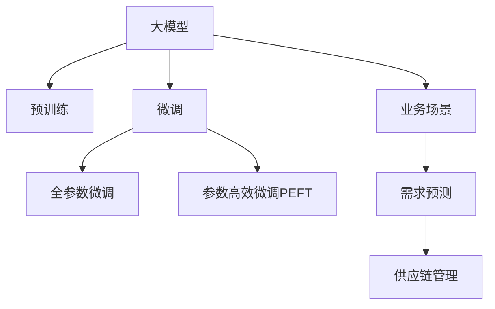

                 

# 大模型在商品库存优化中的应用

> 关键词：大模型,商品库存优化,预训练模型,微调,业务场景,数学模型,项目实践,实际应用,工具推荐,总结

## 1. 背景介绍

### 1.1 问题由来
随着电子商务的蓬勃发展，商品库存管理成为企业提升运营效率、优化资源配置的重要环节。传统的库存管理方法依赖于简单的统计和经验判断，难以适应复杂多变的市场需求和供应链变化。因此，企业亟需一种基于先进技术的高效、智能的库存优化方法，以最大化收益、减少损失。

### 1.2 问题核心关键点
大语言模型在自然语言处理领域的成功应用，启发人们探索其在商品库存优化中的应用潜力。大模型通过对海量无标签文本进行预训练，学习到丰富的语言知识和常识，可以通过微调来适应特定的业务场景，实现预测和优化。

### 1.3 问题研究意义
研究大模型在商品库存优化中的应用，对于提升企业库存管理水平，降低库存成本，提高供应链响应速度，具有重要意义：

1. 提高预测准确度。大模型基于复杂的数据特征建模，能够更准确地预测需求变化。
2. 优化库存水平。通过动态调整库存，企业可以避免库存过高或过低的风险。
3. 提升供应链效率。结合物流和仓储系统，可以实现库存的智能调度和优化。
4. 降低运营成本。精确的库存管理可以减少不必要的物流、仓储开支。
5. 应对市场变化。大模型可以快速学习新数据，适应市场动态变化。

## 2. 核心概念与联系

### 2.1 核心概念概述

为了更好地理解大模型在商品库存优化中的应用，本节将介绍几个密切相关的核心概念：

- 大模型(Large Model)：以自回归或自编码模型为代表的大规模预训练语言模型。通过在大规模无标签文本语料上进行预训练，学习到丰富的语言知识和常识。

- 预训练(Pre-training)：指在大规模无标签文本语料上，通过自监督学习任务训练通用语言模型的过程。常见的预训练任务包括言语建模、掩码语言模型等。

- 微调(Fine-tuning)：指在预训练模型的基础上，使用下游任务的少量标注数据，通过有监督学习优化模型在特定任务上的性能。通常只需要调整顶层分类器或解码器，并以较小的学习率更新全部或部分的模型参数。

- 迁移学习(Transfer Learning)：指将一个领域学习到的知识，迁移应用到另一个不同但相关的领域的学习范式。大模型的预训练-微调过程即是一种典型的迁移学习方式。

- 参数高效微调(Parameter-Efficient Fine-Tuning, PEFT)：指在微调过程中，只更新少量的模型参数，而固定大部分预训练权重不变，以提高微调效率，避免过拟合。

- 业务场景(Business Scenario)：大模型在实际应用中，需要与具体的业务场景相结合，进行模型微调，以解决特定的业务问题。

- 需求预测(Demand Forecasting)：通过预测未来需求，指导库存管理决策，实现精准的库存优化。

- 供应链管理(Supply Chain Management)：结合库存管理、物流和仓储，优化整体供应链，提升效率和响应速度。

这些核心概念之间的逻辑关系可以通过以下Mermaid流程图来展示：



这个流程图展示了大模型的核心概念及其之间的关系：

1. 大模型通过预训练获得基础能力。
2. 微调是对预训练模型进行任务特定的优化，可以分为全参数微调和参数高效微调（PEFT）。
3. 需求预测是一个典型的下游任务，通过微调大模型可以准确预测需求，从而指导库存管理。
4. 供应链管理是一个复杂的多任务场景，大模型可以与物流、仓储等系统进行集成，实现智能调度。

这些概念共同构成了大模型在商品库存优化中的应用框架，使其能够更好地应用于实际业务中。

## 3. 核心算法原理 & 具体操作步骤
### 3.1 算法原理概述

大模型在商品库存优化中的应用，本质上是利用大模型的语言理解和生成能力，结合业务场景，进行需求预测和供应链优化。其核心思想是：将大模型视作一个强大的"需求预测器"，通过微调来优化其对未来需求变化的预测准确度，从而指导库存管理。

具体而言，大模型在预训练阶段学习到大量的语言知识，包括语法、语义、常识等。通过微调，可以针对特定业务场景，进一步提升模型的预测能力，使其能够更准确地估计未来需求，从而优化库存水平，提升供应链效率。

### 3.2 算法步骤详解

基于大模型的商品库存优化，一般包括以下几个关键步骤：

**Step 1: 准备预训练模型和数据集**
- 选择合适的预训练语言模型 $M_{\theta}$ 作为初始化参数，如 BERT、GPT等。
- 收集商品库存相关的数据集 $D=\{(x_i,y_i)\}_{i=1}^N$，其中 $x_i$ 为历史需求数据，$y_i$ 为预测目标。

**Step 2: 添加任务适配层**
- 根据需求预测任务，在预训练模型顶层设计合适的输出层和损失函数。
- 对于回归任务，通常在顶层添加线性回归层和均方误差损失函数。
- 对于分类任务，通常使用交叉熵损失函数。

**Step 3: 设置微调超参数**
- 选择合适的优化算法及其参数，如 AdamW、SGD 等，设置学习率、批大小、迭代轮数等。
- 设置正则化技术及强度，包括权重衰减、Dropout、Early Stopping 等。
- 确定冻结预训练参数的策略，如仅微调顶层，或全部参数都参与微调。

**Step 4: 执行梯度训练**
- 将训练集数据分批次输入模型，前向传播计算损失函数。
- 反向传播计算参数梯度，根据设定的优化算法和学习率更新模型参数。
- 周期性在验证集上评估模型性能，根据性能指标决定是否触发 Early Stopping。
- 重复上述步骤直到满足预设的迭代轮数或 Early Stopping 条件。

**Step 5: 测试和部署**
- 在测试集上评估微调后模型 $M_{\hat{\theta}}$ 的性能，对比微调前后的精度提升。
- 使用微调后的模型对新样本进行预测，结合物流和仓储系统，实现库存智能调度。

以上是基于大模型的商品库存优化的一般流程。在实际应用中，还需要针对具体业务场景进行优化设计，如改进训练目标函数，引入更多的正则化技术，搜索最优的超参数组合等，以进一步提升模型性能。

### 3.3 算法优缺点

基于大模型的商品库存优化方法具有以下优点：
1. 数据需求较低。大模型已经在大规模无标签文本上进行了预训练，只需要少量的标注数据即可完成微调。
2. 预测准确度高。大模型利用了复杂的语言知识和常识，能够更准确地预测未来需求。
3. 适应性强。通过微调，大模型可以适应不同的业务场景，如快消品、重工业品等。
4. 集成性强。大模型可以与其他业务系统进行集成，如ERP、物流管理系统等，实现更全面的业务优化。

同时，该方法也存在一定的局限性：
1. 初始化参数的质量对微调效果有重要影响。预训练模型的初始化参数如果过于简单，微调效果可能不理想。
2. 微调过程对计算资源有较高要求。大模型的参数量较大，微调过程需要大量的计算资源。
3. 模型泛化能力有限。当微调数据与预训练数据的分布差异较大时，微调效果可能不佳。
4. 模型的解释性不足。微调模型的内部工作机制难以解释，难以进行调试和优化。

尽管存在这些局限性，但就目前而言，基于大模型的微调方法在商品库存优化中的应用仍是一个有前景的研究方向。未来相关研究的重点在于如何进一步降低计算资源需求，提高模型的泛化能力，同时兼顾可解释性和可控性等因素。

### 3.4 算法应用领域

基于大模型的商品库存优化方法已经在多个行业领域得到应用，如零售、制造、物流等。以下是几个典型的应用场景：

- **零售行业**：通过微调大模型，实时预测消费者需求，优化商品库存水平，减少缺货和库存积压。
- **制造行业**：结合生产计划和供应链管理，预测原材料需求，优化供应链库存，降低生产成本。
- **物流行业**：预测货物运输需求，合理规划运输路线，提升物流效率，降低运输成本。
- **电商行业**：预测用户行为和购买意向，优化库存布局和销售策略，提升用户体验。

除了上述这些经典应用外，大模型还被创新性地应用于更复杂的场景中，如多渠道库存优化、供应链风险管理、智能定价等，为供应链管理带来全新的突破。随着预训练模型和微调方法的不断进步，相信基于大模型的库存优化方法将在更多领域得到应用，为供应链管理提供新的解决方案。

## 4. 数学模型和公式 & 详细讲解
### 4.1 数学模型构建

在本节中，我们将使用数学语言对基于大模型的商品库存优化过程进行严格刻画。

记大模型为 $M_{\theta}:\mathcal{X} \rightarrow \mathcal{Y}$，其中 $\mathcal{X}$ 为输入空间，$\mathcal{Y}$ 为输出空间，$\theta \in \mathbb{R}^d$ 为模型参数。假设库存预测任务为回归任务，目标函数为 $\ell(M_{\theta}(x),y)$，则在数据集 $D=\{(x_i,y_i)\}_{i=1}^N$ 上的经验风险为：

$$
\mathcal{L}(\theta) = \frac{1}{N}\sum_{i=1}^N (\hat{y}_i - y_i)^2
$$

其中 $\hat{y}_i = M_{\theta}(x_i)$ 表示模型对历史数据的预测结果，$y_i$ 为真实标签。微调的优化目标是最小化经验风险，即找到最优参数：

$$
\theta^* = \mathop{\arg\min}_{\theta} \mathcal{L}(\theta)
$$

在实践中，我们通常使用基于梯度的优化算法（如SGD、Adam等）来近似求解上述最优化问题。设 $\eta$ 为学习率，$\lambda$ 为正则化系数，则参数的更新公式为：

$$
\theta \leftarrow \theta - \eta \nabla_{\theta}\mathcal{L}(\theta) - \eta\lambda\theta
$$

其中 $\nabla_{\theta}\mathcal{L}(\theta)$ 为损失函数对参数 $\theta$ 的梯度，可通过反向传播算法高效计算。

### 4.2 公式推导过程

以下我们以回归任务为例，推导均方误差损失函数及其梯度的计算公式。

假设模型 $M_{\theta}$ 在输入 $x$ 上的输出为 $\hat{y}=M_{\theta}(x) \in \mathbb{R}$，表示预测需求值。真实标签 $y \in \mathbb{R}$。则均方误差损失函数定义为：

$$
\ell(M_{\theta}(x),y) = (\hat{y} - y)^2
$$

将其代入经验风险公式，得：

$$
\mathcal{L}(\theta) = \frac{1}{N}\sum_{i=1}^N (\hat{y}_i - y_i)^2
$$

根据链式法则，损失函数对参数 $\theta_k$ 的梯度为：

$$
\frac{\partial \mathcal{L}(\theta)}{\partial \theta_k} = -\frac{2}{N}\sum_{i=1}^N \frac{\partial \hat{y}_i}{\partial \theta_k} (\hat{y}_i - y_i)
$$

其中 $\frac{\partial \hat{y}_i}{\partial \theta_k}$ 可进一步递归展开，利用自动微分技术完成计算。

在得到损失函数的梯度后，即可带入参数更新公式，完成模型的迭代优化。重复上述过程直至收敛，最终得到适应下游任务的最优模型参数 $\theta^*$。

## 5. 项目实践：代码实例和详细解释说明
### 5.1 开发环境搭建

在进行商品库存优化微调实践前，我们需要准备好开发环境。以下是使用Python进行PyTorch开发的环境配置流程：

1. 安装Anaconda：从官网下载并安装Anaconda，用于创建独立的Python环境。

2. 创建并激活虚拟环境：
```bash
conda create -n pytorch-env python=3.8 
conda activate pytorch-env
```

3. 安装PyTorch：根据CUDA版本，从官网获取对应的安装命令。例如：
```bash
conda install pytorch torchvision torchaudio cudatoolkit=11.1 -c pytorch -c conda-forge
```

4. 安装Transformers库：
```bash
pip install transformers
```

5. 安装各类工具包：
```bash
pip install numpy pandas scikit-learn matplotlib tqdm jupyter notebook ipython
```

完成上述步骤后，即可在`pytorch-env`环境中开始微调实践。

### 5.2 源代码详细实现

这里我们以需求预测任务为例，给出使用Transformers库对BERT模型进行微调的PyTorch代码实现。

首先，定义需求预测任务的数据处理函数：

```python
from transformers import BertTokenizer
from torch.utils.data import Dataset
import torch

class DemandDataset(Dataset):
    def __init__(self, histories, targets, tokenizer, max_len=128):
        self.histories = histories
        self.targets = targets
        self.tokenizer = tokenizer
        self.max_len = max_len
        
    def __len__(self):
        return len(self.histories)
    
    def __getitem__(self, item):
        history = self.histories[item]
        target = self.targets[item]
        
        encoding = self.tokenizer(history, return_tensors='pt', max_length=self.max_len, padding='max_length', truncation=True)
        input_ids = encoding['input_ids'][0]
        attention_mask = encoding['attention_mask'][0]
        
        # 将目标值进行编码
        target = target.to(torch.float32)
        
        return {'input_ids': input_ids, 
                'attention_mask': attention_mask,
                'target': target}

# 定义目标与id的映射
target2id = {0: 'low', 1: 'normal', 2: 'high'}

# 创建dataset
tokenizer = BertTokenizer.from_pretrained('bert-base-cased')

train_dataset = DemandDataset(train_histories, train_targets, tokenizer)
dev_dataset = DemandDataset(dev_histories, dev_targets, tokenizer)
test_dataset = DemandDataset(test_histories, test_targets, tokenizer)
```

然后，定义模型和优化器：

```python
from transformers import BertForRegression, AdamW

model = BertForRegression.from_pretrained('bert-base-cased', num_labels=3)

optimizer = AdamW(model.parameters(), lr=2e-5)
```

接着，定义训练和评估函数：

```python
from torch.utils.data import DataLoader
from tqdm import tqdm
from sklearn.metrics import mean_squared_error

device = torch.device('cuda') if torch.cuda.is_available() else torch.device('cpu')
model.to(device)

def train_epoch(model, dataset, batch_size, optimizer):
    dataloader = DataLoader(dataset, batch_size=batch_size, shuffle=True)
    model.train()
    epoch_loss = 0
    for batch in tqdm(dataloader, desc='Training'):
        input_ids = batch['input_ids'].to(device)
        attention_mask = batch['attention_mask'].to(device)
        targets = batch['target'].to(device)
        model.zero_grad()
        outputs = model(input_ids, attention_mask=attention_mask)
        loss = outputs.loss
        epoch_loss += loss.item()
        loss.backward()
        optimizer.step()
    return epoch_loss / len(dataloader)

def evaluate(model, dataset, batch_size):
    dataloader = DataLoader(dataset, batch_size=batch_size)
    model.eval()
    mse = 0
    with torch.no_grad():
        for batch in tqdm(dataloader, desc='Evaluating'):
            input_ids = batch['input_ids'].to(device)
            attention_mask = batch['attention_mask'].to(device)
            targets = batch['target'].to(device)
            outputs = model(input_ids, attention_mask=attention_mask)
            mse += mean_squared_error(targets, outputs.logits.detach())
        print(f'MSE: {mse / len(dataloader):.4f}')
```

最后，启动训练流程并在测试集上评估：

```python
epochs = 5
batch_size = 16

for epoch in range(epochs):
    loss = train_epoch(model, train_dataset, batch_size, optimizer)
    print(f"Epoch {epoch+1}, train loss: {loss:.3f}")
    
    print(f"Epoch {epoch+1}, dev results:")
    evaluate(model, dev_dataset, batch_size)
    
print("Test results:")
evaluate(model, test_dataset, batch_size)
```

以上就是使用PyTorch对BERT进行需求预测任务微调的完整代码实现。可以看到，得益于Transformers库的强大封装，我们可以用相对简洁的代码完成BERT模型的加载和微调。

### 5.3 代码解读与分析

让我们再详细解读一下关键代码的实现细节：

**DemandDataset类**：
- `__init__`方法：初始化历史数据、目标值、分词器等关键组件。
- `__len__`方法：返回数据集的样本数量。
- `__getitem__`方法：对单个样本进行处理，将历史数据输入编码为token ids，将目标值进行编码，并对其进行定长padding，最终返回模型所需的输入。

**target2id字典**：
- 定义了目标值与数字id之间的映射关系，用于将模型输出解码回真实需求标签。

**训练和评估函数**：
- 使用PyTorch的DataLoader对数据集进行批次化加载，供模型训练和推理使用。
- 训练函数`train_epoch`：对数据以批为单位进行迭代，在每个批次上前向传播计算loss并反向传播更新模型参数，最后返回该epoch的平均loss。
- 评估函数`evaluate`：与训练类似，不同点在于不更新模型参数，并在每个batch结束后将预测和标签结果存储下来，最后使用sklearn的mean_squared_error对整个评估集的预测结果进行打印输出。

**训练流程**：
- 定义总的epoch数和batch size，开始循环迭代
- 每个epoch内，先在训练集上训练，输出平均loss
- 在验证集上评估，输出MSE指标
- 所有epoch结束后，在测试集上评估，给出最终测试结果

可以看到，PyTorch配合Transformers库使得BERT微调的需求预测任务代码实现变得简洁高效。开发者可以将更多精力放在数据处理、模型改进等高层逻辑上，而不必过多关注底层的实现细节。

当然，工业级的系统实现还需考虑更多因素，如模型的保存和部署、超参数的自动搜索、更灵活的任务适配层等。但核心的微调范式基本与此类似。

## 6. 实际应用场景
### 6.1 智能仓库管理

大语言模型在商品库存优化中的应用，在智能仓库管理方面具有重要意义。通过微调，大模型可以实时预测库存水平，自动生成补货计划，优化仓库布局和物流路线，从而提升库存管理效率，减少人工干预。

在技术实现上，可以收集仓库内的历史库存数据和订单数据，将数据输入模型进行微调。微调后的模型可以预测未来的库存需求，动态调整补货量，生成仓库出货计划。同时，结合物流系统，可以实时监测物流状态，自动调整配送路线，优化物流成本。

### 6.2 供应链协同优化

大语言模型还可以在供应链协同优化中发挥重要作用。通过微调，大模型可以预测原材料需求、生产计划和物流需求，优化供应链的整体协调。

在具体实现中，可以建立供应链管理的数字孪生模型，将企业内部的各种系统集成到统一的大模型中。模型可以实时采集供应链数据，进行预测和优化，生成供应链优化建议。同时，模型可以与ERP、物流管理系统等集成，实现供应链的智能调度和管理。

### 6.3 电商平台库存管理

电商平台的大语言模型微调，可以实现更精确的需求预测，提升库存管理的智能化水平。通过微调，模型可以预测用户的行为和购买意向，动态调整库存水平，避免缺货和积压。

在具体应用中，可以收集用户的历史浏览、购买、评论等数据，输入模型进行微调。微调后的模型可以实时预测用户需求，动态调整库存布局和补货计划，优化用户体验。同时，模型可以与物流系统集成，生成动态的物流调度和仓储方案。

### 6.4 未来应用展望

随着大语言模型和微调方法的不断发展，基于大模型的商品库存优化技术将呈现以下几个发展趋势：

1. 模型规模持续增大。随着算力成本的下降和数据规模的扩张，预训练语言模型的参数量还将持续增长。超大规模语言模型蕴含的丰富语言知识，有望支撑更加复杂多变的库存优化任务。

2. 微调方法日趋多样。除了传统的全参数微调外，未来会涌现更多参数高效的微调方法，如Prompt-based Fine-Tuning、LoRA等，在节省计算资源的同时也能保证微调精度。

3. 持续学习成为常态。随着数据分布的不断变化，微调模型也需要持续学习新知识以保持性能。如何在不遗忘原有知识的同时，高效吸收新样本信息，将成为重要的研究课题。

4. 标注样本需求降低。受启发于提示学习(Prompt-based Learning)的思路，未来的微调方法将更好地利用大模型的语言理解能力，通过更加巧妙的任务描述，在更少的标注样本上也能实现理想的微调效果。

5. 知识整合能力增强。将符号化的先验知识，如知识图谱、逻辑规则等，与神经网络模型进行巧妙融合，引导微调过程学习更准确、合理的库存优化模型。

6. 更多业务场景的拓展。随着微调模型的泛化能力增强，其在更多业务场景中的应用也将不断拓展，如能源、金融、制造业等。

以上趋势凸显了大语言模型微调技术在商品库存优化领域的广阔前景。这些方向的探索发展，必将进一步提升库存管理水平，为各行各业带来新的价值提升。

## 7. 工具和资源推荐
### 7.1 学习资源推荐

为了帮助开发者系统掌握大语言模型在商品库存优化中的应用理论基础和实践技巧，这里推荐一些优质的学习资源：

1. 《Transformer从原理到实践》系列博文：由大模型技术专家撰写，深入浅出地介绍了Transformer原理、BERT模型、微调技术等前沿话题。

2. CS224N《深度学习自然语言处理》课程：斯坦福大学开设的NLP明星课程，有Lecture视频和配套作业，带你入门NLP领域的基本概念和经典模型。

3. 《Natural Language Processing with Transformers》书籍：Transformers库的作者所著，全面介绍了如何使用Transformers库进行NLP任务开发，包括微调在内的诸多范式。

4. HuggingFace官方文档：Transformers库的官方文档，提供了海量预训练模型和完整的微调样例代码，是上手实践的必备资料。

5. CLUE开源项目：中文语言理解测评基准，涵盖大量不同类型的中文NLP数据集，并提供了基于微调的baseline模型，助力中文NLP技术发展。

通过对这些资源的学习实践，相信你一定能够快速掌握大语言模型在商品库存优化中的应用精髓，并用于解决实际的NLP问题。
### 7.2 开发工具推荐

高效的开发离不开优秀的工具支持。以下是几款用于大语言模型微调开发的常用工具：

1. PyTorch：基于Python的开源深度学习框架，灵活动态的计算图，适合快速迭代研究。大部分预训练语言模型都有PyTorch版本的实现。

2. TensorFlow：由Google主导开发的开源深度学习框架，生产部署方便，适合大规模工程应用。同样有丰富的预训练语言模型资源。

3. Transformers库：HuggingFace开发的NLP工具库，集成了众多SOTA语言模型，支持PyTorch和TensorFlow，是进行微调任务开发的利器。

4. Weights & Biases：模型训练的实验跟踪工具，可以记录和可视化模型训练过程中的各项指标，方便对比和调优。与主流深度学习框架无缝集成。

5. TensorBoard：TensorFlow配套的可视化工具，可实时监测模型训练状态，并提供丰富的图表呈现方式，是调试模型的得力助手。

6. Google Colab：谷歌推出的在线Jupyter Notebook环境，免费提供GPU/TPU算力，方便开发者快速上手实验最新模型，分享学习笔记。

合理利用这些工具，可以显著提升大语言模型微调的开发效率，加快创新迭代的步伐。

### 7.3 相关论文推荐

大语言模型和微调技术的发展源于学界的持续研究。以下是几篇奠基性的相关论文，推荐阅读：

1. Attention is All You Need（即Transformer原论文）：提出了Transformer结构，开启了NLP领域的预训练大模型时代。

2. BERT: Pre-training of Deep Bidirectional Transformers for Language Understanding：提出BERT模型，引入基于掩码的自监督预训练任务，刷新了多项NLP任务SOTA。

3. Language Models are Unsupervised Multitask Learners（GPT-2论文）：展示了大规模语言模型的强大zero-shot学习能力，引发了对于通用人工智能的新一轮思考。

4. Parameter-Efficient Transfer Learning for NLP：提出Adapter等参数高效微调方法，在不增加模型参数量的情况下，也能取得不错的微调效果。

5. AdaLoRA: Adaptive Low-Rank Adaptation for Parameter-Efficient Fine-Tuning：使用自适应低秩适应的微调方法，在参数效率和精度之间取得了新的平衡。

这些论文代表了大语言模型微调技术的发展脉络。通过学习这些前沿成果，可以帮助研究者把握学科前进方向，激发更多的创新灵感。

## 8. 总结：未来发展趋势与挑战
### 8.1 总结

本文对基于大模型的商品库存优化方法进行了全面系统的介绍。首先阐述了大语言模型和微调技术在商品库存管理中的研究背景和意义，明确了微调在提升库存管理水平、降低库存成本、提高供应链效率等方面的独特价值。其次，从原理到实践，详细讲解了基于大模型的商品库存优化过程，包括数据准备、模型微调、性能评估等关键步骤，给出了微调任务开发的完整代码实例。同时，本文还广泛探讨了商品库存优化的实际应用场景，展示了微调范式的巨大潜力。此外，本文精选了微调技术的各类学习资源，力求为读者提供全方位的技术指引。

通过本文的系统梳理，可以看到，基于大模型的商品库存优化方法正在成为库存管理领域的重要范式，极大地拓展了库存管理应用的边界，催生了更多的落地场景。受益于大规模语料的预训练和微调技术的演进，基于大模型的库存优化方法有望在更多行业得到应用，为库存管理带来新的解决方案。未来，伴随预训练语言模型和微调方法的持续进步，相信基于大模型的库存优化方法将在更广泛的应用领域大放异彩，深刻影响企业的运营管理和供应链优化。

### 8.2 未来发展趋势

展望未来，大语言模型在商品库存优化中的应用将呈现以下几个发展趋势：

1. 模型规模持续增大。随着算力成本的下降和数据规模的扩张，预训练语言模型的参数量还将持续增长。超大规模语言模型蕴含的丰富语言知识，有望支撑更加复杂多变的库存优化任务。

2. 微调方法日趋多样。除了传统的全参数微调外，未来会涌现更多参数高效的微调方法，如Prompt-based Fine-Tuning、LoRA等，在节省计算资源的同时也能保证微调精度。

3. 持续学习成为常态。随着数据分布的不断变化，微调模型也需要持续学习新知识以保持性能。如何在不遗忘原有知识的同时，高效吸收新样本信息，将成为重要的研究课题。

4. 标注样本需求降低。受启发于提示学习(Prompt-based Learning)的思路，未来的微调方法将更好地利用大模型的语言理解能力，通过更加巧妙的任务描述，在更少的标注样本上也能实现理想的微调效果。

5. 知识整合能力增强。将符号化的先验知识，如知识图谱、逻辑规则等，与神经网络模型进行巧妙融合，引导微调过程学习更准确、合理的库存优化模型。

6. 更多业务场景的拓展。随着微调模型的泛化能力增强，其在更多业务场景中的应用也将不断拓展，如能源、金融、制造业等。

以上趋势凸显了大语言模型在商品库存优化中的广阔前景。这些方向的探索发展，必将进一步提升库存管理水平，为各行各业带来新的价值提升。

### 8.3 面临的挑战

尽管大语言模型在商品库存优化中的应用前景广阔，但在实现过程中仍面临诸多挑战：

1. 标注成本瓶颈。虽然微调对标注样本的需求较低，但对于一些特定领域（如医药、金融等），高质量标注数据的获取成本较高，成为制约微调效果的关键因素。如何进一步降低微调对标注样本的依赖，将是一大难题。

2. 模型鲁棒性不足。当前微调模型面对域外数据时，泛化性能往往大打折扣。对于测试样本的微小扰动，微调模型的预测也容易发生波动。如何提高微调模型的鲁棒性，避免灾难性遗忘，还需要更多理论和实践的积累。

3. 推理效率有待提高。大规模语言模型虽然精度高，但在实际部署时往往面临推理速度慢、内存占用大等效率问题。如何在保证性能的同时，简化模型结构，提升推理速度，优化资源占用，将是重要的优化方向。

4. 模型的解释性不足。当前微调模型更像是"黑盒"系统，难以解释其内部工作机制和决策逻辑。对于高风险应用（如医疗、金融），算法的可解释性和可审计性尤为重要。如何赋予微调模型更强的可解释性，将是亟待攻克的难题。

5. 安全性有待保障。预训练语言模型难免会学习到有偏见、有害的信息，通过微调传递到下游任务，产生误导性、歧视性的输出，给实际应用带来安全隐患。如何从数据和算法层面消除模型偏见，避免恶意用途，确保输出的安全性，也将是重要的研究课题。

6. 知识整合能力不足。现有的微调模型往往局限于任务内数据，难以灵活吸收和运用更广泛的先验知识。如何让微调过程更好地与外部知识库、规则库等专家知识结合，形成更加全面、准确的信息整合能力，还有很大的想象空间。

正视微调面临的这些挑战，积极应对并寻求突破，将是大语言模型在商品库存优化中走向成熟的必由之路。相信随着学界和产业界的共同努力，这些挑战终将一一被克服，大语言模型在商品库存优化中的应用必将带来新的突破和创新。

### 8.4 研究展望

面对大语言模型在商品库存优化中所面临的挑战，未来的研究需要在以下几个方面寻求新的突破：

1. 探索无监督和半监督微调方法。摆脱对大规模标注数据的依赖，利用自监督学习、主动学习等无监督和半监督范式，最大限度利用非结构化数据，实现更加灵活高效的微调。

2. 研究参数高效和计算高效的微调范式。开发更加参数高效的微调方法，在固定大部分预训练参数的同时，只更新极少量的任务相关参数。同时优化微调模型的计算图，减少前向传播和反向传播的资源消耗，实现更加轻量级、实时性的部署。

3. 引入因果和对比学习范式。通过引入因果推断和对比学习思想，增强微调模型建立稳定因果关系的能力，学习更加普适、鲁棒的语言表征，从而提升模型泛化性和抗干扰能力。

4. 纳入伦理道德约束。在模型训练目标中引入伦理导向的评估指标，过滤和惩罚有偏见、有害的输出倾向。同时加强人工干预和审核，建立模型行为的监管机制，确保输出符合人类价值观和伦理道德。

5. 结合因果分析和博弈论工具。将因果分析方法引入微调模型，识别出模型决策的关键特征，增强输出解释的因果性和逻辑性。借助博弈论工具刻画人机交互过程，主动探索并规避模型的脆弱点，提高系统稳定性。

6. 更多的先验知识整合。将符号化的先验知识，如知识图谱、逻辑规则等，与神经网络模型进行巧妙融合，引导微调过程学习更准确、合理的库存优化模型。同时加强不同模态数据的整合，实现视觉、语音等多模态信息与文本信息的协同建模。

这些研究方向的探索，必将引领大语言模型在商品库存优化中的应用走向更高的台阶，为构建安全、可靠、可解释、可控的库存管理系统铺平道路。面向未来，大语言模型在商品库存优化中的应用还需要与其他人工智能技术进行更深入的融合，如知识表示、因果推理、强化学习等，多路径协同发力，共同推动库存管理的进步。只有勇于创新、敢于突破，才能不断拓展库存管理系统的边界，让智能技术更好地服务于人类社会的生产与管理。

## 9. 附录：常见问题与解答

**Q1：大语言模型微调是否适用于所有库存管理场景？**

A: 大语言模型微调在大多数库存管理场景中都能取得不错的效果，特别是对于数据量较小的场景。但对于一些特定领域的库存管理，如医药、金融等，仅仅依靠通用语料预训练的模型可能难以很好地适应。此时需要在特定领域语料上进一步预训练，再进行微调，才能获得理想效果。此外，对于一些需要时效性、个性化很强的场景，如智能仓库、供应链管理等，微调方法也需要针对性的改进优化。

**Q2：微调过程中如何选择合适的学习率？**

A: 微调的学习率一般要比预训练时小1-2个数量级，如果使用过大的学习率，容易破坏预训练权重，导致过拟合。一般建议从1e-5开始调参，逐步减小学习率，直至收敛。也可以使用warmup策略，在开始阶段使用较小的学习率，再逐渐过渡到预设值。需要注意的是，不同的优化器(如AdamW、Adafactor等)以及不同的学习率调度策略，可能需要设置不同的学习率阈值。

**Q3：采用大模型微调时会面临哪些资源瓶颈？**

A: 目前主流的预训练大模型动辄以亿计的参数规模，对算力、内存、存储都提出了很高的要求。GPU/TPU等高性能设备是必不可少的，但即便如此，超大批次的训练和推理也可能遇到显存不足的问题。因此需要采用一些资源优化技术，如梯度积累、混合精度训练、模型并行等，来突破硬件瓶颈。同时，模型的存储和读取也可能占用大量时间和空间，需要采用模型压缩、稀疏化存储等方法进行优化。

**Q4：如何缓解微调过程中的过拟合问题？**

A: 过拟合是微调面临的主要挑战，尤其是在标注数据不足的情况下。常见的缓解策略包括：
1. 数据增强：通过回译、近义替换等方式扩充训练集
2. 正则化：使用L2正则、Dropout、Early Stopping 等避免过拟合
3. 对抗训练：引入对抗样本，提高模型鲁棒性
4. 参数高效微调：只调整少量参数(如Adapter、Prefix等)，减小过拟合风险
5. 多模型集成：训练多个微调模型，取平均输出，抑制过拟合

这些策略往往需要根据具体任务和数据特点进行灵活组合。只有在数据、模型、训练、推理等各环节进行全面优化，才能最大限度地发挥大模型微调的威力。

**Q5：大语言模型微调在库存优化中的应用有何优势？**

A: 大语言模型在库存优化中的应用具有以下优势：
1. 数据需求较低。大模型已经在大规模无标签文本上进行了预训练，只需要少量的标注数据即可完成微调。
2. 预测准确度高。大模型利用了复杂的语言知识和常识，能够更准确地预测未来需求。
3. 适应性强。通过微调，大模型可以适应不同的业务场景，如快消品、重工业品等。
4. 集成性强。大模型可以与其他业务系统进行集成，如ERP、物流管理系统等，实现智能调度。

这些优势使得大语言模型在库存优化中具有广泛的应用前景，能够显著提升库存管理水平，降低运营成本，提高供应链响应速度。

---

作者：禅与计算机程序设计艺术 / Zen and the Art of Computer Programming

