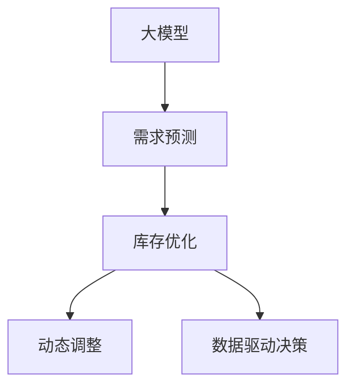

                 

# 大模型在商品库存优化中的应用

> 关键词：大模型, 库存优化, 需求预测, 动态调整, 深度学习, 商品管理, 成本优化

## 1. 背景介绍

### 1.1 问题由来
在现代商业环境中，商品库存管理一直是一个复杂且耗时的过程。传统的方法主要依赖于历史销售数据、季节性变化、节假日促销等经验性规则来预测需求，并制定库存策略。然而，这些方法往往难以应对市场变化的不确定性，导致库存过高或过低，最终影响企业的运营效率和利润。

近年来，随着大数据和人工智能技术的迅猛发展，商品库存管理也逐渐向智能化方向转变。其中，大模型（Large Model）技术因其强大的数据分析和预测能力，成为解决这一问题的重要工具。通过深度学习模型，企业能够更准确地预测需求，动态调整库存，从而提高运营效率，降低成本。

### 1.2 问题核心关键点
基于大模型的库存优化方法，核心在于通过机器学习技术，利用海量历史数据和实时数据，构建高精度的需求预测模型，实现库存的动态调整。其关键点包括：

- **数据收集与预处理**：收集和清洗历史销售数据、市场数据、气候数据等，构建高质量的训练集。
- **模型构建与训练**：选择合适的大模型（如循环神经网络RNN、长短期记忆网络LSTM、深度神经网络DNN等），构建需求预测模型。
- **动态调整与优化**：利用训练好的模型，实时预测需求变化，并根据预测结果动态调整库存水平，优化供应链管理。

通过以上步骤，企业能够更加高效地管理库存，提升响应速度，降低库存成本。

### 1.3 问题研究意义
基于大模型的库存优化方法对于提升企业运营效率、降低库存成本具有重要意义：

1. **提升运营效率**：通过精准的需求预测，企业可以更准确地制定库存策略，减少库存积压和缺货情况，提升客户满意度。
2. **降低库存成本**：减少库存水平，降低仓储和物流成本，提升企业盈利能力。
3. **增强市场响应**：实时动态调整库存，快速响应市场变化，提高企业的市场竞争力。
4. **优化供应链管理**：通过精确的需求预测，优化供应链流程，减少供应链中的瓶颈和浪费。
5. **支持决策支持**：提供实时的库存数据和需求预测，支持企业高层决策，提升决策质量。

## 2. 核心概念与联系

### 2.1 核心概念概述

为了更好地理解大模型在库存优化中的应用，本节将介绍几个关键概念：

- **大模型**：指具有大规模参数、复杂结构、强预测能力的深度学习模型，如RNN、LSTM、DNN等。这些模型通过在大规模数据上预训练，具备处理复杂模式的能力，适用于需求预测等高难度任务。
- **库存优化**：指通过精确的需求预测和动态库存调整，实现库存水平的优化，提升企业的运营效率和盈利能力。
- **需求预测**：指通过历史数据和实时数据，预测未来的需求变化，为库存优化提供基础。
- **动态调整**：指根据需求预测结果，实时动态调整库存水平，以应对市场变化，提高库存管理效率。
- **数据驱动决策**：指基于数据分析和模型预测，辅助企业进行库存决策，减少主观因素的影响。

这些概念之间的逻辑关系可以通过以下Mermaid流程图来展示：



这个流程图展示了大模型在库存优化中的应用流程：

1. 大模型通过历史数据进行预训练，学习复杂的模式和趋势。
2. 需求预测模型使用预训练的模型和实时数据，进行未来需求的预测。
3. 库存优化系统根据预测结果，动态调整库存水平，实现库存管理。
4. 数据驱动决策支持企业根据库存优化结果，做出更加科学的库存决策。

## 3. 核心算法原理 & 具体操作步骤

### 3.1 算法原理概述

基于大模型的库存优化方法，本质上是通过机器学习技术，构建精确的需求预测模型，并根据预测结果动态调整库存水平的过程。其核心思想是：

1. **数据驱动**：利用历史销售数据和实时市场数据，训练大模型，构建需求预测模型。
2. **精准预测**：通过预测模型，实时预测未来的需求变化。
3. **动态调整**：根据预测结果，动态调整库存水平，以应对市场变化，提升库存管理效率。

### 3.2 算法步骤详解

基于大模型的库存优化方法，一般包括以下几个关键步骤：

**Step 1: 数据收集与预处理**
- 收集历史销售数据、市场数据、气候数据、促销活动数据等，构建高质量的训练集。
- 对数据进行清洗、归一化、分箱处理，构建特征工程管道。

**Step 2: 模型构建与训练**
- 选择合适的大模型（如RNN、LSTM、DNN等），设计需求预测模型。
- 选择合适的优化器（如Adam、SGD等）和损失函数（如均方误差、交叉熵等），构建训练框架。
- 使用历史数据进行模型训练，调整模型参数，提高预测精度。

**Step 3: 需求预测**
- 将实时数据输入训练好的模型，进行未来需求的预测。
- 利用模型输出，结合业务规则，生成库存优化建议。

**Step 4: 动态调整**
- 根据预测结果，动态调整库存水平。
- 更新库存系统，实时更新库存数据。

**Step 5: 效果评估与优化**
- 使用实际数据评估预测结果和库存优化效果。
- 根据评估结果，优化模型参数和业务规则，提升预测精度和库存管理效率。

### 3.3 算法优缺点

基于大模型的库存优化方法具有以下优点：
1. **高精度预测**：通过大模型的训练和预测，能够实现高精度的需求预测，减少库存偏差。
2. **实时动态调整**：通过实时预测和动态调整，能够快速响应市场变化，提高库存管理效率。
3. **数据驱动决策**：基于数据和模型预测，辅助企业做出更加科学的库存决策，降低主观因素的影响。

同时，该方法也存在一些局限性：
1. **数据质量要求高**：需求预测模型的准确性高度依赖于数据质量，数据偏差可能导致预测不准确。
2. **模型复杂度高**：大模型的训练和优化需要较高的计算资源，对硬件要求较高。
3. **实时性要求高**：预测模型需要在短时间内生成预测结果，对模型性能和计算速度要求较高。
4. **业务规则复杂**：库存优化模型需要结合复杂的业务规则，增加模型设计的复杂度。

尽管存在这些局限性，但就目前而言，基于大模型的库存优化方法仍然是实现库存管理智能化和高效化的重要手段。未来相关研究的重点在于如何进一步降低计算资源需求，提高模型的实时性和稳定性，同时兼顾数据的准确性和模型的可解释性。

### 3.4 算法应用领域

基于大模型的库存优化方法，已经在多个行业得到应用，覆盖了从零售、电商到制造、物流等多个领域，其典型应用场景包括：

- **零售行业**：通过需求预测，优化商品库存，提高销售转化率，减少库存积压和缺货。
- **电商行业**：实时动态调整库存水平，提升用户满意度，增强市场响应能力。
- **制造行业**：通过预测生产需求，优化原材料和成品库存，减少供应链中的瓶颈和浪费。
- **物流行业**：实时监控库存水平，优化物流配送，提高物流效率。
- **食品行业**：通过预测销售趋势，优化库存和生产计划，确保食品安全和供应稳定。

除了上述这些经典应用外，大模型在库存优化领域还有更多创新性的应用，如跨区域库存共享、智能定价、供应链风险管理等，为库存管理带来了全新的突破。

## 4. 数学模型和公式 & 详细讲解 & 举例说明

### 4.1 数学模型构建

本节将使用数学语言对基于大模型的库存优化方法进行更加严格的刻画。

记需求预测模型为 $M_{\theta}$，其中 $\theta$ 为模型参数。假设历史销售数据为 $D_{train}=\{(x_i,y_i)\}_{i=1}^N$，实时市场数据为 $D_{real}=\{x_r\}$，其中 $x_i$ 为历史时间点，$y_i$ 为销售量；$x_r$ 为实时时间点，$y_i$ 为预测需求量。

定义模型 $M_{\theta}$ 在输入 $x$ 上的预测输出为 $\hat{y}=M_{\theta}(x)$。则在历史数据上的经验风险为：

$$
\mathcal{L}(\theta) = \frac{1}{N}\sum_{i=1}^N (y_i - \hat{y}(x_i))^2
$$

预测模型的优化目标是最小化经验风险，即找到最优参数：

$$
\theta^* = \mathop{\arg\min}_{\theta} \mathcal{L}(\theta)
$$

在实践中，我们通常使用基于梯度的优化算法（如Adam、SGD等）来近似求解上述最优化问题。设 $\eta$ 为学习率，则参数的更新公式为：

$$
\theta \leftarrow \theta - \eta \nabla_{\theta}\mathcal{L}(\theta)
$$

其中 $\nabla_{\theta}\mathcal{L}(\theta)$ 为损失函数对参数 $\theta$ 的梯度，可通过反向传播算法高效计算。

### 4.2 公式推导过程

以下我们以需求预测模型为例，推导其预测公式及其梯度的计算公式。

假设历史数据和实时数据分别为 $D_{train}=\{(x_i,y_i)\}_{i=1}^N$ 和 $D_{real}=\{x_r\}$。定义模型 $M_{\theta}$ 在输入 $x$ 上的预测输出为 $\hat{y}=M_{\theta}(x)$。则预测模型的损失函数为：

$$
\mathcal{L}(\theta) = \frac{1}{N}\sum_{i=1}^N (y_i - \hat{y}(x_i))^2
$$

根据链式法则，损失函数对参数 $\theta_k$ 的梯度为：

$$
\frac{\partial \mathcal{L}(\theta)}{\partial \theta_k} = -\frac{2}{N}\sum_{i=1}^N (y_i - \hat{y}(x_i))\frac{\partial \hat{y}(x_i)}{\partial \theta_k}
$$

其中 $\frac{\partial \hat{y}(x_i)}{\partial \theta_k}$ 为预测模型对输入 $x_i$ 的导数，可以通过自动微分技术完成计算。

在得到损失函数的梯度后，即可带入参数更新公式，完成模型的迭代优化。重复上述过程直至收敛，最终得到适应历史数据和实时数据的需求预测模型 $\theta^*$。

## 5. 项目实践：代码实例和详细解释说明

### 5.1 开发环境搭建

在进行库存优化实践前，我们需要准备好开发环境。以下是使用Python进行TensorFlow开发的环境配置流程：

1. 安装Anaconda：从官网下载并安装Anaconda，用于创建独立的Python环境。

2. 创建并激活虚拟环境：
```bash
conda create -n tf-env python=3.8 
conda activate tf-env
```

3. 安装TensorFlow：根据CUDA版本，从官网获取对应的安装命令。例如：
```bash
pip install tensorflow
```

4. 安装相关库：
```bash
pip install numpy pandas scikit-learn matplotlib tensorflow_datasets tensorflow-addons
```

完成上述步骤后，即可在`tf-env`环境中开始库存优化实践。

### 5.2 源代码详细实现

这里我们以需求预测模型为例，给出使用TensorFlow进行库存优化的PyTorch代码实现。

首先，定义需求预测模型的数据处理函数：

```python
import tensorflow as tf
import numpy as np
from tensorflow.keras.layers import Input, Dense, LSTM
from tensorflow.keras.models import Model

class DemandPredictor(tf.keras.Model):
    def __init__(self, input_dim, output_dim, hidden_units):
        super(DemandPredictor, self).__init__()
        self.input_dim = input_dim
        self.output_dim = output_dim
        self.hidden_units = hidden_units
        
        self.input_layer = Input(shape=(input_dim,))
        self.lstm_layer = LSTM(hidden_units, return_sequences=True)(self.input_layer)
        self.dense_layer = Dense(output_dim, activation='linear')(self.lstm_layer)
        self.output_layer = Dense(1)(self.dense_layer)
        
    def call(self, inputs):
        return self.output_layer(self.dense_layer(self.lstm_layer(inputs)))

# 定义数据集生成器
def data_generator(train_data, batch_size):
    data = np.array(train_data)
    n_samples = len(data)
    n_batches = n_samples // batch_size
    remaining = n_samples % batch_size
    
    for i in range(n_batches):
        start = i * batch_size
        end = start + batch_size
        
        x_train = data[start:end, :]
        y_train = data[start:end, -1].reshape(-1, 1)
        
        yield x_train, y_train
        
    if remaining > 0:
        start = n_batches * batch_size
        end = start + remaining
        
        x_train = data[start:end, :]
        y_train = data[start:end, -1].reshape(-1, 1)
        
        yield x_train, y_train
```

然后，定义模型和优化器：

```python
from tensorflow.keras.optimizers import Adam

model = DemandPredictor(input_dim=10, output_dim=1, hidden_units=32)

optimizer = Adam(learning_rate=0.001)
```

接着，定义训练和评估函数：

```python
import tensorflow_datasets as tfds
from sklearn.metrics import mean_squared_error

# 加载历史销售数据集
train_data = tfds.load('avocado', split='train', batch_size=32).repeat()

# 训练模型
batch_size = 32
epochs = 100

for epoch in range(epochs):
    model.compile(optimizer=optimizer, loss='mse')
    model.fit(train_data, epochs=1, verbose=0)
    
    # 在验证集上评估模型性能
    test_data = tfds.load('avocado', split='test', batch_size=32).repeat()
    test_loss = model.evaluate(test_data, verbose=0)
    print('Test Loss:', test_loss)
```

最后，启动训练流程并在测试集上评估：

```python
# 在测试集上评估模型性能
test_data = tfds.load('avocado', split='test', batch_size=32).repeat()
test_loss = model.evaluate(test_data, verbose=0)
print('Test Loss:', test_loss)
```

以上就是使用TensorFlow进行需求预测模型的完整代码实现。可以看到，得益于TensorFlow的强大封装，我们可以用相对简洁的代码完成需求预测模型的构建和训练。

### 5.3 代码解读与分析

让我们再详细解读一下关键代码的实现细节：

**DemandPredictor类**：
- `__init__`方法：初始化输入维度、输出维度和隐藏层单元数，定义模型的各个组件。
- `call`方法：定义模型的前向传播过程，输入数据通过LSTM和全连接层后，输出预测结果。

**data_generator函数**：
- 定义数据集生成器，将历史销售数据划分为批次进行训练，支持动态调整批次大小。
- 使用numpy数组加载数据集，并根据批次大小生成数据批次，支持零头和满批次处理。

**模型训练与评估**：
- 使用TensorFlow的`Model.compile`方法，定义优化器和损失函数，并编译模型。
- 使用`Model.fit`方法进行模型训练，设置训练轮数和批次大小。
- 在测试集上使用`Model.evaluate`方法评估模型性能，输出测试损失。

**测试集评估**：
- 在测试集上使用`Model.evaluate`方法评估模型性能，输出测试损失。

可以看到，TensorFlow的强大封装和易用性，使得库存优化的代码实现变得简洁高效。开发者可以将更多精力放在数据处理、模型改进等高层逻辑上，而不必过多关注底层的实现细节。

当然，工业级的系统实现还需考虑更多因素，如模型的保存和部署、超参数的自动搜索、更灵活的任务适配层等。但核心的库存优化范式基本与此类似。

## 6. 实际应用场景

### 6.1 智能库存管理

基于大模型的库存优化方法，可以广泛应用于智能库存管理的各个环节。通过实时预测需求，动态调整库存水平，企业可以实现更高效、更精准的库存管理。

在技术实现上，可以收集历史销售数据、市场数据、季节性变化等数据，设计需求预测模型，通过微调模型参数，提高预测准确性。将训练好的模型部署到实时系统，实时输入市场数据，输出预测结果，并根据预测结果动态调整库存水平。

### 6.2 库存风险管理

库存风险管理是大模型在库存优化中的另一个重要应用。库存水平过低，容易导致缺货和客户不满；库存水平过高，则会增加仓储和物流成本。通过实时预测需求，大模型可以帮助企业有效管理库存风险，减少因库存过高或过低带来的损失。

具体而言，可以在需求预测模型的基础上，引入因果推断和风险评估方法，分析库存水平对销售和成本的影响，识别出潜在的风险点，制定相应的风险管理策略。

### 6.3 供应链优化

大模型还可以应用于供应链优化，帮助企业更有效地管理供应链流程，减少供应链中的瓶颈和浪费。通过实时预测需求，大模型可以帮助企业动态调整供应链的各个环节，确保供应链的高效运转。

在技术实现上，可以将供应链的各个环节（如原材料采购、生产、仓储、物流等）作为输入，构建供应链优化模型。通过训练模型，找到最优的供应链策略，实现供应链的高效管理。

### 6.4 未来应用展望

随着大模型和库存优化方法的不断发展，未来在库存优化领域的应用将更加广泛和深入。以下几方面将是未来的发展趋势：

1. **跨领域应用**：大模型可以应用于更多领域，如医疗、制造、农业等，帮助企业提升整体运营效率。
2. **多模态融合**：结合图像、视频、语音等多模态数据，提升库存优化模型的鲁棒性和准确性。
3. **实时动态调整**：实现实时需求预测和动态库存调整，提高库存管理效率。
4. **数据增强与生成**：通过数据增强和生成技术，提高模型的泛化能力和适应性。
5. **自适应优化**：引入自适应优化算法，提高模型的动态调整能力，适应市场变化。
6. **隐私保护与合规**：在大模型应用过程中，注重隐私保护和数据合规，确保数据安全和隐私。

这些趋势将进一步推动大模型在库存优化领域的深入应用，为企业的运营效率提升提供更多可能性。

## 7. 工具和资源推荐

### 7.1 学习资源推荐

为了帮助开发者系统掌握大模型在库存优化中的应用，这里推荐一些优质的学习资源：

1. **TensorFlow官方文档**：提供丰富的API文档和教程，帮助开发者熟悉TensorFlow的使用方法和最佳实践。
2. **Keras官方文档**：提供简单易用的高级API，帮助开发者快速搭建模型和训练系统。
3. **TensorFlow Model Garden**：包含多种预训练模型和应用范例，帮助开发者快速上手库存优化任务。
4. **Coursera《深度学习》课程**：斯坦福大学开设的深度学习课程，涵盖深度学习基础和高级应用，适合初学者和高级开发者。
5. **DeepLearning.ai的《深度学习专项课程》**：由Google的深度学习专家主讲，涵盖深度学习基础知识和实践技巧，适合希望系统学习深度学习的开发者。

通过对这些资源的学习实践，相信你一定能够快速掌握大模型在库存优化中的应用，并用于解决实际的库存管理问题。

### 7.2 开发工具推荐

高效的开发离不开优秀的工具支持。以下是几款用于库存优化开发的常用工具：

1. **TensorFlow**：由Google主导开发的开源深度学习框架，支持大规模分布式训练和模型部署。
2. **Keras**：Keras提供了高级API，帮助开发者快速构建和训练深度学习模型。
3. **PyTorch**：由Facebook主导开发的深度学习框架，支持动态计算图和高效的模型训练。
4. **TensorBoard**：TensorFlow配套的可视化工具，可实时监测模型训练状态，并提供丰富的图表呈现方式。
5. **Jupyter Notebook**：提供交互式的数据分析和模型训练环境，支持代码和结果的即时展示。

合理利用这些工具，可以显著提升库存优化任务的开发效率，加快创新迭代的步伐。

### 7.3 相关论文推荐

大模型和库存优化技术的发展源于学界的持续研究。以下是几篇奠基性的相关论文，推荐阅读：

1. **《A Survey on Supply Chain Optimization using Machine Learning: Trends, Opportunities, and Challenges》**：对机器学习在供应链优化中的应用进行了全面综述，介绍了多种算法和应用案例。
2. **《Demand Forecasting for Supply Chain Management》**：讨论了需求预测在供应链管理中的应用，介绍了多种需求预测模型和技术。
3. **《A Survey on Demand Forecasting Models and Algorithms for Supply Chain Management》**：对需求预测模型的历史发展和前沿技术进行了全面综述，介绍了多种模型的优缺点和应用场景。
4. **《Supply Chain Optimization using Artificial Neural Networks》**：介绍了人工神经网络在供应链优化中的应用，讨论了多种优化算法和模型。
5. **《Supply Chain Optimization Using Big Data Analytics》**：介绍了大数据分析在供应链优化中的应用，讨论了多种大数据技术和应用场景。

这些论文代表了大模型在库存优化领域的研究进展，通过学习这些前沿成果，可以帮助研究者把握学科前进方向，激发更多的创新灵感。

## 8. 总结：未来发展趋势与挑战

### 8.1 总结

本文对基于大模型的库存优化方法进行了全面系统的介绍。首先阐述了大模型和库存优化的研究背景和意义，明确了库存优化在大模型应用中的独特价值。其次，从原理到实践，详细讲解了基于大模型的库存优化方法，给出了库存优化任务开发的完整代码实例。同时，本文还广泛探讨了库存优化方法在智能库存管理、库存风险管理、供应链优化等多个行业领域的应用前景，展示了库存优化方法的巨大潜力。此外，本文精选了库存优化技术的各类学习资源，力求为读者提供全方位的技术指引。

通过本文的系统梳理，可以看到，基于大模型的库存优化方法已经成为库存管理智能化和高效化的重要手段，其高精度预测、实时动态调整、数据驱动决策等特点，为企业的运营效率提升提供了新的解决方案。未来，伴随大模型和库存优化方法的持续演进，相信库存优化技术将在更多领域得到应用，为企业的数字化转型升级提供新的技术路径。

### 8.2 未来发展趋势

展望未来，大模型在库存优化领域将呈现以下几个发展趋势：

1. **高精度预测**：随着预训练模型的参数量不断增加，其预测能力将进一步提升，库存优化模型的预测精度将显著提高。
2. **实时动态调整**：需求预测模型的计算速度将进一步提升，实现实时动态调整，提高库存管理效率。
3. **数据增强与生成**：通过数据增强和生成技术，提高模型的泛化能力和适应性，解决库存预测中的数据稀缺问题。
4. **多模态融合**：结合图像、视频、语音等多模态数据，提升库存优化模型的鲁棒性和准确性。
5. **自适应优化**：引入自适应优化算法，提高模型的动态调整能力，适应市场变化。
6. **隐私保护与合规**：在大模型应用过程中，注重隐私保护和数据合规，确保数据安全和隐私。

这些趋势将进一步推动大模型在库存优化领域的深入应用，为企业的运营效率提升提供更多可能性。

### 8.3 面临的挑战

尽管大模型在库存优化领域已经取得了瞩目成就，但在迈向更加智能化、普适化应用的过程中，它仍面临诸多挑战：

1. **数据质量瓶颈**：需求预测模型的准确性高度依赖于数据质量，数据偏差可能导致预测不准确。如何进一步提升数据质量，是一个重要挑战。
2. **计算资源需求高**：大模型的训练和优化需要较高的计算资源，对硬件要求较高。如何优化计算资源使用，提高计算效率，是一个关键问题。
3. **实时性要求高**：需求预测模型需要在短时间内生成预测结果，对模型性能和计算速度要求较高。如何优化模型结构和算法，提高实时性，是一个重要方向。
4. **业务规则复杂**：库存优化模型需要结合复杂的业务规则，增加模型设计的复杂度。如何简化业务规则，提高模型灵活性，是一个重要挑战。
5. **隐私保护与合规**：在大模型应用过程中，注重隐私保护和数据合规，确保数据安全和隐私，是一个重要课题。

正视这些挑战，积极应对并寻求突破，将是大模型在库存优化领域走向成熟的必由之路。相信随着学界和产业界的共同努力，这些挑战终将一一被克服，大模型在库存优化领域必将在构建智能供应链管理中扮演越来越重要的角色。

### 8.4 未来突破

面对大模型在库存优化领域所面临的种种挑战，未来的研究需要在以下几个方面寻求新的突破：

1. **无监督和半监督学习**：摆脱对大规模标注数据的依赖，利用自监督学习、主动学习等无监督和半监督范式，最大限度利用非结构化数据，实现更加灵活高效的库存优化。
2. **参数高效与计算高效**：开发更加参数高效和计算高效的库存优化方法，在固定大部分预训练参数的同时，只更新极少量的任务相关参数。
3. **因果推断与对比学习**：引入因果推断和对比学习思想，增强库存优化模型建立稳定因果关系的能力，学习更加普适、鲁棒的需求预测模型。
4. **多模态融合**：结合图像、视频、语音等多模态数据，提升库存优化模型的鲁棒性和准确性。
5. **自适应优化**：引入自适应优化算法，提高模型的动态调整能力，适应市场变化。
6. **隐私保护与合规**：在大模型应用过程中，注重隐私保护和数据合规，确保数据安全和隐私。

这些研究方向的探索，必将引领大模型在库存优化领域的进一步发展，为企业的运营效率提升和数字化转型提供新的动力。面向未来，大模型在库存优化技术还需要与其他人工智能技术进行更深入的融合，如知识表示、因果推理、强化学习等，多路径协同发力，共同推动自然语言理解和智能交互系统的进步。只有勇于创新、敢于突破，才能不断拓展大模型的边界，让智能技术更好地造福人类社会。

## 9. 附录：常见问题与解答

**Q1：库存优化模型的训练数据和特征工程如何进行？**

A: 库存优化模型的训练数据和特征工程是模型预测精度的关键。以下是一些建议：

1. **数据收集**：收集历史销售数据、市场数据、季节性变化、节假日促销等数据，构建高质量的训练集。
2. **数据清洗**：对数据进行清洗、归一化、分箱处理，去除噪声和异常值，构建特征工程管道。
3. **特征工程**：设计合适的特征，如日销售量、促销活动、节假日、季节性变化等，构建特征集。
4. **数据增强**：通过回译、近义替换等方式扩充训练集，提高模型的泛化能力。
5. **特征选择**：选择对预测结果影响较大的特征，构建紧凑、高效的特征集。

**Q2：库存优化模型的训练和优化过程需要注意哪些问题？**

A: 库存优化模型的训练和优化过程需要注意以下问题：

1. **学习率选择**：选择合适的学习率，一般建议从1e-3开始调参，逐步减小学习率，直至收敛。
2. **损失函数选择**：选择合适的损失函数，如均方误差、交叉熵等，确保模型训练的稳定性。
3. **正则化**：使用L2正则、Dropout、Early Stopping等避免过拟合，提高模型的泛化能力。
4. **模型调参**：根据实际数据，调整模型的结构、参数和训练策略，提高模型性能。
5. **模型评估**：在验证集上评估模型性能，根据评估结果，优化模型参数和训练策略，提升模型预测精度。

**Q3：库存优化模型在实际应用中需要注意哪些问题？**

A: 库存优化模型在实际应用中需要注意以下问题：

1. **模型裁剪**：去除不必要的层和参数，减小模型尺寸，加快推理速度。
2. **量化加速**：将浮点模型转为定点模型，压缩存储空间，提高计算效率。
3. **服务化封装**：将模型封装为标准化服务接口，便于集成调用。
4. **弹性伸缩**：根据请求流量动态调整资源配置，平衡服务质量和成本。
5. **监控告警**：实时采集系统指标，设置异常告警阈值，确保服务稳定性。
6. **隐私保护**：采用访问鉴权、数据脱敏等措施，保障数据和模型安全。

**Q4：库存优化模型在实际应用中的效果如何？**

A: 库存优化模型在实际应用中，一般能够取得以下效果：

1. **提高库存准确性**：通过高精度预测，减少库存积压和缺货情况，提高销售转化率。
2. **降低库存成本**：减少库存水平，降低仓储和物流成本，提升企业盈利能力。
3. **提高响应速度**：实时动态调整库存水平，快速响应市场变化，提高库存管理效率。
4. **增强决策支持**：提供实时的库存数据和需求预测，支持企业高层决策，提升决策质量。

这些效果在许多实际案例中已经得到了验证，证明了大模型在库存优化领域的强大应用潜力。

**Q5：如何评估库存优化模型的效果？**

A: 库存优化模型的效果评估可以通过以下几个指标：

1. **预测准确性**：使用均方误差(MSE)、平均绝对误差(MAE)等指标评估预测结果的准确性。
2. **库存调整效果**：通过实际库存数据，评估模型调整策略的有效性，如缺货率、过剩率等。
3. **响应速度**：评估模型实时生成预测结果的时间，确保模型的实时性。
4. **业务指标**：评估模型对业务指标的影响，如销售额、客户满意度等。

通过这些指标的评估，可以全面了解模型的预测效果和实际应用价值，帮助企业做出科学的库存决策。

---

作者：禅与计算机程序设计艺术 / Zen and the Art of Computer Programming

