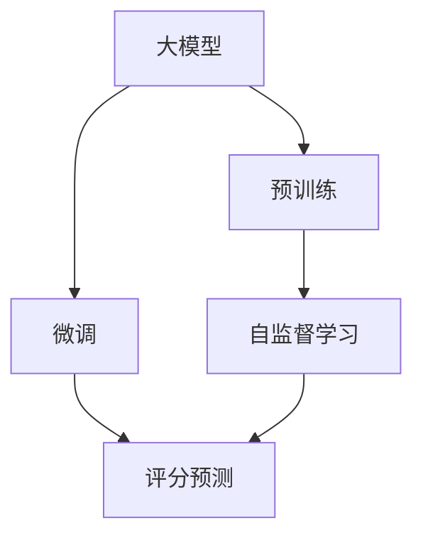

                 

# 大模型在商品评分预测中的实践

> 关键词：大模型,商品评分,神经网络,深度学习,自监督学习,预测精度

## 1. 背景介绍

### 1.1 问题由来
在电商领域，商品评分预测是一个核心任务，用于评估商品的市场价值，指导库存管理、商品推荐、广告投放等多个业务环节。传统的商品评分预测方法通常依赖于人工提取的特征，存在特征选择困难、数据标注成本高、模型泛化能力有限等问题。近年来，大模型在自然语言处理(NLP)领域取得了突破性进展，其强大的自监督学习能力，使得在大规模无标签数据上进行预训练，然后通过微调实现精确预测成为可能。

### 1.2 问题核心关键点
大模型在商品评分预测中的核心关键点包括：

1. **预训练与微调结合**：利用大规模无标签数据进行预训练，提升模型的通用语言理解能力。然后通过微调，使其适应具体的商品评分预测任务。
2. **特征表示学习**：利用大模型自动学习商品评论文本的语义表示，而非手工提取特征。
3. **自监督学习**：利用文本的无标签数据进行预训练，提高模型的泛化能力。
4. **评分预测精度**：通过大模型的微调，实现高精度的商品评分预测。
5. **计算资源优化**：解决大模型推理速度慢、内存占用大的问题，提高预测效率。

这些关键点共同构成了大模型在商品评分预测中的实践框架，使其能够有效利用自然语言数据，提升预测准确性，并具备更高的泛化能力。

### 1.3 问题研究意义
在电商领域，商品评分预测的准确性直接影响客户的购物体验和商家的商业决策。传统的评分预测方法通常依赖于昂贵的特征工程和大量标注数据，难以在大规模商品上实现高效、准确的预测。而大模型方法，尤其是基于预训练-微调的深度学习模型，能够以更低的成本、更高的精度实现商品评分预测，具有重要的理论和应用意义：

1. **降低成本**：减少特征工程和数据标注的工作量，提高模型的开发效率。
2. **提升精度**：利用大模型的强大语义理解能力，提高评分预测的准确性。
3. **泛化能力强**：预训练阶段在无标签数据上学习到的通用知识，可以迁移到新的评分预测任务上。
4. **实时性高**：优化推理速度，提高模型的响应能力，满足电商业务对实时预测的需求。
5. **鲁棒性好**：大模型在预训练阶段已经学习到了一定的抗干扰能力，微调后的模型也具备较好的鲁棒性。

总之，大模型在商品评分预测中的应用，将大幅提升电商平台的商品评价体系，为其带来更高的运营效率和客户满意度。

## 2. 核心概念与联系

### 2.1 核心概念概述

为更好地理解大模型在商品评分预测中的应用，本节将介绍几个密切相关的核心概念：

- **大模型(Large Model)**：指具有数十亿甚至百亿参数规模的神经网络模型，如BERT、GPT-3等。通过在大规模无标签数据上进行预训练，学习到丰富的语言知识和语义表示。
- **预训练(Pre-training)**：指在大规模无标签数据上，通过自监督学习任务训练通用语言模型的过程。常见的预训练任务包括掩码语言模型、预测下一词等。
- **微调(Fine-tuning)**：指在预训练模型的基础上，使用特定的标注数据，通过有监督学习优化模型在特定任务上的性能。微调通常只更新小部分模型参数，以提高模型精度。
- **评分预测(Score Prediction)**：指对商品评论文本的评分进行预测，评估商品的受欢迎程度和市场价值。评分预测可以基于用户评分数据、商品描述等进行。
- **神经网络(Neural Network)**：由神经元构成的计算模型，广泛用于深度学习中。神经网络通过反向传播算法进行训练，可以处理复杂的非线性关系。
- **自监督学习(Self-supervised Learning)**：指在无标签数据上，通过设计自监督任务，自动学习模型的特征表示。自监督学习可以提高模型的泛化能力。

这些核心概念之间的逻辑关系可以通过以下Mermaid流程图来展示：



这个流程图展示了大模型在商品评分预测中的核心概念及其之间的关系：

1. 大模型通过预训练获得基础能力。
2. 自监督学习任务在无标签数据上进行训练，学习模型的特征表示。
3. 微调过程在大规模标注数据上优化模型，使其适应商品评分预测任务。
4. 评分预测使用微调后的模型，对商品评论进行评分预测。

## 3. 核心算法原理 & 具体操作步骤
### 3.1 算法原理概述

大模型在商品评分预测中的应用，本质上是通过预训练-微调范式进行特征学习。其核心思想是：利用大模型在无标签数据上学习到的通用特征，结合标注数据进行微调，使得模型能够适应具体的评分预测任务，提高预测精度。

形式化地，假设大模型为 $M_{\theta}$，其中 $\theta$ 为预训练得到的模型参数。给定商品评分预测任务的标注数据集 $D=\{(x_i,y_i)\}_{i=1}^N$，微调的目标是找到新的模型参数 $\hat{\theta}$，使得：

$$
\hat{\theta}=\mathop{\arg\min}_{\theta} \mathcal{L}(M_{\theta},D)
$$

其中 $\mathcal{L}$ 为针对评分预测任务设计的损失函数，用于衡量模型预测输出与真实标签之间的差异。常见的损失函数包括均方误差损失、交叉熵损失等。

通过梯度下降等优化算法，微调过程不断更新模型参数 $\theta$，最小化损失函数 $\mathcal{L}$，使得模型输出逼近真实标签。由于 $\theta$ 已经通过预训练获得了较好的初始化，因此即便在评分预测任务上标注数据较少，也能较快收敛到理想的模型参数 $\hat{\theta}$。

### 3.2 算法步骤详解

基于大模型在商品评分预测中的应用，一般包括以下几个关键步骤：

**Step 1: 准备预训练模型和数据集**
- 选择合适的预训练语言模型 $M_{\theta}$ 作为初始化参数，如 BERT、GPT等。
- 准备商品评分预测任务的标注数据集 $D$，划分为训练集、验证集和测试集。一般要求标注数据与预训练数据的分布不要差异过大。

**Step 2: 添加评分预测适配层**
- 根据任务类型，在预训练模型顶层设计合适的输出层和损失函数。
- 对于评分预测任务，通常在顶层添加线性回归层和均方误差损失函数。

**Step 3: 设置微调超参数**
- 选择合适的优化算法及其参数，如 AdamW、SGD 等，设置学习率、批大小、迭代轮数等。
- 设置正则化技术及强度，包括权重衰减、Dropout、Early Stopping 等。
- 确定冻结预训练参数的策略，如仅微调顶层，或全部参数都参与微调。

**Step 4: 执行梯度训练**
- 将训练集数据分批次输入模型，前向传播计算损失函数。
- 反向传播计算参数梯度，根据设定的优化算法和学习率更新模型参数。
- 周期性在验证集上评估模型性能，根据性能指标决定是否触发 Early Stopping。
- 重复上述步骤直到满足预设的迭代轮数或 Early Stopping 条件。

**Step 5: 测试和部署**
- 在测试集上评估微调后模型 $M_{\hat{\theta}}$ 的性能，对比微调前后的精度提升。
- 使用微调后的模型对新样本进行推理预测，集成到实际的应用系统中。
- 持续收集新的评分数据，定期重新微调模型，以适应数据分布的变化。

以上是基于大模型在商品评分预测中的应用的一般流程。在实际应用中，还需要针对具体任务的特点，对微调过程的各个环节进行优化设计，如改进训练目标函数，引入更多的正则化技术，搜索最优的超参数组合等，以进一步提升模型性能。

### 3.3 算法优缺点

大模型在商品评分预测中的微调方法具有以下优点：

1. **精度高**：利用大模型的强大语义理解能力，能够准确捕捉商品评论中的情感倾向，提高评分预测精度。
2. **泛化能力强**：预训练阶段在无标签数据上学习到的通用知识，可以迁移到新的评分预测任务上，提升模型的泛化能力。
3. **实时性好**：优化推理速度，提高模型的响应能力，满足电商业务对实时预测的需求。
4. **鲁棒性好**：大模型在预训练阶段已经学习到了一定的抗干扰能力，微调后的模型也具备较好的鲁棒性。

同时，该方法也存在一定的局限性：

1. **数据标注成本高**：微调过程需要大量的标注数据，数据标注成本较高。
2. **模型复杂度大**：大模型参数量庞大，对计算资源和存储要求较高。
3. **泛化能力有限**：当目标任务与预训练数据的分布差异较大时，微调的性能提升有限。
4. **可解释性不足**：微调模型的决策过程通常缺乏可解释性，难以对其推理逻辑进行分析和调试。

尽管存在这些局限性，但就目前而言，基于大模型的微调方法仍是在商品评分预测任务中的主流范式。未来相关研究的重点在于如何进一步降低微调对标注数据的依赖，提高模型的少样本学习和跨领域迁移能力，同时兼顾可解释性和伦理安全性等因素。

### 3.4 算法应用领域

大模型在商品评分预测中的应用已经广泛应用于电商平台的多个场景，例如：

- **商品推荐**：根据商品评分预测模型，实时调整推荐算法，提升推荐系统的个性化和准确性。
- **库存管理**：通过商品评分预测，动态调整库存量，减少库存积压，提高供应链效率。
- **广告投放**：基于商品评分预测，优化广告投放策略，提升广告投放的效果和ROI。
- **舆情监测**：通过商品评论的评分预测，分析消费者对商品的态度和需求，进行市场趋势预测。

除了上述这些经典应用外，大模型在商品评分预测领域还有诸多创新性应用，如实时评分更新、情感分析、用户行为预测等，为电商平台带来了新的业务价值。

## 4. 数学模型和公式 & 详细讲解  
### 4.1 数学模型构建

本节将使用数学语言对大模型在商品评分预测中的应用进行更加严格的刻画。

记大模型为 $M_{\theta}$，其中 $\theta$ 为预训练得到的模型参数。假设评分预测任务的训练集为 $D=\{(x_i,y_i)\}_{i=1}^N, x_i \in \mathcal{X}, y_i \in \mathcal{Y}$，其中 $\mathcal{X}$ 为输入空间，$\mathcal{Y}$ 为评分空间。

定义模型 $M_{\theta}$ 在输入 $x$ 上的输出为 $\hat{y}=M_{\theta}(x) \in \mathcal{Y}$，则为商品评分的预测值。根据评分预测任务，我们通常使用均方误差作为损失函数：

$$
\ell(y,\hat{y}) = \frac{1}{N}\sum_{i=1}^N (y_i - \hat{y}_i)^2
$$

在无标签预训练数据 $D_{pre}$ 上进行预训练时，可以使用掩码语言模型(MLM)任务进行训练，以提高模型的语言理解能力：

$$
\mathcal{L}_{pre}(\theta) = -\frac{1}{N_{pre}}\sum_{i=1}^{N_{pre}} \log P(y_i \mid x_i; \theta)
$$

其中 $P(y_i \mid x_i; \theta)$ 为在输入 $x_i$ 下预测单词 $y_i$ 的条件概率。

在微调过程中，我们假设预训练阶段已经学习到高质量的评分预测能力，因此只需在小规模标注数据上进行微调。设微调后的模型为 $M_{\hat{\theta}}$，则微调的目标为最小化损失函数：

$$
\mathcal{L}_{fin}(\hat{\theta}) = \frac{1}{N}\sum_{i=1}^N (y_i - \hat{y}_i)^2
$$

根据梯度下降算法，模型的参数更新公式为：

$$
\hat{\theta} \leftarrow \hat{\theta} - \eta \nabla_{\hat{\theta}}\mathcal{L}_{fin}(\hat{\theta})
$$

其中 $\eta$ 为学习率。

### 4.2 公式推导过程

以下我们以评分预测任务为例，推导均方误差损失函数及其梯度的计算公式。

假设模型 $M_{\theta}$ 在输入 $x$ 上的输出为 $\hat{y}=M_{\theta}(x)$，根据均方误差损失函数：

$$
\ell(y,\hat{y}) = \frac{1}{N}\sum_{i=1}^N (y_i - \hat{y}_i)^2
$$

将其代入经验风险公式，得：

$$
\mathcal{L}(\theta) = \frac{1}{N}\sum_{i=1}^N (y_i - \hat{y}_i)^2
$$

根据链式法则，损失函数对参数 $\theta_k$ 的梯度为：

$$
\frac{\partial \mathcal{L}(\theta)}{\partial \theta_k} = -\frac{2}{N}\sum_{i=1}^N (\hat{y}_i - y_i) \frac{\partial M_{\theta}(x_i)}{\partial \theta_k}
$$

在得到损失函数的梯度后，即可带入参数更新公式，完成模型的迭代优化。重复上述过程直至收敛，最终得到适应评分预测任务的最优模型参数 $\hat{\theta}$。

## 5. 项目实践：代码实例和详细解释说明
### 5.1 开发环境搭建

在进行商品评分预测模型开发前，我们需要准备好开发环境。以下是使用Python进行PyTorch开发的环境配置流程：

1. 安装Anaconda：从官网下载并安装Anaconda，用于创建独立的Python环境。

2. 创建并激活虚拟环境：
```bash
conda create -n pytorch-env python=3.8 
conda activate pytorch-env
```

3. 安装PyTorch：根据CUDA版本，从官网获取对应的安装命令。例如：
```bash
conda install pytorch torchvision torchaudio cudatoolkit=11.1 -c pytorch -c conda-forge
```

4. 安装Transformers库：
```bash
pip install transformers
```

5. 安装各类工具包：
```bash
pip install numpy pandas scikit-learn matplotlib tqdm jupyter notebook ipython
```

完成上述步骤后，即可在`pytorch-env`环境中开始模型开发。

### 5.2 源代码详细实现

下面我们以评分预测任务为例，给出使用Transformers库对BERT模型进行评分预测微调的PyTorch代码实现。

首先，定义评分预测任务的数据处理函数：

```python
from transformers import BertTokenizer
from torch.utils.data import Dataset
import torch

class ReviewDataset(Dataset):
    def __init__(self, reviews, scores, tokenizer, max_len=128):
        self.reviews = reviews
        self.scores = scores
        self.tokenizer = tokenizer
        self.max_len = max_len
        
    def __len__(self):
        return len(self.reviews)
    
    def __getitem__(self, item):
        review = self.reviews[item]
        score = self.scores[item]
        
        encoding = self.tokenizer(review, return_tensors='pt', max_length=self.max_len, padding='max_length', truncation=True)
        input_ids = encoding['input_ids'][0]
        attention_mask = encoding['attention_mask'][0]
        
        return {'input_ids': input_ids, 
                'attention_mask': attention_mask,
                'scores': torch.tensor(score, dtype=torch.float32)}
```

然后，定义模型和优化器：

```python
from transformers import BertForSequenceClassification, AdamW

model = BertForSequenceClassification.from_pretrained('bert-base-cased', num_labels=1)

optimizer = AdamW(model.parameters(), lr=2e-5)
```

接着，定义训练和评估函数：

```python
from torch.utils.data import DataLoader
from tqdm import tqdm
from sklearn.metrics import mean_squared_error

device = torch.device('cuda') if torch.cuda.is_available() else torch.device('cpu')
model.to(device)

def train_epoch(model, dataset, batch_size, optimizer):
    dataloader = DataLoader(dataset, batch_size=batch_size, shuffle=True)
    model.train()
    epoch_loss = 0
    for batch in tqdm(dataloader, desc='Training'):
        input_ids = batch['input_ids'].to(device)
        attention_mask = batch['attention_mask'].to(device)
        scores = batch['scores'].to(device)
        model.zero_grad()
        outputs = model(input_ids, attention_mask=attention_mask, labels=scores)
        loss = outputs.loss
        epoch_loss += loss.item()
        loss.backward()
        optimizer.step()
    return epoch_loss / len(dataloader)

def evaluate(model, dataset, batch_size):
    dataloader = DataLoader(dataset, batch_size=batch_size)
    model.eval()
    pred_scores, labels = [], []
    with torch.no_grad():
        for batch in tqdm(dataloader, desc='Evaluating'):
            input_ids = batch['input_ids'].to(device)
            attention_mask = batch['attention_mask'].to(device)
            batch_labels = batch['scores'].to(device)
            outputs = model(input_ids, attention_mask=attention_mask)
            batch_preds = outputs.logits.sigmoid().to('cpu').tolist()
            batch_labels = batch_labels.to('cpu').tolist()
            for pred_score, label_score in zip(batch_preds, batch_labels):
                pred_scores.append(pred_score[0])
                labels.append(label_score[0])
                
    mse = mean_squared_error(labels, pred_scores)
    print(f"MSE: {mse:.3f}")
```

最后，启动训练流程并在测试集上评估：

```python
epochs = 5
batch_size = 16

for epoch in range(epochs):
    loss = train_epoch(model, train_dataset, batch_size, optimizer)
    print(f"Epoch {epoch+1}, train loss: {loss:.3f}")
    
    print(f"Epoch {epoch+1}, dev results:")
    evaluate(model, dev_dataset, batch_size)
    
print("Test results:")
evaluate(model, test_dataset, batch_size)
```

以上就是使用PyTorch对BERT进行评分预测任务微调的完整代码实现。可以看到，得益于Transformers库的强大封装，我们可以用相对简洁的代码完成BERT模型的加载和微调。

### 5.3 代码解读与分析

让我们再详细解读一下关键代码的实现细节：

**ReviewDataset类**：
- `__init__`方法：初始化文本、评分、分词器等关键组件。
- `__len__`方法：返回数据集的样本数量。
- `__getitem__`方法：对单个样本进行处理，将文本输入编码为token ids，同时输出评分。

**训练和评估函数**：
- 使用PyTorch的DataLoader对数据集进行批次化加载，供模型训练和推理使用。
- 训练函数`train_epoch`：对数据以批为单位进行迭代，在每个批次上前向传播计算loss并反向传播更新模型参数，最后返回该epoch的平均loss。
- 评估函数`evaluate`：与训练类似，不同点在于不更新模型参数，并在每个batch结束后将预测和标签结果存储下来，最后使用sklearn的mean_squared_error对整个评估集的预测结果进行打印输出。

**训练流程**：
- 定义总的epoch数和batch size，开始循环迭代
- 每个epoch内，先在训练集上训练，输出平均loss
- 在验证集上评估，输出评分预测的MSE
- 所有epoch结束后，在测试集上评估，给出最终测试结果

可以看到，PyTorch配合Transformers库使得评分预测任务的微调代码实现变得简洁高效。开发者可以将更多精力放在数据处理、模型改进等高层逻辑上，而不必过多关注底层的实现细节。

当然，工业级的系统实现还需考虑更多因素，如模型的保存和部署、超参数的自动搜索、更灵活的任务适配层等。但核心的微调范式基本与此类似。

## 6. 实际应用场景
### 6.1 智能客服系统

基于大模型微调的评分预测技术，可以应用于智能客服系统的评分预测。智能客服系统通过自动化处理客户咨询，提升客户满意度和业务效率。评分预测能够快速评估客户的服务体验，优化客服系统的人机交互过程。

在技术实现上，可以收集历史客服对话的文本和评分数据，将其作为监督数据，在此基础上对预训练语言模型进行微调。微调后的模型能够自动理解客户的意图和情感倾向，预测其对服务满意度的评分。根据评分结果，系统可以自动调整客服策略，提升客户体验。

### 6.2 金融舆情监测

金融机构需要实时监测市场舆情，以便及时应对负面信息传播，规避金融风险。利用评分预测模型，可以分析社交媒体、新闻报道等海量文本数据，预测市场情绪和舆情变化。

具体而言，可以收集金融领域相关的新闻、评论、社交媒体帖子等文本数据，对其进行情感分析，预测市场情绪评分。将评分预测模型应用到实时抓取的网络文本数据，能够自动监测不同时间段的情感变化趋势，一旦发现负面情绪激增等异常情况，系统便会自动预警，帮助金融机构快速应对潜在风险。

### 6.3 个性化推荐系统

当前的推荐系统往往只依赖用户的历史行为数据进行物品推荐，无法深入理解用户的真实兴趣偏好。基于大模型微调的评分预测模型，可以更好地挖掘用户行为背后的语义信息，从而提供更精准、多样的推荐内容。

在实践中，可以收集用户浏览、点击、评论、分享等行为数据，提取和用户交互的物品标题、描述、标签等文本内容。将文本内容作为模型输入，用户的后续行为（如是否点击、购买等）作为监督信号，在此基础上微调预训练语言模型。微调后的模型能够从文本内容中准确把握用户的兴趣点。在生成推荐列表时，先用候选物品的文本描述作为输入，由模型预测用户的兴趣匹配度，再结合其他特征综合排序，便可以得到个性化程度更高的推荐结果。

### 6.4 未来应用展望

随着大模型和微调方法的不断发展，基于微调范式将在更多领域得到应用，为传统行业带来变革性影响。

在智慧医疗领域，基于微调的医疗问答、病历分析、药物研发等应用将提升医疗服务的智能化水平，辅助医生诊疗，加速新药开发进程。

在智能教育领域，微调技术可应用于作业批改、学情分析、知识推荐等方面，因材施教，促进教育公平，提高教学质量。

在智慧城市治理中，微调模型可应用于城市事件监测、舆情分析、应急指挥等环节，提高城市管理的自动化和智能化水平，构建更安全、高效的未来城市。

此外，在企业生产、社会治理、文娱传媒等众多领域，基于大模型微调的人工智能应用也将不断涌现，为经济社会发展注入新的动力。相信随着技术的日益成熟，微调方法将成为人工智能落地应用的重要范式，推动人工智能技术在垂直行业的规模化落地。

## 7. 工具和资源推荐
### 7.1 学习资源推荐

为了帮助开发者系统掌握大模型在商品评分预测中的应用，这里推荐一些优质的学习资源：

1. 《深度学习入门：基于Python的理论与实现》：由大模型技术专家撰写，系统介绍了深度学习的原理和实现，适合入门学习。

2. 《自然语言处理与深度学习》：斯坦福大学开设的NLP明星课程，有Lecture视频和配套作业，带你深入了解NLP领域的前沿知识。

3. 《Hands-On Machine Learning with Scikit-Learn, Keras, and TensorFlow》：Keras和TensorFlow的权威教程，适合实战练习。

4. Kaggle竞赛平台：提供丰富的数据集和模型竞赛，能够锻炼数据处理和模型优化能力。

5. GitHub上的开源项目：如HuggingFace的Transformers库，包含众多预训练模型和微调样例，是学习和实践的好资源。

通过对这些资源的学习实践，相信你一定能够快速掌握大模型在商品评分预测中的应用精髓，并用于解决实际的NLP问题。
###  7.2 开发工具推荐

高效的开发离不开优秀的工具支持。以下是几款用于大模型在商品评分预测任务开发的常用工具：

1. PyTorch：基于Python的开源深度学习框架，灵活动态的计算图，适合快速迭代研究。大部分预训练语言模型都有PyTorch版本的实现。

2. TensorFlow：由Google主导开发的开源深度学习框架，生产部署方便，适合大规模工程应用。同样有丰富的预训练语言模型资源。

3. Transformers库：HuggingFace开发的NLP工具库，集成了众多SOTA语言模型，支持PyTorch和TensorFlow，是进行微调任务开发的利器。

4. Weights & Biases：模型训练的实验跟踪工具，可以记录和可视化模型训练过程中的各项指标，方便对比和调优。与主流深度学习框架无缝集成。

5. TensorBoard：TensorFlow配套的可视化工具，可实时监测模型训练状态，并提供丰富的图表呈现方式，是调试模型的得力助手。

6. Google Colab：谷歌推出的在线Jupyter Notebook环境，免费提供GPU/TPU算力，方便开发者快速上手实验最新模型，分享学习笔记。

合理利用这些工具，可以显著提升大模型在商品评分预测任务的开发效率，加快创新迭代的步伐。

### 7.3 相关论文推荐

大模型和微调技术的发展源于学界的持续研究。以下是几篇奠基性的相关论文，推荐阅读：

1. Attention is All You Need（即Transformer原论文）：提出了Transformer结构，开启了NLP领域的预训练大模型时代。

2. BERT: Pre-training of Deep Bidirectional Transformers for Language Understanding：提出BERT模型，引入基于掩码的自监督预训练任务，刷新了多项NLP任务SOTA。

3. Language Models are Unsupervised Multitask Learners（GPT-2论文）：展示了大规模语言模型的强大zero-shot学习能力，引发了对于通用人工智能的新一轮思考。

4. Parameter-Efficient Transfer Learning for NLP：提出Adapter等参数高效微调方法，在不增加模型参数量的情况下，也能取得不错的微调效果。

5. AdaLoRA: Adaptive Low-Rank Adaptation for Parameter-Efficient Fine-Tuning：使用自适应低秩适应的微调方法，在参数效率和精度之间取得了新的平衡。

6. Transformer-XL: Attentive Language Models beyond a Fixed-Length Context：提出Transformer-XL结构，解决了长序列建模问题，提高了模型在长文本上的表现。

这些论文代表了大模型在商品评分预测技术的发展脉络。通过学习这些前沿成果，可以帮助研究者把握学科前进方向，激发更多的创新灵感。

## 8. 总结：未来发展趋势与挑战
### 8.1 总结

本文对大模型在商品评分预测中的应用进行了全面系统的介绍。首先阐述了大模型在商品评分预测中的研究背景和意义，明确了预训练-微调范式在商品评分预测中的核心价值。其次，从原理到实践，详细讲解了评分预测任务的数学模型和微调算法，给出了微调任务开发的完整代码实例。同时，本文还广泛探讨了评分预测技术在智能客服、金融舆情、个性化推荐等多个行业领域的应用前景，展示了微调范式的巨大潜力。此外，本文精选了微调技术的各类学习资源，力求为读者提供全方位的技术指引。

通过本文的系统梳理，可以看到，基于大模型的微调方法在商品评分预测中已经取得了显著的效果，极大地提升了电商平台的商品评价体系，为其带来了更高的运营效率和客户满意度。未来，伴随大模型的不断进步，评分预测技术必将进一步提升其预测准确性，推动电商业务的智能化发展。

### 8.2 未来发展趋势

展望未来，大模型在商品评分预测中的应用将呈现以下几个发展趋势：

1. **模型规模持续增大**：随着算力成本的下降和数据规模的扩张，预训练语言模型的参数量还将持续增长。超大规模语言模型蕴含的丰富语言知识，有望支撑更加复杂多变的评分预测任务。

2. **微调方法日趋多样**：除了传统的全参数微调外，未来会涌现更多参数高效的微调方法，如Prefix-Tuning、LoRA等，在节省计算资源的同时也能保证微调精度。

3. **持续学习成为常态**：随着数据分布的不断变化，评分预测模型也需要持续学习新知识以保持性能。如何在不遗忘原有知识的同时，高效吸收新样本信息，将成为重要的研究课题。

4. **标注样本需求降低**：受启发于提示学习(Prompt-based Learning)的思路，未来的评分预测方法将更好地利用大模型的语言理解能力，通过更加巧妙的任务描述，在更少的标注样本上也能实现理想的评分预测效果。

5. **模型通用性增强**：经过海量数据的预训练和多领域任务的微调，未来的评分预测模型将具备更强大的常识推理和跨领域迁移能力，逐步迈向通用人工智能(AGI)的目标。

以上趋势凸显了大模型在商品评分预测中的发展前景。这些方向的探索发展，必将进一步提升评分预测模型的性能和应用范围，为电商平台带来更高的商业价值。

### 8.3 面临的挑战

尽管大模型在商品评分预测中的应用已经取得了显著成效，但在迈向更加智能化、普适化应用的过程中，它仍面临诸多挑战：

1. **数据标注成本高**：评分预测模型需要大量的标注数据，数据标注成本较高。
2. **模型复杂度高**：大模型参数量庞大，对计算资源和存储要求较高。
3. **泛化能力有限**：当目标任务与预训练数据的分布差异较大时，微调的性能提升有限。
4. **可解释性不足**：评分预测模型的决策过程通常缺乏可解释性，难以对其推理逻辑进行分析和调试。

尽管存在这些局限性，但就目前而言，基于大模型的微调方法仍是在商品评分预测中的主流范式。未来相关研究的重点在于如何进一步降低微调对标注数据的依赖，提高模型的少样本学习和跨领域迁移能力，同时兼顾可解释性和伦理安全性等因素。

### 8.4 未来突破

面对大模型在商品评分预测中面临的挑战，未来的研究需要在以下几个方面寻求新的突破：

1. **探索无监督和半监督评分预测方法**：摆脱对大规模标注数据的依赖，利用自监督学习、主动学习等无监督和半监督范式，最大限度利用非结构化数据，实现更加灵活高效的评分预测。

2. **研究参数高效和计算高效的评分预测范式**：开发更加参数高效的评分预测方法，在固定大部分预训练参数的同时，只更新极少量的任务相关参数。同时优化评分预测模型的计算图，减少前向传播和反向传播的资源消耗，实现更加轻量级、实时性的部署。

3. **融合因果和对比学习范式**：通过引入因果推断和对比学习思想，增强评分预测模型建立稳定因果关系的能力，学习更加普适、鲁棒的语言表征，从而提升模型泛化性和抗干扰能力。

4. **引入更多先验知识**：将符号化的先验知识，如知识图谱、逻辑规则等，与神经网络模型进行巧妙融合，引导评分预测过程学习更准确、合理的语言模型。同时加强不同模态数据的整合，实现视觉、语音等多模态信息与文本信息的协同建模。

5. **结合因果分析和博弈论工具**：将因果分析方法引入评分预测模型，识别出模型决策的关键特征，增强输出解释的因果性和逻辑性。借助博弈论工具刻画人机交互过程，主动探索并规避模型的脆弱点，提高系统稳定性。

6. **纳入伦理道德约束**：在评分预测模型训练目标中引入伦理导向的评估指标，过滤和惩罚有偏见、有害的输出倾向。同时加强人工干预和审核，建立模型行为的监管机制，确保输出符合人类价值观和伦理道德。

这些研究方向的探索，必将引领大模型在商品评分预测技术迈向更高的台阶，为构建安全、可靠、可解释、可控的智能系统铺平道路。面向未来，大模型评分预测技术还需要与其他人工智能技术进行更深入的融合，如知识表示、因果推理、强化学习等，多路径协同发力，共同推动自然语言理解和智能交互系统的进步。只有勇于创新、敢于突破，才能不断拓展语言模型的边界，让智能技术更好地造福人类社会。

## 9. 附录：常见问题与解答

**Q1：大模型在商品评分预测中是否需要重新预训练？**

A: 通常情况下，大模型在商品评分预测中不需要重新预训练。预训练阶段已经学习到了通用的语言知识，可以直接微调应用到评分预测任务上。但针对特定领域或特定任务，可以考虑在微调前进行小规模的预训练，以进一步提升模型效果。

**Q2：大模型在商品评分预测中如何设置学习率？**

A: 大模型在商品评分预测中的学习率设置，通常要小于预训练阶段的学习率。建议从1e-5开始调参，逐步减小学习率，直至收敛。也可以使用warmup策略，在开始阶段使用较小的学习率，再逐渐过渡到预设值。需要注意的是，不同的优化器(如AdamW、Adafactor等)以及不同的学习率调度策略，可能需要设置不同的学习率阈值。

**Q3：大模型在商品评分预测中如何缓解过拟合问题？**

A: 过拟合是评分预测模型面临的主要挑战之一。常见的缓解策略包括：
1. 数据增强：通过回译、近义替换等方式扩充训练集
2. 正则化：使用L2正则、Dropout、Early Stopping等避免过拟合
3. 对抗训练：引入对抗样本，提高模型鲁棒性
4. 参数高效微调：只调整少量参数(如Adapter、Prefix等)，减小过拟合风险
5. 多模型集成：训练多个评分预测模型，取平均输出，抑制过拟合

这些策略往往需要根据具体任务和数据特点进行灵活组合。只有在数据、模型、训练、推理等各环节进行全面优化，才能最大限度地发挥大模型在商品评分预测中的潜力。

**Q4：大模型在商品评分预测中的推理速度如何？**

A: 大模型在商品评分预测中的推理速度可能会受到模型规模和硬件配置的影响。通常情况下，大模型推理速度较慢，内存占用较大。为了提高推理效率，可以采用以下优化措施：
1. 模型裁剪：去除不必要的层和参数，减小模型尺寸，加快推理速度
2. 量化加速：将浮点模型转为定点模型，压缩存储空间，提高计算效率
3. 服务化封装：将模型封装为标准化服务接口，便于集成调用
4. 弹性伸缩：根据请求流量动态调整资源配置，平衡服务质量和成本

通过合理优化，可以在保证预测精度的同时，显著提升大模型的推理速度和资源利用率。

**Q5：大模型在商品评分预测中的可解释性如何？**

A: 大模型在商品评分预测中的可解释性相对较弱。评分预测模型的决策过程通常依赖于复杂的神经网络结构，难以直接解释。为了提高模型的可解释性，可以采取以下措施：
1. 生成式模型：使用生成式模型解释评分预测过程，如GPT-3在评分预测中的应用。
2. 注意力机制：分析模型在评分预测中的注意力分配情况，了解模型关注的关键特征。
3. 日志分析：通过分析模型训练和推理过程中的日志信息，了解模型性能和行为变化。
4. 可视化和解释工具：利用可视化工具如TensorBoard，对模型输出进行解释和分析。

这些措施可以帮助理解大模型在商品评分预测中的行为，提高模型的可解释性和可控性。

**Q6：大模型在商品评分预测中的计算资源需求如何？**

A: 大模型在商品评分预测中的计算资源需求较高，主要体现在以下方面：
1. 模型参数量庞大：超大规模语言模型通常具有数十亿甚至百亿参数，对计算资源和存储空间要求较高。
2. 内存占用大：大模型推理时内存占用较大，需要高效的内存管理策略。
3. 计算密集：大模型训练和推理过程计算密集，需要高性能的GPU/TPU等硬件支持。

为了降低计算资源需求，可以采用以下优化措施：
1. 模型裁剪：去除不必要的层和参数，减小模型尺寸。
2. 量化加速：将浮点模型转为定点模型，压缩存储空间，提高计算效率。
3. 并行计算：利用多核CPU或分布式计算框架进行并行计算，提高计算效率。
4. 模型压缩：采用模型压缩技术，如剪枝、蒸馏等，减少模型参数量。

通过合理优化，可以在保证模型效果的同时，降低计算资源需求，提高系统的可扩展性。

综上所述，大模型在商品评分预测中具有巨大的应用潜力，但其在数据标注成本、模型复杂度、泛化能力、可解释性等方面仍存在挑战。未来需要在无监督学习、参数高效微调、因果推断、多模态建模、伦理约束等方面进行深入研究，推动大模型评分预测技术在电商、金融、智能客服等领域的应用。通过不断优化模型和算法，我们相信大模型评分预测技术将为电商业务带来更高效的运营和更好的用户体验。

