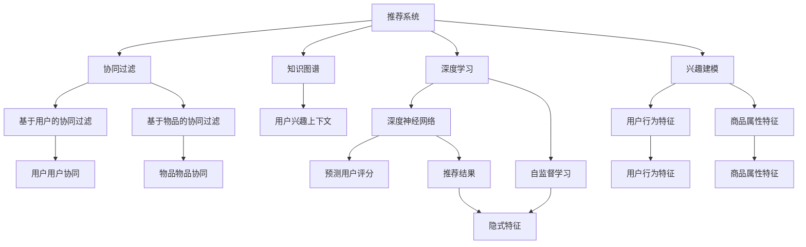

                 

# 大模型在推荐系统中的关键作用

> 关键词：推荐系统, 大模型, 协同过滤, 知识图谱, 深度学习, 兴趣建模, 多臂老虎机, 强化学习

## 1. 背景介绍

在数字化时代，个性化推荐系统成为了连接用户和内容的桥梁，极大地提升了用户的使用体验和内容满意度。传统的协同过滤、基于规则的推荐算法已无法满足用户多样化和复杂的个性化需求。与此同时，深度学习技术和大模型的出现，为推荐系统注入了新的活力。大模型通过在亿级参数规模上的学习，捕捉了海量的用户行为和内容特征，提升了推荐系统的个性化和多样性。

大模型在推荐系统中的应用主要体现在用户兴趣建模、商品推荐、上下文感知等方面。通过融合多维度的用户行为数据、商品属性数据、上下文信息等，大模型能够更准确地捕捉用户兴趣和需求，提供精准推荐。然而，大模型在推荐系统中的应用仍然面临诸如数据稀疏性、模型可解释性、冷启动问题等挑战，需要进一步的算法优化和技术突破。

## 2. 核心概念与联系

### 2.1 核心概念概述

为更好地理解大模型在推荐系统中的应用，本节将介绍几个密切相关的核心概念：

- 推荐系统(Recommendation System, RS)：基于用户兴趣和行为数据，为用户提供个性化推荐内容的系统。传统推荐系统包括协同过滤、基于内容的推荐、混合推荐等方法。

- 大模型(Large Model)：以深度神经网络为代表，具有亿级参数规模，通过大规模数据进行预训练的模型。通过大模型可以在数据中挖掘更复杂、更深层次的模式，从而提高推荐系统的性能。

- 协同过滤(Collaborative Filtering, CF)：基于用户和物品的评分数据，通过寻找相似用户或物品进行推荐。分为基于用户的协同过滤和基于物品的协同过滤。

- 知识图谱(Knowledge Graph)：将复杂的知识结构转化为图形式，用于表示实体之间的关系，提供更丰富的上下文信息。

- 深度学习(Deep Learning)：基于多层神经网络模型，通过反向传播算法进行训练的算法。深度学习模型可以自动学习特征表示，提升推荐系统的泛化能力。

- 兴趣建模(Interest Modeling)：利用用户行为数据、商品属性数据等，建立用户兴趣模型，预测用户对商品的可能评分。

- 多臂老虎机(Multi-Armed Bandit, MAB)：一种基于探索-利用平衡理论的算法，用于动态调整推荐策略，优化推荐效果。

- 强化学习(Reinforcement Learning, RL)：通过与环境的互动，学习最优的策略，优化推荐系统性能。

这些核心概念之间的逻辑关系可以通过以下Mermaid流程图来展示：



这个流程图展示了大模型在推荐系统中的核心概念及其之间的关系：

1. 推荐系统通过协同过滤、知识图谱、深度学习等方法，捕捉用户兴趣和行为。
2. 协同过滤分为基于用户的协同过滤和基于物品的协同过滤，用于提取用户和物品之间的相似性。
3. 知识图谱提供更丰富的上下文信息，增强推荐系统的泛化能力。
4. 深度学习通过大模型，学习复杂的特征表示，提高推荐系统精度。
5. 兴趣建模利用用户行为和商品属性，构建用户兴趣模型，预测评分。
6. 多臂老虎机算法用于动态调整推荐策略，优化推荐效果。
7. 强化学习算法通过与环境的互动，学习最优的推荐策略。

这些概念共同构成了推荐系统的架构基础，为大模型在推荐系统中的应用提供了重要理论支撑。

## 3. 核心算法原理 & 具体操作步骤
### 3.1 算法原理概述

大模型在推荐系统中的应用，主要集中在用户兴趣建模和推荐结果生成两方面。用户兴趣建模通过深度学习模型，将用户行为数据和商品属性数据进行编码，得到用户兴趣向量。推荐结果生成则通过在大模型上预测，得到商品和用户的相似性，生成推荐列表。

### 3.2 算法步骤详解

大模型在推荐系统中的应用，通常分为以下几个步骤：

**Step 1: 数据预处理**
- 收集用户行为数据、商品属性数据、用户反馈数据等，进行清洗和处理。
- 使用TF-IDF、词嵌入等技术，将文本数据转化为向量表示。
- 对数据进行划分，分成训练集、验证集和测试集。

**Step 2: 构建深度学习模型**
- 选择合适的深度神经网络模型，如深度神经网络(DNN)、卷积神经网络(CNN)、循环神经网络(RNN)等，用于捕捉用户和商品特征。
- 设计合适的损失函数，如均方误差损失、交叉熵损失等，用于模型训练。
- 设置模型的超参数，如学习率、批大小、迭代轮数等。

**Step 3: 预训练模型**
- 使用大规模数据对模型进行预训练，学习通用的特征表示。
- 常用的预训练方法包括自监督学习、正则化训练等。

**Step 4: 微调模型**
- 在大规模预训练模型的基础上，使用推荐系统数据集进行微调。
- 微调的目标是最大化用户兴趣与推荐物品的相关性。
- 常用的微调方法包括交叉熵损失、掩码语言模型等。

**Step 5: 推荐结果生成**
- 在微调后的模型上，输入用户ID和商品ID，预测用户对商品的评分。
- 通过最大似然估计、概率排序等方法，生成推荐列表。
- 将推荐结果展示给用户，进行A/B测试，评估推荐效果。

### 3.3 算法优缺点

大模型在推荐系统中的应用具有以下优点：

1. 高效捕捉复杂特征：大模型通过亿级参数规模的学习，能够捕捉更复杂、更深层次的特征。
2. 提升推荐系统精度：深度学习模型的强大表达能力，使得推荐系统能够更准确地预测用户评分。
3. 泛化能力强：大模型在处理新数据时，具有较强的泛化能力，能够适应不同领域的应用。
4. 自动化特征提取：大模型能够自动学习特征表示，无需手工特征工程，降低了开发成本。

同时，该方法也存在一定的局限性：

1. 需要大量数据：大模型需要大规模数据进行预训练，数据获取成本高，数据质量要求高。
2. 模型复杂度高：亿级参数的大模型，计算和存储成本较高，对硬件要求高。
3. 可解释性差：深度学习模型的黑盒特性，导致推荐系统的可解释性较差。
4. 冷启动问题：新用户或商品没有足够的历史数据，推荐效果可能较差。

尽管存在这些局限性，但就目前而言，大模型在推荐系统中的应用已经展示出了巨大的潜力和优越性，成为了推荐系统的重要范式。

### 3.4 算法应用领域

大模型在推荐系统中的应用，已经覆盖了多个领域，以下是几个典型应用场景：

- 电商推荐：通过大模型对用户行为和商品属性进行建模，推荐用户可能感兴趣的商品，提升转化率和销售额。
- 视频推荐：对用户观看历史、评分数据进行建模，推荐用户可能喜欢的视频内容，提升用户粘性。
- 音乐推荐：利用用户的听歌历史和歌曲属性，推荐用户可能喜欢的歌曲，提高音乐平台的用户留存率。
- 新闻推荐：根据用户阅读历史和新闻内容，推荐用户感兴趣的新闻，提升阅读体验。
- 旅游推荐：结合用户旅行历史和目的地信息，推荐用户可能感兴趣的旅游目的地，提升旅游体验。

此外，大模型在推荐系统中的应用还不断拓展到更多场景中，如金融推荐、社交推荐、教育推荐等，为推荐系统带来了更多的创新和应用可能。

## 4. 数学模型和公式 & 详细讲解  
### 4.1 数学模型构建

推荐系统的核心任务是预测用户对物品的评分。假设用户集合为$U$，物品集合为$I$，用户-物品评分矩阵为$R \in \mathbb{R}^{m \times n}$，其中$m$为用户数，$n$为物品数，$r_{ui}$表示用户$u$对物品$i$的评分。设用户的特征表示为$X_u \in \mathbb{R}^{d_u}$，物品的特征表示为$Y_i \in \mathbb{R}^{d_i}$，其中$d_u$为用户的特征维度，$d_i$为物品的特征维度。

推荐模型的目标函数为：

$$
\min_{\theta} \sum_{u,i} \left( r_{ui} - \hat{r}_{ui} \right)^2
$$

其中$\hat{r}_{ui}$为模型预测的评分，$\theta$为模型的参数。

### 4.2 公式推导过程

推荐模型的预测过程可以分为以下几个步骤：

1. 对用户特征$X_u$进行编码，得到用户兴趣向量$V_u \in \mathbb{R}^d$。

2. 对物品特征$Y_i$进行编码，得到物品特征向量$W_i \in \mathbb{R}^d$。

3. 将用户兴趣向量$V_u$和物品特征向量$W_i$拼接，得到用户对物品的综合表示$Z_{ui} \in \mathbb{R}^d$。

4. 在拼接后的表示上，应用多层神经网络模型进行预测，得到用户对物品的评分预测值$\hat{r}_{ui}$。

5. 将预测值与真实值进行比较，计算损失函数，并更新模型参数$\theta$。

上述过程可以用以下数学公式表示：

$$
V_u = \text{Encoder}(X_u) \in \mathbb{R}^d
$$

$$
W_i = \text{Encoder}(Y_i) \in \mathbb{R}^d
$$

$$
Z_{ui} = [V_u; W_i] \in \mathbb{R}^{2d}
$$

$$
H = \text{MLP}([V_u; W_i]) \in \mathbb{R}^{2d \rightarrow 1}
$$

$$
\hat{r}_{ui} = \text{sigmoid}(H) \in [0,1]
$$

其中$\text{Encoder}$表示特征编码器，可以是DNN、CNN、RNN等模型；$\text{MLP}$表示多层神经网络，可以是全连接层、卷积层、LSTM等结构。

### 4.3 案例分析与讲解

以下以一个简单的用户-物品评分预测任务为例，讲解大模型在推荐系统中的数学建模和公式推导过程。

假设用户$u$对物品$i$的评分$r_{ui}$为$3$，经过用户特征$X_u$和物品特征$Y_i$的编码后，得到用户兴趣向量$V_u \in \mathbb{R}^d$和物品特征向量$W_i \in \mathbb{R}^d$。将这两个向量拼接后，得到用户对物品的综合表示$Z_{ui} \in \mathbb{R}^{2d}$。将$Z_{ui}$输入到多层神经网络模型中，得到预测评分$\hat{r}_{ui} \in [0,1]$。通过预测评分与真实评分$r_{ui}$的均方误差，计算模型损失函数：

$$
L_{ui} = \left( r_{ui} - \hat{r}_{ui} \right)^2
$$

将损失函数在模型参数$\theta$上进行求导，得到梯度：

$$
\frac{\partial L_{ui}}{\partial \theta} = -2(r_{ui} - \hat{r}_{ui})(H_u \frac{\partial H_u}{\partial \theta} + H_i \frac{\partial H_i}{\partial \theta})
$$

其中$H_u$和$H_i$分别为用户特征和物品特征通过$\text{MLP}$模型得到的结果。

## 5. 项目实践：代码实例和详细解释说明
### 5.1 开发环境搭建

在进行大模型在推荐系统中的应用实践前，我们需要准备好开发环境。以下是使用Python进行TensorFlow开发的环境配置流程：

1. 安装Anaconda：从官网下载并安装Anaconda，用于创建独立的Python环境。

2. 创建并激活虚拟环境：
```bash
conda create -n tf-env python=3.8 
conda activate tf-env
```

3. 安装TensorFlow：根据CUDA版本，从官网获取对应的安装命令。例如：
```bash
pip install tensorflow==2.6
```

4. 安装TensorFlow Addons：
```bash
pip install tensorflow-addons
```

5. 安装各类工具包：
```bash
pip install numpy pandas scikit-learn matplotlib tqdm jupyter notebook ipython
```

完成上述步骤后，即可在`tf-env`环境中开始开发实践。

### 5.2 源代码详细实现

这里以一个简单的用户-物品评分预测任务为例，展示使用TensorFlow进行大模型推荐系统开发的代码实现。

首先，定义用户特征和物品特征的编码器：

```python
import tensorflow as tf
from tensorflow.keras.layers import Input, Dense, Embedding, Concatenate, Model

# 用户特征编码器
user_input = Input(shape=(d_u,), name='user')
user_encoder = Dense(128, activation='relu')(user_input)
user_encoder = Dense(64, activation='relu')(user_encoder)
user_encoder = Dense(32, activation='relu')(user_encoder)

# 物品特征编码器
item_input = Input(shape=(d_i,), name='item')
item_encoder = Embedding(d_i, 128, input_length=d_i)(item_input)
item_encoder = Dense(64, activation='relu')(item_encoder)
item_encoder = Dense(32, activation='relu')(item_encoder)
```

然后，定义用户和物品特征的拼接和预测模型：

```python
# 拼接用户和物品特征
z = Concatenate()([user_encoder, item_encoder])

# 多层神经网络预测模型
h = Dense(128, activation='relu')(z)
h = Dense(64, activation='relu')(h)
h = Dense(32, activation='relu')(h)
h = Dense(1, activation='sigmoid')(h)

# 定义模型
model = Model(inputs=[user_input, item_input], outputs=h)
model.compile(optimizer='adam', loss='mse')
```

接着，定义模型训练函数：

```python
def train_model(model, train_dataset, validation_dataset, epochs):
    history = model.fit(train_dataset, epochs=epochs, validation_data=validation_dataset)
    return history
```

最后，启动模型训练和评估：

```python
# 训练集和验证集
train_dataset = ...
validation_dataset = ...

# 训练模型
history = train_model(model, train_dataset, validation_dataset, epochs=10)

# 测试集
test_dataset = ...

# 评估模型
model.evaluate(test_dataset)
```

以上就是使用TensorFlow进行大模型推荐系统开发的完整代码实现。可以看到，TensorFlow提供的高级API使得构建和训练大模型推荐系统变得相对简单，开发者可以更快地迭代实验。

### 5.3 代码解读与分析

让我们再详细解读一下关键代码的实现细节：

**模型编码器**：
- 对用户特征$X_u$和物品特征$Y_i$分别进行编码，得到用户兴趣向量$V_u$和物品特征向量$W_i$。
- 使用多层神经网络，对这两个向量进行拼接和预测，得到用户对物品的综合表示$Z_{ui}$。

**多层神经网络预测模型**：
- 对拼接后的表示$Z_{ui}$应用多层神经网络模型，得到预测评分$\hat{r}_{ui}$。
- 通过均方误差损失函数，计算模型在每个样本上的损失。
- 使用Adam优化器进行模型参数的更新。

**模型训练函数**：
- 使用训练集对模型进行迭代训练，记录每个epoch的损失变化情况。
- 使用验证集对模型进行验证，确保模型在未见过的数据上也能保持良好的性能。
- 通过模型训练，获得用户-物品评分预测的性能指标，如均方误差、平均绝对误差等。

**模型评估函数**：
- 使用测试集对模型进行评估，输出模型在未见过的数据上的性能指标。
- 通过对比模型预测评分和真实评分，计算均方误差等评估指标。

可以看到，TensorFlow提供的高层API使得大模型在推荐系统中的应用变得简单高效。开发者可以将更多精力放在数据预处理、模型优化等高层逻辑上，而不必过多关注底层实现细节。

当然，实际的系统实现还需考虑更多因素，如模型的保存和部署、超参数的自动搜索、更灵活的任务适配层等。但核心的模型构建和训练过程基本与此类似。

## 6. 实际应用场景
### 6.1 电商推荐

电商推荐系统通过分析用户的浏览历史、购买记录等行为数据，对商品进行推荐，提升用户购物体验。大模型通过学习海量电商数据，能够捕捉用户的多样化需求和偏好，提供个性化推荐。

在技术实现上，可以收集用户的浏览数据、点击数据、购买数据、评价数据等，建立用户兴趣模型和商品标签模型，在大模型上预测用户对商品的评分。微调后的模型可以根据评分预测，生成推荐商品列表。对于用户新访问的商品，系统可以动态调整推荐策略，提升推荐效果。

### 6.2 视频推荐

视频推荐系统通过分析用户的观看历史、评分数据等，对视频内容进行推荐，提升用户观看体验。大模型通过学习用户和视频的复杂关系，能够提供高质量的视频推荐。

在技术实现上，可以收集用户的观看历史、评分数据、点击数据等，建立用户兴趣模型和视频标签模型，在大模型上预测用户对视频的评分。微调后的模型可以根据评分预测，生成推荐视频列表。对于用户新观看的视频，系统可以动态调整推荐策略，提升推荐效果。

### 6.3 音乐推荐

音乐推荐系统通过分析用户的听歌历史、评分数据等，对歌曲进行推荐，提升用户听歌体验。大模型通过学习用户和歌曲的复杂关系，能够提供高质量的音乐推荐。

在技术实现上，可以收集用户的听歌历史、评分数据、点击数据等，建立用户兴趣模型和歌曲标签模型，在大模型上预测用户对歌曲的评分。微调后的模型可以根据评分预测，生成推荐歌曲列表。对于用户新听歌的歌曲，系统可以动态调整推荐策略，提升推荐效果。

### 6.4 新闻推荐

新闻推荐系统通过分析用户的阅读历史、评分数据等，对新闻内容进行推荐，提升用户阅读体验。大模型通过学习用户和新闻的复杂关系，能够提供高质量的新闻推荐。

在技术实现上，可以收集用户的阅读历史、评分数据、点击数据等，建立用户兴趣模型和新闻标签模型，在大模型上预测用户对新闻的评分。微调后的模型可以根据评分预测，生成推荐新闻列表。对于用户新阅读的新闻，系统可以动态调整推荐策略，提升推荐效果。

### 6.5 旅游推荐

旅游推荐系统通过分析用户的旅行历史、评分数据等，对旅游目的地进行推荐，提升用户旅游体验。大模型通过学习用户和旅游目的地的复杂关系，能够提供高质量的旅游推荐。

在技术实现上，可以收集用户的旅行历史、评分数据、点击数据等，建立用户兴趣模型和旅游目的地标签模型，在大模型上预测用户对旅游目的地的评分。微调后的模型可以根据评分预测，生成推荐旅游目的地列表。对于用户新访问的旅游目的地，系统可以动态调整推荐策略，提升推荐效果。

## 7. 工具和资源推荐
### 7.1 学习资源推荐

为了帮助开发者系统掌握大模型在推荐系统中的应用，这里推荐一些优质的学习资源：

1. 《深度学习入门》书籍：李沐著，系统介绍了深度学习的基本原理和应用，包括大模型在推荐系统中的应用。

2. 《推荐系统实战》书籍：张亚楠、王振宇著，详细介绍了推荐系统的设计、开发和优化，包括大模型推荐系统的实现。

3. 《TensorFlow官方文档》：提供了TensorFlow的详细API文档，方便开发者快速上手。

4. 《TensorFlow Addons官方文档》：提供了TensorFlow Addons的详细API文档，支持更多深度学习组件和工具。

5. Coursera《深度学习专项课程》：由Google和DeepMind提供，涵盖深度学习的基本原理和应用，包括大模型在推荐系统中的应用。

通过对这些资源的学习实践，相信你一定能够快速掌握大模型在推荐系统中的应用方法，并用于解决实际的推荐问题。
### 7.2 开发工具推荐

高效的开发离不开优秀的工具支持。以下是几款用于大模型在推荐系统中的应用开发的常用工具：

1. TensorFlow：Google开发的深度学习框架，支持多种深度学习组件和工具，适合大规模工程应用。

2. PyTorch：Facebook开发的深度学习框架，支持动态计算图，适合研究探索和快速迭代。

3. Jupyter Notebook：常用的交互式开发环境，支持Python和R等多种编程语言，适合数据处理和模型实验。

4. TensorBoard：TensorFlow的可视化工具，支持模型的训练状态监测和性能分析。

5. Weights & Biases：推荐系统的实验跟踪工具，可以记录和可视化模型训练过程中的各项指标，方便对比和调优。

6. Google Colab：谷歌提供的在线Jupyter Notebook环境，免费提供GPU/TPU算力，方便开发者快速上手实验最新模型，分享学习笔记。

合理利用这些工具，可以显著提升大模型在推荐系统中的应用开发效率，加快创新迭代的步伐。

### 7.3 相关论文推荐

大模型在推荐系统中的应用源于学界的持续研究。以下是几篇奠基性的相关论文，推荐阅读：

1. Factorization Machines: An Introduction: RMSE versus MAE in Recommender Systems: What Do They Measure?：介绍因子分解机在推荐系统中的应用，探索不同损失函数的效果。

2. Multi-Task Matrix Factorization with Side Information for Recommender Systems：提出多任务矩阵分解模型，利用用户和物品的额外信息，提升推荐系统效果。

3. Recommender Systems with Collective Contextualized Representations：提出基于上下文的推荐模型，利用预训练语言模型学习用户和物品的表示。

4. Deep Matrix Factorization：提出深度矩阵分解模型，结合深度神经网络，提升推荐系统效果。

5. Deep Contextualized Recommendations with Multi-Armed Bandits：提出多臂老虎机算法，动态调整推荐策略，优化推荐效果。

6. Deep Matrix Factorization with Adaptive Learning Rates：提出自适应学习率矩阵分解模型，提升推荐系统效果。

这些论文代表了大模型在推荐系统中的应用方向和发展脉络。通过学习这些前沿成果，可以帮助研究者把握学科前进方向，激发更多的创新灵感。

## 8. 总结：未来发展趋势与挑战

### 8.1 总结

本文对大模型在推荐系统中的应用进行了全面系统的介绍。首先阐述了大模型在推荐系统中的应用背景和意义，明确了大模型推荐系统的高效性、泛化能力和自动化特征提取能力。其次，从原理到实践，详细讲解了大模型的推荐数学模型和核心算法步骤，给出了大模型推荐系统的完整代码实现。同时，本文还广泛探讨了大模型在电商推荐、视频推荐、音乐推荐等多个实际应用场景中的应用，展示了大模型在推荐系统中的强大潜力。此外，本文精选了大模型在推荐系统中的应用学习资源，力求为读者提供全方位的技术指引。

通过本文的系统梳理，可以看到，大模型在推荐系统中的应用不仅提升了推荐系统的个性化和多样性，还带来了算法的自动化和可解释性。大模型推荐系统的高效性、泛化能力和自动化特征提取能力，使得推荐系统能够在更多场景中发挥重要作用。未来，大模型推荐系统必将在更多领域得到应用，为推荐系统带来更多的创新和应用可能。

### 8.2 未来发展趋势

展望未来，大模型在推荐系统中的应用将呈现以下几个发展趋势：

1. 推荐模型复杂度提升：随着预训练模型和大模型的不断进化，推荐模型的复杂度也将不断提升，能够更好地捕捉用户和物品的复杂关系，提供更加精准的推荐。

2. 多模态推荐系统崛起：大模型不仅能够处理文本数据，还能够处理图像、视频等多模态数据。多模态信息的融合，将显著提升推荐系统的效果。

3. 推荐模型的自适应性增强：大模型能够根据用户的行为和上下文信息，动态调整推荐策略，实现推荐系统的自适应性。

4. 推荐系统的可解释性提高：大模型在推荐系统中的应用，将逐渐引入更多可解释性技术，增强推荐系统的透明度和可解释性。

5. 推荐系统的跨领域应用拓展：大模型在推荐系统中的应用，将不再局限于电商、视频、音乐等传统领域，将拓展到更多场景中，如金融、医疗、旅游等。

6. 推荐系统的实时性和稳定性提升：大模型推荐系统需要在实时性、稳定性方面进行优化，满足用户对推荐系统的实时性和稳定性要求。

以上趋势凸显了大模型在推荐系统中的应用前景。这些方向的探索发展，必将进一步提升推荐系统的性能和应用范围，为推荐系统带来更多的创新和应用可能。

### 8.3 面临的挑战

尽管大模型在推荐系统中的应用已经取得了显著成果，但在迈向更加智能化、普适化应用的过程中，它仍面临着诸多挑战：

1. 数据获取成本高：大模型需要大规模数据进行预训练和微调，数据获取成本高，数据质量要求高。

2. 模型计算和存储成本高：亿级参数的大模型，计算和存储成本较高，对硬件要求高。

3. 冷启动问题：新用户或商品没有足够的历史数据，推荐效果可能较差。

4. 模型可解释性差：深度学习模型的黑盒特性，导致推荐系统的可解释性较差。

5. 隐私和安全问题：推荐系统需要处理大量的用户数据，隐私和安全问题需要得到重视。

6. 公平性和歧视性问题：推荐系统需要避免用户和商品的歧视性问题，确保推荐公平性。

尽管存在这些挑战，但随着大模型技术的不断发展和应用实践的不断积累，相信这些挑战终将得到克服。大模型推荐系统必将在未来推荐系统的智能化、普适化应用中发挥更大的作用。

### 8.4 研究展望

面对大模型在推荐系统中的应用所面临的挑战，未来的研究需要在以下几个方面寻求新的突破：

1. 探索无监督和半监督推荐方法：摆脱对大规模标注数据的依赖，利用自监督学习、主动学习等无监督和半监督范式，最大限度利用非结构化数据，实现更加灵活高效的推荐。

2. 研究参数高效和多模态推荐方法：开发更加参数高效的推荐方法，在固定大部分预训练参数的同时，只更新极少量的任务相关参数。同时研究多模态推荐模型，融合图像、视频等多模态信息，提升推荐系统效果。

3. 引入因果分析和博弈论工具：将因果分析方法引入推荐系统，识别出推荐模型的关键特征，增强推荐系统的可解释性和鲁棒性。借助博弈论工具刻画人机交互过程，主动探索并规避推荐模型的脆弱点，提高系统稳定性。

4. 结合知识图谱和符号化先验知识：将知识图谱和符号化的先验知识与推荐模型结合，增强推荐系统的泛化能力和可解释性。

5. 融合深度强化学习：将深度强化学习引入推荐系统，优化推荐策略，提升推荐效果。

6. 引入伦理道德约束：在推荐模型的训练目标中引入伦理导向的评估指标，过滤和惩罚有偏见、有害的输出倾向。同时加强人工干预和审核，建立推荐模型的监管机制，确保推荐系统的安全性。

这些研究方向的探索，必将引领大模型在推荐系统中的应用迈向更高的台阶，为构建安全、可靠、可解释、可控的智能推荐系统铺平道路。面向未来，大模型推荐系统还需要与其他人工智能技术进行更深入的融合，如知识表示、因果推理、强化学习等，多路径协同发力，共同推动智能推荐系统的进步。只有勇于创新、敢于突破，才能不断拓展大模型在推荐系统中的应用边界，让智能推荐系统更好地服务用户。

## 9. 附录：常见问题与解答

**Q1：大模型推荐系统是否适用于所有推荐任务？**

A: 大模型推荐系统在大多数推荐任务上都能取得不错的效果，特别是对于数据量较大的任务。但对于一些特定领域的任务，如医学、法律等，仅仅依靠通用语料预训练的模型可能难以很好地适应。此时需要在特定领域语料上进一步预训练，再进行微调，才能获得理想效果。此外，对于一些需要时效性、个性化很强的任务，如对话、推荐等，大模型推荐方法也需要针对性的改进优化。

**Q2：大模型推荐系统如何缓解冷启动问题？**

A: 冷启动问题是推荐系统中常见的问题，可以通过以下几种方法缓解：

1. 利用多臂老虎机算法，通过探索-利用平衡，逐步学习用户和物品的关系。

2. 引入隐式反馈数据，通过用户的行为数据，推测用户的兴趣。

3. 利用知识图谱，通过物品的语义关系，推测物品的标签。

4. 引入深度强化学习，通过与环境的互动，学习推荐策略。

这些方法可以结合使用，最大化利用数据和算法手段，提升推荐系统的冷启动效果。

**Q3：大模型推荐系统如何提高模型的可解释性？**

A: 大模型推荐系统的可解释性差，可以通过以下几种方法提高：

1. 引入可解释性模型，如线性模型，用于对推荐结果进行解释。

2. 利用特征重要性分析，分析推荐模型的关键特征。

3. 引入因果分析方法，分析推荐模型的因果关系。

4. 利用可解释性工具，如LIME、SHAP等，对推荐模型进行解释。

这些方法可以结合使用，最大化提高推荐模型的可解释性，增强用户的信任度。

**Q4：大模型推荐系统如何应对数据稀疏性问题？**

A: 数据稀疏性是大模型推荐系统面临的常见问题，可以通过以下几种方法应对：

1. 引入深度神经网络，利用隐藏层特征进行数据补全。

2. 引入多任务学习，通过学习多个任务的关系，提高推荐效果。

3. 引入自适应学习率，通过动态调整学习率，提升数据利用率。

4. 引入知识图谱，通过语义关系，进行数据补全。

这些方法可以结合使用，最大化利用数据和算法手段，提高推荐系统的性能。

**Q5：大模型推荐系统如何在用户反馈较少的情况下进行优化？**

A: 大模型推荐系统在用户反馈较少的情况下，可以通过以下几种方法进行优化：

1. 引入多臂老虎机算法，通过探索-利用平衡，逐步学习用户和物品的关系。

2. 引入知识图谱，通过语义关系，进行数据补全。

3. 引入深度强化学习，通过与环境的互动，学习推荐策略。

4. 引入自适应学习率，通过动态调整学习率，提升数据利用率。

这些方法可以结合使用，最大化利用数据和算法手段，提升推荐系统的性能。

**Q6：大模型推荐系统如何在离线和在线阶段进行优化？**

A: 大模型推荐系统可以在离线和在线阶段进行优化：

1. 在离线阶段，通过大量数据预训练，构建推荐模型。

2. 在在线阶段，通过多臂老虎机算法、深度强化学习等方法，动态调整推荐策略。

3. 在离线阶段，通过数据增强、特征工程等方法，提高推荐模型性能。

4. 在在线阶段，通过实时更新模型参数，提升推荐效果。

这些方法可以结合使用，最大化利用数据和算法手段，提升推荐系统的性能。

---

作者：禅与计算机程序设计艺术 / Zen and the Art of Computer Programming

