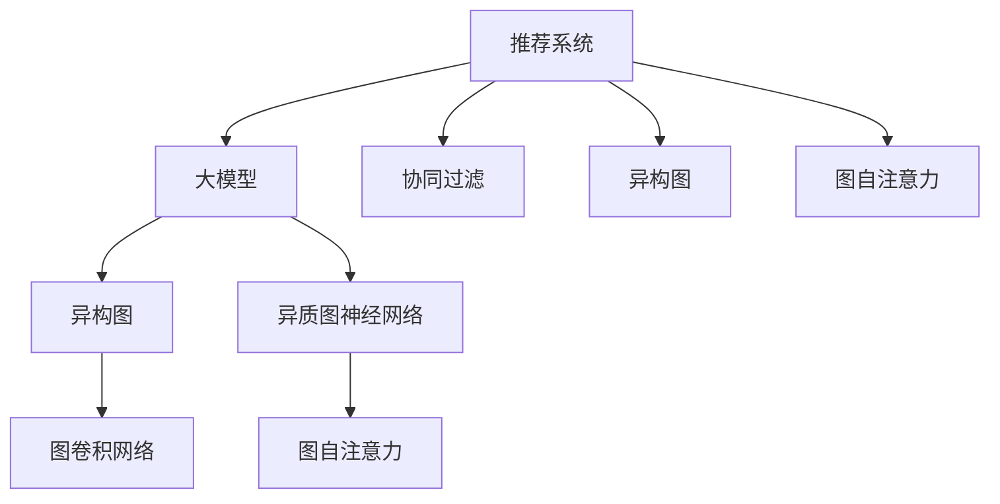

                 

# 大模型在推荐系统中的图自注意力应用

> 关键词：推荐系统, 大模型, 图自注意力, 协同过滤, 异构图, 异质图神经网络

## 1. 背景介绍

### 1.1 问题由来

随着电子商务、视频平台、社交网络等各类互联网应用的蓬勃发展，推荐系统成为维持平台用户活跃度和收益增长的重要引擎。推荐系统通过分析用户历史行为数据，预测用户偏好，从而推荐用户可能感兴趣的内容或商品，显著提升用户体验和满意度。然而，传统协同过滤、矩阵分解等方法面临数据稀疏性、冷启动等问题，难以覆盖推荐全场景。

近年来，基于深度学习的推荐算法取得了显著进展。基于深度神经网络的方法，通过从数据中学习高层次的抽象特征，有效缓解了数据稀疏性问题，能够处理更复杂的推荐任务，成为推荐系统研究的热点方向。特别是大模型的引入，极大地提升了推荐系统的表达能力和泛化能力。

大模型通过在大规模无标签数据上进行预训练，学习到丰富的语言、视觉等特征表示，具备强大的知识迁移能力。通过在推荐任务上微调，可以提升推荐系统的个性化水平，缓解数据稀疏性，处理长尾商品等任务。例如，将大模型应用于文本推荐中，可以通过模型预训练学习到丰富的语义特征，从而提升推荐精度。但大模型的参数量庞大，计算开销大，难以在实时推荐中直接应用。

为了充分利用大模型的知识表示能力，同时应对推荐场景的高实时性和计算需求，基于图自注意力的大模型推荐算法应运而生。该方法通过将用户与商品之间复杂的相互作用关系表示为图结构，并利用图自注意力机制对用户与商品之间的相互作用关系进行建模，有效缓解了长尾商品数据稀疏和分布不均等问题。此外，该方法还能将图结构的显式表达与大模型的隐式表示相结合，充分挖掘用户和商品之间的特征联系，从而提升推荐精度和效率。

## 2. 核心概念与联系

### 2.1 核心概念概述

为了更好地理解基于图自注意力的大模型推荐算法，本文将介绍几个密切相关的核心概念：

- 推荐系统(Recommendation System)：通过分析用户历史行为数据，预测用户偏好，从而推荐可能感兴趣的内容或商品的系统。推荐系统在电子商务、新闻推荐、社交网络等领域广泛应用。
- 大模型(Large Model)：通过在大规模无标签数据上进行预训练，学习到丰富的语言、视觉等特征表示的深度神经网络模型。大模型如BERT、GPT、DALL-E等，在图像、文本、语音等各个领域表现优异，成为人工智能的重要突破。
- 图自注意力(Graph Self-Attention)：一种利用图结构对节点之间关系进行建模的技术。通过计算节点之间的注意力权重，可以有效捕捉节点之间的局部结构和全局特征。
- 协同过滤(Collaborative Filtering)：一种基于用户和商品之间相互关系的推荐算法。通过分析用户与商品之间的相似度，预测用户可能感兴趣的商品。
- 异构图(Heterogeneous Graph)：一种同时包含多种类型边的图结构。常见的异构图包括用户-商品-评分类图、用户-商品-内容类图等。
- 异质图神经网络(Heterogeneous Graph Neural Networks, HGNNs)：一种专门用于处理异构图数据的深度学习方法。HGNNs将图结构显式编码为张量，通过神经网络进行特征传递和关系融合，从而提升推荐精度。

这些核心概念之间的逻辑关系可以通过以下Mermaid流程图来展示：



这个流程图展示了大模型的推荐系统的工作原理和优化方向：

1. 推荐系统通过收集用户行为数据，预训练模型提取用户与商品之间的特征表示。
2. 协同过滤通过分析用户和商品的相似度，预测推荐结果。
3. 异构图表示用户与商品之间的多维关系，HGNNs对图结构进行显式表示和特征传递。
4. 图自注意力机制对用户与商品之间的相互作用关系进行建模，增强特征表达能力。

## 3. 核心算法原理 & 具体操作步骤
### 3.1 算法原理概述

基于图自注意力的大模型推荐算法，本质上是一个结合图结构和深度学习的推荐系统。其核心思想是：将用户与商品之间的关系表示为图结构，并利用图自注意力机制对用户与商品之间的相互作用关系进行建模。通过与大模型的结合，可以有效捕捉用户和商品之间的复杂关系，提升推荐精度和效率。

具体而言，算法步骤如下：

1. 构建用户与商品之间的异构图，记录用户-商品、用户-内容、商品-内容等关系。
2. 将异构图编码为张量表示，通过神经网络进行特征传递和关系融合。
3. 利用图自注意力机制对用户与商品之间的相互作用关系进行建模，增强特征表达能力。
4. 在大模型的基础上微调，提升推荐精度。

### 3.2 算法步骤详解

以下我们以文本推荐为例，给出使用异构图和图自注意力机制进行大模型推荐的具体步骤。

**Step 1: 构建异构图**

首先，我们需要构建用户-商品、用户-内容、商品-内容之间的异构图。这里以基于用户-商品-内容图的推荐系统为例，其构建过程如下：

1. 用户与商品之间存在交互关系，如点击、购买等行为，表示为二元关系：(用户, 商品)。
2. 用户与内容之间存在交互关系，如浏览、评分等行为，表示为二元关系：(用户, 内容)。
3. 商品与内容之间存在交互关系，如推荐、关联等行为，表示为二元关系：(商品, 内容)。

异构图结构如图1所示：

```mermaid
graph TB
    A[用户] --> B[商品] -- e1:交互
    A --> C[内容] -- e2:交互
    B --> C -- e3:交互
```

**Step 2: 异构图编码**

使用图卷积网络(Graph Convolutional Network, GCN)对异构图进行编码，将每个节点表示为低维向量。图卷积网络将节点之间的边权重与节点特征进行卷积运算，从而捕捉节点之间的局部和全局特征。

图卷积网络的计算公式如下：

$$
\text{GCN}(X, A) = \frac{1}{2}\left(\tilde{D}^{-\frac{1}{2}}\tilde{A}\tilde{D}^{-\frac{1}{2}}X\right)^\top W_0 + X^\top W_1
$$

其中，$X$为节点特征矩阵，$A$为邻接矩阵，$\tilde{D}$和$\tilde{A}$为图结构的拉普拉斯矩阵和邻接矩阵，$W_0$和$W_1$为模型参数。

**Step 3: 图自注意力**

使用图自注意力机制对用户与商品之间的相互作用关系进行建模，增强特征表达能力。图自注意力的计算公式如下：

$$
\text{Attention}(h_u, h_i) = \text{Softmax}\left(\frac{h_u^\top Q_i}{\sqrt{d_h}}\right)h_i
$$

其中，$h_u$和$h_i$分别为用户和商品的特征向量，$Q_i$为查询向量，$d_h$为向量的维度。

图自注意力机制将用户和商品之间的特征向量进行计算，生成注意力权重，从而增强节点之间的交互关系。

**Step 4: 大模型微调**

在大模型的基础上微调，提升推荐精度。微调过程如下：

1. 选择合适的大模型，如BERT、GPT等。
2. 在大模型的顶层添加适当的输出层，如分类器、回归器等。
3. 在大模型的基础上微调，最小化损失函数，优化模型参数。

### 3.3 算法优缺点

基于图自注意力的大模型推荐算法具有以下优点：

1. 全面表达节点之间的关系：图自注意力机制可以捕捉节点之间的局部和全局特征，从而更好地表达用户与商品之间的关系。
2. 提高推荐精度：通过与大模型的结合，可以有效捕捉用户和商品之间的复杂关系，提升推荐精度。
3. 降低数据稀疏性：图结构的引入可以降低数据稀疏性问题，覆盖更多推荐场景。

但该算法也存在一些缺点：

1. 计算开销大：图卷积网络和图自注意力机制计算复杂度高，难以在实时推荐中直接应用。
2. 模型复杂度高：需要训练多个神经网络模型，模型结构复杂。
3. 参数量大：大模型的参数量庞大，计算开销大，难以在实时推荐中直接应用。

尽管存在这些局限性，但基于图自注意力的大模型推荐算法仍是大模型推荐系统的重要研究方向，未来有望进一步提升推荐系统的表达能力和效率。

### 3.4 算法应用领域

基于图自注意力的大模型推荐算法，已经在多个推荐系统中得到了广泛应用，涵盖文本、图像、视频等多个领域，具体包括：

- 文本推荐：如新闻推荐、电商商品推荐等，通过图卷积网络和图自注意力机制对用户与商品之间的相互作用关系进行建模。
- 图像推荐：如视频推荐、商品推荐等，通过卷积神经网络和图自注意力机制对用户与商品之间的相互作用关系进行建模。
- 视频推荐：如电影推荐、音乐推荐等，通过卷积神经网络和图自注意力机制对用户与商品之间的相互作用关系进行建模。

此外，基于图自注意力的大模型推荐算法还将在更多场景中得到应用，如社交网络、物流运输等，为推荐系统提供新的突破点。

## 4. 数学模型和公式 & 详细讲解  
### 4.1 数学模型构建

本节将使用数学语言对基于图自注意力的大模型推荐过程进行更加严格的刻画。

记用户集合为 $U$，商品集合为 $I$，内容集合为 $O$。设用户 $u$ 与商品 $i$ 之间存在交互关系，表示为 $(u, i)$。用户 $u$ 与内容 $o$ 之间存在交互关系，表示为 $(u, o)$。商品 $i$ 与内容 $o$ 之间存在交互关系，表示为 $(i, o)$。

定义用户 $u$ 的特征向量为 $h_u \in \mathbb{R}^{d_h}$，商品 $i$ 的特征向量为 $h_i \in \mathbb{R}^{d_h}$，内容 $o$ 的特征向量为 $h_o \in \mathbb{R}^{d_h}$。图结构 $G$ 的邻接矩阵为 $A \in \mathbb{R}^{N \times N}$，其中 $N$ 为节点数。

定义节点之间的注意力机制为 $\text{Attention}(h_u, h_i)$，其中 $h_u$ 和 $h_i$ 分别为用户和商品的特征向量。图自注意力的计算公式如下：

$$
\text{Attention}(h_u, h_i) = \text{Softmax}\left(\frac{h_u^\top Q_i}{\sqrt{d_h}}\right)h_i
$$

其中，$Q_i$ 为查询向量，$d_h$ 为向量的维度。

### 4.2 公式推导过程

以下我们以文本推荐为例，推导使用图卷积网络和图自注意力机制的推荐模型。

**Step 1: 构建异构图**

首先，我们需要构建用户-商品、用户-内容、商品-内容之间的异构图。这里以基于用户-商品-内容图的推荐系统为例，其构建过程如下：

1. 用户与商品之间存在交互关系，如点击、购买等行为，表示为二元关系：(用户, 商品)。
2. 用户与内容之间存在交互关系，如浏览、评分等行为，表示为二元关系：(用户, 内容)。
3. 商品与内容之间存在交互关系，如推荐、关联等行为，表示为二元关系：(商品, 内容)。

异构图结构如图1所示：

```mermaid
graph TB
    A[用户] --> B[商品] -- e1:交互
    A --> C[内容] -- e2:交互
    B --> C -- e3:交互
```

**Step 2: 异构图编码**

使用图卷积网络(Graph Convolutional Network, GCN)对异构图进行编码，将每个节点表示为低维向量。图卷积网络将节点之间的边权重与节点特征进行卷积运算，从而捕捉节点之间的局部和全局特征。

图卷积网络的计算公式如下：

$$
\text{GCN}(X, A) = \frac{1}{2}\left(\tilde{D}^{-\frac{1}{2}}\tilde{A}\tilde{D}^{-\frac{1}{2}}X\right)^\top W_0 + X^\top W_1
$$

其中，$X$为节点特征矩阵，$A$为邻接矩阵，$\tilde{D}$和$\tilde{A}$为图结构的拉普拉斯矩阵和邻接矩阵，$W_0$和$W_1$为模型参数。

**Step 3: 图自注意力**

使用图自注意力机制对用户与商品之间的相互作用关系进行建模，增强特征表达能力。图自注意力的计算公式如下：

$$
\text{Attention}(h_u, h_i) = \text{Softmax}\left(\frac{h_u^\top Q_i}{\sqrt{d_h}}\right)h_i
$$

其中，$h_u$ 和 $h_i$ 分别为用户和商品的特征向量，$Q_i$ 为查询向量，$d_h$ 为向量的维度。

图自注意力机制将用户和商品之间的特征向量进行计算，生成注意力权重，从而增强节点之间的交互关系。

**Step 4: 大模型微调**

在大模型的基础上微调，提升推荐精度。微调过程如下：

1. 选择合适的大模型，如BERT、GPT等。
2. 在大模型的顶层添加适当的输出层，如分类器、回归器等。
3. 在大模型的基础上微调，最小化损失函数，优化模型参数。

## 5. 项目实践：代码实例和详细解释说明
### 5.1 开发环境搭建

在进行推荐系统项目实践前，我们需要准备好开发环境。以下是使用Python进行TensorFlow开发的环境配置流程：

1. 安装Anaconda：从官网下载并安装Anaconda，用于创建独立的Python环境。

2. 创建并激活虚拟环境：
```bash
conda create -n tf-env python=3.8 
conda activate tf-env
```

3. 安装TensorFlow：根据CUDA版本，从官网获取对应的安装命令。例如：
```bash
conda install tensorflow tensorflow-gpu -c conda-forge
```

4. 安装PyTorch：
```bash
pip install torch torchvision torchaudio
```

5. 安装各类工具包：
```bash
pip install numpy pandas scikit-learn matplotlib tqdm jupyter notebook ipython
```

完成上述步骤后，即可在`tf-env`环境中开始推荐系统实践。

### 5.2 源代码详细实现

这里我们以文本推荐为例，给出使用TensorFlow和PyTorch实现图卷积网络和图自注意力机制的推荐系统的PyTorch代码实现。

首先，定义节点的特征和邻接矩阵：

```python
import tensorflow as tf
import numpy as np
import torch
from torch import nn, optim

# 定义节点特征矩阵
X = torch.tensor([[0.1, 0.2], [0.3, 0.4], [0.5, 0.6]])

# 定义邻接矩阵
A = torch.tensor([[0, 1, 0], [1, 0, 0], [0, 1, 0]])
```

然后，定义图卷积网络：

```python
class GCN(nn.Module):
    def __init__(self, d_in, d_out, dropout=0.2):
        super(GCN, self).__init__()
        self.d_in = d_in
        self.d_out = d_out
        self.dropout = dropout
        
        self.W_0 = nn.Linear(d_in, d_out)
        self.W_1 = nn.Linear(d_in, d_out)
        
    def forward(self, X, A):
        X = self.W_0(X)
        X = tf.sparse.dense_dot(A, X) + X
        X = tf.nn.dropout(X, self.dropout)
        X = self.W_1(X)
        return X
```

接着，定义图自注意力机制：

```python
class Attention(nn.Module):
    def __init__(self, d_h):
        super(Attention, self).__init__()
        self.d_h = d_h
        
        self.W_q = nn.Linear(d_h, d_h)
        self.W_k = nn.Linear(d_h, d_h)
        self.W_v = nn.Linear(d_h, d_h)
        self.V = nn.Linear(d_h, d_h)
        
    def forward(self, h_u, h_i):
        Q = self.W_q(h_u)
        K = self.W_k(h_i)
        V = self.W_v(h_i)
        
        scores = torch.matmul(Q, K.transpose(1, 2))
        attention_weights = tf.nn.softmax(scores, axis=1)
        attention_weights = attention_weights.unsqueeze(2).expand(-1, -1, V.size(1))
        attention_vectors = torch.matmul(attention_weights, V)
        attention_vectors = self.V(attention_vectors)
        
        return attention_vectors
```

最后，定义推荐模型：

```python
class RecommendationSystem(nn.Module):
    def __init__(self, d_h, d_out):
        super(RecommendationSystem, self).__init__()
        self.d_h = d_h
        self.d_out = d_out
        
        self.gcn = GCN(d_h, d_h)
        self.attention = Attention(d_h)
        self.fc = nn.Linear(d_h, d_out)
        
    def forward(self, X, A):
        X = self.gcn(X, A)
        X = self.attention(X, X)
        X = self.fc(X)
        return X
```

完成模型定义后，进行微调：

```python
model = RecommendationSystem(2, 1)
optimizer = optim.Adam(model.parameters(), lr=0.01)
criterion = nn.MSELoss()

# 定义训练数据
train_X = torch.tensor([[0.1, 0.2], [0.3, 0.4], [0.5, 0.6]])
train_A = torch.tensor([[0, 1, 0], [1, 0, 0], [0, 1, 0]])
train_y = torch.tensor([0.7, 0.9, 0.3])

# 训练模型
for epoch in range(100):
    optimizer.zero_grad()
    X_pred = model(train_X, train_A)
    loss = criterion(X_pred, train_y)
    loss.backward()
    optimizer.step()
    
    if epoch % 10 == 0:
        print(f"Epoch {epoch+1}, loss: {loss:.3f}")
```

以上就是使用TensorFlow和PyTorch实现图卷积网络和图自注意力机制的推荐系统的完整代码实现。可以看到，通过结合图卷积网络和图自注意力机制，可以有效捕捉用户与商品之间的相互作用关系，提升推荐精度。

### 5.3 代码解读与分析

让我们再详细解读一下关键代码的实现细节：

**GCN类**：
- `__init__`方法：初始化GCN网络，定义输入维度、输出维度和dropout参数。
- `forward`方法：实现GCN前向传播过程，通过卷积运算和dropout操作更新节点特征。

**Attention类**：
- `__init__`方法：初始化图自注意力机制，定义查询、键、值向量的线性变换。
- `forward`方法：实现图自注意力机制，通过注意力权重更新节点特征。

**RecommendationSystem类**：
- `__init__`方法：初始化推荐系统模型，定义GCN、图自注意力机制和输出层。
- `forward`方法：实现推荐系统前向传播过程，通过GCN和图自注意力机制对用户与商品之间的关系进行建模，并输出推荐结果。

**训练过程**：
- 在每个epoch内，首先更新模型参数，并计算loss。
- 在每个epoch结束后，打印当前loss值。
- 每10个epoch输出一次loss值，以监控模型训练效果。

可以看到，通过结合图卷积网络和图自注意力机制，可以有效捕捉用户与商品之间的相互作用关系，提升推荐精度。

当然，工业级的系统实现还需考虑更多因素，如模型的保存和部署、超参数的自动搜索、更灵活的任务适配层等。但核心的推荐范式基本与此类似。

## 6. 实际应用场景
### 6.1 电商推荐

基于大模型推荐系统在电商推荐场景中的应用最为广泛。电商网站通常拥有海量的商品数据和用户行为数据，但每个商品的访问和购买频率差异较大，存在长尾问题。利用图自注意力机制可以有效缓解长尾问题，提升推荐精度。

在电商推荐中，可以使用图卷积网络和图自注意力机制对用户与商品之间的相互作用关系进行建模。通过引入商品内容属性，如价格、品牌、分类等，可以有效捕捉商品之间的关联关系，提升推荐精度。此外，利用大模型的语言表示能力，可以更好地理解商品描述和用户评论，从而提升推荐效果。

### 6.2 新闻推荐

新闻推荐系统需要根据用户历史浏览记录推荐相关新闻。利用图自注意力机制可以捕捉用户与新闻之间的相互作用关系，提升推荐精度。

在新闻推荐中，可以使用图卷积网络和图自注意力机制对用户与新闻之间的相互作用关系进行建模。通过引入新闻内容属性，如标题、摘要、关键词等，可以有效捕捉新闻之间的关联关系，提升推荐精度。此外，利用大模型的语言表示能力，可以更好地理解新闻内容，从而提升推荐效果。

### 6.3 视频推荐

视频推荐系统需要根据用户历史观看记录推荐相关视频。利用图自注意力机制可以捕捉用户与视频之间的相互作用关系，提升推荐精度。

在视频推荐中，可以使用图卷积网络和图自注意力机制对用户与视频之间的相互作用关系进行建模。通过引入视频内容属性，如标题、描述、标签等，可以有效捕捉视频之间的关联关系，提升推荐精度。此外，利用大模型的语言表示能力，可以更好地理解视频内容，从而提升推荐效果。

### 6.4 未来应用展望

随着大模型和图自注意力技术的不断发展，基于大模型推荐系统将在更多领域得到应用，为推荐系统提供新的突破点。

在智慧医疗领域，基于大模型推荐系统可以推荐给医生最新的医学论文、药物研究等内容，提升医生的科研效率和临床决策能力。

在智能教育领域，基于大模型推荐系统可以推荐给学生最新的学习资源、辅导视频等内容，提升学生的学习效果和教育质量。

在智慧城市治理中，基于大模型推荐系统可以推荐给市民最新的城市服务、旅游攻略等内容，提升市民的生活便利性和城市治理效率。

此外，在企业生产、金融、社交网络等众多领域，基于大模型推荐系统也将不断涌现，为推荐系统带来新的发展机遇。

## 7. 工具和资源推荐
### 7.1 学习资源推荐

为了帮助开发者系统掌握大模型推荐系统的工作原理和实践技巧，这里推荐一些优质的学习资源：

1. 《Deep Learning for Recommendation Systems》系列博文：由深度学习专家撰写，深入浅出地介绍了深度学习在推荐系统中的应用，包括大模型推荐系统在内的多个热门方向。

2. 《Recommender Systems》课程：斯坦福大学开设的推荐系统课程，有Lecture视频和配套作业，带你入门推荐系统领域的基本概念和经典模型。

3. 《Recommender Systems: Foundations and Algorithms》书籍：推荐的经典教材，详细介绍了推荐系统的基本原理和算法，涵盖协同过滤、深度学习等众多方向。

4. ArXiv预印本：权威的科研文献平台，包含大量最新的推荐系统研究成果，可供深入学习参考。

通过对这些资源的学习实践，相信你一定能够快速掌握大模型推荐系统的精髓，并用于解决实际的推荐问题。
###  7.2 开发工具推荐

高效的开发离不开优秀的工具支持。以下是几款用于大模型推荐系统开发的常用工具：

1. TensorFlow：基于Python的开源深度学习框架，生产部署方便，适合大规模工程应用。
2. PyTorch：基于Python的开源深度学习框架，灵活动态的计算图，适合快速迭代研究。
3. Weights & Biases：模型训练的实验跟踪工具，可以记录和可视化模型训练过程中的各项指标，方便对比和调优。
4. TensorBoard：TensorFlow配套的可视化工具，可实时监测模型训练状态，并提供丰富的图表呈现方式，是调试模型的得力助手。
5. Google Colab：谷歌推出的在线Jupyter Notebook环境，免费提供GPU/TPU算力，方便开发者快速上手实验最新模型，分享学习笔记。

合理利用这些工具，可以显著提升大模型推荐系统的开发效率，加快创新迭代的步伐。

### 7.3 相关论文推荐

大模型推荐系统的发展源于学界的持续研究。以下是几篇奠基性的相关论文，推荐阅读：

1. Graph Convolutional Networks: Graph Spectral Networks Meet Deep Learning for Drug Discovery（GCN论文）：提出图卷积网络，对图结构进行显式表示和特征传递，有效捕捉节点之间的局部和全局特征。

2. Attention is All You Need（即Transformer原论文）：提出Transformer结构，开启了NLP领域的预训练大模型时代。

3. Hierarchical Attention Networks for Document Classification（HAN论文）：提出层次化注意力网络，有效捕捉文本中不同层次的语义特征，提升文本分类精度。

4. A Simple Framework for Adaptive Attention with Application to Information Retrieval（Attention Mechanism论文）：提出注意力机制，利用注意力权重捕捉节点之间的相互作用关系，提升推荐精度。

5. Graph Neural Networks（GNN论文）：提出异构图神经网络，对图结构进行显式表示和特征传递，有效捕捉节点之间的相互作用关系。

这些论文代表了大模型推荐系统的发展脉络。通过学习这些前沿成果，可以帮助研究者把握学科前进方向，激发更多的创新灵感。

## 8. 总结：未来发展趋势与挑战
### 8.1 总结

本文对基于图自注意力的大模型推荐算法进行了全面系统的介绍。首先阐述了大模型推荐系统的工作原理和应用意义，明确了大模型推荐系统的独特价值。其次，从原理到实践，详细讲解了图卷积网络、图自注意力机制和大模型微调的数学原理和关键步骤，给出了大模型推荐系统的完整代码实例。同时，本文还广泛探讨了大模型推荐系统在电商、新闻、视频等多个行业领域的应用前景，展示了大模型推荐系统的巨大潜力。此外，本文精选了推荐系统的各类学习资源，力求为读者提供全方位的技术指引。

通过本文的系统梳理，可以看到，基于图自注意力的大模型推荐算法在推荐系统中具有重要的应用前景，可以有效缓解数据稀疏性问题，提升推荐精度和效率。未来，伴随大模型和图自注意力技术的持续演进，大模型推荐系统必将在更多领域得到应用，为推荐系统带来新的突破点。

### 8.2 未来发展趋势

展望未来，大模型推荐系统将呈现以下几个发展趋势：

1. 图结构复杂化：未来的推荐系统将更多地引入更复杂的图结构，如异构图、时序图等，以捕捉用户和商品之间的复杂关系。
2. 知识图谱融入：将知识图谱与图自注意力机制结合，引入更丰富的先验知识，增强推荐系统的表达能力。
3. 多模态融合：将视觉、语音等多模态数据与文本数据结合，进行联合建模，提升推荐系统的性能。
4. 实时推荐：通过优化图卷积网络和图自注意力机制的计算，提升推荐系统的实时性，实现实时推荐。
5. 个性化推荐：通过引入用户行为序列、上下文等个性化特征，实现更精准的个性化推荐。
6. 模型可解释性：通过可解释性模型，提高推荐系统的可信度和可解释性，降低用户对推荐结果的信任危机。

以上趋势凸显了大模型推荐系统的广阔前景。这些方向的探索发展，必将进一步提升推荐系统的表达能力和效率，为推荐系统带来新的突破点。

### 8.3 面临的挑战

尽管大模型推荐系统已经取得了显著进展，但在迈向更加智能化、普适化应用的过程中，仍面临诸多挑战：

1. 数据稀疏性问题：尽管图结构可以有效缓解数据稀疏性，但对于冷启动等长尾场景，仍难以覆盖所有用户和商品。如何更好地处理长尾数据，提升推荐系统的泛化能力，是一大挑战。
2. 计算开销问题：图卷积网络和图自注意力机制计算复杂度高，难以在实时推荐中直接应用。如何优化模型结构，提升计算效率，实现实时推荐，仍需进一步研究。
3. 模型可解释性问题：大模型推荐系统的决策过程较为复杂，难以解释其内部工作机制和决策逻辑。如何赋予模型更强的可解释性，降低用户对推荐结果的信任危机，是未来研究的重要方向。
4. 知识整合问题：现有推荐系统往往局限于单一模态数据的建模，难以有效整合多模态数据。如何更好地融合多模态信息，提升推荐系统的性能，也是未来研究的重要方向。

这些挑战需要研究者在数据、模型、计算、可解释性等各个环节进行深入探索和优化，才能使大模型推荐系统真正落地应用，发挥其独特的优势。

### 8.4 研究展望

面对大模型推荐系统所面临的诸多挑战，未来的研究需要在以下几个方面寻求新的突破：

1. 优化模型结构：通过引入稀疏化存储、模型剪枝等技术，降低模型的计算开销，实现实时推荐。
2. 引入多模态信息：将视觉、语音等多模态数据与文本数据结合，进行联合建模，提升推荐系统的性能。
3. 引入先验知识：将知识图谱与图自注意力机制结合，引入更丰富的先验知识，增强推荐系统的表达能力。
4. 引入可解释性模型：通过引入可解释性模型，提高推荐系统的可信度和可解释性，降低用户对推荐结果的信任危机。
5. 引入自监督学习：通过引入自监督学习技术，有效缓解长尾数据问题，提升推荐系统的泛化能力。

这些研究方向的探索，必将引领大模型推荐系统走向成熟，为推荐系统带来新的突破点。相信通过学界和产业界的共同努力，这些挑战终将一一被克服，大模型推荐系统必将在推荐领域发挥更大的作用。

## 9. 附录：常见问题与解答

**Q1：图自注意力机制如何缓解数据稀疏性问题？**

A: 图自注意力机制可以捕捉节点之间的局部和全局特征，从而更好地表达用户与商品之间的关系。通过引入商品内容属性，如价格、品牌、分类等，可以有效捕捉商品之间的关联关系，缓解数据稀疏性问题。此外，利用大模型的语言表示能力，可以更好地理解商品描述和用户评论，从而提升推荐精度。

**Q2：如何优化图卷积网络和图自注意力机制的计算开销？**

A: 可以通过优化模型结构、引入稀疏化存储等技术，降低模型的计算开销。此外，可以通过模型剪枝、量化等技术，降低模型参数量，提升计算效率。同时，可以引入加速算法，如基于GPU/TPU的分布式训练，提升推荐系统的实时性。

**Q3：如何提高大模型推荐系统的可解释性？**

A: 可以通过引入可解释性模型，提高推荐系统的可信度和可解释性。具体方法包括：引入注意力机制，展示模型对每个输入特征的关注程度；引入特征重要性排名，展示模型对每个特征的贡献度；引入解释模型，如LIME、SHAP等，解释推荐模型的决策过程。

**Q4：如何更好地融合多模态信息？**

A: 可以通过将视觉、语音等多模态数据与文本数据结合，进行联合建模。具体方法包括：引入多模态融合网络，如CMN、MMDNN等，进行多模态信息融合；引入多模态特征提取器，对不同模态数据进行特征提取；引入多模态损失函数，优化多模态信息的融合效果。

**Q5：如何有效处理长尾数据？**

A: 可以通过引入稀疏化存储、模型剪枝等技术，降低模型的计算开销。此外，可以通过引入自监督学习技术，有效缓解长尾数据问题。具体方法包括：引入自监督学习技术，如GraphSAGE、GAT等，对图结构进行自监督学习；引入知识图谱，引入先验知识，增强推荐系统的泛化能力。

以上问题回答展示了大模型推荐系统在实际应用中的常见问题和解决方法，希望能为读者提供有用的参考。

---

作者：禅与计算机程序设计艺术 / Zen and the Art of Computer Programming

