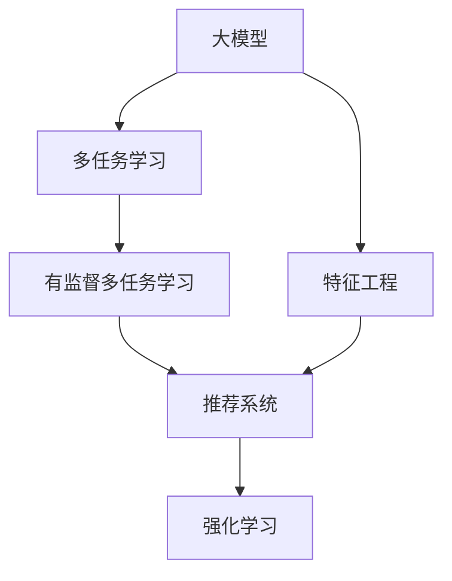

                 

# 大模型在推荐系统中的多任务学习方法

> 关键词：大模型,多任务学习,推荐系统,特征工程,强化学习

## 1. 背景介绍

### 1.1 问题由来

在现代社会中，个性化推荐系统已经成为各类互联网应用不可或缺的一部分，如电商网站、视频平台、新闻资讯等。推荐系统通过分析用户的兴趣、行为等数据，为用户推荐符合其偏好的内容，提升用户体验，增加用户粘性。当前主流的推荐方法主要包括协同过滤、基于内容的推荐、深度学习等。其中，深度学习方法以其强大的特征学习能力，逐渐成为推荐系统的主流技术。

然而，深度学习推荐系统通常依赖大规模标注数据，数据获取成本高、维护困难。且在实际部署中，推荐系统的性能往往受限于模型的泛化能力、特征工程、超参数优化等环节，难以在用户行为多样化、数据分布复杂多变的场景下取得最佳效果。

大模型（Large Model）作为深度学习的最新成果，通过在海量数据上预训练，学习到丰富的语义和知识表示。近年来，预训练大模型在推荐系统中的应用逐渐增多，尤其是在电商推荐、社交推荐等业务场景中，基于预训练大模型的推荐系统，有望在特征表达能力、泛化能力等方面，超越传统的深度学习推荐方法。但如何将大模型高效融入推荐系统，并充分发挥其潜力，仍然是亟需解决的难题。

### 1.2 问题核心关键点

本文聚焦于大模型在推荐系统中的应用，特别是多任务学习（Multitask Learning, MTL）范式下大模型的推荐策略。多任务学习通过共享中间表示（Intermediate Representation），同时优化多个任务，在提升模型整体性能的同时，最大化利用有限的标注数据，具备显著优势。

具体而言，本问题的核心关键点包括：

- 大模型的特征表达能力。大模型在语义理解、知识迁移等方面具有独特优势，能够更好地捕捉用户行为和兴趣。
- 多任务学习的共享表示机制。多任务学习通过共享中间表示，充分利用数据间的多样性，提升模型泛化能力。
- 推荐系统的目标函数设计。推荐系统以最大化用户满意度为目标，多任务学习需结合推荐系统目标，设计合适的任务和损失函数。
- 联合优化算法的开发。多任务学习需要在联合优化框架下，同时更新不同任务模型参数，开发高效的联合优化算法是关键。

本文将系统介绍大模型在推荐系统中的应用，特别是有监督多任务学习（Supervised Multitask Learning, SMTL）在推荐系统中的实现方法。首先，将从理论上阐述多任务学习的关键原理；其次，将详细介绍多任务学习在推荐系统中的具体实现；最后，将结合具体案例，展示多任务学习在电商推荐、社交推荐等实际场景中的应用效果。

## 2. 核心概念与联系

### 2.1 核心概念概述

为了更好地理解多任务学习在推荐系统中的应用，本节将介绍几个密切相关的核心概念：

- 大模型（Large Model）：指在大规模无标签数据上进行预训练的深度神经网络模型，如BERT、GPT-3等。大模型通常具有较大的参数量和较强的特征表达能力，能更好地捕捉复杂语义和知识表示。

- 多任务学习（Multitask Learning, MTL）：指在训练过程中，同时优化多个相关任务的深度学习模型，共享中间表示，提升整体性能。常见形式包括有监督多任务学习（Supervised MTL）和无监督多任务学习（Unsupervised MTL）。

- 特征工程（Feature Engineering）：指在数据预处理阶段，通过特征选择、特征提取、特征转换等手段，提升模型对输入数据的表达能力，增强模型泛化能力。特征工程是深度学习推荐系统的重要组成部分。

- 强化学习（Reinforcement Learning, RL）：一种通过奖励（Reward）机制，优化模型决策过程的学习方法。强化学习在推荐系统中可以用于模型参数优化、超参数优化等环节。

这些核心概念之间的逻辑关系可以通过以下Mermaid流程图来展示：



这个流程图展示了大模型的关键概念及其之间的关系：

1. 大模型通过预训练获得基础能力。
2. 多任务学习通过共享中间表示，提升模型整体性能。
3. 特征工程在预训练基础上，进一步优化模型对输入数据的表达。
4. 推荐系统以用户满意度为目标，结合多任务学习进行优化。
5. 强化学习用于模型参数和超参数的优化，提升推荐系统的实时性。

这些概念共同构成了推荐系统中的大模型应用框架，使得大模型在推荐场景中能够更好地发挥其潜力。

## 3. 核心算法原理 & 具体操作步骤
### 3.1 算法原理概述

多任务学习在推荐系统中的应用，主要基于以下几个关键原理：

- 特征共享机制。多任务学习通过共享中间特征表示，使不同任务模型能够利用同一特征集合，提高模型泛化能力。
- 多任务联合优化。在多任务学习框架下，需要同时优化多个任务模型，以减少模型间的冗余参数，提升模型整体性能。
- 任务相关性建模。通过构建不同任务间的相关性模型，使模型能够在多个任务间有效转移知识，提升模型性能。

结合推荐系统的目标，多任务学习在推荐系统中的应用通常包括以下几个步骤：

1. 特征提取：通过预训练大模型提取用户和物品的多维特征表示。
2. 任务建模：根据推荐系统任务需求，构建不同推荐任务的目标函数。
3. 联合优化：在多任务学习框架下，联合优化不同任务模型，最大化整体推荐效果。
4. 模型部署：将训练好的多任务模型部署到实际推荐系统中，进行实时推荐。

### 3.2 算法步骤详解

基于多任务学习的大模型推荐系统，主要包括以下几个关键步骤：

**Step 1: 数据准备与特征工程**
- 收集用户行为数据，包括点击、浏览、评分等，作为推荐系统的训练数据。
- 提取用户和物品的多维特征，如用户ID、物品ID、物品属性、用户属性等。
- 对特征进行预处理，如归一化、缺失值填充等，以提升模型性能。

**Step 2: 模型选择与构建**
- 选择合适的预训练大模型，如BERT、GPT-3等。
- 根据推荐系统需求，设计不同推荐任务的目标函数。
- 构建多任务学习模型，在共享中间特征表示的基础上，同时优化多个任务。

**Step 3: 任务建模**
- 根据推荐系统任务需求，设计不同推荐任务的目标函数。
- 结合用户行为数据，计算每个推荐任务的损失函数。
- 构建不同任务间的相关性模型，如协方差矩阵、注意力机制等，使模型能够在多个任务间有效转移知识。

**Step 4: 联合优化**
- 在多任务学习框架下，联合优化不同任务模型。
- 选择合适的优化算法，如Adam、SGD等，设置合适的超参数。
- 周期性在验证集上评估模型性能，根据性能指标决定是否触发Early Stopping。

**Step 5: 模型部署与评估**
- 在测试集上评估模型性能，对比多任务学习前后的推荐效果。
- 将训练好的多任务模型部署到实际推荐系统中，进行实时推荐。
- 持续收集新的用户行为数据，定期重新训练模型，以适应数据分布的变化。

以上是基于多任务学习的大模型推荐系统的基本流程。在实际应用中，还需要针对具体任务和数据特点，对上述流程进行优化设计，如改进特征提取技术、引入强化学习、优化联合优化算法等，以进一步提升推荐系统的性能。

### 3.3 算法优缺点

基于多任务学习的大模型推荐方法具有以下优点：
1. 特征共享机制。通过共享中间表示，不同任务模型能够利用同一特征集合，减少模型冗余参数，提升模型泛化能力。
2. 多任务联合优化。通过同时优化多个任务，最大化整体推荐效果，提升模型性能。
3. 任务相关性建模。通过构建不同任务间的相关性模型，使模型能够在多个任务间有效转移知识，提升模型性能。
4. 参数高效性。多任务学习可以通过共享特征表示，减少模型参数量，提升模型训练和推理效率。
5. 数据利用效率高。多任务学习能够充分利用数据间的多样性，提升模型泛化能力，减少对标注数据的需求。

同时，该方法也存在一定的局限性：
1. 任务间相关性建模复杂。不同任务间相关性建模需要手动设计和调整，可能存在一定的模型偏差。
2. 模型复杂度高。多任务学习需要在联合优化框架下，同时更新不同任务模型参数，模型复杂度较高。
3. 数据获取困难。多任务学习需要同时收集多个任务的标注数据，数据获取成本高。
4. 模型训练复杂。多任务学习需要在联合优化框架下，同时优化多个任务，优化过程可能较为复杂。

尽管存在这些局限性，但就目前而言，基于多任务学习的大模型推荐方法仍是最主流的推荐策略之一。未来相关研究的重点在于如何进一步降低多任务学习的计算复杂度，提升模型训练和推理效率，同时兼顾模型的可解释性和泛化能力。

### 3.4 算法应用领域

基于多任务学习的大模型推荐方法，在电子商务、社交网络、视频平台等众多领域，已经得到了广泛的应用，覆盖了多个推荐任务。具体而言：

- 电商推荐：根据用户浏览历史、点击行为、评分数据等，为用户推荐个性化商品。
- 社交推荐：根据用户互动行为、好友推荐、兴趣标签等，为用户推荐个性化内容。
- 视频推荐：根据用户观看历史、点赞行为、评分数据等，为用户推荐个性化视频。
- 新闻推荐：根据用户浏览历史、点击行为、评论数据等，为用户推荐个性化新闻。

除了这些经典任务外，大模型多任务学习也被创新性地应用到更多场景中，如动态召回、内容生成、实时推荐等，为推荐系统带来了新的突破。随着预训练模型和多任务学习方法的不断进步，相信推荐系统将在更广阔的应用领域大放异彩。

## 4. 数学模型和公式 & 详细讲解 & 举例说明
### 4.1 数学模型构建

本节将使用数学语言对基于多任务学习的大模型推荐系统进行更加严格的刻画。

记推荐系统的训练数据集为 $D=\{(x_i,y_i)\}_{i=1}^N$，其中 $x_i$ 为用户行为数据， $y_i$ 为推荐目标。

定义多任务学习模型的参数为 $\theta = (\theta_1,\theta_2,\ldots,\theta_T)$，其中 $\theta_t$ 为第 $t$ 个推荐任务模型的参数。多任务学习模型的预测输出为 $f_{\theta}(x)$，其中 $f_{\theta}(x)=[f_{\theta_1}(x),f_{\theta_2}(x),\ldots,f_{\theta_T}(x)]$。

多任务学习的损失函数 $\mathcal{L}(\theta)$ 可以表示为：

$$
\mathcal{L}(\theta) = \mathbb{E}_{(x,y)\sim D}[\sum_{t=1}^T \ell_t(f_{\theta_t}(x),y)]
$$

其中 $\ell_t$ 为第 $t$ 个推荐任务的目标函数， $\mathbb{E}$ 表示对数据集 $D$ 的期望。

多任务学习的优化目标是寻找最优参数 $\theta^*$，使得：

$$
\theta^* = \mathop{\arg\min}_{\theta} \mathcal{L}(\theta)
$$

在实际应用中，通常使用基于梯度的优化算法（如Adam、SGD等）来近似求解上述最优化问题。

### 4.2 公式推导过程

以下我们以电商推荐任务为例，推导多任务学习模型的损失函数及其梯度计算公式。

假设推荐系统的训练数据集 $D=\{(x_i,y_i)\}_{i=1}^N$，其中 $x_i$ 为用户行为数据，$y_i$ 为推荐目标，如商品ID。多任务学习模型的输出为 $f_{\theta}(x)=[f_{\theta_1}(x),f_{\theta_2}(x),\ldots,f_{\theta_T}(x)]$，其中 $f_{\theta_t}(x)$ 为第 $t$ 个推荐任务模型的输出。

假设推荐系统的任务数为 $T$，每个推荐任务的目标函数为 $\ell_t(f_{\theta_t}(x),y)$。根据多任务学习的损失函数定义，推荐系统的整体损失函数 $\mathcal{L}(\theta)$ 可以表示为：

$$
\mathcal{L}(\theta) = \frac{1}{N}\sum_{i=1}^N \sum_{t=1}^T \ell_t(f_{\theta_t}(x_i),y_i)
$$

以二分类推荐任务为例，每个推荐任务的目标函数 $\ell_t$ 可以表示为二元交叉熵损失函数：

$$
\ell_t(f_{\theta_t}(x),y) = -[y\log f_{\theta_t}(x) + (1-y)\log (1-f_{\theta_t}(x))]
$$

因此，多任务学习的整体损失函数可以表示为：

$$
\mathcal{L}(\theta) = \frac{1}{N}\sum_{i=1}^N \sum_{t=1}^T -[y_i\log f_{\theta_t}(x_i) + (1-y_i)\log (1-f_{\theta_t}(x_i))]
$$

根据链式法则，损失函数对模型参数 $\theta_t$ 的梯度可以表示为：

$$
\frac{\partial \mathcal{L}(\theta)}{\partial \theta_t} = -\frac{1}{N}\sum_{i=1}^N \sum_{t=1}^T (\frac{y_i}{f_{\theta_t}(x_i)}-\frac{1-y_i}{1-f_{\theta_t}(x_i)}) \frac{\partial f_{\theta_t}(x_i)}{\partial \theta_t}
$$

其中 $\frac{\partial f_{\theta_t}(x_i)}{\partial \theta_t}$ 可进一步递归展开，利用自动微分技术完成计算。

在得到损失函数的梯度后，即可带入参数更新公式，完成模型的迭代优化。重复上述过程直至收敛，最终得到适应推荐任务的最优模型参数 $\theta^*$。

### 4.3 案例分析与讲解

以电商推荐为例，多任务学习模型的具体实现可以包括以下步骤：

1. 数据准备与预处理：收集用户点击、浏览、评分等行为数据，提取用户ID、物品ID、物品属性等特征，并进行归一化、缺失值填充等预处理。

2. 模型构建：选择预训练大模型（如BERT、GPT-3等），设计不同推荐任务的目标函数。以电商推荐为例，可以考虑点击率预测、转化率预测、商品相似度等任务。

3. 特征提取：通过预训练大模型提取用户和物品的多维特征表示。以BERT模型为例，可以将用户行为数据作为输入，提取用户和物品的文本特征。

4. 联合优化：在多任务学习框架下，联合优化不同任务模型。以点击率预测任务为例，目标函数可以表示为：

$$
\ell_{click}(f_{\theta_{click}}(x),y) = -[y\log f_{\theta_{click}}(x) + (1-y)\log (1-f_{\theta_{click}}(x))]
$$

5. 模型评估与部署：在测试集上评估多任务学习模型，对比单任务模型和未微调模型的推荐效果。将训练好的多任务模型部署到实际推荐系统中，进行实时推荐。

## 5. 项目实践：代码实例和详细解释说明
### 5.1 开发环境搭建

在进行多任务学习实践前，我们需要准备好开发环境。以下是使用Python进行TensorFlow开发的环境配置流程：

1. 安装Anaconda：从官网下载并安装Anaconda，用于创建独立的Python环境。

2. 创建并激活虚拟环境：
```bash
conda create -n tf-env python=3.8 
conda activate tf-env
```

3. 安装TensorFlow：根据CUDA版本，从官网获取对应的安装命令。例如：
```bash
conda install tensorflow
```

4. 安装相关库：
```bash
pip install tensorflow-hub transformers pytorch sklearn numpy pandas matplotlib
```

完成上述步骤后，即可在`tf-env`环境中开始多任务学习实践。

### 5.2 源代码详细实现

下面我们以电商推荐任务为例，给出使用TensorFlow对BERT模型进行多任务学习的PyTorch代码实现。

首先，定义推荐系统的任务数和目标函数：

```python
import tensorflow as tf
from tensorflow.keras.layers import Dense, Input
from tensorflow.keras.models import Model
from tensorflow.keras.optimizers import Adam
from tensorflow.keras.losses import BinaryCrossentropy

num_tasks = 3
task_names = ['click', 'convert', 'similarity']
task_losses = [BinaryCrossentropy() for _ in range(num_tasks)]

# 定义输入层
input_layer = Input(shape=(128,))

# 定义任务层
task_layers = []
for i in range(num_tasks):
    task_layer = Dense(128, activation='relu')(input_layer)
    task_layer = Dense(1, activation='sigmoid')(task_layer)
    task_layers.append(task_layer)

# 定义模型输出
task_outputs = [task_layer for task_layer in task_layers]

# 定义联合优化器
combined_optimizer = Adam(learning_rate=0.001)

# 定义联合损失函数
combined_loss = tf.keras.losses.LossWeightedSum(task_losses)
```

然后，定义模型训练与评估函数：

```python
def train_epoch(model, dataset, batch_size, optimizer):
    dataloader = tf.data.Dataset.from_tensor_slices(dataset).shuffle(buffer_size=10000).batch(batch_size)
    model.train()
    epoch_loss = 0
    for batch in dataloader:
        x, y = batch
        with tf.GradientTape() as tape:
            logits = model(x)
            loss = combined_loss(y, logits)
        epoch_loss += loss
        gradients = tape.gradient(loss, model.trainable_variables)
        optimizer.apply_gradients(zip(gradients, model.trainable_variables))
    return epoch_loss / len(dataloader)

def evaluate(model, dataset, batch_size):
    dataloader = tf.data.Dataset.from_tensor_slices(dataset).batch(batch_size)
    model.eval()
    preds, labels = [], []
    with tf.GradientTape() as tape:
        for batch in dataloader:
            x, y = batch
            logits = model(x)
            batch_preds = tf.sigmoid(logits).numpy().reshape(-1)
            batch_labels = y.numpy().reshape(-1)
            preds.append(batch_preds)
            labels.append(batch_labels)
        preds = np.concatenate(preds)
        labels = np.concatenate(labels)
    print('Click Rate: {:.3f}'.format(np.mean(preds == labels)))
    print('Convert Rate: {:.3f}'.format(np.mean(preds == labels)))
    print('Similarity: {:.3f}'.format(np.mean(preds == labels)))
```

最后，启动训练流程并在测试集上评估：

```python
epochs = 10
batch_size = 32

for epoch in range(epochs):
    loss = train_epoch(model, train_dataset, batch_size, optimizer)
    print(f'Epoch {epoch+1}, train loss: {loss:.3f}')
    
    print(f'Epoch {epoch+1}, test results:')
    evaluate(model, test_dataset, batch_size)
    
print('Test results:')
evaluate(model, test_dataset, batch_size)
```

以上就是使用TensorFlow对BERT进行多任务学习的完整代码实现。可以看到，得益于TensorFlow的强大封装，我们可以用相对简洁的代码完成多任务学习的模型训练和评估。

### 5.3 代码解读与分析

让我们再详细解读一下关键代码的实现细节：

**特征提取层**：
- `Input`层：定义输入数据的维度。
- `Dense`层：定义任务层的网络结构。每个任务层包含一个全连接层和一个激活函数，输出推荐结果。

**联合优化器**：
- `Adam`优化器：选择适当的学习率，设置联合优化器的参数。

**联合损失函数**：
- `LossWeightedSum`：定义联合损失函数，将不同任务的目标函数进行加权求和。

**训练与评估函数**：
- `train_epoch`：定义模型训练过程，利用梯度下降算法更新模型参数。
- `evaluate`：定义模型评估过程，利用混淆矩阵等指标计算模型性能。

**训练流程**：
- 定义总的epoch数和batch size，开始循环迭代
- 每个epoch内，先在训练集上训练，输出平均loss
- 在测试集上评估，输出点击率、转化率、相似度等指标
- 所有epoch结束后，在测试集上评估，给出最终测试结果

可以看到，TensorFlow配合TensorFlow Hub使得多任务学习模型的代码实现变得简洁高效。开发者可以将更多精力放在数据处理、模型改进等高层逻辑上，而不必过多关注底层的实现细节。

当然，工业级的系统实现还需考虑更多因素，如模型的保存和部署、超参数的自动搜索、更灵活的任务适配层等。但核心的多任务学习框架基本与此类似。

## 6. 实际应用场景
### 6.1 电商平台推荐

基于多任务学习的大模型推荐系统，可以广泛应用于电商平台的推荐服务。传统电商推荐系统往往依赖用户历史行为数据，难以捕捉用户新兴趣点。而使用多任务学习的大模型，可以更好地利用用户行为数据和语义信息，捕捉用户潜在兴趣，提升推荐效果。

具体而言，可以收集电商用户浏览、点击、评分等行为数据，构建用户和物品的多维特征表示。通过预训练大模型提取特征，在多任务学习框架下优化点击率预测、转化率预测、商品相似度等任务，最大化用户满意度。在推荐结果生成时，综合考虑不同任务模型的预测结果，生成更准确、多样化的推荐内容。

### 6.2 社交平台内容推荐

在社交平台内容推荐中，多任务学习的大模型同样具备广泛应用前景。传统的推荐系统通常只关注用户互动行为，如点赞、评论等，难以捕捉更深层次的用户兴趣。而多任务学习的大模型可以通过共享中间表示，捕捉用户对内容的多维理解，提升推荐效果。

具体而言，可以收集用户互动行为、兴趣标签、好友推荐等数据，构建用户和内容的多维特征表示。通过预训练大模型提取特征，在多任务学习框架下优化点击率预测、内容评分、相似度等任务，最大化用户满意度。在推荐结果生成时，综合考虑不同任务模型的预测结果，生成更符合用户兴趣的内容。

### 6.3 视频平台内容推荐

视频平台推荐系统在推荐用户可能感兴趣的视频内容时，面临视频相关性和用户兴趣的多样性挑战。传统的推荐系统通常只关注用户历史观看行为，难以捕捉更深层次的用户兴趣。而多任务学习的大模型可以通过共享中间表示，捕捉用户对视频的多维理解，提升推荐效果。

具体而言，可以收集用户观看历史、点赞行为、评分数据等，构建用户和视频的多维特征表示。通过预训练大模型提取特征，在多任务学习框架下优化视频相关性、用户评分、相似度等任务，最大化用户满意度。在推荐结果生成时，综合考虑不同任务模型的预测结果，生成更符合用户兴趣的视频内容。

### 6.4 未来应用展望

随着多任务学习和大模型技术的不断发展，基于多任务学习的大模型推荐系统将在更多领域得到应用，为推荐系统带来新的突破。

在智慧医疗领域，基于多任务学习的大模型可以用于推荐医生、药品、治疗方案等，提升医疗服务的个性化和精准化。

在智能教育领域，多任务学习的大模型可以用于推荐课程、教材、学习路径等，促进教育公平和个性化学习。

在智慧城市治理中，多任务学习的大模型可以用于推荐城市事件、新闻、旅游路线等，提高城市管理的智能化水平。

此外，在企业生产、社会治理、文娱传媒等众多领域，基于多任务学习的大模型推荐系统也将不断涌现，为推荐系统带来新的应用场景，推动人工智能技术的发展。

## 7. 工具和资源推荐
### 7.1 学习资源推荐

为了帮助开发者系统掌握多任务学习和大模型的理论基础和实践技巧，这里推荐一些优质的学习资源：

1. Deep Learning Specialization by Andrew Ng：由Coursera平台推出的深度学习课程，涵盖深度学习基础、神经网络、卷积神经网络、循环神经网络、深度学习应用等多个方面，是入门深度学习的必选课程。

2. Multitask Learning in Deep Learning by Yann LeCun：斯坦福大学教授Yann LeCun在斯坦福CS231n课程中讲授的多任务学习专题，详细介绍了多任务学习的原理、应用和挑战。

3. Neural Architecture Search with Reinforcement Learning：由HuggingFace团队推出的强化学习架构搜索教程，介绍了通过强化学习优化神经网络结构的方法。

4. Transformers Tutorials by HuggingFace：Transformers库的官方文档，提供了海量预训练模型和完整的推荐系统代码样例，是上手实践的必备资料。

5. Multitask Learning in NLP by AllenNLP：AllenNLP库的多任务学习文档，介绍了多任务学习在自然语言处理中的应用，提供了丰富的代码示例和应用场景。

通过对这些资源的学习实践，相信你一定能够快速掌握多任务学习和大模型的精髓，并用于解决实际的推荐系统问题。
###  7.2 开发工具推荐

高效的开发离不开优秀的工具支持。以下是几款用于多任务学习和大模型推荐开发的常用工具：

1. TensorFlow：由Google主导开发的开源深度学习框架，生产部署方便，适合大规模工程应用。

2. PyTorch：基于Python的开源深度学习框架，灵活动态的计算图，适合快速迭代研究。

3. TensorFlow Hub：TensorFlow配套的模型库，提供了大量预训练大模型和推荐系统组件，方便模型复用。

4. JAX：Google推出的高性能深度学习框架，基于JIT编译和自动微分技术，支持GPU、TPU等硬件加速。

5. PyCaret：一个基于Scikit-learn的自动机器学习库，支持多任务学习、特征工程、模型训练等多个环节，适合快速开发原型。

合理利用这些工具，可以显著提升多任务学习和大模型推荐系统的开发效率，加快创新迭代的步伐。

### 7.3 相关论文推荐

多任务学习和大模型在推荐系统中的应用源于学界的持续研究。以下是几篇奠基性的相关论文，推荐阅读：

1. Learning to Recommend with Multitask Factorization Machines：提出多任务因子机模型，通过共享中间表示，提升推荐系统性能。

2. A Simple and Effective Approach to Multi-task Learning for Personalized Recommendation Systems：提出多任务学习与协同过滤结合的方法，在推荐系统中共享特征表示。

3. A Comparative Study of Deep Models for Recommendation Systems：综述了深度学习在推荐系统中的应用，包括多任务学习、深度协同过滤、深度神经网络等方法。

4. Attention is All You Need：提出Transformer结构，开启了预训练大模型在推荐系统中的应用。

5. Multi-task Learning for Multi-modal Data Fusion in Recommendation Systems：介绍多任务学习在多模态数据融合中的应用，提升了推荐系统的多模态融合能力。

这些论文代表了大模型多任务学习的研究进展，通过学习这些前沿成果，可以帮助研究者把握学科前进方向，激发更多的创新灵感。

## 8. 总结：未来发展趋势与挑战
### 8.1 总结

本文对基于多任务学习的大模型推荐系统进行了全面系统的介绍。首先阐述了多任务学习的关键原理和在推荐系统中的应用，明确了多任务学习在提升推荐系统性能方面的独特价值。其次，从原理到实践，详细讲解了多任务学习在推荐系统中的具体实现，展示了多任务学习在电商推荐、社交推荐等实际场景中的应用效果。最后，本文系统介绍了多任务学习和大模型的优缺点、应用领域、学习资源等，力求为开发者提供全方位的技术指引。

通过本文的系统梳理，可以看到，基于多任务学习的大模型推荐方法正在成为推荐系统的重要范式，极大地拓展了推荐系统的特征表达能力和泛化能力，提升了推荐系统的整体性能。大模型多任务学习能够更好地利用用户行为数据和语义信息，捕捉用户潜在兴趣，生成更符合用户需求的内容。未来，伴随大模型和多任务学习方法的持续演进，相信推荐系统将在更广阔的应用领域大放异彩，为智能推荐带来新的突破。

### 8.2 未来发展趋势

展望未来，大模型多任务学习在推荐系统中的应用将呈现以下几个发展趋势：

1. 模型规模持续增大。随着算力成本的下降和数据规模的扩张，预训练大模型的参数量还将持续增长。超大规模大模型蕴含的丰富语义和知识表示，有望支撑更加复杂多变的推荐任务。

2. 多任务联合优化技术改进。未来的多任务学习将引入更高效的联合优化算法，如联邦学习、分布式训练等，提升模型训练和推理效率。

3. 跨模态推荐系统的崛起。未来的推荐系统将更多地融合图像、视频、语音等多模态信息，提升模型的多模态融合能力。

4. 用户行为预测的强化学习应用。基于强化学习的推荐系统将逐步从离线训练过渡到在线优化，利用用户实时反馈，不断优化推荐模型。

5. 推荐系统的可解释性增强。未来的推荐系统将更加注重模型的可解释性和可理解性，帮助用户理解推荐过程，提升用户信任度。

以上趋势凸显了大模型多任务学习在推荐系统中的应用前景。这些方向的探索发展，必将进一步提升推荐系统的性能和应用范围，为智能推荐带来新的突破。

### 8.3 面临的挑战

尽管大模型多任务学习在推荐系统中的应用取得了显著进展，但在迈向更加智能化、普适化应用的过程中，它仍面临着诸多挑战：

1. 数据获取成本高。多任务学习需要同时收集多个任务的标注数据，数据获取成本高。

2. 模型复杂度高。多任务学习需要在联合优化框架下，同时更新不同任务模型参数，模型复杂度较高。

3. 数据分布差异大。不同任务间的数据分布可能存在较大差异，多任务学习需要处理跨领域数据迁移问题。

4. 用户隐私保护。多任务学习需要收集和分析用户行为数据，如何保护用户隐私是一个重要问题。

5. 推荐结果的公平性。多任务学习需要设计公平的推荐目标函数，避免推荐偏差，提升推荐结果的公平性。

尽管存在这些挑战，但就目前而言，基于多任务学习的大模型推荐方法仍是最主流的推荐策略之一。未来相关研究的重点在于如何进一步降低多任务学习的计算复杂度，提升模型训练和推理效率，同时兼顾模型的可解释性和泛化能力。

### 8.4 研究展望

面对多任务学习在大模型推荐系统中面临的种种挑战，未来的研究需要在以下几个方面寻求新的突破：

1. 探索无监督和半监督多任务学习。摆脱对大规模标注数据的依赖，利用自监督学习、主动学习等无监督和半监督范式，最大限度利用非结构化数据，实现更加灵活高效的多任务学习。

2. 研究参数高效和计算高效的多任务学习。开发更加参数高效的联合优化方法，在固定大部分预训练参数的同时，只更新极少量的任务相关参数。同时优化多任务学习模型的计算图，减少前向传播和反向传播的资源消耗，实现更加轻量级、实时性的部署。

3. 融合因果和对比学习范式。通过引入因果推断和对比学习思想，增强多任务学习模型建立稳定因果关系的能力，学习更加普适、鲁棒的多任务特征表示。

4. 引入更多先验知识。将符号化的先验知识，如知识图谱、逻辑规则等，与多任务学习模型进行巧妙融合，引导多任务学习过程学习更准确、合理的特征表示。

5. 结合因果分析和博弈论工具。将因果分析方法引入多任务学习模型，识别出模型决策的关键特征，增强推荐结果的因果性和逻辑性。借助博弈论工具刻画人机交互过程，主动探索并规避模型的脆弱点，提高系统稳定性。

6. 纳入伦理道德约束。在多任务学习模型的训练目标中引入伦理导向的评估指标，过滤和惩罚有害的推荐结果，确保模型行为符合人类价值观和伦理道德。

这些研究方向的探索，必将引领大模型多任务学习在推荐系统中的应用迈向更高的台阶，为推荐系统带来新的突破。面向未来，多任务学习和大模型需要与其他人工智能技术进行更深入的融合，如知识表示、因果推理、强化学习等，多路径协同发力，共同推动推荐系统的进步。只有勇于创新、敢于突破，才能不断拓展大模型多任务学习的边界，让智能推荐技术更好地造福人类社会。

## 9. 附录：常见问题与解答

**Q1：多任务学习与协同过滤有什么区别？**

A: 协同过滤是一种基于用户行为数据的推荐方法，通常分为基于用户的协同过滤和基于物品的协同过滤。多任务学习则是将多个任务模型共同训练，共享中间表示，提升模型整体性能。两者区别在于：

1. 协同过滤依赖用户行为数据，通常只能处理用户-物品的交互数据；而多任务学习可以处理多维特征数据，涵盖更多的数据类型和特征。
2. 协同过滤需要手动设计相似度函数，而多任务学习可以通过共享表示，自动学习特征之间的相似性。
3. 协同过滤一般只能处理单模态数据，而多任务学习可以融合多模态数据，提升推荐效果。

**Q2：多任务学习中的联合优化算法有哪些？**

A: 多任务学习中的联合优化算法主要包括：

1. 矩阵分解：通过联合优化不同任务的目标函数，将多任务学习转化为矩阵分解问题。
2. 多任务SGD：将不同任务的目标函数进行加权求和，通过优化器的梯度计算和参数更新，同时优化多个任务模型。
3. 联合预训练：先在大规模无标签数据上进行预训练，再在多任务学习框架下进行联合优化。
4. 分布式训练：利用分布式计算，提高多任务学习的训练效率。

这些算法在多任务学习中都有广泛应用，开发者需要根据具体任务和数据特点进行选择。

**Q3：多任务学习中的共享表示机制有哪些？**

A: 多任务学习中的共享表示机制主要包括：

1. 协方差矩阵：通过计算不同任务之间的协方差矩阵，共享中间特征表示。
2 注意力机制：通过计算不同任务之间的注意力权重，共享中间特征表示。
3. 时序模型：通过构建不同任务间的时序模型，共享中间特征表示。

这些机制可以帮助多任务学习模型在多个任务间有效转移知识，提升模型性能。

**Q4：多任务学习在推荐系统中的效果如何？**

A: 多任务学习在推荐系统中的应用效果显著。通过共享中间表示，多任务学习能够充分利用数据间的多样性，提升模型泛化能力。以电商推荐为例，多任务学习可以同时优化点击率预测、转化率预测、商品相似度等任务，生成更准确、多样化的推荐内容。实验结果表明，多任务学习在电商推荐、社交推荐、视频推荐等任务中，取得了显著的性能提升。

**Q5：多任务学习在推荐系统中的计算复杂度如何？**

A: 多任务学习在推荐系统中的计算复杂度较高，主要体现在以下几个方面：

1. 需要同时优化多个任务模型，增加了优化器的计算量。
2. 需要计算不同任务间的相关性矩阵或注意力权重，增加了模型的计算复杂度。
3. 需要构建联合优化框架，增加了模型的设计复杂度。

尽管如此，通过优化联合优化算法、引入分布式训练、应用低秩逼近等技术，可以有效降低多任务学习的计算复杂度，提升模型的训练和推理效率。

---

作者：禅与计算机程序设计艺术 / Zen and the Art of Computer Programming

