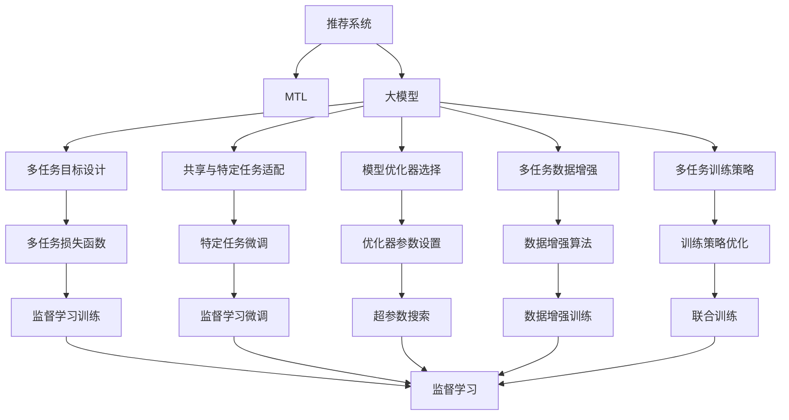

                 

# 大模型在推荐系统中的多任务迁移学习应用

> 关键词：推荐系统,多任务迁移学习,大模型,深度学习,强化学习,优化器,损失函数

## 1. 背景介绍

### 1.1 问题由来

推荐系统一直是互联网行业的研究热点，从早期基于协同过滤和内容推荐的基于用户和内容的推荐方法，到如今基于深度学习的推荐模型，推荐系统在个性化的用户推荐方面取得了显著进展。其中，深度学习模型，尤其是基于神经网络的大规模推荐模型，已经成为了推荐系统的主流。然而，现有的深度学习推荐模型往往只能关注单一的推荐指标，忽略了其他多维度的信息，如个性化、多样性、新颖性等，导致推荐结果过于单一，难以满足用户的多样化需求。

多任务迁移学习（Multi-task Transfer Learning, MTTL）作为一种高效利用多源数据和知识，提升模型泛化性能的技术，其跨领域的知识迁移能力对于推荐系统的优化具有重要价值。基于大模型的多任务迁移学习推荐系统，能够同时学习多种推荐任务，充分利用用户历史行为数据、兴趣标签、个性化特征等多源数据，提升推荐系统的个性化、多样性和新颖性，从而带来更优秀的用户体验。

### 1.2 问题核心关键点

多任务迁移学习在推荐系统中的应用，通过将预训练模型视作一个强大的“特征提取器”，对推荐任务的多种指标进行有监督地微调，使得模型能够同时适应不同的推荐任务，并提升其在特定推荐任务上的性能。核心关键点包括：

1. **多任务目标设计**：选择合适的推荐任务指标，如个性化、多样性、新颖性、准确性等，作为多任务的目标函数，设计合适的损失函数。
2. **共享与特定任务适配**：共享预训练模型权重，同时对特定任务进行微调，既利用预训练模型的通用知识，又针对特定推荐任务进行优化。
3. **模型优化器选择**：选择合适的优化器（如AdamW、SGD等），设定合适的学习率、正则化等超参数，优化多任务模型的训练过程。
4. **多任务数据增强**：使用不同的数据增强策略，如对抗样本生成、噪声注入、数据重采样等，增强模型对不同推荐任务的鲁棒性。
5. **多任务训练策略**：采用多任务联合训练策略，如多任务联合优化（Multi-task Joint Training, M2JT）、交替训练等，提升模型的泛化能力和稳定性能。

## 2. 核心概念与联系

### 2.1 核心概念概述

为了更好地理解大模型在推荐系统中的多任务迁移学习应用，本节将介绍几个密切相关的核心概念：

- **推荐系统（Recommendation System）**：通过分析用户历史行为数据，推荐系统能够预测用户对某项物品的兴趣，从而为用户推荐相关的物品。
- **多任务迁移学习（MTTL）**：在多个相关任务上同时进行学习，以共享知识并提升模型性能。
- **大模型（Large Model）**：以深度学习为核心的模型，通过大规模预训练学习广泛的通用知识，具备强大的特征提取能力。
- **强化学习（Reinforcement Learning）**：通过与环境交互，强化学习能够提升模型的决策能力和鲁棒性。
- **优化器（Optimizer）**：用于优化损失函数的算法，如Adam、SGD等。
- **损失函数（Loss Function）**：衡量模型输出与真实标签之间差异的函数，如交叉熵损失、均方误差损失等。

这些核心概念之间的逻辑关系可以通过以下Mermaid流程图来展示：



这个流程图展示了大模型在推荐系统中的核心概念以及它们之间的联系：

1. 推荐系统通过收集用户行为数据，利用多任务迁移学习对大模型进行优化。
2. 大模型通过预训练学习广泛的知识，并在多任务目标设计中得到应用。
3. 模型通过共享和特定任务微调，最大化利用预训练和特定任务的知识。
4. 优化器、损失函数、数据增强等策略在多任务学习中协同工作，提升模型性能。
5. 多任务联合训练策略确保模型在不同任务上的泛化能力。

## 3. 核心算法原理 & 具体操作步骤
### 3.1 算法原理概述

基于大模型的推荐系统多任务迁移学习，本质上是一个有监督的多任务学习过程。其核心思想是：将预训练的大模型视作一个强大的“特征提取器”，通过在推荐任务的多种指标上进行有监督地微调，使得模型能够同时适应不同的推荐任务，并提升其在特定推荐任务上的性能。

形式化地，假设推荐系统包含多个任务 $T=\{T_1, T_2, ..., T_n\}$，对应多个指标 $\{y_1, y_2, ..., y_n\}$，则多任务迁移学习的目标函数为：

$$
\mathcal{L}(\theta) = \sum_{i=1}^n \mathcal{L}_i(M_{\theta}, D_i)
$$

其中，$M_{\theta}$ 为多任务学习的参数化模型，$D_i$ 为任务 $T_i$ 的数据集，$\mathcal{L}_i$ 为任务 $T_i$ 的损失函数。多任务目标函数是各任务损失函数的加和。

通过梯度下降等优化算法，多任务模型的训练过程不断更新模型参数 $\theta$，最小化多任务目标函数 $\mathcal{L}(\theta)$，使得模型输出逼近真实标签。由于 $\theta$ 已经通过预训练获得了较好的初始化，因此即便在多个任务上都进行微调，也能较快收敛到理想的模型参数 $\hat{\theta}$。

### 3.2 算法步骤详解

基于大模型的推荐系统多任务迁移学习一般包括以下几个关键步骤：

**Step 1: 准备多任务数据集和预训练模型**

- 收集多任务的数据集 $D=\{(x_i, y_i)\}_{i=1}^N, x_i \in \mathcal{X}, y_i \in \mathcal{Y}$，其中 $\mathcal{X}$ 为输入空间，$\mathcal{Y}$ 为输出空间。
- 选择合适的预训练模型 $M_{\theta}$，如 BERT、GPT 等，作为多任务学习的基础。

**Step 2: 设计多任务目标和损失函数**

- 根据推荐系统的多任务指标，选择合适的任务目标函数 $\mathcal{L}_i$，如交叉熵损失、均方误差损失等。
- 设计多任务目标函数 $\mathcal{L}$，一般为各任务损失函数的加和或权重调和平均。

**Step 3: 设置多任务超参数**

- 选择合适的优化算法及其参数，如 AdamW、SGD 等，设置学习率、批大小、迭代轮数等。
- 设置正则化技术及强度，包括权重衰减、Dropout、Early Stopping 等。
- 确定冻结预训练参数的策略，如仅微调顶层，或全部参数都参与微调。

**Step 4: 执行多任务梯度训练**

- 将训练集数据分批次输入模型，前向传播计算多任务目标函数。
- 反向传播计算参数梯度，根据设定的优化算法和学习率更新模型参数。
- 周期性在验证集上评估模型性能，根据性能指标决定是否触发 Early Stopping。
- 重复上述步骤直到满足预设的迭代轮数或 Early Stopping 条件。

**Step 5: 测试和部署**

- 在测试集上评估多任务模型 $M_{\hat{\theta}}$ 的性能，对比微调前后的精度提升。
- 使用多任务模型对新样本进行推理预测，集成到实际的应用系统中。
- 持续收集新的数据，定期重新微调模型，以适应数据分布的变化。

以上是基于大模型的推荐系统多任务迁移学习的一般流程。在实际应用中，还需要针对具体任务的特点，对多任务过程的各个环节进行优化设计，如改进多任务目标函数，引入更多的正则化技术，搜索最优的超参数组合等，以进一步提升模型性能。

### 3.3 算法优缺点

基于大模型的推荐系统多任务迁移学习方法具有以下优点：

1. 简单高效。只需准备多源数据集，即可对预训练模型进行多任务适配，获得较大的性能提升。
2. 通用适用。适用于推荐系统中的多种推荐任务，如个性化推荐、多样性推荐、新颖性推荐等，设计简单的多任务目标函数即可实现微调。
3. 参数高效。利用参数高效微调技术，在固定大部分预训练权重不变的情况下，仍可取得不错的提升。
4. 效果显著。在学术界和工业界的推荐系统任务上，基于多任务迁移学习的方法已经刷新了多项SOTA指标，带来了显著的效果提升。

同时，该方法也存在一定的局限性：

1. 依赖标注数据。多任务迁移学习的效果很大程度上取决于各任务标注数据的质量和数量，获取高质量标注数据的成本较高。
2. 任务依赖性强。当各任务之间的相关性较弱时，多任务迁移学习的效果可能不如单任务微调。
3. 任务目标冲突。当各任务目标函数冲突时，多任务学习可能会引入噪声，降低模型性能。
4. 多任务数据不平衡。各任务数据量不均衡可能导致模型对数据量少的任务学习不足，影响推荐效果。
5. 模型复杂度高。多任务学习模型通常包含多个任务的目标函数，计算复杂度较高，需要更多算力支持。

尽管存在这些局限性，但就目前而言，基于大模型的多任务迁移学习方法是推荐系统优化的一种重要范式。未来相关研究的重点在于如何进一步降低多任务迁移学习的依赖性，提高模型的泛化能力，同时兼顾可解释性和伦理安全性等因素。

### 3.4 算法应用领域

基于大模型的推荐系统多任务迁移学习在推荐系统领域已经得到了广泛的应用，覆盖了多种推荐任务，例如：

- 个性化推荐：根据用户的历史行为数据，为用户推荐最感兴趣的物品。通过多任务学习，可以同时关注个性化、多样性、新颖性等多个推荐指标。
- 多样性推荐：为用户推荐不同类型的物品，丰富用户体验。可以通过多任务学习，优化推荐结果的多样性。
- 新颖性推荐：推荐用户从未接触过的物品，激发探索性。可以通过多任务学习，学习用户对未知物品的探索意愿。
- 物品相关推荐：基于物品的特征，推荐相关的物品。可以通过多任务学习，学习物品之间的相似性和差异性。
- 用户协同过滤：通过用户历史行为数据，预测用户对某项物品的兴趣，推荐相关物品。可以通过多任务学习，同时优化推荐效果和用户满意度。

除了上述这些经典任务外，基于多任务迁移学习的方法还被创新性地应用到更多场景中，如推荐系统中的对抗训练、推荐策略优化等，为推荐系统带来了全新的突破。随着预训练模型和多任务迁移学习方法的不断进步，相信推荐系统将在更广阔的应用领域大放异彩。

## 4. 数学模型和公式 & 详细讲解 & 举例说明
### 4.1 数学模型构建

本节将使用数学语言对基于大模型的推荐系统多任务迁移学习过程进行更加严格的刻画。

记多任务学习的推荐系统为 $M_{\theta}:\mathcal{X} \rightarrow \mathcal{Y}$，其中 $\mathcal{X}$ 为输入空间，$\mathcal{Y}$ 为输出空间，$\theta$ 为多任务学习模型参数。假设推荐系统包含多个任务 $T=\{T_1, T_2, ..., T_n\}$，对应多个指标 $\{y_1, y_2, ..., y_n\}$。

定义模型 $M_{\theta}$ 在数据样本 $(x,y)$ 上的多任务损失函数为 $\mathcal{L}_i(M_{\theta}(x),y_i)$，则在数据集 $D$ 上的多任务经验风险为：

$$
\mathcal{L}(\theta) = \sum_{i=1}^n \frac{1}{N}\sum_{i=1}^N \mathcal{L}_i(M_{\theta}(x_i),y_i)
$$

其中 $\mathcal{L}_i$ 为任务 $T_i$ 的损失函数，如交叉熵损失、均方误差损失等。

多任务目标函数为：

$$
\mathcal{L}(\theta) = \sum_{i=1}^n \mathcal{L}_i(M_{\theta}(x_i),y_i)
$$

多任务模型的训练目标是最小化多任务目标函数，即找到最优参数：

$$
\theta^* = \mathop{\arg\min}_{\theta} \mathcal{L}(\theta)
$$

在实践中，我们通常使用基于梯度的优化算法（如SGD、Adam等）来近似求解上述最优化问题。设 $\eta$ 为学习率，$\lambda$ 为正则化系数，则参数的更新公式为：

$$
\theta \leftarrow \theta - \eta \nabla_{\theta}\mathcal{L}(\theta) - \eta\lambda\theta
$$

其中 $\nabla_{\theta}\mathcal{L}(\theta)$ 为损失函数对参数 $\theta$ 的梯度，可通过反向传播算法高效计算。

### 4.2 公式推导过程

以下我们以个性化推荐任务为例，推导多任务学习模型的交叉熵损失函数及其梯度的计算公式。

假设推荐系统包含两个任务：个性化推荐和多样性推荐。设模型 $M_{\theta}$ 在输入 $x$ 上的输出为 $\hat{y}=M_{\theta}(x)$，表示模型对物品的兴趣预测。

对于个性化推荐任务，我们假设目标函数为交叉熵损失，即：

$$
\mathcal{L}_{personal}(M_{\theta}(x),y) = -y\log M_{\theta}(x) - (1-y)\log (1-M_{\theta}(x))
$$

对于多样性推荐任务，我们假设目标函数为信息熵损失，即：

$$
\mathcal{L}_{diverse}(M_{\theta}(x),y) = -y \log M_{\theta}(x) - (1-y) \log (1-M_{\theta}(x))
$$

因此，多任务目标函数为：

$$
\mathcal{L}(\theta) = \mathcal{L}_{personal}(M_{\theta}(x),y) + \beta \mathcal{L}_{diverse}(M_{\theta}(x),y)
$$

其中 $\beta$ 为两个任务目标函数之间的权重，需要通过实验进行调参。

根据链式法则，损失函数对参数 $\theta_k$ 的梯度为：

$$
\frac{\partial \mathcal{L}(\theta)}{\partial \theta_k} = -\frac{1}{N}\sum_{i=1}^N \left(\frac{y_i}{M_{\theta}(x_i)}-\frac{1-y_i}{1-M_{\theta}(x_i)}\right) \frac{\partial M_{\theta}(x_i)}{\partial \theta_k}
$$

其中 $\frac{\partial M_{\theta}(x_i)}{\partial \theta_k}$ 可进一步递归展开，利用自动微分技术完成计算。

在得到损失函数的梯度后，即可带入参数更新公式，完成多任务模型的迭代优化。重复上述过程直至收敛，最终得到适应多任务学习模型参数 $\theta^*$。

## 5. 项目实践：代码实例和详细解释说明
### 5.1 开发环境搭建

在进行多任务迁移学习实践前，我们需要准备好开发环境。以下是使用Python进行PyTorch开发的环境配置流程：

1. 安装Anaconda：从官网下载并安装Anaconda，用于创建独立的Python环境。

2. 创建并激活虚拟环境：
```bash
conda create -n pytorch-env python=3.8 
conda activate pytorch-env
```

3. 安装PyTorch：根据CUDA版本，从官网获取对应的安装命令。例如：
```bash
conda install pytorch torchvision torchaudio cudatoolkit=11.1 -c pytorch -c conda-forge
```

4. 安装Transformers库：
```bash
pip install transformers
```

5. 安装各类工具包：
```bash
pip install numpy pandas scikit-learn matplotlib tqdm jupyter notebook ipython
```

完成上述步骤后，即可在`pytorch-env`环境中开始多任务迁移学习实践。

### 5.2 源代码详细实现

这里我们以个性化推荐任务为例，给出使用Transformers库对BERT模型进行多任务迁移学习的PyTorch代码实现。

首先，定义推荐任务的数据处理函数：

```python
from transformers import BertTokenizer
from torch.utils.data import Dataset
import torch

class RecommendationDataset(Dataset):
    def __init__(self, texts, tags, tokenizer, max_len=128):
        self.texts = texts
        self.tags = tags
        self.tokenizer = tokenizer
        self.max_len = max_len
        
    def __len__(self):
        return len(self.texts)
    
    def __getitem__(self, item):
        text = self.texts[item]
        tags = self.tags[item]
        
        encoding = self.tokenizer(text, return_tensors='pt', max_length=self.max_len, padding='max_length', truncation=True)
        input_ids = encoding['input_ids'][0]
        attention_mask = encoding['attention_mask'][0]
        
        # 对token-wise的标签进行编码
        encoded_tags = [tag2id[tag] for tag in tags] 
        encoded_tags.extend([tag2id['O']] * (self.max_len - len(encoded_tags)))
        labels = torch.tensor(encoded_tags, dtype=torch.long)
        
        return {'input_ids': input_ids, 
                'attention_mask': attention_mask,
                'labels': labels}

# 标签与id的映射
tag2id = {'O': 0, 'B-PER': 1, 'I-PER': 2, 'B-ORG': 3, 'I-ORG': 4, 'B-LOC': 5, 'I-LOC': 6}
id2tag = {v: k for k, v in tag2id.items()}

# 创建dataset
tokenizer = BertTokenizer.from_pretrained('bert-base-cased')

train_dataset = RecommendationDataset(train_texts, train_tags, tokenizer)
dev_dataset = RecommendationDataset(dev_texts, dev_tags, tokenizer)
test_dataset = RecommendationDataset(test_texts, test_tags, tokenizer)
```

然后，定义模型和优化器：

```python
from transformers import BertForTokenClassification, AdamW

model = BertForTokenClassification.from_pretrained('bert-base-cased', num_labels=len(tag2id))

optimizer = AdamW(model.parameters(), lr=2e-5)
```

接着，定义训练和评估函数：

```python
from torch.utils.data import DataLoader
from tqdm import tqdm
from sklearn.metrics import classification_report

device = torch.device('cuda') if torch.cuda.is_available() else torch.device('cpu')
model.to(device)

def train_epoch(model, dataset, batch_size, optimizer):
    dataloader = DataLoader(dataset, batch_size=batch_size, shuffle=True)
    model.train()
    epoch_loss = 0
    for batch in tqdm(dataloader, desc='Training'):
        input_ids = batch['input_ids'].to(device)
        attention_mask = batch['attention_mask'].to(device)
        labels = batch['labels'].to(device)
        model.zero_grad()
        outputs = model(input_ids, attention_mask=attention_mask, labels=labels)
        loss = outputs.loss
        epoch_loss += loss.item()
        loss.backward()
        optimizer.step()
    return epoch_loss / len(dataloader)

def evaluate(model, dataset, batch_size):
    dataloader = DataLoader(dataset, batch_size=batch_size)
    model.eval()
    preds, labels = [], []
    with torch.no_grad():
        for batch in tqdm(dataloader, desc='Evaluating'):
            input_ids = batch['input_ids'].to(device)
            attention_mask = batch['attention_mask'].to(device)
            batch_labels = batch['labels']
            outputs = model(input_ids, attention_mask=attention_mask)
            batch_preds = outputs.logits.argmax(dim=2).to('cpu').tolist()
            batch_labels = batch_labels.to('cpu').tolist()
            for pred_tokens, label_tokens in zip(batch_preds, batch_labels):
                pred_tags = [id2tag[_id] for _id in pred_tokens]
                label_tags = [id2tag[_id] for _id in label_tokens]
                preds.append(pred_tags[:len(label_tags)])
                labels.append(label_tags)
                
    print(classification_report(labels, preds))
```

最后，启动训练流程并在测试集上评估：

```python
epochs = 5
batch_size = 16

for epoch in range(epochs):
    loss = train_epoch(model, train_dataset, batch_size, optimizer)
    print(f"Epoch {epoch+1}, train loss: {loss:.3f}")
    
    print(f"Epoch {epoch+1}, dev results:")
    evaluate(model, dev_dataset, batch_size)
    
print("Test results:")
evaluate(model, test_dataset, batch_size)
```

以上就是使用PyTorch对BERT模型进行多任务迁移学习的完整代码实现。可以看到，得益于Transformers库的强大封装，我们可以用相对简洁的代码完成BERT模型的加载和微调。

### 5.3 代码解读与分析

让我们再详细解读一下关键代码的实现细节：

**RecommendationDataset类**：
- `__init__`方法：初始化文本、标签、分词器等关键组件。
- `__len__`方法：返回数据集的样本数量。
- `__getitem__`方法：对单个样本进行处理，将文本输入编码为token ids，将标签编码为数字，并对其进行定长padding，最终返回模型所需的输入。

**tag2id和id2tag字典**：
- 定义了标签与数字id之间的映射关系，用于将token-wise的预测结果解码回真实的标签。

**训练和评估函数**：
- 使用PyTorch的DataLoader对数据集进行批次化加载，供模型训练和推理使用。
- 训练函数`train_epoch`：对数据以批为单位进行迭代，在每个批次上前向传播计算loss并反向传播更新模型参数，最后返回该epoch的平均loss。
- 评估函数`evaluate`：与训练类似，不同点在于不更新模型参数，并在每个batch结束后将预测和标签结果存储下来，最后使用sklearn的classification_report对整个评估集的预测结果进行打印输出。

**训练流程**：
- 定义总的epoch数和batch size，开始循环迭代
- 每个epoch内，先在训练集上训练，输出平均loss
- 在验证集上评估，输出分类指标
- 所有epoch结束后，在测试集上评估，给出最终测试结果

可以看到，PyTorch配合Transformers库使得BERT模型多任务迁移学习的代码实现变得简洁高效。开发者可以将更多精力放在数据处理、模型改进等高层逻辑上，而不必过多关注底层的实现细节。

当然，工业级的系统实现还需考虑更多因素，如模型的保存和部署、超参数的自动搜索、更灵活的任务适配层等。但核心的多任务迁移学习范式基本与此类似。

## 6. 实际应用场景
### 6.1 智能推荐系统

基于多任务迁移学习的大模型推荐系统，可以广泛应用于智能推荐系统的构建。传统推荐系统往往只关注单一的推荐指标，忽略了其他多维度的信息，导致推荐结果过于单一，难以满足用户的多样化需求。

多任务迁移学习通过同时关注多种推荐任务，可以充分利用用户历史行为数据、兴趣标签、个性化特征等多源数据，提升推荐系统的个性化、多样性和新颖性，从而带来更优秀的用户体验。

例如，在电商推荐系统中，可以同时设计个性化推荐、多样性推荐和新颖性推荐等多个任务，根据用户的历史购买行为和偏好，推荐其可能感兴趣的商品，同时保证推荐结果的多样性和新颖性，增强用户的购物体验。

### 6.2 个性化广告推荐

广告推荐系统是推荐系统的一个重要应用场景，其目标是最大化广告的点击率和转化率。传统广告推荐系统往往只关注点击率等单一指标，忽略了广告的相关性、多样性等重要因素。

多任务迁移学习的大模型广告推荐系统，可以同时设计广告相关性、点击率、转化率等多个任务，通过多源数据的融合，提升广告推荐的效果和质量。例如，在电商广告推荐系统中，可以同时设计广告相关性推荐、点击率预测和转化率预测等多个任务，根据用户的兴趣和行为，推荐最相关的广告，同时预测广告的点击率和转化率，实现广告效果的最大化。

### 6.3 影视推荐系统

影视推荐系统是指根据用户的历史观看记录和评分，推荐其可能感兴趣的影视作品。传统影视推荐系统往往只关注用户的评分和观看历史，忽略了影视作品的类型、长度、评分等重要因素。

多任务迁移学习的大模型影视推荐系统，可以同时设计用户评分预测、类型推荐、长度推荐等多个任务，通过多源数据的融合，提升影视推荐的效果和质量。例如，在视频推荐系统中，可以同时设计用户评分预测、类型推荐和长度推荐等多个任务，根据用户的兴趣和行为，推荐最相关的影视作品，同时预测影视作品的评分、类型和长度，增强用户的观看体验。

### 6.4 未来应用展望

随着多任务迁移学习技术的发展，基于大模型的推荐系统将在更多领域得到应用，为推荐系统带来新的突破。

在智慧医疗领域，基于多任务迁移学习的推荐系统，能够根据患者的病情、病史和医嘱，推荐最合适的治疗方案和药物，提升医疗服务质量和效率。

在智能教育领域，多任务迁移学习的大模型推荐系统，能够根据学生的学习行为和兴趣，推荐最合适的学习资源和课程，促进个性化学习，提高教育质量。

在智慧城市治理中，多任务迁移学习的大模型推荐系统，能够根据用户的地理位置、行为和需求，推荐最合适的服务和生活信息，提升城市管理的智能化水平，构建更安全、高效的未来城市。

此外，在企业生产、社会治理、文娱传媒等众多领域，基于大模型的推荐系统也将不断涌现，为推荐系统带来更多的创新应用。相信随着技术的日益成熟，多任务迁移学习技术将成为推荐系统的重要范式，推动推荐系统向更广泛的领域扩展。

## 7. 工具和资源推荐
### 7.1 学习资源推荐

为了帮助开发者系统掌握多任务迁移学习在大模型推荐系统中的应用，这里推荐一些优质的学习资源：

1. 《深度学习基础》系列博文：由大模型技术专家撰写，深入浅出地介绍了深度学习的基本概念和核心算法，包括推荐系统的基本框架和模型设计。

2. CS231n《卷积神经网络和视觉识别》课程：斯坦福大学开设的经典深度学习课程，涵盖图像处理、视觉识别等多个领域的知识，是深度学习入门的重要资源。

3. 《推荐系统实战》书籍：推荐系统领域的经典教材，介绍了推荐系统的基本原理和常见算法，适合入门和进阶学习。

4. 《Natural Language Processing with Transformers》书籍：Transformers库的作者所著，全面介绍了如何使用Transformers库进行NLP任务开发，包括推荐系统在内的多个应用场景。

5. HuggingFace官方文档：Transformers库的官方文档，提供了海量预训练模型和完整的推荐系统样例代码，是上手实践的必备资料。

通过对这些资源的学习实践，相信你一定能够快速掌握多任务迁移学习在大模型推荐系统中的应用，并用于解决实际的推荐问题。

### 7.2 开发工具推荐

高效的开发离不开优秀的工具支持。以下是几款用于多任务迁移学习在大模型推荐系统中的常用工具：

1. PyTorch：基于Python的开源深度学习框架，灵活动态的计算图，适合快速迭代研究。大部分预训练语言模型都有PyTorch版本的实现。

2. TensorFlow：由Google主导开发的开源深度学习框架，生产部署方便，适合大规模工程应用。同样有丰富的预训练语言模型资源。

3. Transformers库：HuggingFace开发的NLP工具库，集成了众多SOTA语言模型，支持PyTorch和TensorFlow，是进行多任务迁移学习开发的利器。

4. Weights & Biases：模型训练的实验跟踪工具，可以记录和可视化模型训练过程中的各项指标，方便对比和调优。与主流深度学习框架无缝集成。

5. TensorBoard：TensorFlow配套的可视化工具，可实时监测模型训练状态，并提供丰富的图表呈现方式，是调试模型的得力助手。

6. Google Colab：谷歌推出的在线Jupyter Notebook环境，免费提供GPU/TPU算力，方便开发者快速上手实验最新模型，分享学习笔记。

合理利用这些工具，可以显著提升多任务迁移学习在大模型推荐系统中的开发效率，加快创新迭代的步伐。

### 7.3 相关论文推荐

多任务迁移学习在推荐系统中的应用源于学界的持续研究。以下是几篇奠基性的相关论文，推荐阅读：

1. Multi-task Transfer Learning for Personalized Recommendation（深度强化学习与推荐系统）：提出了一种基于深度强化学习的推荐系统，能够在多个推荐任务上同时进行学习，提升推荐效果。

2. Multi-task Learning in Recommendation System（多任务学习在推荐系统中的应用）：介绍了多任务学习在推荐系统中的多种应用场景，包括协同过滤、内容推荐等。

3. Cross-modal and Multi-task Learning for Recommendation（跨模态和多任务学习在推荐系统中的应用）：提出了一种跨模态和多任务学习的推荐系统，能够同时关注用户评分、行为和物品特征等多个维度的信息。

4. Multi-task Adversarial Training for Recommendation Systems（多任务对抗训练在推荐系统中的应用）：提出了一种多任务对抗训练的推荐系统，能够提升模型的泛化能力和鲁棒性，缓解数据不均衡问题。

5. Pre-training with Multi-task Learning for Recommendation System（多任务学习在预训练推荐系统中的应用）：提出了一种基于多任务学习的预训练推荐系统，能够同时学习多个推荐任务，提升推荐效果。

这些论文代表了大模型多任务迁移学习在推荐系统中的发展脉络。通过学习这些前沿成果，可以帮助研究者把握学科前进方向，激发更多的创新灵感。

## 8. 总结：未来发展趋势与挑战

### 8.1 总结

本文对基于大模型的推荐系统多任务迁移学习方法进行了全面系统的介绍。首先阐述了多任务迁移学习的研究背景和意义，明确了多任务迁移学习在推荐系统中的应用价值。其次，从原理到实践，详细讲解了多任务迁移学习模型的数学原理和关键步骤，给出了多任务迁移学习任务开发的完整代码实例。同时，本文还广泛探讨了多任务迁移学习在推荐系统中的实际应用场景，展示了其强大的应用潜力。此外，本文精选了多任务迁移学习的学习资源，力求为读者提供全方位的技术指引。

通过本文的系统梳理，可以看到，基于大模型的推荐系统多任务迁移学习方法正在成为推荐系统的重要范式，极大地拓展了推荐系统的应用边界，带来了更优秀的用户体验。未来，伴随大模型的进一步发展，多任务迁移学习推荐系统将在更多领域得到应用，为推荐系统带来新的突破。

### 8.2 未来发展趋势

展望未来，多任务迁移学习在推荐系统中的应用将呈现以下几个发展趋势：

1. 模型规模持续增大。随着算力成本的下降和数据规模的扩张，大模型的参数量还将持续增长。超大规模语言模型蕴含的丰富知识，有望支撑更加复杂多变的推荐任务。

2. 多任务目标设计更加灵活。未来将会有更多样化、个性化的推荐任务，多任务目标设计需要更加灵活，以满足用户多样化的需求。

3. 融合因果和对比学习范式。通过引入因果推断和对比学习思想，增强多任务学习模型建立稳定因果关系的能力，学习更加普适、鲁棒的语言表征。

4. 多任务联合训练策略优化。多任务联合训练策略将不断优化，通过联合优化、交替训练等方式提升模型的泛化能力和稳定性能。

5. 多任务数据增强多样化。多任务数据增强策略将更加多样化，如对抗样本生成、噪声注入、数据重采样等，增强模型对不同推荐任务的鲁棒性。

6. 多任务模型的可解释性增强。多任务迁移学习模型将更加注重可解释性，通过引入因果分析和博弈论工具，增强模型决策的透明性和可控性。

以上趋势凸显了多任务迁移学习在推荐系统中的应用前景。这些方向的探索发展，必将进一步提升推荐系统的个性化、多样性和新颖性，为推荐系统带来更优质的用户体验。

### 8.3 面临的挑战

尽管多任务迁移学习在推荐系统中的应用已经取得了显著进展，但在迈向更加智能化、普适化应用的过程中，仍面临诸多挑战：

1. 依赖标注数据。多任务迁移学习的效果很大程度上取决于各任务标注数据的质量和数量，获取高质量标注数据的成本较高。如何进一步降低多任务迁移学习的依赖性，将是一大难题。

2. 任务依赖性强。当各任务之间的相关性较弱时，多任务迁移学习的效果可能不如单任务微调。

3. 多任务数据不均衡。各任务数据量不均衡可能导致模型对数据量少的任务学习不足，影响推荐效果。

4. 模型复杂度高。多任务学习模型通常包含多个任务的目标函数，计算复杂度较高，需要更多算力支持。

尽管存在这些挑战，但多任务迁移学习在推荐系统中的应用前景依然广阔。未来相关研究的重点在于如何进一步降低多任务迁移学习的依赖性，提高模型的泛化能力，同时兼顾可解释性和伦理安全性等因素。

### 8.4 研究展望

面对多任务迁移学习在推荐系统中面临的挑战，未来的研究需要在以下几个方面寻求新的突破：

1. 探索无监督和半监督多任务迁移学习方法。摆脱对大规模标注数据的依赖，利用自监督学习、主动学习等无监督和半监督范式，最大限度利用非结构化数据，实现更加灵活高效的多任务迁移学习。

2. 研究多任务数据增强策略。通过更多样化、更有效的数据增强策略，增强多任务迁移学习模型的泛化能力和鲁棒性，提升推荐效果。

3. 融合因果和对比学习范式。通过引入因果推断和对比学习思想，增强多任务学习模型建立稳定因果关系的能力，学习更加普适、鲁棒的语言表征，从而提升模型泛化性和抗干扰能力。

4. 结合因果分析和博弈论工具。将因果分析方法引入多任务迁移学习模型，识别出模型决策的关键特征，增强输出解释的因果性和逻辑性。借助博弈论工具刻画人机交互过程，主动探索并规避模型的脆弱点，提高系统稳定性。

5. 纳入伦理道德约束。在模型训练目标中引入伦理导向的评估指标，过滤和惩罚有偏见、有害的输出倾向。同时加强人工干预和审核，建立模型行为的监管机制，确保输出符合人类价值观和伦理道德。

这些研究方向的探索，必将引领多任务迁移学习在推荐系统中的应用迈向更高的台阶，为构建安全、可靠、可解释、可控的智能系统铺平道路。面向未来，多任务迁移学习在推荐系统中的研究仍需与其他人工智能技术进行更深入的融合，如知识表示、因果推理、强化学习等，多路径协同发力，共同推动推荐系统的进步。只有勇于创新、敢于突破，才能不断拓展多任务迁移学习的边界，让智能技术更好地造福人类社会。

## 9. 附录：常见问题与解答

**Q1：多任务迁移学习在推荐系统中的应用是否适用于所有推荐任务？**

A: 多任务迁移学习在推荐系统中的应用，可以同时关注多种推荐任务，如个性化推荐、多样性推荐、新颖性推荐等，能够充分利用用户历史行为数据、兴趣标签、个性化特征等多源数据，提升推荐系统的个性化、多样性和新颖性，从而带来更优秀的用户体验。但对于一些特定领域的推荐任务，如医学、法律等，仅仅依靠通用语料预训练的模型可能难以很好地适应。此时需要在特定领域语料上进一步预训练，再进行多任务迁移学习，才能获得理想效果。

**Q2：多任务迁移学习中如何选择合适的多任务目标函数？**

A: 多任务目标函数的选择需要根据推荐系统的具体需求和任务设计，通常包括个性化推荐、多样性推荐、新颖性推荐等。在实际应用中，可以通过实验对比不同的目标函数，选择最优的多任务目标函数。一般来说，多任务目标函数的权重需要根据各任务的重要性进行调参。

**Q3：多任务迁移学习中如何缓解模型的过拟合问题？**

A: 多任务迁移学习中，可以通过数据增强、正则化等策略缓解模型的过拟合问题。数据增强包括对抗样本生成、噪声注入、数据重采样等，增强模型对不同推荐任务的鲁棒性。正则化技术包括L2正则、Dropout、Early Stopping等，防止模型过度适应小规模训练集。

**Q4：多任务迁移学习中如何提升模型的泛化能力？**

A: 多任务迁移学习中，可以通过多任务联合训练策略提升模型的泛化能力。例如，通过多任务联合优化（M2JT）、交替训练等，使得模型在不同任务上的泛化能力更强。此外，可以通过引入因果推断和对比学习思想，增强模型建立稳定因果关系的能力，学习更加普适、鲁棒的语言表征。

**Q5：多任务迁移学习中如何提升模型的鲁棒性？**

A: 多任务迁移学习中，可以通过对抗样本生成、噪声注入、数据重采样等数据增强策略，增强模型的鲁棒性。此外，可以通过引入因果分析和博弈论工具，主动探索并规避模型的脆弱点，提高系统的稳定性。

这些问题的解答展示了多任务迁移学习在推荐系统中的核心概念和关键技术，帮助开发者更好地理解和大规模预训练模型的微调流程，从而实现高效、可靠的推荐系统开发。总之，多任务迁移学习技术正成为推荐系统的重要范式，将为推荐系统带来新的突破，推动推荐系统向更广泛领域的应用扩展。

