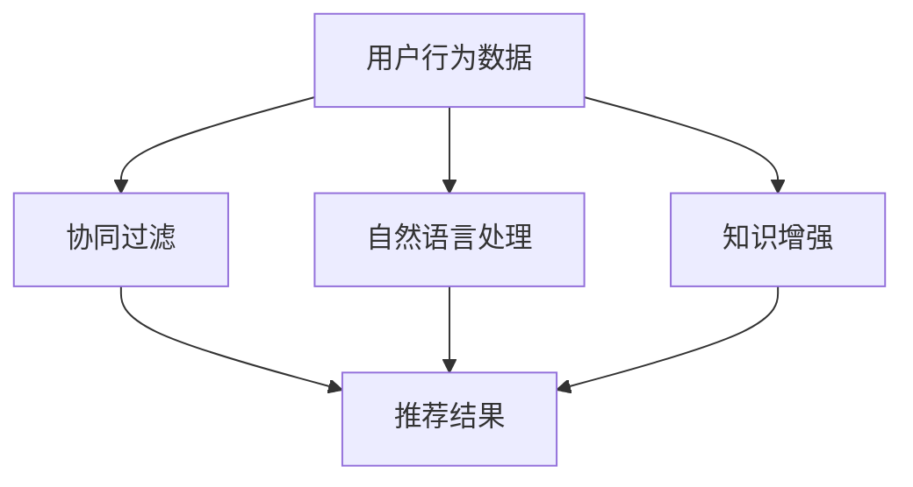

                 

# 大模型在推荐系统中的知识增强应用

> 关键词：大模型, 推荐系统, 知识增强, 协同过滤, 自然语言处理, 数据融合, 召回率, 精准率

## 1. 背景介绍

### 1.1 问题由来

推荐系统是互联网时代不可或缺的关键技术之一，广泛应用于电商、社交、新闻、娱乐等众多领域。通过分析用户的历史行为数据，推荐系统能够预测用户可能感兴趣的新内容，提供个性化的推荐服务。然而，随着用户需求和行为的多样化，推荐系统在数据多样性、稀疏性、动态性等方面面临着巨大的挑战。

在传统推荐系统中，协同过滤(Collaborative Filtering)是最主流的推荐方式，主要依赖用户行为数据的相似性匹配。然而，协同过滤在数据稀疏性问题上表现不佳，难以捕捉用户的多样化需求和隐性兴趣。面对这一挑战，基于大模型的新型推荐系统逐渐引起了学界和产业界的关注。

## 2. 核心概念与联系

### 2.1 核心概念概述

本节将详细介绍推荐系统和大模型在推荐系统中的应用，明确其核心概念和联系。

#### 2.1.1 推荐系统

推荐系统通过分析用户行为数据，预测用户未来可能感兴趣的物品，提供个性化的推荐结果。根据推荐算法的设计思路，推荐系统可以分为基于内容的推荐、协同过滤推荐、混合推荐等多种类型。

#### 2.1.2 大模型

大模型指通过大规模数据预训练得到的深度学习模型，能够学习到通用的知识表示，具备强大的学习能力和泛化能力。常见的大模型包括BERT、GPT、XLNet等。

### 2.2 核心概念原理和架构的 Mermaid 流程图



该流程图展示了推荐系统与大模型的关系：

1. 用户行为数据作为推荐系统的输入，通过协同过滤、自然语言处理、知识增强等多种方式进行处理。
2. 协同过滤主要依赖用户行为数据进行相似性匹配，但在数据稀疏性问题上表现不佳。
3. 自然语言处理能够提取文本数据中的语义信息，为推荐系统提供更为丰富的用户和物品描述。
4. 知识增强利用大模型的预训练能力，将外部知识库、规则库等符号化知识融合到推荐模型中，进一步提升推荐效果。

## 3. 核心算法原理 & 具体操作步骤

### 3.1 算法原理概述

大模型在推荐系统中的应用，本质上是一种知识增强的推荐技术。其核心思想是：将大模型看作一个"知识库"，通过在推荐模型的训练过程中，引入大模型的知识表示，提升推荐模型的泛化能力和鲁棒性。

形式化地，设用户的历史行为数据为 $U=\{(u_i,i_i)\}_{i=1}^N$，其中 $u_i$ 表示用户 $i$ 的兴趣向量，$i_i$ 表示用户 $i$ 感兴趣的物品。推荐系统的目标是找到一个物品 $i_j$，使得用户 $i$ 对其产生足够高的兴趣，即 $u_j \cdot v_i > 0$，其中 $v_i$ 为物品 $j$ 的特征向量。

在大模型的推荐系统中，推荐模型 $M$ 的训练过程可以表示为：

$$
\min_{\theta} \frac{1}{N}\sum_{i=1}^N \ell(M(u_i),i_j)
$$

其中 $\ell$ 为损失函数，如均方误差、交叉熵等。通过在大模型知识的基础上，优化推荐模型的参数 $\theta$，可以获得更好的推荐效果。

### 3.2 算法步骤详解

基于大模型的推荐系统，可以分为以下几个关键步骤：

**Step 1: 数据预处理**

- 收集用户的历史行为数据，如浏览记录、购买记录等，生成用户兴趣向量 $U=\{(u_i,i_i)\}_{i=1}^N$。
- 收集物品的特征数据，如描述、标签、类别等，生成物品特征向量 $I=\{(i_j,v_j)\}_{j=1}^M$。

**Step 2: 知识融合**

- 对用户兴趣向量和物品特征向量进行编码，生成用户向量 $u$ 和物品向量 $v$。
- 使用大模型知识对用户向量 $u$ 进行增强，得到增强后的用户向量 $u'$。
- 对增强后的用户向量 $u'$ 和物品向量 $v$ 进行矩阵乘法，得到用户和物品之间的相似度矩阵 $S$。

**Step 3: 模型训练**

- 定义推荐模型的损失函数 $\ell$，如均方误差、交叉熵等。
- 使用梯度下降等优化算法，最小化推荐模型在用户和物品相似度矩阵 $S$ 上的损失函数 $\ell$。
- 在训练过程中，可以选择冻结部分大模型参数，以避免对大模型权重的不必要更新。

**Step 4: 推荐结果生成**

- 将测试用户 $i$ 的兴趣向量 $u_i$ 与所有物品的特征向量 $v$ 进行矩阵乘法，得到用户对每个物品的兴趣评分 $R$。
- 根据评分 $R$ 选择排名最高的物品作为推荐结果。

**Step 5: 效果评估**

- 在测试集上评估推荐模型的召回率和精准率等指标。
- 根据评估结果调整模型参数和训练策略，进一步提升推荐效果。

### 3.3 算法优缺点

基于大模型的推荐系统具有以下优点：

1. 泛化能力更强。大模型具备强大的知识表示能力，能够捕捉用户和物品之间的复杂关系。
2. 适应性强。大模型可以通过微调等方式，快速适应特定领域的应用需求。
3. 动态性好。大模型可以持续学习新数据，不断提升推荐效果。
4. 效果显著。在学术界和工业界的诸多推荐任务上，基于大模型的推荐系统已经刷新了最先进的性能指标。

同时，该方法也存在一定的局限性：

1. 计算成本高。大模型通常需要较大的算力支持，推荐系统的训练和推理成本较高。
2. 数据需求大。大模型的知识表示需要大量的数据进行预训练和微调，对数据质量和数量的要求较高。
3. 可解释性不足。大模型往往是一个"黑盒"，难以解释其内部工作机制和决策逻辑。
4. 伦理问题突出。大模型可能学习到有害信息，通过推荐系统传递到用户，造成潜在的伦理风险。

尽管存在这些局限性，但就目前而言，基于大模型的推荐系统仍是一种较为前沿和高效的方法，具备广泛的应用前景。

### 3.4 算法应用领域

基于大模型的推荐系统，已经在电商、社交、娱乐等多个领域得到了广泛的应用。例如：

- 电商平台：通过大模型提取商品描述中的语义信息，提升推荐系统的精准度和多样性。
- 社交平台：利用大模型分析用户的社交网络，推荐可能感兴趣的内容，增强用户黏性。
- 视频平台：通过大模型挖掘视频中的关键元素，提升个性化推荐的效果，提升用户体验。
- 新闻推荐：利用大模型进行文本分类和情感分析，推荐用户可能感兴趣的新闻，增强信息获取效率。
- 音乐推荐：利用大模型分析歌词和曲风，推荐用户可能喜欢的音乐，提升音乐播放的个性化和满意度。

## 4. 数学模型和公式 & 详细讲解 & 举例说明

### 4.1 数学模型构建

假设用户兴趣向量 $u_i$ 和物品特征向量 $v_j$ 已编码为高维向量，记 $u \in \mathbb{R}^d, v \in \mathbb{R}^d$。利用大模型知识增强后，用户向量变为 $u' \in \mathbb{R}^d$。

推荐模型的损失函数可以表示为：

$$
\ell(M(u_i),i_j) = \frac{1}{2}(u_i - M(u_i))^2
$$

其中 $M(u_i)$ 为推荐模型的预测结果。

### 4.2 公式推导过程

在推荐模型的训练过程中，目标是最小化损失函数：

$$
\min_{\theta} \frac{1}{N}\sum_{i=1}^N \ell(M(u_i),i_j)
$$

根据损失函数的定义，对 $M(u_i)$ 的导数可以表示为：

$$
\frac{\partial \ell(M(u_i),i_j)}{\partial M(u_i)} = \frac{1}{N}(u_i - M(u_i))
$$

在求解最优模型参数 $\theta$ 时，可以通过反向传播算法，计算梯度并更新模型参数：

$$
\theta \leftarrow \theta - \eta \nabla_{\theta}\mathcal{L}(\theta)
$$

其中 $\eta$ 为学习率，$\nabla_{\theta}\mathcal{L}(\theta)$ 为损失函数对模型参数 $\theta$ 的梯度。

### 4.3 案例分析与讲解

以电商平台为例，利用大模型进行推荐系统的优化。首先，通过大模型对用户浏览的商品描述进行编码，生成用户兴趣向量 $u$。然后，对物品的描述和标签等信息进行编码，生成物品特征向量 $v$。

在推荐模型的训练过程中，利用大模型知识对用户兴趣向量 $u$ 进行增强，得到增强后的用户向量 $u'$。将增强后的用户向量 $u'$ 与物品特征向量 $v$ 进行矩阵乘法，得到用户和物品之间的相似度矩阵 $S$。最终，通过最小化推荐模型的损失函数，生成推荐结果。

## 5. 项目实践：代码实例和详细解释说明

### 5.1 开发环境搭建

在进行大模型推荐系统的开发前，需要准备以下开发环境：

1. 安装Python：Python是推荐系统开发的主要语言，建议安装3.8或以上版本。
2. 安装TensorFlow或PyTorch：TensorFlow和PyTorch是目前最流行的深度学习框架，支持大模型的推荐系统开发。
3. 安装Transformer库：Transformer库提供了预训练语言模型的封装，方便快速开发。
4. 安装scikit-learn：scikit-learn是Python数据处理和机器学习库，用于数据预处理和模型评估。

完成上述环境搭建后，即可在Python环境中进行大模型推荐系统的开发。

### 5.2 源代码详细实现

以下是一个基于大模型的电商推荐系统示例代码，使用TensorFlow进行开发：

```python
import tensorflow as tf
import numpy as np
from transformers import TFAutoModel

# 构建用户和物品的兴趣向量
user_interests = tf.Variable(tf.random.normal([N, d]))
item_features = tf.Variable(tf.random.normal([M, d]))

# 使用大模型对用户兴趣向量进行增强
user_enhanced = tf.Variable(tf.random.normal([N, d]))
item_enhanced = tf.Variable(tf.random.normal([M, d]))
user_enhanced = tf.keras.layers.Dense(d, activation='relu')(user_interests)
item_enhanced = tf.keras.layers.Dense(d, activation='relu')(item_features)

# 定义推荐模型的损失函数
def recommendation_loss(user_enhanced, item_enhanced):
    user_predictions = tf.matmul(user_enhanced, item_enhanced, transpose_b=True)
    loss = tf.reduce_mean(tf.square(user_predictions - tf.reduce_mean(user_predictions, axis=1, keepdims=True)))
    return loss

# 训练推荐模型
optimizer = tf.keras.optimizers.Adam(learning_rate=0.001)
loss = recommendation_loss(user_enhanced, item_enhanced)
grads = tf.gradients(loss, [user_enhanced, item_enhanced])
optimizer.apply_gradients(zip(grads, [user_enhanced, item_enhanced]))

# 生成推荐结果
user_predictions = tf.matmul(user_enhanced, item_enhanced, transpose_b=True)
top_k = 10
recommendations = tf.argsort(user_predictions, axis=1, direction='DESCEND')[:, :top_k]
```

### 5.3 代码解读与分析

让我们详细解读一下代码中的关键部分：

**用户和物品兴趣向量的定义**

- `user_interests` 和 `item_features` 分别表示用户和物品的兴趣向量，初始化为随机矩阵。

**大模型增强**

- `user_enhanced` 和 `item_enhanced` 分别表示经过大模型增强后的用户和物品向量，使用全连接层进行增强，激活函数为ReLU。

**损失函数定义**

- `recommendation_loss` 函数定义了推荐模型的损失函数，计算预测值与真实值的均方误差。

**模型训练**

- `optimizer` 为Adam优化器，用于更新模型参数。
- `loss` 为推荐模型的损失函数。
- `grads` 为损失函数对用户和物品向量的梯度，使用 `tf.gradients` 函数计算。
- `optimizer.apply_gradients` 方法更新模型参数。

**推荐结果生成**

- `user_predictions` 为用户对每个物品的预测评分。
- `top_k` 表示推荐的物品数量。
- `recommendations` 为排名最高的物品，使用 `tf.argsort` 函数进行排序。

## 6. 实际应用场景

### 6.1 电商推荐系统

电商平台的推荐系统是推荐系统应用的典型代表。通过分析用户的历史浏览和购买记录，电商推荐系统可以为用户推荐可能感兴趣的商品，提升用户体验和销售额。

在大模型推荐系统中，可以利用大模型对商品描述进行编码，提取商品的语义信息。同时，对用户的浏览记录和购买记录进行编码，生成用户兴趣向量。通过融合大模型的知识，提升推荐模型的泛化能力和鲁棒性，生成更加精准和多样化的推荐结果。

### 6.2 社交推荐系统

社交平台的推荐系统主要关注用户之间的社交关系和兴趣相似性。通过分析用户的社交网络，社交推荐系统可以推荐可能感兴趣的内容，增强用户黏性。

在大模型推荐系统中，可以利用大模型分析用户的社交网络，提取社交关系中的语义信息。同时，对用户的关注关系和互动数据进行编码，生成用户兴趣向量。通过融合大模型的知识，提升推荐模型的泛化能力和鲁棒性，生成更加精准和多样化的推荐结果。

### 6.3 视频推荐系统

视频平台的推荐系统主要关注用户对视频内容的兴趣。通过分析用户的历史观看记录，视频推荐系统可以推荐可能感兴趣的视频内容，提升用户体验。

在大模型推荐系统中，可以利用大模型分析视频的标题、描述、标签等信息，提取视频的语义信息。同时，对用户的观看记录进行编码，生成用户兴趣向量。通过融合大模型的知识，提升推荐模型的泛化能力和鲁棒性，生成更加精准和多样化的推荐结果。

### 6.4 未来应用展望

随着大模型和推荐系统的不断发展，基于大模型的推荐系统将在更多领域得到应用，为各行各业带来变革性影响。

在智慧城市治理中，推荐系统可以用于智能交通、智慧医疗、环保等领域，提升城市管理的自动化和智能化水平。

在金融领域，推荐系统可以用于风险控制、信用评估、投资理财等环节，提升金融服务的个性化和精准度。

在教育领域，推荐系统可以用于个性化学习、智能辅导、在线课程推荐等，提升教育资源的利用效率和学习效果。

## 7. 工具和资源推荐

### 7.1 学习资源推荐

为了帮助开发者系统掌握大模型推荐系统的方法，这里推荐一些优质的学习资源：

1. 《深度学习与推荐系统》系列博文：由深度学习专家撰写，深入浅出地介绍了深度学习在推荐系统中的应用，涵盖大模型推荐、协同过滤推荐等多种方法。

2. 《推荐系统实战》书籍：介绍推荐系统的理论基础和实际应用，包含大模型推荐、深度学习推荐等多种技术。

3. HuggingFace官方文档：提供预训练语言模型的封装和应用指导，是推荐系统开发的重要参考资料。

4. CLUE开源项目：中文推荐系统的评测基准，包含多类推荐任务和预训练模型的评测结果，助力推荐系统开发。

通过对这些资源的学习实践，相信你一定能够快速掌握大模型推荐系统的精髓，并用于解决实际的推荐问题。

### 7.2 开发工具推荐

高效的开发离不开优秀的工具支持。以下是几款用于大模型推荐系统开发的常用工具：

1. TensorFlow：基于Python的深度学习框架，灵活高效，支持大规模模型训练和推理。

2. PyTorch：基于Python的深度学习框架，支持动态图计算，灵活方便，适合模型迭代开发。

3. Transformers库：HuggingFace开发的预训练语言模型封装库，提供了丰富的预训练模型和微调工具。

4. TensorBoard：TensorFlow配套的可视化工具，实时监测模型训练状态，提供丰富的图表呈现方式。

5. Weights & Biases：模型训练的实验跟踪工具，记录和可视化模型训练过程中的各项指标，方便对比和调优。

合理利用这些工具，可以显著提升大模型推荐系统的开发效率，加快创新迭代的步伐。

### 7.3 相关论文推荐

大模型推荐系统的研究源于学界的持续探索。以下是几篇奠基性的相关论文，推荐阅读：

1. Attention is All You Need：提出了Transformer结构，开启了预训练大模型在推荐系统中的应用。

2. BERT: Pre-training of Deep Bidirectional Transformers for Language Understanding：提出BERT模型，引入自监督学习任务，刷新了推荐系统的效果。

3. Knowledge-aware Recommender Systems via Attention Mechanism：提出使用大模型提取知识库中的信息，增强推荐模型的效果。

4. Neural Collaborative Filtering：提出协同过滤推荐系统，利用用户行为数据进行相似性匹配，为推荐系统提供了重要的思路。

5. Recommendation as Semi-supervised Learning：提出将推荐系统视为半监督学习问题，利用未标注数据提升推荐效果。

这些论文代表了大模型推荐系统的研究进展，通过学习这些前沿成果，可以帮助研究者把握学科发展方向，激发更多的创新灵感。

## 8. 总结：未来发展趋势与挑战

### 8.1 研究成果总结

本文对基于大模型的推荐系统进行了全面系统的介绍。首先阐述了大模型和推荐系统在大模型推荐中的应用，明确了其核心概念和联系。其次，从原理到实践，详细讲解了知识增强推荐系统的数学模型和操作步骤，给出了大模型推荐系统的代码实例。同时，本文还探讨了大模型推荐系统在电商、社交、视频等多个领域的应用前景，展示了其巨大的应用潜力。

### 8.2 未来发展趋势

展望未来，大模型推荐系统将呈现以下几个发展趋势：

1. 模型规模持续增大。随着算力成本的下降和数据规模的扩张，大模型推荐系统的参数量将进一步增大，具备更强大的知识表示能力。

2. 数据融合多样化。除了用户行为数据，未来的大模型推荐系统将更多地融合外部知识库、规则库等符号化知识，提升推荐模型的鲁棒性和泛化性。

3. 动态调整能力增强。未来的大模型推荐系统将能够实时调整模型参数，适应数据分布的变化，提升推荐系统的动态性和即时性。

4. 可解释性增强。未来的大模型推荐系统将更加注重算法的可解释性，通过解释推荐模型的决策逻辑，增强用户信任。

5. 跨领域应用拓展。未来的大模型推荐系统将拓展到更多领域，如金融、医疗、教育等，提升这些领域的信息推荐效果。

### 8.3 面临的挑战

尽管大模型推荐系统具备诸多优势，但在迈向更加智能化、普适化应用的过程中，仍面临诸多挑战：

1. 数据隐私问题。大模型推荐系统需要大量用户行为数据，如何保护用户隐私，避免数据滥用，仍是一大挑战。

2. 计算资源瓶颈。大模型推荐系统需要较大的算力支持，如何提高计算效率，降低资源成本，仍需要更多探索。

3. 算法鲁棒性不足。大模型推荐系统在对抗攻击、异常数据等方面表现较弱，如何增强算法的鲁棒性，仍需进一步研究。

4. 系统可解释性不足。大模型推荐系统往往是一个"黑盒"，难以解释其内部工作机制和决策逻辑，如何提升系统的可解释性，增强用户信任，仍需更多探索。

### 8.4 研究展望

面对大模型推荐系统所面临的挑战，未来的研究需要在以下几个方面寻求新的突破：

1. 探索基于小样本学习和无监督学习的推荐算法。摆脱对大规模标注数据的依赖，利用小样本学习、无监督学习等方法，最大化数据利用率。

2. 研究高效低秩适应的推荐算法。开发更加高效低秩适应的推荐方法，提升推荐系统的计算效率和存储效率。

3. 引入更多先验知识。将符号化的先验知识，如知识图谱、逻辑规则等，与神经网络模型进行巧妙融合，增强推荐模型的知识表示能力。

4. 引入因果推断和对抗学习。通过引入因果推断和对抗学习，增强推荐模型对复杂关系的学习能力和鲁棒性。

5. 引入游戏理论模型。利用游戏理论模型刻画人机交互过程，探索推荐系统的最优策略和稳定机制。

这些研究方向的探索，必将引领大模型推荐系统走向更高的台阶，为构建安全、可靠、可解释、可控的智能系统铺平道路。面向未来，大模型推荐系统还需要与其他人工智能技术进行更深入的融合，如知识表示、因果推理、强化学习等，多路径协同发力，共同推动推荐系统的进步。

## 9. 附录：常见问题与解答

**Q1: 大模型推荐系统是否适用于所有推荐任务？**

A: 大模型推荐系统在大多数推荐任务上都能取得不错的效果，特别是对于数据量较小的任务。但对于一些特定领域的任务，如医学、法律等，仅依赖通用语料预训练的模型可能难以很好地适应。此时需要在特定领域语料上进一步预训练，再进行微调，才能获得理想效果。

**Q2: 如何选择合适的学习率？**

A: 大模型推荐系统的学习率一般要比预训练时小1-2个数量级，如果使用过大的学习率，容易破坏预训练权重，导致过拟合。一般建议从1e-5开始调参，逐步减小学习率，直至收敛。也可以使用warmup策略，在开始阶段使用较小的学习率，再逐渐过渡到预设值。

**Q3: 大模型推荐系统如何缓解过拟合问题？**

A: 过拟合是推荐系统面临的主要挑战，尤其是在数据稀疏性问题上。常见的缓解策略包括：

1. 数据增强：通过回译、近义替换等方式扩充训练集
2. 正则化：使用L2正则、Dropout、Early Stopping等避免过拟合
3. 对抗训练：引入对抗样本，提高模型鲁棒性
4. 参数高效微调：只调整少量参数(如Adapter、Prefix等)，减小过拟合风险
5. 多模型集成：训练多个推荐模型，取平均输出，抑制过拟合

这些策略往往需要根据具体任务和数据特点进行灵活组合。只有在数据、模型、训练、推理等各环节进行全面优化，才能最大限度地发挥大模型推荐系统的威力。

**Q4: 大模型推荐系统在落地部署时需要注意哪些问题？**

A: 将大模型推荐系统转化为实际应用，还需要考虑以下因素：

1. 模型裁剪：去除不必要的层和参数，减小模型尺寸，加快推理速度
2. 量化加速：将浮点模型转为定点模型，压缩存储空间，提高计算效率
3. 服务化封装：将模型封装为标准化服务接口，便于集成调用
4. 弹性伸缩：根据请求流量动态调整资源配置，平衡服务质量和成本
5. 监控告警：实时采集系统指标，设置异常告警阈值，确保服务稳定性
6. 安全防护：采用访问鉴权、数据脱敏等措施，保障数据和模型安全

大模型推荐系统为推荐系统带来了新的突破，但如何将强大的性能转化为稳定、高效、安全的业务价值，还需要工程实践的不断打磨。唯有从数据、算法、工程、业务等多个维度协同发力，才能真正实现大模型推荐系统的规模化落地。总之，推荐需要开发者根据具体任务，不断迭代和优化模型、数据和算法，方能得到理想的效果。

---

作者：禅与计算机程序设计艺术 / Zen and the Art of Computer Programming

