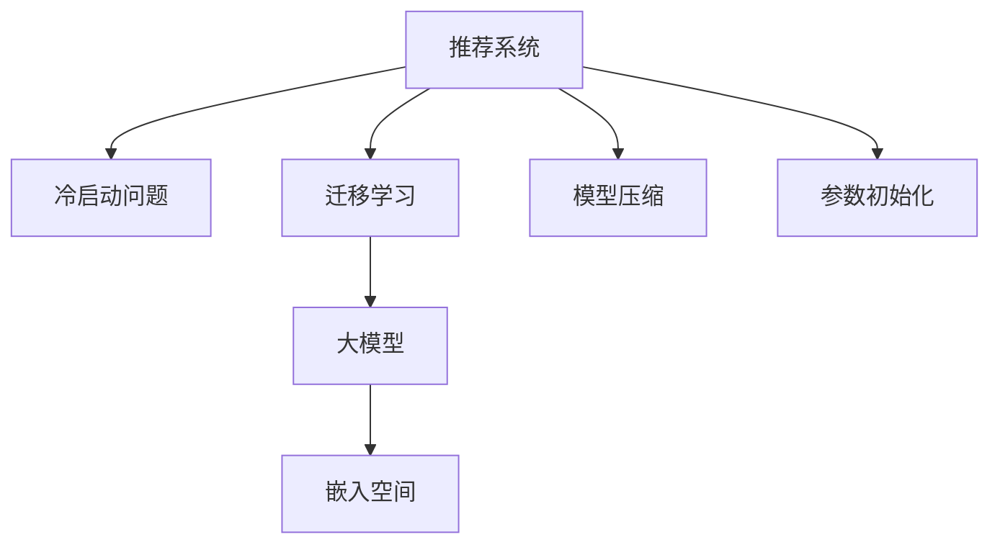

                 

# 大模型在推荐系统冷启动迁移学习中的应用

> 关键词：推荐系统, 冷启动问题, 迁移学习, 大模型, 嵌入式系统, 个性化推荐, 模型压缩, 参数初始化

## 1. 背景介绍

### 1.1 问题由来
随着互联网的迅速发展，推荐系统已经成为了各大电商和社交平台不可或缺的一部分。它能够根据用户的历史行为数据，为用户推荐个性化的商品或内容，极大提升了用户体验和平台转化率。然而，推荐系统通常依赖于用户的行为数据进行训练，导致新用户的推荐效果不佳。这正是推荐系统中的“冷启动问题”：如何为用户推荐他们未曾浏览过的商品或内容？

### 1.2 问题核心关键点
解决冷启动问题通常需要大量的用户数据，但在新用户刚刚注册时，往往难以获取到足够的信息。此时，推荐系统需要寻找新的方法，利用用户的部分信息或先验知识，快速进行推荐。迁移学习和大模型成为了解决冷启动问题的有效手段。

迁移学习是指将在一个任务上学习到的知识，迁移到另一个相关任务中。对于推荐系统，我们可以通过迁移学习将用户的部分信息嵌入到嵌入空间中，从而进行个性化推荐。大模型作为预训练语言模型，通常具有强大的语义表示能力，能够捕捉复杂的语言模式。因此，在大模型的基础上进行迁移学习，可以提升推荐系统的性能和效率。

## 2. 核心概念与联系

### 2.1 核心概念概述

为更好地理解迁移学习在大模型推荐系统中的应用，本节将介绍几个密切相关的核心概念：

- **推荐系统(Recommender System)**：根据用户的历史行为数据，为用户推荐个性化的商品或内容。常见的推荐算法包括协同过滤、基于内容的推荐、深度学习等。

- **冷启动问题(Cold Start Problem)**：新用户在刚刚注册时，通常没有足够的历史行为数据，无法进行有效的推荐。

- **迁移学习(Transfer Learning)**：将一个任务上学习到的知识，迁移到另一个相关任务中。

- **大模型(Large Model)**：以自回归(如GPT)或自编码(如BERT)模型为代表的大规模预训练语言模型。通过在大规模无标签文本语料上进行预训练，学习通用的语言表示，具备强大的语言理解和生成能力。

- **嵌入空间(Embedding Space)**：将用户特征和商品特征映射到高维向量空间中，通过向量之间的相似度计算，进行推荐。

- **模型压缩(Model Compression)**：减少模型的参数量，降低计算复杂度和存储空间，提高推荐系统的运行效率。

- **参数初始化(Parameter Initialization)**：在模型训练之前，通过预训练或嵌入方式，对模型参数进行合理初始化。

这些核心概念之间的逻辑关系可以通过以下Mermaid流程图来展示：



这个流程图展示了大模型推荐系统的核心概念及其之间的关系：

1. 推荐系统通过迁移学习利用用户的部分信息进行推荐。
2. 迁移学习在大模型的基础上，将用户信息嵌入到高维向量空间中。
3. 嵌入空间通过向量之间的相似度计算，进行推荐。
4. 模型压缩减少模型的参数量，提高推荐系统的效率。
5. 参数初始化对模型进行合理初始化，加快模型收敛。

这些概念共同构成了大模型推荐系统的学习和应用框架，使其能够更好地应对冷启动问题，并提升推荐系统的性能。

## 3. 核心算法原理 & 具体操作步骤

### 3.1 算法原理概述

大模型在推荐系统中的应用，本质上是一个迁移学习过程。其核心思想是：利用大模型的预训练能力，将用户的部分信息嵌入到高维向量空间中，并在推荐任务上使用迁移后的模型进行推荐。

形式化地，假设大模型为 $M_{\theta}$，其中 $\theta$ 为预训练得到的模型参数。设用户 $u$ 的特征向量为 $x_u \in \mathbb{R}^d$，商品 $i$ 的特征向量为 $x_i \in \mathbb{R}^d$，推荐任务 $T$ 的输出为目标 $y$。则推荐系统的损失函数 $\mathcal{L}$ 可以表示为：

$$
\mathcal{L} = \frac{1}{N}\sum_{i=1}^N \mathbb{1}(y_i \neq \hat{y}_i) + \mathbb{E}_{x \sim P_u}[\mathbb{1}(y_u \neq \hat{y}_u)]
$$

其中 $\mathbb{1}$ 表示指示函数，$\hat{y}_i = M_{\theta}(x_i)$ 表示模型对商品 $i$ 的预测，$\hat{y}_u = M_{\theta}(x_u)$ 表示模型对用户 $u$ 的预测，$P_u$ 表示用户 $u$ 的特征分布。

优化目标是找到最优的模型参数 $\theta$，使得推荐系统的损失最小化。即：

$$
\theta^* = \mathop{\arg\min}_{\theta} \mathcal{L}(M_{\theta},\{x_i,y_i\})
$$

在实际应用中，通常采用随机梯度下降(SGD)等优化算法，对模型进行迭代更新。

### 3.2 算法步骤详解

基于大模型的推荐系统，一般包括以下几个关键步骤：

**Step 1: 准备预训练模型和数据集**
- 选择合适的预训练语言模型 $M_{\theta}$ 作为初始化参数，如 BERT、GPT 等。
- 准备推荐任务 $T$ 的标注数据集 $D=\{(x_i,y_i)\}_{i=1}^N$，划分为训练集、验证集和测试集。一般要求标注数据与预训练数据的分布不要差异过大。

**Step 2: 用户嵌入和商品嵌入**
- 使用大模型 $M_{\theta}$ 对用户特征 $x_u$ 和商品特征 $x_i$ 进行嵌入，得到用户向量 $u \in \mathbb{R}^d$ 和商品向量 $i \in \mathbb{R}^d$。
- 将用户向量和商品向量分别输入嵌入层，计算向量之间的相似度 $sim(u,i)$，作为推荐相似度。

**Step 3: 设置迁移学习超参数**
- 选择合适的优化算法及其参数，如 AdamW、SGD 等，设置学习率、批大小、迭代轮数等。
- 设置正则化技术及强度，包括权重衰减、Dropout、Early Stopping等。

**Step 4: 执行梯度训练**
- 将训练集数据分批次输入模型，前向传播计算损失函数。
- 反向传播计算参数梯度，根据设定的优化算法和学习率更新模型参数。
- 周期性在验证集上评估模型性能，根据性能指标决定是否触发 Early Stopping。
- 重复上述步骤直到满足预设的迭代轮数或 Early Stopping 条件。

**Step 5: 测试和部署**
- 在测试集上评估推荐系统的性能，对比未微调前后的效果。
- 使用微调后的模型对新用户进行推荐，集成到实际的应用系统中。
- 持续收集新的用户行为数据，定期重新微调模型，以适应数据分布的变化。

以上是基于大模型的推荐系统的微调流程。在实际应用中，还需要针对具体任务的特点，对微调过程的各个环节进行优化设计，如改进推荐目标函数，引入更多的正则化技术，搜索最优的超参数组合等，以进一步提升模型性能。

### 3.3 算法优缺点

基于大模型的推荐系统，具有以下优点：
1. 参数初始化好：通过预训练得到的参数，可以显著提高模型收敛速度和精度。
2. 学习能力强大：大模型能够利用先验知识，快速适应新任务，提升推荐效果。
3. 迁移能力强：大模型通常具备良好的迁移能力，可以在不同任务间进行知识迁移。
4. 可扩展性好：大模型通过微调可以适应多种推荐场景，灵活性较高。

同时，该方法也存在一定的局限性：
1. 数据依赖高：大模型的迁移学习需要高质量的标注数据，数据获取成本较高。
2. 参数量大：大模型通常具有亿级别的参数量，计算和存储成本较高。
3. 泛化能力弱：大模型可能受到预训练数据分布的影响，泛化能力较弱。
4. 模型复杂度高：大模型的结构复杂，推理速度较慢，影响系统响应速度。

尽管存在这些局限性，但就目前而言，基于大模型的推荐系统仍然是大规模推荐引擎的重要范式。未来相关研究的重点在于如何进一步降低数据依赖，提高模型的迁移能力和泛化能力，同时兼顾模型复杂度和推理效率。

### 3.4 算法应用领域

基于大模型的迁移学习，在推荐系统领域已经得到了广泛的应用，覆盖了推荐商品、内容、广告等多个场景。例如：

- 电商推荐系统：通过大模型学习用户和商品的语义表示，推荐用户可能感兴趣的商品。
- 视频推荐系统：利用大模型对用户观看行为进行建模，推荐用户可能喜欢的视频。
- 广告推荐系统：根据用户的搜索记录和点击行为，通过大模型预测用户的广告偏好。

除了上述这些经典应用外，大模型迁移学习还被创新性地应用到更多场景中，如音乐推荐、新闻推荐、社交推荐等，为推荐系统带来了全新的突破。随着大模型和迁移学习方法的不断进步，相信推荐系统技术将更加智能，能够为用户提供更加个性化、精准的推荐服务。

## 4. 数学模型和公式 & 详细讲解 & 举例说明

### 4.1 数学模型构建

本节将使用数学语言对基于大模型的推荐系统进行更加严格的刻画。

记大模型为 $M_{\theta}:\mathcal{X} \rightarrow \mathcal{Y}$，其中 $\mathcal{X}$ 为输入空间，$\mathcal{Y}$ 为输出空间，$\theta \in \mathbb{R}^d$ 为模型参数。设推荐任务 $T$ 的训练集为 $D=\{(x_i,y_i)\}_{i=1}^N, x_i \in \mathcal{X}, y_i \in \mathcal{Y}$。

定义模型 $M_{\theta}$ 在用户特征 $x_u$ 和商品特征 $x_i$ 上的输出为目标 $y$，即 $y = M_{\theta}(x_i)$，则推荐系统的损失函数 $\mathcal{L}$ 可以表示为：

$$
\mathcal{L} = \frac{1}{N}\sum_{i=1}^N \mathbb{1}(y_i \neq \hat{y}_i) + \mathbb{E}_{x \sim P_u}[\mathbb{1}(y_u \neq \hat{y}_u)]
$$

其中 $\mathbb{1}$ 表示指示函数，$\hat{y}_i = M_{\theta}(x_i)$ 表示模型对商品 $i$ 的预测，$\hat{y}_u = M_{\theta}(x_u)$ 表示模型对用户 $u$ 的预测，$P_u$ 表示用户 $u$ 的特征分布。

### 4.2 公式推导过程

以下我们以电商推荐系统为例，推导大模型的推荐公式及其梯度的计算公式。

假设模型 $M_{\theta}$ 在用户特征 $x_u$ 和商品特征 $x_i$ 上的输出为 $\hat{y} = M_{\theta}(x_i)$。真实标签 $y \in \{0,1\}$，表示用户是否购买了该商品。则推荐系统的交叉熵损失函数定义为：

$$
\ell(M_{\theta}(x),y) = -[y\log \hat{y} + (1-y)\log (1-\hat{y})]
$$

将其代入损失函数公式，得：

$$
\mathcal{L} = -\frac{1}{N}\sum_{i=1}^N [y_i\log \hat{y}_i+(1-y_i)\log(1-\hat{y}_i)] + \mathbb{E}_{x \sim P_u}[\mathbb{1}(y_u \neq \hat{y}_u)]
$$

根据链式法则，损失函数对参数 $\theta_k$ 的梯度为：

$$
\frac{\partial \mathcal{L}}{\partial \theta_k} = -\frac{1}{N}\sum_{i=1}^N (\frac{y_i}{\hat{y}_i}-\frac{1-y_i}{1-\hat{y}_i}) \frac{\partial M_{\theta}(x_i)}{\partial \theta_k} + \frac{\partial \mathbb{E}_{x \sim P_u}[\mathbb{1}(y_u \neq \hat{y}_u)]}{\partial \theta_k}
$$

其中 $\frac{\partial M_{\theta}(x_i)}{\partial \theta_k}$ 可进一步递归展开，利用自动微分技术完成计算。

在得到损失函数的梯度后，即可带入参数更新公式，完成模型的迭代优化。重复上述过程直至收敛，最终得到适应推荐任务的最优模型参数 $\theta^*$。

## 5. 项目实践：代码实例和详细解释说明

### 5.1 开发环境搭建

在进行推荐系统微调实践前，我们需要准备好开发环境。以下是使用Python进行PyTorch开发的环境配置流程：

1. 安装Anaconda：从官网下载并安装Anaconda，用于创建独立的Python环境。

2. 创建并激活虚拟环境：
```bash
conda create -n pytorch-env python=3.8 
conda activate pytorch-env
```

3. 安装PyTorch：根据CUDA版本，从官网获取对应的安装命令。例如：
```bash
conda install pytorch torchvision torchaudio cudatoolkit=11.1 -c pytorch -c conda-forge
```

4. 安装Transformers库：
```bash
pip install transformers
```

5. 安装各类工具包：
```bash
pip install numpy pandas scikit-learn matplotlib tqdm jupyter notebook ipython
```

完成上述步骤后，即可在`pytorch-env`环境中开始推荐系统微调实践。

### 5.2 源代码详细实现

下面我们以电商推荐系统为例，给出使用Transformers库对BERT模型进行微调的PyTorch代码实现。

首先，定义推荐系统任务的数据处理函数：

```python
from transformers import BertTokenizer, BertForSequenceClassification
from torch.utils.data import Dataset
import torch

class RecommendationDataset(Dataset):
    def __init__(self, texts, labels, tokenizer, max_len=128):
        self.texts = texts
        self.labels = labels
        self.tokenizer = tokenizer
        self.max_len = max_len
        
    def __len__(self):
        return len(self.texts)
    
    def __getitem__(self, item):
        text = self.texts[item]
        label = self.labels[item]
        
        encoding = self.tokenizer(text, return_tensors='pt', max_length=self.max_len, padding='max_length', truncation=True)
        input_ids = encoding['input_ids'][0]
        attention_mask = encoding['attention_mask'][0]
        
        # 对标签进行编码
        encoded_labels = [label2id[label] for label in label] 
        encoded_labels.extend([label2id['none']] * (self.max_len - len(encoded_labels)))
        labels = torch.tensor(encoded_labels, dtype=torch.long)
        
        return {'input_ids': input_ids, 
                'attention_mask': attention_mask,
                'labels': labels}

# 标签与id的映射
label2id = {'buy': 0, 'not_buy': 1, 'none': 2}
id2label = {v: k for k, v in label2id.items()}

# 创建dataset
tokenizer = BertTokenizer.from_pretrained('bert-base-cased')

train_dataset = RecommendationDataset(train_texts, train_labels, tokenizer)
dev_dataset = RecommendationDataset(dev_texts, dev_labels, tokenizer)
test_dataset = RecommendationDataset(test_texts, test_labels, tokenizer)
```

然后，定义模型和优化器：

```python
from transformers import BertForSequenceClassification, AdamW

model = BertForSequenceClassification.from_pretrained('bert-base-cased', num_labels=len(label2id))

optimizer = AdamW(model.parameters(), lr=2e-5)
```

接着，定义训练和评估函数：

```python
from torch.utils.data import DataLoader
from tqdm import tqdm
from sklearn.metrics import accuracy_score

device = torch.device('cuda') if torch.cuda.is_available() else torch.device('cpu')
model.to(device)

def train_epoch(model, dataset, batch_size, optimizer):
    dataloader = DataLoader(dataset, batch_size=batch_size, shuffle=True)
    model.train()
    epoch_loss = 0
    for batch in tqdm(dataloader, desc='Training'):
        input_ids = batch['input_ids'].to(device)
        attention_mask = batch['attention_mask'].to(device)
        labels = batch['labels'].to(device)
        model.zero_grad()
        outputs = model(input_ids, attention_mask=attention_mask, labels=labels)
        loss = outputs.loss
        epoch_loss += loss.item()
        loss.backward()
        optimizer.step()
    return epoch_loss / len(dataloader)

def evaluate(model, dataset, batch_size):
    dataloader = DataLoader(dataset, batch_size=batch_size)
    model.eval()
    preds, labels = [], []
    with torch.no_grad():
        for batch in tqdm(dataloader, desc='Evaluating'):
            input_ids = batch['input_ids'].to(device)
            attention_mask = batch['attention_mask'].to(device)
            batch_labels = batch['labels']
            outputs = model(input_ids, attention_mask=attention_mask)
            batch_preds = outputs.logits.argmax(dim=2).to('cpu').tolist()
            batch_labels = batch_labels.to('cpu').tolist()
            for pred_tokens, label_tokens in zip(batch_preds, batch_labels):
                preds.append(pred_tokens[:len(label_tokens)])
                labels.append(label_tokens)
                
    print(f'Accuracy: {accuracy_score(labels, preds):.3f}')
```

最后，启动训练流程并在测试集上评估：

```python
epochs = 5
batch_size = 16

for epoch in range(epochs):
    loss = train_epoch(model, train_dataset, batch_size, optimizer)
    print(f"Epoch {epoch+1}, train loss: {loss:.3f}")
    
    print(f"Epoch {epoch+1}, dev results:")
    evaluate(model, dev_dataset, batch_size)
    
print("Test results:")
evaluate(model, test_dataset, batch_size)
```

以上就是使用PyTorch对BERT进行电商推荐系统微调的完整代码实现。可以看到，得益于Transformers库的强大封装，我们可以用相对简洁的代码完成BERT模型的加载和微调。

### 5.3 代码解读与分析

让我们再详细解读一下关键代码的实现细节：

**RecommendationDataset类**：
- `__init__`方法：初始化文本、标签、分词器等关键组件。
- `__len__`方法：返回数据集的样本数量。
- `__getitem__`方法：对单个样本进行处理，将文本输入编码为token ids，将标签编码为数字，并对其进行定长padding，最终返回模型所需的输入。

**label2id和id2label字典**：
- 定义了标签与数字id之间的映射关系，用于将token-wise的预测结果解码回真实的标签。

**训练和评估函数**：
- 使用PyTorch的DataLoader对数据集进行批次化加载，供模型训练和推理使用。
- 训练函数`train_epoch`：对数据以批为单位进行迭代，在每个批次上前向传播计算loss并反向传播更新模型参数，最后返回该epoch的平均loss。
- 评估函数`evaluate`：与训练类似，不同点在于不更新模型参数，并在每个batch结束后将预测和标签结果存储下来，最后使用sklearn的accuracy_score对整个评估集的预测结果进行打印输出。

**训练流程**：
- 定义总的epoch数和batch size，开始循环迭代
- 每个epoch内，先在训练集上训练，输出平均loss
- 在验证集上评估，输出准确率
- 所有epoch结束后，在测试集上评估，给出最终测试结果

可以看到，PyTorch配合Transformers库使得BERT微调的代码实现变得简洁高效。开发者可以将更多精力放在数据处理、模型改进等高层逻辑上，而不必过多关注底层的实现细节。

当然，工业级的系统实现还需考虑更多因素，如模型的保存和部署、超参数的自动搜索、更灵活的任务适配层等。但核心的微调范式基本与此类似。

## 6. 实际应用场景
### 6.1 智能客服系统

基于大模型迁移学习的推荐技术，可以广泛应用于智能客服系统的构建。传统客服往往需要配备大量人力，高峰期响应缓慢，且一致性和专业性难以保证。而使用迁移学习的推荐模型，可以7x24小时不间断服务，快速响应客户咨询，用自然流畅的语言解答各类常见问题。

在技术实现上，可以收集企业内部的历史客服对话记录，将问题和最佳答复构建成监督数据，在此基础上对预训练推荐模型进行迁移学习。迁移学习后的推荐模型能够自动理解用户意图，匹配最合适的答案模板进行回复。对于客户提出的新问题，还可以接入检索系统实时搜索相关内容，动态组织生成回答。如此构建的智能客服系统，能大幅提升客户咨询体验和问题解决效率。

### 6.2 金融舆情监测

金融机构需要实时监测市场舆论动向，以便及时应对负面信息传播，规避金融风险。传统的人工监测方式成本高、效率低，难以应对网络时代海量信息爆发的挑战。基于大模型迁移学习的文本分类和情感分析技术，为金融舆情监测提供了新的解决方案。

具体而言，可以收集金融领域相关的新闻、报道、评论等文本数据，并对其进行主题标注和情感标注。在此基础上对预训练语言模型进行迁移学习，使其能够自动判断文本属于何种主题，情感倾向是正面、中性还是负面。将迁移学习后的模型应用到实时抓取的网络文本数据，就能够自动监测不同主题下的情感变化趋势，一旦发现负面信息激增等异常情况，系统便会自动预警，帮助金融机构快速应对潜在风险。

### 6.3 个性化推荐系统

当前的推荐系统往往只依赖用户的历史行为数据进行训练，无法深入理解用户的真实兴趣偏好。基于大模型迁移学习技术，个性化推荐系统可以更好地挖掘用户行为背后的语义信息，从而提供更精准、多样的推荐内容。

在实践中，可以收集用户浏览、点击、评论、分享等行为数据，提取和用户交互的物品标题、描述、标签等文本内容。将文本内容作为模型输入，用户的后续行为（如是否点击、购买等）作为监督信号，在此基础上迁移学习预训练语言模型。迁移学习后的模型能够从文本内容中准确把握用户的兴趣点。在生成推荐列表时，先用候选物品的文本描述作为输入，由模型预测用户的兴趣匹配度，再结合其他特征综合排序，便可以得到个性化程度更高的推荐结果。

### 6.4 未来应用展望

随着大模型和迁移学习方法的不断发展，基于大模型的推荐系统将展现出更大的应用潜力。

在智慧医疗领域，基于迁移学习的推荐模型可以辅助医生诊疗，根据患者的病历和症状，推荐合适的检查、治疗方案。通过持续学习和知识融合，推荐模型能够逐步积累医学知识，辅助医生进行复杂病例的诊断。

在智能教育领域，推荐模型可以根据学生的学习行为和成绩，推荐个性化的学习内容。通过自然语言理解和语义分析，推荐模型能够更好地理解学生的学习需求，提供更符合其学习水平的推荐内容。

在智慧城市治理中，推荐模型可以应用于城市事件监测、舆情分析、应急指挥等环节，提高城市管理的自动化和智能化水平，构建更安全、高效的未来城市。

此外，在企业生产、社会治理、文娱传媒等众多领域，基于大模型的迁移学习推荐系统也将不断涌现，为各行各业带来新的应用场景，提升社会治理效率和服务质量。

## 7. 工具和资源推荐
### 7.1 学习资源推荐

为了帮助开发者系统掌握大模型迁移学习推荐系统的理论基础和实践技巧，这里推荐一些优质的学习资源：

1. 《深度学习理论与实践》系列博文：由深度学习专家撰写，深入浅出地介绍了深度学习的基本原理和经典模型，是入门深度学习的绝佳资料。

2. CS246A《深度学习专项》课程：斯坦福大学开设的深度学习专项课程，包括课堂视频和配套作业，系统讲解深度学习理论和实践。

3. 《推荐系统实战》书籍：介绍推荐系统的原理和算法，包括协同过滤、内容推荐、深度学习等，提供丰富的代码实例。

4. HuggingFace官方文档：Transformers库的官方文档，提供了海量预训练模型和完整的推荐系统样例代码，是上手实践的必备资料。

5. TensorFlow官方文档：TensorFlow的官方文档，提供了深度学习框架的全面指南和丰富的应用案例，适合初学者和进阶开发者。

通过对这些资源的学习实践，相信你一定能够快速掌握大模型迁移学习推荐系统的精髓，并用于解决实际的推荐问题。
###  7.2 开发工具推荐

高效的开发离不开优秀的工具支持。以下是几款用于大模型迁移学习推荐系统开发的常用工具：

1. PyTorch：基于Python的开源深度学习框架，灵活动态的计算图，适合快速迭代研究。大部分预训练语言模型都有PyTorch版本的实现。

2. TensorFlow：由Google主导开发的开源深度学习框架，生产部署方便，适合大规模工程应用。同样有丰富的预训练语言模型资源。

3. Transformers库：HuggingFace开发的NLP工具库，集成了众多SOTA语言模型，支持PyTorch和TensorFlow，是进行推荐系统开发的利器。

4. Weights & Biases：模型训练的实验跟踪工具，可以记录和可视化模型训练过程中的各项指标，方便对比和调优。与主流深度学习框架无缝集成。

5. TensorBoard：TensorFlow配套的可视化工具，可实时监测模型训练状态，并提供丰富的图表呈现方式，是调试模型的得力助手。

6. Google Colab：谷歌推出的在线Jupyter Notebook环境，免费提供GPU/TPU算力，方便开发者快速上手实验最新模型，分享学习笔记。

合理利用这些工具，可以显著提升大模型迁移学习推荐系统的开发效率，加快创新迭代的步伐。

### 7.3 相关论文推荐

大模型和迁移学习的发展源于学界的持续研究。以下是几篇奠基性的相关论文，推荐阅读：

1. Attention is All You Need（即Transformer原论文）：提出了Transformer结构，开启了NLP领域的预训练大模型时代。

2. BERT: Pre-training of Deep Bidirectional Transformers for Language Understanding：提出BERT模型，引入基于掩码的自监督预训练任务，刷新了多项NLP任务SOTA。

3. Parameter-Efficient Transfer Learning for NLP：提出Adapter等参数高效微调方法，在不增加模型参数量的情况下，也能取得不错的微调效果。

4. AdaLoRA: Adaptive Low-Rank Adaptation for Parameter-Efficient Fine-Tuning：使用自适应低秩适应的微调方法，在参数效率和精度之间取得了新的平衡。

这些论文代表了大模型迁移学习推荐系统的发展脉络。通过学习这些前沿成果，可以帮助研究者把握学科前进方向，激发更多的创新灵感。

## 8. 总结：未来发展趋势与挑战

### 8.1 总结

本文对基于大模型的推荐系统迁移学习进行了全面系统的介绍。首先阐述了推荐系统的冷启动问题，明确了迁移学习在大模型推荐系统中的应用价值。其次，从原理到实践，详细讲解了大模型的迁移学习推荐系统。再次，给出了推荐系统微调的完整代码实例，演示了其实现流程。最后，探讨了推荐系统的实际应用场景，展望了未来的发展趋势。

通过本文的系统梳理，可以看到，基于大模型的推荐系统迁移学习在大规模推荐引擎中具有显著优势，能够快速适应新任务，提升推荐系统的性能。未来，随着预训练语言模型和迁移学习方法的不断演进，推荐系统将更加智能化，能够为用户提供更加个性化、精准的推荐服务。

### 8.2 未来发展趋势

展望未来，大模型迁移学习推荐系统将呈现以下几个发展趋势：

1. 模型规模持续增大。随着算力成本的下降和数据规模的扩张，预训练语言模型的参数量还将持续增长。超大批次的训练和推理也可能遇到显存不足的问题。如何优化模型的计算图，提高模型的推理速度，是一个重要的研究方向。

2. 迁移能力提升。通过改进迁移学习算法，提高模型在不同任务间的迁移能力，使得迁移学习后的模型能够更好地适应新任务。

3. 数据依赖降低。探索更加高效的数据生成和数据增强技术，使得推荐系统能够在数据量较小的情况下，获得更好的推荐效果。

4. 模型压缩和量化。随着模型参数量的增大，推理速度和内存占用也随之增加。如何通过模型压缩和量化技术，减小模型尺寸，提高推荐系统的效率，是一个重要的研究方向。

5. 多模态推荐。目前的推荐系统大多只关注文本数据，未来将拓展到图像、音频、视频等多模态数据的推荐，实现更全面的用户体验。

6. 用户隐私保护。在推荐系统中，如何保护用户的隐私和数据安全，是一个重要的研究方向。未来的推荐系统需要考虑隐私保护，并探索更加公平、透明的推荐机制。

以上趋势凸显了大模型迁移学习推荐系统的广阔前景。这些方向的探索发展，必将进一步提升推荐系统的性能和用户体验，为推荐系统的产业化进程注入新的动力。

### 8.3 面临的挑战

尽管大模型迁移学习推荐系统已经取得了瞩目成就，但在迈向更加智能化、普适化应用的过程中，它仍面临着诸多挑战：

1. 数据依赖高。推荐系统需要大量的标注数据进行训练，数据获取成本较高。如何通过更加高效的数据生成和数据增强技术，降低数据依赖，是一个重要的研究方向。

2. 模型复杂度高。大模型通常具有亿级别的参数量，推理速度较慢，影响系统响应速度。如何通过模型压缩和量化技术，减小模型尺寸，提高推荐系统的效率，是一个重要的研究方向。

3. 泛化能力弱。大模型可能受到预训练数据分布的影响，泛化能力较弱。如何提高模型在不同任务间的迁移能力，使得迁移学习后的模型能够更好地适应新任务，是一个重要的研究方向。

4. 用户隐私保护。在推荐系统中，如何保护用户的隐私和数据安全，是一个重要的研究方向。未来的推荐系统需要考虑隐私保护，并探索更加公平、透明的推荐机制。

5. 算法鲁棒性不足。推荐系统面对域外数据时，泛化性能往往大打折扣。对于测试样本的微小扰动，推荐模型的预测也容易发生波动。如何提高推荐系统的鲁棒性，避免灾难性遗忘，还需要更多理论和实践的积累。

6. 推荐系统公平性。如何提高推荐系统的公平性，避免对特定群体的偏见，是一个重要的研究方向。未来的推荐系统需要考虑公平性，并探索更加公平、透明的推荐机制。

正视推荐系统面临的这些挑战，积极应对并寻求突破，将是大模型迁移学习推荐系统走向成熟的必由之路。相信随着学界和产业界的共同努力，这些挑战终将一一被克服，大模型迁移学习推荐系统必将在构建人机协同的智能时代中扮演越来越重要的角色。

### 8.4 研究展望

面对大模型迁移学习推荐系统所面临的种种挑战，未来的研究需要在以下几个方面寻求新的突破：

1. 探索无监督和半监督推荐方法。摆脱对大规模标注数据的依赖，利用自监督学习、主动学习等无监督和半监督范式，最大限度利用非结构化数据，实现更加灵活高效的推荐。

2. 研究参数高效和计算高效的推荐范式。开发更加参数高效的推荐方法，在固定大部分预训练参数的同时，只更新极少量的任务相关参数。同时优化推荐系统的计算图，减少前向传播和反向传播的资源消耗，实现更加轻量级、实时性的部署。

3. 引入更多先验知识。将符号化的先验知识，如知识图谱、逻辑规则等，与神经网络模型进行巧妙融合，引导推荐过程学习更准确、合理的语言模型。同时加强不同模态数据的整合，实现视觉、语音等多模态信息与文本信息的协同建模。

4. 结合因果分析和博弈论工具。将因果分析方法引入推荐系统，识别出推荐决策的关键特征，增强推荐结果的因果性和逻辑性。借助博弈论工具刻画人机交互过程，主动探索并规避推荐模型的脆弱点，提高系统稳定性。

5. 纳入伦理道德约束。在推荐系统训练目标中引入伦理导向的评估指标，过滤和惩罚有偏见、有害的推荐结果。同时加强人工干预和审核，建立推荐行为的监管机制，确保推荐结果符合人类价值观和伦理道德。

这些研究方向的探索，必将引领大模型迁移学习推荐系统迈向更高的台阶，为构建安全、可靠、可解释、可控的智能推荐系统铺平道路。面向未来，大模型迁移学习推荐系统还需要与其他人工智能技术进行更深入的融合，如知识表示、因果推理、强化学习等，多路径协同发力，共同推动推荐系统的进步。只有勇于创新、敢于突破，才能不断拓展推荐系统的边界，让智能技术更好地造福人类社会。

## 9. 附录：常见问题与解答

**Q1：大模型迁移学习是否适用于所有推荐场景？**

A: 大模型迁移学习在大多数推荐场景上都能取得不错的效果，特别是对于数据量较小的任务。但对于一些特定领域的任务，如医学、法律等，仅仅依靠通用语料预训练的模型可能难以很好地适应。此时需要在特定领域语料上进一步预训练，再进行迁移学习，才能获得理想效果。此外，对于一些需要时效性、个性化很强的任务，如对话、推荐等，迁移学习方法也需要针对性的改进优化。

**Q2：迁移学习过程中如何选择合适的优化算法和超参数？**

A: 迁移学习过程通常使用基于梯度的优化算法（如AdamW、SGD等）进行模型更新。选择合适的优化算法及其参数，如学习率、批大小、迭代轮数等，对模型性能和训练速度有重要影响。一般建议从1e-5开始调参，逐步减小学习率，直至收敛。

**Q3：模型压缩和量化的方法有哪些？**

A: 模型压缩和量化的方法有很多，以下是几种常见的方法：
1. 剪枝：去除模型中不必要的参数，减小模型尺寸，提高推理速度。
2. 量化：将模型中的参数从浮点型转为定点型，减小存储空间和计算量。
3. 模型并行：将模型拆分为多个子模型，并行计算，提高推理速度。
4. 蒸馏：通过迁移学习，将大模型的知识迁移到小模型，减小模型尺寸，提高推理速度。

**Q4：推荐系统冷启动问题如何解决？**

A: 推荐系统冷启动问题通常需要依靠用户在系统中的部分信息，如浏览历史、点击记录等，进行推荐。对于新用户，可以通过以下方法解决冷启动问题：
1. 用户画像：根据用户在社交媒体、网站等平台上的行为数据，构建用户画像，进行推荐。
2. 行为预测：利用用户行为数据进行预测，推荐可能感兴趣的商品或内容。
3. 模型初始化：通过预训练模型对新用户进行初始化，使其能够快速适应新任务。

**Q5：推荐系统如何平衡个性化和普适性？**

A: 推荐系统通常需要平衡个性化和普适性。个性化推荐能够更好地满足用户的个性化需求，但可能导致泛化能力弱。为了平衡二者，可以采取以下方法：
1. 多臂探索：通过多臂探索算法，在个性化推荐和普适推荐之间进行权衡。
2. 协同过滤：利用用户和商品之间的相似性进行推荐，既能保持个性化，又能避免过度拟合。
3. 混合推荐：结合基于内容的推荐和协同过滤，实现个性化和普适性的平衡。

这些方法通过权衡个性化和普适性，可以在不同的场景下，实现更加精准和公平的推荐。

---

作者：禅与计算机程序设计艺术 / Zen and the Art of Computer Programming

