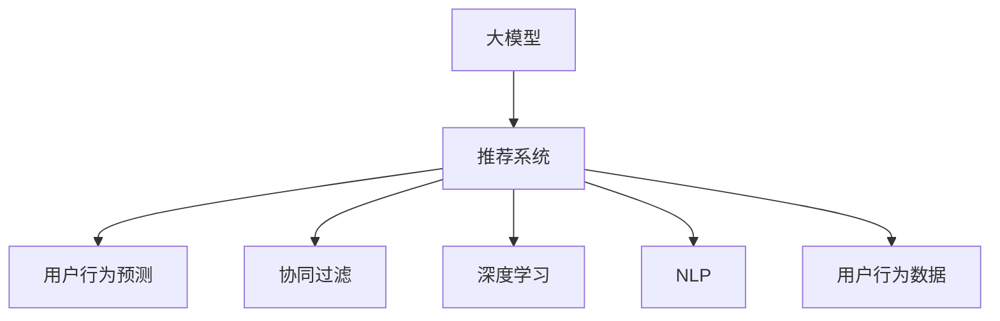

                 

# 大模型在推荐系统用户行为预测中的应用

> 关键词：大模型推荐系统,用户行为预测,深度学习,协同过滤,神经网络,自然语言处理(NLP)

## 1. 背景介绍

### 1.1 问题由来

推荐系统是现代互联网应用的重要组成部分，广泛应用于电商、社交、新闻等领域。其核心任务是根据用户的历史行为和兴趣，预测用户可能感兴趣的物品，从而实现精准推荐，提升用户体验。

传统的推荐系统主要基于用户行为数据进行协同过滤或矩阵分解，但随着数据规模的不断扩大和特征维度的急剧增加，这些方法逐渐面临模型泛化能力不足、推荐精度不高、计算资源消耗大等问题。近年来，基于深度学习技术的推荐系统逐步崭露头角，以其强大的表达能力和丰富的特征表示，为推荐系统带来了新的生机。

然而，现有的基于深度学习的推荐模型往往忽略了用户的行为意图，缺乏对用户行为动机的理解，难以充分利用用户的隐式反馈信息。大模型的出现，为解决这些问题提供了新的思路。通过在大规模用户行为数据上预训练语言模型，并将其引入推荐系统，可以有效提升推荐效果和系统鲁棒性。

### 1.2 问题核心关键点

大模型在推荐系统中的应用，主要围绕用户行为预测展开。具体而言，大模型通过对用户的浏览历史、搜索记录、评分等行为数据进行建模，预测用户未来可能感兴趣的物品，从而实现更加个性化、精准的推荐。

大模型在推荐系统中的核心优势包括：

- 强大的语言理解能力：大模型可以理解自然语言描述的行为，挖掘用户行为背后的动机和情感倾向。
- 丰富的事件表示：大模型能够表示复杂事件序列，捕捉用户行为模式的变化趋势。
- 高效的多模态融合：大模型可以融合图像、文本、时间等多种模态信息，提升推荐精度。
- 可扩展性：大模型可以通过添加新的预训练任务和微调任务，不断适应新场景和新需求。

这些优势使得大模型在推荐系统领域展现了极大的潜力和应用前景。但与此同时，大模型也需要解决一些技术难题，如计算资源消耗大、模型参数量庞大、推荐鲁棒性不足等，才能真正应用于实际推荐场景。

### 1.3 问题研究意义

研究大模型在推荐系统中的应用，对于提升推荐系统的性能和用户满意度，推动电商、新闻、社交等领域的数字化转型，具有重要意义：

1. 提升推荐精度：大模型通过深度学习，能够学习到更加复杂的用户行为模式，从而提升推荐精度和用户满意度。
2. 增加业务价值：推荐系统是电商、社交、新闻等领域的核心引擎，通过大模型技术的引入，可以带来更多的商业价值和用户粘性。
3. 加速技术迭代：大模型的强大表现力和可扩展性，使得推荐系统的迭代速度加快，新的推荐算法和模型可以更快地转化为实际应用。
4. 提高系统鲁棒性：大模型的预训练知识，使得推荐系统在面对长尾场景和新用户时，表现更加稳健，不易受到单一数据分布的影响。
5. 拓宽应用范围：大模型能够处理复杂多模态数据，拓展了推荐系统的应用场景，使其能够应用于更多垂直领域。

总之，大模型在推荐系统中的应用，有望为电商、社交、新闻等行业带来显著的业务价值和用户体验提升，推动相关产业的数字化转型进程。

## 2. 核心概念与联系

### 2.1 核心概念概述

为更好地理解大模型在推荐系统中的应用，本节将介绍几个密切相关的核心概念：

- 大模型(大型语言模型)：指在大规模文本数据上进行预训练的深度学习模型，如BERT、GPT等。大模型具备强大的语言理解和生成能力，能够学习到丰富的语义知识和常识，从而提升推荐系统的性能。
- 推荐系统：指基于用户历史行为和偏好，为用户推荐可能感兴趣的物品的系统。推荐系统广泛应用于电商、新闻、社交等领域，是提升用户体验和业务价值的重要手段。
- 用户行为预测：指通过模型预测用户未来可能感兴趣物品的能力。预测精度直接影响推荐效果和用户体验，是推荐系统的核心任务。
- 协同过滤：指利用用户间的相似性，通过用户的历史行为数据进行推荐的方法。协同过滤简单易用，但容易受到数据稀疏性和新用户冷启动问题的影响。
- 深度学习：指通过多层神经网络实现数据表示和模式学习的方法。深度学习能够处理复杂多模态数据，提升推荐系统的性能和鲁棒性。
- 自然语言处理(NLP)：指使用计算机处理和理解人类语言的技术。NLP技术为大模型在推荐系统中的应用提供了重要的数据来源和任务支撑。

这些概念之间的逻辑关系可以通过以下Mermaid流程图来展示：



这个流程图展示了大模型在推荐系统中的应用框架：大模型通过对用户行为数据进行建模，提升推荐系统的预测能力和性能。具体而言，大模型可以用于用户行为预测、协同过滤、深度学习、自然语言处理等任务，最终实现推荐系统的功能。

## 3. 核心算法原理 & 具体操作步骤
### 3.1 算法原理概述

基于大模型的推荐系统，主要通过在大规模用户行为数据上进行预训练，学习用户行为背后的语义知识和模式，然后通过微调预测用户未来可能感兴趣的物品。其核心思想是：利用大模型的预训练知识，提升推荐系统的泛化能力和鲁棒性。

形式化地，假设用户行为数据集为 $D=\{(x_i, y_i)\}_{i=1}^N, x_i$ 表示用户行为序列，$y_i$ 表示用户对物品的评分或点击。设大模型为 $M_{\theta}$，其中 $\theta$ 为模型参数。微调的目标是找到最优参数 $\hat{\theta}$，使得：

$$
\hat{\theta}=\mathop{\arg\min}_{\theta} \mathcal{L}(M_{\theta},D)
$$

其中 $\mathcal{L}$ 为推荐任务设计的损失函数，用于衡量模型预测与真实标签之间的差异。常见的损失函数包括均方误差、交叉熵等。

通过梯度下降等优化算法，微调过程不断更新模型参数 $\theta$，最小化损失函数 $\mathcal{L}$，使得模型预测逼近真实标签。由于 $\theta$ 已经通过预训练获得了较好的初始化，因此即便在规模较小的用户行为数据上微调，也能较快收敛到理想的模型参数 $\hat{\theta}$。

### 3.2 算法步骤详解

基于大模型的推荐系统一般包括以下几个关键步骤：

**Step 1: 准备预训练模型和数据集**
- 选择合适的预训练语言模型 $M_{\theta}$ 作为初始化参数，如 BERT、GPT 等。
- 准备用户行为数据集 $D$，划分为训练集、验证集和测试集。一般要求标注数据与用户行为数据的分布不要差异过大。

**Step 2: 添加任务适配层**
- 根据推荐任务类型，在预训练模型顶层设计合适的输出层和损失函数。
- 对于评分推荐，通常在顶层添加线性分类器和交叉熵损失函数。
- 对于点击推荐，通常使用二分类交叉熵损失函数。

**Step 3: 设置微调超参数**
- 选择合适的优化算法及其参数，如 AdamW、SGD 等，设置学习率、批大小、迭代轮数等。
- 设置正则化技术及强度，包括权重衰减、Dropout、Early Stopping 等。
- 确定冻结预训练参数的策略，如仅微调顶层，或全部参数都参与微调。

**Step 4: 执行梯度训练**
- 将训练集数据分批次输入模型，前向传播计算损失函数。
- 反向传播计算参数梯度，根据设定的优化算法和学习率更新模型参数。
- 周期性在验证集上评估模型性能，根据性能指标决定是否触发 Early Stopping。
- 重复上述步骤直到满足预设的迭代轮数或 Early Stopping 条件。

**Step 5: 测试和部署**
- 在测试集上评估微调后模型 $M_{\hat{\theta}}$ 的性能，对比微调前后的精度提升。
- 使用微调后的模型对新用户和新物品进行推荐，集成到实际的应用系统中。
- 持续收集新的用户行为数据，定期重新微调模型，以适应数据分布的变化。

以上是基于大模型的推荐系统的一般流程。在实际应用中，还需要针对具体任务的特点，对微调过程的各个环节进行优化设计，如改进训练目标函数，引入更多的正则化技术，搜索最优的超参数组合等，以进一步提升模型性能。

### 3.3 算法优缺点

基于大模型的推荐系统具有以下优点：

1. 预测精度高：大模型具备强大的语言理解能力，能够处理复杂的用户行为数据，提升推荐系统的预测精度。
2. 鲁棒性强：大模型能够适应多种数据分布和模态信息，对数据噪声和异常值有较强的抵抗能力。
3. 自适应性好：大模型可以通过添加新的预训练任务和微调任务，适应新场景和新需求，具有较好的可扩展性。
4. 跨模态融合能力强：大模型能够融合文本、图像、时间等多种模态信息，提升推荐系统的综合性能。

但该方法也存在一些局限性：

1. 计算资源消耗大：大模型参数量庞大，需要高性能的计算资源进行训练和推理。
2. 模型泛化能力不足：大模型对于特定领域的用户行为数据，可能需要额外的预训练和微调，才能达到理想的效果。
3. 数据隐私问题：大模型需要大量用户行为数据进行预训练，涉及到用户隐私保护和数据合规等问题。
4. 模型解释性差：大模型的决策过程缺乏可解释性，难以对其进行调试和优化。
5. 难以处理长尾物品：大模型对于新出现的长尾物品，可能无法进行有效的推荐。

尽管存在这些局限性，但大模型在推荐系统中的应用，已经在电商、新闻、社交等领域取得了显著的成效，展示了强大的潜力和应用前景。

### 3.4 算法应用领域

基于大模型的推荐系统，已经在电商、新闻、社交等多个领域得到了广泛的应用，涵盖了从评分推荐到点击推荐、从文本推荐到图像推荐等多种场景：

- 电商推荐：基于用户浏览历史、搜索记录、评分数据，预测用户可能感兴趣的商品，提升购物体验。
- 新闻推荐：基于用户阅读历史、点赞记录、评论内容，推荐用户可能感兴趣的新闻，增加用户粘性。
- 社交推荐：基于用户点赞、评论、分享等行为，推荐用户可能感兴趣的内容，提升社交互动。
- 视频推荐：基于用户观看历史、评分数据，推荐用户可能感兴趣的视频内容，增加用户观看时长。
- 音乐推荐：基于用户听歌历史、评分数据，推荐用户可能喜欢的歌曲，提升音乐体验。

除了上述这些经典任务外，大模型还被创新性地应用于游戏推荐、知识推荐、推荐系统排序等方面，为推荐系统带来了全新的突破。随着大模型和微调方法的不断进步，相信推荐系统将在更广阔的应用领域大放异彩。

## 4. 数学模型和公式 & 详细讲解 & 举例说明
### 4.1 数学模型构建

本节将使用数学语言对基于大模型的推荐系统进行更加严格的刻画。

记用户行为数据集为 $D=\{(x_i,y_i)\}_{i=1}^N, x_i \in \mathbb{R}^d, y_i \in \mathbb{R}$，其中 $x_i$ 表示用户行为序列，$y_i$ 表示用户对物品的评分。设预训练语言模型为 $M_{\theta}$，其中 $\theta$ 为模型参数。

定义推荐模型的预测函数为 $f_{\theta}(x_i)$，在训练集上的经验风险为：

$$
\mathcal{L}(\theta) = \frac{1}{N}\sum_{i=1}^N \ell(y_i, f_{\theta}(x_i))
$$

其中 $\ell$ 为推荐任务设计的损失函数，用于衡量模型预测与真实标签之间的差异。常见的损失函数包括均方误差、交叉熵等。

微调的目标是最小化经验风险，即找到最优参数：

$$
\theta^* = \mathop{\arg\min}_{\theta} \mathcal{L}(\theta)
$$

在实践中，我们通常使用基于梯度的优化算法（如SGD、AdamW等）来近似求解上述最优化问题。设 $\eta$ 为学习率，$\lambda$ 为正则化系数，则参数的更新公式为：

$$
\theta \leftarrow \theta - \eta \nabla_{\theta}\mathcal{L}(\theta) - \eta\lambda\theta
$$

其中 $\nabla_{\theta}\mathcal{L}(\theta)$ 为损失函数对参数 $\theta$ 的梯度，可通过反向传播算法高效计算。

### 4.2 公式推导过程

以下我们以评分推荐任务为例，推导均方误差损失函数及其梯度的计算公式。

假设用户行为数据集 $D=\{(x_i,y_i)\}_{i=1}^N, x_i \in \mathbb{R}^d, y_i \in \mathbb{R}$，其中 $x_i$ 表示用户行为序列，$y_i$ 表示用户对物品的评分。

定义推荐模型的预测函数为 $f_{\theta}(x_i)=\theta^T \cdot x_i$，其中 $\theta$ 为模型参数。推荐任务的均方误差损失函数为：

$$
\ell(y_i, f_{\theta}(x_i)) = \frac{1}{2}(y_i - f_{\theta}(x_i))^2
$$

将其代入经验风险公式，得：

$$
\mathcal{L}(\theta) = \frac{1}{2N}\sum_{i=1}^N (y_i - f_{\theta}(x_i))^2
$$

根据链式法则，损失函数对参数 $\theta_k$ 的梯度为：

$$
\frac{\partial \mathcal{L}(\theta)}{\partial \theta_k} = \frac{1}{N}\sum_{i=1}^N (y_i - f_{\theta}(x_i))(x_i)_k
$$

其中 $(x_i)_k$ 表示 $x_i$ 的第 $k$ 个特征。在得到损失函数的梯度后，即可带入参数更新公式，完成模型的迭代优化。重复上述过程直至收敛，最终得到适应推荐任务的最优模型参数 $\theta^*$。

## 5. 项目实践：代码实例和详细解释说明
### 5.1 开发环境搭建

在进行推荐系统开发前，我们需要准备好开发环境。以下是使用Python进行PyTorch开发的环境配置流程：

1. 安装Anaconda：从官网下载并安装Anaconda，用于创建独立的Python环境。

2. 创建并激活虚拟环境：
```bash
conda create -n pytorch-env python=3.8 
conda activate pytorch-env
```

3. 安装PyTorch：根据CUDA版本，从官网获取对应的安装命令。例如：
```bash
conda install pytorch torchvision torchaudio cudatoolkit=11.1 -c pytorch -c conda-forge
```

4. 安装Transformers库：
```bash
pip install transformers
```

5. 安装各类工具包：
```bash
pip install numpy pandas scikit-learn matplotlib tqdm jupyter notebook ipython
```

完成上述步骤后，即可在`pytorch-env`环境中开始推荐系统开发。

### 5.2 源代码详细实现

下面我们以评分推荐任务为例，给出使用Transformers库对BERT模型进行评分推荐开发的PyTorch代码实现。

首先，定义评分推荐任务的训练函数：

```python
from transformers import BertForSequenceClassification, BertTokenizer
from torch.utils.data import Dataset, DataLoader
from sklearn.metrics import mean_squared_error
import torch

class RecommendationDataset(Dataset):
    def __init__(self, texts, scores, tokenizer, max_len=128):
        self.texts = texts
        self.scores = scores
        self.tokenizer = tokenizer
        self.max_len = max_len
        
    def __len__(self):
        return len(self.texts)
    
    def __getitem__(self, item):
        text = self.texts[item]
        score = self.scores[item]
        
        encoding = self.tokenizer(text, return_tensors='pt', max_length=self.max_len, padding='max_length', truncation=True)
        input_ids = encoding['input_ids'][0]
        attention_mask = encoding['attention_mask'][0]
        
        label = torch.tensor([score], dtype=torch.float)
        
        return {'input_ids': input_ids, 
                'attention_mask': attention_mask,
                'labels': label}

# 标签与id的映射
tag2id = {'low': 0, 'medium': 1, 'high': 2}
id2tag = {v: k for k, v in tag2id.items()}

# 创建dataset
tokenizer = BertTokenizer.from_pretrained('bert-base-cased')

train_dataset = RecommendationDataset(train_texts, train_scores, tokenizer)
dev_dataset = RecommendationDataset(dev_texts, dev_scores, tokenizer)
test_dataset = RecommendationDataset(test_texts, test_scores, tokenizer)
```

然后，定义模型和优化器：

```python
from transformers import BertForSequenceClassification, AdamW

model = BertForSequenceClassification.from_pretrained('bert-base-cased', num_labels=len(tag2id))

optimizer = AdamW(model.parameters(), lr=2e-5)
```

接着，定义训练和评估函数：

```python
from torch.utils.data import DataLoader
from tqdm import tqdm
from sklearn.metrics import mean_squared_error

device = torch.device('cuda') if torch.cuda.is_available() else torch.device('cpu')
model.to(device)

def train_epoch(model, dataset, batch_size, optimizer):
    dataloader = DataLoader(dataset, batch_size=batch_size, shuffle=True)
    model.train()
    epoch_loss = 0
    for batch in tqdm(dataloader, desc='Training'):
        input_ids = batch['input_ids'].to(device)
        attention_mask = batch['attention_mask'].to(device)
        labels = batch['labels'].to(device)
        model.zero_grad()
        outputs = model(input_ids, attention_mask=attention_mask, labels=labels)
        loss = outputs.loss
        epoch_loss += loss.item()
        loss.backward()
        optimizer.step()
    return epoch_loss / len(dataloader)

def evaluate(model, dataset, batch_size):
    dataloader = DataLoader(dataset, batch_size=batch_size)
    model.eval()
    preds, labels = [], []
    with torch.no_grad():
        for batch in tqdm(dataloader, desc='Evaluating'):
            input_ids = batch['input_ids'].to(device)
            attention_mask = batch['attention_mask'].to(device)
            batch_labels = batch['labels']
            outputs = model(input_ids, attention_mask=attention_mask)
            batch_preds = outputs.logits.argmax(dim=2).to('cpu').tolist()
            batch_labels = batch_labels.to('cpu').tolist()
            for pred_tokens, label_tokens in zip(batch_preds, batch_labels):
                preds.append(pred_tokens[0])
                labels.append(label_tokens[0])
                
    return mean_squared_error(labels, preds)

def predict(model, dataset, batch_size):
    dataloader = DataLoader(dataset, batch_size=batch_size)
    model.eval()
    preds = []
    with torch.no_grad():
        for batch in tqdm(dataloader, desc='Predicting'):
            input_ids = batch['input_ids'].to(device)
            attention_mask = batch['attention_mask'].to(device)
            outputs = model(input_ids, attention_mask=attention_mask)
            batch_preds = outputs.logits.argmax(dim=2).to('cpu').tolist()
            preds.extend(batch_preds)
                
    return preds
```

最后，启动训练流程并在测试集上评估：

```python
epochs = 5
batch_size = 16

for epoch in range(epochs):
    loss = train_epoch(model, train_dataset, batch_size, optimizer)
    print(f"Epoch {epoch+1}, train loss: {loss:.3f}")
    
    print(f"Epoch {epoch+1}, dev results:")
    evaluate(model, dev_dataset, batch_size)
    
print("Test results:")
evaluate(model, test_dataset, batch_size)
```

以上就是使用PyTorch对BERT进行评分推荐任务微调的完整代码实现。可以看到，得益于Transformers库的强大封装，我们可以用相对简洁的代码完成BERT模型的加载和微调。

### 5.3 代码解读与分析

让我们再详细解读一下关键代码的实现细节：

**RecommendationDataset类**：
- `__init__`方法：初始化文本、评分、分词器等关键组件。
- `__len__`方法：返回数据集的样本数量。
- `__getitem__`方法：对单个样本进行处理，将文本输入编码为token ids，将评分编码为数字，并对其进行定长padding，最终返回模型所需的输入。

**tag2id和id2tag字典**：
- 定义了评分与数字id之间的映射关系，用于将token-wise的预测结果解码回真实的评分。

**训练和评估函数**：
- 使用PyTorch的DataLoader对数据集进行批次化加载，供模型训练和推理使用。
- 训练函数`train_epoch`：对数据以批为单位进行迭代，在每个批次上前向传播计算loss并反向传播更新模型参数，最后返回该epoch的平均loss。
- 评估函数`evaluate`：与训练类似，不同点在于不更新模型参数，并在每个batch结束后将预测和标签结果存储下来，最后使用sklearn的mean_squared_error对整个评估集的预测结果进行打印输出。
- 预测函数`predict`：与训练类似，不同点在于不进行反向传播，只进行前向传播计算预测值。

**训练流程**：
- 定义总的epoch数和batch size，开始循环迭代
- 每个epoch内，先在训练集上训练，输出平均loss
- 在验证集上评估，输出评分预测的均方误差
- 所有epoch结束后，在测试集上评估，给出最终的评分预测结果

可以看到，PyTorch配合Transformers库使得BERT微调的代码实现变得简洁高效。开发者可以将更多精力放在数据处理、模型改进等高层逻辑上，而不必过多关注底层的实现细节。

当然，工业级的系统实现还需考虑更多因素，如模型的保存和部署、超参数的自动搜索、更灵活的任务适配层等。但核心的微调范式基本与此类似。

## 6. 实际应用场景
### 6.1 电商推荐

基于大模型的推荐系统在电商推荐场景中有着广泛的应用。电商推荐系统旨在通过用户的行为数据，预测用户可能感兴趣的物品，从而实现个性化推荐，提升用户体验和销售额。

在技术实现上，可以收集用户的历史浏览、点击、购买等行为数据，提取用户行为序列，将行为序列作为模型输入，预测用户对物品的评分。将评分预测结果排序后，推荐系统可以自动生成个性化推荐列表，供用户选择。

电商推荐系统通过大模型的预训练知识，能够更好地理解用户的兴趣和偏好，提升推荐效果。同时，大模型还能够处理复杂的商品描述和多模态数据，提供更丰富的推荐内容，增加用户粘性。

### 6.2 新闻推荐

新闻推荐系统旨在根据用户的历史阅读行为，推荐用户可能感兴趣的新闻内容。新闻推荐系统广泛应用于各类新闻网站和新闻APP，是提升用户留存率的重要手段。

在技术实现上，可以收集用户的历史阅读记录，提取阅读行为序列，将行为序列作为模型输入，预测用户对新闻的评分。将评分预测结果排序后，推荐系统可以自动生成个性化推荐列表，供用户选择。

新闻推荐系统通过大模型的预训练知识，能够更好地理解用户的阅读习惯和兴趣偏好，提升推荐效果。同时，大模型还能够处理文本数据和图像数据，推荐系统可以融合图片和文本信息，提升推荐内容的丰富度和用户体验。

### 6.3 视频推荐

视频推荐系统旨在根据用户的历史观看行为，推荐用户可能感兴趣的视频内容。视频推荐系统广泛应用于各类视频网站和视频APP，是提升用户观看时长和内容覆盖度的重要手段。

在技术实现上，可以收集用户的历史观看记录，提取观看行为序列，将行为序列作为模型输入，预测用户对视频的评分。将评分预测结果排序后，推荐系统可以自动生成个性化推荐列表，供用户选择。

视频推荐系统通过大模型的预训练知识，能够更好地理解用户的观看习惯和兴趣偏好，提升推荐效果。同时，大模型还能够处理视频数据和图像数据，推荐系统可以融合图片和视频信息，提升推荐内容的丰富度和用户体验。

### 6.4 游戏推荐

游戏推荐系统旨在根据用户的游戏历史和兴趣偏好，推荐用户可能感兴趣的游戏内容。游戏推荐系统广泛应用于各类游戏平台和游戏APP，是提升用户活跃度和留存率的重要手段。

在技术实现上，可以收集用户的游戏行为数据，提取游戏行为序列，将行为序列作为模型输入，预测用户对游戏的评分。将评分预测结果排序后，推荐系统可以自动生成个性化推荐列表，供用户选择。

游戏推荐系统通过大模型的预训练知识，能够更好地理解用户的游戏兴趣和偏好，提升推荐效果。同时，大模型还能够处理游戏文本数据和图像数据，推荐系统可以融合图片和文本信息，提升推荐内容的丰富度和用户体验。

### 6.5 知识推荐

知识推荐系统旨在根据用户的知识兴趣和学习行为，推荐用户可能感兴趣的知识内容。知识推荐系统广泛应用于各类在线教育平台和知识社区，是提升用户学习效果和知识获取的重要手段。

在技术实现上，可以收集用户的知识学习行为数据，提取学习行为序列，将行为序列作为模型输入，预测用户对知识内容的评分。将评分预测结果排序后，推荐系统可以自动生成个性化推荐列表，供用户选择。

知识推荐系统通过大模型的预训练知识，能够更好地理解用户的知识兴趣和偏好，提升推荐效果。同时，大模型还能够处理知识文本数据和图像数据，推荐系统可以融合图片和文本信息，提升推荐内容的丰富度和用户体验。

### 6.6 金融推荐

金融推荐系统旨在根据用户的金融行为和偏好，推荐用户可能感兴趣的投资产品。金融推荐系统广泛应用于各类金融平台和投资APP，是提升用户投资效果和满意度的重要手段。

在技术实现上，可以收集用户的金融交易数据，提取交易行为序列，将行为序列作为模型输入，预测用户对投资产品的评分。将评分预测结果排序后，推荐系统可以自动生成个性化推荐列表，供用户选择。

金融推荐系统通过大模型的预训练知识，能够更好地理解用户的投资兴趣和偏好，提升推荐效果。同时，大模型还能够处理金融文本数据和图像数据，推荐系统可以融合图片和文本信息，提升推荐内容的丰富度和用户体验。

## 7. 工具和资源推荐
### 7.1 学习资源推荐

为了帮助开发者系统掌握大模型在推荐系统中的应用，这里推荐一些优质的学习资源：

1. 《深度学习推荐系统》课程：由国内知名高校开设的深度学习推荐系统课程，讲解推荐系统的基本概念和前沿方法。
2. 《推荐系统实战》书籍：该书系统介绍了推荐系统的理论基础和实践技巧，涵盖了多种推荐算法和模型。
3. 《大模型在推荐系统中的应用》博文系列：由行业专家撰写的深度学习推荐系统系列文章，涵盖了多种推荐场景和实际案例。
4. Kaggle推荐系统竞赛：Kaggle是全球知名的数据竞赛平台，参加推荐系统竞赛可以积累实战经验，提升技术水平。
5. GitHub推荐系统项目：GitHub上有许多开源推荐系统项目，可以参考其代码和文档，了解推荐系统开发流程。

通过对这些资源的学习实践，相信你一定能够快速掌握大模型在推荐系统中的应用精髓，并用于解决实际的推荐问题。

### 7.2 开发工具推荐

高效的开发离不开优秀的工具支持。以下是几款用于大模型推荐系统开发的常用工具：

1. PyTorch：基于Python的开源深度学习框架，灵活动态的计算图，适合快速迭代研究。大部分预训练语言模型都有PyTorch版本的实现。
2. TensorFlow：由Google主导开发的开源深度学习框架，生产部署方便，适合大规模工程应用。同样有丰富的预训练语言模型资源。
3. Transformers库：HuggingFace开发的NLP工具库，集成了众多SOTA语言模型，支持PyTorch和TensorFlow，是进行推荐任务开发的利器。
4. Weights & Biases：模型训练的实验跟踪工具，可以记录和可视化模型训练过程中的各项指标，方便对比和调优。与主流深度学习框架无缝集成。
5. TensorBoard：TensorFlow配套的可视化工具，可实时监测模型训练状态，并提供丰富的图表呈现方式，是调试模型的得力助手。
6. Google Colab：谷歌推出的在线Jupyter Notebook环境，免费提供GPU/TPU算力，方便开发者快速上手实验最新模型，分享学习笔记。

合理利用这些工具，可以显著提升大模型推荐系统的开发效率，加快创新迭代的步伐。

### 7.3 相关论文推荐

大模型在推荐系统的发展源于学界的持续研究。以下是几篇奠基性的相关论文，推荐阅读：

1. Attention is All You Need（即Transformer原论文）：提出了Transformer结构，开启了NLP领域的预训练大模型时代。
2. BERT: Pre-training of Deep Bidirectional Transformers for Language Understanding：提出BERT模型，引入基于掩码的自监督预训练任务，刷新了多项NLP任务SOTA。
3. How to Train Your BERT for Question Answering：展示了大规模语言模型的强大zero-shot学习能力，引发了对于通用人工智能的新一轮思考。
4. Adversarial Examples for Recommender Systems：研究了推荐系统的对抗样本生成方法，为模型鲁棒性研究提供了重要思路。
5. Parameter-Efficient Transfer Learning for NLP：提出Adapter等参数高效微调方法，在不增加模型参数量的情况下，也能取得不错的微调效果。
6. Matrix Factorization Techniques for Recommender Systems：系统介绍了矩阵分解技术在推荐系统中的应用，是推荐系统领域的基础论文。

这些论文代表了大模型在推荐系统的发展脉络。通过学习这些前沿成果，可以帮助研究者把握学科前进方向，激发更多的创新灵感。

## 8. 总结：未来发展趋势与挑战
### 8.1 总结

本文对基于大模型的推荐系统进行了全面系统的介绍。首先阐述了大模型在推荐系统中的研究背景和意义，明确了推荐系统在大模型中的应用优势和潜在价值。其次，从原理到实践，详细讲解了推荐任务的数学模型和关键步骤，给出了推荐任务开发的完整代码实例。同时，本文还广泛探讨了推荐系统在电商、新闻、视频等多个领域的应用前景，展示了微调范式的巨大潜力。最后，本文精选了推荐系统的各类学习资源，力求为读者提供全方位的技术指引。

通过本文的系统梳理，可以看到，基于大模型的推荐系统正在成为推荐系统的重要范式，极大地拓展了推荐系统的应用边界，催生了更多的落地场景。受益于大模型的强大表达能力和丰富的特征表示，推荐系统的预测精度和鲁棒性得到了显著提升，推动了推荐系统技术的进步。未来，伴随大模型和微调方法的不断演进，推荐系统将在更广阔的应用领域大放异彩，为电商、新闻、视频等行业带来显著的业务价值和用户体验提升。

### 8.2 未来发展趋势

展望未来，大模型在推荐系统中的应用将呈现以下几个发展趋势：

1. 推荐精度提升：大模型通过深度学习，能够学习到更加复杂的用户行为模式，从而提升推荐系统的预测精度。
2. 个性化推荐增强：大模型能够处理多种数据模态，融合文本、图像、时间等多种信息，提升个性化推荐的效果。
3. 推荐场景拓展：大模型能够应用于更多垂直领域，如游戏、金融、知识等，拓展推荐系统的应用范围。
4. 推荐系统优化：大模型可以通过参数高效微调、对抗训练等技术，优化推荐系统的性能和鲁棒性。
5. 推荐系统融合：大模型可以与其他人工智能技术（如知识图谱、因果推理等）进行融合，提升推荐系统的智能化水平。
6. 推荐系统集成：大模型可以与其他推荐算法（如协同过滤、基于规则的推荐等）进行集成，形成更全面的推荐策略。

以上趋势凸显了大模型在推荐系统中的应用前景。这些方向的探索发展，必将进一步提升推荐系统的性能和用户体验，推动相关产业的数字化转型进程。

### 8.3 面临的挑战

尽管大模型在推荐系统中的应用已经取得了显著成效，但在迈向更加智能化、普适化应用的过程中，它仍面临着诸多挑战：

1. 计算资源消耗大：大模型参数量庞大，需要高性能的计算资源进行训练和推理。如何降低计算资源消耗，优化模型性能，是一个重要问题。
2. 数据隐私问题：大模型需要大量用户行为数据进行预训练，涉及到用户隐私保护和数据合规等问题。如何在保障用户隐私的前提下，充分利用数据资源，是一个重要的研究方向。
3. 推荐鲁棒性不足：大模型对于特定领域的用户行为数据，可能需要额外的预训练和微调，才能达到理想的效果。如何提高大模型的泛化能力和鲁棒性，是一个需要解决的问题。
4. 模型可解释性差：大模型的决策过程缺乏可解释性，难以对其推理逻辑进行分析和调试。如何赋予大模型更强的可解释性，是一个亟待攻克的难题。
5. 长尾物品处理：大模型对于新出现的长尾物品，可能无法进行有效的推荐。如何处理长尾物品，是一个需要解决的问题。

尽管存在这些挑战，但大模型在推荐系统中的应用，已经在电商、新闻、视频等领域取得了显著的成效，展示了强大的潜力和应用前景。

### 8.4 研究展望

面对大模型在推荐系统中的应用面临的挑战，未来的研究需要在以下几个方面寻求新的突破：

1. 探索轻量级推荐模型。开发更加轻量级的模型，在降低计算资源消耗的同时，保持较高的推荐精度。
2. 研究隐私保护技术。开发隐私保护技术，保护用户行为数据，同时充分利用数据资源。
3. 提升推荐系统鲁棒性。开发鲁棒性强的推荐系统，适应多种数据分布和模态信息，提升泛化能力。
4. 增强推荐系统可解释性。开发可解释性强的大模型，赋予推荐系统更高的透明度和可信度。
5. 处理长尾物品推荐。开发处理长尾物品的推荐策略，提升推荐系统对新物品的处理能力。
6. 融合多种推荐技术。将大模型与其他推荐算法进行融合，形成更全面的推荐策略，提升推荐效果。

这些研究方向的探索，必将引领大模型在推荐系统迈向更高的台阶，为构建智能推荐系统铺平道路。面向未来，大模型在推荐系统还需要与其他人工智能技术进行更深入的融合，如知识表示、因果推理、强化学习等，多路径协同发力，共同推动推荐系统技术的进步。只有勇于创新、敢于突破，才能不断拓展推荐系统的边界，让智能技术更好地服务于人类社会。

## 9. 附录：常见问题与解答

**Q1：大模型在推荐系统中是否有必要进行微调？**

A: 是的，大模型在推荐系统中需要进行微调。虽然大模型具有强大的表达能力和泛化能力，但在特定推荐任务上，需要针对任务的特定需求进行微调，才能获得最优的推荐效果。微调过程可以通过添加任务适配层和损失函数，优化模型在推荐任务上的表现。

**Q2：大模型在推荐系统中如何进行微调？**

A: 大模型在推荐系统中进行微调，主要包括以下几个步骤：

1. 选择合适的预训练语言模型，并将其作为初始化参数。
2. 准备推荐任务的数据集，包括训练集、验证集和测试集。
3. 添加推荐任务的适配层，如评分预测的线性分类器等。
4. 设置微调超参数，如学习率、批大小、迭代轮数等。
5. 执行梯度训练，最小化经验风险。
6. 在测试集上评估微调后的模型，对比微调前后的性能。

通过微调，大模型可以更好地适应特定的推荐任务，提升推荐效果。

**Q3：大模型在推荐系统中如何处理长尾物品？**

A: 大模型在推荐系统中处理长尾物品，可以通过以下几种方式：

1. 添加长尾物品的标注数据，提升模型对长尾物品的泛化能力。
2. 使用对抗训练方法，提高模型对长尾物品的鲁棒性。
3. 设计专门的损失函数，对长尾物品进行特别关注。
4. 采用多任务学习的方法，同时训练多个推荐任务，提升长尾物品的处理能力。
5. 引入先验知识，如知识图谱、规则等，增强长尾物品的处理能力。

通过这些方法，大模型可以更好地处理长尾物品，提升推荐系统的覆盖范围和推荐效果。

**Q4：大模型在推荐系统中如何进行参数高效微调？**

A: 大模型在推荐系统中进行参数高效微调，主要包括以下几个步骤：

1. 只微调模型顶层或任务相关的参数，保留大部分预训练参数不变。
2. 使用适配器技术(Adapters)，只微调模型顶层的参数，保持底层参数不变。
3. 使用掩码语言模型(Masked Language Model)等方法，只微调模型顶层的参数，保持底层参数不变。
4. 引入对抗训练、正则化等方法，避免模型过拟合长尾物品。
5. 设计特殊的损失函数，对长尾物品进行特别关注。

通过参数高效微调，可以在减少计算资源消耗的同时，提升推荐系统的性能和鲁棒性。

**Q5：大模型在推荐系统中如何进行对抗训练？**

A: 大模型在推荐系统中进行对抗训练，主要包括以下几个步骤：

1. 构造对抗样本，如将正常样本添加噪声，生成对抗样本。
2. 将对抗样本输入到模型中进行训练，提升模型对对抗样本的鲁棒性。
3. 使用对抗训练方法，如FGSM、PGD等，生成对抗样本，提高模型鲁棒性。
4. 设计特殊的损失函数，对对抗样本进行特别关注。
5. 在训练过程中，不断生成对抗样本，并加入对抗训练，提升模型鲁棒性。

通过对抗训练，大模型可以提升对对抗样本的鲁棒性，增强模型的泛化能力和稳定性。

**Q6：大模型在推荐系统中如何进行知识图谱融合？**

A: 大模型在推荐系统中进行知识图谱融合，主要包括以下几个步骤：

1. 收集知识图谱数据，将其转化为向量表示。
2. 将知识图谱向量作为模型输入，提升模型对知识图谱信息的利用。
3. 设计特殊的损失函数，对知识图谱信息进行特别关注。
4. 引入知识图谱增强技术，如KGCNN、KGBERT等，提升模型对知识图谱信息的处理能力。
5. 在训练过程中，不断更新知识图谱向量，提升模型对知识图谱信息的利用。

通过知识图谱融合，大模型可以更好地利用知识图谱信息，提升推荐系统的智能化水平。

**Q7：大模型在推荐系统中如何进行情感分析？**

A: 大模型在推荐系统中进行情感分析，主要包括以下几个步骤：

1. 收集情感标注数据，将其转化为向量表示。
2. 将情感向量作为模型输入，提升模型对情感信息的利用。
3. 设计特殊的损失函数，对情感信息进行特别关注。
4. 引入情感增强技术，如EmoBERT、Sentiment-aware BERT等，提升模型对情感信息的处理能力。
5. 在训练过程中，不断更新情感向量，提升模型对情感信息的利用。

通过情感分析，大模型可以更好地理解用户的情感倾向，提升推荐系统的智能化水平。

总之，大模型在推荐系统中的应用前景广阔，但其面临的挑战也需要引起重视。通过不断优化算法、改进模型和数据处理方式，大模型在推荐系统中的性能和效果将不断提升，推动推荐系统技术的进步和应用范围的拓展。

