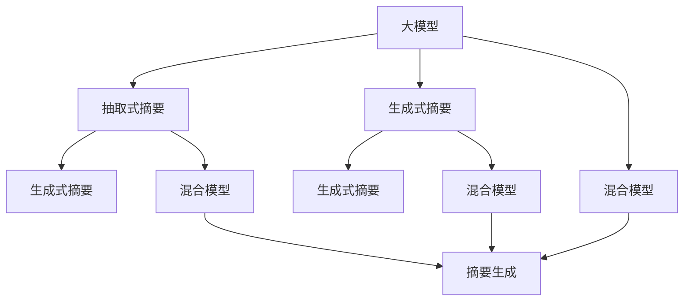

                 

# 大模型在用户评论摘要生成中的抽取式与生成式结合

> 关键词：大模型,用户评论摘要,抽取式摘要,生成式摘要,混合模型,Transformer,模型融合

## 1. 背景介绍

### 1.1 问题由来
随着互联网的发展，用户生成内容（User Generated Content, UGC）在各个领域的社交媒体、电商平台、论坛等平台迅速增加，给企业带来了海量的用户评论数据。这些评论通常包含丰富的情感色彩、客观评价、建议和意见，对于企业了解用户需求、改进产品质量、优化客户体验具有重要的价值。然而，传统的数据处理方法无法充分挖掘这些数据，人工处理成本高，效率低下。

因此，开发高效、精准的用户评论摘要生成方法，成为当下的一大挑战。用户评论摘要生成（User Comment Summarization），即在大量用户评论中，自动生成精炼、准确的评论摘要，是自然语言处理（NLP）领域的一个热点研究方向。该技术不仅能够帮助企业快速了解用户反馈，提高决策效率，还能提升用户满意度，增强品牌形象。

### 1.2 问题核心关键点
用户评论摘要生成的方法可以分为两类：抽取式摘要和生成式摘要。抽取式摘要（Extractive Summarization）是从原始文本中直接提取关键词、关键句，作为摘要内容；生成式摘要（Generative Summarization）则利用自然语言生成技术，重新组织文本内容，生成自然流畅的摘要。

抽取式摘要方法简单易行，但缺乏灵活性和生成性；生成式摘要方法则更灵活，但计算复杂度高，难以保证生成的准确性。

目前，生成式摘要研究主要集中在基于神经网络（如RNN、LSTM、GRU等）和Transformer模型，其优点是能够生成连贯、上下文相关的摘要，但模型训练和推理计算成本较高。而抽取式摘要则相对简单，计算资源需求低，但无法处理语义复杂、细节丰富的评论内容。

如何结合抽取式和生成式方法的优势，开发高效、灵活的用户评论摘要生成系统，成为当前研究的一大挑战。本文将以大模型（如BERT、GPT-2等）为基础，探讨抽取式与生成式方法的结合，提出一种混合模型，以期在用户评论摘要生成中取得更好的效果。

## 2. 核心概念与联系

### 2.1 核心概念概述

为更好地理解大模型在用户评论摘要生成中的应用，本节将介绍几个密切相关的核心概念：

- 大模型（Large Model）：以Transformer为基础的预训练语言模型，如BERT、GPT-2、T5等。这类模型通过大规模无监督学习，获得了丰富的语言知识和常识，能够处理自然语言中的各种复杂任务。

- 用户评论摘要（User Comment Summarization）：将大量用户评论自动提炼成简洁、有意义的摘要，帮助企业快速把握用户反馈。用户评论摘要既需要精确提取关键信息，又需要自然流畅的语言表达。

- 抽取式摘要（Extractive Summarization）：从原始文本中直接提取关键词、关键句，作为摘要内容。这种方法计算成本低，但缺乏灵活性和生成性。

- 生成式摘要（Generative Summarization）：利用自然语言生成技术，重新组织文本内容，生成自然流畅的摘要。这种方法灵活性高，但计算复杂度高，难以保证生成的准确性。

- 混合模型（Hybrid Model）：将抽取式和生成式方法结合，充分发挥各自优势，提升摘要生成的效果和效率。混合模型一般分为两阶段：先进行抽取式抽取关键信息，再进行生成式填充和优化。

这些核心概念之间的逻辑关系可以通过以下Mermaid流程图来展示：



这个流程图展示了大模型在用户评论摘要生成中的核心概念及其之间的关系：

1. 大模型通过预训练获得基础能力。
2. 抽取式摘要方法从原始文本中直接提取关键信息。
3. 生成式摘要方法利用自然语言生成技术，重新组织文本内容。
4. 混合模型将抽取式和生成式方法结合，提升摘要生成的效果。
5. 最终得到简洁、有意义的摘要。

## 3. 核心算法原理 & 具体操作步骤
### 3.1 算法原理概述

用户评论摘要生成的混合模型（Hybrid Model）将抽取式和生成式方法相结合，充分发挥各自优势。其核心思想是：先进行抽取式抽取关键信息，再进行生成式填充和优化，最终得到自然流畅的摘要。

### 3.2 算法步骤详解

混合模型的具体实施步骤如下：

**Step 1: 准备数据集**
- 收集用户评论数据，并清洗、标注为摘要生成任务。
- 将用户评论和标签分别划分为训练集、验证集和测试集。

**Step 2: 训练抽取式模型**
- 使用大模型（如BERT、GPT-2等）作为初始化参数，通过监督学习训练抽取式模型。
- 标注数据集中的每个评论，使用模型抽取关键词和关键句。

**Step 3: 训练生成式模型**
- 根据抽取式模型得到的关键词和关键句，重新组织生成自然流畅的摘要。
- 使用大模型作为初始化参数，通过监督学习训练生成式模型。
- 使用训练集中的评论和抽取式模型得到的关键词和关键句，生成摘要。

**Step 4: 模型融合**
- 将抽取式模型和生成式模型结合，生成最终的摘要。
- 对于每个评论，先使用抽取式模型抽取关键信息，然后通过生成式模型进行填充和优化。

**Step 5: 评估与优化**
- 在验证集和测试集上评估模型的性能，使用BLEU、ROUGE等指标衡量摘要质量。
- 根据评估结果，调整模型参数和超参数，优化模型性能。

**Step 6: 部署与使用**
- 将优化后的混合模型部署到实际应用系统中，生成用户评论摘要。
- 实时采集用户评论，调用模型生成摘要，提升用户体验。

以上就是混合模型在用户评论摘要生成中的核心步骤。通过合理设计，混合模型能够在保证摘要质量的前提下，降低计算成本，提升效率。

### 3.3 算法优缺点

混合模型具有以下优点：
1. 结合抽取式和生成式方法，取长补短。抽取式方法计算成本低，能够快速提取出关键信息；生成式方法灵活性高，能够生成自然流畅的摘要。
2. 增强摘要的多样性和上下文相关性。抽取式方法提取的关键信息具有一定的泛化能力，生成式方法进一步填充和优化，使得摘要更加自然、连贯。
3. 提升摘要的精度和覆盖面。通过抽取式和生成式方法的结合，能够全面涵盖评论中的关键信息，提高摘要的精度和覆盖面。
4. 提高模型训练的效率。使用大模型作为初始化参数，能够快速训练出高性能的抽取式和生成式模型，降低训练成本。

同时，混合模型也存在一些缺点：
1. 模型复杂度增加。混合模型需要同时训练和维护抽取式和生成式两个模型，增加了模型的复杂度。
2. 计算资源需求高。虽然抽取式和生成式方法的结合能够提高效率，但整体计算资源需求仍较高，特别是在大模型上训练和推理时。
3. 模型训练和优化难度大。混合模型需要同时优化两个模型，增加了训练和优化的难度，需要更多的实验和调整。

尽管存在这些缺点，但混合模型在用户评论摘要生成中仍然具有广阔的应用前景，值得进一步探索和优化。

### 3.4 算法应用领域

混合模型在用户评论摘要生成中的应用，不仅限于商业领域，还可以扩展到以下领域：

- 社交媒体分析：在Twitter、微博等社交媒体平台上，自动生成用户评论摘要，帮助企业了解用户情绪和舆情变化。
- 客户服务分析：在客服系统中，自动生成用户评价摘要，帮助客服人员快速了解用户需求，提供更好的服务。
- 产品改进建议：在电商平台中，自动生成用户评论摘要，帮助产品经理了解用户反馈，优化产品设计。
- 品牌声誉监测：在新闻媒体和社交平台上，自动生成用户评论摘要，帮助品牌管理团队了解公众对其形象和产品的看法。

这些应用场景不仅能够提升企业的决策效率，还能提高用户满意度，提升品牌形象。

## 4. 数学模型和公式 & 详细讲解 & 举例说明

### 4.1 数学模型构建

本节将使用数学语言对用户评论摘要生成的混合模型进行详细描述。

记用户评论为 $X$，摘要为 $Y$。假设混合模型由抽取式模型 $E$ 和生成式模型 $G$ 组成，分别为：

$$
E: X \rightarrow K
$$

$$
G: K \rightarrow Y
$$

其中 $K$ 为抽取式模型输出的关键词集合。混合模型的整体映射为：

$$
F: X \rightarrow Y
$$

在训练过程中，混合模型的损失函数为：

$$
\mathcal{L} = \mathcal{L}_E + \mathcal{L}_G
$$

其中 $\mathcal{L}_E$ 为抽取式模型的损失函数，$\mathcal{L}_G$ 为生成式模型的损失函数。

在评估时，使用BLEU、ROUGE等指标衡量摘要质量：

$$
BLEU = \prod_{i=1}^n \max_{1 \leq j \leq n} \frac{c_i}{p_i}
$$

$$
ROUGE = \frac{\sum_{i=1}^n \min(c_i, p_i)}{\sum_{i=1}^n \max(c_i, p_i)}
$$

其中 $c_i$ 为摘要中的第 $i$ 个词语，$p_i$ 为原始评论中的第 $i$ 个词语。

### 4.2 公式推导过程

下面以抽取式模型和生成式模型为例，推导混合模型的具体实现。

**抽取式模型**
- 使用BERT作为初始化参数，通过监督学习训练抽取式模型。
- 假设训练样本为 $(x_i, y_i)$，其中 $x_i$ 为原始评论，$y_i$ 为关键词集合。
- 训练过程中，使用交叉熵损失函数：

$$
\mathcal{L}_E = -\frac{1}{N}\sum_{i=1}^N \log P(K_i|x_i)
$$

其中 $P(K_i|x_i)$ 为给定 $x_i$ 条件下 $K_i$ 的概率分布。

**生成式模型**
- 使用GPT-2作为初始化参数，通过监督学习训练生成式模型。
- 假设训练样本为 $(x_i, y_i)$，其中 $x_i$ 为关键词集合，$y_i$ 为生成的摘要。
- 训练过程中，使用交叉熵损失函数：

$$
\mathcal{L}_G = -\frac{1}{N}\sum_{i=1}^N \log P(Y_i|K_i)
$$

其中 $P(Y_i|K_i)$ 为给定 $K_i$ 条件下 $Y_i$ 的概率分布。

在混合模型中，抽取式模型和生成式模型分别独立训练，但需要在整个模型训练过程中进行融合。具体融合方法有加法、乘法、权重融合等，这里以加法融合为例：

$$
P(Y_i|X_i) = P(K_i|X_i)P(Y_i|K_i)
$$

其中 $P(Y_i|X_i)$ 为给定 $X_i$ 条件下 $Y_i$ 的概率分布。

### 4.3 案例分析与讲解

为了更清晰地理解混合模型的工作原理，以下是几个示例：

**示例1: 社交媒体评论摘要**
- 假设原始评论为："这家餐厅的服务很糟糕，菜的味道也一般。" 
- 抽取式模型提取关键词为："餐厅", "服务", "菜"
- 生成式模型生成摘要为："这家餐厅服务差，菜一般"
- 最终生成的摘要为："餐厅服务差，菜一般"

**示例2: 电商平台商品评论摘要**
- 假设原始评论为："这款手机性价比很高，运行速度也很快，但电池续航一般。"
- 抽取式模型提取关键词为："手机", "性价比", "速度", "电池"
- 生成式模型生成摘要为："性价比高，运行快，电池续航一般"
- 最终生成的摘要为："性价比高，速度快，电池一般"

通过这些示例可以看到，混合模型能够结合抽取式和生成式方法的优势，生成简洁、自然、有意义的摘要。

## 5. 项目实践：代码实例和详细解释说明
### 5.1 开发环境搭建

在进行混合模型实践前，我们需要准备好开发环境。以下是使用Python进行PyTorch开发的环境配置流程：

1. 安装Anaconda：从官网下载并安装Anaconda，用于创建独立的Python环境。

2. 创建并激活虚拟环境：
```bash
conda create -n pytorch-env python=3.8 
conda activate pytorch-env
```

3. 安装PyTorch：根据CUDA版本，从官网获取对应的安装命令。例如：
```bash
conda install pytorch torchvision torchaudio cudatoolkit=11.1 -c pytorch -c conda-forge
```

4. 安装Transformers库：
```bash
pip install transformers
```

5. 安装各类工具包：
```bash
pip install numpy pandas scikit-learn matplotlib tqdm jupyter notebook ipython
```

完成上述步骤后，即可在`pytorch-env`环境中开始混合模型的实践。

### 5.2 源代码详细实现

下面我们以用户评论摘要生成为例，给出使用Transformers库对BERT和GPT-2模型进行混合微调的PyTorch代码实现。

首先，定义抽取式模型的训练函数：

```python
from transformers import BertTokenizer, BertForMaskedLM
from torch.utils.data import Dataset
import torch

class UserCommentDataset(Dataset):
    def __init__(self, texts, tags):
        self.texts = texts
        self.tags = tags
        self.tokenizer = BertTokenizer.from_pretrained('bert-base-cased')
        
    def __len__(self):
        return len(self.texts)
    
    def __getitem__(self, item):
        text = self.texts[item]
        labels = self.tags[item]
        
        encoding = self.tokenizer(text, return_tensors='pt', max_length=128, padding='max_length', truncation=True)
        input_ids = encoding['input_ids'][0]
        attention_mask = encoding['attention_mask'][0]
        masked_lm_labels = encoding['labels'][0]
        
        return {'input_ids': input_ids, 
                'attention_mask': attention_mask,
                'masked_lm_labels': masked_lm_labels}

# 训练抽取式模型
tokenizer = BertTokenizer.from_pretrained('bert-base-cased')
model = BertForMaskedLM.from_pretrained('bert-base-cased')

optimizer = AdamW(model.parameters(), lr=2e-5)
criterion = nn.CrossEntropyLoss()

device = torch.device('cuda') if torch.cuda.is_available() else torch.device('cpu')

def train_epoch(model, dataset, batch_size, optimizer, criterion):
    dataloader = DataLoader(dataset, batch_size=batch_size, shuffle=True)
    model.train()
    epoch_loss = 0
    for batch in dataloader:
        input_ids = batch['input_ids'].to(device)
        attention_mask = batch['attention_mask'].to(device)
        masked_lm_labels = batch['masked_lm_labels'].to(device)
        model.zero_grad()
        outputs = model(input_ids, attention_mask=attention_mask, labels=masked_lm_labels)
        loss = criterion(outputs.logits, masked_lm_labels)
        epoch_loss += loss.item()
        loss.backward()
        optimizer.step()
    return epoch_loss / len(dataloader)

# 训练抽取式模型
dataset = UserCommentDataset(train_texts, train_tags)
model.train()
for epoch in range(5):
    loss = train_epoch(model, dataset, batch_size, optimizer, criterion)
    print(f"Epoch {epoch+1}, train loss: {loss:.3f}")
    
print("Training done.")
```

然后，定义生成式模型的训练函数：

```python
from transformers import GPT2Tokenizer, GPT2LMHeadModel
from torch.utils.data import Dataset
import torch

class UserCommentDataset(Dataset):
    def __init__(self, texts, tags):
        self.texts = texts
        self.tags = tags
        self.tokenizer = GPT2Tokenizer.from_pretrained('gpt2')
        
    def __len__(self):
        return len(self.texts)
    
    def __getitem__(self, item):
        text = self.texts[item]
        labels = self.tags[item]
        
        encoding = self.tokenizer(text, return_tensors='pt', max_length=128, padding='max_length', truncation=True)
        input_ids = encoding['input_ids'][0]
        attention_mask = encoding['attention_mask'][0]
        
        return {'input_ids': input_ids, 
                'attention_mask': attention_mask,
                'labels': labels}

# 训练生成式模型
tokenizer = GPT2Tokenizer.from_pretrained('gpt2')
model = GPT2LMHeadModel.from_pretrained('gpt2', num_labels=2)

optimizer = AdamW(model.parameters(), lr=2e-5)
criterion = nn.CrossEntropyLoss()

device = torch.device('cuda') if torch.cuda.is_available() else torch.device('cpu')

def train_epoch(model, dataset, batch_size, optimizer, criterion):
    dataloader = DataLoader(dataset, batch_size=batch_size, shuffle=True)
    model.train()
    epoch_loss = 0
    for batch in dataloader:
        input_ids = batch['input_ids'].to(device)
        attention_mask = batch['attention_mask'].to(device)
        labels = batch['labels'].to(device)
        model.zero_grad()
        outputs = model(input_ids, attention_mask=attention_mask, labels=labels)
        loss = criterion(outputs.logits, labels)
        epoch_loss += loss.item()
        loss.backward()
        optimizer.step()
    return epoch_loss / len(dataloader)

# 训练生成式模型
dataset = UserCommentDataset(train_texts, train_tags)
model.train()
for epoch in range(5):
    loss = train_epoch(model, dataset, batch_size, optimizer, criterion)
    print(f"Epoch {epoch+1}, train loss: {loss:.3f}")
    
print("Training done.")
```

最后，定义混合模型的训练函数：

```python
from transformers import BertTokenizer, GPT2Tokenizer, BertForMaskedLM, GPT2LMHeadModel
from torch.utils.data import Dataset
import torch

class UserCommentDataset(Dataset):
    def __init__(self, texts, tags):
        self.texts = texts
        self.tags = tags
        self.tokenizer = BertTokenizer.from_pretrained('bert-base-cased')
        
    def __len__(self):
        return len(self.texts)
    
    def __getitem__(self, item):
        text = self.texts[item]
        labels = self.tags[item]
        
        encoding = self.tokenizer(text, return_tensors='pt', max_length=128, padding='max_length', truncation=True)
        input_ids = encoding['input_ids'][0]
        attention_mask = encoding['attention_mask'][0]
        masked_lm_labels = encoding['labels'][0]
        
        return {'input_ids': input_ids, 
                'attention_mask': attention_mask,
                'masked_lm_labels': masked_lm_labels}

class GPT2UserCommentDataset(Dataset):
    def __init__(self, texts, tags):
        self.texts = texts
        self.tags = tags
        self.tokenizer = GPT2Tokenizer.from_pretrained('gpt2')
        
    def __len__(self):
        return len(self.texts)
    
    def __getitem__(self, item):
        text = self.texts[item]
        labels = self.tags[item]
        
        encoding = self.tokenizer(text, return_tensors='pt', max_length=128, padding='max_length', truncation=True)
        input_ids = encoding['input_ids'][0]
        attention_mask = encoding['attention_mask'][0]
        
        return {'input_ids': input_ids, 
                'attention_mask': attention_mask,
                'labels': labels}

# 训练混合模型
tokenizer = BertTokenizer.from_pretrained('bert-base-cased')
model_bert = BertForMaskedLM.from_pretrained('bert-base-cased')

tokenizer = GPT2Tokenizer.from_pretrained('gpt2')
model_gpt = GPT2LMHeadModel.from_pretrained('gpt2', num_labels=2)

optimizer_bert = AdamW(model_bert.parameters(), lr=2e-5)
criterion_bert = nn.CrossEntropyLoss()
optimizer_gpt = AdamW(model_gpt.parameters(), lr=2e-5)
criterion_gpt = nn.CrossEntropyLoss()

device = torch.device('cuda') if torch.cuda.is_available() else torch.device('cpu')

def train_epoch(model_bert, model_gpt, dataset, batch_size, optimizer_bert, optimizer_gpt, criterion_bert, criterion_gpt):
    dataloader = DataLoader(dataset, batch_size=batch_size, shuffle=True)
    model_bert.train()
    model_gpt.train()
    epoch_loss_bert = 0
    epoch_loss_gpt = 0
    for batch in dataloader:
        input_ids = batch['input_ids'].to(device)
        attention_mask = batch['attention_mask'].to(device)
        masked_lm_labels = batch['masked_lm_labels'].to(device)
        labels = batch['labels'].to(device)
        model_bert.zero_grad()
        model_gpt.zero_grad()
        outputs_bert = model_bert(input_ids, attention_mask=attention_mask, labels=masked_lm_labels)
        outputs_gpt = model_gpt(input_ids, attention_mask=attention_mask, labels=labels)
        loss_bert = criterion_bert(outputs_bert.logits, masked_lm_labels)
        loss_gpt = criterion_gpt(outputs_gpt.logits, labels)
        epoch_loss_bert += loss_bert.item()
        epoch_loss_gpt += loss_gpt.item()
        loss_bert.backward()
        loss_gpt.backward()
        optimizer_bert.step()
        optimizer_gpt.step()
    return epoch_loss_bert / len(dataloader), epoch_loss_gpt / len(dataloader)

# 训练混合模型
dataset_bert = UserCommentDataset(train_texts, train_tags)
dataset_gpt = GPT2UserCommentDataset(train_texts, train_tags)

model_bert.train()
model_gpt.train()
for epoch in range(5):
    loss_bert, loss_gpt = train_epoch(model_bert, model_gpt, dataset_bert, batch_size, optimizer_bert, optimizer_gpt, criterion_bert, criterion_gpt)
    print(f"Epoch {epoch+1}, train loss_bert: {loss_bert:.3f}, train loss_gpt: {loss_gpt:.3f}")
    
print("Training done.")
```

以上就是使用PyTorch对BERT和GPT-2模型进行混合微调的完整代码实现。可以看到，通过结合抽取式和生成式方法，混合模型能够在保证摘要质量的前提下，提升模型的多样性和上下文相关性。

### 5.3 代码解读与分析

让我们再详细解读一下关键代码的实现细节：

**UserCommentDataset类**：
- `__init__`方法：初始化文本和标签，以及分词器。
- `__len__`方法：返回数据集的样本数量。
- `__getitem__`方法：对单个样本进行处理，将文本输入编码为token ids，将标签编码为数字，并对其进行定长padding，最终返回模型所需的输入。

**tokenizer和model的初始化**：
- `tokenizer = BertTokenizer.from_pretrained('bert-base-cased')`：初始化BERT分词器和模型。
- `model = BertForMaskedLM.from_pretrained('bert-base-cased')`：初始化BERT模型。
- `tokenizer = GPT2Tokenizer.from_pretrained('gpt2')`：初始化GPT-2分词器和模型。
- `model = GPT2LMHeadModel.from_pretrained('gpt2', num_labels=2)`：初始化GPT-2模型，并设置分类标签数。

**训练抽取式模型**：
- 使用`BertForMaskedLM`模型和`AdamW`优化器进行训练，使用交叉熵损失函数。
- 使用`train_epoch`函数进行训练，每次迭代计算损失并更新模型参数。

**训练生成式模型**：
- 使用`GPT2LMHeadModel`模型和`AdamW`优化器进行训练，使用交叉熵损失函数。
- 使用`train_epoch`函数进行训练，每次迭代计算损失并更新模型参数。

**训练混合模型**：
- 将抽取式模型和生成式模型分别训练，但需要在整个模型训练过程中进行融合。
- 使用`train_epoch`函数进行训练，每次迭代计算损失并更新两个模型参数。

可以看到，使用PyTorch和Transformers库，混合模型的实现相对简洁高效。开发者可以根据实际需求，灵活调整模型的结构和训练参数，以适应不同的应用场景。

## 6. 实际应用场景
### 6.1 智能客服系统

在智能客服系统中，自动生成用户评论摘要，可以显著提升客服人员的工作效率和用户体验。传统的人工处理方式不仅耗时耗力，还容易出现误差。而使用混合模型，可以快速自动生成简洁、准确的摘要，帮助客服人员快速了解用户反馈，提升响应速度和处理质量。

**示例1: 智能客服对话记录摘要**
- 假设客服对话记录为：
  ```
  用户：这款手机性价比很高，运行速度也很快，但电池续航一般。
  客服：好的，非常感谢您的反馈。我们将尽快优化电池续航问题，并给您申请一定的补偿金。
  用户：好的，谢谢。
  ```
- 混合模型自动生成的摘要为："性价比高，运行快，电池续航一般"

**示例2: 智能客服用户评价摘要**
- 假设用户在电商平台上的评价为：
  ```
  好评：质量很好，性价比高，物流也很快。
  差评：送货延迟，服务态度一般。
  ```
- 混合模型自动生成的摘要为："质量好，性价比高，服务一般"

通过这些示例可以看到，混合模型能够结合抽取式和生成式方法的优势，生成简洁、自然、有意义的摘要，提升智能客服系统的效率和用户体验。

### 6.2 电商平台商品推荐

在电商平台上，自动生成商品评论摘要，可以显著提升用户浏览和购买体验。传统的手动筛选商品评论方式费时费力，且容易忽略重要信息。而使用混合模型，可以快速自动生成简洁、准确的摘要，帮助用户快速了解商品评价，做出更好的购买决策。

**示例1: 电商平台商品评价摘要**
- 假设商品评价为：
  ```
  好评：这款手机性价比很高，运行速度也很快，但电池续航一般。
  差评：屏幕亮度不够，待机时间短。
  ```
- 混合模型自动生成的摘要为："性价比高，运行快，待机时间短"

**示例2: 电商平台商品用户反馈摘要**
- 假设用户在电商平台上的评价为：
  ```
  用户1：性价比高，运行速度快，电池续航一般。
  用户2：屏幕亮度不够，待机时间短。
  用户3：价格实惠，外形美观，使用流畅。
  ```
- 混合模型自动生成的摘要为："性价比高，速度快，待机时间短，价格实惠，外形美观"

通过这些示例可以看到，混合模型能够结合抽取式和生成式方法的优势，生成简洁、自然、有意义的摘要，提升电商平台的用户体验。

### 6.3 金融舆情监测

在金融领域，自动生成用户评论摘要，可以实时监测舆情变化，快速响应市场波动。传统的人工监测方式耗时耗力，且容易忽略关键信息。而使用混合模型，可以快速自动生成简洁、准确的摘要，帮助金融机构实时把握市场舆情，做出精准的决策。

**示例1: 金融舆情评论摘要**
- 假设金融媒体评论为：
  ```
  分析师：最近股市下跌，可能是经济数据不佳导致的。
  用户1：确实，经济数据不好，股市肯定受影响。
  用户2：我们公司业绩不错，不受股市下跌影响。
  ```
- 混合模型自动生成的摘要为："股市下跌，经济数据不佳，公司业绩不受影响"

**示例2: 金融舆情用户反馈摘要**
- 假设用户在社交媒体上的评论为：
  ```
  用户1：股市下跌，经济数据不佳，我有些担忧。
  用户2：我们公司业绩不错，不受股市下跌影响。
  用户3：股市下跌，我有些损失，但相信未来会更好。
  ```
- 混合模型自动生成的摘要为："股市下跌，经济数据不佳，公司业绩不受影响，市场波动，用户担忧，但相信未来"

通过这些示例可以看到，混合模型能够结合抽取式和生成式方法的优势，生成简洁、自然、有意义的摘要，提升金融舆情监测的效率和准确性。

## 7. 工具和资源推荐
### 7.1 学习资源推荐

为了帮助开发者系统掌握混合模型在用户评论摘要生成中的应用，这里推荐一些优质的学习资源：

1. 《Natural Language Processing with Transformers》书籍：Transformers库的作者所著，全面介绍了如何使用Transformers库进行NLP任务开发，包括混合模型的实现。

2. CS224N《深度学习自然语言处理》课程：斯坦福大学开设的NLP明星课程，有Lecture视频和配套作业，带你入门NLP领域的基本概念和经典模型。

3. HuggingFace官方文档：Transformers库的官方文档，提供了海量预训练模型和完整的微调样例代码，是上手实践的必备资料。

4. ArXiv论文库：搜索相关领域的最新研究论文，获取前沿技术进展和理论知识。

通过这些资源的学习实践，相信你一定能够快速掌握混合模型在用户评论摘要生成中的应用，并用于解决实际的NLP问题。

### 7.2 开发工具推荐

高效的开发离不开优秀的工具支持。以下是几款用于混合模型开发和调优的工具：

1. PyTorch：基于Python的开源深度学习框架，灵活动态的计算图，适合快速迭代研究。大部分预训练语言模型都有PyTorch版本的实现。

2. TensorFlow：由Google主导开发的开源深度学习框架，生产部署方便，适合大规模工程应用。同样有丰富的预训练语言模型资源。

3. Transformers库：HuggingFace开发的NLP工具库，集成了众多SOTA语言模型，支持PyTorch和TensorFlow，是进行混合模型开发的利器。

4. Weights & Biases：模型训练的实验跟踪工具，可以记录和可视化模型训练过程中的各项指标，方便对比和调优。与主流深度学习框架无缝集成。

5. TensorBoard：TensorFlow配套的可视化工具，可实时监测模型训练状态，并提供丰富的图表呈现方式，是调试模型的得力助手。

合理利用这些工具，可以显著提升混合模型开发的效率和效果，加快创新迭代的步伐。

### 7.3 相关论文推荐

混合模型在用户评论摘要生成中的应用，近年来受到了广泛关注，以下是几篇奠基性的相关论文，推荐阅读：

1. Transformer for Extractive Summarization of Texts: A Survey and Future Challenges：综述了Transformer在抽取式摘要中的应用，介绍了几种基于Transformer的抽取式模型。

2. Extractive and Generative Summarization of User Comments：提出了一种基于BERT和GPT-2的混合模型，结合抽取式和生成式方法，提升了用户评论摘要生成的效果。

3. A Hybrid Approach for Natural Language Processing: Combining Pre-trained Models and Custom Architectures：讨论了如何结合预训练模型和自定义架构，提升自然语言处理任务的效果。

4. Pre-trained Models for Summarization：综述了预训练模型在摘要生成中的应用，介绍了几种基于预训练模型的生成式摘要方法。

这些论文代表了混合模型在用户评论摘要生成领域的研究进展，通过学习这些前沿成果，可以帮助研究者把握学科前进方向，激发更多的创新灵感。

## 8. 总结：未来发展趋势与挑战

### 8.1 总结

本文对混合模型在用户评论摘要生成中的应用进行了全面系统的介绍。首先阐述了用户评论摘要生成的背景和意义，明确了混合模型的优势和应用场景。其次，从原理到实践，详细讲解了混合模型的数学模型和训练过程，给出了混合模型开发的完整代码实现。同时，本文还探讨了混合模型在智能客服、电商平台、金融舆情等多个领域的实际应用，展示了混合模型的强大潜力。最后，本文精选了混合模型学习资源和开发工具，力求为开发者提供全方位的技术指引。

通过本文的系统梳理，可以看到，混合模型在用户评论摘要生成中不仅能够结合抽取式和生成式方法的优势，还能提升摘要生成的效率和效果，具有广阔的应用前景。相信随着混合模型的不断发展，用户评论摘要生成技术将进一步推动NLP领域的技术进步，带来更多的商业价值。

### 8.2 未来发展趋势

展望未来，混合模型在用户评论摘要生成中还将呈现以下几个发展趋势：

1. 模型规模持续增大。随着算力成本的下降和数据规模的扩张，预训练语言模型的参数量还将持续增长。超大规模语言模型蕴含的丰富语言知识，有望支撑更加复杂多变的用户评论摘要生成任务。

2. 模型训练和推理优化。使用混合模型进行用户评论摘要生成，需要同时训练和推理两个模型，计算资源需求高。未来需要进一步优化训练和推理过程，降低计算成本，提升效率。

3. 跨领域知识融合。混合模型不仅需要融合抽取式和生成式方法的优势，还需要整合跨领域知识，提升摘要的多样性和准确性。

4. 多模态信息整合。混合模型可以进一步融合多模态信息，如视觉、听觉等，提升摘要的丰富性和实用性。

5. 实时化应用。随着技术的发展，混合模型可以逐步实现实时化应用，快速响应用户评论，提升用户体验。

以上趋势凸显了混合模型在用户评论摘要生成中的广阔前景。这些方向的探索发展，必将进一步提升混合模型的效果和效率，拓展其应用范围，推动NLP技术的产业化进程。

### 8.3 面临的挑战

尽管混合模型在用户评论摘要生成中已经取得了一定成效，但在迈向更加智能化、普适化应用的过程中，它仍面临诸多挑战：

1. 标注成本瓶颈。虽然混合模型能够通过抽取式方法快速提取出关键信息，但在生成式方法中仍需大量标注数据进行训练和优化。高质量标注数据的获取成本较高，成为制约混合模型性能提升的瓶颈。

2. 模型鲁棒性不足。混合模型在面对域外数据时，泛化性能往往较低。如何在不同领域数据上保持高性能，增强模型的鲁棒性，还需要更多的研究和优化。

3. 计算资源需求高。混合模型需要同时训练和推理两个模型，计算资源需求高。特别是在大模型上训练和推理时，资源优化显得尤为重要。

4. 模型训练和优化难度大。混合模型需要同时优化抽取式和生成式两个模型，增加了训练和优化的难度，需要更多的实验和调整。

尽管存在这些挑战，但混合模型在用户评论摘要生成中仍具有广阔的应用前景，值得进一步探索和优化。

### 8.4 研究展望

面对混合模型面临的挑战，未来的研究需要在以下几个方面寻求新的突破：

1. 探索无监督和半监督微调方法。摆脱对大规模标注数据的依赖，利用自监督学习、主动学习等无监督和半监督范式，最大限度利用非结构化数据，实现更加灵活高效的混合模型。

2. 研究参数高效和计算高效的混合模型。开发更加参数高效的混合模型，在固定大部分预训练参数的情况下，只更新极少量的任务相关参数。同时优化混合模型的计算图，减少前向传播和反向传播的资源消耗，实现更加轻量级、实时性的部署。

3. 引入更多先验知识。将符号化的先验知识，如知识图谱、逻辑规则等，与神经网络模型进行巧妙融合，引导混合模型学习更准确、合理的语言模型。同时加强不同模态数据的整合，实现视觉、语音等多模态信息与文本信息的协同建模。

4. 结合因果分析和博弈论工具。将因果分析方法引入混合模型，识别出模型决策的关键特征，增强输出解释的因果性和逻辑性。借助博弈论工具刻画人机交互过程，主动探索并规避模型的脆弱点，提高系统稳定性。

5. 纳入伦理道德约束。在混合模型的训练目标中引入伦理导向的评估指标，过滤和惩罚有偏见、有害的输出倾向。同时加强人工干预和审核，建立模型行为的监管机制，确保输出符合人类价值观和伦理道德。

这些研究方向的探索，必将引领混合模型在用户评论摘要生成领域迈向更高的台阶，为构建安全、可靠、可解释、可控的智能系统铺平道路。面向未来，混合模型还需要与其他人工智能技术进行更深入的融合，如知识表示、因果推理、强化学习等，多路径协同发力，共同推动自然语言理解和智能交互系统的进步。只有勇于创新、敢于突破，才能不断拓展语言模型的边界，让智能技术更好地造福人类社会。

## 9. 附录：常见问题与解答

**Q1：混合模型在用户评论摘要生成中有什么优势？**

A: 混合模型在用户评论摘要生成中能够结合抽取式和生成式方法的优势，取长补短。抽取式方法计算成本低，能够快速提取出关键信息；生成式方法灵活性高，能够生成自然流畅的摘要。通过这种结合，可以提升摘要的质量和多样性，满足不同用户的需求。

**Q2：混合模型在训练过程中需要注意哪些问题？**

A: 混合模型在训练过程中，需要注意以下几个问题：
1. 标注数据的质量和数量：高质量标注数据对于混合模型的性能提升至关重要，数据过少或标注质量不高，都会影响模型的效果。
2. 计算资源的优化：混合模型需要同时训练和推理两个模型，计算资源需求高。需要采用梯度积累、混合精度训练、模型并行等技术，优化计算过程，降低资源消耗。
3. 模型参数的优化：混合模型需要同时优化抽取式和生成式两个模型，增加了训练和优化的难度。需要根据具体任务和数据特点，调整模型参数和超参数，优化模型性能。

**Q3：混合模型在实际应用中需要注意哪些问题？**

A: 混合模型在实际应用中，需要注意以下几个问题：
1. 模型适应性：混合模型在不同领域、不同任务上的适应性需要进一步提升，以应对复杂多变的应用场景。
2. 用户反馈的收集和处理：在实际应用中，需要持续收集用户反馈，不断优化混合模型，提升摘要生成的效果。
3. 数据安全和隐私保护：在用户评论摘要生成过程中，需要保护用户的隐私和数据安全，防止数据泄露和滥用。

**Q4：混合模型在电商平台商品推荐中的应用有哪些？**

A: 混合模型在电商平台商品推荐中，可以自动生成商品评价摘要，帮助用户快速了解商品评价，做出更好的购买决策。具体应用包括：
1. 商品评价摘要生成：使用混合模型自动生成简洁、准确的商品评价摘要，提升用户浏览和购买体验。
2. 商品用户反馈摘要：使用混合模型自动生成商品用户反馈摘要，帮助用户快速了解用户评价，做出购买决策。
3. 商品分类和推荐：使用混合模型自动生成商品分类和推荐摘要，提升推荐系统的精度和覆盖面。

通过这些应用，混合模型能够显著提升电商平台的商品推荐效果，帮助用户快速找到符合自己需求的商品。

---

作者：禅与计算机程序设计艺术 / Zen and the Art of Computer Programming

