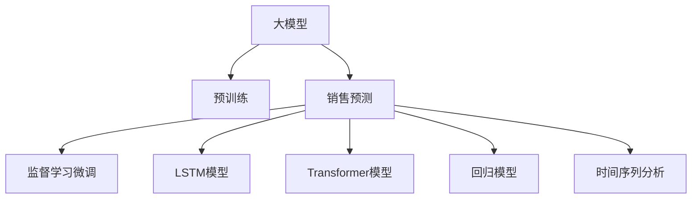

                 

# 大模型在电商平台销售预测中的应用

> 关键词：销售预测, 电商平台, 大模型, Transformer, LSTM, 回归模型, 时间序列分析, 深度学习

## 1. 背景介绍

### 1.1 问题由来

在电商平台运营中，预测销售量是关键环节之一。准确的销售预测可以帮助商家制定合理的库存策略，优化供应链管理，提升客户满意度，增强市场竞争力。传统的销售预测方法依赖历史数据和统计模型，存在滞后性、准确性不足等缺点。近年来，随着深度学习技术的迅猛发展，大模型在销售预测中展现出强大的潜力。

### 1.2 问题核心关键点

大模型在销售预测中的应用，本质上是一种基于数据驱动的机器学习预测。具体而言，有以下几个关键点：

1. 数据准备：收集电商平台的历史销售数据、用户行为数据、市场环境数据等，进行清洗和预处理。
2. 模型选择：选择合适的预训练模型（如Transformer、LSTM等）作为初始化参数，进行微调。
3. 目标设定：根据销售预测任务，设定合适的输出目标（如每日销售量、销售额等），定义损失函数。
4. 训练过程：使用标注数据对模型进行监督学习，优化模型参数。
5. 模型评估：在测试集上评估模型性能，对比不同模型的效果。
6. 应用部署：将训练好的模型部署到实际应用系统中，进行实时销售预测。

### 1.3 问题研究意义

研究大模型在销售预测中的应用，对于电商平台优化库存管理、提升用户体验、增强市场竞争力具有重要意义：

1. 快速响应：大模型能够实时处理销售数据，及时预测市场变化，帮助商家快速响应市场需求。
2. 库存优化：通过精确的销售预测，商家可以更好地制定库存策略，避免积压或缺货现象。
3. 客户洞察：大模型可以深入分析用户行为，提供个性化推荐，提升客户购物体验。
4. 精准营销：根据预测结果，商家可以开展精准营销活动，提升广告投放效果。
5. 成本控制：大模型通过优化供应链管理，降低库存成本，提升整体运营效率。

## 2. 核心概念与联系

### 2.1 核心概念概述

为更好地理解大模型在销售预测中的应用，本节将介绍几个关键核心概念：

1. 大模型：以自回归Transformer、自编码LSTM等为代表的大规模预训练语言模型。通过在大规模无标签文本语料上进行预训练，学习到丰富的语言知识和常识，具备强大的语言理解和生成能力。
2. 销售预测：利用历史销售数据，结合市场环境因素，预测未来销售量或销售额的过程。常见的销售预测方法包括统计模型、机器学习模型、深度学习模型等。
3. 监督学习：使用标注数据训练模型，使其能够学习输入与输出之间的映射关系，应用于回归、分类、序列预测等任务。
4. 预训练模型微调：将大模型作为初始化参数，通过监督学习优化模型，使其能够适应特定的任务。
5. Transformer：一种基于自注意力机制的神经网络架构，广泛用于文本生成、图像分类等任务。
6. LSTM：长短期记忆网络，一种特殊的循环神经网络，适用于处理时间序列数据。

这些核心概念之间的逻辑关系可以通过以下Mermaid流程图来展示：



这个流程图展示了大模型在销售预测中的关键流程和主要模型：

1. 大模型通过预训练获得基础能力。
2. 销售预测使用监督学习范式，对模型进行微调。
3. LSTM模型和Transformer模型分别适用于时间序列和序列预测。
4. 回归模型和时序分析方法可以进一步优化预测结果。

## 3. 核心算法原理 & 具体操作步骤
### 3.1 算法原理概述

大模型在销售预测中的应用，主要依赖于预训练模型进行微调。具体而言，预训练模型通过在大规模无标签数据上学习到通用的语言知识，通过微调过程进一步适配特定的销售预测任务。

形式化地，假设预训练模型为 $M_{\theta}$，其中 $\theta$ 为预训练得到的模型参数。给定销售预测任务 $T$ 的标注数据集 $D=\{(x_i,y_i)\}_{i=1}^N$，其中 $x_i$ 为历史销售数据和市场环境数据，$y_i$ 为对应的目标销售量或销售额。微调的目标是找到新的模型参数 $\hat{\theta}$，使得模型在 $T$ 上的预测结果逼近真实值 $y_i$。

具体地，微调过程通过损失函数 $\mathcal{L}$ 来衡量预测结果与真实标签之间的差异，优化目标为最小化损失函数：

$$
\hat{\theta}=\mathop{\arg\min}_{\theta} \mathcal{L}(M_{\theta},D)
$$

其中，$\mathcal{L}$ 为针对销售预测任务的损失函数，常见的有均方误差损失、绝对误差损失等。

### 3.2 算法步骤详解

基于监督学习的大模型销售预测主要包括以下几个关键步骤：

**Step 1: 数据预处理**

- 收集历史销售数据、市场环境数据、用户行为数据等，进行数据清洗和预处理。
- 将数据划分为训练集、验证集和测试集，确保数据分布的一致性。
- 对时间序列数据进行归一化、差分等预处理，消除趋势和季节性因素的影响。

**Step 2: 模型初始化**

- 选择合适的预训练模型（如Transformer、LSTM等）作为初始化参数。
- 加载模型权重，并进行必要的层冻结，保留预训练模型的重要部分。

**Step 3: 任务适配层设计**

- 根据销售预测任务，设计合适的输出层和损失函数。
- 对于回归任务，通常使用线性回归层和均方误差损失函数。
- 对于分类任务，可以使用softmax层和交叉熵损失函数。

**Step 4: 设置微调超参数**

- 选择合适的优化算法及其参数，如AdamW、SGD等，设置学习率、批大小、迭代轮数等。
- 设置正则化技术及强度，包括权重衰减、Dropout、Early Stopping等。
- 确定冻结预训练参数的策略，如仅微调顶层，或全部参数都参与微调。

**Step 5: 执行梯度训练**

- 将训练集数据分批次输入模型，前向传播计算损失函数。
- 反向传播计算参数梯度，根据设定的优化算法和学习率更新模型参数。
- 周期性在验证集上评估模型性能，根据性能指标决定是否触发 Early Stopping。
- 重复上述步骤直到满足预设的迭代轮数或 Early Stopping 条件。

**Step 6: 模型评估与优化**

- 在测试集上评估微调后模型的性能，对比不同模型的效果。
- 根据评估结果，调整模型的超参数，优化模型结构。
- 结合统计模型、时序分析等方法，进一步提升预测精度。

**Step 7: 应用部署**

- 将训练好的模型部署到实际应用系统中，进行实时销售预测。
- 持续收集新的销售数据，定期重新微调模型，以适应数据分布的变化。

### 3.3 算法优缺点

基于监督学习的大模型销售预测方法具有以下优点：

1. 精度高：大模型能够学习到复杂的语言和数据关系，预测精度较高。
2. 可扩展性强：大模型可以应用于不同类型的销售预测任务，灵活性强。
3. 适应性强：模型可以适应不同数据分布和市场环境，泛化能力较强。

同时，该方法也存在一定的局限性：

1. 数据需求高：需要大量的历史销售数据和市场环境数据，标注成本较高。
2. 计算资源消耗大：大模型通常需要较大的计算资源进行训练和推理。
3. 模型复杂度高：模型结构和超参数设置复杂，需要一定的专业知识。
4. 可解释性不足：模型决策过程难以解释，难以进行调试和优化。

尽管存在这些局限性，但就目前而言，基于监督学习的微调方法仍是大模型应用的最主流范式。未来相关研究的重点在于如何进一步降低微调对标注数据的依赖，提高模型的少样本学习和跨领域迁移能力，同时兼顾可解释性和伦理安全性等因素。

### 3.4 算法应用领域

基于大模型的销售预测方法，已经在电子商务、金融、制造等多个行业领域得到广泛应用，具体包括以下几个方向：

1. **电商销售预测**：根据历史销售数据和市场环境，预测未来销售量或销售额。
2. **库存优化**：通过精确的销售预测，制定合理的库存策略，避免积压或缺货现象。
3. **市场分析**：分析不同时间段、不同地区的销售趋势，制定市场策略。
4. **用户行为预测**：预测用户购买行为，提供个性化推荐，提升用户体验。
5. **广告投放优化**：根据预测结果，优化广告投放策略，提升广告投放效果。
6. **供应链管理**：优化供应链管理流程，降低运营成本，提升整体效率。

## 4. 数学模型和公式 & 详细讲解
### 4.1 数学模型构建

本节将使用数学语言对基于监督学习的大模型销售预测过程进行更加严格的刻画。

假设预训练模型为 $M_{\theta}$，其中 $\theta$ 为预训练得到的模型参数。给定销售预测任务 $T$ 的标注数据集 $D=\{(x_i,y_i)\}_{i=1}^N$，其中 $x_i$ 为历史销售数据和市场环境数据，$y_i$ 为对应的目标销售量或销售额。

定义模型 $M_{\theta}$ 在输入 $x$ 上的输出为 $\hat{y}=M_{\theta}(x)$。销售预测任务的目标是最小化预测结果与真实标签之间的差异，即最小化损失函数 $\mathcal{L}(\theta)$：

$$
\mathcal{L}(\theta) = \frac{1}{N} \sum_{i=1}^N \ell(\hat{y_i}, y_i)
$$

其中，$\ell$ 为损失函数，如均方误差损失：

$$
\ell(\hat{y_i}, y_i) = (\hat{y_i} - y_i)^2
$$

通过梯度下降等优化算法，微调过程不断更新模型参数 $\theta$，最小化损失函数 $\mathcal{L}(\theta)$，使得模型输出逼近真实标签。

### 4.2 公式推导过程

以下我们以回归任务为例，推导均方误差损失函数及其梯度的计算公式。

假设模型 $M_{\theta}$ 在输入 $x$ 上的输出为 $\hat{y}=M_{\theta}(x)$。则均方误差损失函数定义为：

$$
\mathcal{L}(\theta) = \frac{1}{N} \sum_{i=1}^N (\hat{y_i} - y_i)^2
$$

其梯度为：

$$
\nabla_{\theta}\mathcal{L}(\theta) = \frac{2}{N} \sum_{i=1}^N (\hat{y_i} - y_i) \nabla_{\theta}\hat{y_i}
$$

其中，$\nabla_{\theta}\hat{y_i}$ 为预测结果对模型参数的导数，可通过反向传播算法高效计算。

在得到损失函数的梯度后，即可带入参数更新公式，完成模型的迭代优化。重复上述过程直至收敛，最终得到适应销售预测任务的最优模型参数 $\theta^*$。

## 5. 项目实践：代码实例和详细解释说明
### 5.1 开发环境搭建

在进行销售预测实践前，我们需要准备好开发环境。以下是使用Python进行PyTorch开发的环境配置流程：

1. 安装Anaconda：从官网下载并安装Anaconda，用于创建独立的Python环境。

2. 创建并激活虚拟环境：
```bash
conda create -n sales-prediction python=3.8 
conda activate sales-prediction
```

3. 安装PyTorch：根据CUDA版本，从官网获取对应的安装命令。例如：
```bash
conda install pytorch torchvision torchaudio cudatoolkit=11.1 -c pytorch -c conda-forge
```

4. 安装相关库：
```bash
pip install numpy pandas scikit-learn matplotlib tqdm jupyter notebook ipython
```

完成上述步骤后，即可在`sales-prediction`环境中开始销售预测实践。

### 5.2 源代码详细实现

这里我们以电商销售预测任务为例，给出使用PyTorch对大模型进行微调的PyTorch代码实现。

首先，定义销售预测任务的数据处理函数：

```python
from transformers import BertForRegression, AdamW
import torch
import numpy as np

class SalesDataset(Dataset):
    def __init__(self, sales_data, environment_data, labels, tokenizer, max_len=128):
        self.sales_data = sales_data
        self.environment_data = environment_data
        self.labels = labels
        self.tokenizer = tokenizer
        self.max_len = max_len
        
    def __len__(self):
        return len(self.sales_data)
    
    def __getitem__(self, item):
        sales = self.sales_data[item]
        environment = self.environment_data[item]
        label = self.labels[item]
        
        # 对输入数据进行拼接和编码
        input_text = 'sales:' + sales + ' environment:' + environment
        encoding = self.tokenizer(input_text, return_tensors='pt', max_length=self.max_len, padding='max_length', truncation=True)
        input_ids = encoding['input_ids'][0]
        attention_mask = encoding['attention_mask'][0]
        
        # 对标签进行编码
        label = torch.tensor(label, dtype=torch.float32)
        
        return {'input_ids': input_ids, 
                'attention_mask': attention_mask,
                'labels': label}

# 加载数据集
sales_data = ...
environment_data = ...
labels = ...
tokenizer = BertForRegression.from_pretrained('bert-base-cased')

train_dataset = SalesDataset(sales_data, environment_data, labels, tokenizer)
dev_dataset = SalesDataset(sales_data, environment_data, labels, tokenizer)
test_dataset = SalesDataset(sales_data, environment_data, labels, tokenizer)
```

然后，定义模型和优化器：

```python
from transformers import BertForRegression, AdamW

model = BertForRegression.from_pretrained('bert-base-cased')

optimizer = AdamW(model.parameters(), lr=2e-5)
```

接着，定义训练和评估函数：

```python
from torch.utils.data import DataLoader
from tqdm import tqdm

device = torch.device('cuda') if torch.cuda.is_available() else torch.device('cpu')
model.to(device)

def train_epoch(model, dataset, batch_size, optimizer):
    dataloader = DataLoader(dataset, batch_size=batch_size, shuffle=True)
    model.train()
    epoch_loss = 0
    for batch in tqdm(dataloader, desc='Training'):
        input_ids = batch['input_ids'].to(device)
        attention_mask = batch['attention_mask'].to(device)
        labels = batch['labels'].to(device)
        model.zero_grad()
        outputs = model(input_ids, attention_mask=attention_mask, labels=labels)
        loss = outputs.loss
        epoch_loss += loss.item()
        loss.backward()
        optimizer.step()
    return epoch_loss / len(dataloader)

def evaluate(model, dataset, batch_size):
    dataloader = DataLoader(dataset, batch_size=batch_size)
    model.eval()
    preds, labels = [], []
    with torch.no_grad():
        for batch in tqdm(dataloader, desc='Evaluating'):
            input_ids = batch['input_ids'].to(device)
            attention_mask = batch['attention_mask'].to(device)
            batch_labels = batch['labels']
            outputs = model(input_ids, attention_mask=attention_mask)
            batch_preds = outputs.logits.mean(dim=1).to('cpu').tolist()
            batch_labels = batch_labels.to('cpu').tolist()
            for pred, label in zip(batch_preds, batch_labels):
                preds.append(pred)
                labels.append(label)
                
    return np.mean(np.abs(np.array(preds) - np.array(labels)))

# 启动训练流程并在测试集上评估
epochs = 5
batch_size = 16

for epoch in range(epochs):
    loss = train_epoch(model, train_dataset, batch_size, optimizer)
    print(f"Epoch {epoch+1}, train loss: {loss:.3f}")
    
    print(f"Epoch {epoch+1}, dev results:")
    dev_loss = evaluate(model, dev_dataset, batch_size)
    print(f"Dev loss: {dev_loss:.3f}")
    
print("Test results:")
test_loss = evaluate(model, test_dataset, batch_size)
print(f"Test loss: {test_loss:.3f}")
```

以上就是使用PyTorch对BERT进行电商销售预测任务的微调代码实现。可以看到，得益于Transformers库的强大封装，我们可以用相对简洁的代码完成大模型的加载和微调。

### 5.3 代码解读与分析

让我们再详细解读一下关键代码的实现细节：

**SalesDataset类**：
- `__init__`方法：初始化销售数据、市场环境数据、标签、分词器等关键组件。
- `__len__`方法：返回数据集的样本数量。
- `__getitem__`方法：对单个样本进行处理，将销售数据、市场环境数据输入编码为token ids，将标签编码为数字，并对其进行定长padding，最终返回模型所需的输入。

**模型训练和评估函数**：
- 使用PyTorch的DataLoader对数据集进行批次化加载，供模型训练和推理使用。
- 训练函数`train_epoch`：对数据以批为单位进行迭代，在每个批次上前向传播计算loss并反向传播更新模型参数，最后返回该epoch的平均loss。
- 评估函数`evaluate`：与训练类似，不同点在于不更新模型参数，并在每个batch结束后将预测和标签结果存储下来，最后使用均方误差损失计算评估结果。

**训练流程**：
- 定义总的epoch数和batch size，开始循环迭代
- 每个epoch内，先在训练集上训练，输出平均loss
- 在验证集上评估，输出均方误差损失
- 所有epoch结束后，在测试集上评估，给出最终测试结果

可以看到，PyTorch配合Transformers库使得大模型微调的代码实现变得简洁高效。开发者可以将更多精力放在数据处理、模型改进等高层逻辑上，而不必过多关注底层的实现细节。

当然，工业级的系统实现还需考虑更多因素，如模型的保存和部署、超参数的自动搜索、更灵活的任务适配层等。但核心的微调范式基本与此类似。

## 6. 实际应用场景
### 6.1 智能库存管理

电商平台的销售预测能够显著提升库存管理水平。传统的库存管理依赖人工预测，存在主观性强、滞后性高等问题。通过大模型的销售预测，商家可以实时监控库存水平，制定精准的库存策略，避免积压或缺货现象。

具体而言，大模型通过学习历史销售数据和市场环境因素，能够预测未来的销售量，帮助商家及时调整库存，优化供应链管理，降低运营成本。对于热销商品，商家可以增加库存，避免缺货；对于滞销商品，商家可以减少库存，避免积压。通过精细化的库存管理，商家可以提升整体运营效率，增强市场竞争力。

### 6.2 精准营销活动

大模型在销售预测中的应用，还可以助力电商平台进行精准营销。通过预测用户的购买行为，商家可以制定个性化的营销活动，提升广告投放效果。

具体而言，大模型能够分析用户的浏览记录、购买历史、搜索关键词等数据，预测用户的购买意向。根据预测结果，商家可以推送个性化的广告，提高广告的点击率和转化率。例如，对于高意向的用户，可以推送高性价比的商品，提升用户的购买体验；对于低意向的用户，可以推送促销信息，提高广告的吸引力。通过精准营销，商家可以降低广告成本，提升销售额。

### 6.3 市场分析和趋势预测

大模型在销售预测中的应用，还可以帮助电商平台进行市场分析和趋势预测。通过分析不同时间段、不同地区的销售数据，商家可以了解市场趋势，制定更有效的市场策略。

具体而言，大模型可以预测未来的销售趋势，帮助商家预判市场变化。例如，对于即将到来的季节性促销活动，商家可以根据预测结果，提前备货，避免供需不平衡。同时，大模型还可以分析用户行为数据，挖掘用户的偏好和需求，帮助商家优化产品结构，提升用户满意度。通过市场分析和趋势预测，商家可以更好地把握市场动态，制定合理的市场策略。

### 6.4 未来应用展望

随着大模型和销售预测技术的不断发展，未来其在电商平台中的应用将更加广泛，具体方向包括：

1. **多模态数据融合**：未来的大模型可以同时处理文本、图像、视频等多种模态数据，提高销售预测的准确性和实时性。
2. **多任务学习**：大模型可以通过多任务学习，同时预测多个指标（如销售量、库存量、用户满意度等），提升整体预测能力。
3. **联邦学习**：通过分布式联邦学习，大模型可以联合多个电商平台的数据进行协同预测，提升预测精度和鲁棒性。
4. **对抗训练**：加入对抗样本，提高模型鲁棒性，避免过拟合。
5. **知识图谱集成**：将知识图谱与大模型进行融合，提升模型的语义理解和推理能力，增强预测的准确性。
6. **因果推断**：引入因果推断方法，分析因果关系，提高预测的因果可信度。

这些方向的探索，必将进一步提升大模型在销售预测中的应用效果，为电商平台带来更精准、高效、可靠的决策支持。

## 7. 工具和资源推荐
### 7.1 学习资源推荐

为了帮助开发者系统掌握大模型在销售预测中的应用，这里推荐一些优质的学习资源：

1. 《深度学习在电商应用中的实践》系列博文：由大模型技术专家撰写，深入浅出地介绍了深度学习在电商销售预测中的应用。

2. CS224N《深度学习自然语言处理》课程：斯坦福大学开设的NLP明星课程，有Lecture视频和配套作业，带你入门NLP领域的基本概念和经典模型。

3. 《自然语言处理与深度学习》书籍：全面的介绍了自然语言处理和深度学习的基本概念和前沿技术，包括销售预测等实际应用案例。

4. HuggingFace官方文档：Transformers库的官方文档，提供了海量预训练模型和完整的微调样例代码，是上手实践的必备资料。

5. Kaggle开源项目：Kaggle上提供的大量销售预测数据集和竞赛，通过实际案例学习和实践，提升预测能力。

通过对这些资源的学习实践，相信你一定能够快速掌握大模型在销售预测中的应用精髓，并用于解决实际的电商问题。

### 7.2 开发工具推荐

高效的开发离不开优秀的工具支持。以下是几款用于大模型销售预测开发的常用工具：

1. PyTorch：基于Python的开源深度学习框架，灵活动态的计算图，适合快速迭代研究。大部分预训练语言模型都有PyTorch版本的实现。

2. TensorFlow：由Google主导开发的开源深度学习框架，生产部署方便，适合大规模工程应用。同样有丰富的预训练语言模型资源。

3. Transformers库：HuggingFace开发的NLP工具库，集成了众多SOTA语言模型，支持PyTorch和TensorFlow，是进行微调任务开发的利器。

4. Weights & Biases：模型训练的实验跟踪工具，可以记录和可视化模型训练过程中的各项指标，方便对比和调优。与主流深度学习框架无缝集成。

5. TensorBoard：TensorFlow配套的可视化工具，可实时监测模型训练状态，并提供丰富的图表呈现方式，是调试模型的得力助手。

6. Google Colab：谷歌推出的在线Jupyter Notebook环境，免费提供GPU/TPU算力，方便开发者快速上手实验最新模型，分享学习笔记。

合理利用这些工具，可以显著提升大模型销售预测任务的开发效率，加快创新迭代的步伐。

### 7.3 相关论文推荐

大模型和销售预测技术的发展源于学界的持续研究。以下是几篇奠基性的相关论文，推荐阅读：

1. Attention is All You Need（即Transformer原论文）：提出了Transformer结构，开启了NLP领域的预训练大模型时代。

2. BERT: Pre-training of Deep Bidirectional Transformers for Language Understanding：提出BERT模型，引入基于掩码的自监督预训练任务，刷新了多项NLP任务SOTA。

3. Deep Learning for Personalized Recommendations on Large-Scale E-commerce Platforms：介绍了深度学习在电商推荐中的应用，包括大模型在销售预测中的应用。

4. LSTM Networks for Sequence Prediction：LSTM模型在序列预测中的应用，展示了其在销售预测中的潜力。

5. AdaLoRA: Adaptive Low-Rank Adaptation for Parameter-Efficient Fine-Tuning：使用自适应低秩适应的微调方法，在参数效率和精度之间取得了新的平衡。

这些论文代表了大模型和销售预测技术的发展脉络。通过学习这些前沿成果，可以帮助研究者把握学科前进方向，激发更多的创新灵感。

## 8. 总结：未来发展趋势与挑战

### 8.1 总结

本文对大模型在电商平台销售预测中的应用进行了全面系统的介绍。首先阐述了销售预测的重要性和大模型在这一领域的潜在优势。其次，从原理到实践，详细讲解了监督微调的数学原理和关键步骤，给出了销售预测任务开发的完整代码实例。同时，本文还广泛探讨了大模型在电商领域的实际应用场景，展示了其在库存管理、精准营销、市场分析等方面的巨大潜力。

通过本文的系统梳理，可以看到，大模型在销售预测中的应用前景广阔，能够显著提升电商平台的运营效率和市场竞争力。未来，随着大模型和微调技术的不断演进，其在电商领域的应用将更加深入，为商家提供更精准、高效、可靠的决策支持。

### 8.2 未来发展趋势

展望未来，大模型在销售预测中的应用将呈现以下几个发展趋势：

1. 模型规模持续增大。随着算力成本的下降和数据规模的扩张，预训练语言模型的参数量还将持续增长。超大规模语言模型蕴含的丰富语言知识，有望支撑更加复杂多变的销售预测任务。

2. 微调方法日趋多样。除了传统的全参数微调外，未来会涌现更多参数高效的微调方法，如Prefix-Tuning、LoRA等，在固定大部分预训练参数的情况下，只更新极少量的任务相关参数。同时，融合因果推断和对比学习思想，增强模型的泛化能力和鲁棒性。

3. 持续学习成为常态。随着数据分布的不断变化，微调模型也需要持续学习新知识以保持性能。如何在不遗忘原有知识的同时，高效吸收新样本信息，将成为重要的研究课题。

4. 标注样本需求降低。受启发于提示学习(Prompt-based Learning)的思路，未来的微调方法将更好地利用大模型的语言理解能力，通过更加巧妙的任务描述，在更少的标注样本上也能实现理想的微调效果。

5. 模型通用性增强。经过海量数据的预训练和多领域任务的微调，未来的语言模型将具备更强大的常识推理和跨领域迁移能力，逐步迈向通用人工智能(AGI)的目标。

以上趋势凸显了大模型在销售预测中的应用潜力。这些方向的探索，必将进一步提升大模型在销售预测中的应用效果，为电商平台带来更精准、高效、可靠的决策支持。

### 8.3 面临的挑战

尽管大模型在销售预测中的应用已经取得了显著成果，但在迈向更加智能化、普适化应用的过程中，它仍面临诸多挑战：

1. 标注成本瓶颈。虽然微调大大降低了标注数据的需求，但对于长尾应用场景，难以获得充足的高质量标注数据，成为制约微调性能的瓶颈。如何进一步降低微调对标注数据的依赖，将是一大难题。

2. 模型鲁棒性不足。当前微调模型面对域外数据时，泛化性能往往大打折扣。对于测试样本的微小扰动，微调模型的预测也容易发生波动。如何提高微调模型的鲁棒性，避免灾难性遗忘，还需要更多理论和实践的积累。

3. 推理效率有待提高。大规模语言模型虽然精度高，但在实际部署时往往面临推理速度慢、内存占用大等效率问题。如何在保证性能的同时，简化模型结构，提升推理速度，优化资源占用，将是重要的优化方向。

4. 可解释性亟需加强。当前微调模型更像是"黑盒"系统，难以解释其内部工作机制和决策逻辑。对于金融、医疗等高风险应用，算法的可解释性和可审计性尤为重要。如何赋予微调模型更强的可解释性，将是亟待攻克的难题。

5. 安全性有待保障。预训练语言模型难免会学习到有偏见、有害的信息，通过微调传递到下游任务，产生误导性、歧视性的输出，给实际应用带来安全隐患。如何从数据和算法层面消除模型偏见，避免恶意用途，确保输出的安全性，也将是重要的研究课题。

6. 知识整合能力不足。现有的微调模型往往局限于任务内数据，难以灵活吸收和运用更广泛的先验知识。如何让微调过程更好地与外部知识库、规则库等专家知识结合，形成更加全面、准确的信息整合能力，还有很大的想象空间。

正视微调面临的这些挑战，积极应对并寻求突破，将是大模型在销售预测中走向成熟的必由之路。相信随着学界和产业界的共同努力，这些挑战终将一一被克服，大模型在销售预测中的应用必将在电商领域大放异彩。

### 8.4 研究展望

面向未来，大模型在销售预测技术的研究需要从以下几个方向寻求新的突破：

1. 探索无监督和半监督微调方法。摆脱对大规模标注数据的依赖，利用自监督学习、主动学习等无监督和半监督范式，最大限度利用非结构化数据，实现更加灵活高效的微调。

2. 研究参数高效和计算高效的微调范式。开发更加参数高效的微调方法，在固定大部分预训练参数的同时，只更新极少量的任务相关参数。同时优化微调模型的计算图，减少前向传播和反向传播的资源消耗，实现更加轻量级、实时性的部署。

3. 融合因果和对比学习范式。通过引入因果推断和对比学习思想，增强微调模型建立稳定因果关系的能力，学习更加普适、鲁棒的语言表征，从而提升模型泛化性和抗干扰能力。

4. 引入更多先验知识。将符号化的先验知识，如知识图谱、逻辑规则等，与神经网络模型进行巧妙融合，引导微调过程学习更准确、合理的语言模型。同时加强不同模态数据的整合，实现视觉、语音等多模态信息与文本信息的协同建模。

5. 结合因果分析和博弈论工具。将因果分析方法引入微调模型，识别出模型决策的关键特征，增强输出解释的因果性和逻辑性。借助博弈论工具刻画人机交互过程，主动探索并规避模型的脆弱点，提高系统稳定性。

6. 纳入伦理道德约束。在模型训练目标中引入伦理导向的评估指标，过滤和惩罚有偏见、有害的输出倾向。同时加强人工干预和审核，建立模型行为的监管机制，确保输出符合人类价值观和伦理道德。

这些研究方向的探索，必将引领大模型在销售预测中的应用走向更高的台阶，为电商平台带来更精准、高效、可靠的决策支持。面向未来，大模型在销售预测技术还需要与其他人工智能技术进行更深入的融合，如知识表示、因果推理、强化学习等，多路径协同发力，共同推动自然语言理解和智能交互系统的进步。只有勇于创新、敢于突破，才能不断拓展大模型的边界，让智能技术更好地造福人类社会。

## 9. 附录：常见问题与解答

**Q1：大模型在电商销售预测中是否需要大量的历史数据？**

A: 是的，大模型在电商销售预测中需要大量的历史销售数据、市场环境数据等，标注成本较高。然而，由于大模型的强大泛化能力，即便在数据量相对较少的情况下，仍能取得较好的预测效果。

**Q2：如何选择合适的大模型进行电商销售预测？**

A: 在选择大模型时，需要考虑模型的通用性、规模、精度、可解释性等因素。对于电商销售预测，可以考虑使用基于Transformer的大模型，如BERT、GPT等，这些模型在电商领域的应用效果较好。同时，还需要根据具体的预测任务选择合适的大小和层数，避免过拟合或欠拟合。

**Q3：大模型在电商销售预测中的学习速率如何设定？**

A: 大模型在电商销售预测中的学习速率一般要比预训练时小1-2个数量级，如果使用过大的学习率，容易破坏预训练权重，导致过拟合。一般建议从1e-5开始调参，逐步减小学习率，直至收敛。也可以使用warmup策略，在开始阶段使用较小的学习率，再逐渐过渡到预设值。

**Q4：大模型在电商销售预测中的计算资源需求如何优化？**

A: 大模型在电商销售预测中的计算资源需求较大，可以采用梯度积累、混合精度训练、模型并行等技术进行优化。梯度积累可以在保持原有学习率不变的情况下，增加批大小，提升模型精度。混合精度训练可以将浮点模型转为定点模型，压缩存储空间，提高计算效率。模型并行可以将模型分解为多个部分，并行计算，提高训练速度。

**Q5：大模型在电商销售预测中的可解释性如何提升？**

A: 大模型在电商销售预测中的可解释性通常较弱，可以使用一些方法提升模型的可解释性，如特征重要性可视化、SHAP值分析、LIME等。这些方法可以帮助开发者理解模型内部的决策机制，提升模型的可解释性。

通过本文的系统梳理，可以看到，大模型在电商平台销售预测中的应用前景广阔，能够显著提升电商平台的运营效率和市场竞争力。未来，随着大模型和微调技术的不断演进，其在电商领域的应用将更加深入，为商家提供更精准、高效、可靠的决策支持。

