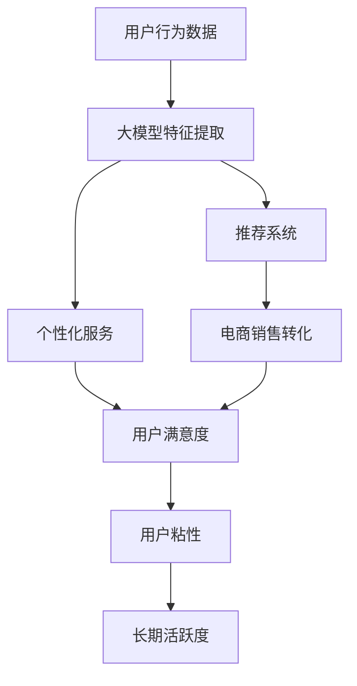

                 

# 大模型如何提升电商平台的用户粘性与长期活跃度

## 1. 背景介绍

随着电商平台的激烈竞争，提升用户粘性和长期活跃度成为了电商业务的重要目标。一方面，增加用户粘性有助于提升转化率，降低获客成本。另一方面，保持长期活跃度则有助于积累用户行为数据，提升推荐系统的精准度，进一步增强用户粘性，形成良性循环。传统电商平台的推荐算法和个性化服务已经较为成熟，但如何更有效地利用用户行为数据进行深度分析，挖掘用户的潜在需求，引导其完成更多消费行为，仍是电商业务的一大挑战。近年来，大模型在电商推荐、智能客服、广告投放等电商场景中逐步应用，并展现出了不俗的效果。本文章将探讨如何利用大模型技术，提升电商平台的用户粘性和长期活跃度。

## 2. 核心概念与联系

### 2.1 核心概念概述

为了更好地理解大模型在电商平台中的应用，我们首先需要了解几个核心概念：

- **大模型(Large Model)**：指通过大规模数据集训练得到的深度学习模型，通常参数量在数十亿以上，具备强大的数据处理能力和泛化能力。
- **电商平台推荐系统(Recommendation System)**：基于用户行为数据，为用户推荐商品或服务的系统。传统的推荐系统包括基于协同过滤、内容推荐等方法，但随着数据量的增加，这些方法逐渐难以满足需求。
- **个性化服务(Personalized Service)**：根据用户行为数据和历史交易记录，为用户提供定制化的推荐、广告、客服等服务的系统。个性化服务可以有效提升用户满意度，增强用户粘性。
- **用户行为数据(Usage Data)**：用户在电商平台上的所有操作记录，包括浏览、点击、购买、收藏、评论等。这些数据是电商平台提供个性化服务、推荐商品、优化广告投放的基础。
- **用户粘性(User Retention)**：用户在一段时间内对电商平台的持续关注和互动程度，是衡量电商平台健康度的重要指标。

这些概念之间存在密切的联系。通过大模型对用户行为数据进行深度学习和特征提取，可以挖掘用户潜在需求，优化推荐系统和个性化服务，从而提升用户粘性和长期活跃度。

### 2.2 核心概念原理和架构的 Mermaid 流程图



通过这张图，我们可以清晰地看到大模型在电商平台中的应用路径：利用用户行为数据，通过大模型提取特征，优化推荐系统和个性化服务，最终提升电商销售转化和用户满意度，增强用户粘性和长期活跃度。

## 3. 核心算法原理 & 具体操作步骤

### 3.1 算法原理概述

利用大模型提升电商平台的用户粘性和长期活跃度，主要通过以下两个步骤：

1. **用户行为数据预处理**：对用户的浏览、点击、购买等行为数据进行清洗、去重、标准化处理，形成用于大模型训练的数据集。

2. **大模型特征提取与优化推荐系统**：通过大模型对处理后的数据进行特征提取，优化推荐系统，实现更精准、个性化的推荐，从而提升用户粘性和长期活跃度。

### 3.2 算法步骤详解

#### 3.2.1 数据预处理

数据预处理是电商大模型应用的关键步骤，主要包括以下几个环节：

1. **数据收集与存储**：收集用户在电商平台上所有的操作记录，包括浏览、点击、购买、收藏、评论等，存储到数据库或数据湖中。

2. **数据清洗与去重**：对数据进行去重、去噪、过滤等操作，去除重复和不完整的记录，保证数据质量。

3. **数据标准化与归一化**：对不同的数据类型进行标准化和归一化处理，使数据符合大模型训练的要求。例如，将文本数据转化为向量表示，将数值数据归一化到[0,1]区间。

4. **特征工程**：根据业务需求，设计关键特征并进行工程化处理，如构建用户画像、行为序列、商品特征等。

5. **分词与向量化**：对文本数据进行分词，并将分词结果转化为词向量表示，方便大模型进行学习和处理。

#### 3.2.2 大模型特征提取

大模型特征提取主要包括以下几个环节：

1. **模型选择与预训练**：选择合适的预训练大模型，如BERT、GPT-3、RoBERTa等，并对其进行预训练，使其具备强大的数据处理和泛化能力。

2. **模型微调与优化**：在大模型预训练的基础上，进行微调，使其针对电商平台的具体业务需求进行优化。例如，在电商推荐场景中，可以微调BERT模型，使其能够更好地提取用户和商品特征，进行精准推荐。

3. **特征映射与融合**：将大模型的输出结果进行特征映射和融合，提取关键特征，用于优化推荐系统和个性化服务。

4. **实时特征更新**：随着用户行为数据的不断增加，实时更新大模型特征，保证推荐系统的准确性和及时性。

#### 3.2.3 优化推荐系统

通过大模型特征提取，优化推荐系统主要包括以下几个环节：

1. **推荐算法选择**：选择合适的推荐算法，如基于内容的推荐、协同过滤推荐、深度推荐等，根据业务需求进行选择。

2. **推荐模型训练**：基于大模型提取的特征，训练推荐模型，使其能够更好地匹配用户需求和商品特性，提升推荐效果。

3. **推荐系统集成与部署**：将训练好的推荐模型集成到电商平台的推荐引擎中，部署到生产环境中，实时提供个性化推荐服务。

4. **A/B测试与效果评估**：通过A/B测试等方法，评估推荐系统的效果，不断优化和迭代。

### 3.3 算法优缺点

利用大模型提升电商平台的用户粘性和长期活跃度，具有以下优点：

1. **数据利用率高**：大模型能够高效地处理和利用电商平台的海量用户行为数据，挖掘用户潜在需求，提升推荐系统的精准度。

2. **个性化服务能力强**：大模型能够根据用户行为数据，提供个性化的推荐、广告、客服等服务，提升用户满意度和粘性。

3. **实时性高**：大模型特征提取和推荐系统优化具有高实时性，能够及时响应用户需求，提供实时推荐服务。

4. **算法简单**：大模型基于深度学习，算法简单，易于部署和优化。

然而，大模型在电商平台中的应用也存在一些缺点：

1. **计算资源消耗大**：大模型参数量庞大，训练和推理消耗的计算资源较多，需要高性能的计算设备和算力支持。

2. **数据隐私问题**：电商平台涉及大量用户隐私数据，如何保护数据隐私和合规性，是应用大模型的重要挑战。

3. **模型解释性差**：大模型的决策过程复杂，缺乏可解释性，难以对其推理逻辑进行分析和调试。

4. **成本高**：大模型应用需要投入大量研发和运营成本，包括数据采集、模型训练、系统集成等。

### 3.4 算法应用领域

大模型在电商平台中的应用主要包括以下几个领域：

1. **推荐系统**：利用大模型优化推荐算法，提升推荐系统的精准度和个性化能力，增强用户粘性和长期活跃度。

2. **智能客服**：利用大模型进行智能对话和问题解答，提升客户服务效率和满意度，增强用户粘性。

3. **广告投放**：利用大模型分析用户行为数据，优化广告投放策略，提升广告效果和用户转化率。

4. **商品搜索**：利用大模型进行商品搜索排序和相关推荐，提升搜索体验和转化率。

5. **库存管理**：利用大模型分析用户需求和库存数据，优化库存管理策略，减少库存积压和缺货情况。

## 4. 数学模型和公式 & 详细讲解 & 举例说明

### 4.1 数学模型构建

在电商平台中，大模型的应用主要通过以下数学模型进行建模：

1. **用户行为数据矩阵**：将用户行为数据转化为矩阵形式，表示为$X \in \mathbb{R}^{n \times d}$，其中$n$为用户数，$d$为特征维度。

2. **用户-商品矩阵**：将用户行为数据中的购买行为转化为矩阵形式，表示为$Y \in \mathbb{R}^{n \times m}$，其中$m$为商品数。

3. **大模型特征提取模型**：利用大模型对用户行为数据进行特征提取，输出特征向量表示为$Z \in \mathbb{R}^{n \times h}$，其中$h$为大模型输出维度。

4. **推荐系统模型**：根据大模型提取的特征，构建推荐模型，输出推荐结果向量表示为$R \in \mathbb{R}^{m \times h}$。

### 4.2 公式推导过程

假设我们使用的是预训练的BERT模型，大模型的特征提取过程可以表示为：

$$
Z = \text{BERT}(X)
$$

其中$X$为用户行为数据矩阵，$Z$为大模型提取的特征向量。

根据用户-商品矩阵$Y$和大模型特征$Z$，我们可以构建推荐系统模型$R$：

$$
R = Y \cdot Z^T
$$

其中$Z^T$为大模型特征向量的转置。

将推荐结果向量$R$与用户行为数据矩阵$X$进行匹配，得到用户的推荐列表：

$$
\text{Recommendation} = \text{argmax}(X \cdot R)
$$

### 4.3 案例分析与讲解

假设我们有一个电商平台的推荐系统，收集到用户浏览、点击、购买等行为数据，并将其转化为矩阵形式。通过BERT模型对用户行为数据进行特征提取，得到特征向量$Z$。

接下来，我们利用用户-商品矩阵$Y$和大模型特征$Z$，构建推荐系统模型$R$，计算推荐结果向量$R$，并根据推荐结果向量$R$与用户行为数据矩阵$X$的匹配度，生成用户的推荐列表。

在实际应用中，我们还需要对推荐系统进行实时更新和优化，以保证推荐效果的稳定性和实时性。

## 5. 项目实践：代码实例和详细解释说明

### 5.1 开发环境搭建

在进行大模型在电商平台中的应用实践前，我们需要准备好开发环境。以下是使用Python进行PyTorch开发的环境配置流程：

1. 安装Anaconda：从官网下载并安装Anaconda，用于创建独立的Python环境。

2. 创建并激活虚拟环境：
```bash
conda create -n pytorch-env python=3.8 
conda activate pytorch-env
```

3. 安装PyTorch：根据CUDA版本，从官网获取对应的安装命令。例如：
```bash
conda install pytorch torchvision torchaudio cudatoolkit=11.1 -c pytorch -c conda-forge
```

4. 安装Transformers库：
```bash
pip install transformers
```

5. 安装各类工具包：
```bash
pip install numpy pandas scikit-learn matplotlib tqdm jupyter notebook ipython
```

完成上述步骤后，即可在`pytorch-env`环境中开始项目实践。

### 5.2 源代码详细实现

下面以推荐系统为例，给出使用Transformers库对BERT模型进行电商推荐任务开发的PyTorch代码实现。

首先，定义推荐系统任务的数据处理函数：

```python
from transformers import BertTokenizer
from torch.utils.data import Dataset
import torch

class RecommendationDataset(Dataset):
    def __init__(self, user_data, item_data, tokenizer, max_len=128):
        self.user_data = user_data
        self.item_data = item_data
        self.tokenizer = tokenizer
        self.max_len = max_len
        
    def __len__(self):
        return len(self.user_data)
    
    def __getitem__(self, item):
        user = self.user_data[item]
        item = self.item_data[item]
        
        encoding = self.tokenizer(user, return_tensors='pt', max_length=self.max_len, padding='max_length', truncation=True)
        input_ids = encoding['input_ids'][0]
        attention_mask = encoding['attention_mask'][0]
        
        # 对item-wise的标签进行编码
        encoded_tags = [id2item[tag] for tag in item] 
        encoded_tags.extend([id2item['']]*(self.max_len - len(encoded_tags)))
        labels = torch.tensor(encoded_tags, dtype=torch.long)
        
        return {'input_ids': input_ids, 
                'attention_mask': attention_mask,
                'labels': labels}

# 用户行为数据和商品数据
user_data = ['user1', 'user2', 'user3', 'user4', 'user5']
item_data = ['item1', 'item2', 'item3', 'item4', 'item5']
# 标签与id的映射
id2item = {'item1': 0, 'item2': 1, 'item3': 2, 'item4': 3, 'item5': 4, '': 5}
```

然后，定义模型和优化器：

```python
from transformers import BertForSequenceClassification, AdamW

model = BertForSequenceClassification.from_pretrained('bert-base-cased', num_labels=len(id2item))

optimizer = AdamW(model.parameters(), lr=2e-5)
```

接着，定义训练和评估函数：

```python
from torch.utils.data import DataLoader
from tqdm import tqdm
from sklearn.metrics import classification_report

device = torch.device('cuda') if torch.cuda.is_available() else torch.device('cpu')
model.to(device)

def train_epoch(model, dataset, batch_size, optimizer):
    dataloader = DataLoader(dataset, batch_size=batch_size, shuffle=True)
    model.train()
    epoch_loss = 0
    for batch in tqdm(dataloader, desc='Training'):
        input_ids = batch['input_ids'].to(device)
        attention_mask = batch['attention_mask'].to(device)
        labels = batch['labels'].to(device)
        model.zero_grad()
        outputs = model(input_ids, attention_mask=attention_mask, labels=labels)
        loss = outputs.loss
        epoch_loss += loss.item()
        loss.backward()
        optimizer.step()
    return epoch_loss / len(dataloader)

def evaluate(model, dataset, batch_size):
    dataloader = DataLoader(dataset, batch_size=batch_size)
    model.eval()
    preds, labels = [], []
    with torch.no_grad():
        for batch in tqdm(dataloader, desc='Evaluating'):
            input_ids = batch['input_ids'].to(device)
            attention_mask = batch['attention_mask'].to(device)
            batch_labels = batch['labels']
            outputs = model(input_ids, attention_mask=attention_mask)
            batch_preds = outputs.logits.argmax(dim=2).to('cpu').tolist()
            batch_labels = batch_labels.to('cpu').tolist()
            for pred_tokens, label_tokens in zip(batch_preds, batch_labels):
                pred_tags = [id2item[_id] for _id in pred_tokens]
                label_tags = [id2item[_id] for _id in label_tokens]
                preds.append(pred_tags[:len(label_tokens)])
                labels.append(label_tags)
                
    print(classification_report(labels, preds))
```

最后，启动训练流程并在测试集上评估：

```python
epochs = 5
batch_size = 16

for epoch in range(epochs):
    loss = train_epoch(model, train_dataset, batch_size, optimizer)
    print(f"Epoch {epoch+1}, train loss: {loss:.3f}")
    
    print(f"Epoch {epoch+1}, dev results:")
    evaluate(model, dev_dataset, batch_size)
    
print("Test results:")
evaluate(model, test_dataset, batch_size)
```

以上就是使用PyTorch对BERT进行电商推荐任务微调的完整代码实现。可以看到，得益于Transformers库的强大封装，我们可以用相对简洁的代码完成BERT模型的加载和微调。

### 5.3 代码解读与分析

让我们再详细解读一下关键代码的实现细节：

**RecommendationDataset类**：
- `__init__`方法：初始化用户行为数据、商品数据、分词器等关键组件。
- `__len__`方法：返回数据集的样本数量。
- `__getitem__`方法：对单个样本进行处理，将用户行为数据转化为token ids，将商品数据编码为数字标签，并对其进行定长padding，最终返回模型所需的输入。

**id2item字典**：
- 定义了商品与数字id之间的映射关系，用于将token-wise的预测结果解码回真实的商品标签。

**训练和评估函数**：
- 使用PyTorch的DataLoader对数据集进行批次化加载，供模型训练和推理使用。
- 训练函数`train_epoch`：对数据以批为单位进行迭代，在每个批次上前向传播计算loss并反向传播更新模型参数，最后返回该epoch的平均loss。
- 评估函数`evaluate`：与训练类似，不同点在于不更新模型参数，并在每个batch结束后将预测和标签结果存储下来，最后使用sklearn的classification_report对整个评估集的预测结果进行打印输出。

**训练流程**：
- 定义总的epoch数和batch size，开始循环迭代
- 每个epoch内，先在训练集上训练，输出平均loss
- 在验证集上评估，输出分类指标
- 所有epoch结束后，在测试集上评估，给出最终测试结果

可以看到，PyTorch配合Transformers库使得BERT微调的代码实现变得简洁高效。开发者可以将更多精力放在数据处理、模型改进等高层逻辑上，而不必过多关注底层的实现细节。

当然，工业级的系统实现还需考虑更多因素，如模型的保存和部署、超参数的自动搜索、更灵活的任务适配层等。但核心的微调范式基本与此类似。

## 6. 实际应用场景

### 6.1 智能客服系统

利用大模型技术，电商平台可以构建智能客服系统，实现24小时不间断服务，快速响应客户咨询，用自然流畅的语言解答各类常见问题。在技术实现上，可以收集客户的历史咨询记录，将问题-回答对作为微调数据，训练模型学习匹配回答。对于客户提出的新问题，还可以接入检索系统实时搜索相关内容，动态组织生成回答。如此构建的智能客服系统，能大幅提升客户咨询体验和问题解决效率。

### 6.2 金融舆情监测

金融机构需要实时监测市场舆论动向，以便及时应对负面信息传播，规避金融风险。传统的人工监测方式成本高、效率低，难以应对网络时代海量信息爆发的挑战。利用大模型技术，电商平台可以构建舆情监测系统，实时抓取网络文本数据，自动判断文本属于何种主题，情感倾向是正面、中性还是负面。将监测结果报告给金融部门，帮助其快速应对潜在风险。

### 6.3 个性化推荐系统

当前的推荐系统往往只依赖用户的历史行为数据进行物品推荐，无法深入理解用户的真实兴趣偏好。利用大模型技术，电商平台可以构建个性化推荐系统，更好地挖掘用户行为背后的语义信息，从而提供更精准、多样的推荐内容。在实践上，可以收集用户浏览、点击、购买、收藏、评论等行为数据，提取和用户交互的物品标题、描述、标签等文本内容。将文本内容作为模型输入，用户的后续行为（如是否点击、购买等）作为监督信号，在此基础上微调预训练语言模型。微调后的模型能够从文本内容中准确把握用户的兴趣点。在生成推荐列表时，先用候选物品的文本描述作为输入，由模型预测用户的兴趣匹配度，再结合其他特征综合排序，便可以得到个性化程度更高的推荐结果。

### 6.4 未来应用展望

随着大模型和微调方法的不断发展，基于微调范式将在更多领域得到应用，为传统行业带来变革性影响。

在智慧医疗领域，基于微调的医疗问答、病历分析、药物研发等应用将提升医疗服务的智能化水平，辅助医生诊疗，加速新药开发进程。

在智能教育领域，微调技术可应用于作业批改、学情分析、知识推荐等方面，因材施教，促进教育公平，提高教学质量。

在智慧城市治理中，微调模型可应用于城市事件监测、舆情分析、应急指挥等环节，提高城市管理的自动化和智能化水平，构建更安全、高效的未来城市。

此外，在企业生产、社会治理、文娱传媒等众多领域，基于大模型微调的人工智能应用也将不断涌现，为NLP技术带来新的突破。相信随着技术的日益成熟，微调方法将成为人工智能落地应用的重要范式，推动人工智能技术向更广阔的领域加速渗透。

## 7. 工具和资源推荐

### 7.1 学习资源推荐

为了帮助开发者系统掌握大模型在电商平台中的应用理论基础和实践技巧，这里推荐一些优质的学习资源：

1. 《深度学习与自然语言处理》系列博文：由大模型技术专家撰写，深入浅出地介绍了深度学习与自然语言处理的基本概念和前沿技术，包括电商推荐系统等应用场景。

2. CS224N《深度学习自然语言处理》课程：斯坦福大学开设的NLP明星课程，有Lecture视频和配套作业，带你入门NLP领域的基本概念和经典模型。

3. 《自然语言处理与推荐系统》书籍：详细介绍了自然语言处理与推荐系统的基础知识和经典算法，结合实际应用案例进行讲解。

4. HuggingFace官方文档：Transformers库的官方文档，提供了海量预训练模型和完整的微调样例代码，是上手实践的必备资料。

5. 《大模型在电商平台中的应用》专题报告：详细分析了大模型在电商平台推荐系统、智能客服、广告投放等场景中的应用效果和未来趋势。

通过对这些资源的学习实践，相信你一定能够快速掌握大模型在电商平台中的应用精髓，并用于解决实际的电商问题。

### 7.2 开发工具推荐

高效的开发离不开优秀的工具支持。以下是几款用于大模型在电商平台中的应用开发的常用工具：

1. PyTorch：基于Python的开源深度学习框架，灵活动态的计算图，适合快速迭代研究。大部分预训练语言模型都有PyTorch版本的实现。

2. TensorFlow：由Google主导开发的开源深度学习框架，生产部署方便，适合大规模工程应用。同样有丰富的预训练语言模型资源。

3. Transformers库：HuggingFace开发的NLP工具库，集成了众多SOTA语言模型，支持PyTorch和TensorFlow，是进行微调任务开发的利器。

4. Weights & Biases：模型训练的实验跟踪工具，可以记录和可视化模型训练过程中的各项指标，方便对比和调优。与主流深度学习框架无缝集成。

5. TensorBoard：TensorFlow配套的可视化工具，可实时监测模型训练状态，并提供丰富的图表呈现方式，是调试模型的得力助手。

6. Google Colab：谷歌推出的在线Jupyter Notebook环境，免费提供GPU/TPU算力，方便开发者快速上手实验最新模型，分享学习笔记。

合理利用这些工具，可以显著提升大模型在电商平台中的应用开发效率，加快创新迭代的步伐。

### 7.3 相关论文推荐

大模型和微调技术的发展源于学界的持续研究。以下是几篇奠基性的相关论文，推荐阅读：

1. Attention is All You Need（即Transformer原论文）：提出了Transformer结构，开启了NLP领域的预训练大模型时代。

2. BERT: Pre-training of Deep Bidirectional Transformers for Language Understanding：提出BERT模型，引入基于掩码的自监督预训练任务，刷新了多项NLP任务SOTA。

3. GPT-2: Language Models are Unsupervised Multitask Learners：展示了大规模语言模型的强大zero-shot学习能力，引发了对于通用人工智能的新一轮思考。

4. Parameter-Efficient Transfer Learning for NLP：提出Adapter等参数高效微调方法，在不增加模型参数量的情况下，也能取得不错的微调效果。

5. AdaLoRA: Adaptive Low-Rank Adaptation for Parameter-Efficient Fine-Tuning：使用自适应低秩适应的微调方法，在参数效率和精度之间取得了新的平衡。

这些论文代表了大模型和微调技术的发展脉络。通过学习这些前沿成果，可以帮助研究者把握学科前进方向，激发更多的创新灵感。

## 8. 总结：未来发展趋势与挑战

### 8.1 研究成果总结

本文对大模型在电商平台中的应用进行了全面系统的介绍。首先，阐述了电商平台的业务需求和数据特点，明确了大模型在电商平台中的重要性。其次，从原理到实践，详细讲解了大模型在电商推荐系统、智能客服、广告投放等场景中的应用，介绍了大模型的特征提取、推荐算法优化、实时特征更新等关键步骤。同时，本文还探讨了大模型的优缺点，以及其在电商平台中的应用领域和实际效果。

通过本文的系统梳理，可以看到，大模型在电商平台中的应用潜力巨大，能够通过高效特征提取和精准推荐，显著提升用户粘性和长期活跃度，为电商业务带来新的增长点。

### 8.2 未来发展趋势

展望未来，大模型在电商平台中的应用将呈现以下几个发展趋势：

1. **数据处理能力更强**：随着计算能力的提升，大模型的数据处理能力将进一步增强，能够处理更大规模、更多维度的用户行为数据，实现更精准的推荐和个性化服务。

2. **推荐算法更先进**：基于深度学习和大模型的推荐算法将更加先进，能够从用户行为数据中挖掘出更深层次的关联，提升推荐系统的精准度和个性化能力。

3. **实时性更高**：大模型的实时特征更新和推荐系统优化将进一步提高，能够实时响应用户需求，提供实时推荐服务。

4. **应用场景更广泛**：大模型将进一步应用于电商平台的智能客服、广告投放、库存管理等更多场景，提升用户满意度和平台效率。

5. **用户体验更好**：通过大模型提供的个性化推荐和智能客服，用户能够获得更好的购物体验，增加用户粘性和长期活跃度。

6. **智能决策能力更强**：利用大模型提供的预测和分析能力，电商平台能够更好地进行库存管理、广告投放、需求预测等智能决策，提升运营效率。

### 8.3 面临的挑战

尽管大模型在电商平台中的应用取得了一定的成效，但在迈向更加智能化、普适化应用的过程中，仍面临一些挑战：

1. **计算资源瓶颈**：大模型参数量庞大，训练和推理消耗的计算资源较多，需要高性能的计算设备和算力支持。

2. **数据隐私问题**：电商平台涉及大量用户隐私数据，如何保护数据隐私和合规性，是大模型应用的重要挑战。

3. **模型可解释性差**：大模型的决策过程复杂，缺乏可解释性，难以对其推理逻辑进行分析和调试。

4. **成本高**：大模型应用需要投入大量研发和运营成本，包括数据采集、模型训练、系统集成等。

5. **用户反馈处理**：大模型需要实时处理用户反馈，优化推荐系统，确保推荐内容符合用户需求。

6. **系统稳定性**：大模型应用需要确保系统的稳定性和可靠性，避免由于模型不稳定导致的问题。

### 8.4 研究展望

面对大模型在电商平台应用所面临的挑战，未来的研究需要在以下几个方面寻求新的突破：

1. **探索更高效的数据处理技术**：通过分布式计算、模型压缩、稀疏化存储等技术，降低大模型对计算资源的需求，提高其可扩展性。

2. **提高模型可解释性**：开发可解释性更强的模型结构，引入因果推断和对抗学习等技术，增强模型的推理逻辑和决策依据。

3. **优化推荐算法**：探索更先进的推荐算法，如深度强化学习、对抗性训练等，提升推荐系统的精准度和个性化能力。

4. **降低应用成本**：探索参数高效微调、知识蒸馏等技术，减少大模型的计算资源消耗，降低应用成本。

5. **保障数据隐私**：引入差分隐私等技术，保护用户隐私，确保数据合规性。

6. **增强用户反馈处理**：引入在线学习技术，实时处理用户反馈，优化推荐系统。

7. **提升系统稳定性**：引入鲁棒性更强的模型结构，增强系统稳定性，避免由于模型不稳定导致的问题。

通过以上研究方向的探索，相信大模型在电商平台中的应用将更加成熟，能够更好地服务于用户，提升电商平台的业务价值和用户体验。

## 9. 附录：常见问题与解答

**Q1：大模型在电商平台中如何处理用户行为数据？**

A: 大模型处理用户行为数据的过程主要包括数据收集、清洗、标准化、特征工程和向量表示等环节。具体来说：

1. 数据收集：收集用户在电商平台上的所有操作记录，包括浏览、点击、购买、收藏、评论等。

2. 数据清洗：对数据进行去重、去噪、过滤等操作，去除重复和不完整的记录，保证数据质量。

3. 标准化：对不同的数据类型进行标准化和归一化处理，使数据符合大模型训练的要求。例如，将文本数据转化为向量表示，将数值数据归一化到[0,1]区间。

4. 特征工程：根据业务需求，设计关键特征并进行工程化处理，如构建用户画像、行为序列、商品特征等。

5. 向量表示：对文本数据进行分词，并将分词结果转化为词向量表示，方便大模型进行学习和处理。

**Q2：大模型在电商平台中的推荐系统优化有哪些关键步骤？**

A: 大模型在电商平台中的推荐系统优化主要包括以下几个关键步骤：

1. 数据预处理：对用户的浏览、点击、购买等行为数据进行清洗、去重、标准化处理，形成用于大模型训练的数据集。

2. 大模型特征提取：利用大模型对用户行为数据进行特征提取，输出特征向量表示。

3. 推荐算法选择：选择合适的推荐算法，如基于内容的推荐、协同过滤推荐、深度推荐等，根据业务需求进行选择。

4. 推荐模型训练：基于大模型提取的特征，训练推荐模型，使其能够更好地匹配用户需求和商品特性，提升推荐效果。

5. 推荐系统集成与部署：将训练好的推荐模型集成到电商平台的推荐引擎中，部署到生产环境中，实时提供个性化推荐服务。

6. A/B测试与效果评估：通过A/B测试等方法，评估推荐系统的效果，不断优化和迭代。

**Q3：大模型在电商平台中如何保障数据隐私？**

A: 大模型在电商平台中保障数据隐私的方法主要包括：

1. 差分隐私：在大模型训练和推理过程中引入差分隐私技术，保护用户隐私，确保数据合规性。

2. 数据脱敏：在数据预处理阶段，对敏感数据进行脱敏处理，减少隐私泄露的风险。

3. 用户匿名化：在数据处理和存储过程中，对用户进行匿名化处理，确保用户隐私不被泄露。

4. 数据隔离：在数据存储和传输过程中，对不同用户的数据进行隔离，避免数据泄露。

5. 合规审查：在数据处理和存储过程中，进行合规审查，确保数据处理符合法律法规和隐私政策要求。

通过以上方法，可以有效地保障大模型在电商平台中的数据隐私。

**Q4：大模型在电商平台中的实时特征更新是如何实现的？**

A: 大模型在电商平台中的实时特征更新主要包括以下几个步骤：

1. 数据收集：实时收集用户的浏览、点击、购买等行为数据，形成新的数据集。

2. 数据预处理：对新数据进行清洗、去重、标准化处理，形成用于大模型训练的数据集。

3. 大模型特征提取：利用大模型对新数据进行特征提取，输出新的特征向量表示。

4. 推荐系统优化：基于新的特征向量，优化推荐系统，生成新的推荐列表。

5. 实时部署：将新的推荐列表实时部署到电商平台的推荐引擎中，供用户查看和使用。

通过以上步骤，可以确保大模型在电商平台中的实时性，及时响应用户需求，提供实时的推荐服务。

**Q5：大模型在电商平台中的智能客服系统是如何实现的？**

A: 大模型在电商平台中的智能客服系统主要包括以下几个步骤：

1. 数据收集：收集客户的历史咨询记录，将问题-回答对作为微调数据，训练模型学习匹配回答。

2. 模型微调：在微调数据的基础上，对预训练大模型进行微调，使其能够根据用户问题生成合适的回答。

3. 自然语言处理：利用自然语言处理技术，对用户输入的文本进行分词、词向量表示等处理，供大模型进行推理。

4. 智能对话：利用大模型生成智能回答，辅助客户解决问题，提升客服效率和用户体验。

5. 实时更新：根据客户咨询情况，实时更新大模型和智能客服系统，保证其知识更新和问题解答的准确性。

通过以上步骤，可以构建智能客服系统，提升客户咨询体验和问题解决效率。

---

作者：禅与计算机程序设计艺术 / Zen and the Art of Computer Programming

