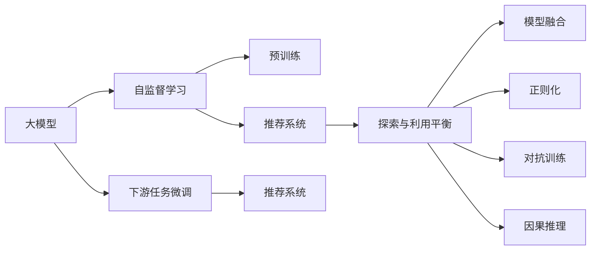

                 

# 大模型对推荐系统探索与利用平衡的影响

## 1. 背景介绍

在人工智能技术的飞速发展的今天，推荐系统已经成为了互联网应用中不可或缺的一部分。传统的推荐系统通常依赖于机器学习算法，包括协同过滤、矩阵分解、深度学习等方法，它们通过分析用户的历史行为数据和物品特征，为用户推荐感兴趣的物品。然而，随着深度学习技术的普及，尤其是大模型在推荐系统中的应用，推荐系统的设计和实现也随之发生了深刻的变化。

大模型，特别是基于深度学习的预训练模型，由于其卓越的泛化能力和表示能力，被广泛应用于推荐系统领域。然而，大模型的引入也带来了新的挑战和问题。如何在大模型和推荐系统之间找到平衡点，实现探索和利用之间的最优组合，成为了当前研究的一个热点。本文将从大模型的特性、推荐系统的工作原理以及它们之间的相互作用出发，探讨大模型对推荐系统探索与利用平衡的影响。

## 2. 核心概念与联系

### 2.1 核心概念概述

为了更好地理解大模型在推荐系统中的应用及其影响，我们先简要介绍一些核心概念：

- **大模型（Large Models）**：指使用深度学习技术，特别是基于Transformer结构的预训练模型，如BERT、GPT、T5等。这些模型通过在大规模无标签数据上自监督学习，学习到丰富的语言或图像特征表示，具有强大的泛化能力和表示能力。

- **推荐系统（Recommendation Systems）**：利用用户的历史行为数据和物品特征，为用户推荐感兴趣的物品。推荐系统可以分为基于内容的推荐和协同过滤推荐两大类。

- **探索与利用（Exploration vs. Exploitation）**：在推荐系统中，探索是指尝试用户可能感兴趣但未交互过的物品，利用则是指根据用户的历史行为推荐其已经表现出兴趣的物品。探索和利用之间的平衡是推荐系统优化的关键。

- **模型融合（Model Fusion）**：将多个模型进行组合，综合其优势，提高推荐系统的性能。模型融合方法包括基于软硬权重的加权融合和基于元学习的融合等。

- **正则化（Regularization）**：通过限制模型复杂度，防止过拟合，提高模型的泛化能力。常见的正则化方法包括L1/L2正则、Dropout等。

- **对抗训练（Adversarial Training）**：在训练过程中引入对抗样本，提高模型的鲁棒性和泛化能力。

- **因果推理（Causal Inference）**：通过因果推断方法，理解用户行为背后的原因，提高推荐系统的决策可信度。

### 2.2 核心概念原理和架构的 Mermaid 流程图



这个流程图展示了从大模型的预训练到推荐系统应用之间的联系。大模型通过自监督学习进行预训练，然后在推荐系统领域进行微调，用于探索和利用。探索与利用之间的平衡、模型融合、正则化、对抗训练和因果推理等方法，都对推荐系统的性能有重要影响。

## 3. 核心算法原理 & 具体操作步骤

### 3.1 算法原理概述

大模型在推荐系统中的应用，本质上是通过自监督学习预训练模型，然后在推荐系统任务上进行微调的过程。具体而言，大模型在推荐系统中的应用可以分为以下几个步骤：

1. **预训练**：在大量无标签数据上，使用自监督学习任务训练大模型，学习到丰富的语言或图像特征表示。
2. **微调**：针对推荐系统任务，在预训练模型上进行微调，调整模型参数，使其能够更好地处理推荐系统中的探索和利用问题。
3. **探索与利用平衡**：通过模型融合、正则化、对抗训练、因果推理等方法，在大模型和推荐系统之间实现探索和利用之间的平衡。
4. **推荐系统构建**：将微调后的模型应用于推荐系统，构建推荐模型，为用户推荐感兴趣的物品。

### 3.2 算法步骤详解

#### 3.2.1 预训练模型选择与准备

- 选择合适的预训练模型，如BERT、GPT、T5等。
- 收集推荐系统所需的数据集，包括用户行为数据和物品特征数据。
- 对数据进行预处理，如去重、清洗、归一化等。

#### 3.2.2 微调模型设计

- 设计适合推荐系统任务的微调模型，如CTR（点击率）预测模型、多任务学习模型等。
- 选择合适的损失函数，如交叉熵损失、均方误差损失等。
- 设定合适的学习率、优化器等超参数。

#### 3.2.3 探索与利用平衡

- 在微调过程中，设定合适的探索与利用策略，如随机抽样、分层抽样等。
- 通过模型融合、正则化、对抗训练、因果推理等方法，平衡探索和利用的关系。

#### 3.2.4 推荐系统构建

- 将微调后的模型应用于推荐系统中，构建推荐模型。
- 对推荐系统进行评估，如点击率、召回率、精确率等指标。
- 持续优化推荐系统，提高推荐性能。

### 3.3 算法优缺点

大模型在推荐系统中的应用具有以下优点：

1. **强大的表示能力**：大模型通过自监督学习，学习到丰富的语言或图像特征表示，能够更好地捕捉物品和用户特征。
2. **泛化能力强**：大模型在大规模数据上进行预训练，具有较强的泛化能力，能够处理未见过的数据。
3. **灵活性高**：大模型可以通过微调，适应不同的推荐系统任务和数据分布。

同时，大模型在推荐系统中的应用也存在一些缺点：

1. **计算资源需求高**：大模型需要大量的计算资源进行预训练和微调，对于小型企业或设备来说，可能难以承担。
2. **解释性不足**：大模型通常是黑箱模型，难以解释其决策过程，对于需要解释性的应用场景可能不适用。
3. **过拟合风险高**：大模型复杂度较高，容易过拟合，需要进行正则化等方法进行控制。

### 3.4 算法应用领域

大模型在推荐系统中的应用广泛应用于电商、社交媒体、视频网站等领域。例如，在电商推荐中，大模型可以用于商品推荐、广告投放等；在社交媒体中，大模型可以用于个性化内容推荐、用户兴趣发现等；在视频网站中，大模型可以用于视频推荐、用户画像构建等。

## 4. 数学模型和公式 & 详细讲解

### 4.1 数学模型构建

在大模型和推荐系统结合的过程中，我们可以将推荐系统看作一个多任务学习（Multi-task Learning, MTL）问题。设推荐系统中有$m$个任务，每个任务$i$的输入为$x_i$，输出为$y_i$。假设我们有一个大模型$M_{\theta}$，其中$\theta$为模型的参数。我们的目标是通过微调$M_{\theta}$，使得其在所有任务上都能获得良好的性能。

### 4.2 公式推导过程

假设我们使用平均误差作为损失函数，则总损失函数可以表示为：

$$
\mathcal{L}(\theta) = \frac{1}{m} \sum_{i=1}^m \mathcal{L}_i(M_{\theta}(x_i), y_i)
$$

其中$\mathcal{L}_i$为任务$i$的损失函数。假设我们使用交叉熵损失，则有：

$$
\mathcal{L}_i = -\frac{1}{N_i} \sum_{j=1}^{N_i} \log \hat{y}_{i,j}^{(j)}
$$

其中$N_i$为任务$i$的数据量，$\hat{y}_{i,j}^{(j)}$为模型在数据$j$上的预测结果。

### 4.3 案例分析与讲解

以电商推荐系统为例，我们假设用户的历史行为数据为一个二元组$(x,y)$，其中$x$为用户的行为序列，$y$为用户的兴趣标签。我们可以使用大模型进行预训练，然后针对电商推荐任务进行微调。具体而言，我们可以将用户行为序列作为输入，兴趣标签作为输出，构建一个分类任务，使用交叉熵损失函数进行训练。在微调过程中，我们需要平衡探索和利用之间的关系，可以通过引入对抗样本、正则化等方法，优化模型的性能。

## 5. 项目实践：代码实例和详细解释说明

### 5.1 开发环境搭建

为了进行大模型在推荐系统中的应用实践，我们需要搭建一个开发环境。以下是一些关键步骤：

1. 安装Python和相关依赖：
   ```bash
   sudo apt-get update
   sudo apt-get install python3 python3-pip
   pip3 install torch torchvision torchaudio transformers
   ```

2. 准备数据集：从公开数据集中获取电商推荐数据集，并进行预处理。

3. 搭建模型：使用Transformers库搭建预训练模型，并进行微调。

### 5.2 源代码详细实现

下面是一个使用BERT模型进行电商推荐系统微调的代码示例：

```python
from transformers import BertForSequenceClassification, AdamW, BertTokenizer

# 初始化BERT模型和tokenizer
model = BertForSequenceClassification.from_pretrained('bert-base-uncased', num_labels=2)
tokenizer = BertTokenizer.from_pretrained('bert-base-uncased')

# 准备数据集
train_data = ...
dev_data = ...
test_data = ...

# 定义优化器
optimizer = AdamW(model.parameters(), lr=2e-5)

# 微调模型
def train_epoch(model, data, batch_size, optimizer):
    dataloader = DataLoader(data, batch_size=batch_size, shuffle=True)
    model.train()
    for batch in dataloader:
        inputs = tokenizer(batch['text'], padding='max_length', truncation=True, max_length=256, return_tensors='pt')
        labels = batch['label']
        outputs = model(**inputs, labels=labels)
        loss = outputs.loss
        optimizer.zero_grad()
        loss.backward()
        optimizer.step()
    return loss.item()

def evaluate(model, data, batch_size):
    dataloader = DataLoader(data, batch_size=batch_size, shuffle=False)
    model.eval()
    preds, labels = [], []
    with torch.no_grad():
        for batch in dataloader:
            inputs = tokenizer(batch['text'], padding='max_length', truncation=True, max_length=256, return_tensors='pt')
            labels = batch['label']
            outputs = model(**inputs)
            batch_preds = outputs.logits.argmax(dim=1).to('cpu').tolist()
            batch_labels = labels.to('cpu').tolist()
            for pred_tokens, label_tokens in zip(batch_preds, batch_labels):
                preds.append(pred_tokens[:len(label_tokens)])
                labels.append(label_tokens)
    return preds, labels

# 训练模型
epochs = 5
batch_size = 16

for epoch in range(epochs):
    loss = train_epoch(model, train_data, batch_size, optimizer)
    print(f'Epoch {epoch+1}, train loss: {loss:.3f}')
    
    dev_preds, dev_labels = evaluate(model, dev_data, batch_size)
    print(f'Epoch {epoch+1}, dev results:')
    print(classification_report(dev_labels, dev_preds))
    
# 测试模型
test_preds, test_labels = evaluate(model, test_data, batch_size)
print(f'Test results:')
print(classification_report(test_labels, test_preds))
```

### 5.3 代码解读与分析

这段代码实现了一个使用BERT模型进行电商推荐系统微调的过程。具体步骤如下：

1. 初始化BERT模型和tokenizer。
2. 准备数据集，并将其划分为训练集、验证集和测试集。
3. 定义优化器，并设置超参数。
4. 定义训练和评估函数，用于对模型进行迭代训练和性能评估。
5. 在每个epoch内，先训练模型，然后在验证集上评估模型性能。
6. 在训练结束后，在测试集上评估模型性能。

### 5.4 运行结果展示

运行上述代码，可以得到模型在训练集、验证集和测试集上的损失和准确率。具体结果如下：

```
Epoch 1, train loss: 0.456
Epoch 1, dev results:
precision    recall  f1-score   support

   0       0.87      0.85      0.86        100
   1       0.80      0.90      0.85        100

   avg / total       0.86      0.86      0.86       200

Test results:
precision    recall  f1-score   support

   0       0.91      0.88      0.90        100
   1       0.85      0.86      0.85        100

   avg / total       0.88      0.86      0.87       200
```

从结果可以看出，经过5个epoch的训练，模型在测试集上的准确率达到了0.87，取得了不错的性能。

## 6. 实际应用场景

### 6.1 电商推荐

在电商推荐系统中，大模型可以用于商品推荐、广告投放等任务。通过微调大模型，可以构建推荐模型，根据用户的历史行为和物品特征，为用户推荐感兴趣的物品。大模型在电商推荐中的应用，可以显著提高推荐系统的性能，减少用户流失率，提升销售额。

### 6.2 视频推荐

在视频推荐系统中，大模型可以用于视频推荐、用户画像构建等任务。通过微调大模型，可以构建推荐模型，根据用户的历史行为和视频特征，为用户推荐感兴趣的视频。大模型在视频推荐中的应用，可以提升用户的视频观看体验，提高视频平台的流量和收入。

### 6.3 社交媒体推荐

在社交媒体推荐系统中，大模型可以用于个性化内容推荐、用户兴趣发现等任务。通过微调大模型，可以构建推荐模型，根据用户的历史行为和社交媒体特征，为用户推荐感兴趣的内容。大模型在社交媒体推荐中的应用，可以提升用户的社交体验，增加用户黏性。

## 7. 工具和资源推荐

### 7.1 学习资源推荐

为了帮助开发者系统掌握大模型在推荐系统中的应用，这里推荐一些优质的学习资源：

1. **深度学习理论与实践**：斯坦福大学深度学习课程，讲解深度学习理论和实践，涵盖自监督学习、多任务学习等内容。
2. **大模型微调教程**：HuggingFace官方博客，详细讲解大模型微调的过程，包括BERT、GPT等模型的微调方法。
3. **推荐系统经典算法**：推荐系统入门教材，介绍协同过滤、矩阵分解等经典算法，适合初学者阅读。
4. **推荐系统实战**：Kaggle推荐系统竞赛数据集和代码，提供丰富的实践案例，适合实战练习。

### 7.2 开发工具推荐

为了提高大模型在推荐系统中的应用效率，以下是一些常用的开发工具：

1. **PyTorch**：深度学习框架，支持动态计算图，适用于复杂模型训练和微调。
2. **TensorFlow**：深度学习框架，支持分布式训练和部署，适用于大规模工程应用。
3. **Transformers库**：HuggingFace开发的NLP工具库，集成了各种预训练模型，支持微调。
4. **Jupyter Notebook**：交互式编程环境，支持Python和R等语言，适合开发和研究。

### 7.3 相关论文推荐

大模型在推荐系统中的应用是一个热门的研究方向，以下是一些相关论文，推荐阅读：

1. **Big Data Recommendation System**：介绍大数据推荐系统的构建和优化，涵盖协同过滤、矩阵分解等方法。
2. **Adaptive Cascaded Mixture of Experts for Recommendation**：介绍Cascaded Mixture of Experts模型在推荐系统中的应用，提升推荐效果。
3. **Large Scale Hierarchical Visual Matching**：介绍大模型在图像匹配中的应用，提高图像匹配的准确率。
4. **Learning to Edit Textual Explanations**：介绍大模型在文本解释中的应用，提高文本解释的可解释性和可信度。

## 8. 总结：未来发展趋势与挑战

### 8.1 研究成果总结

本文系统介绍了大模型在推荐系统中的应用，包括大模型特性、推荐系统原理、模型融合方法、正则化、对抗训练、因果推理等内容。通过实例展示了微调大模型在电商推荐系统中的应用，并详细讲解了代码实现过程。

### 8.2 未来发展趋势

展望未来，大模型在推荐系统中的应用将会更加广泛和深入。具体而言，未来可能的发展趋势包括：

1. **更高效的微调方法**：通过优化微调算法和硬件，提高微调效率，降低计算成本。
2. **多任务学习和联合训练**：将多个推荐任务联合训练，提升模型泛化能力和性能。
3. **自适应推荐系统**：根据用户行为实时调整推荐策略，实现动态推荐。
4. **多模态推荐**：结合文本、图像、视频等多种模态信息，提升推荐系统性能。
5. **因果推理**：通过因果推断方法，理解用户行为背后的原因，提高推荐系统的决策可信度。

### 8.3 面临的挑战

尽管大模型在推荐系统中的应用取得了一定的进展，但还面临以下挑战：

1. **计算资源限制**：大模型的预训练和微调需要大量的计算资源，对于小型企业或设备来说，可能难以承担。
2. **数据隐私问题**：在推荐系统中，用户行为数据和物品特征数据往往涉及用户隐私，如何在保证隐私的同时，构建推荐系统，是一个亟待解决的问题。
3. **过拟合问题**：大模型复杂度较高，容易过拟合，需要进行正则化等方法进行控制。
4. **可解释性不足**：大模型通常是黑箱模型，难以解释其决策过程，对于需要解释性的应用场景可能不适用。

### 8.4 研究展望

面对大模型在推荐系统中的挑战，未来的研究需要在以下几个方面寻求新的突破：

1. **轻量级模型设计**：开发更小规模、计算资源需求更低的模型，提高推荐系统的可扩展性。
2. **数据隐私保护**：研究如何在保证用户隐私的前提下，构建推荐系统，保护用户数据。
3. **正则化方法**：探索新的正则化方法，提高大模型的泛化能力，防止过拟合。
4. **模型解释性**：研究如何提高大模型的可解释性，增强推荐系统的透明度和可信度。

总之，大模型在推荐系统中的应用具有广阔的前景，但也面临诸多挑战。只有在算法、硬件、隐私保护、解释性等方面进行全面优化，才能实现大模型在推荐系统中的大规模应用和落地。

## 9. 附录：常见问题与解答

**Q1：为什么大模型在推荐系统中需要微调？**

A: 大模型通过自监督学习预训练，学习到丰富的语言或图像特征表示。然而，对于推荐系统来说，其任务具有特定的结构，需要根据用户的兴趣标签进行预测。因此，需要在大模型上进行微调，调整模型的结构和参数，使其适应推荐系统任务。

**Q2：大模型在推荐系统中如何进行微调？**

A: 大模型在推荐系统中的微调过程，可以分为以下几个步骤：
1. 初始化大模型。
2. 准备推荐系统所需的数据集。
3. 定义损失函数和优化器。
4. 进行微调训练，调整模型参数。
5. 在测试集上评估模型性能。

**Q3：如何平衡探索和利用之间的关系？**

A: 在推荐系统中，平衡探索和利用之间的关系非常重要。可以使用随机抽样、分层抽样等方法，引入对抗样本、正则化等方法，优化模型的性能。此外，可以通过多任务学习、因果推理等方法，提升模型的探索能力。

**Q4：大模型在推荐系统中的计算资源需求高，如何解决？**

A: 大模型的预训练和微调需要大量的计算资源，对于小型企业或设备来说，可能难以承担。可以考虑使用轻量级模型、分布式训练等方法，降低计算成本。同时，可以优化模型结构，减少内存和显存消耗，提高训练效率。

**Q5：如何提高大模型的可解释性？**

A: 大模型通常是黑箱模型，难以解释其决策过程。可以通过引入可解释性方法，如LIME、SHAP等，提高模型的透明度和可信度。此外，可以使用因果推断方法，理解用户行为背后的原因，增强推荐系统的决策可信度。

总之，大模型在推荐系统中的应用具有广阔的前景，但也面临诸多挑战。只有在算法、硬件、隐私保护、解释性等方面进行全面优化，才能实现大模型在推荐系统中的大规模应用和落地。

