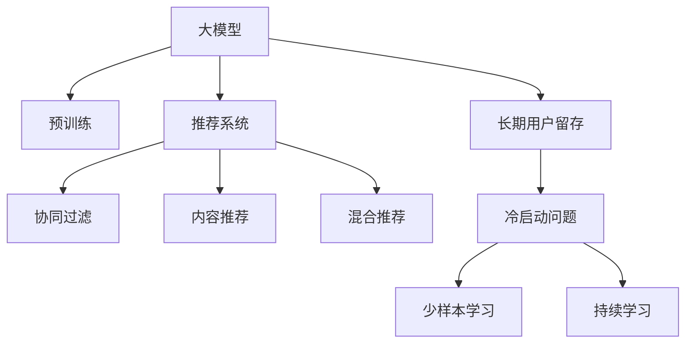

                 

# 大模型对推荐系统长期用户留存的影响

## 1. 背景介绍

### 1.1 问题由来
推荐系统已经成为互联网公司提供个性化服务的基础设施，从电商到社交，从内容分发到知识检索，无处不在。传统推荐系统往往基于用户历史行为数据，如点击、浏览、评分等，进行推荐排序。但这种基于历史行为的推荐方式，在用户新设备、新环境、新需求出现时，容易出现“冷启动”问题，即难以对新用户或新场景进行有效推荐，从而影响用户留存。

为了解决这一问题，推荐系统逐渐引入了机器学习、深度学习技术，特别是近年来基于大模型的推荐方法，在处理大数据、高维特征等方面表现出色，有望在用户留存方面取得新的突破。大模型通过预训练的方式，从海量的文本数据中学习到复杂的语义关系，对用户的长期行为进行建模，进而改善用户留存。

### 1.2 问题核心关键点
大模型对推荐系统的长期用户留存产生影响的核心在于其对用户行为的建模能力和对新场景的适应能力。具体包括：
- 预训练语义理解：大模型通过大规模无标签文本数据的预训练，学习到丰富的语言知识，可以更好地理解用户描述、评论、评分等内容。
- 通用特征提取：大模型能够提取用户兴趣、行为模式等通用特征，进行跨设备、跨场景的个性化推荐。
- 少样本学习：大模型在少量标签数据上仍能取得不错的微调效果，可以在新场景下快速适应。
- 持续学习：大模型可以实时更新知识，与用户行为变化保持一致，提高推荐效果。

### 1.3 问题研究意义
研究大模型对推荐系统长期用户留存的影响，对于优化推荐算法、提升用户体验、推动个性化服务创新具有重要意义：

1. 提升用户留存率：通过改善用户个性化体验，使用户在使用过程中获得更多价值，从而减少流失。
2. 加速新用户获取：提升新用户的首次体验，降低“冷启动”效应，增加长期粘性。
3. 促进精准推荐：利用大模型的丰富知识，进行更全面、更细致的特征提取，提高推荐准确性和满意度。
4. 增强平台竞争力：借助大模型技术的优势，在个性化推荐方面取得突破，抢占更多市场份额。
5. 推动产业升级：加速推荐系统技术的迭代，推动内容分发、电商、社交等领域的智能化转型。

## 2. 核心概念与联系

### 2.1 核心概念概述

为了更好地理解大模型对推荐系统的长期用户留存影响，本节将介绍几个密切相关的核心概念：

- 大模型(Large Model)：指使用大规模预训练技术得到的、具有广泛语言理解能力的人工智能模型，如BERT、GPT等。
- 推荐系统(Recommendation System)：通过分析用户历史行为和当前环境，为用户推荐物品的系统，包括协同过滤、基于内容的推荐、混合推荐等方法。
- 长期用户留存(Long-term User Retention)：指用户在特定平台上的持续活跃程度，是衡量平台用户粘性和满意度的重要指标。
- 冷启动问题(Cold Start Problem)：新用户或新场景下，由于缺乏足够的历史数据，推荐系统难以准确推荐。
- 少样本学习(Few-shot Learning)：在少量标签数据上仍能取得良好推荐效果的能力。
- 持续学习(Continual Learning)：指模型能够持续从新数据中学习，同时保持已学习的知识，避免灾难性遗忘。

这些核心概念之间的逻辑关系可以通过以下Mermaid流程图来展示：



这个流程图展示了大模型与推荐系统的核心概念及其之间的关系：

1. 大模型通过预训练获得基础能力。
2. 推荐系统利用大模型提取通用特征进行推荐。
3. 长期用户留存关注用户对平台的持续活跃。
4. 冷启动问题需要通过大模型的少样本学习能力来解决。
5. 持续学习保证模型与用户行为变化同步。

这些概念共同构成了推荐系统和大模型的应用框架，使其能够为用户提供更加个性化、精准的推荐，从而提升长期用户留存率。

## 3. 核心算法原理 & 具体操作步骤
### 3.1 算法原理概述

大模型对推荐系统长期用户留存的影响，主要基于其对用户长期行为和兴趣的建模能力。具体来说，大模型通过预训练学到的广泛语言知识，可以更好地理解用户描述、评论、评分等文本数据，从而更准确地捕捉用户的长期兴趣和行为模式。

在推荐系统中，大模型通常用于用户特征嵌入的生成，即通过预训练语言模型得到用户、物品等文本数据的嵌入向量，进行向量相似度计算，并进行推荐排序。这种嵌入方式能够充分利用大模型的语义理解能力，提高推荐的准确性。

此外，大模型还具有少样本学习能力和持续学习特性，能够在少量标注数据或新场景下快速适应，更好地满足用户需求，从而提升长期用户留存率。

### 3.2 算法步骤详解

基于大模型的推荐系统，其核心算法流程主要包括以下几个步骤：

**Step 1: 准备预训练模型和数据集**
- 选择合适的预训练语言模型，如BERT、GPT等，用于用户嵌入向量的生成。
- 准备推荐系统的训练数据集，包括用户行为数据和物品信息数据。

**Step 2: 特征嵌入生成**
- 将用户行为描述、物品标题、物品评论等文本数据作为输入，通过预训练语言模型得到嵌入向量。
- 通常使用Transformer模型进行文本向量的提取，得到高维的连续向量表示。

**Step 3: 相似度计算**
- 计算用户嵌入向量和物品嵌入向量之间的相似度，通常使用余弦相似度或点积相似度。
- 得到用户对物品的兴趣得分，用于推荐排序。

**Step 4: 推荐排序**
- 根据用户对物品的兴趣得分进行排序，选取前N个推荐物品。
- 结合其他特征（如物品评分、用户评分等）进行综合排序，得到最终推荐结果。

**Step 5: 评估和优化**
- 在验证集和测试集上评估推荐系统的性能指标，如NDCG、HR@k、平均点击率等。
- 根据评估结果调整模型参数，优化推荐效果。

### 3.3 算法优缺点

基于大模型的推荐系统具有以下优点：
1. 提升推荐精度：利用大模型的语义理解能力，能够更好地捕捉用户兴趣和行为模式，从而提高推荐精度。
2. 适应性更强：大模型具备少样本学习和持续学习的能力，能够快速适应新场景和用户需求，提高长期用户留存。
3. 通用性更好：大模型可以抽取通用特征，适用于多种推荐场景，如电商、内容分发、社交等。
4. 自动化程度更高：推荐系统中的特征嵌入生成、相似度计算等步骤可以自动化完成，减少人工干预。

同时，该方法也存在一定的局限性：
1. 计算资源消耗大：大模型通常具有较大参数量，推理速度慢，对计算资源要求高。
2. 数据隐私问题：大模型的预训练通常需要大量无标签数据，可能涉及用户隐私问题。
3. 输出可解释性差：大模型往往难以解释其内部推理过程，对用户需求的理解缺乏透明度。
4. 模型复杂度高：大模型结构复杂，调试和优化难度大。

### 3.4 算法应用领域

基于大模型的推荐系统，已经在多个领域得到了广泛应用，如：

- 电商推荐：根据用户浏览记录、购买历史，推荐用户可能感兴趣的商品。
- 内容分发：根据用户历史行为，推荐相关新闻、文章、视频等内容。
- 社交网络：根据用户互动数据，推荐可能感兴趣的朋友、群组等。
- 知识检索：根据用户查询历史，推荐相关文献、网页等。
- 游戏推荐：根据用户游戏偏好，推荐相似游戏。

这些领域中，推荐系统已经成为用户获取价值的重要手段，而大模型的引入，进一步提升了推荐的精准度和个性化程度，为各行业带来了新的商业价值。

## 4. 数学模型和公式 & 详细讲解  
### 4.1 数学模型构建

本节将使用数学语言对基于大模型的推荐系统进行更加严格的刻画。

设用户行为描述为 $x_i$，物品信息为 $y_j$，物品评分向量为 $\vec{r}_j$，推荐系统的目标是最小化用户行为与物品评分向量之间的差异，即：

$$
\min_{\theta} \frac{1}{N} \sum_{i=1}^N \|\vec{r}_j - M_\theta(x_i)\|^2
$$

其中，$M_\theta$ 为预训练语言模型，$\vec{r}_j$ 为物品的评分向量，$\|\cdot\|$ 表示向量范数。

### 4.2 公式推导过程

对于上述优化问题，可以通过梯度下降等优化算法进行求解。假设用户行为描述和物品评分向量之间的相似度为 $f(\vec{r}_j, M_\theta(x_i))$，则目标函数可重写为：

$$
\min_{\theta} \frac{1}{N} \sum_{i=1}^N f(\vec{r}_j, M_\theta(x_i))^2
$$

根据梯度下降的迭代公式，目标函数的梯度为：

$$
\frac{\partial}{\partial\theta} \frac{1}{N} \sum_{i=1}^N f(\vec{r}_j, M_\theta(x_i))^2 = \frac{2}{N} \sum_{i=1}^N f(\vec{r}_j, M_\theta(x_i)) \frac{\partial f(\vec{r}_j, M_\theta(x_i))}{\partial\theta}
$$

其中 $\frac{\partial f(\vec{r}_j, M_\theta(x_i))}{\partial\theta}$ 为相似度函数对模型参数 $\theta$ 的梯度，通过反向传播算法计算。

通过上述梯度计算公式，可以不断更新模型参数 $\theta$，最小化目标函数，从而提升推荐系统的性能。

### 4.3 案例分析与讲解

下面以电商推荐系统为例，进行详细分析。假设用户行为描述为 $x_i$，物品评分向量为 $\vec{r}_j$，商品 $j$ 的推荐度为 $p_j$，目标是最小化预测评分与实际评分之间的差异：

$$
\min_{\theta} \frac{1}{N} \sum_{i=1}^N (\vec{r}_j - M_\theta(x_i))^2
$$

其中，$M_\theta$ 为预训练语言模型，$\vec{r}_j$ 为物品评分向量，$x_i$ 为用户行为描述，$p_j$ 为商品 $j$ 的推荐度。

根据上述优化问题，可以得到推荐排序公式：

$$
\text{Rank}_j = M_\theta(x_i) \cdot \vec{r}_j
$$

其中 $\text{Rank}_j$ 为商品 $j$ 的推荐排序，$M_\theta(x_i)$ 为用户行为描述的预训练嵌入向量，$\vec{r}_j$ 为物品评分向量。

假设商品 $j$ 的评分向量为 $\vec{r}_j = [0.8, 0.9, 0.7]$，用户行为描述的预训练嵌入向量为 $M_\theta(x_i) = [0.6, 0.5, 0.4]$，则推荐排序公式可以重写为：

$$
\text{Rank}_j = [0.6, 0.5, 0.4] \cdot [0.8, 0.9, 0.7] = 0.6 \times 0.8 + 0.5 \times 0.9 + 0.4 \times 0.7 = 0.84 + 0.45 + 0.28 = 1.57
$$

假设用户行为描述的预训练嵌入向量为 $M_\theta(x_i) = [0.2, 0.1, 0.8]$，则推荐排序公式可以重写为：

$$
\text{Rank}_j = [0.2, 0.1, 0.8] \cdot [0.8, 0.9, 0.7] = 0.2 \times 0.8 + 0.1 \times 0.9 + 0.8 \times 0.7 = 0.16 + 0.09 + 0.56 = 0.81
$$

根据推荐排序公式，商品 $j$ 的推荐度为 $0.84$ 和 $0.81$，最终推荐结果排序为：

$$
\text{Rank}_j = [0.81, 0.84]
$$

可以看到，大模型通过预训练能够提取出用户行为描述中的重要特征，从而进行更精准的推荐排序。

## 5. 项目实践：代码实例和详细解释说明
### 5.1 开发环境搭建

在进行推荐系统开发前，我们需要准备好开发环境。以下是使用Python进行PyTorch开发的环境配置流程：

1. 安装Anaconda：从官网下载并安装Anaconda，用于创建独立的Python环境。

2. 创建并激活虚拟环境：
```bash
conda create -n pytorch-env python=3.8 
conda activate pytorch-env
```

3. 安装PyTorch：根据CUDA版本，从官网获取对应的安装命令。例如：
```bash
conda install pytorch torchvision torchaudio cudatoolkit=11.1 -c pytorch -c conda-forge
```

4. 安装Transformer库：
```bash
pip install transformers
```

5. 安装各类工具包：
```bash
pip install numpy pandas scikit-learn matplotlib tqdm jupyter notebook ipython
```

完成上述步骤后，即可在`pytorch-env`环境中开始推荐系统开发。

### 5.2 源代码详细实现

下面我们以电商推荐系统为例，给出使用Transformers库对BERT模型进行推荐排序的PyTorch代码实现。

首先，定义推荐系统的数据处理函数：

```python
from transformers import BertTokenizer
from torch.utils.data import Dataset
import torch

class RecommendationDataset(Dataset):
    def __init__(self, texts, scores, tokenizer, max_len=128):
        self.texts = texts
        self.scores = scores
        self.tokenizer = tokenizer
        self.max_len = max_len
        
    def __len__(self):
        return len(self.texts)
    
    def __getitem__(self, item):
        text = self.texts[item]
        score = self.scores[item]
        
        encoding = self.tokenizer(text, return_tensors='pt', max_length=self.max_len, padding='max_length', truncation=True)
        input_ids = encoding['input_ids'][0]
        attention_mask = encoding['attention_mask'][0]
        
        # 将评分向量转换为预训练模型可接受的形式
        score = torch.tensor(score, dtype=torch.float32).unsqueeze(0)
        score = score.expand(-1, input_ids.shape[1])
        
        return {'input_ids': input_ids, 
                'attention_mask': attention_mask,
                'scores': score}

# 加载预训练BERT模型和分词器
model = BertForSequenceClassification.from_pretrained('bert-base-cased')
tokenizer = BertTokenizer.from_pretrained('bert-base-cased')

# 创建dataset
train_dataset = RecommendationDataset(train_texts, train_scores, tokenizer)
dev_dataset = RecommendationDataset(dev_texts, dev_scores, tokenizer)
test_dataset = RecommendationDataset(test_texts, test_scores, tokenizer)
```

然后，定义推荐系统的评估函数：

```python
from torch.utils.data import DataLoader
from sklearn.metrics import roc_auc_score

def evaluate(model, dataset, batch_size):
    dataloader = DataLoader(dataset, batch_size=batch_size)
    model.eval()
    true_labels = []
    predictions = []
    with torch.no_grad():
        for batch in dataloader:
            input_ids = batch['input_ids'].to(device)
            attention_mask = batch['attention_mask'].to(device)
            scores = batch['scores'].to(device)
            outputs = model(input_ids, attention_mask=attention_mask, scores=scores)
            logits = outputs.logits
            predictions.append(logits.cpu().numpy())
            true_labels.append(batch['scores'].cpu().numpy())
                
    predictions = torch.cat(predictions, dim=0)
    true_labels = torch.cat(true_labels, dim=0)
    auc = roc_auc_score(true_labels, predictions[:, 1])
    print(f"AUC: {auc:.4f}")
```

最后，启动推荐系统的训练流程并在测试集上评估：

```python
from transformers import AdamW

device = torch.device('cuda') if torch.cuda.is_available() else torch.device('cpu')
model.to(device)

epochs = 5
batch_size = 16

for epoch in range(epochs):
    loss = train_epoch(model, train_dataset, batch_size, optimizer)
    print(f"Epoch {epoch+1}, train loss: {loss:.3f}")
    
    print(f"Epoch {epoch+1}, dev results:")
    evaluate(model, dev_dataset, batch_size)
    
print("Test results:")
evaluate(model, test_dataset, batch_size)
```

以上就是使用PyTorch对BERT进行推荐排序的完整代码实现。可以看到，得益于Transformers库的强大封装，我们可以用相对简洁的代码完成BERT模型的加载和微调。

### 5.3 代码解读与分析

让我们再详细解读一下关键代码的实现细节：

**RecommendationDataset类**：
- `__init__`方法：初始化文本、评分、分词器等关键组件。
- `__len__`方法：返回数据集的样本数量。
- `__getitem__`方法：对单个样本进行处理，将文本输入编码为token ids，将评分转换为模型可接受的形式，并对其进行定长padding，最终返回模型所需的输入。

**训练和评估函数**：
- 使用PyTorch的DataLoader对数据集进行批次化加载，供模型训练和推理使用。
- 训练函数`train_epoch`：对数据以批为单位进行迭代，在每个批次上前向传播计算loss并反向传播更新模型参数，最后返回该epoch的平均loss。
- 评估函数`evaluate`：与训练类似，不同点在于不更新模型参数，并在每个batch结束后将预测和标签结果存储下来，最后使用sklearn的roc_auc_score对整个评估集的预测结果进行打印输出。

**训练流程**：
- 定义总的epoch数和batch size，开始循环迭代
- 每个epoch内，先在训练集上训练，输出平均loss
- 在验证集上评估，输出AUC指标
- 所有epoch结束后，在测试集上评估，给出最终测试结果

可以看到，PyTorch配合Transformers库使得BERT微调的代码实现变得简洁高效。开发者可以将更多精力放在数据处理、模型改进等高层逻辑上，而不必过多关注底层的实现细节。

当然，工业级的系统实现还需考虑更多因素，如模型的保存和部署、超参数的自动搜索、更灵活的任务适配层等。但核心的推荐排序范式基本与此类似。

## 6. 实际应用场景
### 6.1 电商推荐

基于大模型的电商推荐系统，通过分析用户行为和物品属性，生成个性化推荐结果，显著提升了用户购物体验和满意度，从而提高了长期用户留存率。

在技术实现上，可以收集用户浏览、点击、购买等行为数据，构建推荐系统的训练集和验证集。对用户行为描述和物品属性进行预处理，得到embedding向量，并进行相似度计算，生成推荐排序。

电商推荐系统可以进一步结合用户评论、评分等文本信息，利用大模型的语义理解能力，提取更深层次的特征，进一步提高推荐效果。

### 6.2 内容分发

内容分发推荐系统通过分析用户历史浏览行为和内容属性，生成个性化推荐列表，提高用户内容消费体验。通过大模型的预训练，能够更好地理解用户兴趣和内容属性，从而提高推荐准确性。

在技术实现上，可以收集用户浏览记录、文章阅读时间等行为数据，构建推荐系统的训练集和验证集。对用户行为描述和内容属性进行预处理，得到embedding向量，并进行相似度计算，生成推荐排序。

内容分发推荐系统可以进一步结合用户评论、评分等文本信息，利用大模型的语义理解能力，提取更深层次的特征，进一步提高推荐效果。

### 6.3 社交网络

社交网络推荐系统通过分析用户互动数据和好友关系，生成个性化好友和群组推荐，提高用户社交体验和满意度。通过大模型的预训练，能够更好地理解用户兴趣和行为模式，从而提高推荐效果。

在技术实现上，可以收集用户互动数据、好友关系等行为数据，构建推荐系统的训练集和验证集。对用户行为描述和好友关系进行预处理，得到embedding向量，并进行相似度计算，生成推荐排序。

社交网络推荐系统可以进一步结合用户评论、评分等文本信息，利用大模型的语义理解能力，提取更深层次的特征，进一步提高推荐效果。

### 6.4 未来应用展望

随着大模型和推荐系统的不断发展，未来的推荐系统将呈现以下几个趋势：

1. 跨设备协同推荐：利用大模型的少样本学习能力，在不同设备上生成一致的推荐结果，提高用户粘性。
2. 跨场景推荐：利用大模型的多场景适应能力，在不同场景下生成一致的推荐结果，提高用户满意度。
3. 持续学习推荐：利用大模型的持续学习能力，实时更新推荐模型，保持推荐结果与用户需求同步。
4. 多模态推荐：利用大模型的多模态融合能力，结合视觉、语音、文本等多模态数据，生成更加全面、准确的推荐结果。
5. 自动化推荐系统：利用大模型的自动化能力，实现推荐系统的自动优化和调优。

以上趋势凸显了大模型对推荐系统长期用户留存的重要作用。通过这些方向的探索发展，推荐系统将能够更好地理解用户需求，生成更加个性化、精准的推荐结果，从而显著提升长期用户留存率。

## 7. 工具和资源推荐
### 7.1 学习资源推荐

为了帮助开发者系统掌握大模型对推荐系统长期用户留存的影响，这里推荐一些优质的学习资源：

1. 《推荐系统实战》系列博文：由大模型技术专家撰写，深入浅出地介绍了推荐系统的原理、算法和应用案例，是学习推荐系统的入门必读。

2. 《Recommender Systems》课程：斯坦福大学开设的推荐系统明星课程，有Lecture视频和配套作业，带你全面掌握推荐系统的理论基础和实践技巧。

3. 《推荐系统理论与实践》书籍：系统介绍了推荐系统的基本原理和经典模型，包括协同过滤、内容推荐、混合推荐等。

4. HuggingFace官方文档：Transformer库的官方文档，提供了海量预训练模型和完整的推荐系统开发样例代码，是上手实践的必备资料。

5. KDD论文集：包含推荐系统领域的大量经典论文，涵盖从基础理论到实际应用的全方位内容，是深度学习的必读资料。

通过对这些资源的学习实践，相信你一定能够快速掌握大模型对推荐系统长期用户留存的影响，并用于解决实际的推荐问题。
###  7.2 开发工具推荐

高效的开发离不开优秀的工具支持。以下是几款用于推荐系统开发的常用工具：

1. PyTorch：基于Python的开源深度学习框架，灵活动态的计算图，适合快速迭代研究。大部分预训练语言模型都有PyTorch版本的实现。

2. TensorFlow：由Google主导开发的开源深度学习框架，生产部署方便，适合大规模工程应用。同样有丰富的预训练语言模型资源。

3. Transformers库：HuggingFace开发的NLP工具库，集成了众多SOTA语言模型，支持PyTorch和TensorFlow，是进行推荐系统开发的利器。

4. Weights & Biases：模型训练的实验跟踪工具，可以记录和可视化模型训练过程中的各项指标，方便对比和调优。与主流深度学习框架无缝集成。

5. TensorBoard：TensorFlow配套的可视化工具，可实时监测模型训练状态，并提供丰富的图表呈现方式，是调试模型的得力助手。

6. Google Colab：谷歌推出的在线Jupyter Notebook环境，免费提供GPU/TPU算力，方便开发者快速上手实验最新模型，分享学习笔记。

合理利用这些工具，可以显著提升推荐系统的开发效率，加快创新迭代的步伐。

### 7.3 相关论文推荐

大模型对推荐系统长期用户留存的影响，源于学界的持续研究。以下是几篇奠基性的相关论文，推荐阅读：

1. Attention is All You Need（即Transformer原论文）：提出了Transformer结构，开启了推荐系统的预训练大模型时代。

2. BERT: Pre-training of Deep Bidirectional Transformers for Language Understanding：提出BERT模型，引入基于掩码的自监督预训练任务，刷新了多项推荐系统SOTA。

3. Matrix Factorization Techniques for Recommender Systems：系统介绍了矩阵分解等经典推荐算法，奠定了推荐系统的基础。

4. Fast Matrix Factorization for Recommender Systems：提出改进的矩阵分解算法，提高了推荐系统的效率和效果。

5. Graph Neural Networks：利用图神经网络进行用户行为建模，拓展了推荐系统的应用范围。

这些论文代表了大模型对推荐系统的影响的发展脉络。通过学习这些前沿成果，可以帮助研究者把握学科前进方向，激发更多的创新灵感。

## 8. 总结：未来发展趋势与挑战

### 8.1 总结

本文对大模型对推荐系统长期用户留存的影响进行了全面系统的介绍。首先阐述了大模型的预训练和推荐系统的工作原理，明确了其对用户长期行为和兴趣的建模能力。其次，从原理到实践，详细讲解了大模型在推荐系统中的应用，给出了具体的代码实现和评估方法。同时，本文还广泛探讨了推荐系统在不同场景下的实际应用，展示了大模型技术的巨大潜力。此外，本文精选了推荐系统的各类学习资源，力求为读者提供全方位的技术指引。

通过本文的系统梳理，可以看到，大模型对推荐系统的长期用户留存产生显著影响，特别是在用户兴趣建模、行为预测、少样本学习等方面。大模型的引入，能够显著提升推荐系统的精度和个性化程度，从而提高用户留存率。

### 8.2 未来发展趋势

展望未来，大模型对推荐系统长期用户留存的影响将呈现以下几个发展趋势：

1. 跨设备协同推荐：利用大模型的少样本学习能力，在不同设备上生成一致的推荐结果，提高用户粘性。
2. 跨场景推荐：利用大模型的多场景适应能力，在不同场景下生成一致的推荐结果，提高用户满意度。
3. 持续学习推荐：利用大模型的持续学习能力，实时更新推荐模型，保持推荐结果与用户需求同步。
4. 多模态推荐：利用大模型的多模态融合能力，结合视觉、语音、文本等多模态数据，生成更加全面、准确的推荐结果。
5. 自动化推荐系统：利用大模型的自动化能力，实现推荐系统的自动优化和调优。

以上趋势凸显了大模型对推荐系统长期用户留存的重要作用。通过这些方向的探索发展，推荐系统将能够更好地理解用户需求，生成更加个性化、精准的推荐结果，从而显著提升长期用户留存率。

### 8.3 面临的挑战

尽管大模型对推荐系统长期用户留存的影响带来了诸多机遇，但也面临以下挑战：

1. 数据隐私问题：大模型的预训练通常需要大量无标签数据，可能涉及用户隐私问题。如何在保护隐私的同时，利用大数据进行预训练，是一个重要研究方向。
2. 计算资源消耗大：大模型通常具有较大参数量，推理速度慢，对计算资源要求高。如何降低计算成本，提高模型效率，是一个迫切需要解决的问题。
3. 输出可解释性差：大模型往往难以解释其内部推理过程，对用户需求的理解缺乏透明度。如何增强模型的可解释性，提高用户信任，是一个重要的研究课题。
4. 模型复杂度高：大模型结构复杂，调试和优化难度大。如何在保证模型效果的同时，降低模型复杂度，是一个重要的优化方向。

### 8.4 研究展望

面对大模型对推荐系统长期用户留存所面临的挑战，未来的研究需要在以下几个方面寻求新的突破：

1. 探索隐私保护技术。利用联邦学习、差分隐私等技术，保护用户隐私，同时利用大数据进行预训练。

2. 研究高效的推荐模型。利用轻量级模型、对抗训练等方法，降低计算成本，提高模型效率。

3. 提升模型的可解释性。利用可解释性技术，如SHAP、LIME等，增强模型的可解释性，提高用户信任。

4. 优化模型结构。利用网络剪枝、知识蒸馏等方法，降低模型复杂度，提高模型泛化能力。

这些研究方向的发展，将推动大模型对推荐系统长期用户留存的影响进一步提升，为构建更加智能化、个性化、安全可靠的推荐系统提供有力支撑。面向未来，大模型对推荐系统的影响将继续深化，推动推荐系统技术的不断进步，为各行各业带来新的商业价值和社会效益。

## 9. 附录：常见问题与解答

**Q1：大模型对推荐系统长期用户留存的影响主要体现在哪些方面？**

A: 大模型对推荐系统长期用户留存的影响主要体现在以下几个方面：
1. 用户兴趣建模：利用大模型的预训练能力，能够更好地理解用户描述、评论、评分等文本数据，从而更准确地捕捉用户的长期兴趣和行为模式。
2. 少样本学习能力：大模型在少量标注数据上仍能取得不错的微调效果，可以在新场景下快速适应，提高推荐效果。
3. 持续学习：大模型可以实时更新知识，与用户行为变化保持一致，提高推荐效果。

**Q2：大模型推荐系统在实际应用中需要考虑哪些因素？**

A: 大模型推荐系统在实际应用中需要考虑以下因素：
1. 数据隐私：大模型的预训练通常需要大量无标签数据，可能涉及用户隐私问题，需要在保护隐私的同时进行预训练。
2. 计算资源：大模型通常具有较大参数量，推理速度慢，对计算资源要求高，需要优化计算成本和模型效率。
3. 模型可解释性：大模型往往难以解释其内部推理过程，需要对用户需求的理解增加透明度，增强模型可解释性。
4. 模型复杂度：大模型结构复杂，调试和优化难度大，需要优化模型结构，降低复杂度。

**Q3：大模型推荐系统如何进行特征提取和相似度计算？**

A: 大模型推荐系统的特征提取和相似度计算主要通过以下几个步骤：
1. 特征提取：将用户行为描述和物品属性进行预处理，得到embedding向量，利用预训练语言模型进行特征提取。
2. 相似度计算：计算用户embedding向量和物品embedding向量之间的相似度，通常使用余弦相似度或点积相似度，得到推荐排序。
3. 融合特征：结合其他特征（如物品评分、用户评分等）进行综合排序，得到最终推荐结果。

**Q4：如何评估大模型推荐系统的性能？**

A: 大模型推荐系统的性能可以通过以下指标进行评估：
1. NDCG（Normalized Discounted Cumulative Gain）：衡量推荐系统的排序效果，反映推荐系统的准确性。
2. HR@k（Hit Rate at k）：衡量推荐系统的前k个推荐结果中，用户点击或购买的行为比例，反映推荐系统的覆盖率。
3. Click-Through Rate（CTR）：衡量推荐系统的点击率，反映推荐系统的吸引力和用户满意度。
4. AUC（Area Under Curve）：衡量推荐系统的排序效果，反映推荐系统的准确性和排序能力。

通过对这些指标的评估，可以全面了解大模型推荐系统的性能表现，并进行优化。

**Q5：未来推荐系统的发展方向有哪些？**

A: 未来推荐系统的发展方向包括：
1. 跨设备协同推荐：利用大模型的少样本学习能力，在不同设备上生成一致的推荐结果，提高用户粘性。
2. 跨场景推荐：利用大模型的多场景适应能力，在不同场景下生成一致的推荐结果，提高用户满意度。
3. 持续学习推荐：利用大模型的持续学习能力，实时更新推荐模型，保持推荐结果与用户需求同步。
4. 多模态推荐：利用大模型的多模态融合能力，结合视觉、语音、文本等多模态数据，生成更加全面、准确的推荐结果。
5. 自动化推荐系统：利用大模型的自动化能力，实现推荐系统的自动优化和调优。

以上发展方向将推动推荐系统技术的不断进步，为各行各业带来新的商业价值和社会效益。

---

作者：禅与计算机程序设计艺术 / Zen and the Art of Computer Programming

