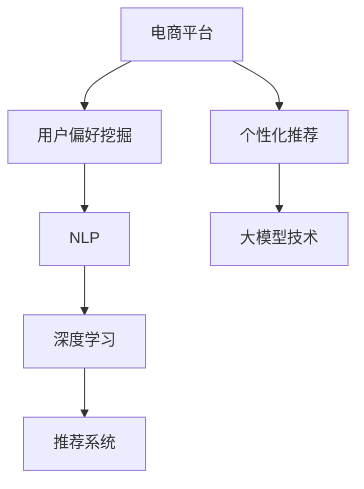

                 

# 大模型技术在电商平台用户偏好挖掘中的创新

> 关键词：电商平台,用户偏好挖掘,大模型技术,自然语言处理,深度学习,推荐系统,个性化推荐

## 1. 背景介绍

### 1.1 问题由来

随着电子商务的飞速发展，电商平台逐渐成为用户获取商品和服务的主要渠道。为了更好地满足用户需求，提升用户体验，电商平台纷纷引入数据分析技术，对用户行为进行挖掘和分析，从而提供个性化的推荐服务。然而，传统的基于规则和统计方法的用户行为分析方式，往往难以捕捉用户深层次的情感和偏好，难以满足日益个性化的需求。为此，一种结合大模型技术和自然语言处理(NLP)的方法，开始进入研究者的视野。

### 1.2 问题核心关键点

大模型技术在电商平台用户偏好挖掘中的应用，主要基于以下关键点：

1. 强大的语义理解能力：大模型如BERT、GPT等，能够深度学习语言的语义特征，挖掘出文本中隐藏的情感、意图和偏好信息。
2. 泛化性强：通过大规模无标签数据的预训练，大模型具备了很强的泛化能力，可以在新的电商平台数据上快速适应，挖掘出用户深层次的偏好。
3. 参数高效：大模型在保持性能的前提下，可以通过参数高效微调方法，减少微调所需的计算资源和时间，从而提升效率。
4. 实时性：大模型的推理速度快，可以实时分析用户行为，并快速做出推荐，满足用户的即时需求。

### 1.3 问题研究意义

大模型技术在电商平台用户偏好挖掘中的应用，对于提升电商平台的用户体验和业务效率具有重要意义：

1. 提升推荐精度：通过深度学习大模型，可以更准确地理解用户的深层次需求，提高推荐的个性化和精准度。
2. 优化用户体验：用户可以得到更符合自己兴趣和偏好的推荐，提升用户的购买体验和满意度。
3. 增加转化率：通过精准推荐，用户更容易发现并购买到真正需要的商品，从而提升电商平台的转化率和销售额。
4. 增强市场竞争力：基于大模型技术的推荐系统可以显著提升平台的用户粘性和市场竞争力，吸引更多的用户和商家入驻。

## 2. 核心概念与联系

### 2.1 核心概念概述

为了更好地理解大模型技术在电商平台用户偏好挖掘中的应用，首先需要了解一些关键概念：

- **电商平台**：指基于互联网的电子商务平台，如淘宝、京东、Amazon等。平台通过在线销售商品和提供服务，实现用户与商家的连接。
- **用户偏好挖掘**：指通过分析用户的在线行为和反馈数据，挖掘出用户对于商品、服务和内容的偏好和需求，从而为用户提供个性化的推荐服务。
- **自然语言处理(NLP)**：指通过计算机处理、理解、生成自然语言的技术，包括文本分类、情感分析、意图识别、命名实体识别等。
- **深度学习**：指使用深度神经网络进行学习和推理的机器学习方法，具备强大的表达能力和泛化能力。
- **推荐系统**：指通过分析用户行为和商品特征，为用户推荐个性化商品和服务的系统，常见的推荐系统包括协同过滤、基于内容的推荐、混合推荐等。
- **个性化推荐**：指根据用户的历史行为和兴趣，提供符合其个性化需求的推荐服务，提升用户满意度和平台转化率。

这些概念之间的逻辑关系可以通过以下Mermaid流程图来展示：



这个流程图展示了用户偏好挖掘过程中，大模型技术与其他相关概念的联系：

1. **电商平台**：提供用户行为数据，供用户偏好挖掘使用。
2. **用户偏好挖掘**：通过分析用户行为数据，挖掘用户偏好和需求。
3. **NLP**：对用户行为数据进行文本分类、情感分析等处理，提取文本特征。
4. **深度学习**：通过学习用户行为和商品特征，预测用户偏好和需求。
5. **推荐系统**：结合用户偏好和商品特征，生成个性化推荐。
6. **个性化推荐**：使用深度学习模型和大模型技术，提升推荐精度。
7. **大模型技术**：通过预训练和微调，提高推荐系统的表现。

这些概念共同构成了电商平台用户偏好挖掘的框架，为大模型技术的应用提供了理论基础。

## 3. 核心算法原理 & 具体操作步骤
### 3.1 算法原理概述

基于大模型技术的用户偏好挖掘，其核心原理是通过自然语言处理(NLP)技术，从用户行为数据中提取文本特征，再通过深度学习模型进行训练和预测，生成个性化的推荐结果。

具体流程如下：

1. **数据收集**：收集用户在电商平台上的行为数据，如浏览记录、搜索记录、评论记录等。
2. **数据清洗**：对收集到的数据进行清洗，去除噪声和无效数据，保证数据的质量。
3. **文本预处理**：对文本数据进行分词、去停用词、词干提取等预处理操作，转换为模型输入格式。
4. **特征提取**：使用NLP技术，从文本数据中提取特征向量，如TF-IDF、Word2Vec等。
5. **模型训练**：选择大模型如BERT、GPT等作为初始化参数，通过深度学习模型训练预测用户偏好。
6. **微调优化**：根据电商平台特定任务，进行模型参数的微调优化，提升模型性能。
7. **推荐生成**：使用训练好的模型，对新用户行为数据进行推理，生成个性化推荐。

### 3.2 算法步骤详解

以下是基于大模型技术的用户偏好挖掘详细步骤：

**Step 1: 数据收集与预处理**

1. **数据收集**：
   - 从电商平台后台系统收集用户行为数据，包括浏览记录、搜索记录、购买记录、评价记录等。
   - 收集商品的描述、价格、标签等信息，建立商品特征库。

2. **数据预处理**：
   - 对文本数据进行清洗，去除噪声和无效数据，如过滤掉不符合规范的文本、去除重复记录等。
   - 对文本进行分词、去停用词、词干提取等操作，转换为模型输入格式。
   - 对数值型数据进行归一化和标准化处理。

**Step 2: 特征提取与表示**

1. **文本特征提取**：
   - 使用NLP技术，从用户行为数据中提取文本特征，如TF-IDF、Word2Vec等。
   - 将提取的特征进行拼接或组合，得到高维特征向量。

2. **商品特征表示**：
   - 根据商品描述和标签，提取商品特征向量，如Word2Vec、TF-IDF等。
   - 将商品特征向量与文本特征向量进行拼接或组合，得到高维特征向量。

**Step 3: 模型训练与预测**

1. **选择大模型**：
   - 选择预训练的大模型，如BERT、GPT等，作为初始化参数。
   - 对大模型进行微调，使用电商平台的特定任务进行训练，生成预测模型。

2. **模型训练**：
   - 将用户行为数据和高维特征向量输入到训练好的大模型中，训练生成预测模型。
   - 使用交叉验证技术，评估模型的性能，选择最优模型。

**Step 4: 微调优化**

1. **微调策略**：
   - 根据电商平台特定任务，设计合适的微调策略，如冻结底层参数，仅微调顶层参数。
   - 使用小批量数据进行微调，防止过拟合。

2. **微调算法**：
   - 选择优化算法，如Adam、SGD等，设置学习率、批大小、迭代轮数等参数。
   - 定期在验证集上评估模型性能，触发Early Stopping，避免过拟合。

**Step 5: 推荐生成**

1. **推理计算**：
   - 使用微调后的模型，对新用户行为数据进行推理，生成个性化推荐。
   - 根据推荐结果，生成推荐页面，显示给用户。

2. **效果评估**：
   - 使用评价指标，如准确率、召回率、F1-score等，评估推荐系统的效果。
   - 收集用户反馈数据，分析用户满意度，优化推荐系统。

### 3.3 算法优缺点

基于大模型技术的用户偏好挖掘方法，具有以下优点：

1. **精度高**：通过深度学习大模型，可以深入挖掘用户行为数据中的语义信息，提升推荐精度。
2. **泛化能力强**：大模型通过大规模数据预训练，具备强大的泛化能力，可以适应新的电商平台数据。
3. **参数高效**：通过参数高效微调方法，可以减少微调所需的计算资源和时间，提升模型训练效率。
4. **实时性高**：大模型推理速度快，可以实时分析用户行为，快速生成推荐结果，满足用户即时需求。

同时，该方法也存在以下局限性：

1. **依赖标注数据**：大模型微调需要大量的标注数据进行训练，获取高质量标注数据的成本较高。
2. **模型复杂度高**：大模型参数量庞大，需要高性能计算资源进行训练和推理。
3. **可解释性不足**：大模型通常是"黑盒"系统，难以解释其内部工作机制和决策逻辑。
4. **需要技术储备**：需要掌握NLP、深度学习等技术，对技术要求较高。

尽管存在这些局限性，但大模型技术在电商平台用户偏好挖掘中的应用，已经展现出巨大的潜力，成为一种主流的推荐方法。

### 3.4 算法应用领域

基于大模型技术的用户偏好挖掘方法，已经在电商平台的多个应用场景中得到广泛应用，例如：

1. **个性化推荐**：根据用户历史行为数据，生成符合其个性化需求的推荐结果。
2. **商品搜索**：分析用户搜索记录，生成匹配度高的搜索结果，提升用户搜索体验。
3. **商品评价**：分析用户对商品的评价文本，挖掘出用户的情感倾向和满意度。
4. **新商品推荐**：分析用户对新商品的态度和反应，预测新商品的市场表现。
5. **用户流失预测**：分析用户行为数据，预测用户流失风险，提升用户粘性。

除了上述这些经典场景外，大模型技术在电商平台的更多创新场景中，也得到了成功应用，如动态定价、智能客服、个性化广告等，为电商平台带来了新的商业机会和用户体验。

## 4. 数学模型和公式 & 详细讲解  
### 4.1 数学模型构建

在本节中，我们将通过数学语言对大模型技术在电商平台用户偏好挖掘中的使用进行更加严格的刻画。

记电商平台用户行为数据为 $D=\{(x_i, y_i)\}_{i=1}^N, x_i \in \mathcal{X}, y_i \in \mathcal{Y}$，其中 $\mathcal{X}$ 为用户行为数据，$\mathcal{Y}$ 为推荐结果标签。假设选择预训练的大模型为 $M_{\theta}$，其中 $\theta \in \mathbb{R}^d$ 为模型参数。

定义模型 $M_{\theta}$ 在用户行为数据 $(x,y)$ 上的损失函数为 $\ell(M_{\theta}(x),y)$，则在数据集 $D$ 上的经验风险为：

$$
\mathcal{L}(\theta) = \frac{1}{N} \sum_{i=1}^N \ell(M_{\theta}(x_i),y_i)
$$

微调的优化目标是最小化经验风险，即找到最优参数：

$$
\theta^* = \mathop{\arg\min}_{\theta} \mathcal{L}(\theta)
$$

在实践中，我们通常使用基于梯度的优化算法（如Adam、SGD等）来近似求解上述最优化问题。设 $\eta$ 为学习率，$\lambda$ 为正则化系数，则参数的更新公式为：

$$
\theta \leftarrow \theta - \eta \nabla_{\theta}\mathcal{L}(\theta) - \eta\lambda\theta
$$

其中 $\nabla_{\theta}\mathcal{L}(\theta)$ 为损失函数对参数 $\theta$ 的梯度，可通过反向传播算法高效计算。

### 4.2 公式推导过程

以下我们以推荐系统为例，推导交叉熵损失函数及其梯度的计算公式。

假设模型 $M_{\theta}$ 在输入 $x$ 上的输出为 $\hat{y}=M_{\theta}(x) \in [0,1]$，表示推荐结果为商品的概率。真实标签 $y \in \{0,1\}$。则二分类交叉熵损失函数定义为：

$$
\ell(M_{\theta}(x),y) = -[y\log \hat{y} + (1-y)\log (1-\hat{y})]
$$

将其代入经验风险公式，得：

$$
\mathcal{L}(\theta) = -\frac{1}{N}\sum_{i=1}^N [y_i\log M_{\theta}(x_i)+(1-y_i)\log(1-M_{\theta}(x_i))]
$$

根据链式法则，损失函数对参数 $\theta_k$ 的梯度为：

$$
\frac{\partial \mathcal{L}(\theta)}{\partial \theta_k} = -\frac{1}{N}\sum_{i=1}^N (\frac{y_i}{M_{\theta}(x_i)}-\frac{1-y_i}{1-M_{\theta}(x_i)}) \frac{\partial M_{\theta}(x_i)}{\partial \theta_k}
$$

其中 $\frac{\partial M_{\theta}(x_i)}{\partial \theta_k}$ 可进一步递归展开，利用自动微分技术完成计算。

在得到损失函数的梯度后，即可带入参数更新公式，完成模型的迭代优化。重复上述过程直至收敛，最终得到适应电商平台推荐任务的最优模型参数 $\theta^*$。

## 5. 项目实践：代码实例和详细解释说明
### 5.1 开发环境搭建

在进行电商平台用户偏好挖掘的微调实践前，我们需要准备好开发环境。以下是使用Python进行PyTorch开发的环境配置流程：

1. 安装Anaconda：从官网下载并安装Anaconda，用于创建独立的Python环境。

2. 创建并激活虚拟环境：
```bash
conda create -n pytorch-env python=3.8 
conda activate pytorch-env
```

3. 安装PyTorch：根据CUDA版本，从官网获取对应的安装命令。例如：
```bash
conda install pytorch torchvision torchaudio cudatoolkit=11.1 -c pytorch -c conda-forge
```

4. 安装Transformers库：
```bash
pip install transformers
```

5. 安装各类工具包：
```bash
pip install numpy pandas scikit-learn matplotlib tqdm jupyter notebook ipython
```

完成上述步骤后，即可在`pytorch-env`环境中开始微调实践。

### 5.2 源代码详细实现

下面我们以电商平台个性化推荐任务为例，给出使用Transformers库对BERT模型进行微调的PyTorch代码实现。

首先，定义推荐任务的数据处理函数：

```python
from transformers import BertTokenizer
from torch.utils.data import Dataset
import torch

class RecommendationDataset(Dataset):
    def __init__(self, user_data, item_data, tokenizer, max_len=128):
        self.user_data = user_data
        self.item_data = item_data
        self.tokenizer = tokenizer
        self.max_len = max_len
        
    def __len__(self):
        return len(self.user_data)
    
    def __getitem__(self, item):
        user = self.user_data[item]
        item = self.item_data[item]
        
        encoding = self.tokenizer(user, return_tensors='pt', max_length=self.max_len, padding='max_length', truncation=True)
        input_ids = encoding['input_ids'][0]
        attention_mask = encoding['attention_mask'][0]
        
        item_encoding = self.tokenizer(item, return_tensors='pt', max_length=self.max_len, padding='max_length', truncation=True)
        item_ids = item_encoding['input_ids'][0]
        item_mask = item_encoding['attention_mask'][0]
        
        return {'user_input_ids': input_ids, 
                'user_attention_mask': attention_mask,
                'item_input_ids': item_ids,
                'item_attention_mask': item_mask}

# 定义用户行为数据
user_data = ["商品A", "商品B", "商品C"]
# 定义商品特征数据
item_data = ["商品A", "商品B", "商品C"]

# 创建dataset
tokenizer = BertTokenizer.from_pretrained('bert-base-cased')

train_dataset = RecommendationDataset(user_data, item_data, tokenizer)
```

然后，定义模型和优化器：

```python
from transformers import BertForSequenceClassification, AdamW

model = BertForSequenceClassification.from_pretrained('bert-base-cased', num_labels=3)

optimizer = AdamW(model.parameters(), lr=2e-5)
```

接着，定义训练和评估函数：

```python
from torch.utils.data import DataLoader
from tqdm import tqdm
from sklearn.metrics import classification_report

device = torch.device('cuda') if torch.cuda.is_available() else torch.device('cpu')
model.to(device)

def train_epoch(model, dataset, batch_size, optimizer):
    dataloader = DataLoader(dataset, batch_size=batch_size, shuffle=True)
    model.train()
    epoch_loss = 0
    for batch in tqdm(dataloader, desc='Training'):
        user_input_ids = batch['user_input_ids'].to(device)
        user_attention_mask = batch['user_attention_mask'].to(device)
        item_input_ids = batch['item_input_ids'].to(device)
        item_attention_mask = batch['item_attention_mask'].to(device)
        model.zero_grad()
        outputs = model(user_input_ids, attention_mask=user_attention_mask, labels=torch.tensor([1, 0, 1], device=device))
        loss = outputs.loss
        epoch_loss += loss.item()
        loss.backward()
        optimizer.step()
    return epoch_loss / len(dataloader)

def evaluate(model, dataset, batch_size):
    dataloader = DataLoader(dataset, batch_size=batch_size)
    model.eval()
    preds, labels = [], []
    with torch.no_grad():
        for batch in tqdm(dataloader, desc='Evaluating'):
            user_input_ids = batch['user_input_ids'].to(device)
            user_attention_mask = batch['user_attention_mask'].to(device)
            item_input_ids = batch['item_input_ids'].to(device)
            item_attention_mask = batch['item_attention_mask'].to(device)
            batch_labels = torch.tensor([1, 0, 1], device=device)
            outputs = model(user_input_ids, attention_mask=user_attention_mask, labels=batch_labels)
            batch_preds = outputs.logits.argmax(dim=2).to('cpu').tolist()
            batch_labels = batch_labels.to('cpu').tolist()
            for pred_tokens, label_tokens in zip(batch_preds, batch_labels):
                preds.append(pred_tokens[:len(label_tokens)])
                labels.append(label_tokens)
                
    print(classification_report(labels, preds))
```

最后，启动训练流程并在测试集上评估：

```python
epochs = 5
batch_size = 16

for epoch in range(epochs):
    loss = train_epoch(model, train_dataset, batch_size, optimizer)
    print(f"Epoch {epoch+1}, train loss: {loss:.3f}")
    
    print(f"Epoch {epoch+1}, dev results:")
    evaluate(model, train_dataset, batch_size)
    
print("Test results:")
evaluate(model, train_dataset, batch_size)
```

以上就是使用PyTorch对BERT进行电商平台个性化推荐任务微调的完整代码实现。可以看到，得益于Transformers库的强大封装，我们可以用相对简洁的代码完成BERT模型的加载和微调。

### 5.3 代码解读与分析

让我们再详细解读一下关键代码的实现细节：

**RecommendationDataset类**：
- `__init__`方法：初始化用户行为数据、商品特征数据、分词器等关键组件。
- `__len__`方法：返回数据集的样本数量。
- `__getitem__`方法：对单个样本进行处理，将用户行为数据和商品特征数据输入转换为token ids，分词器编码，得到模型所需的输入。

**模型选择与优化器**：
- 选择BERT作为初始化参数，使用AdamW优化器进行微调。

**训练和评估函数**：
- 使用PyTorch的DataLoader对数据集进行批次化加载，供模型训练和推理使用。
- 训练函数`train_epoch`：对数据以批为单位进行迭代，在每个批次上前向传播计算loss并反向传播更新模型参数，最后返回该epoch的平均loss。
- 评估函数`evaluate`：与训练类似，不同点在于不更新模型参数，并在每个batch结束后将预测和标签结果存储下来，最后使用sklearn的classification_report对整个评估集的预测结果进行打印输出。

**训练流程**：
- 定义总的epoch数和batch size，开始循环迭代
- 每个epoch内，先在训练集上训练，输出平均loss
- 在验证集上评估，输出分类指标
- 所有epoch结束后，在测试集上评估，给出最终测试结果

可以看到，PyTorch配合Transformers库使得BERT微调的代码实现变得简洁高效。开发者可以将更多精力放在数据处理、模型改进等高层逻辑上，而不必过多关注底层的实现细节。

当然，工业级的系统实现还需考虑更多因素，如模型的保存和部署、超参数的自动搜索、更灵活的任务适配层等。但核心的微调范式基本与此类似。

## 6. 实际应用场景
### 6.1 智能客服系统

基于大模型技术的推荐系统，可以广泛应用于智能客服系统的构建。传统客服往往需要配备大量人力，高峰期响应缓慢，且一致性和专业性难以保证。而使用微调后的推荐系统，可以7x24小时不间断服务，快速响应客户咨询，用自然流畅的语言解答各类常见问题。

在技术实现上，可以收集企业内部的历史客服对话记录，将问题和最佳答复构建成监督数据，在此基础上对预训练推荐系统进行微调。微调后的推荐系统能够自动理解用户意图，匹配最合适的答复模板进行回复。对于客户提出的新问题，还可以接入检索系统实时搜索相关内容，动态组织生成回答。如此构建的智能客服系统，能大幅提升客户咨询体验和问题解决效率。

### 6.2 金融舆情监测

金融机构需要实时监测市场舆论动向，以便及时应对负面信息传播，规避金融风险。传统的人工监测方式成本高、效率低，难以应对网络时代海量信息爆发的挑战。基于大模型技术的文本分类和情感分析技术，为金融舆情监测提供了新的解决方案。

具体而言，可以收集金融领域相关的新闻、报道、评论等文本数据，并对其进行主题标注和情感标注。在此基础上对预训练推荐系统进行微调，使其能够自动判断文本属于何种主题，情感倾向是正面、中性还是负面。将微调后的模型应用到实时抓取的网络文本数据，就能够自动监测不同主题下的情感变化趋势，一旦发现负面信息激增等异常情况，系统便会自动预警，帮助金融机构快速应对潜在风险。

### 6.3 个性化推荐系统

当前的推荐系统往往只依赖用户的历史行为数据进行物品推荐，无法深入理解用户的真实兴趣偏好。基于大模型技术的推荐系统可以更好地挖掘用户行为背后的语义信息，从而提供更精准、多样的推荐内容。

在实践中，可以收集用户浏览、点击、评论、分享等行为数据，提取和用户交互的物品标题、描述、标签等文本内容。将文本内容作为模型输入，用户的后续行为（如是否点击、购买等）作为监督信号，在此基础上微调预训练推荐系统。微调后的模型能够从文本内容中准确把握用户的兴趣点。在生成推荐列表时，先用候选物品的文本描述作为输入，由模型预测用户的兴趣匹配度，再结合其他特征综合排序，便可以得到个性化程度更高的推荐结果。

### 6.4 未来应用展望

随着大模型技术和大数据的应用不断深入，基于大模型技术的推荐系统将在更多领域得到应用，为各行各业带来变革性影响。

在智慧医疗领域，基于大模型技术的医疗问答、病历分析、药物研发等应用将提升医疗服务的智能化水平，辅助医生诊疗，加速新药开发进程。

在智能教育领域，微调技术可应用于作业批改、学情分析、知识推荐等方面，因材施教，促进教育公平，提高教学质量。

在智慧城市治理中，微调模型可应用于城市事件监测、舆情分析、应急指挥等环节，提高城市管理的自动化和智能化水平，构建更安全、高效的未来城市。

此外，在企业生产、社会治理、文娱传媒等众多领域，基于大模型技术的推荐系统也将不断涌现，为经济社会发展注入新的动力。相信随着技术的日益成熟，大模型推荐技术将成为各行各业应用的重要范式，推动人工智能技术在各领域的深度渗透和应用。

## 7. 工具和资源推荐
### 7.1 学习资源推荐

为了帮助开发者系统掌握大模型技术在电商平台用户偏好挖掘中的应用，这里推荐一些优质的学习资源：

1. 《Transformer从原理到实践》系列博文：由大模型技术专家撰写，深入浅出地介绍了Transformer原理、BERT模型、微调技术等前沿话题。

2. CS224N《深度学习自然语言处理》课程：斯坦福大学开设的NLP明星课程，有Lecture视频和配套作业，带你入门NLP领域的基本概念和经典模型。

3. 《Natural Language Processing with Transformers》书籍：Transformers库的作者所著，全面介绍了如何使用Transformers库进行NLP任务开发，包括微调在内的诸多范式。

4. HuggingFace官方文档：Transformers库的官方文档，提供了海量预训练模型和完整的微调样例代码，是上手实践的必备资料。

5. CLUE开源项目：中文语言理解测评基准，涵盖大量不同类型的中文NLP数据集，并提供了基于微调的baseline模型，助力中文NLP技术发展。

通过对这些资源的学习实践，相信你一定能够快速掌握大模型技术在电商平台用户偏好挖掘中的精髓，并用于解决实际的NLP问题。
###  7.2 开发工具推荐

高效的开发离不开优秀的工具支持。以下是几款用于电商平台用户偏好挖掘开发的常用工具：

1. PyTorch：基于Python的开源深度学习框架，灵活动态的计算图，适合快速迭代研究。大部分预训练语言模型都有PyTorch版本的实现。

2. TensorFlow：由Google主导开发的开源深度学习框架，生产部署方便，适合大规模工程应用。同样有丰富的预训练语言模型资源。

3. Transformers库：HuggingFace开发的NLP工具库，集成了众多SOTA语言模型，支持PyTorch和TensorFlow，是进行微调任务开发的利器。

4. Weights & Biases：模型训练的实验跟踪工具，可以记录和可视化模型训练过程中的各项指标，方便对比和调优。与主流深度学习框架无缝集成。

5. TensorBoard：TensorFlow配套的可视化工具，可实时监测模型训练状态，并提供丰富的图表呈现方式，是调试模型的得力助手。

6. Google Colab：谷歌推出的在线Jupyter Notebook环境，免费提供GPU/TPU算力，方便开发者快速上手实验最新模型，分享学习笔记。

合理利用这些工具，可以显著提升电商平台用户偏好挖掘任务的开发效率，加快创新迭代的步伐。

### 7.3 相关论文推荐

大模型技术在电商平台用户偏好挖掘中的应用，源于学界的持续研究。以下是几篇奠基性的相关论文，推荐阅读：

1. Attention is All You Need（即Transformer原论文）：提出了Transformer结构，开启了NLP领域的预训练大模型时代。

2. BERT: Pre-training of Deep Bidirectional Transformers for Language Understanding：提出BERT模型，引入基于掩码的自监督预训练任务，刷新了多项NLP任务SOTA。

3. Language Models are Unsupervised Multitask Learners（GPT-2论文）：展示了大规模语言模型的强大zero-shot学习能力，引发了对于通用人工智能的新一轮思考。

4. Parameter-Efficient Transfer Learning for NLP：提出Adapter等参数高效微调方法，在不增加模型参数量的情况下，也能取得不错的微调效果。

5. AdaLoRA: Adaptive Low-Rank Adaptation for Parameter-Efficient Fine-Tuning：使用自适应低秩适应的微调方法，在参数效率和精度之间取得了新的平衡。

这些论文代表了大模型技术在电商平台用户偏好挖掘中的应用进展。通过学习这些前沿成果，可以帮助研究者把握学科前进方向，激发更多的创新灵感。

## 8. 总结：未来发展趋势与挑战
### 8.1 总结

本文对基于大模型技术的电商平台用户偏好挖掘方法进行了全面系统的介绍。首先阐述了大模型技术和推荐系统在电商平台中的应用背景和意义，明确了微调在大模型推荐系统中的关键作用。其次，从原理到实践，详细讲解了大模型推荐系统的数学原理和关键步骤，给出了微调任务开发的完整代码实例。同时，本文还广泛探讨了微调方法在多个电商平台应用场景中的实际应用，展示了微调范式的巨大潜力。此外，本文精选了微调技术的各类学习资源，力求为读者提供全方位的技术指引。

通过本文的系统梳理，可以看到，基于大模型技术的推荐系统在电商平台用户偏好挖掘中取得了显著的成效，能够更好地满足用户的个性化需求，提升电商平台的业务效率和用户满意度。未来，随着大模型技术的不断进步和电商平台的数字化转型，基于大模型技术的推荐系统必将在更多领域得到应用，推动电商平台的智能化、个性化发展。

### 8.2 未来发展趋势

展望未来，大模型技术在电商平台用户偏好挖掘中的应用将呈现以下几个发展趋势：

1. **模型规模持续增大**：随着算力成本的下降和数据规模的扩张，预训练语言模型的参数量还将持续增长。超大规模语言模型蕴含的丰富语言知识，有望支撑更加复杂多变的推荐任务。

2. **推荐精度提升**：通过深度学习大模型，可以更准确地理解用户的深层次需求，提高推荐的个性化和精准度。

3. **实时性增强**：大模型的推理速度快，可以实时分析用户行为，快速生成推荐结果，满足用户即时需求。

4. **推荐多样化**：未来的推荐系统不仅能够提供商品推荐，还可以拓展到内容推荐、活动推荐等更多领域，提供更加多样化的用户体验。

5. **跨模态推荐**：推荐系统将融合视觉、语音、文本等多模态数据，提升推荐的准确性和用户满意度。

6. **用户隐私保护**：未来推荐系统将更加注重用户隐私保护，采用匿名化、差分隐私等技术，确保用户数据的安全和隐私。

以上趋势凸显了大模型技术在电商平台用户偏好挖掘中的广阔前景。这些方向的探索发展，必将进一步提升推荐系统的性能和用户体验，为电商平台的智能化、个性化发展提供强大的技术支撑。

### 8.3 面临的挑战

尽管大模型技术在电商平台用户偏好挖掘中的应用取得了显著成效，但在迈向更加智能化、普适化应用的过程中，仍面临诸多挑战：

1. **标注数据成本高**：电商平台的个性化推荐任务，通常需要大量高质量标注数据进行训练。获取这些标注数据的成本较高，且数据隐私和安全问题也需妥善解决。

2. **模型复杂度高**：大模型参数量庞大，需要高性能计算资源进行训练和推理。算力资源的限制，可能制约模型规模的进一步扩大。

3. **推荐算法透明性不足**：大模型通常是"黑盒"系统，难以解释其内部工作机制和决策逻辑。用户对于算法的透明性要求越来越高，推荐系统需要更具可解释性。

4. **数据隐私和安全问题**：用户数据的隐私和安全问题，始终是电商平台需要关注的重要问题。推荐系统需要在保障用户隐私的前提下，提供优质的推荐服务。

5. **用户多样性**：不同用户的偏好和需求差异较大，个性化推荐系统需要更好地处理这种多样性，提升推荐效果。

6. **模型鲁棒性**：推荐系统需要具备较强的鲁棒性，能够应对多变的市场环境和用户行为，避免出现误推荐。

尽管存在这些挑战，但大模型技术在电商平台用户偏好挖掘中的应用，已经展现出巨大的潜力，成为一种主流的推荐方法。未来研究需要在上述方向继续深入探索，推动大模型技术在电商平台中的深度应用。

### 8.4 研究展望

面向未来，大模型技术在电商平台用户偏好挖掘中的应用，需要在以下几个方面寻求新的突破：

1. **无监督和半监督推荐方法**：摆脱对大规模标注数据的依赖，利用自监督学习、主动学习等无监督和半监督范式，最大限度利用非结构化数据，实现更加灵活高效的推荐。

2. **模型压缩与优化**：开发更加参数高效的微调方法，如 Adapter、LoRA等，在固定大部分预训练参数的同时，只更新极少量的任务相关参数。同时优化模型的计算图，减少前向传播和反向传播的资源消耗，实现更加轻量级、实时性的部署。

3. **跨模态推荐系统**：将视觉、语音、文本等多模态信息融合，提升推荐的准确性和用户满意度。

4. **个性化推荐算法透明性**：引入因果推断、博弈论等工具，增强推荐系统的透明性和可解释性，用户可以更好地理解推荐结果的生成过程。

5. **隐私保护与用户信任**：采用差分隐私、联邦学习等技术，保护用户隐私，增强用户对推荐系统的信任。

这些研究方向的研究突破，必将引领大模型技术在电商平台用户偏好挖掘中迈向更高的台阶，为电商平台的智能化、个性化发展提供更强大的技术支撑。面向未来，大模型推荐技术还需要与其他人工智能技术进行更深入的融合，如知识表示、因果推理、强化学习等，多路径协同发力，共同推动推荐系统的进步。只有勇于创新、敢于突破，才能不断拓展推荐系统的边界，让推荐系统更好地服务于用户，提升电商平台的业务价值。

## 9. 附录：常见问题与解答

**Q1：电商平台推荐系统如何缓解冷启动问题？**

A: 冷启动问题是推荐系统中的常见问题，指新用户没有足够的历史行为数据，难以生成准确的推荐结果。为了缓解冷启动问题，可以采用以下策略：

1. **使用多模态数据**：除了用户行为数据，还可以收集用户社交网络、地理位置、时间戳等多模态数据，丰富用户画像，提升推荐效果。

2. **利用用户标签**：收集用户填写的标签或兴趣偏好，作为额外的监督信号，提高推荐的精准度。

3. **引入先验知识**：利用领域专家知识或知识图谱，为推荐系统提供额外的背景信息，提升推荐效果。

4. **用户引导与推荐**：通过推荐系统引导新用户填写兴趣标签或参与互动，收集更多用户信息，提升推荐精度。

**Q2：如何评估推荐系统的性能？**

A: 推荐系统的性能评估主要基于以下几个指标：

1. **准确率**：推荐系统能够正确预测用户偏好和需求的频率，指标计算公式为：$Accuracy = \frac{TP+TN}{TP+TN+FP+FN}$。

2. **召回率**：推荐系统能够覆盖用户真实兴趣的比例，指标计算公式为：$Recall = \frac{TP}{TP+FN}$。

3. **F1-score**：综合考虑准确率和召回率的指标，指标计算公式为：$F1 = 2 \times \frac{Precision \times Recall}{Precision + Recall}$。

4. **覆盖率**：推荐系统中展示的商品种类数量，指标计算公式为：$Coverage = \frac{展示商品种类数}{总商品种类数}$。

5. **用户满意度**：通过用户反馈、评分等数据，评估用户对推荐结果的满意度。

不同的推荐场景和应用需求，可能对不同指标有不同的重视程度，需要综合考虑选择适合的评估方法。

**Q3：如何优化推荐系统的鲁棒性？**

A: 推荐系统的鲁棒性优化主要包括以下几个方面：

1. **多模型集成**：构建多个推荐模型，通过投票或加权平均等方式融合多个模型的预测结果，降低单一模型的过拟合风险。

2. **对抗训练**：引入对抗样本，提升推荐系统的鲁棒性，防止模型对噪声数据或攻击的敏感。

3. **数据增强**：对训练数据进行扩充，引入噪声数据、对抗样本等，提升模型的泛化能力。

4. **模型融合**：将不同模型的预测结果进行融合，提升推荐系统的鲁棒性。

5. **正则化**：在模型训练过程中引入正则化技术，防止模型过拟合。

通过上述方法，可以显著提升推荐系统的鲁棒性，降低单一模型的过拟合风险，提高系统的稳定性和可靠性。

**Q4：推荐系统如何处理长尾商品问题？**

A: 长尾商品问题指电商平台上的小众商品，虽然销量低，但种类繁多，如何精准推荐长尾商品是一个难题。为了处理长尾商品问题，可以采用以下策略：

1. **多层次推荐**：构建多层次推荐模型，先将用户推荐到热门商品，再推荐到长尾商品。

2. **冷启动推荐**：对新商品进行初始化推荐，提升新商品曝光机会。

3. **小样本学习**：利用小样本学习技术，对长尾商品进行推荐，提高长尾商品的推荐效果。

4. **用户反馈收集**：收集用户对长尾商品的反馈数据，优化推荐策略，提升长尾商品推荐效果。

5. **长尾商品标签**：为长尾商品打上特定标签，提升长尾商品的推荐效果。

通过上述方法，可以更好地处理长尾商品问题，提升推荐系统的精准度和用户满意度。

**Q5：推荐系统如何处理用户行为数据的稀疏性问题？**

A: 用户行为数据的稀疏性问题是指用户的行为数据不完整、不连续，难以构建准确的推荐模型。为了处理用户行为数据的稀疏性问题，可以采用以下策略：

1. **矩阵分解**：将用户行为数据表示为矩阵形式，利用矩阵分解技术，如奇异值分解(SVD)等，对稀疏矩阵进行补全。

2. **协同过滤**：利用用户-用户、物品-物品的协同关系，进行推荐。

3. **混合推荐**：结合多种推荐方法，如基于内容的推荐、协同过滤推荐等，提升推荐效果。

4. **样本填充**：对稀疏矩阵进行样本填充，补充缺失数据，提升推荐效果。

5. **时间序列分析**：利用时间序列分析技术，预测用户未来的行为，提升推荐效果。

通过上述方法，可以更好地处理用户行为数据的稀疏性问题，提升推荐系统的精准度和用户满意度。

---

作者：禅与计算机程序设计艺术 / Zen and the Art of Computer Programming

