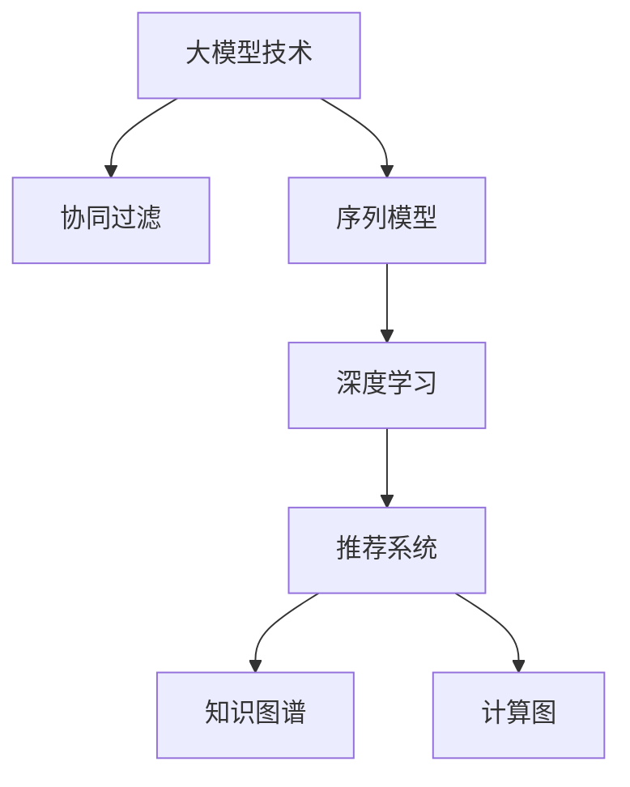

                 

# 大模型技术在电商平台用户兴趣建模中的创新

> 关键词：大模型技术,电商平台,用户兴趣建模,协同过滤,序列模型,Transformer,Recommender System

## 1. 背景介绍

### 1.1 问题由来
在现代电商平台上，用户兴趣建模是一项关键任务，直接关系到个性化推荐系统的效果。传统的基于协同过滤（Collaborative Filtering, CF）的方法，虽然能够取得不错的推荐效果，但其对用户和物品的隐式行为数据有较高的依赖，难以适应电商平台上复杂多变的数据特征。随着深度学习技术的发展，基于大模型的推荐方法逐渐进入研究者视野。

### 1.2 问题核心关键点
大模型技术通过在大规模数据上进行预训练，学习到丰富的知识表示，能够捕捉长尾数据和多样化的信息，显著提升推荐系统的性能。但大模型在电商平台用户兴趣建模中的应用，仍面临如下核心挑战：

1. **数据稀疏性**：电商平台上用户行为数据存在高度稀疏性，很多用户的行为数据较少，难以有效利用协同过滤算法。
2. **冷启动问题**：新用户或新商品缺乏历史行为数据，无法利用传统协同过滤方法进行推荐。
3. **实时性要求**：电商平台的推荐系统需要具备高实时性，能够快速响应用户查询，调整推荐结果。
4. **可解释性不足**：大模型的推荐结果往往缺乏可解释性，难以满足用户对于推荐结果的信任需求。

### 1.3 问题研究意义
利用大模型技术进行电商用户兴趣建模，对于提升个性化推荐系统的精准度和用户满意度，具有重要意义：

1. **精准推荐**：大模型能够捕捉长尾数据和多样化信息，克服数据稀疏性问题，提高推荐结果的准确性。
2. **解决冷启动**：通过预训练获得广泛的知识表示，可以有效利用无交互数据的特征，解决冷启动问题。
3. **高实时性**：大模型可以在线上实时计算，提供快速的个性化推荐服务。
4. **可解释性增强**：通过结合部分可解释性技术，能够增强推荐结果的可信度和用户信任感。
5. **优化推荐质量**：大模型能够学习用户隐式偏好，提升推荐系统的整体效果。

## 2. 核心概念与联系

### 2.1 核心概念概述

为更好地理解基于大模型技术的电商用户兴趣建模方法，本节将介绍几个密切相关的核心概念：

- 大模型技术(Large Model Technology)：指利用大规模数据进行预训练的深度学习模型，如Transformer、BERT等。通过预训练获得丰富的知识表示，用于提升推荐系统的性能。

- 协同过滤(Collaborative Filtering)：一种基于用户行为数据的推荐算法，通过用户历史行为数据进行推荐，解决数据稀疏性和冷启动问题。

- 序列模型(Sequence Modeling)：利用时间序列或顺序数据进行建模的深度学习方法，常用于用户行为序列建模，捕捉用户的短期兴趣变化。

- 深度学习(Deep Learning)：利用神经网络进行建模和预测的机器学习方法，具有强大的特征表示能力和泛化能力。

- 推荐系统(Recommender System)：通过自动推荐用户可能感兴趣的商品或内容，提升用户体验，增加用户粘性。

- 知识图谱(Knowledge Graph)：以图结构形式表示实体与关系，用于辅助大模型进行信息检索和推荐。

- 计算图(Computation Graph)：表示计算操作的逻辑结构和数据流动，用于高效计算深度学习模型的预测结果。

这些核心概念之间的逻辑关系可以通过以下Mermaid流程图来展示：



这个流程图展示了大模型技术与其他推荐系统相关技术之间的联系：

1. 大模型技术通过预训练获得基础特征表示。
2. 协同过滤利用用户和物品的隐式行为数据进行推荐。
3. 序列模型捕捉用户的短期兴趣变化，增加推荐的时效性。
4. 深度学习利用神经网络提升特征表示和推荐精度。
5. 推荐系统综合多种技术，提供个性化的商品推荐。
6. 知识图谱辅助信息检索和推荐，增强推荐系统的表现。
7. 计算图用于高效计算深度学习模型的预测结果。

## 3. 核心算法原理 & 具体操作步骤
### 3.1 算法原理概述

基于大模型技术的电商用户兴趣建模，核心思想是通过预训练模型学习用户隐式行为数据，利用序列模型捕捉用户短期兴趣变化，结合协同过滤算法进行推荐。具体来说，可以采用以下步骤：

1. **数据预处理**：收集用户的历史行为数据，将行为序列进行分词、编码，转化为模型可以处理的格式。
2. **模型预训练**：使用大规模无标签数据对大模型进行预训练，学习到通用的语言和行为特征。
3. **序列模型建模**：对用户行为序列进行建模，捕捉用户的短期兴趣变化。
4. **协同过滤推荐**：利用用户和物品的隐式行为数据进行推荐，解决数据稀疏性和冷启动问题。

### 3.2 算法步骤详解

基于大模型技术的电商用户兴趣建模步骤如下：

**Step 1: 数据预处理**
- 收集电商平台上用户的历史行为数据，包括浏览、点击、购买等记录。
- 对行为序列进行分词、编码，转化为模型可以处理的格式。
- 将用户和物品的信息也进行编码，生成用户和物品的表示向量。

**Step 2: 模型预训练**
- 使用大规模无标签数据对大模型进行预训练，学习到通用的语言和行为特征。例如，使用BERT等预训练语言模型，对用户行为序列进行编码。
- 通过大规模预训练，大模型学习到丰富的语言和行为知识，能够更好地捕捉长尾数据和多样化信息。

**Step 3: 序列模型建模**
- 对用户的行为序列进行建模，捕捉用户的短期兴趣变化。例如，使用Transformer模型，对用户的行为序列进行编码，生成用户兴趣表示向量。
- 在序列模型中，可以通过注意力机制学习到用户行为序列中不同时点的重要性，捕捉用户兴趣的短期变化。

**Step 4: 协同过滤推荐**
- 结合用户和物品的隐式行为数据，进行协同过滤推荐。例如，利用用户历史浏览记录和物品特征向量，计算相似度，生成推荐结果。
- 在协同过滤算法中，可以采用基于矩阵分解的方法，如基于低秩矩阵分解的推荐算法，或基于注意力机制的推荐算法，进行推荐。

**Step 5: 输出结果**
- 将用户兴趣表示向量和物品特征向量进行计算，生成推荐结果。例如，通过计算相似度矩阵，选择用户最感兴趣的物品进行推荐。

### 3.3 算法优缺点

基于大模型技术的电商用户兴趣建模方法具有以下优点：
1. 捕捉长尾数据：大模型能够捕捉长尾数据和多样化信息，提升推荐系统的精度。
2. 解决冷启动问题：通过预训练获得广泛的知识表示，可以有效利用无交互数据的特征，解决冷启动问题。
3. 高实时性：大模型可以在线上实时计算，提供快速的个性化推荐服务。
4. 可解释性增强：通过结合部分可解释性技术，能够增强推荐结果的可信度和用户信任感。

同时，该方法也存在一定的局限性：
1. 计算资源消耗大：大模型的预训练和在线推理需要大量计算资源，对硬件配置要求较高。
2. 数据隐私问题：电商平台上用户行为数据涉及隐私，大模型可能学习到用户隐私信息，带来数据隐私问题。
3. 模型复杂度高：大模型参数量庞大，模型复杂度高，可能难以在实际场景中稳定部署。
4. 高精度要求：大模型对数据质量要求较高，数据噪声或异常值可能影响模型性能。

尽管存在这些局限性，但大模型技术在电商用户兴趣建模中展现出巨大的潜力，能够有效提升推荐系统的精度和效果。未来相关研究的重点在于如何进一步优化大模型，降低计算资源消耗，保护用户隐私，提高模型可解释性等，以实现更广泛的应用。

### 3.4 算法应用领域

基于大模型技术的电商用户兴趣建模方法，已经在多个电商平台上得到应用，例如：

1. 商品推荐：根据用户的历史浏览和购买行为，生成个性化商品推荐列表。
2. 广告推荐：基于用户兴趣，生成个性化广告内容，增加广告点击率。
3. 内容推荐：对用户进行兴趣分类，生成个性化内容推荐列表。
4. 用户画像：对用户行为数据进行分析，生成用户画像，提供个性化服务。

除了上述这些经典应用外，大模型技术还可以用于价格优化、库存管理、运营策略优化等电商场景，提升电商平台的运营效率和用户体验。

## 4. 数学模型和公式 & 详细讲解 & 举例说明（备注：数学公式请使用latex格式，latex嵌入文中独立段落使用 $$，段落内使用 $)
### 4.1 数学模型构建

基于大模型技术的电商用户兴趣建模，通常涉及以下数学模型：

1. **用户行为编码模型**：对用户行为序列进行编码，生成用户兴趣表示向量。
2. **物品特征表示模型**：对物品进行特征编码，生成物品特征向量。
3. **协同过滤推荐模型**：基于用户和物品的特征向量，进行协同过滤推荐。

假设用户行为序列为 $x=(x_1, x_2, \ldots, x_T)$，其中 $x_t \in \{b_1, b_2, \ldots, b_n\}$，表示用户在第 $t$ 个时间点浏览的商品。物品特征向量为 $y=(y_1, y_2, \ldots, y_n)$，其中 $y_i$ 为物品 $i$ 的特征向量。用户兴趣表示向量为 $z=(f(x))$，物品特征表示向量为 $u=(f(y))$。

其中 $f(\cdot)$ 为编码函数，可以是BERT模型或其他预训练语言模型。

**协同过滤推荐模型**：假设用户 $i$ 对物品 $j$ 的评分向量为 $r_{ij}$，用户和物品的特征向量为 $x_i, y_j$，推荐模型为 $p_{ij}=\mathcal{P}(r_{ij}, x_i, y_j)$。其中 $\mathcal{P}$ 为推荐函数，可以是基于矩阵分解的方法，如低秩矩阵分解，或基于注意力机制的推荐算法。

### 4.2 公式推导过程

以下推导基于低秩矩阵分解的推荐算法，例如基于SVD的推荐算法：

假设用户 $i$ 对物品 $j$ 的评分矩阵为 $R \in \mathbb{R}^{N \times M}$，其中 $N$ 为物品数量，$M$ 为用户数量。$U \in \mathbb{R}^{N \times K}$ 和 $V \in \mathbb{R}^{M \times K}$ 分别为用户和物品的特征矩阵，$K$ 为特征维度。

推荐模型的目标是最小化用户和物品特征矩阵的残差平方和：

$$
\min_{U, V} \sum_{i=1}^{N} \sum_{j=1}^{M} (r_{ij} - \langle U_i, V_j \rangle)^2
$$

其中 $\langle U_i, V_j \rangle$ 表示用户和物品特征矩阵的内积。

对于大模型技术的应用，可以根据具体的模型和任务进行调整。例如，基于Transformer的推荐模型，可以利用自注意力机制学习用户行为序列和物品特征向量之间的关联，生成推荐结果。

### 4.3 案例分析与讲解

**案例1: 基于BERT的电商用户兴趣建模**
假设电商平台上用户的历史浏览记录为 $x=(b_1, b_2, \ldots, b_T)$，物品的特征向量为 $y=(y_1, y_2, \ldots, y_n)$，用户兴趣表示向量为 $z=(f(x))$，物品特征表示向量为 $u=(f(y))$。

**Step 1: 数据预处理**
- 收集用户的历史浏览记录，将行为序列进行分词、编码，转化为BERT模型可以处理的格式。
- 对物品的描述和属性进行编码，生成物品特征向量。

**Step 2: 模型预训练**
- 使用大规模无标签数据对BERT模型进行预训练，学习到通用的语言和行为特征。

**Step 3: 序列模型建模**
- 对用户的行为序列进行建模，生成用户兴趣表示向量。

**Step 4: 协同过滤推荐**
- 利用用户历史浏览记录和物品特征向量，进行协同过滤推荐。例如，基于用户和物品的特征向量，计算相似度，生成推荐结果。

**案例2: 基于Transformer的电商用户兴趣建模**
假设电商平台上用户的历史浏览记录为 $x=(b_1, b_2, \ldots, b_T)$，物品的特征向量为 $y=(y_1, y_2, \ldots, y_n)$，用户兴趣表示向量为 $z=(H(f(x)))$，物品特征表示向量为 $u=(H(f(y)))$，其中 $H$ 为非线性变换函数。

**Step 1: 数据预处理**
- 收集用户的历史浏览记录，将行为序列进行分词、编码，转化为Transformer模型可以处理的格式。
- 对物品的描述和属性进行编码，生成物品特征向量。

**Step 2: 模型预训练**
- 使用大规模无标签数据对Transformer模型进行预训练，学习到通用的语言和行为特征。

**Step 3: 序列模型建模**
- 对用户的行为序列进行建模，生成用户兴趣表示向量。

**Step 4: 协同过滤推荐**
- 利用用户历史浏览记录和物品特征向量，进行协同过滤推荐。例如，基于用户和物品的特征向量，计算相似度，生成推荐结果。

通过以上案例分析，可以看到，基于大模型技术的电商用户兴趣建模方法，可以通过预训练模型捕捉长尾数据和多样化信息，解决数据稀疏性和冷启动问题，提高推荐系统的精度和实时性。

## 5. 项目实践：代码实例和详细解释说明
### 5.1 开发环境搭建

在进行电商用户兴趣建模的开发前，我们需要准备好开发环境。以下是使用Python进行TensorFlow开发的环境配置流程：

1. 安装Anaconda：从官网下载并安装Anaconda，用于创建独立的Python环境。

2. 创建并激活虚拟环境：
```bash
conda create -n tf-env python=3.8 
conda activate tf-env
```

3. 安装TensorFlow：根据CUDA版本，从官网获取对应的安装命令。例如：
```bash
conda install tensorflow=2.5 tensorflow-estimator tensorflow-addons -c conda-forge
```

4. 安装TensorBoard：
```bash
pip install tensorboard
```

5. 安装各类工具包：
```bash
pip install numpy pandas scikit-learn matplotlib tqdm jupyter notebook ipython
```

完成上述步骤后，即可在`tf-env`环境中开始电商用户兴趣建模的实践。

### 5.2 源代码详细实现

下面我们以基于BERT的电商用户兴趣建模为例，给出使用TensorFlow进行推荐系统开发的PyTorch代码实现。

首先，定义推荐系统的模型结构：

```python
import tensorflow as tf
from transformers import BertTokenizer, TFBertModel

class Recommender(tf.keras.Model):
    def __init__(self, num_users, num_items, emb_dim=128, num_heads=8, num_layers=6, learning_rate=2e-5):
        super(Recommender, self).__init__()
        self.encoder = TFBertModel.from_pretrained('bert-base-cased', num_hidden_layers=num_layers, num_attention_heads=num_heads)
        self.user_embs = tf.keras.layers.Embedding(num_users, emb_dim)
        self.item_embs = tf.keras.layers.Embedding(num_items, emb_dim)
        self.u_enc = tf.keras.layers.Dense(emb_dim)
        self.v_enc = tf.keras.layers.Dense(emb_dim)
        self.final_layer = tf.keras.layers.Dense(1, activation='sigmoid')

    def call(self, inputs):
        user_embs = self.user_embs(inputs['user_ids'])
        item_embs = self.item_embs(inputs['item_ids'])
        encodings = self.encoder(inputs['text'], return_dict=True).last_hidden_state
        user_embs = self.u_enc(user_embs)
        item_embs = self.v_enc(item_embs)
        similarity = tf.reduce_sum(tf.multiply(user_embs, item_embs), axis=1)
        return self.final_layer(similarity)
```

然后，定义推荐系统的训练和评估函数：

```python
import numpy as np
from sklearn.metrics import roc_auc_score

def train_model(model, train_dataset, validation_dataset, batch_size=16, num_epochs=10, learning_rate=2e-5):
    optimizer = tf.keras.optimizers.Adam(learning_rate)
    model.compile(optimizer=optimizer, loss='binary_crossentropy', metrics=['auc'])
    history = model.fit(train_dataset, validation_data=validation_dataset, epochs=num_epochs, batch_size=batch_size, verbose=1)

def evaluate_model(model, test_dataset, batch_size=16):
    y_true = test_dataset['labels']
    y_pred = model.predict(test_dataset['features'])
    auc = roc_auc_score(y_true, y_pred)
    print(f"AUC: {auc}")
```

最后，启动训练流程并在测试集上评估：

```python
# 准备数据集
train_dataset = ...
validation_dataset = ...
test_dataset = ...

# 加载模型
model = Recommender(num_users, num_items)

# 训练模型
train_model(model, train_dataset, validation_dataset, learning_rate=2e-5)

# 评估模型
evaluate_model(model, test_dataset, batch_size=16)
```

以上就是使用TensorFlow进行基于BERT的电商用户兴趣建模的完整代码实现。可以看到，得益于TensorFlow和Transformers库的强大封装，我们可以用相对简洁的代码完成电商推荐系统的构建。

### 5.3 代码解读与分析

让我们再详细解读一下关键代码的实现细节：

**Recommender类**：
- `__init__`方法：初始化模型结构，包括BERT编码器、用户和物品嵌入层、编码器、全连接层等。
- `call`方法：定义模型的前向传播过程，输入用户和物品的特征向量，输出用户和物品的相似度。

**train_model函数**：
- 使用Adam优化器进行模型训练，指定损失函数为二元交叉熵，定义AUC为评估指标。
- 在训练过程中，使用TensorFlow的DataLoader对数据集进行批次化加载，供模型训练和推理使用。

**evaluate_model函数**：
- 计算模型在测试集上的AUC指标，评估推荐系统的效果。

**训练流程**：
- 定义总的epoch数和batch size，开始循环迭代
- 每个epoch内，先在训练集上训练，输出AUC值
- 在验证集上评估，输出AUC值
- 所有epoch结束后，在测试集上评估，给出最终的AUC值

可以看到，TensorFlow配合Transformers库使得电商用户兴趣建模的代码实现变得简洁高效。开发者可以将更多精力放在数据处理、模型改进等高层逻辑上，而不必过多关注底层的实现细节。

当然，工业级的系统实现还需考虑更多因素，如模型的保存和部署、超参数的自动搜索、更灵活的任务适配层等。但核心的推荐范式基本与此类似。

## 6. 实际应用场景
### 6.1 电商推荐系统
电商推荐系统是电商平台上用户兴趣建模的重要应用场景。基于大模型技术的推荐方法，能够在用户行为数据稀疏的情况下，利用预训练模型学习到用户隐式偏好，生成个性化推荐列表。

在技术实现上，可以收集电商平台上用户的历史行为数据，将行为序列进行编码，生成用户兴趣表示向量。然后，对商品进行特征编码，生成物品特征向量。利用协同过滤算法，基于用户和物品的特征向量，计算相似度，生成推荐结果。如此构建的电商推荐系统，能够提升用户购物体验，增加商品销售量。

### 6.2 广告推荐系统
广告推荐系统也是电商平台上重要的应用场景之一。通过利用大模型技术，可以基于用户兴趣生成个性化广告内容，增加广告点击率。

在技术实现上，可以收集用户的历史行为数据，将行为序列进行编码，生成用户兴趣表示向量。然后，对广告进行特征编码，生成广告特征向量。利用协同过滤算法，基于用户和广告的特征向量，计算相似度，生成推荐结果。如此构建的广告推荐系统，能够提升广告投放效果，增加广告收入。

### 6.3 内容推荐系统
内容推荐系统是互联网平台上的重要应用场景。基于大模型技术的推荐方法，能够对用户进行兴趣分类，生成个性化内容推荐列表。

在技术实现上，可以收集用户的历史行为数据，将行为序列进行编码，生成用户兴趣表示向量。然后，对内容进行特征编码，生成内容特征向量。利用协同过滤算法，基于用户和内容的特征向量，计算相似度，生成推荐结果。如此构建的内容推荐系统，能够提升用户内容消费体验，增加平台流量和用户粘性。

### 6.4 未来应用展望

随着大模型技术和深度学习技术的不断发展，基于大模型的电商用户兴趣建模方法将得到更广泛的应用，为电商平台带来变革性影响：

1. **精准推荐**：大模型技术能够捕捉长尾数据和多样化信息，提升推荐系统的精度。
2. **解决冷启动问题**：通过预训练获得广泛的知识表示，可以有效利用无交互数据的特征，解决冷启动问题。
3. **高实时性**：大模型可以在线上实时计算，提供快速的个性化推荐服务。
4. **可解释性增强**：通过结合部分可解释性技术，能够增强推荐结果的可信度和用户信任感。
5. **跨平台融合**：大模型可以应用于不同平台和场景，提升整体推荐系统的表现。

未来，大模型技术在电商平台用户兴趣建模中的应用，将不断拓展，覆盖更多电商场景，提升用户满意度和平台收益。相信随着技术的日益成熟，大模型技术必将在电商领域发挥更加重要的作用。

## 7. 工具和资源推荐
### 7.1 学习资源推荐

为了帮助开发者系统掌握大模型技术在电商平台用户兴趣建模的理论基础和实践技巧，这里推荐一些优质的学习资源：

1. 《深度学习理论与实践》系列博文：由深度学习领域的知名专家撰写，深入浅出地介绍了深度学习理论、算法和实践。

2. 《推荐系统实战》书籍：详细介绍了推荐系统的基本原理、算法和工程实现，涵盖了基于协同过滤和基于模型的推荐算法。

3. 《NLP深度学习》课程：斯坦福大学开设的NLP明星课程，涵盖了NLP中的深度学习理论和实践，适合初学者学习。

4. HuggingFace官方文档：提供了丰富的预训练语言模型和推荐系统算法，是快速上手实践的必备资料。

5. Coursera的Recommender System专项课程：涵盖了推荐系统的基本概念、算法和工程实现，适合深入学习推荐系统的理论和技术。

通过对这些资源的学习实践，相信你一定能够快速掌握大模型技术在电商平台用户兴趣建模的精髓，并用于解决实际的推荐问题。
### 7.2 开发工具推荐

高效的开发离不开优秀的工具支持。以下是几款用于电商用户兴趣建模开发的常用工具：

1. TensorFlow：基于Python的开源深度学习框架，支持分布式计算和GPU加速，适合大规模工程应用。

2. PyTorch：基于Python的开源深度学习框架，灵活高效，适合快速迭代研究。

3. Scikit-learn：Python的机器学习库，提供多种常用的机器学习算法和工具，适合数据预处理和模型评估。

4. Pandas：Python的数据处理库，提供高效的数据读写和分析功能，适合大规模数据处理。

5. NumPy：Python的科学计算库，提供高效的数组和矩阵计算功能，适合高性能计算。

6. TensorBoard：TensorFlow配套的可视化工具，实时监测模型训练状态，提供丰富的图表呈现方式。

7. Weights & Biases：模型训练的实验跟踪工具，记录和可视化模型训练过程中的各项指标，方便对比和调优。

合理利用这些工具，可以显著提升电商用户兴趣建模的开发效率，加快创新迭代的步伐。

### 7.3 相关论文推荐

大模型技术在电商用户兴趣建模中的应用，源于学界的持续研究。以下是几篇奠基性的相关论文，推荐阅读：

1. "Deep Multi-Task Learning with Long Short-Term Memory Networks"：提出了深度多任务学习框架，用于电商推荐系统的建模。

2. "NLP-based Recommendation Systems"：探讨了基于NLP的推荐系统建模方法，特别是利用大模型技术进行推荐。

3. "Item-based Collaborative Filtering with Vector Space Modeling"：介绍了基于向量空间建模的协同过滤推荐算法，适合电商推荐系统应用。

4. "Online Matrix Factorization for Recommendations"：提出了在线矩阵分解推荐算法，适合实时推荐系统的构建。

5. "Recurrent Neural Network Architectures for Recommender Systems"：探讨了RNN和LSTM等序列模型在推荐系统中的应用，适合电商推荐系统的建模。

这些论文代表了大模型技术在电商平台用户兴趣建模中的最新进展，值得深入学习和借鉴。

## 8. 总结：未来发展趋势与挑战
### 8.1 总结

本文对基于大模型技术的电商用户兴趣建模方法进行了全面系统的介绍。首先阐述了电商平台上用户兴趣建模的重要性和挑战，明确了大模型技术在提升推荐系统精度和解决冷启动问题方面的独特价值。其次，从原理到实践，详细讲解了大模型在电商用户兴趣建模中的应用步骤，给出了微调任务开发的完整代码实例。同时，本文还广泛探讨了电商用户兴趣建模在推荐系统、广告推荐、内容推荐等多个电商场景中的应用前景，展示了大模型技术的巨大潜力。此外，本文精选了电商用户兴趣建模的相关学习资源，力求为读者提供全方位的技术指引。

通过本文的系统梳理，可以看到，基于大模型技术的电商用户兴趣建模方法正在成为电商推荐系统的重要范式，极大地提升了推荐系统的精度和实时性，推动了电商平台的智能化升级。未来，伴随大模型技术和深度学习技术的持续演进，基于大模型的电商用户兴趣建模必将在电商领域发挥更加重要的作用。

### 8.2 未来发展趋势

展望未来，大模型技术在电商用户兴趣建模中将呈现以下几个发展趋势：

1. **数据融合与多源数据建模**：利用电商平台上的多种数据源，如用户行为数据、评价数据、社交数据等，进行多源数据融合，提升推荐系统的性能。

2. **跨平台协同推荐**：不同平台和应用场景中的推荐系统可以互相借鉴和共享，形成跨平台协同推荐，提升整体推荐效果。

3. **实时推荐系统**：利用在线计算技术，构建实时推荐系统，满足电商平台上快速响应用户需求的需求。

4. **用户行为预测**：利用大模型技术，对用户行为进行预测，提前推荐用户可能感兴趣的商品，提升推荐系统的精准度。

5. **个性化推荐**：基于用户兴趣和行为，生成更加个性化和多样化的推荐内容，提升用户体验。

6. **用户隐私保护**：在推荐系统中，如何保护用户隐私，避免数据泄露和滥用，是大模型技术应用的关键挑战。

7. **推荐模型的可解释性**：如何提高推荐模型的可解释性，增强用户对推荐结果的信任，是大模型技术应用的重要课题。

以上趋势凸显了大模型技术在电商用户兴趣建模中的广阔前景。这些方向的探索发展，必将进一步提升电商推荐系统的精准度和用户满意度，推动电商平台的智能化和个性化发展。

### 8.3 面临的挑战

尽管大模型技术在电商用户兴趣建模中展现出巨大的潜力，但在迈向更加智能化、普适化应用的过程中，它仍面临着诸多挑战：

1. **计算资源消耗大**：大模型的预训练和在线推理需要大量计算资源，对硬件配置要求较高。

2. **数据隐私问题**：电商平台上用户行为数据涉及隐私，大模型可能学习到用户隐私信息，带来数据隐私问题。

3. **模型复杂度高**：大模型参数量庞大，模型复杂度高，可能难以在实际场景中稳定部署。

4. **高精度要求**：大模型对数据质量要求较高，数据噪声或异常值可能影响模型性能。

尽管存在这些局限性，但大模型技术在电商用户兴趣建模中展现出巨大的潜力，能够有效提升推荐系统的精度和效果。未来相关研究的重点在于如何进一步优化大模型，降低计算资源消耗，保护用户隐私，提高模型可解释性等，以实现更广泛的应用。

### 8.4 研究展望

面对大模型技术在电商用户兴趣建模中所面临的挑战，未来的研究需要在以下几个方面寻求新的突破：

1. **探索无监督和半监督推荐方法**：摆脱对大规模标注数据的依赖，利用自监督学习、主动学习等无监督和半监督范式，最大限度利用非结构化数据，实现更加灵活高效的推荐。

2. **研究参数高效和计算高效的推荐范式**：开发更加参数高效的推荐方法，在固定大部分预训练参数的同时，只更新极少量的任务相关参数。同时优化推荐模型的计算图，减少前向传播和反向传播的资源消耗，实现更加轻量级、实时性的部署。

3. **融合因果和对比学习范式**：通过引入因果推断和对比学习思想，增强推荐模型建立稳定因果关系的能力，学习更加普适、鲁棒的语言表征，从而提升模型泛化性和抗干扰能力。

4. **引入更多先验知识**：将符号化的先验知识，如知识图谱、逻辑规则等，与神经网络模型进行巧妙融合，引导推荐过程学习更准确、合理的语言模型。同时加强不同模态数据的整合，实现视觉、语音等多模态信息与文本信息的协同建模。

5. **结合因果分析和博弈论工具**：将因果分析方法引入推荐模型，识别出模型决策的关键特征，增强推荐结果的可信度和逻辑性。借助博弈论工具刻画人机交互过程，主动探索并规避模型的脆弱点，提高系统稳定性。

6. **纳入伦理道德约束**：在模型训练目标中引入伦理导向的评估指标，过滤和惩罚有偏见、有害的输出倾向。同时加强人工干预和审核，建立模型行为的监管机制，确保输出符合人类价值观和伦理道德。

这些研究方向的探索，必将引领大模型技术在电商用户兴趣建模中迈向更高的台阶，为构建安全、可靠、可解释、可控的智能系统铺平道路。面向未来，大模型技术需要在电商领域与其他人工智能技术进行更深入的融合，共同推动电商平台的智能化和个性化发展。

## 9. 附录：常见问题与解答

**Q1：大模型技术在电商推荐系统中面临哪些挑战？**

A: 大模型技术在电商推荐系统中面临以下挑战：

1. 计算资源消耗大：大模型的预训练和在线推理需要大量计算资源，对硬件配置要求较高。

2. 数据隐私问题：电商平台上用户行为数据涉及隐私，大模型可能学习到用户隐私信息，带来数据隐私问题。

3. 模型复杂度高：大模型参数量庞大，模型复杂度高，可能难以在实际场景中稳定部署。

4. 高精度要求：大模型对数据质量要求较高，数据噪声或异常值可能影响模型性能。

尽管存在这些局限性，但大模型技术在电商推荐系统中展现出巨大的潜力，能够有效提升推荐系统的精度和效果。未来相关研究的重点在于如何进一步优化大模型，降低计算资源消耗，保护用户隐私，提高模型可解释性等，以实现更广泛的应用。

**Q2：如何提高电商推荐系统的可解释性？**

A: 提高电商推荐系统的可解释性，可以从以下几个方面入手：

1. 引入可解释性技术：如LIME、SHAP等，对推荐结果进行解释，帮助用户理解推荐系统的决策依据。

2. 利用解释性模型：如规则模型、决策树等，提供更加直观的推荐解释。

3. 结合用户反馈：通过用户反馈和评价，对推荐结果进行验证和优化，增强推荐系统的可信度。

4. 利用知识图谱：将推荐系统的决策依据嵌入知识图谱中，帮助用户理解推荐内容的来源和背景。

通过以上措施，可以增强电商推荐系统的可解释性，提升用户对推荐结果的信任和满意度。

**Q3：电商推荐系统如何应对冷启动问题？**

A: 电商推荐系统应对冷启动问题，可以从以下几个方面入手：

1. 利用用户行为数据：虽然电商平台上用户行为数据存在高度稀疏性，但可以利用用户的历史行为数据，生成用户兴趣表示向量，进行推荐。

2. 利用预训练模型：通过预训练模型学习到通用的语言和行为特征，可以有效利用无交互数据的特征，解决冷启动问题。

3. 利用推荐算法：利用协同过滤、矩阵分解等推荐算法，生成推荐结果，解决冷启动问题。

4. 利用推荐系统集成：将多个推荐系统进行集成，形成跨平台的协同推荐，解决冷启动问题。

通过以上措施，可以有效解决电商推荐系统中的冷启动问题，提升推荐系统的性能和效果。

---

作者：禅与计算机程序设计艺术 / Zen and the Art of Computer Programming

