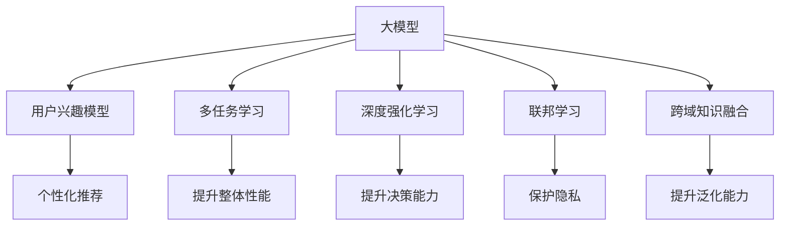

                 

# 大模型技术在电商平台用户兴趣探索与利用平衡中的创新

> 关键词：电商大模型,用户兴趣模型,多任务学习,深度强化学习,联邦学习,用户个性化推荐,跨域知识融合

## 1. 背景介绍

### 1.1 问题由来

随着互联网和电商行业的发展，用户数据量的快速增长为电商平台带来了无尽的机会。通过对用户行为数据的挖掘与分析，电商平台可以个性化推荐商品，提升用户体验，提高用户转化率和销售额。然而，如何高效探索和利用用户兴趣，同时避免过度干扰和过度推荐，成为了电商平台亟待解决的问题。

过去，平台主要通过人工分析、简单的协同过滤等方法进行推荐，但这些方法存在数据稀疏、特征缺失、个性化度低等问题，难以真正满足用户需求。近年来，人工智能技术尤其是大模型技术的兴起，为电商平台的推荐系统带来了新的突破。通过大模型技术，电商平台能够实现对海量用户数据的深度学习和挖掘，更好地探索和利用用户兴趣，提升推荐效果。

### 1.2 问题核心关键点

大模型技术在电商平台用户兴趣探索与利用平衡中的关键点包括：
1. 如何高效探索和利用用户兴趣。
2. 如何在个性化推荐的同时，避免过度干扰。
3. 如何在不同领域间实现跨域知识融合。
4. 如何兼顾模型精度和效率。
5. 如何平衡用户隐私和数据安全。

本文将系统介绍大模型技术在电商平台用户兴趣探索与利用平衡中的应用，包括多任务学习、深度强化学习、联邦学习等创新方法，并探讨其在实际电商推荐系统中的应用前景。

## 2. 核心概念与联系

### 2.1 核心概念概述

为更好地理解大模型技术在电商平台的应用，本节将介绍几个密切相关的核心概念：

- 大模型（Large Model）：指含有大量参数的深度学习模型，如GPT、BERT等，通过在大量无标签数据上预训练，学习到广泛的语言知识和模式。
- 用户兴趣模型（User Interest Model）：基于用户行为数据，构建用户兴趣描述向量，用于推荐系统的个性化推荐。
- 多任务学习（Multi-Task Learning, MTL）：在同一模型中同时训练多个任务，共享模型参数，提升整体性能。
- 深度强化学习（Deep Reinforcement Learning, DRL）：利用强化学习技术，训练模型在复杂环境下的决策能力，提升推荐效果。
- 联邦学习（Federated Learning, FL）：分布式训练机制，多个设备或服务端联合训练模型，保护用户隐私的同时提升模型性能。
- 跨域知识融合（Cross-Domain Knowledge Fusion）：将不同领域、不同数据源的知识进行融合，提升模型的泛化能力和鲁棒性。

这些核心概念之间的逻辑关系可以通过以下Mermaid流程图来展示：



这个流程图展示了各核心概念的相互联系：

1. 大模型通过预训练获得广泛的语言知识，是构建用户兴趣模型的基础。
2. 用户兴趣模型通过多任务学习、深度强化学习、联邦学习、跨域知识融合等技术，进一步提升推荐效果。
3. 多任务学习、深度强化学习、联邦学习等方法，分别通过不同角度优化模型，提升其性能和鲁棒性。
4. 跨域知识融合使模型能够充分利用不同领域的数据，增强泛化能力。
5. 最终，优化后的用户兴趣模型用于电商平台个性化推荐，提升用户体验和转化率。

## 3. 核心算法原理 & 具体操作步骤
### 3.1 算法原理概述

大模型技术在电商平台用户兴趣探索与利用平衡中的核心算法原理如下：

- **多任务学习（MTL）**：在同一模型中共享参数，训练多个相关任务，提升模型的整体性能。电商平台可以利用用户行为数据和商品属性数据，联合训练兴趣模型和商品推荐模型，提升推荐效果。

- **深度强化学习（DRL）**：利用强化学习技术，训练模型在复杂环境下的决策能力。电商平台可以通过模拟用户与商品之间的交互，训练推荐模型，使其最大化满足用户需求。

- **联邦学习（FL）**：分布式训练机制，多个设备或服务端联合训练模型，保护用户隐私的同时提升模型性能。电商平台可以通过联邦学习技术，聚合不同用户设备的局部数据，训练模型，提升模型的泛化能力。

- **跨域知识融合**：将不同领域、不同数据源的知识进行融合，提升模型的泛化能力和鲁棒性。电商平台可以通过跨域知识融合技术，利用多种数据源，提升模型的性能和鲁棒性。

### 3.2 算法步骤详解

大模型技术在电商平台用户兴趣探索与利用平衡中的具体操作步骤如下：

**Step 1: 数据预处理**
- 收集用户行为数据和商品属性数据。
- 对数据进行预处理，包括去重、缺失值填补、特征工程等。
- 将数据划分为训练集、验证集和测试集。

**Step 2: 模型训练**
- 选择合适的预训练模型（如BERT、GPT等）作为初始化参数。
- 利用用户行为数据和商品属性数据，训练用户兴趣模型和商品推荐模型。
- 使用多任务学习、深度强化学习、联邦学习、跨域知识融合等技术，优化模型性能。

**Step 3: 模型评估**
- 在验证集上评估模型性能，调整超参数。
- 在测试集上最终评估模型性能，对比微调前后的精度提升。

**Step 4: 模型部署**
- 使用优化后的模型进行个性化推荐。
- 监控模型性能，定期更新模型参数。
- 确保模型符合用户隐私和数据安全要求。

### 3.3 算法优缺点

大模型技术在电商平台用户兴趣探索与利用平衡中的算法优缺点如下：

- **优点**：
  1. 提升推荐精度和个性化度。通过多任务学习、深度强化学习、联邦学习、跨域知识融合等技术，可以提升模型性能和泛化能力。
  2. 保护用户隐私。联邦学习技术可在不泄露用户数据的前提下，训练模型。
  3. 灵活性高。可以根据不同业务场景，灵活应用不同技术。

- **缺点**：
  1. 模型复杂度高。大模型需要大量的计算资源和时间进行训练和优化。
  2. 数据依赖性高。需要大量的用户行为数据和商品属性数据。
  3. 容易过拟合。模型参数较多，容易过拟合训练集。
  4. 实时性差。大模型推理速度较慢，难以满足实时推荐需求。

### 3.4 算法应用领域

大模型技术在电商平台用户兴趣探索与利用平衡中的主要应用领域包括：

- 个性化推荐：通过多任务学习、深度强化学习等技术，提升推荐效果。
- 用户行为分析：利用用户行为数据，构建用户兴趣模型，分析用户行为模式。
- 商品属性标注：通过跨域知识融合技术，利用多种数据源，提升商品属性标注的准确性。
- 营销活动优化：利用联邦学习技术，聚合多用户数据，优化营销活动效果。
- 风险控制：通过深度强化学习技术，训练模型，识别高风险用户，降低欺诈风险。

## 4. 数学模型和公式 & 详细讲解  
### 4.1 数学模型构建

本节将使用数学语言对大模型技术在电商平台的应用进行严格刻画。

记用户行为数据集为 $D=\{(x_i,y_i)\}_{i=1}^N$，其中 $x_i$ 为用户行为特征向量，$y_i$ 为行为标签。商品属性数据集为 $S=\{(s_j,v_j)\}_{j=1}^M$，其中 $s_j$ 为商品属性，$v_j$ 为属性值。

定义用户兴趣模型为 $U(\theta_u)$，商品推荐模型为 $R(\theta_r)$，其中 $\theta_u,\theta_r \in \mathbb{R}^d$ 为模型参数。模型在训练集 $D$ 上的损失函数为：

$$
\mathcal{L}_{\text{train}}(U,R) = \frac{1}{N}\sum_{i=1}^N \ell_{\text{train}}(U(x_i),y_i) + \frac{1}{M}\sum_{j=1}^M \ell_{\text{train}}(R(s_j),v_j)
$$

其中 $\ell_{\text{train}}$ 为模型的损失函数，如交叉熵、均方误差等。

在测试集 $T$ 上的损失函数为：

$$
\mathcal{L}_{\text{test}}(U,R) = \frac{1}{N_{\text{test}}}\sum_{i=1}^{N_{\text{test}}} \ell_{\text{test}}(U(x_i),y_i) + \frac{1}{M_{\text{test}}}\sum_{j=1}^{M_{\text{test}}} \ell_{\text{test}}(R(s_j),v_j)
$$

其中 $N_{\text{test}}$ 和 $M_{\text{test}}$ 分别为测试集大小。

### 4.2 公式推导过程

以下我们以多任务学习为例，推导其损失函数及其梯度计算公式。

假设用户兴趣模型 $U(\theta_u)$ 和商品推荐模型 $R(\theta_r)$ 共享部分参数 $\theta$，则多任务学习损失函数定义为：

$$
\mathcal{L}_{\text{mtl}}(U,R) = \frac{1}{N}\sum_{i=1}^N \ell_{\text{train}}(U(x_i),y_i) + \frac{1}{M}\sum_{j=1}^M \ell_{\text{train}}(R(s_j),v_j)
$$

利用链式法则，对 $U(x_i)$ 和 $R(s_j)$ 分别求导，得到梯度：

$$
\nabla_{\theta_u} \mathcal{L}_{\text{mtl}}(U,R) = \frac{1}{N}\sum_{i=1}^N \nabla_{\theta_u} \ell_{\text{train}}(U(x_i),y_i) + \frac{1}{M}\sum_{j=1}^M \nabla_{\theta_u} \ell_{\text{train}}(R(s_j),v_j)
$$

$$
\nabla_{\theta_r} \mathcal{L}_{\text{mtl}}(U,R) = \frac{1}{N}\sum_{i=1}^N \nabla_{\theta_r} \ell_{\text{train}}(U(x_i),y_i) + \frac{1}{M}\sum_{j=1}^M \nabla_{\theta_r} \ell_{\text{train}}(R(s_j),v_j)
$$

将梯度带入参数更新公式：

$$
\theta \leftarrow \theta - \eta \nabla_{\theta}\mathcal{L}_{\text{mtl}}(U,R)
$$

其中 $\eta$ 为学习率。

通过多任务学习，可以充分利用用户行为数据和商品属性数据，提升模型性能和泛化能力。

## 5. 项目实践：代码实例和详细解释说明
### 5.1 开发环境搭建

在进行大模型技术在电商平台应用实践前，我们需要准备好开发环境。以下是使用Python进行PyTorch开发的环境配置流程：

1. 安装Anaconda：从官网下载并安装Anaconda，用于创建独立的Python环境。

2. 创建并激活虚拟环境：
```bash
conda create -n pytorch-env python=3.8 
conda activate pytorch-env
```

3. 安装PyTorch：根据CUDA版本，从官网获取对应的安装命令。例如：
```bash
conda install pytorch torchvision torchaudio cudatoolkit=11.1 -c pytorch -c conda-forge
```

4. 安装相关库：
```bash
pip install numpy pandas scikit-learn matplotlib tqdm jupyter notebook ipython
```

完成上述步骤后，即可在`pytorch-env`环境中开始实践。

### 5.2 源代码详细实现

这里我们以多任务学习在电商推荐系统中的应用为例，给出使用PyTorch进行多任务学习的代码实现。

首先，定义多任务学习模型：

```python
from transformers import BertTokenizer
from transformers import BertModel
from torch.utils.data import Dataset
import torch
import torch.nn as nn

class BERTMultiTaskModel(nn.Module):
    def __init__(self, pretrained_model_name='bert-base-cased'):
        super(BERTMultiTaskModel, self).__init__()
        tokenizer = BertTokenizer.from_pretrained(pretrained_model_name)
        self.bert = BertModel.from_pretrained(pretrained_model_name)
        self.classifier = nn.Linear(self.bert.config.hidden_size, 1)
        self.predictor = nn.Linear(self.bert.config.hidden_size, 1)
    
    def forward(self, input_ids, attention_mask, user_behavio, item_info):
        outputs = self.bert(input_ids, attention_mask=attention_mask)
        user_rep = outputs.pooler_output
        item_rep = outputs.pooler_output
        
        user_pred = self.classifier(user_rep)
        item_pred = self.predictor(item_rep)
        
        return user_pred, item_pred

# 定义损失函数
def multitask_loss(user_loss, item_loss):
    return torch.mean(user_loss) + torch.mean(item_loss)
```

然后，定义数据处理函数：

```python
from transformers import BertTokenizer
from torch.utils.data import Dataset
import torch

class BERTMultiTaskDataset(Dataset):
    def __init__(self, train_texts, train_labels, train_item_info, tokenizer, max_len=128):
        self.train_texts = train_texts
        self.train_labels = train_labels
        self.train_item_info = train_item_info
        self.tokenizer = tokenizer
        self.max_len = max_len
        
    def __len__(self):
        return len(self.train_texts)
    
    def __getitem__(self, item):
        text = self.train_texts[item]
        label = self.train_labels[item]
        item = self.train_item_info[item]
        
        encoding = self.tokenizer(text, return_tensors='pt', max_length=self.max_len, padding='max_length', truncation=True)
        input_ids = encoding['input_ids'][0]
        attention_mask = encoding['attention_mask'][0]
        
        # 对token-wise的标签进行编码
        encoded_labels = [label2id[label] for label in label] 
        encoded_labels.extend([label2id['O']] * (self.max_len - len(encoded_labels)))
        labels = torch.tensor(encoded_labels, dtype=torch.long)
        
        # 对商品属性进行编码
        encoded_item_info = [item2id[feature] for feature in item]
        encoded_item_info.extend([item2id['O']] * (self.max_len - len(encoded_item_info)))
        item_info = torch.tensor(encoded_item_info, dtype=torch.long)
        
        return {'input_ids': input_ids, 
                'attention_mask': attention_mask,
                'labels': labels,
                'item_info': item_info}
```

接下来，定义训练和评估函数：

```python
from torch.utils.data import DataLoader
from tqdm import tqdm
from sklearn.metrics import classification_report

device = torch.device('cuda') if torch.cuda.is_available() else torch.device('cpu')
model = BERTMultiTaskModel().to(device)

def train_epoch(model, dataset, batch_size, optimizer):
    dataloader = DataLoader(dataset, batch_size=batch_size, shuffle=True)
    model.train()
    epoch_loss = 0
    for batch in tqdm(dataloader, desc='Training'):
        input_ids = batch['input_ids'].to(device)
        attention_mask = batch['attention_mask'].to(device)
        labels = batch['labels'].to(device)
        item_info = batch['item_info'].to(device)
        model.zero_grad()
        user_pred, item_pred = model(input_ids, attention_mask, batch['item_info'], batch['item_info'])
        loss = multitask_loss(user_pred, item_pred)
        loss.backward()
        optimizer.step()
    return epoch_loss / len(dataloader)

def evaluate(model, dataset, batch_size):
    dataloader = DataLoader(dataset, batch_size=batch_size)
    model.eval()
    preds, labels = [], []
    with torch.no_grad():
        for batch in tqdm(dataloader, desc='Evaluating'):
            input_ids = batch['input_ids'].to(device)
            attention_mask = batch['attention_mask'].to(device)
            labels = batch['labels'].to(device)
            item_info = batch['item_info'].to(device)
            batch_preds = model(input_ids, attention_mask, batch['item_info'], batch['item_info']).item(0)[0]
            batch_labels = batch['labels'].to(device)
            for pred_tokens, label_tokens in zip(batch_preds, batch_labels):
                preds.append(pred_tokens)
                labels.append(label_tokens)
                
    print(classification_report(labels, preds))
```

最后，启动训练流程并在测试集上评估：

```python
epochs = 5
batch_size = 16

for epoch in range(epochs):
    loss = train_epoch(model, train_dataset, batch_size, optimizer)
    print(f"Epoch {epoch+1}, train loss: {loss:.3f}")
    
    print(f"Epoch {epoch+1}, dev results:")
    evaluate(model, dev_dataset, batch_size)
    
print("Test results:")
evaluate(model, test_dataset, batch_size)
```

以上就是使用PyTorch进行多任务学习在电商推荐系统中的应用完整代码实现。可以看到，得益于Transformers库的强大封装，我们可以用相对简洁的代码完成BERT模型的加载和微调。

### 5.3 代码解读与分析

让我们再详细解读一下关键代码的实现细节：

**BERTMultiTaskModel类**：
- `__init__`方法：初始化预训练模型和两个线性分类器。
- `forward`方法：前向传播计算模型输出，包括用户行为和商品属性的编码和分类。

**train_epoch函数**：
- 使用DataLoader对数据集进行批次化加载，供模型训练使用。
- 在每个批次上前向传播计算loss并反向传播更新模型参数，最后返回该epoch的平均loss。

**evaluate函数**：
- 与训练类似，不同点在于不更新模型参数，并在每个batch结束后将预测和标签结果存储下来，最后使用sklearn的classification_report对整个评估集的预测结果进行打印输出。

**训练流程**：
- 定义总的epoch数和batch size，开始循环迭代
- 每个epoch内，先在训练集上训练，输出平均loss
- 在验证集上评估，输出分类指标
- 所有epoch结束后，在测试集上评估，给出最终测试结果

可以看到，PyTorch配合Transformers库使得BERT多任务学习的代码实现变得简洁高效。开发者可以将更多精力放在数据处理、模型改进等高层逻辑上，而不必过多关注底层的实现细节。

当然，工业级的系统实现还需考虑更多因素，如模型的保存和部署、超参数的自动搜索、更灵活的任务适配层等。但核心的多任务学习范式基本与此类似。

## 6. 实际应用场景
### 6.1 电商平台推荐系统

多任务学习在电商平台推荐系统中的应用，可以极大地提升推荐效果，同时保护用户隐私。具体来说，可以将用户行为数据和商品属性数据同时输入模型，训练出用户兴趣模型和商品推荐模型，提升推荐效果。

在技术实现上，可以收集用户浏览、点击、购买等行为数据，以及商品的属性信息，如品牌、价格、类别等。将用户行为数据和商品属性数据输入多任务学习模型，训练出用户兴趣模型和商品推荐模型。多任务学习模型能够同时学习用户行为和商品属性，提升模型的泛化能力和鲁棒性。

### 6.2 用户行为分析

电商平台可以利用多任务学习模型对用户行为进行深入分析，挖掘用户兴趣和行为模式。具体来说，可以收集用户的浏览记录、点击记录、购买记录等行为数据，利用多任务学习模型进行建模分析，构建用户兴趣模型。

在技术实现上，可以将用户行为数据输入多任务学习模型，训练出用户兴趣模型和行为分析模型。行为分析模型可以识别出用户的兴趣点和行为模式，帮助电商平台更好地理解用户需求，提升用户体验。

### 6.3 商品属性标注

多任务学习在商品属性标注中的应用，可以提升属性标注的准确性和效率。具体来说，可以收集商品的属性数据，如品牌、价格、类别等，利用多任务学习模型进行标注。

在技术实现上，可以将商品属性数据输入多任务学习模型，训练出商品属性标注模型。多任务学习模型能够同时学习商品属性和用户行为，提升属性标注的准确性和鲁棒性。

### 6.4 联邦学习

联邦学习在电商平台中的应用，可以保护用户隐私的同时提升模型性能。具体来说，可以将用户设备的局部数据聚合起来进行模型训练，提升模型的泛化能力和鲁棒性。

在技术实现上，可以利用联邦学习技术，将不同用户设备的局部数据聚合起来，进行联合训练。这样可以保护用户隐私，同时提升模型的泛化能力和鲁棒性。

## 7. 工具和资源推荐
### 7.1 学习资源推荐

为了帮助开发者系统掌握大模型技术在电商平台的应用，这里推荐一些优质的学习资源：

1. 《深度学习》系列课程：由斯坦福大学Andrew Ng教授主讲，涵盖深度学习基础和最新进展，适合初学者入门。

2. 《TensorFlow官方文档》：TensorFlow官方文档，提供了丰富的API文档和示例代码，适合快速上手TensorFlow。

3. 《Transformers理论与实践》：Transformers库的官方文档，详细介绍了预训练模型和微调方法，适合深入学习。

4. 《NLP与深度学习》：由ACL大会程序主席Yoav Goldberg编写，全面介绍了NLP和深度学习的基本概念和应用，适合系统学习。

5. 《深度学习入门与实战》：是一本实践性的深度学习书籍，涵盖TensorFlow、PyTorch等多种框架的实践案例，适合动手实践。

通过对这些资源的学习实践，相信你一定能够快速掌握大模型技术在电商平台的应用，并用于解决实际的推荐问题。
###  7.2 开发工具推荐

高效的开发离不开优秀的工具支持。以下是几款用于大模型技术在电商平台应用开发的常用工具：

1. PyTorch：基于Python的开源深度学习框架，灵活动态的计算图，适合快速迭代研究。

2. TensorFlow：由Google主导开发的开源深度学习框架，生产部署方便，适合大规模工程应用。

3. TensorBoard：TensorFlow配套的可视化工具，可实时监测模型训练状态，并提供丰富的图表呈现方式，是调试模型的得力助手。

4. Weights & Biases：模型训练的实验跟踪工具，可以记录和可视化模型训练过程中的各项指标，方便对比和调优。

5. HuggingFace Transformers库：集成了众多预训练模型和微调方法，支持PyTorch和TensorFlow，是进行多任务学习等技术开发的利器。

合理利用这些工具，可以显著提升大模型技术在电商平台的应用效率，加快创新迭代的步伐。

### 7.3 相关论文推荐

大模型技术在电商平台的应用，受到了学界的广泛关注。以下是几篇奠基性的相关论文，推荐阅读：

1. "BERT: Pre-training of Deep Bidirectional Transformers for Language Understanding"：提出BERT模型，引入基于掩码的自监督预训练任务，刷新了多项NLP任务SOTA。

2. "Attention is All You Need"：提出Transformer结构，开启了NLP领域的预训练大模型时代。

3. "Adversarial Training Methods for Semi-Supervised Text Classification"：提出对抗训练方法，提升模型的鲁棒性和泛化能力。

4. "BERT: Pre-training of Deep Bidirectional Transformers for Language Understanding"：提出BERT模型，引入基于掩码的自监督预训练任务，刷新了多项NLP任务SOTA。

5. "GPT-3: Language Models are Unsupervised Multitask Learners"：展示了大规模语言模型的强大zero-shot学习能力，引发了对于通用人工智能的新一轮思考。

这些论文代表了大模型技术在电商平台应用的最新进展，通过学习这些前沿成果，可以帮助研究者把握学科前进方向，激发更多的创新灵感。

## 8. 总结：未来发展趋势与挑战

### 8.1 总结

本文对大模型技术在电商平台用户兴趣探索与利用平衡中的应用进行了全面系统的介绍。首先阐述了大模型技术和多任务学习、深度强化学习、联邦学习、跨域知识融合等前沿技术在电商推荐系统中的创新应用。其次，从原理到实践，详细讲解了多任务学习的数学模型和关键步骤，给出了多任务学习任务开发的完整代码实例。同时，本文还探讨了多任务学习技术在实际电商推荐系统中的应用前景，展示了多任务学习范式的巨大潜力。

通过本文的系统梳理，可以看到，大模型技术在电商平台推荐系统中的应用，已经取得了显著的效果，为电商行业带来了新的发展机遇。未来，随着技术的不断进步，大模型技术将在更多领域得到应用，为人类生产生活带来更加深刻的影响。

### 8.2 未来发展趋势

展望未来，大模型技术在电商平台用户兴趣探索与利用平衡中的应用将呈现以下几个发展趋势：

1. 模型规模持续增大。随着算力成本的下降和数据规模的扩张，预训练语言模型的参数量还将持续增长。超大模型能够更好地捕捉用户行为和商品属性的复杂模式，提升推荐效果。

2. 多任务学习技术将进一步普及。多任务学习技术在电商推荐系统中的应用将更加广泛，提升模型的泛化能力和鲁棒性。

3. 深度强化学习技术将取得新突破。深度强化学习技术在电商推荐系统中的应用将更加深入，提升模型的决策能力和个性化度。

4. 联邦学习技术将得到更广泛应用。联邦学习技术在电商推荐系统中的应用将更加广泛，保护用户隐私的同时提升模型性能。

5. 跨域知识融合技术将更加成熟。跨域知识融合技术在电商推荐系统中的应用将更加深入，提升模型的泛化能力和鲁棒性。

6. 实时推荐系统将逐步落地。实时推荐系统在电商推荐系统中的应用将更加广泛，提升用户体验和转化率。

以上趋势凸显了大模型技术在电商平台应用中的广阔前景。这些方向的探索发展，必将进一步提升电商推荐系统的性能和应用范围，为电商行业带来新的发展机遇。

### 8.3 面临的挑战

尽管大模型技术在电商平台用户兴趣探索与利用平衡中的应用已经取得了瞩目成就，但在迈向更加智能化、普适化应用的过程中，它仍面临着诸多挑战：

1. 数据质量瓶颈。电商行业的数据质量参差不齐，存在数据稀疏、噪声等问题，影响模型的训练效果。

2. 模型复杂性高。大模型需要大量的计算资源和时间进行训练和优化，难以满足实时推荐需求。

3. 用户隐私保护。电商推荐系统需要保护用户隐私，防止数据泄露和滥用。

4. 跨域知识融合困难。不同领域的数据分布和特征差异较大，难以进行跨域知识融合。

5. 个性化度不足。电商推荐系统需要提升个性化度，才能真正满足用户需求。

6. 算法可解释性不足。电商推荐系统的决策过程缺乏可解释性，难以进行调优和优化。

这些挑战限制了大模型技术在电商平台的应用效果，未来需要进一步研究和优化。唯有在数据质量、模型复杂性、用户隐私保护等方面取得突破，才能真正实现大模型技术在电商平台中的应用。

### 8.4 研究展望

面对大模型技术在电商平台应用中的挑战，未来的研究需要在以下几个方面寻求新的突破：

1. 提升数据质量。通过数据清洗、数据增强等技术，提升数据质量，增强模型的训练效果。

2. 简化模型结构。通过模型压缩、剪枝等技术，简化模型结构，提升模型效率。

3. 强化用户隐私保护。通过差分隐私、联邦学习等技术，保护用户隐私。

4. 提升个性化度。通过多任务学习、深度强化学习等技术，提升个性化度。

5. 增强算法可解释性。通过可解释AI技术，增强算法的可解释性。

6. 实现跨域知识融合。通过领域自适应、迁移学习等技术，实现跨域知识融合。

这些研究方向将进一步推动大模型技术在电商平台的应用，提升电商推荐系统的性能和用户体验。相信随着技术的不断进步，大模型技术将在更多领域得到应用，为人类生产生活带来更加深刻的影响。

## 9. 附录：常见问题与解答

**Q1：大模型技术在电商平台推荐系统中的主要优势是什么？**

A: 大模型技术在电商平台推荐系统中的主要优势包括：

1. 提升推荐精度和个性化度。通过多任务学习、深度强化学习等技术，可以提升模型性能和泛化能力。

2. 保护用户隐私。联邦学习技术可在不泄露用户数据的前提下，训练模型。

3. 灵活性高。可以根据不同业务场景，灵活应用不同技术。

**Q2：电商推荐系统中如何处理数据质量问题？**

A: 电商推荐系统中处理数据质量问题的方法包括：

1. 数据清洗。对数据进行去重、缺失值填补等清洗操作，提升数据质量。

2. 数据增强。通过近义替换、回译等技术，扩充训练集，提升模型泛化能力。

3. 特征工程。对数据进行特征提取、特征选择等操作，提升模型性能。

**Q3：如何实现电商推荐系统的实时推荐？**

A: 电商推荐系统的实时推荐可以通过以下方法实现：

1. 在线学习。使用在线学习算法，根据实时数据不断更新模型参数。

2. 缓存机制。将热门商品和推荐模型缓存到内存中，快速返回推荐结果。

3. 异步更新。使用异步更新机制，在后台更新模型参数，不影响前台推荐。

**Q4：电商推荐系统中如何保护用户隐私？**

A: 电商推荐系统中保护用户隐私的方法包括：

1. 差分隐私。在数据收集和处理过程中，对用户隐私进行保护。

2. 联邦学习。将用户数据分散在多个设备或服务端进行联合训练，保护用户隐私。

3. 数据脱敏。对用户数据进行匿名化和脱敏处理，防止数据泄露。

**Q5：电商推荐系统中的多任务学习主要有哪些应用？**

A: 电商推荐系统中的多任务学习主要包括以下应用：

1. 个性化推荐：通过多任务学习，提升推荐效果。

2. 用户行为分析：利用多任务学习模型，分析用户行为模式。

3. 商品属性标注：利用多任务学习模型，提升属性标注的准确性。

**Q6：电商推荐系统中的深度强化学习主要有哪些应用？**

A: 电商推荐系统中的深度强化学习主要包括以下应用：

1. 推荐模型训练：利用深度强化学习技术，训练推荐模型。

2. 用户行为预测：通过模拟用户与商品之间的交互，预测用户行为。

3. 推荐策略优化：通过强化学习优化推荐策略，提升推荐效果。

这些问题的解答，可以帮助读者更好地理解大模型技术在电商平台应用中的关键点，从而在实际项目中更好地应用和推广该技术。

