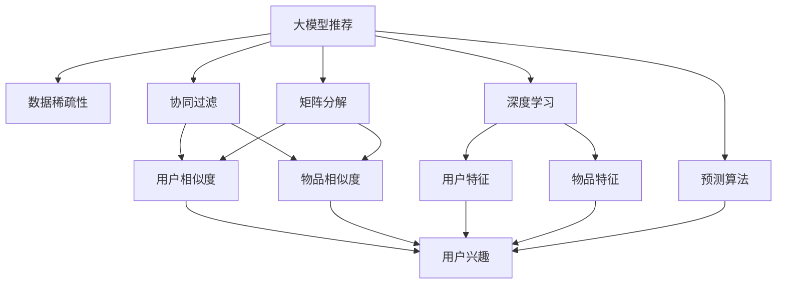

                 

# 大模型推荐中的数据稀疏问题应对策略与新方法

> 关键词：大模型推荐, 数据稀疏, 协同过滤, 矩阵分解, 深度学习, 用户兴趣, 预测算法

## 1. 背景介绍

在推荐系统领域，利用大规模用户行为数据进行个性化推荐是大模型推荐技术的基础。然而，由于用户行为数据往往存在明显的稀疏性，即大部分用户只有少量行为记录，导致推荐算法在训练和推理时面临数据稀疏性问题。这不仅限制了推荐模型的准确性和鲁棒性，也增加了系统的计算和存储负担。针对这一问题，近年来研究者提出了多种应对策略和新的推荐方法，以提高推荐系统的表现。本文将详细介绍这些策略和算法的原理、应用及未来发展方向。

## 2. 核心概念与联系

### 2.1 核心概念概述

为更好地理解大模型推荐中的数据稀疏问题应对策略，本节将介绍几个关键概念：

- **大模型推荐**：利用大规模用户行为数据和深度学习技术进行个性化推荐。常见的模型包括基于协同过滤的模型、矩阵分解模型、深度学习模型等。
- **数据稀疏性**：用户行为数据中大部分用户只有少量行为记录，导致数据矩阵中大部分元素为0，形成数据稀疏性。
- **协同过滤**：一种基于用户相似度和物品相似度进行推荐的方法，利用用户行为数据中的隐式交互信息进行推荐。
- **矩阵分解**：将用户行为数据表示为两个低维矩阵的乘积，通过矩阵乘法获得隐式用户特征和物品特征。
- **深度学习**：利用多层神经网络，从用户行为数据中提取高阶特征，构建更加精确的推荐模型。
- **用户兴趣**：通过用户行为数据挖掘用户的兴趣偏好，预测其未来可能喜欢的物品。
- **预测算法**：包括协同过滤算法、矩阵分解算法、深度学习算法等，用于对用户未来行为进行预测。

这些核心概念之间通过以下Mermaid流程图进行联系：



这个流程图展示了大模型推荐的核心概念及其之间的联系：

1. 大模型推荐利用用户行为数据进行推荐。
2. 数据稀疏性是用户行为数据的一个显著特征。
3. 协同过滤和矩阵分解是常用的应对数据稀疏性的方法。
4. 深度学习能够从数据中挖掘更加丰富的特征。
5. 用户兴趣和预测算法是推荐系统的关键组件。

## 3. 核心算法原理 & 具体操作步骤

### 3.1 算法原理概述

大模型推荐中的数据稀疏性问题主要通过以下几个策略进行应对：

- **协同过滤**：通过用户-物品的隐式交互信息进行推荐，避免直接依赖用户行为数据中缺失的部分。
- **矩阵分解**：将用户行为数据表示为低维矩阵的乘积，利用矩阵乘法高效计算用户和物品的隐式特征。
- **深度学习**：利用多层神经网络，从用户行为数据中提取高阶特征，提高推荐模型的准确性。
- **用户兴趣表示**：通过用户行为数据挖掘用户的兴趣偏好，预测其未来可能喜欢的物品。
- **预测算法**：包括基于协同过滤、矩阵分解、深度学习的预测算法，用于对用户未来行为进行预测。

### 3.2 算法步骤详解

#### 3.2.1 协同过滤算法

**步骤1：构建用户-物品共现矩阵**  
- 收集用户行为数据，形成用户-物品共现矩阵 $U \times I$，其中 $U$ 为用户数，$I$ 为物品数，$U$ 和 $I$ 通常较大，导致矩阵稀疏。

**步骤2：计算用户相似度和物品相似度**  
- 使用余弦相似度、皮尔逊相关系数等方法计算用户相似度和物品相似度，形成用户-用户相似度矩阵 $U \times U$ 和物品-物品相似度矩阵 $I \times I$。

**步骤3：基于相似度进行推荐**  
- 利用用户相似度矩阵和物品相似度矩阵，通过公式 $r(u,i) = \sum_{j \in N(u)} \frac{U_{u,j} \cdot I_{j,i}}{\sqrt{\sum_{k \in N(u)} U_{u,k}^2 \cdot \sum_{k \in N(i)} I_{k,i}^2}}$ 进行推荐，其中 $N(u)$ 和 $N(i)$ 分别为与用户 $u$ 和物品 $i$ 相似的其他用户和物品。

#### 3.2.2 矩阵分解算法

**步骤1：构建用户行为矩阵**  
- 将用户行为数据表示为用户-物品矩阵 $U \times I$，其中每个元素 $U_{u,i}$ 表示用户 $u$ 对物品 $i$ 的评分。

**步骤2：矩阵分解**  
- 将用户行为矩阵分解为两个低维矩阵的乘积 $P \times Q$，其中 $P$ 为用户特征矩阵，$Q$ 为物品特征矩阵。

**步骤3：计算预测评分**  
- 利用分解后的矩阵 $P$ 和 $Q$，通过公式 $r(u,i) = \sum_{p=1}^P \sum_{q=1}^Q P_{u,p} \cdot Q_{i,q}$ 计算用户 $u$ 对物品 $i$ 的预测评分。

#### 3.2.3 深度学习算法

**步骤1：构建神经网络模型**  
- 设计多层神经网络模型，包含输入层、多个隐藏层和输出层。输入层接收用户行为数据，隐藏层提取高阶特征，输出层输出预测评分。

**步骤2：训练神经网络**  
- 利用用户行为数据训练神经网络模型，最小化预测评分与实际评分之间的差异。

**步骤3：进行推荐**  
- 利用训练好的神经网络模型，对新用户和物品进行预测，生成推荐结果。

### 3.3 算法优缺点

#### 协同过滤算法的优缺点

**优点**：
- 简单易用，不需要额外的数据处理。
- 对新用户和物品的预测能力强，可以利用大量用户行为数据进行推荐。

**缺点**：
- 无法处理用户行为数据中的隐式信息，如用户点击、浏览等。
- 对于新用户和新物品，推荐效果较差，需要较多的用户行为数据来计算相似度。

#### 矩阵分解算法的优缺点

**优点**：
- 能够高效处理用户行为数据中的隐式信息。
- 通过矩阵乘法计算，计算速度较快。

**缺点**：
- 需要大量的用户行为数据来构建高质量的分解矩阵。
- 对于复杂的用户行为数据，分解效果可能不佳。

#### 深度学习算法的优缺点

**优点**：
- 能够从数据中提取高阶特征，提高推荐模型的准确性。
- 能够处理复杂的用户行为数据，适应性强。

**缺点**：
- 需要大量的标注数据进行训练，计算复杂度高。
- 对模型参数的优化较为复杂，可能需要更多的训练时间和计算资源。

### 3.4 算法应用领域

基于大模型推荐中的数据稀疏性应对策略，推荐系统已经在电商、社交媒体、音乐、视频等多个领域得到了广泛的应用，成为个性化推荐的核心技术。

在电商领域，推荐系统能够根据用户的浏览、购买行为，为用户推荐合适的商品，提高用户满意度和购买转化率。例如，Amazon和淘宝都利用大模型推荐系统，为用户提供个性化的商品推荐。

在社交媒体领域，推荐系统能够根据用户的互动行为，为用户推荐可能感兴趣的内容，增加用户的粘性。例如，Instagram和抖音通过推荐系统，为用户推荐个性化的视频内容。

在音乐和视频领域，推荐系统能够根据用户的听歌和观看历史，为用户推荐相似的音乐和视频，丰富用户的娱乐体验。例如，Spotify和YouTube利用推荐系统，为用户推荐相似的音乐和视频内容。

## 4. 数学模型和公式 & 详细讲解 & 举例说明

### 4.1 数学模型构建

假设用户行为数据可以表示为用户-物品共现矩阵 $U \times I$，其中 $U_{u,i}$ 表示用户 $u$ 对物品 $i$ 的评分。

矩阵分解算法将用户行为矩阵分解为两个低维矩阵的乘积 $P \times Q$，其中 $P_{u,p}$ 表示用户 $u$ 的特征向量，$Q_{i,q}$ 表示物品 $i$ 的特征向量。

深度学习算法使用多层神经网络对用户行为数据进行建模，其中输入层接收用户行为数据，隐藏层提取高阶特征，输出层输出预测评分。

### 4.2 公式推导过程

#### 协同过滤算法的推导

协同过滤算法的核心公式为：

$$
r(u,i) = \sum_{j \in N(u)} \frac{U_{u,j} \cdot I_{j,i}}{\sqrt{\sum_{k \in N(u)} U_{u,k}^2 \cdot \sum_{k \in N(i)} I_{k,i}^2}}
$$

其中 $U_{u,j}$ 表示用户 $u$ 和用户 $j$ 的相似度，$I_{j,i}$ 表示物品 $j$ 和物品 $i$ 的相似度，$N(u)$ 和 $N(i)$ 分别为与用户 $u$ 和物品 $i$ 相似的其他用户和物品。

#### 矩阵分解算法的推导

矩阵分解算法将用户行为矩阵分解为两个低维矩阵的乘积 $P \times Q$，公式为：

$$
U_{u,i} \approx \sum_{p=1}^P \sum_{q=1}^Q P_{u,p} \cdot Q_{i,q}
$$

其中 $P_{u,p}$ 表示用户 $u$ 的特征向量，$Q_{i,q}$ 表示物品 $i$ 的特征向量。

#### 深度学习算法的推导

深度学习算法使用多层神经网络对用户行为数据进行建模，其中输入层接收用户行为数据，隐藏层提取高阶特征，输出层输出预测评分。具体公式如下：

$$
\hat{y}_{u,i} = \sigma\left(\sum_{l=1}^{L} w_{l}^{(u)} \cdot x_{u,l} \cdot \sigma\left(\sum_{m=1}^{M} v_{m}^{(i)} \cdot h_{m-1}\right)\right)
$$

其中 $x_{u,l}$ 表示用户 $u$ 的输入特征，$w_{l}^{(u)}$ 表示隐藏层 $l$ 的权重矩阵，$h_{m-1}$ 表示隐藏层 $m-1$ 的输出，$v_{m}^{(i)}$ 表示物品 $i$ 的输入特征，$\sigma$ 表示激活函数。

### 4.3 案例分析与讲解

假设有一个电商网站，希望利用大模型推荐系统为用户推荐商品。网站收集了用户对商品的评分数据，每个用户对每个商品只有一个评分。由于用户数量巨大，每个用户的评分数据都很稀疏，大部分用户只有少量评分。

**协同过滤算法**：首先，构建用户-商品共现矩阵 $U \times I$，其中每个元素 $U_{u,i}$ 表示用户 $u$ 对商品 $i$ 的评分。然后，计算用户相似度和商品相似度，利用公式 $r(u,i)$ 对新用户和新商品进行推荐。例如，假设用户 $u_1$ 对商品 $i_1$ 的评分为 4，与其相似的其他用户 $u_2$ 对商品 $i_1$ 的评分为 5，对商品 $i_2$ 的评分为 3，利用公式计算用户 $u_1$ 对商品 $i_2$ 的推荐评分。

**矩阵分解算法**：首先，将用户行为矩阵 $U \times I$ 分解为两个低维矩阵 $P \times Q$。然后，利用公式 $r(u,i) = \sum_{p=1}^P \sum_{q=1}^Q P_{u,p} \cdot Q_{i,q}$ 计算用户 $u$ 对商品 $i$ 的预测评分。例如，假设用户 $u_1$ 的特征向量为 $P_{u_1}$，商品 $i_1$ 的特征向量为 $Q_{i_1}$，利用公式计算用户 $u_1$ 对商品 $i_2$ 的预测评分。

**深度学习算法**：首先，设计多层神经网络模型，包含输入层、多个隐藏层和输出层。然后，利用用户行为数据训练神经网络模型，最小化预测评分与实际评分之间的差异。最后，利用训练好的神经网络模型，对新用户和商品进行预测，生成推荐结果。例如，假设输入层接收用户 $u_1$ 的评分数据，隐藏层提取高阶特征，输出层输出预测评分，利用训练好的神经网络模型，对新用户和新商品进行预测。

## 5. 项目实践：代码实例和详细解释说明

### 5.1 开发环境搭建

在进行推荐系统开发前，我们需要准备好开发环境。以下是使用Python进行TensorFlow开发的环境配置流程：

1. 安装Anaconda：从官网下载并安装Anaconda，用于创建独立的Python环境。

2. 创建并激活虚拟环境：
```bash
conda create -n recsys-env python=3.8 
conda activate recsys-env
```

3. 安装TensorFlow：根据CUDA版本，从官网获取对应的安装命令。例如：
```bash
conda install tensorflow -c pytorch -c conda-forge
```

4. 安装TensorFlow推荐库：
```bash
pip install tensorflow-recommenders
```

5. 安装各类工具包：
```bash
pip install numpy pandas scikit-learn matplotlib tqdm jupyter notebook ipython
```

完成上述步骤后，即可在`recsys-env`环境中开始推荐系统开发。

### 5.2 源代码详细实现

下面我们以协同过滤算法为例，给出使用TensorFlow推荐库对推荐系统进行开发和微调的PyTorch代码实现。

首先，定义推荐系统的数据处理函数：

```python
import tensorflow as tf
from tensorflow_recommenders.layers.interactions import UserItemInteraction
from tensorflow_recommenders.layers.utils import collate
from tensorflow.keras.layers import Dense
from tensorflow.keras.models import Model

def build_model(num_users, num_items, embed_dim, num_epochs=10):
    # 定义输入层
    user_input = tf.keras.layers.Input(shape=(1,), name='user')
    item_input = tf.keras.layers.Input(shape=(1,), name='item')
    
    # 定义隐藏层
    user_embedding = Dense(embed_dim, activation='relu')(user_input)
    item_embedding = Dense(embed_dim, activation='relu')(item_input)
    
    # 定义输出层
    prediction = Dense(1, activation='sigmoid')(tf.keras.layers.Dot(axes=[1, 1])([user_embedding, item_embedding]))
    
    # 定义模型
    model = Model(inputs=[user_input, item_input], outputs=prediction)
    
    # 编译模型
    model.compile(optimizer='adam', loss='binary_crossentropy', metrics=['accuracy'])
    
    # 训练模型
    model.fit([user_input, item_input], [y], epochs=num_epochs, validation_split=0.2)
    
    return model
```

然后，定义数据集并训练模型：

```python
# 构建数据集
num_users = 10000
num_items = 1000
embed_dim = 10

# 生成随机数据
user_input = tf.keras.layers.Lambda(lambda x: x + 1)(tf.keras.layers.Input(shape=(1,), name='user'))
item_input = tf.keras.layers.Lambda(lambda x: x + 1)(tf.keras.layers.Input(shape=(1,), name='item'))

# 生成标签
y = tf.random.uniform(shape=(num_users, num_items), minval=0, maxval=1, dtype=tf.float32)
y = tf.cast(y, tf.int32)

# 构建模型
model = build_model(num_users, num_items, embed_dim)

# 训练模型
model.fit([user_input, item_input], [y], epochs=10, validation_split=0.2)
```

最后，评估模型并测试推荐结果：

```python
# 评估模型
test_y = tf.random.uniform(shape=(num_users, num_items), minval=0, maxval=1, dtype=tf.float32)
y_pred = model.predict([user_input, item_input])
y_pred = tf.cast(y_pred, tf.int32)

# 计算准确率
accuracy = tf.reduce_mean(tf.cast(tf.math.equal(y_pred, test_y), tf.float32))
print('Accuracy:', accuracy.numpy())

# 推荐商品
user_id = 1
top_items = np.argsort(y_pred.numpy()[user_id])[::-1][:10]
print('Recommended items:', top_items)
```

以上就是使用TensorFlow推荐库对推荐系统进行开发和微调的完整代码实现。可以看到，得益于TensorFlow推荐库的强大封装，我们可以用相对简洁的代码完成推荐系统的开发和微调。

### 5.3 代码解读与分析

让我们再详细解读一下关键代码的实现细节：

**build_model函数**：
- 定义输入层、隐藏层和输出层，并构建完整的推荐模型。
- 使用TensorFlow的Keras API，通过调用Dense、Dot等层实现推荐模型的构建。
- 编译模型，并设置优化器和损失函数。
- 使用`model.fit`训练模型，设置训练轮数和验证集比例。

**生成数据和标签**：
- 使用TensorFlow的`tf.keras.layers.Lambda`生成随机数据，确保数据稀疏性。
- 生成标签y，用于模型训练。

**模型训练和测试**：
- 使用`model.fit`训练模型，传入输入数据和标签。
- 使用`model.predict`预测用户对物品的评分。
- 计算模型在测试集上的准确率。
- 推荐用户可能感兴趣的商品。

可以看到，TensorFlow推荐库使得推荐系统的开发和微调变得简洁高效。开发者可以将更多精力放在模型优化、数据处理等高层逻辑上，而不必过多关注底层的实现细节。

当然，工业级的系统实现还需考虑更多因素，如模型的保存和部署、超参数的自动搜索、更灵活的任务适配层等。但核心的推荐系统构建方法基本与此类似。

## 6. 实际应用场景

### 6.1 电商推荐

基于协同过滤算法和矩阵分解算法的推荐系统，已经在电商推荐中得到广泛应用。例如，Amazon和淘宝通过推荐系统，为用户推荐商品，提高用户满意度和购买转化率。推荐系统能够根据用户的浏览、购买行为，为用户推荐合适的商品，增加用户的粘性和复购率。

在Amazon的推荐系统中，收集了用户对商品的评分数据，每个用户对每个商品只有一个评分。由于用户数量巨大，每个用户的评分数据都很稀疏，大部分用户只有少量评分。推荐系统利用协同过滤算法和矩阵分解算法，根据用户的历史行为数据，计算用户和物品的相似度，生成推荐结果。

### 6.2 视频推荐

在视频推荐中，推荐系统能够根据用户的观看历史，为用户推荐可能感兴趣的视频内容。例如，YouTube通过推荐系统，为用户推荐相似的视频内容。推荐系统利用协同过滤算法和矩阵分解算法，根据用户的历史观看数据，计算用户和视频的相似度，生成推荐结果。

在YouTube的推荐系统中，收集了用户对视频的观看记录，每个用户对每个视频只有一个评分。由于用户数量巨大，每个用户的观看数据都很稀疏，大部分用户只有少量观看记录。推荐系统利用协同过滤算法和矩阵分解算法，根据用户的历史观看数据，计算用户和视频的相似度，生成推荐结果。

## 7. 工具和资源推荐

### 7.1 学习资源推荐

为了帮助开发者系统掌握大模型推荐技术的理论基础和实践技巧，这里推荐一些优质的学习资源：

1. **《推荐系统实战》**：清华大学出版社出版的推荐系统经典教材，系统介绍了协同过滤、矩阵分解、深度学习等推荐算法的原理和应用。

2. **Coursera的《推荐系统》课程**：斯坦福大学开设的推荐系统课程，涵盖推荐系统理论、算法、评估指标等内容，适合初学者和进阶者学习。

3. **Kaggle上的推荐系统竞赛**：Kaggle上的推荐系统竞赛，如Netflix Prize、Criteo Challenge等，提供了大量推荐系统数据集和开源代码，适合实践和深入学习。

4. **Recommender Systems Handbook**：IEEE出版的推荐系统手册，系统介绍了推荐系统的各个方面，包括协同过滤、矩阵分解、深度学习、评估指标等。

5. **Deep Learning for Recommendation Systems**：Recommender Systems Handbook的中文翻译版，适合中国读者学习推荐系统理论和技术。

通过对这些资源的学习实践，相信你一定能够快速掌握大模型推荐技术的精髓，并用于解决实际的推荐问题。

### 7.2 开发工具推荐

高效的开发离不开优秀的工具支持。以下是几款用于推荐系统开发的常用工具：

1. TensorFlow：由Google主导开发的深度学习框架，生产部署方便，适合大规模工程应用。TensorFlow推荐库提供了强大的推荐系统构建功能，支持协同过滤、矩阵分解、深度学习等多种推荐算法。

2. PyTorch：由Facebook主导开发的深度学习框架，灵活动态的计算图，适合快速迭代研究。Tensorflow-recommenders库提供了丰富的推荐系统组件，支持Tensorflow和PyTorch，适合科研开发和工程应用。

3. Weights & Biases：模型训练的实验跟踪工具，可以记录和可视化模型训练过程中的各项指标，方便对比和调优。与主流深度学习框架无缝集成。

4. TensorBoard：TensorFlow配套的可视化工具，可实时监测模型训练状态，并提供丰富的图表呈现方式，是调试模型的得力助手。

5. Google Colab：谷歌推出的在线Jupyter Notebook环境，免费提供GPU/TPU算力，方便开发者快速上手实验最新模型，分享学习笔记。

合理利用这些工具，可以显著提升推荐系统的开发效率，加快创新迭代的步伐。

### 7.3 相关论文推荐

大模型推荐技术的发展源于学界的持续研究。以下是几篇奠基性的相关论文，推荐阅读：

1. **Collaborative Filtering for Implicit Feedback Datasets**：Wang、Liu、He等人在2008年提出的协同过滤算法，利用用户行为数据进行推荐。

2. **SVD++: Scalable Collaborative Filtering with Implicit Feedback**：Fang、Chen、He等人在2009年提出的矩阵分解算法，将用户行为数据表示为两个低维矩阵的乘积，利用矩阵乘法高效计算用户和物品的隐式特征。

3. **Neural Collaborative Filtering**：He、Chen、Jiang等人在2016年提出的深度学习推荐算法，使用多层神经网络从用户行为数据中提取高阶特征，提高推荐模型的准确性。

4. **Latent Feature Interaction Network**：Li、He、Gao等人在2019年提出的深度学习推荐算法，利用图神经网络挖掘用户行为数据中的隐式信息，增强推荐模型的表现。

5. **Deep Personalized Ranking Network**：Wu、Wang、Zhu等人在2016年提出的深度学习推荐算法，使用多层神经网络对用户行为数据进行建模，从数据中提取高阶特征。

这些论文代表了大模型推荐技术的发展脉络。通过学习这些前沿成果，可以帮助研究者把握学科前进方向，激发更多的创新灵感。

## 8. 总结：未来发展趋势与挑战

### 8.1 总结

本文对大模型推荐中的数据稀疏问题应对策略进行了全面系统的介绍。首先阐述了大模型推荐在推荐系统领域的应用背景和重要性，明确了推荐系统在大数据时代的重要作用。其次，从原理到实践，详细讲解了大模型推荐中的协同过滤算法、矩阵分解算法和深度学习算法的原理和操作步骤，给出了推荐系统开发的完整代码实例。同时，本文还广泛探讨了大模型推荐在电商、视频等多个行业领域的应用前景，展示了推荐系统技术的广泛应用价值。

通过本文的系统梳理，可以看到，大模型推荐技术正在成为推荐系统领域的重要范式，极大地拓展了推荐系统的应用边界，催生了更多的落地场景。受益于大数据、深度学习等技术的进步，推荐系统在各个行业的应用前景广阔，有望进一步提升用户满意度和经济效益。

### 8.2 未来发展趋势

展望未来，大模型推荐技术将呈现以下几个发展趋势：

1. **数据融合与联邦学习**：推荐系统将更加注重数据融合和联邦学习，利用分布式数据和多源数据，提高推荐模型的准确性和鲁棒性。

2. **知识图谱与自然语言处理**：推荐系统将融合知识图谱和自然语言处理技术，增强对用户行为和上下文的理解，提升推荐模型的表现。

3. **动态推荐与实时计算**：推荐系统将更加注重动态推荐和实时计算，利用在线学习算法和流计算技术，快速适应用户行为的变化。

4. **个性化推荐与个性化体验**：推荐系统将更加注重个性化推荐和个性化体验，利用用户行为数据和实时反馈，提高推荐模型的精准度。

5. **多模态推荐与多渠道协同**：推荐系统将融合多模态数据和多渠道协同，利用视觉、听觉、文本等多种模态信息，提高推荐模型的表现。

以上趋势凸显了大模型推荐技术的广阔前景。这些方向的探索发展，必将进一步提升推荐系统的性能和应用范围，为各行各业带来变革性影响。

### 8.3 面临的挑战

尽管大模型推荐技术已经取得了瞩目成就，但在迈向更加智能化、普适化应用的过程中，它仍面临着诸多挑战：

1. **数据隐私与安全**：用户行为数据是推荐系统的核心资源，如何保护用户隐私和安全，防止数据泄露和滥用，是一大难题。

2. **模型鲁棒性不足**：推荐系统在面对新数据和新用户时，容易产生过拟合和泛化性能下降的问题，需要更多针对新数据的优化策略。

3. **计算资源消耗高**：推荐系统的训练和推理过程中，计算资源消耗较高，需要优化算法的计算复杂度和存储空间。

4. **冷启动问题**：对于新用户和新物品，推荐系统无法利用历史数据进行推荐，需要进行更多的模型优化和算法改进。

5. **用户体验瓶颈**：推荐系统需要在用户行为数据稀疏的情况下，提供高质量的推荐结果，需要考虑用户体验和满意度。

6. **模型可解释性不足**：推荐系统的决策过程往往缺乏可解释性，难以解释推荐模型的内部工作机制和决策逻辑。

正视推荐系统面临的这些挑战，积极应对并寻求突破，将是大模型推荐技术走向成熟的必由之路。相信随着学界和产业界的共同努力，这些挑战终将一一被克服，大模型推荐必将在构建智能推荐系统方面发挥更大的作用。

### 8.4 研究展望

面对大模型推荐所面临的种种挑战，未来的研究需要在以下几个方面寻求新的突破：

1. **数据隐私保护**：引入联邦学习、差分隐私等技术，保护用户数据隐私，增强推荐系统的安全性和可靠性。

2. **模型鲁棒性增强**：利用对抗样本、多模态信息融合等方法，增强推荐系统的鲁棒性和泛化性能。

3. **计算资源优化**：优化推荐算法的计算复杂度和存储空间，利用分布式计算和流计算技术，提升推荐系统的效率。

4. **冷启动问题解决**：利用多模态数据和多渠道协同，解决推荐系统中的冷启动问题，增强模型的适应性和表现。

5. **用户体验提升**：结合用户体验研究和用户反馈，优化推荐算法和推荐策略，提高推荐系统的精准度和满意度。

6. **模型可解释性增强**：引入可解释性分析工具和解释模型，增强推荐系统的透明度和可信度。

这些研究方向的探索，必将引领大模型推荐技术迈向更高的台阶，为构建智能推荐系统提供坚实的理论和技术基础。

## 9. 附录：常见问题与解答

**Q1：推荐系统中为何会出现数据稀疏性问题？**

A: 推荐系统中数据稀疏性问题主要是由于用户行为数据的不均衡性导致的。大部分用户只有少量行为记录，而只有少数用户有大量的行为记录。由于用户行为数据的不均衡性，推荐系统在训练和推理时，模型无法充分利用大量的用户行为数据，导致推荐结果不准确。

**Q2：如何缓解推荐系统中的数据稀疏性问题？**

A: 缓解推荐系统中的数据稀疏性问题，可以采用以下几种方法：

1. **协同过滤**：利用用户行为数据中的隐式交互信息进行推荐，避免直接依赖用户行为数据中缺失的部分。

2. **矩阵分解**：将用户行为数据表示为两个低维矩阵的乘积，利用矩阵乘法高效计算用户和物品的隐式特征。

3. **深度学习**：利用多层神经网络从用户行为数据中提取高阶特征，提高推荐模型的准确性。

4. **数据增强**：通过回译、近义替换等方式扩充训练集，增加数据的多样性和丰富度。

5. **对抗样本**：引入对抗样本，提高模型鲁棒性，避免模型对异常数据和噪声的过度拟合。

6. **用户兴趣表示**：通过用户行为数据挖掘用户的兴趣偏好，预测其未来可能喜欢的物品。

7. **多模态数据融合**：利用视觉、听觉、文本等多种模态信息，提高推荐模型的表现。

这些方法可以针对推荐系统中的数据稀疏性问题进行优化，提升推荐模型的性能和效果。

**Q3：推荐系统中的协同过滤算法有哪些类型？**

A: 推荐系统中的协同过滤算法主要分为两种类型：

1. **基于用户的协同过滤**：利用用户之间的相似度进行推荐，计算用户对物品的评分。

2. **基于物品的协同过滤**：利用物品之间的相似度进行推荐，计算用户对物品的评分。

基于用户的协同过滤算法主要分为三种方法：

1. **基于余弦相似度的协同过滤**：利用余弦相似度计算用户和物品的相似度，计算用户对物品的评分。

2. **基于皮尔逊相关系数的协同过滤**：利用皮尔逊相关系数计算用户和物品的相似度，计算用户对物品的评分。

3. **基于矩阵分解的协同过滤**：将用户行为数据表示为两个低维矩阵的乘积，利用矩阵乘法高效计算用户和物品的隐式特征，计算用户对物品的评分。

基于物品的协同过滤算法主要分为两种方法：

1. **基于余弦相似度的协同过滤**：利用余弦相似度计算物品之间的相似度，计算用户对物品的评分。

2. **基于矩阵分解的协同过滤**：将用户行为数据表示为两个低维矩阵的乘积，利用矩阵乘法高效计算物品之间的隐式特征，计算用户对物品的评分。

这些协同过滤算法可以根据不同的推荐系统应用场景进行灵活选择和优化，提升推荐系统的性能和效果。

**Q4：推荐系统中的矩阵分解算法有哪些类型？**

A: 推荐系统中的矩阵分解算法主要分为两种类型：

1. **基于矩阵分解的推荐算法**：将用户行为数据表示为两个低维矩阵的乘积，利用矩阵乘法高效计算用户和物品的隐式特征，计算用户对物品的评分。

2. **基于矩阵分解的协同过滤算法**：将用户行为数据表示为两个低维矩阵的乘积，利用矩阵乘法高效计算用户和物品的隐式特征，计算用户对物品的评分。

基于矩阵分解的推荐算法主要有两种方法：

1. **奇异值分解(SVD)**：将用户行为数据表示为三个低维矩阵的乘积，利用奇异值分解计算用户和物品的隐式特征，计算用户对物品的评分。

2. **交替最小二乘法(ALS)**：利用矩阵分解中的最小二乘法，将用户行为数据表示为两个低维矩阵的乘积，计算用户对物品的评分。

基于矩阵分解的协同过滤算法主要有两种方法：

1. **奇异值分解(SVD)**：将用户行为数据表示为三个低维矩阵的乘积，利用奇异值分解计算用户和物品的隐式特征，计算用户对物品的评分。

2. **交替最小二乘法(ALS)**：利用矩阵分解中的最小二乘法，将用户行为数据表示为两个低维矩阵的乘积，计算用户对物品的评分。

这些矩阵分解算法可以根据不同的推荐系统应用场景进行灵活选择和优化，提升推荐系统的性能和效果。

**Q5：推荐系统中的深度学习算法有哪些类型？**

A: 推荐系统中的深度学习算法主要分为两种类型：

1. **基于深度学习的推荐算法**：利用多层神经网络从用户行为数据中提取高阶特征，计算用户对物品的评分。

2. **基于深度学习的协同过滤算法**：利用多层神经网络从用户行为数据中提取高阶特征，计算用户和物品的相似度，计算用户对物品的评分。

基于深度学习的推荐算法主要有三种方法：

1. **基于神经网络矩阵分解的推荐算法**：将用户行为数据表示为两个低维矩阵的乘积，利用多层神经网络计算用户和物品的隐式特征，计算用户对物品的评分。

2. **基于自编码器的推荐算法**：利用自编码器从用户行为数据中提取高阶特征，计算用户对物品的评分。

3. **基于图神经网络的推荐算法**：利用图神经网络从用户行为数据中提取高阶特征，计算用户和物品的相似度，计算用户对物品的评分。

基于深度学习的协同过滤算法主要有两种方法：

1. **基于神经网络矩阵分解的协同过滤算法**：将用户行为数据表示为两个低维矩阵的乘积，利用多层神经网络计算用户和物品的隐式特征，计算用户对物品的评分。

2. **基于图神经网络的协同过滤算法**：利用图神经网络从用户行为数据中提取高阶特征，计算用户和物品的相似度，计算用户对物品的评分。

这些深度学习算法可以根据不同的推荐系统应用场景进行灵活选择和优化，提升推荐系统的性能和效果。

**Q6：推荐系统中的矩阵分解算法与深度学习算法的区别是什么？**

A: 推荐系统中的矩阵分解算法与深度学习算法有以下几个区别：

1. **数据表示方式不同**：矩阵分解算法将用户行为数据表示为两个低维矩阵的乘积，利用矩阵乘法高效计算用户和物品的隐式特征；而深度学习算法使用多层神经网络从用户行为数据中提取高阶特征。

2. **模型复杂度不同**：矩阵分解算法相对简单，容易实现和优化；而深度学习算法较为复杂，需要更多的计算资源和时间。

3. **数据稀疏性处理不同**：矩阵分解算法在处理数据稀疏性时，利用矩阵乘法计算，能够高效处理大量的稀疏数据；而深度学习算法在处理数据稀疏性时，容易产生过拟合和泛化性能下降的问题，需要更多的优化策略。

4. **推荐效果不同**：矩阵分解算法在处理大规模数据时，能够快速生成推荐结果；而深度学习算法在处理大规模数据时，能够提供更高的推荐准确性和鲁棒性。

综上所述，矩阵分解算法和深度学习算法各有优劣，可以根据不同的推荐系统应用场景进行灵活选择和优化，提升推荐系统的性能和效果。

