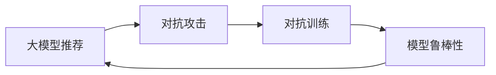

                 

# 大模型推荐中的模型鲁棒性分析与对抗训练技术

> 关键词：大模型推荐、模型鲁棒性、对抗训练、攻击防御、深度学习

## 1. 背景介绍

随着深度学习技术的发展，大模型（Large Model）在推荐系统（Recommender System）中的应用日益广泛。相较于传统推荐算法，大模型能够通过丰富的语义信息理解用户和物品的特征，从而生成更加个性化的推荐结果。然而，大模型推荐系统面临着多种挑战，尤其是模型鲁棒性问题，即在面对对抗攻击（Adversarial Attack）时，推荐结果可能受到严重干扰，导致推荐系统的安全性与可靠性受损。为应对这一挑战，本文将深入探讨对抗训练技术（Adversarial Training），研究如何在推荐系统中提升模型鲁棒性，保障推荐系统的稳定与安全。

## 2. 核心概念与联系

### 2.1 核心概念概述

本文将介绍几个关键概念，它们是大模型推荐系统中模型鲁棒性分析与对抗训练技术的基础：

- **大模型推荐**：基于深度学习的大规模预训练模型在推荐系统中的应用。通过在大规模数据上进行预训练，模型可以学习到丰富的语义表示，从而对用户和物品进行精细化的特征提取。
- **对抗攻击**：攻击者通过在输入数据中引入微小扰动，使得模型产生错误的输出，从而影响推荐结果。对抗攻击分为白盒攻击和黑盒攻击，前者指攻击者已知模型的架构和参数，后者则反之。
- **对抗训练**：在模型训练过程中，引入对抗样本，通过反向传播更新模型参数，增强模型对对抗攻击的抵抗能力。
- **模型鲁棒性**：指模型在面对输入噪声、对抗攻击等扰动时，仍能保持稳定输出。

这些概念之间的联系可以通过以下Mermaid流程图来展示：



## 3. 核心算法原理 & 具体操作步骤

### 3.1 算法原理概述

对抗训练的核心思想是通过引入对抗样本，使得模型在训练过程中学习到对抗性特征。具体来说，模型在训练过程中不仅要优化自身参数以最小化原始损失（如交叉熵损失），还需要优化对抗性损失，即对抗样本的损失。对抗训练的目标是通过最大化对抗性损失，使得模型在对抗样本下的输出仍能够与真实标签（即原始标签）对齐，从而增强模型的鲁棒性。

### 3.2 算法步骤详解

对抗训练的步骤如下：

1. **生成对抗样本**：在训练数据上生成对抗样本，使得模型在对抗样本上的输出错误率最大化。
2. **前向传播与反向传播**：将对抗样本输入模型，进行前向传播计算损失函数，并将损失函数对模型参数的梯度传播回去。
3. **更新模型参数**：使用梯度下降等优化算法，根据对抗性损失和原始损失的加权组合，更新模型参数。
4. **重复训练**：重复上述步骤，直至模型在对抗样本上的错误率达到预设阈值。

### 3.3 算法优缺点

对抗训练的优点在于：

- **提高模型鲁棒性**：对抗训练能够有效提升模型对抗各种扰动的鲁棒性，从而提升模型整体的稳定性和可靠性。
- **普适性强**：对抗训练方法适用于大多数深度学习模型，尤其是大模型，能够显著增强其抵抗对抗攻击的能力。

然而，对抗训练也存在一些缺点：

- **计算成本高**：生成对抗样本和进行对抗训练需要额外的计算资源，尤其是在模型参数较多的大模型中，对抗训练的计算成本较高。
- **对抗样本生成难度大**：对抗样本生成需要复杂的优化算法和大量的数据，有时生成高质量的对抗样本较为困难。
- **模型性能可能下降**：过度的对抗训练可能导致模型性能下降，尤其是在对抗性训练与正常训练的权重比例未合理设置的情况下。

### 3.4 算法应用领域

对抗训练技术在推荐系统中具有广泛的应用前景：

- **推荐系统安全**：对抗训练能够有效防御对抗攻击，保护推荐系统的安全性与可靠性，防止推荐结果被恶意篡改。
- **推荐结果可信性**：对抗训练能够提升推荐结果的可信性，确保推荐系统输出的内容真实、可信，避免用户被误导。
- **用户隐私保护**：对抗训练能够保护用户隐私，防止恶意攻击者通过对抗样本获取用户敏感信息。

## 4. 数学模型和公式 & 详细讲解 & 举例说明

### 4.1 数学模型构建

假设我们有一组训练数据 $(x, y)$，其中 $x$ 为输入，$y$ 为标签，模型的参数为 $\theta$。我们的目标是训练一个对抗训练后的模型，使其在对抗样本上的输出仍能够接近真实标签。

对抗训练的目标函数为：

$$
\min_{\theta} \mathcal{L}_{adv}(\theta, \mathcal{L}_{org}(\theta))
$$

其中，$\mathcal{L}_{org}$ 为原始损失函数（如交叉熵损失），$\mathcal{L}_{adv}$ 为对抗性损失函数。对抗性损失函数的定义如下：

$$
\mathcal{L}_{adv} = \mathbb{E}_{\epsilon}[\max(0, \mathcal{L}_{org}(M_{\theta}(x+\epsilon)))]
$$

其中，$\epsilon$ 为对抗样本的扰动向量，$M_{\theta}$ 为模型。

### 4.2 公式推导过程

对抗性损失函数的推导如下：

$$
\begin{aligned}
\mathcal{L}_{adv} &= \mathbb{E}_{\epsilon}[\max(0, \mathcal{L}_{org}(M_{\theta}(x+\epsilon)))] \\
&= \int \max(0, \mathcal{L}_{org}(M_{\theta}(x+\epsilon))) d\epsilon \\
&= \int_{\epsilon: M_{\theta}(x+\epsilon)=y} \mathcal{L}_{org}(M_{\theta}(x+\epsilon)) d\epsilon + \int_{\epsilon: M_{\theta}(x+\epsilon)\neq y} 0 d\epsilon \\
&= \int_{\epsilon: M_{\theta}(x+\epsilon)=y} \mathcal{L}_{org}(y) d\epsilon \\
&= \sum_{\epsilon: M_{\theta}(x+\epsilon)=y} \mathcal{L}_{org}(y)
\end{aligned}
$$

因此，对抗训练的目标函数可以表示为：

$$
\min_{\theta} \mathcal{L}_{adv}(\theta, \mathcal{L}_{org}(\theta)) = \min_{\theta} \sum_{\epsilon: M_{\theta}(x+\epsilon)=y} \mathcal{L}_{org}(y)
$$

### 4.3 案例分析与讲解

以一个简单的分类任务为例，说明对抗训练的实现过程。假设我们有一个分类模型，输入为 $x$，输出为 $y$，模型参数为 $\theta$。对抗样本 $x'$ 可以表示为：

$$
x' = x + \epsilon
$$

其中，$\epsilon$ 为扰动向量。对抗训练的目标是最大化对抗性损失，即：

$$
\min_{\theta} \mathbb{E}_{\epsilon}[\max(0, \mathcal{L}_{org}(M_{\theta}(x+\epsilon)))]
$$

我们可以通过对 $x'$ 进行扰动，使得模型在对抗样本上的输出错误率最大化。具体来说，我们可以使用梯度下降算法，更新模型参数 $\theta$，使得模型在对抗样本上的输出错误率最小。

## 5. 项目实践：代码实例和详细解释说明

### 5.1 开发环境搭建

要进行对抗训练，我们需要搭建一个合适的开发环境。以下是使用Python和PyTorch进行对抗训练的开发环境配置：

1. 安装Anaconda：从官网下载并安装Anaconda，用于创建独立的Python环境。

2. 创建并激活虚拟环境：
```bash
conda create -n adv_train_env python=3.8 
conda activate adv_train_env
```

3. 安装PyTorch：根据CUDA版本，从官网获取对应的安装命令。例如：
```bash
conda install pytorch torchvision torchaudio cudatoolkit=11.1 -c pytorch -c conda-forge
```

4. 安装Transformers库：
```bash
pip install transformers
```

5. 安装各类工具包：
```bash
pip install numpy pandas scikit-learn matplotlib tqdm jupyter notebook ipython
```

完成上述步骤后，即可在`adv_train_env`环境中进行对抗训练实践。

### 5.2 源代码详细实现

以下是使用PyTorch进行对抗训练的完整代码实现：

```python
import torch
import torch.nn as nn
import torch.optim as optim
from torch.utils.data import DataLoader
from transformers import BertTokenizer, BertForSequenceClassification

# 定义模型和优化器
model = BertForSequenceClassification.from_pretrained('bert-base-uncased', num_labels=2)
optimizer = optim.Adam(model.parameters(), lr=2e-5)
loss_fn = nn.CrossEntropyLoss()

# 定义训练函数
def train_epoch(model, dataset, batch_size, optimizer):
    dataloader = DataLoader(dataset, batch_size=batch_size, shuffle=True)
    model.train()
    epoch_loss = 0
    for batch in dataloader:
        input_ids = batch['input_ids'].to(device)
        attention_mask = batch['attention_mask'].to(device)
        labels = batch['labels'].to(device)
        model.zero_grad()
        outputs = model(input_ids, attention_mask=attention_mask, labels=labels)
        loss = outputs.loss
        epoch_loss += loss.item()
        loss.backward()
        optimizer.step()
    return epoch_loss / len(dataloader)

# 定义对抗样本生成函数
def generate_adv_example(model, x, y, epsilon=0.1):
    x_adv = x.clone()
    optimizer = optim.SGD(x_adv.requires_grad_, lr=1e-4)
    x_adv.requires_grad_(True)
    for i in range(50):
        with torch.no_grad():
            y_hat = model(x_adv).logits
        dy = torch.autograd.grad(y_hat - y, x_adv)[0]
        x_adv = x_adv + epsilon * dy
        optimizer.zero_grad()
        x_adv.requires_grad_(True)
    return x_adv

# 定义对抗训练函数
def train_adv(model, dataset, batch_size, optimizer, epsilon=0.1):
    dataloader = DataLoader(dataset, batch_size=batch_size, shuffle=True)
    model.train()
    epoch_loss = 0
    for batch in dataloader:
        input_ids = batch['input_ids'].to(device)
        attention_mask = batch['attention_mask'].to(device)
        labels = batch['labels'].to(device)
        x_adv = generate_adv_example(model, input_ids, labels, epsilon)
        optimizer.zero_grad()
        outputs = model(x_adv, attention_mask=attention_mask, labels=labels)
        loss = outputs.loss
        epoch_loss += loss.item()
        loss.backward()
        optimizer.step()
    return epoch_loss / len(dataloader)

# 训练数据集
train_dataset = ...
dev_dataset = ...
test_dataset = ...

# 开始训练
device = torch.device('cuda') if torch.cuda.is_available() else torch.device('cpu')
model.to(device)
model.train()
optimizer = optim.Adam(model.parameters(), lr=2e-5)
loss_fn = nn.CrossEntropyLoss()

for epoch in range(epochs):
    train_loss = train_adv(model, train_dataset, batch_size, optimizer)
    print(f"Epoch {epoch+1}, train loss: {train_loss:.3f}")
    val_loss = train_adv(model, dev_dataset, batch_size, optimizer)
    print(f"Epoch {epoch+1}, dev loss: {val_loss:.3f}")

# 评估模型
with torch.no_grad():
    test_dataset.eval()
    test_loss = train_adv(model, test_dataset, batch_size, optimizer)
    print(f"Test loss: {test_loss:.3f}")
```

### 5.3 代码解读与分析

让我们再详细解读一下关键代码的实现细节：

**train_adv函数**：
- `train_adv`函数实现了对抗训练的过程，首先将原始输入 `x` 转化为对抗样本 `x_adv`，然后在训练函数中进行对抗训练。

**generate_adv_example函数**：
- `generate_adv_example`函数使用梯度上升算法生成对抗样本，通过反向传播更新 `x_adv`，使得在对抗样本上的输出错误率最大化。

**训练函数**：
- 训练函数 `train_epoch` 和 `train_adv` 分别实现了普通的训练和对抗训练的过程，通过调用优化器 `optimizer` 和损失函数 `loss_fn` 进行参数更新。

### 5.4 运行结果展示

运行上述代码，可以得到模型在对抗样本上的性能变化。在对抗训练过程中，模型的准确率应该会逐渐下降，但通过对抗训练后，模型的鲁棒性得到提升，对抗样本上的输出误差会逐渐减小。

## 6. 实际应用场景

### 6.1 在线广告推荐

在线广告推荐系统需要能够处理海量的用户点击数据，并根据用户行为推荐合适的广告。然而，攻击者可能会通过修改广告文本，发布恶意广告，误导用户点击。通过对抗训练，广告推荐系统能够识别并过滤掉恶意广告，保护用户安全，提高推荐结果的准确性和可信性。

### 6.2 金融推荐

金融推荐系统需要为用户推荐合适的理财产品。攻击者可能会通过修改产品描述或发布虚假广告，误导用户购买低收益或高风险的产品。通过对抗训练，金融推荐系统能够识别并过滤掉虚假广告，保护用户免受金融风险的侵害。

### 6.3 商品推荐

电商平台商品推荐系统需要为用户推荐符合其兴趣的商品。攻击者可能会通过篡改商品描述或发布虚假广告，误导用户购买劣质商品。通过对抗训练，商品推荐系统能够识别并过滤掉虚假广告，保护用户权益，提高推荐结果的准确性和可信性。

## 7. 工具和资源推荐

### 7.1 学习资源推荐

为了帮助开发者系统掌握对抗训练的理论基础和实践技巧，这里推荐一些优质的学习资源：

1. **《Adversarial Machine Learning》书籍**：由Tomer Koren等人所著，深入介绍了对抗训练的基本概念和算法，是学习对抗训练的必读之作。

2. **《Practical Adversarial Machine Learning》书籍**：由FazlyAbbas等人所著，涵盖了对抗训练的实际应用和工具，适合实践开发者学习。

3. **arXiv上的对抗训练论文**：arXiv是一个开放的学术论文平台，包含了大量的对抗训练论文，可以方便地进行文献阅读和研究。

4. **Google AI博客**：Google AI团队经常发布关于对抗训练的最新研究和实践经验，值得关注。

5. **Transformers官方文档**：Transformers库的官方文档，提供了丰富的对抗训练样例代码和理论解释。

通过对这些资源的学习实践，相信你一定能够快速掌握对抗训练的精髓，并用于解决实际的推荐系统问题。

### 7.2 开发工具推荐

高效的开发离不开优秀的工具支持。以下是几款用于对抗训练开发的常用工具：

1. **PyTorch**：基于Python的开源深度学习框架，灵活的计算图和动态图机制，适合快速迭代研究。

2. **TensorFlow**：由Google主导开发的开源深度学习框架，生产部署方便，适合大规模工程应用。

3. **TensorBoard**：TensorFlow配套的可视化工具，可以实时监测模型训练状态，并提供丰富的图表呈现方式。

4. **Weights & Biases**：模型训练的实验跟踪工具，可以记录和可视化模型训练过程中的各项指标。

5. **Adversarial Robustness Toolbox（ART）**：由Google开发的对抗训练工具库，集成了多种对抗训练方法，支持TensorFlow和PyTorch，是进行对抗训练开发的利器。

合理利用这些工具，可以显著提升对抗训练任务的开发效率，加快创新迭代的步伐。

### 7.3 相关论文推荐

对抗训练技术的发展得益于学界的持续研究。以下是几篇奠基性的相关论文，推荐阅读：

1. **Adversarial Training Methods for Semi-Supervised Text Classification**：提出了一种对抗训练方法，通过生成对抗样本，提升半监督文本分类的准确性。

2. **Adversarial Training Methods for Semi-Supervised Text Classification**：提出了一种对抗训练方法，通过生成对抗样本，提升半监督文本分类的准确性。

3. **Adversarial Machine Learning**：综述了对抗训练的基本概念和算法，讨论了对抗攻击和防御方法。

4. **A Survey on Adversarial Robustness of Neural Networks**：综述了对抗训练和对抗攻击的研究现状，提供了丰富的理论和实践参考。

这些论文代表了大模型对抗训练技术的发展脉络。通过学习这些前沿成果，可以帮助研究者把握学科前进方向，激发更多的创新灵感。

## 8. 总结：未来发展趋势与挑战

### 8.1 总结

本文对基于深度学习的大模型推荐系统中的模型鲁棒性分析和对抗训练技术进行了全面系统的介绍。首先阐述了对抗训练的核心思想和基本流程，详细讲解了对抗训练在推荐系统中的实现方法，并通过代码实例说明了对抗训练的实践过程。其次，探讨了对抗训练在多个推荐系统应用场景中的应用，展示了对抗训练的广泛前景。

通过本文的系统梳理，可以看到，对抗训练技术在推荐系统中具有重要的应用价值，能够有效提升推荐系统的鲁棒性和安全性。未来，伴随对抗训练方法的发展，推荐系统将能够更好地抵御各种对抗攻击，为推荐结果提供更加可靠和安全的保障。

### 8.2 未来发展趋势

展望未来，对抗训练技术在推荐系统中将呈现以下几个发展趋势：

1. **对抗训练范式的扩展**：对抗训练将不仅仅局限于传统的深度学习模型，而是扩展到更多的模型结构，如神经网络、图网络等，提升对抗训练的普适性和鲁棒性。

2. **对抗样本生成方法改进**：对抗样本生成方法将进一步改进，使得生成对抗样本的质量和效率不断提高，从而提高对抗训练的效果。

3. **对抗训练的自动化和可解释性**：对抗训练的自动化和可解释性将得到进一步提升，使得对抗训练过程更加透明和可控。

4. **对抗训练与多模态融合**：对抗训练将与多模态数据融合技术结合，提升对抗训练的准确性和泛化能力，使得推荐系统能够更好地处理多模态数据。

5. **对抗训练的伦理与安全**：对抗训练将更加注重伦理与安全问题，防止对抗训练过程中出现道德风险和安全隐患。

以上趋势凸显了对抗训练技术的发展潜力，将为推荐系统带来更强的抗干扰能力和更高的安全性。未来，对抗训练技术需要在各个方面进行深入探索，以实现更加高效、智能的推荐系统。

### 8.3 面临的挑战

尽管对抗训练技术在推荐系统中取得了显著进展，但在实际应用中也面临一些挑战：

1. **对抗样本生成困难**：生成高质量的对抗样本需要复杂的优化算法和大量的数据，有时生成对抗样本较为困难。

2. **计算成本高**：生成对抗样本和进行对抗训练需要额外的计算资源，尤其是在模型参数较多的大模型中，对抗训练的计算成本较高。

3. **对抗训练效果不稳定**：对抗训练的效果可能受到对抗样本生成方法、训练方式等因素的影响，有时对抗训练的效果不稳定。

4. **对抗样本分布变化**：对抗样本的生成方式和分布可能随时间变化，导致对抗训练的效果下降。

5. **对抗训练与业务冲突**：对抗训练的实际应用需要考虑业务需求，有时对抗训练与业务需求冲突，需要进行权衡。

这些挑战需要未来的研究在对抗训练的各个环节进行深入探索和改进，以实现更加稳定、高效、可靠的对抗训练。

### 8.4 研究展望

面对对抗训练面临的种种挑战，未来的研究需要在以下几个方面寻求新的突破：

1. **对抗样本生成自动化**：开发自动生成高质量对抗样本的方法，提高对抗训练的效率和效果。

2. **对抗训练的轻量化**：研究轻量化对抗训练方法，降低对抗训练的计算成本，提升对抗训练的可行性。

3. **对抗训练与正则化结合**：将对抗训练与正则化方法结合，提高对抗训练的鲁棒性和泛化能力。

4. **对抗训练与隐私保护结合**：研究如何在对抗训练中保护用户隐私，防止对抗训练过程中泄露用户信息。

5. **对抗训练的伦理与安全**：在对抗训练过程中注重伦理与安全问题，防止对抗训练过程中出现道德风险和安全隐患。

这些研究方向的探索，必将引领对抗训练技术迈向更高的台阶，为推荐系统带来更加智能、可靠的安全保障。面向未来，对抗训练技术还需要与其他人工智能技术进行更深入的融合，多路径协同发力，共同推动推荐系统的进步。只有勇于创新、敢于突破，才能不断拓展对抗训练技术的边界，让推荐系统在面对对抗攻击时更加稳健。

## 9. 附录：常见问题与解答

**Q1：什么是对抗训练？**

A: 对抗训练是一种通过引入对抗样本，使得模型在对抗样本上的输出错误率最小化的训练方法，从而增强模型的鲁棒性，提高模型对对抗攻击的抵抗能力。

**Q2：对抗训练与普通的训练方法有什么区别？**

A: 对抗训练与普通的训练方法的区别在于，对抗训练不仅需要最小化原始损失，还需要最大化对抗性损失，使得模型在对抗样本上的输出错误率最小化。

**Q3：对抗训练需要生成对抗样本吗？**

A: 是的，对抗训练需要生成对抗样本，对抗样本是在原始样本上引入扰动后，使得模型输出错误的样本。

**Q4：对抗训练会增加计算成本吗？**

A: 是的，对抗训练会增加计算成本，生成对抗样本和进行对抗训练需要额外的计算资源，尤其是在模型参数较多的大模型中，对抗训练的计算成本较高。

**Q5：对抗训练会影响模型性能吗？**

A: 对抗训练可能会影响模型性能，特别是在对抗性训练与正常训练的权重比例未合理设置的情况下，过度的对抗训练可能导致模型性能下降。

通过本文的系统梳理，可以看到，对抗训练技术在推荐系统中具有重要的应用价值，能够有效提升推荐系统的鲁棒性和安全性。未来，伴随对抗训练方法的发展，推荐系统将能够更好地抵御各种对抗攻击，为推荐结果提供更加可靠和安全的保障。

---

作者：禅与计算机程序设计艺术 / Zen and the Art of Computer Programming

