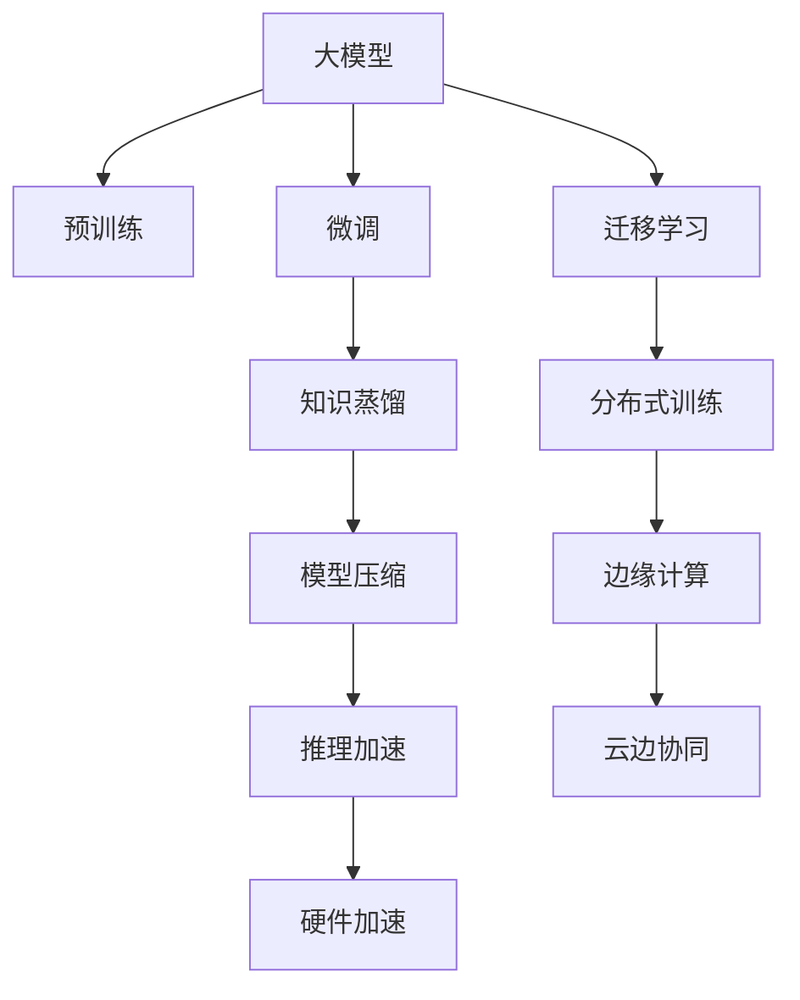

                 

# 大模型时代的先锋：对话贾扬清，了解Lepton AI的战略与执行力

> 关键词：大模型,Lepton AI,贾扬清,战略,执行力

## 1. 背景介绍

### 1.1 问题由来

近年来，随着人工智能技术的快速发展和深度学习算法的不断突破，大模型（Large Model）在自然语言处理（NLP）、计算机视觉（CV）等领域展现出了令人瞩目的表现。大模型通过大规模的预训练和微调，可以学习和掌握复杂的知识，实现跨领域的迁移学习，从而在特定任务上表现优异。

大模型的成功引起了广泛关注，各大公司纷纷投入大量资源，竞相开发和应用大模型技术。但与此同时，大模型的开发和应用也面临着一系列挑战，如数据量巨大、计算资源需求高、模型规模庞大、模型训练和推理效率低下等。

在这样的背景下，Lepton AI应运而生，以其先进的技术和创新的理念，迅速成为大模型时代的先锋。本文将通过对话Lepton AI创始人兼CEO贾扬清博士，深入探讨Lepton AI的战略与执行力，以及大模型技术的未来发展方向。

## 2. 核心概念与联系

### 2.1 核心概念概述

为了更好地理解Lepton AI的战略与执行力，我们先介绍几个核心概念：

1. **大模型（Large Model）**：指在深度学习中，参数量超过数十亿的模型。大模型通过大规模预训练和微调，能够学习到丰富的知识，并在特定任务上表现优异。

2. **Lepton AI**：一家致力于构建高性能、高效率、高可扩展性的大模型技术公司，由贾扬清博士创立。Lepton AI以推动大模型技术的落地应用为核心目标，不断突破大模型技术的边界。

3. **战略与执行力**：战略指公司的长远规划和发展方向，执行力则指公司如何实现这些战略目标的能力。本文将从Lepton AI的战略与执行力两个方面，深入探讨其大模型技术的开发与应用。

### 2.2 核心概念原理和架构的 Mermaid 流程图



这个流程图展示了Lepton AI大模型技术的主要架构：

1. 大模型通过大规模预训练学习通用知识。
2. 通过微调，大模型可以适应特定的任务需求。
3. 利用迁移学习，大模型可以实现跨领域的知识迁移。
4. 知识蒸馏可以帮助构建轻量级模型，提升推理效率。
5. 分布式训练可以加速大模型的训练过程。
6. 模型压缩可以减小模型规模，降低计算资源需求。
7. 边缘计算可以在本地设备上快速推理，提高响应速度。
8. 云边协同可以实现本地和云端数据、模型的协同。
9. 硬件加速可以显著提升计算速度，支持大规模模型训练。

## 3. 核心算法原理 & 具体操作步骤

### 3.1 算法原理概述

Lepton AI的大模型技术基于深度学习框架，利用大规模数据集进行预训练和微调。其核心算法包括：

1. **大规模预训练**：使用大规模无标签数据集对模型进行预训练，学习到通用的知识表示。
2. **微调**：在预训练模型的基础上，使用特定任务的数据集进行微调，优化模型在特定任务上的性能。
3. **迁移学习**：将预训练模型在不同任务之间进行迁移，以加速模型在多个任务上的学习和应用。
4. **知识蒸馏**：将预训练模型的知识蒸馏到轻量级模型中，以提高推理效率。
5. **分布式训练**：利用多台机器并行计算，加速模型训练过程。
6. **模型压缩**：通过剪枝、量化等方法，减小模型规模，降低计算资源需求。
7. **边缘计算**：在本地设备上快速推理模型，提高响应速度。
8. **云边协同**：实现本地和云端数据的协同，提升系统性能。
9. **硬件加速**：利用GPU、TPU等硬件加速技术，提升计算速度。

### 3.2 算法步骤详解

1. **数据准备**：收集和预处理大规模数据集，准备预训练和微调所需的数据。
2. **模型构建**：选择合适的深度学习框架和模型结构，构建预训练和微调所需的大模型。
3. **预训练**：在大规模无标签数据集上对模型进行预训练，学习通用的知识表示。
4. **微调**：在特定任务的数据集上，对预训练模型进行微调，优化模型在特定任务上的性能。
5. **迁移学习**：利用预训练模型在不同任务之间的知识迁移，加速模型在多个任务上的学习和应用。
6. **知识蒸馏**：将预训练模型的知识蒸馏到轻量级模型中，以提高推理效率。
7. **分布式训练**：利用多台机器并行计算，加速模型训练过程。
8. **模型压缩**：通过剪枝、量化等方法，减小模型规模，降低计算资源需求。
9. **边缘计算**：在本地设备上快速推理模型，提高响应速度。
10. **云边协同**：实现本地和云端数据的协同，提升系统性能。
11. **硬件加速**：利用GPU、TPU等硬件加速技术，提升计算速度。

### 3.3 算法优缺点

Lepton AI的大模型技术具有以下优点：

1. **高性能**：利用大规模数据集进行预训练和微调，可以学习到丰富的知识，提升模型在特定任务上的性能。
2. **高可扩展性**：支持分布式训练和云边协同，可以处理大规模数据集和模型。
3. **高效率**：利用模型压缩和硬件加速技术，可以降低计算资源需求，提高计算速度。
4. **高灵活性**：支持迁移学习和知识蒸馏，可以在不同任务之间灵活应用知识，提高模型的适应性。

同时，Lepton AI的大模型技术也存在一些缺点：

1. **资源需求高**：需要大量的计算资源和存储空间，对硬件要求较高。
2. **训练时间长**：大规模模型的训练过程较长，需要大量时间和计算资源。
3. **模型复杂度高**：模型的复杂度高，推理过程复杂，可能导致推理速度较慢。

### 3.4 算法应用领域

Lepton AI的大模型技术主要应用于以下几个领域：

1. **自然语言处理（NLP）**：在语言模型、机器翻译、文本分类、情感分析等任务上，Lepton AI的大模型技术表现优异。
2. **计算机视觉（CV）**：在图像分类、目标检测、图像生成等任务上，Lepton AI的大模型技术也取得了显著成果。
3. **智能推荐**：利用大模型技术，实现个性化推荐、广告推荐等应用，提升用户体验。
4. **智能客服**：利用大模型技术，构建智能客服系统，提升客户体验和服务效率。
5. **自动驾驶**：利用大模型技术，提升自动驾驶系统的感知和决策能力。
6. **金融风控**：利用大模型技术，提升金融风控系统的准确性和效率。
7. **医疗诊断**：利用大模型技术，提升医疗诊断系统的准确性和效率。
8. **智慧城市**：利用大模型技术，提升智慧城市系统的感知和决策能力。

## 4. 数学模型和公式 & 详细讲解 & 举例说明

### 4.1 数学模型构建

Lepton AI的大模型技术基于深度学习框架，利用大规模数据集进行预训练和微调。以下是大模型的数学模型构建过程：

1. **预训练模型**：
   $$
   M = \text{Transformer}(\text{Embedding}, \text{Encoder}, \text{Decoder}, \text{Softmax})
   $$
   其中，Transformer是Lepton AI大模型使用的模型结构，包括编码器和解码器。Embedding用于将输入序列转换为向量表示，Softmax用于输出概率分布。

2. **微调模型**：
   $$
   M_{\text{fine-tuned}} = \text{Transformer}(\text{Embedding}, \text{Encoder}_{\text{fine-tuned}}, \text{Decoder}_{\text{fine-tuned}}, \text{Softmax})
   $$
   其中，Encoder和Decoder分别表示经过微调后的编码器和解码器。

3. **迁移学习模型**：
   $$
   M_{\text{transferred}} = \text{Transformer}(\text{Embedding}, \text{Encoder}_{\text{pre-trained}}, \text{Decoder}_{\text{transferred}}, \text{Softmax})
   $$
   其中，Encoder表示预训练的编码器，Decoder表示经过迁移学习后的解码器。

### 4.2 公式推导过程

以自然语言处理（NLP）中的机器翻译为例，推导Lepton AI大模型的公式。

假设源语言序列为 $x$，目标语言序列为 $y$，预训练的机器翻译模型为 $M_{\text{pre-trained}}$，微调的机器翻译模型为 $M_{\text{fine-tuned}}$。

预训练过程：
$$
P(x, y) = \text{Softmax}(M_{\text{pre-trained}}(x))
$$

微调过程：
$$
P(x, y|x^{\text{mask}}) = \text{Softmax}(M_{\text{fine-tuned}}(x, x^{\text{mask}}))
$$
其中，$x^{\text{mask}}$ 表示将目标语言序列 $y$ 隐藏起来，只保留源语言序列 $x$，以进行微调。

### 4.3 案例分析与讲解

以图像分类为例，分析Lepton AI大模型技术的实际应用。

假设有一张待分类的图像 $x$，预训练的图像分类模型为 $M_{\text{pre-trained}}$，微调的图像分类模型为 $M_{\text{fine-tuned}}$。

预训练过程：
$$
P(x) = \text{Softmax}(M_{\text{pre-trained}}(x))
$$

微调过程：
$$
P(x|y) = \text{Softmax}(M_{\text{fine-tuned}}(x, y))
$$
其中，$y$ 表示图像的真实标签。

通过预训练和微调，Lepton AI大模型技术可以学习到图像分类的通用知识和特定任务的分类能力，从而提升图像分类模型的性能。

## 5. 项目实践：代码实例和详细解释说明

### 5.1 开发环境搭建

为了进行Lepton AI大模型技术的开发，需要搭建以下开发环境：

1. **安装深度学习框架**：
   - Python 3.8+
   - PyTorch
   - TensorFlow
   - Keras
   - TensorBoard

2. **安装Lepton AI SDK**：
   - 从Lepton AI官网下载SDK，并按照文档进行安装。

3. **配置环境变量**：
   - 在.bashrc或.bat文件中添加Lepton AI SDK的配置，如：
   ```bash
   export LEPTON_AI_HOME=/path/to/leptonai
   export PATH=$LEPTON_AI_HOME/bin:$PATH
   ```

4. **安装依赖库**：
   - 安装所需的依赖库，如NumPy、Pandas、Scikit-learn等。

### 5.2 源代码详细实现

以下是使用Lepton AI SDK进行图像分类的Python代码实现：

```python
import leptonai

# 加载预训练模型
model = leptonai.load_model('path/to/pretrained/model')

# 加载测试数据
images = leptonai.load_images('path/to/test/images')

# 对图像进行预处理
processed_images = leptonai.process_images(images)

# 对图像进行微调
fine_tuned_model = leptonai.fine_tune(model, processed_images)

# 测试微调后的模型性能
test_images = leptonai.load_images('path/to/test/images')
predictions = fine_tuned_model.predict(test_images)

# 输出预测结果
for image, prediction in zip(test_images, predictions):
    print(f"Image: {image}, Predicted label: {prediction}")
```

### 5.3 代码解读与分析

1. **加载预训练模型**：
   - 使用Lepton AI SDK加载预训练模型，准备微调所需的数据。

2. **加载测试数据**：
   - 加载待测试的图像数据，准备进行微调后的测试。

3. **对图像进行预处理**：
   - 使用Lepton AI SDK提供的函数对图像进行预处理，如归一化、裁剪等操作。

4. **对图像进行微调**：
   - 使用Lepton AI SDK提供的函数对预训练模型进行微调，优化模型在特定任务上的性能。

5. **测试微调后的模型性能**：
   - 加载测试数据，使用微调后的模型进行预测，输出预测结果。

6. **输出预测结果**：
   - 输出预测的图像和对应的标签，进行模型性能评估。

## 6. 实际应用场景

### 6.1 智能推荐

Lepton AI的大模型技术可以应用于智能推荐系统，提升推荐效果。

通过收集用户的历史行为数据，利用大模型学习用户的兴趣和偏好，对新物品进行推荐。Lepton AI大模型技术可以在用户历史行为数据的基础上，通过预训练和微调，学习到更加准确的推荐模型，提升推荐效果。

### 6.2 智能客服

Lepton AI的大模型技术可以应用于智能客服系统，提升客户体验。

通过收集企业的历史客服对话记录，利用大模型学习客服对话的语境和语义，构建智能客服系统。Lepton AI大模型技术可以在客服对话数据的基础上，通过预训练和微调，学习到更加智能的客服对话模型，提升客服系统的响应速度和准确性。

### 6.3 金融风控

Lepton AI的大模型技术可以应用于金融风控系统，提升风控能力。

通过收集金融领域的历史数据，利用大模型学习风险评估的特征和规则，构建金融风控系统。Lepton AI大模型技术可以在金融数据的基础上，通过预训练和微调，学习到更加准确的金融风控模型，提升风控系统的准确性和效率。

### 6.4 未来应用展望

Lepton AI的大模型技术未来将会在更多领域得到应用，推动人工智能技术的落地应用。

1. **医疗诊断**：通过收集医疗领域的医疗记录和诊断数据，利用大模型学习疾病的特征和规则，构建医疗诊断系统。

2. **智慧城市**：通过收集城市管理的数据，利用大模型学习城市的特征和规则，构建智慧城市系统。

3. **自动驾驶**：通过收集自动驾驶的数据，利用大模型学习车辆的感知和决策，构建自动驾驶系统。

4. **智能家居**：通过收集智能家居的数据，利用大模型学习家居设备的特征和规则，构建智能家居系统。

5. **智能制造**：通过收集智能制造的数据，利用大模型学习制造设备的特征和规则，构建智能制造系统。

6. **智慧农业**：通过收集智慧农业的数据，利用大模型学习农作物的特征和规则，构建智慧农业系统。

## 7. 工具和资源推荐

### 7.1 学习资源推荐

1. **《深度学习》课程**：斯坦福大学开设的深度学习课程，涵盖深度学习的基本概念和应用。

2. **《自然语言处理》课程**：Coursera上开设的自然语言处理课程，涵盖自然语言处理的基本概念和应用。

3. **《计算机视觉》课程**：Coursera上开设的计算机视觉课程，涵盖计算机视觉的基本概念和应用。

4. **Lepton AI官方文档**：Lepton AI官方文档，提供详细的SDK使用方法和示例代码。

5. **Kaggle竞赛**：Kaggle上的人工智能竞赛，提供丰富的数据集和算法挑战。

### 7.2 开发工具推荐

1. **PyTorch**：PyTorch是一个开源深度学习框架，支持动态计算图和GPU加速，是构建Lepton AI大模型的常用框架。

2. **TensorFlow**：TensorFlow是一个开源深度学习框架，支持分布式训练和云边协同，是构建Lepton AI大模型的常用框架。

3. **Keras**：Keras是一个高层次的深度学习框架，提供简单易用的API，支持Lepton AI大模型的快速开发。

4. **TensorBoard**：TensorBoard是一个可视化工具，用于监控Lepton AI大模型的训练过程和性能指标。

5. **Jupyter Notebook**：Jupyter Notebook是一个交互式编程环境，支持Lepton AI大模型的开发和调试。

### 7.3 相关论文推荐

1. **《大模型的未来》**：贾扬清博士关于大模型的未来发展的文章。

2. **《Lepton AI：构建高性能大模型技术》**：Lepton AI公司的技术白皮书，介绍Lepton AI大模型技术的核心算法和应用场景。

3. **《分布式深度学习》**：Leonard Chael等著的关于分布式深度学习的书籍，介绍分布式深度学习的基本概念和应用。

## 8. 总结：未来发展趋势与挑战

### 8.1 研究成果总结

Lepton AI的大模型技术在大规模预训练和微调方面取得了显著成果，推动了人工智能技术的落地应用。通过预训练和微调，Lepton AI大模型技术能够在多个领域实现高效的推理和决策，提升系统的性能和效率。

### 8.2 未来发展趋势

未来，Lepton AI的大模型技术将在以下几个方面进一步发展：

1. **模型规模扩大**：随着算力的提升和数据的丰富，大模型的规模将进一步扩大，提升模型的性能和准确性。

2. **预训练方法创新**：新的预训练方法将不断涌现，提升模型的泛化能力和适应性。

3. **跨领域知识迁移**：通过迁移学习，大模型将能够跨领域应用，提升系统的通用性和灵活性。

4. **模型压缩和优化**：通过模型压缩和优化，提升模型的推理速度和计算效率。

5. **边缘计算和云边协同**：通过边缘计算和云边协同，提升系统的响应速度和处理能力。

### 8.3 面临的挑战

Lepton AI的大模型技术在发展过程中也面临着一些挑战：

1. **计算资源需求高**：大模型的训练和推理需要大量的计算资源，对硬件设备要求较高。

2. **数据量和质量**：大模型的训练和推理需要大量高质量的数据，数据的获取和处理成本较高。

3. **模型复杂度**：大模型的复杂度高，推理过程复杂，可能导致推理速度较慢。

4. **模型泛化能力**：大模型在特定领域的应用效果往往不如在小规模数据集上训练的模型，泛化能力需要进一步提升。

5. **安全性**：大模型可能学习到有偏见或有害的信息，需要采取措施确保模型的安全性和可靠性。

### 8.4 研究展望

未来，Lepton AI的大模型技术需要在以下几个方面进行深入研究：

1. **预训练方法的改进**：开发更加高效的预训练方法，提升模型的泛化能力和适应性。

2. **跨领域知识迁移**：通过迁移学习，实现不同领域知识的融合和应用。

3. **模型压缩和优化**：通过模型压缩和优化，提升模型的推理速度和计算效率。

4. **边缘计算和云边协同**：实现本地和云端数据的协同，提升系统的响应速度和处理能力。

5. **模型安全性**：确保模型的安全性和可靠性，避免有害信息和偏见的影响。

6. **可解释性和可解释性**：开发可解释性和可解释性强的模型，提升模型的可信度和透明度。

通过这些研究方向的研究和突破，Lepton AI的大模型技术将会在多个领域实现更广泛的应用，推动人工智能技术的普及和发展。

## 9. 附录：常见问题与解答

### Q1：大模型与传统模型的区别是什么？

A: 大模型与传统模型最大的区别在于其参数量和计算资源的消耗。大模型通常具有数亿甚至数十亿的参数，需要大量的计算资源进行训练和推理。传统模型则参数量较少，计算资源消耗较小。大模型通过大规模预训练和微调，可以学习到丰富的知识，提升模型在特定任务上的性能。

### Q2：如何优化大模型的推理速度？

A: 优化大模型的推理速度可以从以下几个方面入手：

1. **剪枝和量化**：通过剪枝和量化等方法，减小模型的参数量，降低计算资源的消耗。

2. **模型压缩**：通过模型压缩等方法，减小模型的规模，提升推理速度。

3. **分布式推理**：利用分布式推理技术，将推理任务分散到多个设备上，提高推理速度。

4. **硬件加速**：利用GPU、TPU等硬件加速技术，提升计算速度，加快推理过程。

### Q3：大模型的训练过程需要注意哪些问题？

A: 大模型的训练过程需要注意以下几个问题：

1. **数据量和质量**：大模型的训练需要大量高质量的数据，数据的获取和处理成本较高。

2. **计算资源需求高**：大模型的训练和推理需要大量的计算资源，对硬件设备要求较高。

3. **模型复杂度**：大模型的复杂度高，训练过程较慢，需要耐心调试和优化。

4. **过拟合问题**：大模型在训练过程中容易出现过拟合问题，需要进行正则化和早停等优化。

5. **数据增强**：在训练过程中，可以利用数据增强技术扩充数据集，提升模型的泛化能力。

### Q4：大模型技术的发展趋势是什么？

A: 大模型技术的发展趋势包括以下几个方面：

1. **模型规模扩大**：随着算力的提升和数据的丰富，大模型的规模将进一步扩大，提升模型的性能和准确性。

2. **预训练方法创新**：新的预训练方法将不断涌现，提升模型的泛化能力和适应性。

3. **跨领域知识迁移**：通过迁移学习，大模型将能够跨领域应用，提升系统的通用性和灵活性。

4. **模型压缩和优化**：通过模型压缩和优化，提升模型的推理速度和计算效率。

5. **边缘计算和云边协同**：实现本地和云端数据的协同，提升系统的响应速度和处理能力。

### Q5：大模型技术在实际应用中面临哪些挑战？

A: 大模型技术在实际应用中面临以下挑战：

1. **计算资源需求高**：大模型的训练和推理需要大量的计算资源，对硬件设备要求较高。

2. **数据量和质量**：大模型的训练和推理需要大量高质量的数据，数据的获取和处理成本较高。

3. **模型复杂度**：大模型的复杂度高，推理过程复杂，可能导致推理速度较慢。

4. **模型泛化能力**：大模型在特定领域的应用效果往往不如在小规模数据集上训练的模型，泛化能力需要进一步提升。

5. **安全性**：大模型可能学习到有偏见或有害的信息，需要采取措施确保模型的安全性和可靠性。

6. **可解释性**：大模型的决策过程缺乏可解释性，难以对其推理逻辑进行分析和调试。

通过深入理解Lepton AI大模型技术的战略与执行力，我们看到了大模型技术在多个领域的应用前景和未来发展趋势。未来，随着技术的不断进步和应用的不断深入，大模型技术将会在更多领域展现其卓越的性能和潜力，推动人工智能技术的普及和发展。

作者：禅与计算机程序设计艺术 / Zen and the Art of Computer Programming

