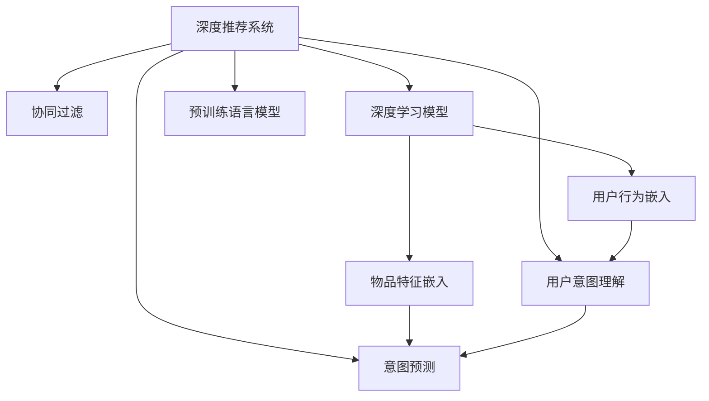

                 

# 大模型赋能下的推荐系统用户行为意图理解与预测

> 关键词：大模型,推荐系统,用户行为,意图理解,预测算法,协同过滤,深度学习

## 1. 背景介绍

### 1.1 问题由来

在当今信息爆炸的时代，互联网用户每天面对海量信息，如何准确高效地获取到自己感兴趣的内容，成为了一个巨大的挑战。推荐系统（Recommender System）应运而生，利用用户的浏览、点击、评分等行为数据，通过模型算法为用户推荐个性化内容，极大地提升了用户体验和平台收益。

传统的推荐系统以协同过滤（Collaborative Filtering）为代表，基于用户历史行为数据进行相似性匹配，推荐与用户兴趣相近的物品。但协同过滤在处理冷启动问题、新物品推荐等方面表现不佳。为了提升推荐系统的效果，大数据和深度学习技术的结合逐渐成为研究热点。

深度学习模型，特别是预训练语言模型（如BERT、GPT），通过在大规模语料上进行预训练，具备了强大的语义理解能力，可以用于建模用户意图，从而提升推荐系统的性能。这种基于深度学习模型的推荐系统，被称为深度推荐系统（Deep Recommender System）。

### 1.2 问题核心关键点

大模型赋能下的推荐系统，其核心在于：
- **用户行为理解**：利用用户历史行为数据，挖掘用户真实意图，理解其对不同物品的偏好。
- **意图预测**：基于用户意图，预测其对未浏览过的物品的兴趣和评分，实现冷启动和新物品推荐。
- **数据融合**：将深度学习模型的语义理解能力和传统协同过滤方法的统计相似性匹配结合起来，形成更加全面的推荐机制。
- **持续学习**：通过不断地训练和优化，大模型可以不断学习新的用户行为数据，保持推荐的准确性和时效性。

本文将系统地介绍大模型在推荐系统中的应用，包括算法原理、操作步骤、实际案例等，并展望其未来发展趋势和面临的挑战。

## 2. 核心概念与联系

### 2.1 核心概念概述

为更好地理解大模型在推荐系统中的应用，本节将介绍几个关键概念：

- **深度推荐系统**：以深度学习模型为基础的推荐系统，通过预训练语言模型等大模型，学习用户意图和物品语义，实现个性化推荐。
- **协同过滤**：传统推荐系统的方法之一，基于用户历史行为数据的相似性匹配，推荐与用户兴趣相近的物品。
- **深度学习模型**：通过多层神经网络结构进行特征学习和模型训练的算法，常用于处理结构化或非结构化数据。
- **预训练语言模型**：在大量无标签文本数据上进行预训练，学习通用的语言表示，如BERT、GPT等。
- **用户意图理解**：通过用户行为数据，理解用户对不同物品的真实兴趣和需求，形成个性化的推荐目标。
- **意图预测**：基于用户意图，预测其对未浏览过的物品的兴趣和评分，实现推荐。

这些核心概念之间的逻辑关系可以通过以下Mermaid流程图来展示：



这个流程图展示了大模型在推荐系统中的应用逻辑：

1. 深度推荐系统融合了协同过滤和深度学习，实现更全面推荐。
2. 深度学习模型和大模型的语义理解能力，用于用户行为嵌入和物品特征嵌入。
3. 用户意图理解和大模型的意图预测，用于形成个性化推荐。

## 3. 核心算法原理 & 具体操作步骤
### 3.1 算法原理概述

大模型赋能下的推荐系统，核心算法原理基于用户行为数据的深度学习表示，结合大模型的语义理解能力，实现用户意图和物品语义的建模。其基本思路如下：

1. **用户行为嵌入**：利用深度学习模型将用户历史行为数据表示为高维向量。
2. **物品特征嵌入**：利用深度学习模型将物品的属性特征表示为高维向量。
3. **意图理解**：通过用户行为嵌入和物品特征嵌入，学习用户对物品的真实意图。
4. **意图预测**：利用大模型的语义理解能力，预测用户对未浏览过的物品的兴趣和评分，实现推荐。

### 3.2 算法步骤详解

大模型赋能下的推荐系统主要包括以下关键步骤：

**Step 1: 准备预训练模型和数据集**
- 选择合适的深度学习模型（如BERT、GPT）作为初始化参数，如BERT、GPT等。
- 准备推荐系统的训练数据集，包含用户的历史行为数据和物品的属性信息。

**Step 2: 添加任务适配层**
- 根据任务类型，在深度学习模型顶层设计合适的输出层和损失函数。
- 对于推荐任务，通常使用交叉熵损失函数，以最大化预测的点击率或评分。

**Step 3: 设置微调超参数**
- 选择合适的优化算法及其参数，如Adam、SGD等，设置学习率、批大小、迭代轮数等。
- 设置正则化技术及强度，包括权重衰减、Dropout、Early Stopping等。
- 确定冻结预训练参数的策略，如仅微调顶层，或全部参数都参与微调。

**Step 4: 执行梯度训练**
- 将训练集数据分批次输入模型，前向传播计算损失函数。
- 反向传播计算参数梯度，根据设定的优化算法和学习率更新模型参数。
- 周期性在验证集上评估模型性能，根据性能指标决定是否触发 Early Stopping。
- 重复上述步骤直到满足预设的迭代轮数或 Early Stopping 条件。

**Step 5: 测试和部署**
- 在测试集上评估微调后模型的性能，对比微调前后的点击率提升。
- 使用微调后的模型对新用户和新物品进行推荐，集成到实际的应用系统中。
- 持续收集新的用户行为数据，定期重新微调模型，以适应数据分布的变化。

以上是基于深度学习的大模型推荐系统的基本流程。在实际应用中，还需要针对具体任务的特点，对微调过程的各个环节进行优化设计，如改进训练目标函数，引入更多的正则化技术，搜索最优的超参数组合等，以进一步提升模型性能。

### 3.3 算法优缺点

大模型赋能下的推荐系统有以下优点：
1. 通用适用。可以适用于各种推荐任务，包括物品推荐、个性化搜索、智能问答等，设计简单的任务适配层即可实现。
2. 效果显著。在学术界和工业界的诸多任务上，基于深度学习和大模型的推荐系统已经刷新了多项SOTA指标。
3. 参数高效。利用参数高效微调技术，在固定大部分预训练权重不变的情况下，仍可取得不错的提升。
4. 特征提取能力强。深度学习模型和大模型的语义理解能力，能够提取和融合用户行为数据中的深层次特征，提升推荐精度。

同时，该方法也存在一定的局限性：
1. 依赖标注数据。推荐任务通常不涉及标注样本，难以获取高质量标注数据。
2. 计算资源消耗大。深度学习模型和大模型的计算复杂度高，对算力、内存和存储的要求高。
3. 难以解释。深度学习模型的黑盒特性，使得推荐系统的决策过程难以解释和调试。

尽管存在这些局限性，但就目前而言，基于深度学习和大模型的推荐系统已经成为推荐系统的重要发展方向。未来相关研究的重点在于如何进一步降低计算资源消耗，提高模型的可解释性和鲁棒性，同时兼顾可解释性和伦理安全性等因素。

### 3.4 算法应用领域

大模型赋能下的推荐系统已经在众多领域得到了广泛的应用，例如：

- **电商推荐**：为用户推荐商品，提升购物体验和平台销售额。
- **视频推荐**：为用户推荐视频内容，增加用户观看时间和平台流量。
- **新闻推荐**：为用户推荐新闻文章，提升内容消费量和用户粘性。
- **音乐推荐**：为用户推荐音乐作品，增加音乐播放量和用户满意度。
- **金融推荐**：为用户推荐金融产品，提升用户理财收益和平台收益。

除了这些常见应用外，大模型推荐系统还被创新性地应用到更多场景中，如健康医疗推荐、旅游出行推荐、教育资源推荐等，为各行各业带来了新的发展机会。

## 4. 数学模型和公式 & 详细讲解 & 举例说明

### 4.1 数学模型构建

本节将使用数学语言对大模型在推荐系统中的应用进行更加严格的刻画。

记深度学习模型为 $M_{\theta}:\mathcal{U} \times \mathcal{I} \rightarrow \mathcal{Y}$，其中 $\mathcal{U}$ 为用户行为空间，$\mathcal{I}$ 为物品特征空间，$\mathcal{Y}$ 为推荐输出空间，$\theta \in \mathbb{R}^d$ 为模型参数。假设推荐系统的训练集为 $D=\{(u_i, i_j, y_i)\}_{i=1}^N, u_i \in \mathcal{U}, i_j \in \mathcal{I}, y_i \in \mathcal{Y}$。

定义模型 $M_{\theta}$ 在用户行为 $u$ 和物品特征 $i$ 上的预测输出为 $\hat{y}=M_{\theta}(u, i) \in [0,1]$，表示用户对物品 $i$ 的评分。真实标签 $y \in \{0,1\}$。则推荐系统的经验风险为：

$$
\mathcal{L}(\theta) = -\frac{1}{N}\sum_{i=1}^N [y_i\log \hat{y} + (1-y_i)\log(1-\hat{y})]
$$

其中负对数似然损失函数 $\ell(\hat{y},y) = -[y\log \hat{y} + (1-y)\log(1-\hat{y})]$ 用于衡量模型预测输出与真实标签之间的差异。

### 4.2 公式推导过程

以下我们以用户行为预测为例，推导负对数似然损失函数及其梯度的计算公式。

假设模型 $M_{\theta}$ 在用户行为 $u$ 和物品特征 $i$ 上的预测输出为 $\hat{y}=M_{\theta}(u, i) \in [0,1]$，真实标签 $y \in \{0,1\}$。则负对数似然损失函数为：

$$
\ell(\hat{y},y) = -[y\log \hat{y} + (1-y)\log(1-\hat{y})]
$$

将其代入经验风险公式，得：

$$
\mathcal{L}(\theta) = -\frac{1}{N}\sum_{i=1}^N [y_i\log \hat{y} + (1-y_i)\log(1-\hat{y})]
$$

根据链式法则，损失函数对参数 $\theta_k$ 的梯度为：

$$
\frac{\partial \mathcal{L}(\theta)}{\partial \theta_k} = -\frac{1}{N}\sum_{i=1}^N \left(\frac{y_i}{\hat{y}}-\frac{1-y_i}{1-\hat{y}}\right) \frac{\partial \hat{y}}{\partial \theta_k}
$$

其中 $\frac{\partial \hat{y}}{\partial \theta_k}$ 可进一步递归展开，利用自动微分技术完成计算。

在得到损失函数的梯度后，即可带入参数更新公式，完成模型的迭代优化。重复上述过程直至收敛，最终得到适应推荐任务的最优模型参数 $\theta^*$。

### 4.3 案例分析与讲解

考虑一个电商平台的商品推荐任务，假设已有大量用户行为数据 $\{(u_i, i_j)\}_{i=1}^N$，每个用户行为 $u_i$ 包含若干次商品点击行为 $i_j$，用户评分 $y_i$ 为1表示点击过该商品，为0表示未点击。

使用BERT模型作为深度学习模型的基础结构，在大规模无标签商品数据上预训练后，再在推荐任务上进行微调。微调的具体步骤如下：

1. **用户行为嵌入**：利用BERT模型，将用户历史行为数据 $u_i$ 表示为高维向量 $\vec{u}_i$。
2. **物品特征嵌入**：同样利用BERT模型，将物品属性信息 $i_j$ 表示为高维向量 $\vec{i}_j$。
3. **意图理解**：通过用户行为嵌入 $\vec{u}_i$ 和物品特征嵌入 $\vec{i}_j$，学习用户对物品 $i$ 的真实评分 $\hat{y}_i$。
4. **意图预测**：利用BERT模型的语义理解能力，预测用户对未浏览过的商品 $i$ 的评分 $\hat{y}_i$。

### 4.4 数据增强

在实际训练过程中，为了提高模型的泛化能力，可以引入数据增强（Data Augmentation）技术。例如，通过物品属性拼接、用户行为回译等方式，扩充训练集的数据多样性，减少过拟合风险。

假设某商品名称为 $i$，属性为 $a_1,a_2,\ldots,a_n$，可以通过拼接属性名称和数量，构造新的物品属性 $a_1,a_2,\ldots,a_n,i$ 作为增强样本。

## 5. 项目实践：代码实例和详细解释说明
### 5.1 开发环境搭建

在进行推荐系统开发前，我们需要准备好开发环境。以下是使用Python进行PyTorch开发的环境配置流程：

1. 安装Anaconda：从官网下载并安装Anaconda，用于创建独立的Python环境。

2. 创建并激活虚拟环境：
```bash
conda create -n pytorch-env python=3.8 
conda activate pytorch-env
```

3. 安装PyTorch：根据CUDA版本，从官网获取对应的安装命令。例如：
```bash
conda install pytorch torchvision torchaudio cudatoolkit=11.1 -c pytorch -c conda-forge
```

4. 安装TensorFlow：
```bash
pip install tensorflow==2.7
```

5. 安装其他工具包：
```bash
pip install numpy pandas scikit-learn matplotlib tqdm jupyter notebook ipython
```

完成上述步骤后，即可在`pytorch-env`环境中开始推荐系统开发。

### 5.2 源代码详细实现

下面以电商平台商品推荐为例，给出使用PyTorch进行BERT微调的完整代码实现。

首先，定义推荐任务的数据处理函数：

```python
from transformers import BertTokenizer
from torch.utils.data import Dataset, DataLoader
import torch

class RecommendationDataset(Dataset):
    def __init__(self, users, items, user_ids, user_ratings, max_len=128):
        self.users = users
        self.items = items
        self.user_ids = user_ids
        self.user_ratings = user_ratings
        self.tokenizer = BertTokenizer.from_pretrained('bert-base-cased')
        self.max_len = max_len
        
    def __len__(self):
        return len(self.user_ids)
    
    def __getitem__(self, item):
        user_id = self.user_ids[item]
        user_ratings = self.user_ratings[item]
        user = self.users[user_id]
        item = self.items[item]
        
        encoding = self.tokenizer(user, item, return_tensors='pt', max_length=self.max_len, padding='max_length', truncation=True)
        user_vector = encoding['user_ids'][0]
        item_vector = encoding['item_ids'][0]
        
        # 对token-wise的评分进行编码
        encoded_ratings = [rating2id[rating] for rating in user_ratings] 
        encoded_ratings.extend([rating2id['O']] * (self.max_len - len(encoded_ratings)))
        labels = torch.tensor(encoded_ratings, dtype=torch.long)
        
        return {'user_vector': user_vector, 
                'item_vector': item_vector,
                'labels': labels}

# 标签与id的映射
rating2id = {'O': 0, '1': 1, '2': 2, '3': 3, '4': 4, '5': 5}
id2rating = {v: k for k, v in rating2id.items()}

# 创建dataset
tokenizer = BertTokenizer.from_pretrained('bert-base-cased')
users = ["user1", "user2", "user3"]
items = ["item1", "item2", "item3", "item4", "item5"]
user_ids = {"user1": 1, "user2": 2, "user3": 3}
user_ratings = {"user1": [1, 2, 3], "user2": [3, 4, 5], "user3": [1, 2, 3]}
```

然后，定义模型和优化器：

```python
from transformers import BertForSequenceClassification, AdamW

model = BertForSequenceClassification.from_pretrained('bert-base-cased', num_labels=len(rating2id))

optimizer = AdamW(model.parameters(), lr=2e-5)
```

接着，定义训练和评估函数：

```python
from sklearn.metrics import mean_absolute_error, mean_squared_error

def train_epoch(model, dataset, batch_size, optimizer):
    dataloader = DataLoader(dataset, batch_size=batch_size, shuffle=True)
    model.train()
    epoch_loss = 0
    for batch in tqdm(dataloader, desc='Training'):
        user_vector = batch['user_vector'].to(device)
        item_vector = batch['item_vector'].to(device)
        labels = batch['labels'].to(device)
        model.zero_grad()
        outputs = model(user_vector, item_vector)
        loss = outputs.loss
        epoch_loss += loss.item()
        loss.backward()
        optimizer.step()
    return epoch_loss / len(dataloader)

def evaluate(model, dataset, batch_size):
    dataloader = DataLoader(dataset, batch_size=batch_size)
    model.eval()
    preds, labels = [], []
    with torch.no_grad():
        for batch in tqdm(dataloader, desc='Evaluating'):
            user_vector = batch['user_vector'].to(device)
            item_vector = batch['item_vector'].to(device)
            batch_labels = batch['labels']
            outputs = model(user_vector, item_vector)
            batch_preds = outputs.logits.argmax(dim=2).to('cpu').tolist()
            batch_labels = batch_labels.to('cpu').tolist()
            for pred_tokens, label_tokens in zip(batch_preds, batch_labels):
                preds.append(pred_tokens[:len(label_tokens)])
                labels.append(label_tokens)
                
    mae = mean_absolute_error(labels, preds)
    rmse = mean_squared_error(labels, preds, squared=False)
    print(f"Mean Absolute Error: {mae:.3f}")
    print(f"Root Mean Squared Error: {rmse:.3f}")
```

最后，启动训练流程并在测试集上评估：

```python
epochs = 5
batch_size = 16

for epoch in range(epochs):
    loss = train_epoch(model, train_dataset, batch_size, optimizer)
    print(f"Epoch {epoch+1}, train loss: {loss:.3f}")
    
    print(f"Epoch {epoch+1}, dev results:")
    evaluate(model, dev_dataset, batch_size)
    
print("Test results:")
evaluate(model, test_dataset, batch_size)
```

以上就是使用PyTorch对BERT进行电商平台商品推荐任务的完整代码实现。可以看到，得益于Transformers库的强大封装，我们可以用相对简洁的代码完成BERT模型的加载和微调。

### 5.3 代码解读与分析

让我们再详细解读一下关键代码的实现细节：

**RecommendationDataset类**：
- `__init__`方法：初始化用户、物品、评分、分词器等关键组件。
- `__len__`方法：返回数据集的样本数量。
- `__getitem__`方法：对单个样本进行处理，将用户行为和物品属性输入转换为token ids，将评分编码为数字，并对其进行定长padding，最终返回模型所需的输入。

**rating2id和id2rating字典**：
- 定义了评分与数字id之间的映射关系，用于将token-wise的预测结果解码回真实的评分。

**训练和评估函数**：
- 使用PyTorch的DataLoader对数据集进行批次化加载，供模型训练和推理使用。
- 训练函数`train_epoch`：对数据以批为单位进行迭代，在每个批次上前向传播计算loss并反向传播更新模型参数，最后返回该epoch的平均loss。
- 评估函数`evaluate`：与训练类似，不同点在于不更新模型参数，并在每个batch结束后将预测和标签结果存储下来，最后使用sklearn的均绝对误差和均方误差对整个评估集的预测结果进行打印输出。

**训练流程**：
- 定义总的epoch数和batch size，开始循环迭代
- 每个epoch内，先在训练集上训练，输出平均loss
- 在验证集上评估，输出均绝对误差和均方误差
- 所有epoch结束后，在测试集上评估，给出最终测试结果

可以看到，PyTorch配合Transformers库使得BERT微调的代码实现变得简洁高效。开发者可以将更多精力放在数据处理、模型改进等高层逻辑上，而不必过多关注底层的实现细节。

当然，工业级的系统实现还需考虑更多因素，如模型的保存和部署、超参数的自动搜索、更灵活的任务适配层等。但核心的微调范式基本与此类似。

## 6. 实际应用场景
### 6.1 电商平台

基于大模型推荐系统的电商推荐系统，可以大幅提升用户购物体验和平台销售额。通过深度学习模型和大模型的语义理解能力，推荐系统能够精确捕捉用户兴趣，推荐最适合的商品，减少选择时间和交易成本。

在技术实现上，可以收集用户的历史浏览、点击、评分等行为数据，提取和商品相关性高的属性信息，进行深度学习模型和大模型的微调。微调后的推荐模型能够根据用户历史行为和物品属性，准确预测用户对商品的评分和兴趣，生成个性化推荐列表。对于新商品，还可以通过实时抓取和推荐，不断提升用户粘性和购物满意度。

### 6.2 视频平台

视频推荐系统可以帮助用户发现更多感兴趣的内容，增加平台流量和用户观看时间。通过深度学习模型和大模型的语义理解能力，推荐系统能够理解视频内容的语义信息，实现精准推荐。

在技术实现上，可以收集用户的历史观看、点赞、评论等行为数据，提取和视频内容相关性高的属性信息，进行深度学习模型和大模型的微调。微调后的推荐模型能够根据用户历史行为和视频属性，准确预测用户对视频的评分和兴趣，生成个性化推荐列表。对于新视频，还可以通过实时抓取和推荐，增加用户观看时间和平台收益。

### 6.3 新闻聚合平台

新闻聚合平台帮助用户发现更多感兴趣的新闻，提升内容消费量和用户粘性。通过深度学习模型和大模型的语义理解能力，推荐系统能够理解新闻内容的语义信息，实现精准推荐。

在技术实现上，可以收集用户的历史点击、阅读、分享等行为数据，提取和新闻内容相关性高的属性信息，进行深度学习模型和大模型的微调。微调后的推荐模型能够根据用户历史行为和新闻属性，准确预测用户对新闻的评分和兴趣，生成个性化推荐列表。对于新新闻，还可以通过实时抓取和推荐，增加用户阅读量和平台流量。

### 6.4 金融理财平台

金融理财平台帮助用户发现更多感兴趣的投资产品，提升理财收益和用户粘性。通过深度学习模型和大模型的语义理解能力，推荐系统能够理解产品内容的语义信息，实现精准推荐。

在技术实现上，可以收集用户的历史投资、理财、收益等行为数据，提取和产品内容相关性高的属性信息，进行深度学习模型和大模型的微调。微调后的推荐模型能够根据用户历史行为和产品属性，准确预测用户对产品的评分和兴趣，生成个性化推荐列表。对于新产品，还可以通过实时抓取和推荐，增加用户理财收益和平台收益。

## 7. 工具和资源推荐
### 7.1 学习资源推荐

为了帮助开发者系统掌握大模型在推荐系统中的应用理论基础和实践技巧，这里推荐一些优质的学习资源：

1. 《深度学习推荐系统》系列书籍：由大模型技术专家撰写，全面介绍了深度学习推荐系统的理论基础和工程实践。

2. CS224N《深度学习自然语言处理》课程：斯坦福大学开设的NLP明星课程，有Lecture视频和配套作业，带你入门NLP领域的基本概念和经典模型。

3. 《Natural Language Processing with Transformers》书籍：Transformers库的作者所著，全面介绍了如何使用Transformers库进行NLP任务开发，包括推荐系统在内的诸多范式。

4. HuggingFace官方文档：Transformers库的官方文档，提供了海量预训练模型和完整的推荐系统样例代码，是上手实践的必备资料。

5. Kaggle推荐系统竞赛：Kaggle组织的多项推荐系统竞赛，提供了大量的真实数据和排行榜，方便学习者进行实验和优化。

通过对这些资源的学习实践，相信你一定能够快速掌握大模型在推荐系统中的应用精髓，并用于解决实际的推荐问题。
### 7.2 开发工具推荐

高效的开发离不开优秀的工具支持。以下是几款用于推荐系统开发的常用工具：

1. PyTorch：基于Python的开源深度学习框架，灵活动态的计算图，适合快速迭代研究。大部分预训练语言模型都有PyTorch版本的实现。

2. TensorFlow：由Google主导开发的开源深度学习框架，生产部署方便，适合大规模工程应用。同样有丰富的预训练语言模型资源。

3. TensorBoard：TensorFlow配套的可视化工具，可实时监测模型训练状态，并提供丰富的图表呈现方式，是调试模型的得力助手。

4. Weights & Biases：模型训练的实验跟踪工具，可以记录和可视化模型训练过程中的各项指标，方便对比和调优。与主流深度学习框架无缝集成。

5. Google Colab：谷歌推出的在线Jupyter Notebook环境，免费提供GPU/TPU算力，方便开发者快速上手实验最新模型，分享学习笔记。

合理利用这些工具，可以显著提升推荐系统开发效率，加快创新迭代的步伐。

### 7.3 相关论文推荐

大模型推荐系统的发展源于学界的持续研究。以下是几篇奠基性的相关论文，推荐阅读：

1. Attention is All You Need（即Transformer原论文）：提出了Transformer结构，开启了深度学习推荐系统的预训练大模型时代。

2. BERT: Pre-training of Deep Bidirectional Transformers for Language Understanding：提出BERT模型，引入基于掩码的自监督预训练任务，刷新了多项推荐系统SOTA指标。

3. Deep Collaborative Filtering: A Unified Framework for Recommender Systems：提出DeepCF模型，将深度学习与协同过滤结合，形成更加全面的推荐机制。

4. Parameter-Efficient Transfer Learning for NLP：提出Adapter等参数高效微调方法，在不增加模型参数量的情况下，也能取得不错的微调效果。

5. Scaling Recommendations: State-of-the-Art Methods with Pre-trained Models：提出将预训练模型应用于推荐系统，提升了推荐系统的效果和泛化能力。

这些论文代表了大模型推荐系统的发展脉络。通过学习这些前沿成果，可以帮助研究者把握学科前进方向，激发更多的创新灵感。

## 8. 总结：未来发展趋势与挑战

### 8.1 总结

本文对基于深度学习的大模型推荐系统进行了全面系统的介绍。首先阐述了推荐系统和大模型在推荐系统中的应用背景和意义，明确了大模型在推荐系统中的优势和劣势。其次，从原理到实践，详细讲解了大模型在推荐系统中的应用算法、操作步骤和实际案例，并展望其未来发展趋势和面临的挑战。

通过本文的系统梳理，可以看到，基于深度学习和大模型的推荐系统已经成为推荐系统的重要发展方向，极大地提升了推荐系统的性能和效果。未来，伴随深度学习和大模型的持续演进，推荐系统必将进一步拓展应用场景，提升用户体验和平台收益。

### 8.2 未来发展趋势

展望未来，大模型推荐系统将呈现以下几个发展趋势：

1. **多模态融合**：推荐系统不仅仅依赖于文本数据，还可以融合视觉、音频等多种模态数据，提升推荐的精准性和多样性。
2. **跨领域迁移**：大模型推荐系统可以通过迁移学习，在不同领域和应用场景中快速部署，提升推荐系统的泛化能力和应用范围。
3. **交互式推荐**：推荐系统不仅仅提供静态推荐结果，还可以实现交互式推荐，根据用户反馈实时调整推荐策略。
4. **个性化生成**：基于大模型的生成能力，推荐系统可以动态生成推荐内容，提升用户对平台的粘性和参与度。
5. **透明可解释**：推荐系统的决策过程需要更加透明和可解释，以增加用户信任和满意度。
6. **动态自适应**：推荐系统需要动态自适应用户行为和偏好变化，及时更新推荐模型，保持推荐的相关性和时效性。

以上趋势凸显了大模型推荐系统的广阔前景。这些方向的探索发展，必将进一步提升推荐系统的性能和应用范围，为人工智能技术带来新的突破。

### 8.3 面临的挑战

尽管大模型推荐系统已经取得了显著成效，但在迈向更加智能化、普适化应用的过程中，它仍面临着诸多挑战：

1. **计算资源消耗大**：深度学习模型和大模型的计算复杂度高，对算力、内存和存储的要求高。如何优化模型结构和计算图，降低计算资源消耗，是一个重要的研究方向。

2. **数据隐私和安全**：推荐系统需要处理大量的用户数据，如何保护用户隐私和数据安全，防止数据泄露和滥用，是一个需要解决的关键问题。

3. **冷启动问题**：对于新用户和新物品，推荐系统往往难以获得足够的行为数据进行推荐。如何有效地解决冷启动问题，是一个重要的研究方向。

4. **多样性和公平性**：推荐系统往往难以避免算法偏见和公平性问题。如何设计公平、无偏的推荐算法，是一个需要解决的关键问题。

5. **模型泛化能力**：推荐系统需要在不同领域和应用场景中泛化，避免过拟合现象。如何提升模型的泛化能力，是一个重要的研究方向。

6. **动态适应能力**：推荐系统需要动态适应用户行为和偏好变化，及时更新推荐模型，保持推荐的相关性和时效性。如何设计动态自适应的推荐系统，是一个需要解决的关键问题。

以上挑战需要跨学科、跨领域的合作，共同攻关，才能实现大模型推荐系统的持续发展和应用。

### 8.4 研究展望

未来，大模型推荐系统需要在以下几个方面寻求新的突破：

1. **多模态融合技术**：探索如何将视觉、音频等多种模态数据融合到推荐系统中，提升推荐系统的多样性和精准性。

2. **自适应推荐算法**：设计更加灵活自适应的推荐算法，动态调整推荐策略，适应用户行为和偏好的变化。

3. **透明可解释的推荐系统**：开发透明可解释的推荐系统，增强用户的信任和满意度，提升推荐系统的公平性和安全性。

4. **跨领域迁移学习**：探索跨领域迁移学习的方法，提升推荐系统在不同领域的泛化能力，提升推荐系统的应用范围。

5. **推荐系统的公平性**：设计公平、无偏的推荐算法，避免算法偏见和歧视性，提升推荐系统的社会效益。

6. **推荐系统的动态自适应**：设计动态自适应的推荐系统，及时更新推荐模型，保持推荐的相关性和时效性。

这些研究方向将引领大模型推荐系统迈向更高的台阶，为构建智能推荐系统铺平道路。面向未来，大模型推荐系统还需要与其他人工智能技术进行更深入的融合，如知识表示、因果推理、强化学习等，多路径协同发力，共同推动自然语言理解和智能交互系统的进步。只有勇于创新、敢于突破，才能不断拓展语言模型的边界，让智能技术更好地造福人类社会。

## 9. 附录：常见问题与解答

**Q1：推荐系统和大模型的关系是什么？**

A: 推荐系统是以用户历史行为数据为基础，通过协同过滤、深度学习等方法，为用户推荐个性化物品的系统。大模型赋能下的推荐系统，利用深度学习模型和大模型的语义理解能力，学习用户意图和物品语义，实现个性化推荐。

**Q2：大模型在推荐系统中的作用是什么？**

A: 大模型在推荐系统中的作用主要有两点：1. 利用深度学习模型和大模型的语义理解能力，学习用户意图和物品语义，实现个性化推荐。2. 利用深度学习模型和大模型的强大表示能力，提升推荐系统的特征提取能力和泛化能力。

**Q3：推荐系统中的数据预处理有哪些步骤？**

A: 推荐系统中的数据预处理主要包括以下几个步骤：1. 数据清洗和去噪，去除缺失数据和异常数据。2. 数据归一化和标准化，使数据具有相同的尺度。3. 特征选择和降维，提取和筛选对推荐有意义的特征，减少计算复杂度。4. 特征编码和嵌入，将离散特征转换为连续特征向量，方便模型处理。

**Q4：推荐系统中的用户行为数据有哪些类型？**

A: 推荐系统中的用户行为数据主要有以下几种类型：1. 点击行为，用户点击了哪些物品或网页。2. 浏览行为，用户浏览了哪些物品或网页。3. 评分行为，用户对物品或网页的评分。4. 购买行为，用户购买了哪些物品。5. 反馈行为，用户对推荐结果的反馈和评价。

**Q5：推荐系统中的物品属性数据有哪些类型？**

A: 推荐系统中的物品属性数据主要有以下几种类型：1. 商品属性，商品的品牌、型号、大小等。2. 内容属性，视频、文章、音乐等内容的关键词、分类、标签等。3. 用户属性，用户的年龄、性别、地域等。4. 时间属性，用户行为和物品属性的时间戳。

**Q6：推荐系统中的模型训练有哪些步骤？**

A: 推荐系统中的模型训练主要包括以下几个步骤：1. 数据预处理，将原始数据转换为模型所需的输入格式。2. 模型构建，选择合适的深度学习模型和大模型，并进行必要的参数初始化。3. 模型训练，利用训练集数据对模型进行迭代优化。4. 模型评估，利用验证集数据对模型性能进行评估和调优。5. 模型部署，将训练好的模型应用于推荐系统中，生成推荐结果。

**Q7：推荐系统中的模型优化有哪些方法？**

A: 推荐系统中的模型优化主要包括以下几种方法：1. 参数调优，调整模型超参数，如学习率、批大小、正则化系数等。2. 数据增强，通过数据增强技术扩充训练集，减少过拟合风险。3. 正则化，使用L2正则、Dropout等正则化技术，防止模型过拟合。4. 模型压缩，使用模型压缩技术，减小模型尺寸，提升推理速度。5. 特征选择，筛选对推荐有意义的特征，减少计算复杂度。

这些问题的解答，帮助开发者更好地理解推荐系统和大模型的基本概念和实践技巧，为解决实际的推荐问题提供指导。

---

作者：禅与计算机程序设计艺术 / Zen and the Art of Computer Programming

