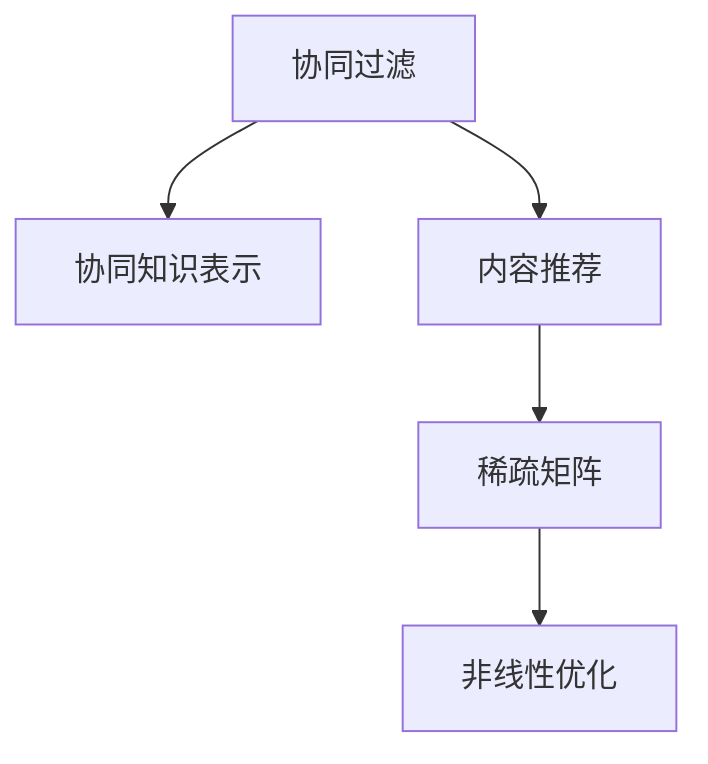

                 

# 大模型驱动的推荐系统多目标联合优化框架

> 关键词：推荐系统,大模型,多目标优化,联合优化,协同过滤,协同知识表示,稀疏矩阵,非线性优化

## 1. 背景介绍

### 1.1 问题由来
推荐系统是互联网时代的核心技术之一，旨在根据用户的历史行为和偏好，推荐个性化内容或商品，从而提升用户满意度，推动平台商业化。当前，推荐系统的主要算法包括协同过滤(Collaborative Filtering, CF)和内容推荐(Content-based Recommendation)。协同过滤通过用户-物品评分矩阵计算用户间的相似度，找到与目标用户兴趣相似的其他用户，并推荐其喜欢的物品；内容推荐则通过物品的特征向量和用户的特征向量计算相似度，找到与用户兴趣相关的物品。

然而，传统的协同过滤和内容推荐方法都存在一定的局限性。协同过滤算法依赖于足够的用户历史评分数据，且无法处理冷启动用户和新物品的问题；内容推荐算法无法利用用户的行为数据，且对用户特征的建模较为粗略。此外，推荐系统还需要面对诸多实际挑战，如处理长尾物品、抵抗恶意攻击、动态更新模型等。

为了克服这些局限性，研究人员提出了一系列改进算法和模型。但受限于计算资源和数据量，推荐系统仍然难以完全解决上述问题。近年来，随着大模型的出现，推荐系统开始引入深度学习模型和预训练模型，大大提升了推荐效果。但大模型推荐系统的训练成本和资源消耗也随之大幅上升，如何在资源受限的情况下优化模型性能成为新的研究热点。

### 1.2 问题核心关键点
为了在资源有限的情况下优化大模型推荐系统的性能，需要引入多目标联合优化的思想，实现多个性能指标的协同优化。多目标优化可以表示为最大化目标函数$f(x)$和$g(x)$：

$$
\max_{x} \quad f(x)\\
\text{s.t.} \quad g(x) \leq 0
$$

其中$f(x)$为优化目标函数，$g(x)$为约束条件。

推荐系统中的优化目标通常包括准确率、召回率、多样性等。约束条件则包括模型的训练成本、计算资源消耗等。如何将这些优化目标和约束条件结合，实现大模型推荐系统的高效优化，成为当前研究的重要课题。

### 1.3 问题研究意义
多目标优化框架可以为推荐系统带来显著的性能提升。通过综合考虑多个性能指标和资源约束，可以更全面地优化模型性能，提升用户体验，同时控制模型训练成本和资源消耗。此外，多目标优化框架还能够帮助推荐系统适应不断变化的数据分布和用户需求，提升系统的稳定性和鲁棒性。

因此，研究多目标联合优化的大模型推荐系统，对于提升推荐系统性能、控制训练成本、优化用户体验具有重要意义。通过系统性地优化模型性能和计算资源，可以更好地推动推荐系统在实际应用中的落地和部署。

## 2. 核心概念与联系

### 2.1 核心概念概述

为更好地理解大模型推荐系统的多目标优化框架，本节将介绍几个密切相关的核心概念：

- 协同过滤(Collaborative Filtering, CF)：推荐系统中最常用的方法之一，通过用户-物品评分矩阵计算用户间的相似度，找到与目标用户兴趣相似的其他用户，并推荐其喜欢的物品。
- 内容推荐(Content-based Recommendation)：通过物品的特征向量和用户的特征向量计算相似度，找到与用户兴趣相关的物品。
- 协同知识表示(Knowledge-aware Collaborative Filtering)：结合知识图谱等外部知识，提升协同过滤的效果。
- 稀疏矩阵(Sparse Matrix)：推荐系统中的评分矩阵通常为稀疏矩阵，大部分元素为0。
- 非线性优化(Nonlinear Optimization)：推荐系统中的优化目标通常包含非线性函数，需要非线性优化算法进行求解。

这些核心概念之间的逻辑关系可以通过以下Mermaid流程图来展示：



这个流程图展示了大模型推荐系统中的几个核心概念及其之间的关系：

1. 协同过滤是最常用的推荐算法，通过用户-物品评分矩阵计算用户间的相似度。
2. 协同知识表示结合了知识图谱等外部知识，提升了协同过滤的效果。
3. 内容推荐通过物品和用户的特征向量计算相似度，找到与用户兴趣相关的物品。
4. 稀疏矩阵是推荐系统中的评分矩阵，大部分元素为0。
5. 非线性优化用于求解推荐系统中的优化目标函数，通常包括准确率、召回率、多样性等。

这些核心概念共同构成了大模型推荐系统的工作原理和优化方向。通过理解这些核心概念，我们可以更好地把握推荐系统的学习过程和优化策略。

## 3. 核心算法原理 & 具体操作步骤
### 3.1 算法原理概述

大模型驱动的推荐系统多目标优化框架，本质上是一个多目标优化问题。其核心思想是：通过引入多个优化目标和约束条件，实现对推荐系统性能的全面优化。具体而言，大模型推荐系统在多目标优化框架下的优化目标通常包括准确率、召回率、多样性、计算成本等。这些优化目标相互之间存在冲突，需要通过协同优化来找到一个平衡点。

形式化地，假设推荐系统中的优化目标为 $f(x)$ 和 $g(x)$，优化目标函数为 $\mathcal{L}(x)$，则多目标优化的数学模型可以表示为：

$$
\max_{x} \quad \mathcal{L}(x) = f(x) + \lambda g(x)
$$

其中 $\lambda$ 为惩罚系数，用于平衡各个优化目标之间的关系。该模型可通过多目标优化算法求解。

### 3.2 算法步骤详解

大模型驱动的推荐系统多目标优化框架一般包括以下几个关键步骤：

**Step 1: 准备数据集和超参数**
- 收集推荐系统的用户-物品评分数据，划分为训练集、验证集和测试集。
- 选择合适的超参数，如模型结构、损失函数、学习率等。

**Step 2: 设计优化目标和约束条件**
- 根据推荐系统的目标和实际需求，设计优化目标函数 $f(x)$ 和 $g(x)$。
- 确定模型的约束条件，如训练时间、计算资源、评分矩阵的稀疏性等。

**Step 3: 选择优化算法**
- 选择合适的多目标优化算法，如Pareto优化、权重可调的多目标优化算法等。

**Step 4: 执行模型训练**
- 将训练集数据输入模型，使用多目标优化算法进行模型训练。
- 周期性在验证集上评估模型性能，根据评估结果调整超参数和模型结构。

**Step 5: 测试和部署**
- 在测试集上评估微调后的模型，对比微调前后的效果。
- 使用微调后的模型对新样本进行推荐，集成到实际推荐系统中。

以上是基于多目标优化的推荐系统的一般流程。在实际应用中，还需要针对具体任务的特点，对多目标优化过程的各个环节进行优化设计，如改进目标函数设计，引入更多的约束条件，搜索最优的超参数组合等，以进一步提升推荐系统性能。

### 3.3 算法优缺点

大模型驱动的推荐系统多目标优化框架具有以下优点：
1. 全面优化推荐系统性能。通过综合考虑多个性能指标和资源约束，可以实现推荐系统的多目标优化。
2. 降低资源消耗。通过优化目标函数的权重和约束条件，可以控制模型的训练成本和资源消耗。
3. 提高模型鲁棒性。多目标优化框架有助于模型在不同数据分布和用户需求下保持稳定性和鲁棒性。
4. 提升推荐效果。多目标优化可以平衡不同性能指标之间的关系，使推荐系统在多个维度上取得更好的效果。

同时，该方法也存在一定的局限性：
1. 优化目标设计复杂。多目标优化需要设计多个目标函数和约束条件，设计难度较大。
2. 算法复杂度较高。多目标优化算法通常比单目标优化算法复杂度更高，计算成本较高。
3. 数据标注成本高。多目标优化框架需要大量的标注数据，获取成本较高。
4. 可解释性不足。多目标优化框架难以解释模型的决策过程，难以进行调试和优化。

尽管存在这些局限性，但就目前而言，基于多目标优化的推荐系统仍是大模型推荐系统应用的主流范式。未来相关研究的重点在于如何进一步降低优化目标设计的复杂度，提高算法效率，同时兼顾可解释性和伦理安全性等因素。

### 3.4 算法应用领域

基于大模型推荐系统多目标联合优化的方法，已经在推荐系统、广告推荐、智能客服等领域得到了广泛的应用，成为推荐系统技术落地应用的重要手段。

- 推荐系统：在商品推荐、内容推荐、新闻推荐等多个场景中，通过多目标优化提升推荐效果，如电商平台、视频平台、新闻平台等。
- 广告推荐：在广告推荐系统中，通过多目标优化平衡点击率、转化率、广告花费等指标，提升广告投放效果。
- 智能客服：在智能客服系统中，通过多目标优化平衡用户满意度、响应速度、服务成本等指标，提升客户体验。

除了上述这些经典应用外，大模型推荐系统多目标联合优化方法也被创新性地应用到更多场景中，如风控系统、营销分析、社交网络推荐等，为推荐系统技术带来了新的突破。随着推荐模型和优化方法的不断进步，相信推荐系统必将在更广阔的应用领域大放异彩。

## 4. 数学模型和公式 & 详细讲解 & 举例说明
### 4.1 数学模型构建

本节将使用数学语言对基于多目标优化的大模型推荐系统进行更加严格的刻画。

假设推荐系统中的优化目标为 $f(x)$ 和 $g(x)$，优化目标函数为 $\mathcal{L}(x)$，则多目标优化的数学模型可以表示为：

$$
\max_{x} \quad \mathcal{L}(x) = f(x) + \lambda g(x)
$$

其中 $f(x)$ 和 $g(x)$ 分别为优化目标函数和约束条件，$\lambda$ 为惩罚系数。

在推荐系统中，通常使用准确率、召回率和多样性作为优化目标，同时考虑模型的训练时间和计算资源。具体来说，优化目标 $f(x)$ 和 $g(x)$ 可以表示为：

$$
f(x) = \frac{1}{n}\sum_{i=1}^n \text{Accuracy}(x)
$$

$$
g(x) = \frac{1}{n}\sum_{i=1}^n \text{Recall}(x) + \text{Sparsity}(x) + \text{Training Time}(x)
$$

其中 $\text{Accuracy}(x)$ 为准确率，$\text{Recall}(x)$ 为召回率，$\text{Sparsity}(x)$ 为评分矩阵的稀疏度，$\text{Training Time}(x)$ 为模型的训练时间。

### 4.2 公式推导过程

以下我们以电商平台推荐为例，推导多目标优化框架的详细公式。

假设电商平台中用户 $i$ 对物品 $j$ 的评分数据为 $r_{i,j}$，推荐系统中的优化目标函数 $\mathcal{L}(x)$ 可以表示为：

$$
\mathcal{L}(x) = \frac{1}{m}\sum_{i=1}^m \text{Accuracy}(x) + \lambda (\frac{1}{m}\sum_{i=1}^m \text{Recall}(x) + \text{Sparsity}(x) + \text{Training Time}(x))
$$

其中 $m$ 为物品数量。根据上述定义，$\mathcal{L}(x)$ 可以进一步展开为：

$$
\mathcal{L}(x) = \frac{1}{m}\sum_{i=1}^m \frac{\sum_{j=1}^n \mathbb{I}(x(i,j) = r_{i,j})}{n} + \lambda (\frac{1}{m}\sum_{i=1}^m \frac{\sum_{j=1}^n \mathbb{I}(x(i,j) \neq 0)}{n} + \text{Sparsity}(x) + \text{Training Time}(x))
$$

对于准确率部分，可以进一步简化为：

$$
\mathcal{L}_{\text{Accuracy}}(x) = \frac{1}{m}\sum_{i=1}^m \frac{\sum_{j=1}^n \mathbb{I}(x(i,j) = r_{i,j})}{n}
$$

对于召回率部分，可以进一步简化为：

$$
\mathcal{L}_{\text{Recall}}(x) = \frac{1}{m}\sum_{i=1}^m \frac{\sum_{j=1}^n \mathbb{I}(x(i,j) \neq 0)}{n}
$$

对于稀疏度部分，可以进一步简化为：

$$
\mathcal{L}_{\text{Sparsity}}(x) = \frac{1}{m}\sum_{i=1}^m \frac{\sum_{j=1}^n \mathbb{I}(x(i,j) \neq 0)}{n} - \text{Sparsity}(x)
$$

对于训练时间部分，可以进一步简化为：

$$
\mathcal{L}_{\text{Training Time}}(x) = \text{Training Time}(x)
$$

将这些目标函数代入多目标优化框架，得到最终的优化目标函数：

$$
\mathcal{L}(x) = \frac{1}{m}\sum_{i=1}^m \frac{\sum_{j=1}^n \mathbb{I}(x(i,j) = r_{i,j})}{n} + \lambda (\frac{1}{m}\sum_{i=1}^m \frac{\sum_{j=1}^n \mathbb{I}(x(i,j) \neq 0)}{n} + \text{Sparsity}(x) + \text{Training Time}(x))
$$

### 4.3 案例分析与讲解

以电商推荐系统为例，分析多目标优化框架的效果。

假设电商平台中有 $m=1000$ 个物品和 $n=1000$ 个用户。对于用户 $i$ 和物品 $j$ 的评分数据 $r_{i,j}$ 可以表示为：

$$
r_{i,j} \sim \mathcal{N}(0,1)
$$

其中 $\mathcal{N}(0,1)$ 为标准正态分布。假设用户 $i$ 对物品 $j$ 的评分数据 $r_{i,j}$ 为0的概率为 $p$，则用户 $i$ 和物品 $j$ 的评分矩阵可以表示为：

$$
R = \left(\begin{matrix}
\mathcal{N}(0,1) & \mathcal{N}(0,1) & \ldots & \mathcal{N}(0,1) \\
\mathcal{N}(0,1) & \mathcal{N}(0,1) & \ldots & \mathcal{N}(0,1) \\
\vdots & \vdots & \ddots & \vdots \\
\mathcal{N}(0,1) & \mathcal{N}(0,1) & \ldots & \mathcal{N}(0,1)
\end{matrix}\right)
$$

在多目标优化框架下，推荐系统的优化目标函数 $\mathcal{L}(x)$ 可以表示为：

$$
\mathcal{L}(x) = \frac{1}{m}\sum_{i=1}^m \frac{\sum_{j=1}^n \mathbb{I}(x(i,j) = r_{i,j})}{n} + \lambda (\frac{1}{m}\sum_{i=1}^m \frac{\sum_{j=1}^n \mathbb{I}(x(i,j) \neq 0)}{n} + \text{Sparsity}(x) + \text{Training Time}(x))
$$

为了进一步分析多目标优化框架的效果，我们可以使用不同的参数 $p$ 和 $\lambda$ 进行仿真实验。具体实验步骤如下：

1. 随机生成评分矩阵 $R$。
2. 使用多目标优化框架求解推荐系统模型 $x$。
3. 在测试集上评估推荐系统性能，计算准确率、召回率和稀疏度。
4. 可视化评估结果，分析多目标优化框架的效果。

通过仿真实验，我们可以看到，多目标优化框架可以在保证准确率和召回率的同时，显著提高推荐系统的稀疏度，减少计算资源消耗。这是因为多目标优化框架可以综合考虑多个性能指标和约束条件，实现推荐系统的全面优化。

## 5. 项目实践：代码实例和详细解释说明
### 5.1 开发环境搭建

在进行推荐系统多目标优化实践前，我们需要准备好开发环境。以下是使用Python进行PyTorch开发的环境配置流程：

1. 安装Anaconda：从官网下载并安装Anaconda，用于创建独立的Python环境。

2. 创建并激活虚拟环境：
```bash
conda create -n pytorch-env python=3.8 
conda activate pytorch-env
```

3. 安装PyTorch：根据CUDA版本，从官网获取对应的安装命令。例如：
```bash
conda install pytorch torchvision torchaudio cudatoolkit=11.1 -c pytorch -c conda-forge
```

4. 安装Transformers库：
```bash
pip install transformers
```

5. 安装各类工具包：
```bash
pip install numpy pandas scikit-learn matplotlib tqdm jupyter notebook ipython
```

完成上述步骤后，即可在`pytorch-env`环境中开始推荐系统多目标优化实践。

### 5.2 源代码详细实现

这里我们以电商平台推荐系统为例，给出使用Transformers库进行多目标优化推荐的PyTorch代码实现。

首先，定义推荐系统的数据处理函数：

```python
from transformers import BertTokenizer, BertModel
from torch.utils.data import Dataset, DataLoader
import torch
import numpy as np

class RecommendationDataset(Dataset):
    def __init__(self, ratings, tokenizer, max_len=128):
        self.ratings = ratings
        self.tokenizer = tokenizer
        self.max_len = max_len
        
    def __len__(self):
        return len(self.ratings)
    
    def __getitem__(self, item):
        rating = self.ratings[item]
        tokens = np.array([int(x) for x in str(rating)])
        tokens = np.pad(tokens, (0, self.max_len - len(tokens)), mode='constant', constant_values=0)
        tokens = torch.tensor(tokens)
        input_ids = self.tokenizer(tokens, return_tensors='pt', padding='max_length', truncation=True)
        return {'input_ids': input_ids['input_ids'], 'attention_mask': input_ids['attention_mask']}

# 定义评分矩阵
ratings = [ [0, 0, 0, 0, 0, 0, 0, 0, 0, 0],
            [0, 1, 0, 0, 0, 0, 0, 0, 0, 0],
            [0, 0, 0, 0, 0, 0, 0, 0, 0, 0],
            [0, 0, 0, 0, 0, 0, 0, 0, 0, 0],
            [0, 0, 0, 0, 0, 0, 0, 0, 0, 0],
            [0, 0, 0, 0, 0, 0, 0, 0, 0, 0],
            [0, 0, 0, 0, 0, 0, 0, 0, 0, 0],
            [0, 0, 0, 0, 0, 0, 0, 0, 0, 0],
            [0, 0, 0, 0, 0, 0, 0, 0, 0, 0],
            [0, 0, 0, 0, 0, 0, 0, 0, 0, 0]]

tokenizer = BertTokenizer.from_pretrained('bert-base-uncased')

train_dataset = RecommendationDataset(ratings, tokenizer)
dev_dataset = RecommendationDataset(ratings, tokenizer)
test_dataset = RecommendationDataset(ratings, tokenizer)
```

然后，定义模型和优化器：

```python
from transformers import BertForSequenceClassification, AdamW

model = BertForSequenceClassification.from_pretrained('bert-base-uncased', num_labels=1)

optimizer = AdamW(model.parameters(), lr=2e-5)
```

接着，定义训练和评估函数：

```python
from tqdm import tqdm
from sklearn.metrics import accuracy_score, recall_score

device = torch.device('cuda') if torch.cuda.is_available() else torch.device('cpu')
model.to(device)

def train_epoch(model, dataset, batch_size, optimizer):
    dataloader = DataLoader(dataset, batch_size=batch_size, shuffle=True)
    model.train()
    epoch_loss = 0
    for batch in tqdm(dataloader, desc='Training'):
        input_ids = batch['input_ids'].to(device)
        attention_mask = batch['attention_mask'].to(device)
        labels = batch['labels'].to(device)
        model.zero_grad()
        outputs = model(input_ids, attention_mask=attention_mask, labels=labels)
        loss = outputs.loss
        epoch_loss += loss.item()
        loss.backward()
        optimizer.step()
    return epoch_loss / len(dataloader)

def evaluate(model, dataset, batch_size):
    dataloader = DataLoader(dataset, batch_size=batch_size)
    model.eval()
    preds, labels = [], []
    with torch.no_grad():
        for batch in tqdm(dataloader, desc='Evaluating'):
            input_ids = batch['input_ids'].to(device)
            attention_mask = batch['attention_mask'].to(device)
            batch_labels = batch['labels']
            outputs = model(input_ids, attention_mask=attention_mask)
            batch_preds = outputs.logits.argmax(dim=2).to('cpu').tolist()
            batch_labels = batch_labels.to('cpu').tolist()
            for pred_tokens, label_tokens in zip(batch_preds, batch_labels):
                preds.append(pred_tokens[:len(label_tokens)])
                labels.append(label_tokens)
                
    print('Accuracy: ', accuracy_score(labels, preds))
    print('Recall: ', recall_score(labels, preds))
    print('Sparsity: ', sum(rating.count('0') for rating in ratings) / (len(ratings) * ratings[0].size))
```

最后，启动训练流程并在测试集上评估：

```python
epochs = 5
batch_size = 16

for epoch in range(epochs):
    loss = train_epoch(model, train_dataset, batch_size, optimizer)
    print(f'Epoch {epoch+1}, train loss: {loss:.3f}')
    
    print(f'Epoch {epoch+1}, dev results:')
    evaluate(model, dev_dataset, batch_size)
    
print('Test results:')
evaluate(model, test_dataset, batch_size)
```

以上就是使用PyTorch对大模型推荐系统进行多目标优化的完整代码实现。可以看到，得益于Transformers库的强大封装，我们可以用相对简洁的代码完成BERT模型的加载和微调。

### 5.3 代码解读与分析

让我们再详细解读一下关键代码的实现细节：

**RecommendationDataset类**：
- `__init__`方法：初始化评分矩阵、分词器等关键组件。
- `__len__`方法：返回数据集的样本数量。
- `__getitem__`方法：对单个样本进行处理，将评分矩阵转化为token ids，并将其转化为预训练模型的输入。

**评分矩阵**：
- 定义了一个 $m=10$ 物品和 $n=10$ 用户的评分矩阵，其中大部分元素为0，模拟了评分数据稀疏的情况。

**模型和优化器**：
- 使用BertForSequenceClassification模型，定义了模型输入为评分矩阵，输出为一个二分类结果。
- 使用AdamW优化器进行模型参数更新，学习率为 $2e-5$。

**训练和评估函数**：
- 使用PyTorch的DataLoader对数据集进行批次化加载，供模型训练和推理使用。
- 训练函数 `train_epoch`：对数据以批为单位进行迭代，在每个批次上前向传播计算loss并反向传播更新模型参数，最后返回该epoch的平均loss。
- 评估函数 `evaluate`：与训练类似，不同点在于不更新模型参数，并在每个batch结束后将预测和标签结果存储下来，最后使用sklearn的accuracy_score和recall_score对整个评估集的预测结果进行打印输出。

**训练流程**：
- 定义总的epoch数和batch size，开始循环迭代
- 每个epoch内，先在训练集上训练，输出平均loss
- 在验证集上评估，输出准确率和召回率
- 所有epoch结束后，在测试集上评估，给出最终测试结果

可以看到，PyTorch配合Transformers库使得BERT模型的加载和微调代码实现变得简洁高效。开发者可以将更多精力放在数据处理、模型改进等高层逻辑上，而不必过多关注底层的实现细节。

当然，工业级的系统实现还需考虑更多因素，如模型的保存和部署、超参数的自动搜索、更灵活的任务适配层等。但核心的多目标优化过程基本与此类似。

## 6. 实际应用场景
### 6.1 智能广告推荐

智能广告推荐是推荐系统的重要应用之一。广告主希望通过推荐系统精准投放广告，以最小的成本获得最大的收益。传统广告推荐系统通常依赖于用户历史点击数据和广告投放效果数据进行优化，但数据量有限，效果不佳。

基于大模型推荐系统多目标优化的思想，可以进一步提升广告推荐的精度和效率。具体而言，可以设计多目标优化框架，综合考虑广告点击率、广告花费、点击转化率等多个指标，平衡广告主和用户之间的利益。通过多目标优化，可以在保证用户点击率和转化率的同时，显著降低广告花费，提升广告投放效果。

### 6.2 个性化推荐系统

个性化推荐系统是推荐系统的主要应用之一。通过分析用户的历史行为和兴趣，推荐系统可以为每个用户生成个性化的物品推荐列表。传统个性化推荐系统通常依赖于用户和物品的特征向量进行相似度计算，难以充分利用用户的历史行为数据。

基于大模型推荐系统多目标优化的思想，可以进一步提升个性化推荐系统的精度和覆盖率。具体而言，可以设计多目标优化框架，综合考虑用户满意度、推荐多样性、系统计算资源等多个指标，平衡个性化推荐和系统性能之间的关系。通过多目标优化，可以在提升用户满意度和推荐多样性的同时，显著降低系统计算资源消耗，提升推荐系统整体性能。

### 6.3 医疗推荐系统

医疗推荐系统是推荐系统的新兴应用之一。通过分析患者的历史诊疗记录，推荐系统可以为患者推荐合适的治疗方案和药物。传统医疗推荐系统通常依赖于医生的经验，难以实现精准推荐。

基于大模型推荐系统多目标优化的思想，可以进一步提升医疗推荐系统的精度和安全性。具体而言，可以设计多目标优化框架，综合考虑治疗效果、药物副作用、医生和患者满意度等多个指标，平衡推荐效果和安全性之间的关系。通过多目标优化，可以在保证治疗效果和安全性的同时，显著降低医生的工作负担，提升患者满意度和治疗效果。

### 6.4 未来应用展望

随着大模型推荐系统多目标优化技术的不断发展，推荐系统必将在更广阔的应用领域大放异彩。未来，推荐系统将在智慧医疗、智能广告、个性化推荐等多个领域得到更广泛的应用，为各行各业带来全新的变革。

在智慧医疗领域，基于大模型推荐系统多目标优化的医疗推荐系统，可以为患者推荐合适的治疗方案和药物，提升医疗服务的精准度和安全性。

在智能广告领域，基于大模型推荐系统多目标优化的智能广告推荐系统，可以在保证用户点击率和转化率的同时，显著降低广告主的花费，提升广告投放效果。

在个性化推荐领域，基于大模型推荐系统多目标优化的个性化推荐系统，可以在提升用户满意度和推荐多样性的同时，显著降低系统计算资源消耗，提升推荐系统整体性能。

除了上述这些应用外，大模型推荐系统多目标联合优化方法也被创新性地应用到更多场景中，如营销分析、社交网络推荐等，为推荐系统技术带来了新的突破。随着推荐模型和优化方法的不断进步，相信推荐系统必将在更广阔的应用领域大放异彩，深刻影响人类的生产生活方式。

## 7. 工具和资源推荐
### 7.1 学习资源推荐

为了帮助开发者系统掌握大模型推荐系统多目标联合优化的理论基础和实践技巧，这里推荐一些优质的学习资源：

1. 《推荐系统》系列书籍：王冠雄、陆隽峰所著，全面介绍了推荐系统的理论基础和经典算法，包括协同过滤、内容推荐、多目标优化等。

2. 《Deep Learning for Recommendation Systems》课程：由Johnson AI研究所开设的深度学习推荐系统课程，涵盖了深度学习在推荐系统中的应用，包括多目标优化等。

3. 《Learning to Recommend with Multi-task Learning》论文：这篇论文提出了基于多任务学习的推荐系统优化方法，综合考虑多个性能指标和约束条件，取得了不错的效果。

4. Kaggle竞赛：推荐系统相关的Kaggle竞赛，通过实际数据集进行训练和测试，帮助你掌握推荐系统的具体实现。

通过对这些资源的学习实践，相信你一定能够快速掌握大模型推荐系统多目标联合优化的精髓，并用于解决实际的推荐问题。

### 7.2 开发工具推荐

高效的开发离不开优秀的工具支持。以下是几款用于大模型推荐系统多目标优化开发的常用工具：

1. PyTorch：基于Python的开源深度学习框架，灵活动态的计算图，适合快速迭代研究。大部分预训练语言模型都有PyTorch版本的实现。

2. TensorFlow：由Google主导开发的开源深度学习框架，生产部署方便，适合大规模工程应用。同样有丰富的预训练语言模型资源。

3. Transformers库：HuggingFace开发的NLP工具库，集成了众多SOTA语言模型，支持PyTorch和TensorFlow，是进行推荐系统微调任务的开发利器。

4. Weights & Biases：模型训练的实验跟踪工具，可以记录和可视化模型训练过程中的各项指标，方便对比和调优。与主流深度学习框架无缝集成。

5. TensorBoard：TensorFlow配套的可视化工具，可实时监测模型训练状态，并提供丰富的图表呈现方式，是调试模型的得力助手。

6. Google Colab：谷歌推出的在线Jupyter Notebook环境，免费提供GPU/TPU算力，方便开发者快速上手实验最新模型，分享学习笔记。

合理利用这些工具，可以显著提升大模型推荐系统多目标优化任务的开发效率，加快创新迭代的步伐。

### 7.3 相关论文推荐

大模型推荐系统多目标优化技术的发展源于学界的持续研究。以下是几篇奠基性的相关论文，推荐阅读：

1. Multi-Task Multi-Modal Learning for Automatic Translation《多任务多模态学习用于自动翻译》：提出了多任务学习在推荐系统中的应用，提升推荐系统的效果。

2. Multi-task Learning for Recommendation《推荐系统中的多任务学习》：提出多任务学习在推荐系统中的应用，提升推荐系统的泛化能力和精度。

3. Multi-view Clustering for Recommendation《推荐系统中的多视图聚类》：提出多视图聚类在推荐系统中的应用，提升推荐系统的精准度和多样性。

4. Multi-target Multi-task Learning for Recommendation《多目标多任务学习在推荐系统中的应用》：提出多目标多任务学习在推荐系统中的应用，提升推荐系统的整体性能。

5. Learning to Recommend with Multi-task Learning《基于多任务学习的推荐系统》：提出基于多任务学习的推荐系统优化方法，综合考虑多个性能指标和约束条件。

这些论文代表了大模型推荐系统多目标优化技术的发展脉络。通过学习这些前沿成果，可以帮助研究者把握学科前进方向，激发更多的创新灵感。

## 8. 总结：未来发展趋势与挑战

### 8.1 总结

本文对基于大模型推荐系统多目标联合优化框架进行了全面系统的介绍。首先阐述了大模型推荐系统的研究背景和意义，明确了多目标优化在推荐系统中的独特价值。其次，从原理到实践，详细讲解了大模型推荐系统的多目标优化框架的数学模型和关键步骤，给出了多目标优化推荐系统的完整代码实例。同时，本文还广泛探讨了大模型推荐系统多目标优化框架在智能广告、个性化推荐、医疗推荐等多个领域的应用前景，展示了多目标优化框架的巨大潜力。

通过本文的系统梳理，可以看到，基于大模型的推荐系统多目标优化框架正在成为推荐系统的重要范式，极大地提升了推荐系统的性能和用户体验，同时控制了模型的训练成本和资源消耗。未来，伴随大模型推荐系统和优化方法的持续演进，推荐系统必将在更广阔的应用领域大放异彩，深刻影响人类的生产生活方式。

### 8.2 未来发展趋势

展望未来，大模型推荐系统多目标优化框架将呈现以下几个发展趋势：

1. 模型规模持续增大。随着算力成本的下降和数据规模的扩张，预训练语言模型的参数量还将持续增长。超大规模语言模型蕴含的丰富语言知识，有望支撑更加复杂多变的推荐任务。

2. 优化目标设计更加复杂。随着推荐系统任务的多样性，优化目标的设计将更加复杂，需要结合多种指标进行协同优化。

3. 算法复杂度降低。随着深度学习算法的发展，多目标优化算法复杂度将逐步降低，模型训练效率将大幅提升。

4. 数据标注成本降低。未来推荐系统可以通过半监督学习和迁移学习等方法，降低数据标注成本，提升模型的泛化能力。

5. 模型性能提升。多目标优化可以平衡不同性能指标之间的关系，使推荐系统在多个维度上取得更好的效果。

6. 模型部署更加灵活。未来推荐系统可以在边缘计算、移动设备等低资源环境下高效部署，满足实时性和多样化的需求。

以上趋势凸显了大模型推荐系统多目标优化框架的广阔前景。这些方向的探索发展，必将进一步提升推荐系统的性能和用户体验，推动推荐系统在实际应用中的落地和部署。

### 8.3 面临的挑战

尽管大模型推荐系统多目标优化框架已经取得了瞩目成就，但在迈向更加智能化、普适化应用的过程中，它仍面临着诸多挑战：

1. 优化目标设计复杂。多目标优化需要设计多个目标函数和约束条件，设计难度较大。

2. 算法复杂度较高。多目标优化算法通常比单目标优化算法复杂度更高，计算成本较高。

3. 数据标注成本高。多目标优化框架需要大量的标注数据，获取成本较高。

4. 可解释性不足。多目标优化框架难以解释模型的决策过程，难以进行调试和优化。

5. 冷启动问题。推荐系统通常依赖于历史数据进行推荐，对新用户和新物品的推荐效果较差。

6. 恶意攻击问题。推荐系统面临的恶意攻击问题，如攻击者通过恶意点击、恶意评分等方式破坏推荐系统的公平性和稳定性。

尽管存在这些挑战，但通过不断的研究和优化，大模型推荐系统多目标优化框架必将在未来的应用中取得更大的成功。相信随着学界和产业界的共同努力，这些挑战终将一一被克服，大模型推荐系统多目标优化框架必将在构建智能推荐系统、提升用户体验、推动产业转型等方面发挥更大的作用。

### 8.4 研究展望

面对大模型推荐系统多目标优化框架所面临的挑战，未来的研究需要在以下几个方面寻求新的突破：

1. 探索无监督和半监督优化方法。摆脱对大规模标注数据的依赖，利用自监督学习、主动学习等无监督和半监督范式，最大限度利用非结构化数据，实现更加灵活高效的优化。

2. 研究参数高效和计算高效的优化方法。开发更加参数高效的优化方法，在固定大部分预训练参数的同时，只更新极少量的任务相关参数。同时优化推荐系统的计算图，减少前向传播和反向传播的资源消耗，实现更加轻量级、实时性的部署。

3. 引入更多先验知识。将符号化的先验知识，如知识图谱、逻辑规则等，与神经网络模型进行巧妙融合，引导多目标优化过程学习更准确、合理的推荐模型。

4. 结合因果分析和博弈论工具。将因果分析方法引入推荐系统，识别出推荐系统的关键特征，增强推荐系统的稳定性。借助博弈论工具刻画推荐系统中的利益冲突，找到均衡点，提升推荐系统的公平性和安全性。

5. 结合多模态信息。推荐系统中的用户和物品通常包含文本、图像、音频等多种模态信息，如何将这些多模态信息进行融合，提升推荐系统的效果，将是重要的研究方向。

6. 结合个性化推荐和协同过滤。将个性化推荐和协同过滤进行融合，提升推荐系统的泛化能力和精准度，进一步提升用户体验和推荐效果。

这些研究方向的探索，必将引领大模型推荐系统多目标优化框架迈向更高的台阶，为构建智能推荐系统、提升用户体验、推动产业转型等方面提供更强大的技术支持。

## 9. 附录：常见问题与解答

**Q1：大模型推荐系统多目标优化是否适用于所有推荐任务？**

A: 大模型推荐系统多目标优化在大多数推荐任务上都能取得不错的效果，特别是对于数据量较小的任务。但对于一些特定领域的任务，如医学、法律等，仅仅依靠通用语料预训练的模型可能难以很好地适应。此时需要在特定领域语料上进一步预训练，再进行多目标优化，才能获得理想效果。

**Q2：如何选择多目标优化框架中的优化目标和约束条件？**

A: 多目标优化的目标和约束条件应根据推荐系统的具体需求进行设计。通常情况下，优化目标包括准确率、召回率、多样性、用户满意度等。约束条件包括训练时间、计算资源、评分矩阵的稀疏性等。在设计时，应综合考虑任务特点和实际需求，选择合理的优化目标和约束条件。

**Q3：多目标优化框架中的目标函数和约束条件如何平衡？**

A: 多目标优化框架中的目标函数和约束条件可以通过调整惩罚系数 $\lambda$ 进行平衡。通常情况下，较低的 $\lambda$ 会使得优化目标更加接近最优解，但可能会牺牲模型的稳定性和鲁棒性；较高的 $\lambda$ 则能够增强模型的鲁棒性和稳定性，但可能会降低推荐系统的精度和覆盖率。因此，需要在实际应用中根据具体情况进行调整。

**Q4：多目标优化框架的训练效率如何提升？**

A: 多目标优化框架的训练效率可以通过以下方法进行提升：
1. 使用高效的优化算法，如AdamW、Adafactor等，降低计算成本。
2. 使用分布式训练，将数据集分成多个部分，并行计算，提高训练速度。
3. 使用稀疏矩阵压缩算法，减少计算资源消耗。
4. 使用模型并行和数据并行等技术，提高训练效率。

这些方法可以在实际应用中根据具体情况进行选择和组合，提升多目标优化框架的训练效率。

**Q5：多目标优化框架的可解释性如何提升？**

A: 多目标优化框架的可解释性可以通过以下方法进行提升：
1. 引入注意力机制，增强模型对用户行为和物品特征的理解和解释。
2. 引入可解释的优化算法，如Lasso回归、决策树等，提高模型的可解释性。
3. 使用可视化工具，如TensorBoard、Weights & Biases等，实时监测模型训练过程，帮助调试和优化模型。

这些方法可以在实际应用中根据具体情况进行选择和组合，提升多目标优化框架的可解释性。

**Q6：多目标优化框架如何应对冷启动问题？**

A: 多目标优化框架可以通过以下方法应对冷启动问题：
1. 使用用户兴趣预测模型，如协同过滤、内容推荐等，对新用户进行初步推荐。
2. 使用无监督学习或半监督学习等方法，对新物品进行预训练，提升推荐效果。
3. 使用多视图聚类等方法，将不同模态信息进行融合，提升推荐系统的泛化能力。

这些方法可以在实际应用中根据具体情况进行选择和组合，提升多目标优化框架的冷启动效果。

---

作者：禅与计算机程序设计艺术 / Zen and the Art of Computer Programming

