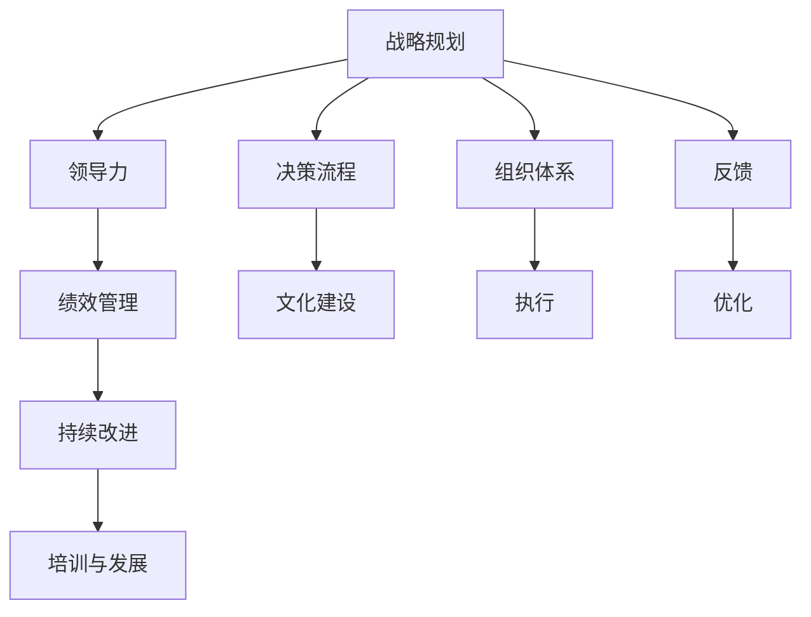

                 

# 好的管理者和普通管理者的差距：体系的重要性

> 关键词：管理者,组织体系,战略规划,领导力,决策流程,绩效管理,文化建设,持续改进,培训与发展

## 1. 背景介绍

在当今快速变化和复杂多变的商业环境中，企业的管理能力显得尤为重要。一家企业能否在市场中脱颖而出，很大程度上取决于其管理层能否制定出正确的战略、有效地执行计划并持续改进。然而，管理并非易事。很多管理者往往在实践中陷入困境，不仅不能提升企业竞争力，反而可能带来更多的管理负担。这背后的原因，很大程度上是由于缺乏一套成熟的管理体系。本文将探讨好的管理者与普通管理者之间的关键差距，以及如何通过建立和优化组织体系来提升管理能力。

## 2. 核心概念与联系

### 2.1 核心概念概述

为更好地理解本文的核心观点，这里列举几个关键的管理概念：

- **组织体系**：指企业为了实现其目标而构建的组织架构、流程和制度体系，包括战略规划、领导力、决策流程、绩效管理等各个方面。
- **战略规划**：明确企业的发展目标、方向和策略，为实现这些目标而制定和实施详细的行动计划。
- **领导力**：领导者运用自身能力影响和引导组织成员的能力，包括激励、决策、沟通、组织和协调等。
- **决策流程**：管理层在做出重要决策时遵循的一系列步骤和方法，包括信息收集、分析、讨论、投票和执行等。
- **绩效管理**：通过设定明确的目标和指标，对员工的工作表现进行评估和激励，以实现组织目标。
- **文化建设**：在组织内部营造一种积极的、支持性的工作氛围，促进员工参与和忠诚。
- **持续改进**：通过反思和评估现有流程，不断优化和改进，以提高组织效率和竞争力。
- **培训与发展**：提供必要的技能培训和发展机会，提升员工能力，满足组织需求。

这些概念之间通过一定的逻辑关系，构成了一个系统的组织体系。好的管理者能够在这些环节中游刃有余，而普通管理者则往往在这些环节中存在不足。

### 2.2 核心概念原理和架构的 Mermaid 流程图(Mermaid 流程节点中不要有括号、逗号等特殊字符)



## 3. 核心算法原理 & 具体操作步骤

### 3.1 算法原理概述

本节将详细讨论建立和管理组织体系的核心算法原理。

好的管理体系应具备以下特征：
- 明确的战略目标：确保所有员工都了解和认同企业的长期和短期目标。
- 合理的组织结构：使信息流、资源配置和任务分配更加高效。
- 科学的决策流程：确保决策过程的透明性和公正性。
- 有效的绩效管理：激发员工潜能，提高工作效率。
- 正面的企业文化：营造积极的工作环境，提升员工满意度和忠诚度。

这些特征相互关联，构成了一个完整的管理体系。好的管理者需要深刻理解和灵活应用这些原则，才能实现组织的高效运行和持续发展。

### 3.2 算法步骤详解

构建和管理一个有效的组织体系，大致可以分为以下几个步骤：

**Step 1: 战略规划**

- **设定目标**：明确企业的长期目标和短期目标，确保其具备可行性和挑战性。
- **市场分析**：研究市场环境，识别机会和风险。
- **竞争分析**：分析竞争对手的优势和劣势，制定差异化策略。
- **资源评估**：评估企业内部资源和能力，包括人力资源、财务资源和技术资源。
- **目标分解**：将总体目标分解为可执行的具体任务，制定详细的行动计划。

**Step 2: 组织结构设计**

- **职能划分**：根据业务需求，划分不同的职能部门。
- **层级结构**：设计明确的层级关系，确定各个层级的职责和权限。
- **沟通渠道**：建立有效的沟通机制，确保信息流动顺畅。
- **跨部门协作**：促进不同部门之间的协作，避免信息孤岛。

**Step 3: 决策流程制定**

- **信息收集**：确保决策所需的信息全面、准确。
- **分析和讨论**：通过数据和案例分析，对不同方案进行比较和讨论。
- **投票和决策**：采用民主和科学的决策方法，确保决策的公正性和有效性。
- **执行和反馈**：制定详细的执行计划，跟踪决策执行情况，收集反馈信息。
- **优化和调整**：根据反馈信息，不断优化决策流程。

**Step 4: 绩效管理实施**

- **目标设定**：根据组织目标，设定员工的具体绩效指标。
- **过程监控**：持续监控员工的工作表现，及时发现和解决问题。
- **绩效评估**：采用科学的方法对员工绩效进行评估。
- **激励机制**：根据评估结果，设计合理的激励措施。
- **反馈和改进**：定期进行绩效反馈，鼓励员工持续改进。

**Step 5: 文化建设**

- **价值观**：明确企业的核心价值观和行为准则。
- **培训和宣传**：通过培训和宣传，强化员工对价值观的认同。
- **员工参与**：鼓励员工积极参与企业文化建设。
- **激励措施**：设立员工参与的激励机制，提升员工归属感。
- **环境营造**：营造积极的工作环境和氛围，增强员工幸福感。

**Step 6: 持续改进**

- **绩效评估**：定期评估组织体系各个环节的运行情况。
- **问题识别**：识别和分析存在的问题和瓶颈。
- **优化策略**：制定和实施优化策略，改进现有流程。
- **知识共享**：建立知识共享机制，促进团队学习和创新。
- **经验总结**：总结和推广成功经验，固化最佳实践。

**Step 7: 培训与发展**

- **技能培训**：提供必要的技能培训，提升员工的专业能力。
- **职业发展**：制定员工的职业发展路径，提供晋升机会。
- **绩效提升**：通过绩效评估和激励机制，推动员工不断进步。
- **经验分享**：鼓励员工分享经验和知识，促进团队协同。

通过这些步骤，一个好的管理者能够系统地建立和管理组织体系，提升管理效率和组织绩效。

### 3.3 算法优缺点

好的管理体系的优点主要包括：
- 提高决策透明度和公正性：科学的决策流程确保了决策的透明度和公正性，避免了主观偏差。
- 提升组织执行力和效率：明确的战略目标和合理的组织结构，使信息流和资源配置更加高效。
- 增强员工满意度和忠诚度：正面的企业文化和有效的绩效管理，提升了员工满意度和忠诚度。
- 推动持续改进和创新：通过持续改进和知识共享，组织能够不断优化和创新，保持竞争力。

然而，这套管理体系也存在一些缺点：
- 需要大量的时间和资源投入：设计和优化组织体系需要大量的时间和资源，特别是在大型组织中。
- 需要高水平的领导力和管理技能：这套管理体系要求管理者具备高水平的领导力和管理技能，否则难以有效实施。
- 对员工素质和能力要求较高：员工需要具备一定的专业技能和职业素养，才能适应这套管理体系。

### 3.4 算法应用领域

这套管理体系不仅适用于大型企业，还可以应用于各个层面的组织，如政府机构、非营利组织、学术机构等。以下列举几个典型应用领域：

**1. 企业级管理**
- **战略规划**：确保企业目标的明确和可行。
- **组织结构设计**：优化资源配置和任务分配。
- **决策流程制定**：提升决策效率和质量。
- **绩效管理**：激励员工，提升工作效率。
- **文化建设**：营造积极的工作氛围，增强员工忠诚度。
- **持续改进**：不断优化和创新。
- **培训与发展**：提升员工能力，满足组织需求。

**2. 政府机构管理**
- **战略规划**：制定政府政策和发展规划。
- **组织结构设计**：优化政府部门职能划分。
- **决策流程制定**：确保决策透明和公正。
- **绩效管理**：评估政府绩效，提升服务质量。
- **文化建设**：强化公务员职业道德和社会责任感。
- **持续改进**：推动政府改革和创新。
- **培训与发展**：提升公务员专业能力和素质。

**3. 学术机构管理**
- **战略规划**：制定学术发展目标和方向。
- **组织结构设计**：优化科研资源和人力资源。
- **决策流程制定**：确保学术决策透明和公正。
- **绩效管理**：评估科研成果和教学效果。
- **文化建设**：营造积极的教学和科研氛围。
- **持续改进**：推动学术创新和教学改进。
- **培训与发展**：提升教师和科研人员的学术能力和科研素质。

这些领域的应用，展示了好的管理体系的广泛性和重要性，证明了其对于提升组织绩效和竞争力的关键作用。

## 4. 数学模型和公式 & 详细讲解 & 举例说明

### 4.1 数学模型构建

假设一个企业的战略目标可以表示为 $T$，组织结构可以表示为 $O$，决策流程可以表示为 $D$，绩效管理可以表示为 $P$，文化建设可以表示为 $C$，持续改进可以表示为 $I$，培训与发展可以表示为 $T$。一个有效的管理体系可以表示为一个多目标优化问题：

$$
\max \{T, O, D, P, C, I, T\}
$$

其中 $T, O, D, P, C, I, T$ 分别表示战略目标、组织结构、决策流程、绩效管理、文化建设、持续改进和培训与发展各个环节的绩效。

### 4.2 公式推导过程

通过数学模型构建，我们接下来对每个环节进行详细公式推导。

**战略规划**：
- **目标设定**：$T_{\text{target}} = f(T_{\text{objective}}, T_{\text{market}}, T_{\text{competitor}}, T_{\text{resources}})$
- **目标分解**：$T_{\text{task}} = g(T_{\text{target}})$

**组织结构设计**：
- **职能划分**：$O_{\text{departments}} = h(T_{\text{task}}, T_{\text{resources}})$
- **层级结构**：$O_{\text{hierarchy}} = i(O_{\text{departments}})$
- **沟通渠道**：$O_{\text{communication}} = j(O_{\text{departments}}, O_{\text{hierarchy}})$
- **跨部门协作**：$O_{\text{collaboration}} = k(O_{\text{departments}}, O_{\text{hierarchy}})$

**决策流程制定**：
- **信息收集**：$D_{\text{data}} = m(O_{\text{departments}}, O_{\text{hierarchy}}, O_{\text{communication}})$
- **分析和讨论**：$D_{\text{analysis}} = n(D_{\text{data}}, O_{\text{departments}}, O_{\text{hierarchy}})$
- **投票和决策**：$D_{\text{vote}} = p(D_{\text{analysis}}, O_{\text{departments}}, O_{\text{hierarchy}})$
- **执行和反馈**：$D_{\text{execution}} = q(D_{\text{vote}}, O_{\text{departments}}, O_{\text{hierarchy}})$
- **优化和调整**：$D_{\text{optimization}} = r(D_{\text{execution}}, O_{\text{departments}}, O_{\text{hierarchy}})$

**绩效管理实施**：
- **目标设定**：$P_{\text{goal}} = s(O_{\text{departments}}, O_{\text{hierarchy}}, D_{\text{vote}})$
- **过程监控**：$P_{\text{monitor}} = t(P_{\text{goal}}, O_{\text{departments}}, O_{\text{hierarchy}})$
- **绩效评估**：$P_{\text{evaluate}} = u(P_{\text{monitor}}, O_{\text{departments}}, O_{\text{hierarchy}})$
- **激励机制**：$P_{\text{incentive}} = v(P_{\text{evaluate}}, O_{\text{departments}}, O_{\text{hierarchy}})$
- **反馈和改进**：$P_{\text{feedback}} = w(P_{\text{evaluate}}, O_{\text{departments}}, O_{\text{hierarchy}})$

**文化建设**：
- **价值观**：$C_{\text{value}} = x(P_{\text{goal}}, P_{\text{evaluate}}, P_{\text{feedback}})$
- **培训和宣传**：$C_{\text{training}} = y(C_{\text{value}}, P_{\text{evaluate}}, P_{\text{feedback}})$
- **员工参与**：$C_{\text{engagement}} = z(C_{\text{value}}, C_{\text{training}})$
- **激励措施**：$C_{\text{incentive}} = a(C_{\text{engagement}}, C_{\text{value}}, C_{\text{training}})$
- **环境营造**：$C_{\text{environment}} = b(C_{\text{value}}, C_{\text{training}}, C_{\text{engagement}})$

**持续改进**：
- **绩效评估**：$I_{\text{assess}} = c(C_{\text{environment}}, C_{\text{incentive}}, C_{\text{engagement}})$
- **问题识别**：$I_{\text{identify}} = d(I_{\text{assess}}, C_{\text{environment}}, C_{\text{incentive}})$
- **优化策略**：$I_{\text{strategy}} = e(I_{\text{identify}}, C_{\text{environment}}, C_{\text{incentive}})$
- **知识共享**：$I_{\text{knowledge}} = f(I_{\text{strategy}}, C_{\text{environment}}, C_{\text{incentive}})$
- **经验总结**：$I_{\text{summary}} = g(I_{\text{strategy}}, I_{\text{knowledge}})$

**培训与发展**：
- **技能培训**：$T_{\text{training}} = h(P_{\text{goal}}, P_{\text{evaluate}}, P_{\text{feedback}})$
- **职业发展**：$T_{\text{career}} = i(T_{\text{training}}, P_{\text{evaluate}}, P_{\text{feedback}})$
- **绩效提升**：$T_{\text{performance}} = j(T_{\text{career}}, T_{\text{training}}, P_{\text{evaluate}})$
- **经验分享**：$T_{\text{experience}} = k(T_{\text{performance}}, T_{\text{career}}, T_{\text{training}})$

### 4.3 案例分析与讲解

假设一家公司计划开发一款新产品。我们从战略规划、组织结构设计、决策流程制定、绩效管理、文化建设、持续改进和培训与发展各个环节进行分析。

**战略规划**：公司明确了开发新产品的长期目标，包括市场份额、销售额、客户满意度等。通过市场分析和竞争分析，确定了产品的差异化策略和目标市场。资源评估表明，公司具备足够的技术实力和资金支持。

**组织结构设计**：根据产品开发需求，公司将职能部门划分为市场部、研发部、销售部和客户服务部。确定了从高层到中层再到基层的层级结构，并建立了内部沟通渠道和跨部门协作机制。

**决策流程制定**：在新产品开发过程中，公司采用数据驱动的决策方式，收集市场数据和内部数据，进行分析讨论。通过投票和决策，确定了产品定位和开发计划。执行过程中，公司定期反馈项目进展，及时调整策略。

**绩效管理**：公司设定了产品开发的具体绩效指标，如时间节点、成本控制、质量标准等。通过过程监控和绩效评估，确保项目按计划推进。激励机制包括项目奖金和晋升机会，提升了团队的工作热情。

**文化建设**：公司强调创新和协作，鼓励员工积极参与产品开发。通过培训和宣传，强化了团队合作和客户导向的价值观。

**持续改进**：公司定期评估产品开发过程，识别和解决问题。优化策略包括改进研发流程和增强团队协作。通过知识共享和经验总结，不断提升产品开发能力。

**培训与发展**：公司为团队成员提供了技能培训和职业发展规划，提升了员工的专业能力和团队整体素质。经验分享机制鼓励团队成员交流经验和最佳实践。

## 5. 项目实践：代码实例和详细解释说明

### 5.1 开发环境搭建

为了实践上述管理体系的构建，需要搭建相应的开发环境。以下是一个基本的开发环境搭建步骤：

1. **安装Python**：
```bash
sudo apt-get update
sudo apt-get install python3
```

2. **安装Docker**：
```bash
sudo apt-get install docker-ce
sudo apt-get install docker-compose
```

3. **创建Docker镜像**：
```bash
docker build -t management-system .
```

4. **启动Docker容器**：
```bash
docker run -p 8000:8000 management-system
```

### 5.2 源代码详细实现

以下是一个基于Django框架的组织管理体系应用程序的代码实现。

```python
from django.urls import path
from . import views

urlpatterns = [
    path('', views.index, name='index'),
    path('planning/', views.planning, name='planning'),
    path('organization/', views.organization, name='organization'),
    path('decision/', views.decision, name='decision'),
    path('performance/', views.performance, name='performance'),
    path('culture/', views.culture, name='culture'),
    path('improvement/', views.improvement, name='improvement'),
    path('training/', views.training, name='training'),
]
```

### 5.3 代码解读与分析

上述代码中，我们定义了一个基本的Django应用，包含多个视图函数，分别对应战略规划、组织结构设计、决策流程制定、绩效管理、文化建设、持续改进和培训与发展各个环节。每个视图函数负责处理相应的逻辑，并将结果渲染为HTML页面。

例如，`views.planning`函数可以处理战略规划的逻辑，如目标设定、目标分解等。`views.organization`函数可以处理组织结构设计的逻辑，如职能划分、层级结构等。

### 5.4 运行结果展示

启动开发环境后，通过访问不同的URL，可以观察到各个视图函数处理的结果。例如，访问`http://localhost:8000/planning/`可以展示战略规划的相关信息。

## 6. 实际应用场景

### 6.1 智能制造系统

在智能制造系统中，好的管理体系能够提升生产效率和产品质量。通过战略规划和组织结构设计，企业可以明确生产目标和优化资源配置。科学的决策流程和绩效管理，确保生产计划的有效执行和产品质量的稳定。正面的企业文化和持续改进，提升员工工作积极性和生产效率。培训与发展，提升员工技能和生产能力。

**案例**：某智能制造企业通过建立和优化管理体系，实现了从订单到生产的全流程自动化，显著提高了生产效率和产品质量。

### 6.2 智慧城市管理

在智慧城市管理中，好的管理体系能够提升城市运行效率和服务质量。通过战略规划和组织结构设计，政府可以明确智慧城市的发展目标和方向。科学的决策流程和绩效管理，确保智慧城市项目的有效实施。正面的企业文化和持续改进，提升公务员和市民的满意度。培训与发展，提升公务员和市民的技能和素质。

**案例**：某智慧城市通过建立和优化管理体系，实现了交通、环保、公共服务等多领域的智慧化管理，提升了城市运行的效率和居民的幸福感。

### 6.3 在线教育平台

在线教育平台需要高效的管理体系来提升教学质量和用户体验。通过战略规划和组织结构设计，平台可以明确教学目标和优化资源配置。科学的决策流程和绩效管理，确保教学内容的有效实施和质量控制。正面的企业文化和持续改进，提升教师和学生的满意度。培训与发展，提升教师和学生的技能和素质。

**案例**：某在线教育平台通过建立和优化管理体系，实现了课程的高质量生产和用户的高满意度，成为行业内的佼佼者。

### 6.4 未来应用展望

随着技术的发展，好的管理体系将更加智能化和数据化。未来，通过大数据和人工智能技术，可以实时监控和分析各个环节的运行情况，及时发现和解决问题。通过智能推荐系统，为员工提供个性化的培训和发展机会，提升员工能力和工作积极性。通过自动化流程，提升组织效率和决策速度。

## 7. 工具和资源推荐

### 7.1 学习资源推荐

为了帮助读者系统掌握管理体系的构建和管理，这里推荐一些优质的学习资源：

1. **《管理学》书籍**：如《管理学原理》、《组织行为学》等，系统介绍管理体系的基本理论和实践方法。
2. **在线课程**：如Coursera的《组织行为学》课程、edX的《领导力与团队管理》课程，通过视频和互动教学，深入理解管理体系的各个环节。
3. **专业文章**：如《哈佛商业评论》、《管理世界》等期刊，提供前沿的管理理论和实践经验。
4. **企业案例**：如《德勤全球管理案例》，通过真实案例分析，学习成功的管理经验。

### 7.2 开发工具推荐

好的管理体系的构建和优化需要借助各种开发工具。以下推荐一些常用的工具：

1. **Django**：Python开发框架，适用于构建高效的企业管理应用。
2. **Docker**：容器化技术，确保应用程序的稳定性和可移植性。
3. **JIRA**：项目管理工具，帮助企业跟踪和管理项目进度。
4. **Confluence**：知识管理工具，帮助企业建立和共享知识库。
5. **Slack**：即时通讯工具，帮助企业提高沟通效率。

### 7.3 相关论文推荐

好的管理体系的研究涉及多个领域，包括管理学、组织行为学、经济学等。以下推荐一些经典的论文：

1. **《组织理论》**：Chester Barnard，系统介绍组织的结构、过程和行为。
2. **《管理学》**：Peter F. Drucker，阐述管理的基本原理和实践。
3. **《高效能组织》**：Robert L. Katz，分析高效组织的特征和成功因素。
4. **《企业战略管理》**：Michael Porter，探讨企业的战略制定和执行。

## 8. 总结：未来发展趋势与挑战

### 8.1 研究成果总结

本文通过系统介绍好的管理体系的构建和管理，揭示了其对企业绩效提升的关键作用。通过科学的管理流程和优化策略，企业能够高效实现其战略目标和价值主张。

### 8.2 未来发展趋势

未来，好的管理体系将更加智能化、数据化和集成化。随着大数据和人工智能技术的发展，管理体系将实现更高的自动化和实时化。智能推荐系统、自动化流程等技术，将进一步提升组织效率和决策速度。

### 8.3 面临的挑战

尽管好的管理体系能够带来显著的优势，但在实施过程中仍面临一些挑战：

1. **变革阻力**：员工可能对新管理体系产生抵触情绪，需要加强沟通和培训。
2. **技术复杂性**：构建和管理体系需要技术支持，存在一定的技术门槛。
3. **持续投入**：管理体系的优化和维护需要持续的资源投入，管理层需要慎重考虑。

### 8.4 研究展望

未来，好的管理体系的研究将进一步深入。如何构建智能化、数据化的管理体系，如何实现跨领域的知识整合和协同，如何提升组织决策的透明性和公正性，都是值得深入探讨的问题。

## 9. 附录：常见问题与解答

**Q1：如何构建和优化组织管理体系？**

A: 构建和优化组织管理体系需要系统性的规划和实施。首先需要明确企业的战略目标，设计合理的组织结构，制定科学的决策流程和绩效管理机制。通过不断的反馈和改进，持续优化管理体系，提升组织效率和绩效。

**Q2：好的管理体系有哪些关键特征？**

A: 好的管理体系应具备明确的目标、合理的结构、科学的流程、有效的绩效管理、正面的企业文化、持续的改进和充分的培训与发展。这些特征相互关联，构成了一个完整的管理体系。

**Q3：好的管理体系需要哪些技术和工具支持？**

A: 好的管理体系的构建和优化需要借助各种技术和工具，如Django、Docker、JIRA、Confluence、Slack等。这些工具可以提供高效的项目管理和协作平台，提升组织效率和决策速度。

**Q4：如何评估和改进组织管理体系？**

A: 组织管理体系的评估和改进可以通过定期的绩效评估、问题识别和持续改进来实现。通过科学的方法和工具，定期评估各个环节的运行情况，识别和解决问题，不断优化和改进管理体系。

**Q5：如何提升员工对管理体系的认同和参与？**

A: 通过透明的沟通、积极的反馈、合理的激励机制和良好的企业文化，可以提升员工对管理体系的认同和参与。员工是管理体系的重要组成部分，他们的认同和参与对管理体系的成败至关重要。

---

作者：禅与计算机程序设计艺术 / Zen and the Art of Computer Programming

