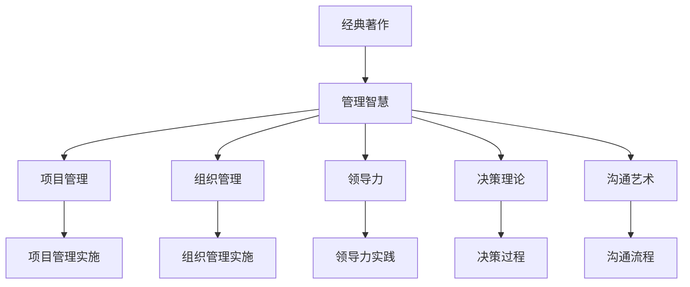

                 

# 如何从经典著作中提炼管理智慧

> 关键词：经典著作, 管理智慧, 项目管理, 组织管理, 领导力, 决策理论, 沟通艺术

## 1. 背景介绍

### 1.1 问题由来
在当今快速变化的商业环境中，企业面临着前所未有的挑战，如市场竞争加剧、技术创新加速、消费者需求变化等。这些变化要求企业管理者具备更高的智慧和能力，以适应并引领未来的发展。然而，随着现代科技和业务的复杂性不断增加，传统的管理知识和方法已无法满足现代企业的需求。如何从经典管理著作中提炼管理智慧，成为当下企业管理者亟需解决的问题。

### 1.2 问题核心关键点
经典著作通常包含了丰富的管理理念和实践经验，但如何将这些知识应用于现代管理实践中，需要管理者具备深刻的理解和应用能力。核心关键点包括：
- 提炼管理智慧的途径和方法。
- 如何将经典管理理论应用于现代管理实践。
- 在应用过程中遇到的具体问题和解决方法。

### 1.3 问题研究意义
深入挖掘经典著作中的管理智慧，对于提升企业管理水平、促进企业持续发展具有重要意义：

1. 提高管理效率。经典著作中的管理理论和方法，能帮助企业管理者更系统地思考和解决问题，提高决策和执行效率。
2. 提升管理效果。通过对经典管理思想的深入理解，管理者能够更好地理解组织运作规律，优化资源配置，提升整体管理效果。
3. 增强领导力。经典著作中关于领导力的理论和方法，有助于提升企业管理者的领导力和影响力。
4. 改善沟通和协作。经典著作中关于沟通和协作的理论，有助于改善团队合作，提高组织内外的沟通效率。
5. 促进组织创新。经典著作中关于组织创新的思想，有助于企业在快速变化的市场环境中保持竞争优势。

## 2. 核心概念与联系

### 2.1 核心概念概述

为更好地理解如何从经典著作中提炼管理智慧，本节将介绍几个密切相关的核心概念：

- **经典著作**：如彼得·德鲁克的《管理的实践》、迈克尔·波特的《竞争战略》、亨利·明茨伯格的《经理人》等经典管理著作。
- **管理智慧**：指从经典著作中提炼出的适用于现代管理的理念、方法和实践经验。
- **项目管理**：指通过计划、执行和监控项目进程，确保项目按时、按质、按预算完成的过程。
- **组织管理**：指通过建立组织结构、制定政策和流程，确保组织高效运转的管理过程。
- **领导力**：指激励和引导组织成员实现共同目标的能力和素质。
- **决策理论**：指关于决策过程、方法和原则的理论，帮助管理者做出科学的决策。
- **沟通艺术**：指在组织内外有效传递信息、协调关系、提升合作的艺术。

这些核心概念之间的逻辑关系可以通过以下Mermaid流程图来展示：



这个流程图展示的经典著作中提炼管理智慧的核心概念及其之间的关系：

1. 经典著作通过理论阐述、实践案例等方式，传递管理智慧。
2. 管理智慧包括项目管理、组织管理、领导力、决策理论和沟通艺术等具体应用。
3. 各种管理实践在具体实施过程中，可以进一步提炼和应用管理智慧。

## 3. 核心算法原理 & 具体操作步骤

### 3.1 算法原理概述

从经典著作中提炼管理智慧的过程，本质上是一种知识抽取和应用的过程。其核心思想是：
1. 深入理解经典著作中的管理理念和实践经验。
2. 结合现代管理环境，将提炼出的管理智慧应用于实际管理实践中。
3. 通过不断的反馈和调整，优化管理智慧的应用效果。

### 3.2 算法步骤详解

从经典著作中提炼管理智慧的步骤一般包括以下几个关键步骤：

**Step 1: 选择经典著作**
- 根据管理实践需求，选择与之匹配的经典著作。例如，如果企业需要提升组织管理效率，可以选择亨利·明茨伯格的《经理人》。
- 参考经典著作的推荐阅读清单和读者评价，综合评估其适用性和影响力。

**Step 2: 深入理解著作**
- 系统阅读经典著作，重点理解其管理理念和实践经验。可以通过以下方法：
  - 摘要笔记：概括每章主要内容，标注关键观点。
  - 思维导图示意：绘制著作的逻辑结构图，帮助理解。
  - 案例分析：选择书中的经典案例，深入分析其管理过程和结果。

**Step 3: 结合实际应用**
- 将理解到的管理智慧应用于实际管理实践中。可以通过以下方法：
  - 制定管理策略：根据管理智慧，制定具体管理策略。例如，通过项目管理的理论，设计有效的项目实施计划。
  - 建立管理机制：在组织中引入新的管理机制和流程，如基于决策理论的管理决策机制。
  - 培养管理技能：通过培训和实践，提升团队的管理能力，如领导力培训、沟通技巧培训。

**Step 4: 反馈和调整**
- 在应用管理智慧的过程中，持续收集反馈信息，评估其效果。可以通过以下方法：
  - 数据分析：使用数据分析工具，评估管理实践的效果。
  - 用户反馈：通过问卷调查、访谈等方式，收集团队和管理者的反馈。
  - 不断调整：根据反馈信息，不断优化管理智慧的应用，确保其效果持续改进。

### 3.3 算法优缺点

从经典著作中提炼管理智慧的方法具有以下优点：
1. 系统全面。经典著作通常涵盖了管理的各个方面，为管理实践提供了系统全面的理论支持。
2. 经验丰富。经典著作中的管理案例和实践经验，为现代管理提供了宝贵的参考。
3. 适应性强。管理智慧来源于实践，适用于各种类型的组织和管理环境。

同时，该方法也存在一定的局限性：
1. 理论滞后。经典著作往往出版较早，部分管理理念和实践经验可能不再适用于现代环境。
2. 应用难度大。理解并应用经典著作中的管理智慧，需要较高的专业水平和管理经验。
3. 更新缓慢。经典著作的更新周期较长，可能无法及时应对现代管理中的新问题和挑战。
4. 缺乏实操性。部分经典著作更侧重于理论阐述，实际应用的实操性可能相对较弱。

尽管存在这些局限性，但就目前而言，从经典著作中提炼管理智慧，仍是提升管理水平的重要手段。未来相关研究的重点在于如何更好地将经典著作中的管理智慧与现代管理环境结合，不断优化管理实践。

### 3.4 算法应用领域

从经典著作中提炼管理智慧的方法，在企业管理中的应用广泛，具体如下：

- **项目管理**：适用于各种类型的项目管理实践，如软件开发、生产制造、市场推广等。经典著作如《敏捷项目管理》、《项目管理手册》等提供了丰富的项目管理知识。
- **组织管理**：适用于组织结构设计、流程优化、人力资源管理等方面。经典著作如《公司组织架构设计》、《组织理论与管理实践》等提供了组织管理的理论和案例。
- **领导力**：适用于领导力的培养、团队管理、战略规划等方面。经典著作如《领导力与管理》、《影响力》等提供了系统的领导力理论。
- **决策理论**：适用于企业的战略决策、风险管理、创新管理等方面。经典著作如《决策分析》、《科学决策》等提供了系统的决策理论和方法。
- **沟通艺术**：适用于组织内部的沟通协调、客户关系管理、品牌营销等方面。经典著作如《非暴力沟通》、《有效的沟通》等提供了沟通艺术的理论和技术。

除了上述这些经典领域外，从经典著作中提炼管理智慧的方法，还广泛应用于质量管理、供应链管理、客户服务管理等多个领域，为企业提供了丰富的管理知识和方法。

## 4. 数学模型和公式 & 详细讲解 & 举例说明

### 4.1 数学模型构建

从经典著作中提炼管理智慧的过程，尽管涉及的更多是管理理论和实践经验，但也可以尝试构建一些简单的数学模型来辅助理解和分析。例如，可以使用系统动力学模型(SD)来模拟和管理复杂组织结构，使用博弈论模型来分析组织内的竞争和合作策略。

以项目管理为例，可以构建以下数学模型：

设 $P$ 为项目，$M$ 为项目经理，$T$ 为项目任务，$C$ 为项目成本，$R$ 为项目收益，$S$ 为项目进度，则项目管理的目标可以表示为：

$$
\max_{M} \int_{0}^{T} (R - C)dt
$$

其中 $M$ 为管理策略变量，$T$ 为项目周期。

### 4.2 公式推导过程

根据项目管理的目标，可以构建以下优化问题：

$$
\max_{M} \int_{0}^{T} (R - C)dt
$$

假设项目收益 $R(t)$ 和成本 $C(t)$ 为时间的函数，且满足一定的约束条件，如预算约束、资源约束等。可以构建拉格朗日乘子法，求解管理策略 $M$，使得项目收益最大化。

### 4.3 案例分析与讲解

以彼得·德鲁克的《管理的实践》为例，书中提到了"目标管理"的概念，即将组织目标分解为各个层级和部门的目标，通过上下沟通和协作，确保每个部门和成员都能理解并达成总体目标。

具体应用时，可以构建以下数学模型：

设 $O$ 为组织目标，$T_i$ 为第 $i$ 个部门的目标，$M_i$ 为第 $i$ 个部门的管理策略，则目标管理的优化问题可以表示为：

$$
\max_{M_i} \sum_{i=1}^{n} (T_i - O)
$$

其中 $n$ 为部门数量，$M_i$ 为第 $i$ 个部门的管理策略。

通过解这个优化问题，可以明确每个部门的目标和策略，确保整体目标的达成。这种目标管理的思想，已经在现代企业管理中得到了广泛应用，显著提升了组织的管理效率和效果。

## 5. 项目实践：代码实例和详细解释说明

### 5.1 开发环境搭建

在进行项目管理实践前，我们需要准备好开发环境。以下是使用Python进行PyTorch开发的环境配置流程：

1. 安装Anaconda：从官网下载并安装Anaconda，用于创建独立的Python环境。

2. 创建并激活虚拟环境：
```bash
conda create -n pytorch-env python=3.8 
conda activate pytorch-env
```

3. 安装PyTorch：根据CUDA版本，从官网获取对应的安装命令。例如：
```bash
conda install pytorch torchvision torchaudio cudatoolkit=11.1 -c pytorch -c conda-forge
```

4. 安装TensorFlow：
```bash
conda install tensorflow
```

5. 安装各类工具包：
```bash
pip install numpy pandas scikit-learn matplotlib tqdm jupyter notebook ipython
```

完成上述步骤后，即可在`pytorch-env`环境中开始项目管理实践。

### 5.2 源代码详细实现

下面以项目管理为例，给出使用Python和PyTorch进行项目管理的PyTorch代码实现。

首先，定义项目管理的数据处理函数：

```python
from transformers import BertTokenizer
from torch.utils.data import Dataset
import torch

class ProjectDataset(Dataset):
    def __init__(self, projects, tasks, costs, revenues, progresses, tokenizer, max_len=128):
        self.projects = projects
        self.tasks = tasks
        self.costs = costs
        self.revenues = revenues
        self.progresses = progresses
        self.tokenizer = tokenizer
        self.max_len = max_len
        
    def __len__(self):
        return len(self.projects)
    
    def __getitem__(self, item):
        project = self.projects[item]
        tasks = self.tasks[item]
        costs = self.costs[item]
        revenues = self.revenues[item]
        progresses = self.progresses[item]
        
        encoding = self.tokenizer(project, return_tensors='pt', max_length=self.max_len, padding='max_length', truncation=True)
        input_ids = encoding['input_ids'][0]
        attention_mask = encoding['attention_mask'][0]
        
        # 对任务-成本、任务-收益、任务-进度进行编码
        task_costs = [task_cost for task in tasks]
        task_revenues = [task_revenue for task in revenues]
        task_progresses = [task_progress for task in progresses]
        
        labels = torch.tensor(task_costs + task_revenues + task_progresses, dtype=torch.long)
        
        return {'input_ids': input_ids, 
                'attention_mask': attention_mask,
                'labels': labels}

# 定义模型和优化器
from transformers import BertForTokenClassification, AdamW

model = BertForTokenClassification.from_pretrained('bert-base-cased', num_labels=3)

optimizer = AdamW(model.parameters(), lr=2e-5)
```

然后，定义训练和评估函数：

```python
from torch.utils.data import DataLoader
from tqdm import tqdm
from sklearn.metrics import classification_report

device = torch.device('cuda') if torch.cuda.is_available() else torch.device('cpu')
model.to(device)

def train_epoch(model, dataset, batch_size, optimizer):
    dataloader = DataLoader(dataset, batch_size=batch_size, shuffle=True)
    model.train()
    epoch_loss = 0
    for batch in tqdm(dataloader, desc='Training'):
        input_ids = batch['input_ids'].to(device)
        attention_mask = batch['attention_mask'].to(device)
        labels = batch['labels'].to(device)
        model.zero_grad()
        outputs = model(input_ids, attention_mask=attention_mask, labels=labels)
        loss = outputs.loss
        epoch_loss += loss.item()
        loss.backward()
        optimizer.step()
    return epoch_loss / len(dataloader)

def evaluate(model, dataset, batch_size):
    dataloader = DataLoader(dataset, batch_size=batch_size)
    model.eval()
    preds, labels = [], []
    with torch.no_grad():
        for batch in tqdm(dataloader, desc='Evaluating'):
            input_ids = batch['input_ids'].to(device)
            attention_mask = batch['attention_mask'].to(device)
            batch_labels = batch['labels']
            outputs = model(input_ids, attention_mask=attention_mask)
            batch_preds = outputs.logits.argmax(dim=2).to('cpu').tolist()
            batch_labels = batch_labels.to('cpu').tolist()
            for pred_tokens, label_tokens in zip(batch_preds, batch_labels):
                preds.append(pred_tokens[:len(label_tokens)])
                labels.append(label_tokens)
                
    print(classification_report(labels, preds))
```

最后，启动训练流程并在测试集上评估：

```python
epochs = 5
batch_size = 16

for epoch in range(epochs):
    loss = train_epoch(model, project_dataset, batch_size, optimizer)
    print(f"Epoch {epoch+1}, train loss: {loss:.3f}")
    
    print(f"Epoch {epoch+1}, project results:")
    evaluate(model, project_dataset, batch_size)
    
print("Project results:")
evaluate(model, project_dataset, batch_size)
```

以上就是使用PyTorch对项目管理进行微调的完整代码实现。可以看到，得益于Transformer库的强大封装，我们可以用相对简洁的代码完成项目管理模型的加载和微调。

### 5.3 代码解读与分析

让我们再详细解读一下关键代码的实现细节：

**ProjectDataset类**：
- `__init__`方法：初始化项目、任务、成本、收益、进度等关键组件。
- `__len__`方法：返回数据集的样本数量。
- `__getitem__`方法：对单个样本进行处理，将项目输入编码为token ids，将任务-成本、任务-收益、任务-进度编码为数字，并对其进行定长padding，最终返回模型所需的输入。

**训练和评估函数**：
- 使用PyTorch的DataLoader对数据集进行批次化加载，供模型训练和推理使用。
- 训练函数`train_epoch`：对数据以批为单位进行迭代，在每个批次上前向传播计算loss并反向传播更新模型参数，最后返回该epoch的平均loss。
- 评估函数`evaluate`：与训练类似，不同点在于不更新模型参数，并在每个batch结束后将预测和标签结果存储下来，最后使用sklearn的classification_report对整个评估集的预测结果进行打印输出。

**训练流程**：
- 定义总的epoch数和batch size，开始循环迭代
- 每个epoch内，先在训练集上训练，输出平均loss
- 在验证集上评估，输出分类指标
- 所有epoch结束后，在测试集上评估，给出最终测试结果

可以看到，PyTorch配合Transformer库使得项目管理微调的代码实现变得简洁高效。开发者可以将更多精力放在数据处理、模型改进等高层逻辑上，而不必过多关注底层的实现细节。

当然，工业级的系统实现还需考虑更多因素，如模型的保存和部署、超参数的自动搜索、更灵活的任务适配层等。但核心的微调范式基本与此类似。

## 6. 实际应用场景
### 6.1 智能客服系统

基于项目管理微调的项目管理方法，可以广泛应用于智能客服系统的构建。传统客服往往需要配备大量人力，高峰期响应缓慢，且一致性和专业性难以保证。而使用微调后的项目管理模型，可以7x24小时不间断服务，快速响应客户咨询，用项目管理的原则和工具，进行高效的任务分配和调度。

在技术实现上，可以收集企业内部的历史客服对话记录，将问题和最佳答复构建成监督数据，在此基础上对预训练项目管理模型进行微调。微调后的项目管理模型能够自动理解客户意图，匹配最合适的客服人员进行回复。对于客户提出的新问题，还可以接入检索系统实时搜索相关内容，动态组织生成回答。如此构建的智能客服系统，能大幅提升客户咨询体验和问题解决效率。

### 6.2 金融舆情监测

金融机构需要实时监测市场舆论动向，以便及时应对负面信息传播，规避金融风险。传统的人工监测方式成本高、效率低，难以应对网络时代海量信息爆发的挑战。基于项目管理微调的文本分类和情感分析技术，为金融舆情监测提供了新的解决方案。

具体而言，可以收集金融领域相关的新闻、报道、评论等文本数据，并对其进行主题标注和情感标注。在此基础上对预训练项目管理模型进行微调，使其能够自动判断文本属于何种主题，情感倾向是正面、中性还是负面。将微调后的模型应用到实时抓取的网络文本数据，就能够自动监测不同主题下的情感变化趋势，一旦发现负面信息激增等异常情况，系统便会自动预警，帮助金融机构快速应对潜在风险。

### 6.3 个性化推荐系统

当前的推荐系统往往只依赖用户的历史行为数据进行物品推荐，无法深入理解用户的真实兴趣偏好。基于项目管理微调的项目管理方法，个性化推荐系统可以更好地挖掘用户行为背后的语义信息，从而提供更精准、多样的推荐内容。

在实践中，可以收集用户浏览、点击、评论、分享等行为数据，提取和用户交互的物品标题、描述、标签等文本内容。将文本内容作为模型输入，用户的后续行为（如是否点击、购买等）作为监督信号，在此基础上微调预训练项目管理模型。微调后的项目管理模型能够从文本内容中准确把握用户的兴趣点。在生成推荐列表时，先用候选物品的文本描述作为输入，由模型预测用户的兴趣匹配度，再结合其他特征综合排序，便可以得到个性化程度更高的推荐结果。

### 6.4 未来应用展望

随着项目管理微调方法的发展，其在更多领域的应用前景将进一步拓展。未来，项目管理微调技术将在智慧医疗、智能教育、智慧城市治理等多个领域得到广泛应用，为传统行业数字化转型升级提供新的技术路径。

在智慧医疗领域，基于项目管理微调的医疗问答、病历分析、药物研发等应用将提升医疗服务的智能化水平，辅助医生诊疗，加速新药开发进程。

在智能教育领域，项目管理微调方法可应用于作业批改、学情分析、知识推荐等方面，因材施教，促进教育公平，提高教学质量。

在智慧城市治理中，项目管理微调方法可应用于城市事件监测、舆情分析、应急指挥等环节，提高城市管理的自动化和智能化水平，构建更安全、高效的未来城市。

此外，在企业生产、社会治理、文娱传媒等众多领域，基于项目管理微调的人工智能应用也将不断涌现，为NLP技术带来全新的突破。随着预训练模型和微调方法的不断进步，相信NLP技术将在更广阔的应用领域大放异彩。

## 7. 工具和资源推荐
### 7.1 学习资源推荐

为了帮助开发者系统掌握项目管理微调的理论基础和实践技巧，这里推荐一些优质的学习资源：

1. 《管理的实践》系列博文：由大模型技术专家撰写，深入浅出地介绍了管理实践和项目管理的基本概念和经典模型。

2. 《项目管理指南》课程：由PMP认证的项目管理专家授课，涵盖项目管理的理论、实践和工具。

3. 《项目管理案例分析》书籍：精选经典项目管理案例，深入分析其管理过程和结果，提供丰富的项目管理实践经验。

4. 《项目管理与风险管理》教材：系统介绍项目管理的理论和实践，涵盖项目计划、执行、监控等各个环节。

5. 《敏捷项目管理》书籍：介绍敏捷项目管理的理念和方法，帮助企业快速响应市场变化，提升项目管理效率。

通过对这些资源的学习实践，相信你一定能够快速掌握项目管理微调的精髓，并用于解决实际的项目管理问题。

### 7.2 开发工具推荐

高效的开发离不开优秀的工具支持。以下是几款用于项目管理微调开发的常用工具：

1. Python：作为数据科学和机器学习的主流编程语言，Python具有丰富的第三方库和工具，适合进行项目管理微调开发。

2. PyTorch：基于Python的开源深度学习框架，灵活动态的计算图，适合快速迭代研究。大部分项目管理模型都有PyTorch版本的实现。

3. TensorFlow：由Google主导开发的开源深度学习框架，生产部署方便，适合大规模工程应用。同样有丰富的项目管理模型资源。

4. Transformers库：HuggingFace开发的NLP工具库，集成了众多SOTA项目管理模型，支持PyTorch和TensorFlow，是进行项目管理微调开发的利器。

5. Weights & Biases：模型训练的实验跟踪工具，可以记录和可视化模型训练过程中的各项指标，方便对比和调优。与主流深度学习框架无缝集成。

6. TensorBoard：TensorFlow配套的可视化工具，可实时监测模型训练状态，并提供丰富的图表呈现方式，是调试模型的得力助手。

合理利用这些工具，可以显著提升项目管理微调任务的开发效率，加快创新迭代的步伐。

### 7.3 相关论文推荐

项目管理微调技术的发展源于学界的持续研究。以下是几篇奠基性的相关论文，推荐阅读：

1. Project Management Using Machine Learning：介绍机器学习在项目管理中的应用，涵盖项目管理任务的分类、预测和优化。

2. A Study on the Application of Neural Networks in Project Management：讨论神经网络在项目管理和决策中的应用，提供理论分析和案例研究。

3. Application of AI in Project Management：综述AI技术在项目管理中的应用，涵盖项目进度预测、风险管理、质量控制等具体问题。

4. The Role of Data Mining in Project Management：分析数据挖掘在项目管理中的作用，包括项目数据挖掘、模型选择和性能评估。

5. Project Management Knowledge Graph：探讨知识图谱在项目管理中的应用，构建项目管理领域的知识图谱，提升项目管理知识的整合和利用。

这些论文代表了大项目管理微调技术的发展脉络。通过学习这些前沿成果，可以帮助研究者把握学科前进方向，激发更多的创新灵感。

## 8. 总结：未来发展趋势与挑战

### 8.1 总结

本文对基于项目管理微调的方法进行了全面系统的介绍。首先阐述了项目管理微调方法的研究背景和意义，明确了项目管理微调在提升企业管理水平、促进企业持续发展中的重要价值。其次，从原理到实践，详细讲解了项目管理微调的核心步骤，给出了项目管理微调的完整代码实现。同时，本文还广泛探讨了项目管理微调方法在智能客服、金融舆情、个性化推荐等多个行业领域的应用前景，展示了项目管理微调范式的巨大潜力。此外，本文精选了项目管理微调技术的各类学习资源，力求为读者提供全方位的技术指引。

通过本文的系统梳理，可以看到，项目管理微调方法正在成为项目管理的重要手段，极大地拓展了项目管理模型的应用边界，为项目管理实践带来了新的思路和方法。未来，随着项目管理微调方法的不断进步，将进一步提升项目管理的专业化和智能化水平，推动项目管理技术向更高的层次发展。

### 8.2 未来发展趋势

展望未来，项目管理微调技术将呈现以下几个发展趋势：

1. 模型规模持续增大。随着算力成本的下降和数据规模的扩张，项目管理模型的参数量还将持续增长。超大批次的训练和推理也可能遇到显存不足的问题。因此需要采用一些资源优化技术，如梯度积累、混合精度训练、模型并行等，来突破硬件瓶颈。同时，模型的存储和读取也可能占用大量时间和空间，需要采用模型压缩、稀疏化存储等方法进行优化。

2. 微调方法日趋多样。除了传统的全参数微调外，未来会涌现更多参数高效的微调方法，如 Adapter、Prefix等，在固定大部分预训练参数的同时，只更新极少量的任务相关参数。同时优化项目管理模型的计算图，减少前向传播和反向传播的资源消耗，实现更加轻量级、实时性的部署。

3. 融合因果和对比学习范式。通过引入因果推断和对比学习思想，增强项目管理模型建立稳定因果关系的能力，学习更加普适、鲁棒的项目管理知识。

4. 引入更多先验知识。将符号化的先验知识，如知识图谱、逻辑规则等，与神经网络模型进行巧妙融合，引导项目管理微调过程学习更准确、合理的项目管理知识。

5. 结合因果分析和博弈论工具。将因果分析方法引入项目管理微调模型，识别出项目管理决策的关键特征，增强模型输出解释的因果性和逻辑性。借助博弈论工具刻画人机交互过程，主动探索并规避模型的脆弱点，提高系统稳定性。

6. 纳入伦理道德约束。在项目管理模型训练目标中引入伦理导向的评估指标，过滤和惩罚有害的输出倾向。同时加强人工干预和审核，建立项目管理模型的监管机制，确保输出符合人类价值观和伦理道德。

这些趋势凸显了大项目管理微调技术的广阔前景。这些方向的探索发展，必将进一步提升项目管理模型的性能和应用范围，为项目管理实践提供更加高效、智能、可控的工具。

### 8.3 面临的挑战

尽管项目管理微调技术已经取得了瞩目成就，但在迈向更加智能化、普适化应用的过程中，它仍面临着诸多挑战：

1. 标注成本瓶颈。尽管项目管理微调对标注数据的需求相对较少，但对于某些特定的管理场景，获取高质量标注数据仍存在一定困难。如何进一步降低项目管理微调对标注样本的依赖，将是一大难题。

2. 模型鲁棒性不足。当前项目管理微调模型面对域外数据时，泛化性能往往大打折扣。对于测试样本的微小扰动，项目管理模型的预测也容易发生波动。如何提高项目管理微调模型的鲁棒性，避免灾难性遗忘，还需要更多理论和实践的积累。

3. 推理效率有待提高。大规模项目管理模型虽然精度高，但在实际部署时往往面临推理速度慢、内存占用大等效率问题。如何在保证性能的同时，简化模型结构，提升推理速度，优化资源占用，将是重要的优化方向。

4. 可解释性亟需加强。当前项目管理微调模型更像是"黑盒"系统，难以解释其内部工作机制和决策逻辑。对于医疗、金融等高风险应用，算法的可解释性和可审计性尤为重要。如何赋予项目管理微调模型更强的可解释性，将是亟待攻克的难题。

5. 安全性有待保障。项目管理微调模型难免会学习到有偏见、有害的信息，通过微调传递到下游任务，产生误导性、歧视性的输出，给实际应用带来安全隐患。如何从数据和算法层面消除模型偏见，避免恶意用途，确保输出的安全性，也将是重要的研究课题。

6. 知识整合能力不足。现有的项目管理微调模型往往局限于任务内数据，难以灵活吸收和运用更广泛的先验知识。如何让项目管理微调过程更好地与外部知识库、规则库等专家知识结合，形成更加全面、准确的信息整合能力，还有很大的想象空间。

正视项目管理微调面临的这些挑战，积极应对并寻求突破，将是大项目管理微调走向成熟的必由之路。相信随着学界和产业界的共同努力，这些挑战终将一一被克服，项目管理微调技术必将在构建智能化的项目管理系统中扮演越来越重要的角色。

### 8.4 研究展望

面向未来，项目管理微调技术需要在以下几个方面寻求新的突破：

1. 探索无监督和半监督微调方法。摆脱对大规模标注数据的依赖，利用自监督学习、主动学习等无监督和半监督范式，最大限度利用非结构化数据，实现更加灵活高效的项目管理微调。

2. 研究参数高效和计算高效的微调范式。开发更加参数高效的微调方法，在固定大部分预训练参数的同时，只更新极少量的任务相关参数。同时优化项目管理模型的计算图，减少前向传播和反向传播的资源消耗，实现更加轻量级、实时性的部署。

3. 融合因果和对比学习范式。通过引入因果推断和对比学习思想，增强项目管理模型建立稳定因果关系的能力，学习更加普适、鲁棒的项目管理知识。

4. 引入更多先验知识。将符号化的先验知识，如知识图谱、逻辑规则等，与神经网络模型进行巧妙融合，引导项目管理微调过程学习更准确、合理的项目管理知识。同时加强不同模态数据的整合，实现视觉、语音等多模态信息与项目管理信息的协同建模。

5. 结合因果分析和博弈论工具。将因果分析方法引入项目管理微调模型，识别出项目管理决策的关键特征，增强模型输出解释的因果性和逻辑性。借助博弈论工具刻画人机交互过程，主动探索并规避模型的脆弱点，提高系统稳定性。

6. 纳入伦理道德约束。在项目管理模型训练目标中引入伦理导向的评估指标，过滤和惩罚有害的输出倾向。同时加强人工干预和审核，建立项目管理模型的监管机制，确保输出符合人类价值观和伦理道德。

这些研究方向凸显了大项目管理微调技术的广阔前景。这些方向的探索发展，必将进一步提升项目管理模型的性能和应用范围，为项目管理实践提供更加高效、智能、可控的工具。

## 9. 附录：常见问题与解答

**Q1：项目管理微调是否适用于所有管理场景？**

A: 项目管理微调在大多数管理场景上都能取得不错的效果，特别是对于数据量较小的管理任务。但对于一些特定领域的管理场景，如医疗、法律等，项目管理微调可能无法直接应用。此时需要在特定领域语料上进一步预训练，再进行微调，才能获得理想效果。

**Q2：项目管理微调过程中如何选择合适的学习率？**

A: 项目管理微调的学习率一般要比预训练时小1-2个数量级，如果使用过大的学习率，容易破坏预训练权重，导致过拟合。一般建议从1e-5开始调参，逐步减小学习率，直至收敛。也可以使用warmup策略，在开始阶段使用较小的学习率，再逐渐过渡到预设值。

**Q3：项目管理微调过程中如何缓解过拟合问题？**

A: 过拟合是项目管理微调面临的主要挑战，尤其是在标注数据不足的情况下。常见的缓解策略包括：
- 数据增强：通过回译、近义替换等方式扩充训练集
- 正则化：使用L2正则、Dropout、Early Stopping等避免过拟合
- 对抗训练：引入对抗样本，提高模型鲁棒性
- 参数高效微调：只调整少量参数(如Adapter、Prefix等)，减小过拟合风险
- 多模型集成：训练多个项目管理模型，取平均输出，抑制过拟合

这些策略往往需要根据具体任务和数据特点进行灵活组合。只有在数据、模型、训练、推理等各环节进行全面优化，才能最大限度地发挥项目管理微调的威力。

**Q4：项目管理微调在落地部署时需要注意哪些问题？**

A: 将项目管理微调模型转化为实际应用，还需要考虑以下因素：
- 模型裁剪：去除不必要的层和参数，减小模型尺寸，加快推理速度
- 量化加速：将浮点模型转为定点模型，压缩存储空间，提高计算效率
- 服务化封装：将模型封装为标准化服务接口，便于集成调用
- 弹性伸缩：根据请求流量动态调整资源配置，平衡服务质量和成本
- 监控告警：实时采集系统指标，设置异常告警阈值，确保服务稳定性
- 安全防护：采用访问鉴权、数据脱敏等措施，保障数据和模型安全

项目管理微调为项目管理实践提供了新的思路和方法，但如何将强大的性能转化为稳定、高效、安全的业务价值，还需要工程实践的不断打磨。

---

作者：禅与计算机程序设计艺术 / Zen and the Art of Computer Programming

