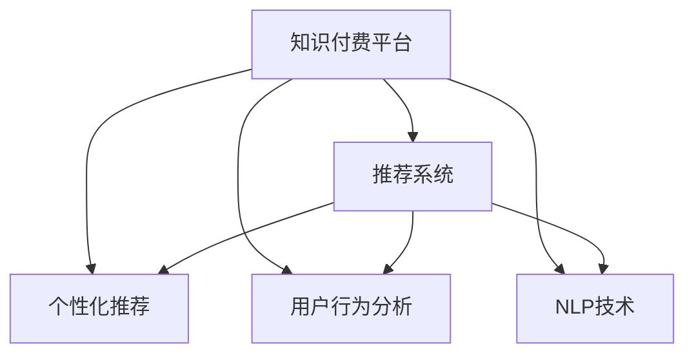

                 

# 如何利用AI技术提升知识付费效率

> 关键词：知识付费、AI技术、内容推荐、个性化推荐、用户行为分析、推荐系统

## 1. 背景介绍

随着知识付费的兴起，用户对于高质量内容的需求日益增长，这推动了内容创造和分发技术的快速发展。然而，如何在海量内容中准确匹配用户需求，提升知识付费的效率和效果，依然是行业内关注的焦点。AI技术，尤其是推荐系统，在这个领域发挥了重要作用。通过深入分析用户行为和偏好，推荐系统可以为用户推荐他们感兴趣的内容，显著提高内容发现和付费的效率。

## 2. 核心概念与联系

### 2.1 核心概念概述

为更好地理解AI技术在知识付费中的应用，本节将介绍几个核心概念：

- **知识付费**：用户通过订阅、购买等形式，获取专业知识和技能的学习服务。知识付费平台包括得到、喜马拉雅、知乎等，涵盖了从技能培训到兴趣培养的广泛内容。
- **推荐系统**：根据用户的历史行为和偏好，为用户推荐个性化内容的智能系统。推荐系统是知识付费平台的核心功能之一，通过精准匹配用户与内容，提升用户满意度和转化率。
- **个性化推荐**：根据用户行为特征，如浏览历史、购买记录等，为用户推荐符合其兴趣和需求的内容。个性化推荐能够显著提升用户粘性，促进付费转化。
- **用户行为分析**：通过收集和分析用户行为数据，理解用户的兴趣、偏好和需求，从而进行更有效的推荐。用户行为分析是推荐系统优化和改进的基础。
- **自然语言处理(NLP)**：使用机器学习技术处理和理解自然语言，如文本分类、情感分析、实体识别等，用于提取和表示用户需求和内容属性，提升推荐系统的效果。

这些核心概念之间的逻辑关系可以通过以下Mermaid流程图来展示：



这个流程图展示了知识付费平台与推荐系统、个性化推荐、用户行为分析和NLP技术之间的联系。推荐系统是知识付费平台的核心，通过个性化推荐和用户行为分析，利用NLP技术对用户需求和内容进行理解和匹配，从而提升内容推荐的精准性和用户满意度。

## 3. 核心算法原理 & 具体操作步骤
### 3.1 算法原理概述

AI技术在知识付费中的应用，主要是通过推荐系统实现的。推荐系统的核心思想是根据用户的历史行为和偏好，预测其可能感兴趣的内容，并将其推荐给用户。常用的推荐算法包括基于协同过滤、基于内容的推荐、混合推荐系统等。

以基于协同过滤的推荐算法为例，其核心原理是通过计算用户与内容之间的相似度，为用户推荐与其历史行为相似的其他用户喜欢的内容。具体步骤如下：

1. 收集用户的历史行为数据，如浏览记录、购买记录等。
2. 对用户和内容进行特征表示，如用户画像、内容标签等。
3. 计算用户与内容之间的相似度，通常使用余弦相似度或皮尔逊相关系数。
4. 根据相似度排序，为用户推荐与内容相似度最高的若干内容。

### 3.2 算法步骤详解

下面以基于协同过滤的推荐算法为例，详细讲解其具体操作步骤：

**Step 1: 数据收集与预处理**
- 收集用户的历史行为数据，包括浏览记录、购买记录、评分记录等。
- 对数据进行清洗和预处理，如去除无效数据、填补缺失值、归一化等。

**Step 2: 用户和内容的特征表示**
- 对用户进行特征提取，如性别、年龄、地域、历史行为等。
- 对内容进行特征提取，如标签、作者、发布时间等。

**Step 3: 计算相似度**
- 使用余弦相似度或皮尔逊相关系数计算用户与内容之间的相似度。
- 可以采用基于用户相似度的推荐方式，即为用户推荐与其他用户相似度最高的内容；也可以采用基于物品相似度的推荐方式，即为用户推荐与历史行为相似度最高的内容。

**Step 4: 生成推荐结果**
- 根据相似度排序，为用户推荐与历史行为相似度最高的若干内容。
- 可以采用基于NDCG、RMSE等指标评估推荐效果，并根据评估结果调整算法参数。

### 3.3 算法优缺点

基于协同过滤的推荐算法具有以下优点：
1. 简单高效。算法实现相对简单，不需要复杂的模型训练过程。
2. 适合处理稀疏数据。对于大量无评分数据的情况，协同过滤算法仍然能够进行推荐。
3. 能够处理冷启动问题。对于新用户和新内容，协同过滤算法可以利用相似用户和内容的评分数据进行推荐。

同时，该算法也存在一些局限性：
1. 推荐结果受数据质量影响较大。用户行为数据质量差会导致推荐效果不佳。
2. 对新用户和内容的推荐效果不佳。推荐系统依赖历史行为数据，无法对无数据的新用户和新内容进行有效推荐。
3. 需要考虑推荐多样性。协同过滤算法容易导致推荐结果单一，用户容易陷入"信息茧房"。

为了解决这些局限性，可以引入其他算法和模型优化方法，如基于内容的推荐、混合推荐系统、矩阵分解、深度学习等。

### 3.4 算法应用领域

基于AI技术的推荐系统，已经在知识付费平台得到了广泛的应用，覆盖了从内容推荐到用户留存等多个环节，例如：

- 内容推荐：根据用户浏览和购买历史，推荐相关课程和文章。
- 用户留存：通过定期推送个性化内容，提升用户粘性和活跃度。
- 营销活动：推荐系统可以分析用户行为数据，辅助策划个性化营销活动，提高转化率。
- 广告投放：根据用户兴趣和行为特征，进行精准的广告投放，提升广告效果。
- 内容创造：分析用户需求和反馈，指导内容创作者优化内容质量，提升内容吸引力。

除了上述这些经典应用外，AI技术还在知识付费平台带来了更多创新，如基于知识图谱的推荐、实时推荐系统、跨平台推荐等，为知识付费平台带来了更高的用户满意度和转化率。

## 4. 数学模型和公式 & 详细讲解  
### 4.1 数学模型构建

基于协同过滤的推荐系统，通常可以表示为如下数学模型：

假设用户集合为 $U$，内容集合为 $I$，用户对内容的评分矩阵为 $R \in \mathbb{R}^{n \times m}$，其中 $n$ 为用户数，$m$ 为内容数。协同过滤的目标是找到一个相似度矩阵 $S \in \mathbb{R}^{n \times m}$，使得推荐系统可以根据用户和内容之间的相似度 $S$ 进行推荐。

具体而言，协同过滤可以通过以下步骤进行：
1. 将用户 $u$ 和内容 $i$ 表示为特征向量 $\mathbf{u} \in \mathbb{R}^k$ 和 $\mathbf{i} \in \mathbb{R}^k$，其中 $k$ 为特征维度。
2. 计算用户 $u$ 和内容 $i$ 的相似度 $s_{u,i} = \mathbf{u}^\top \mathbf{i}$，其中 $\top$ 表示矩阵转置。
3. 根据相似度 $s_{u,i}$ 排序，为用户 $u$ 推荐与内容 $i$ 相似度最高的若干内容。

### 4.2 公式推导过程

假设用户 $u$ 和内容 $i$ 的特征向量分别为 $\mathbf{u} = (u_1, u_2, ..., u_k)$ 和 $\mathbf{i} = (i_1, i_2, ..., i_k)$，则用户 $u$ 和内容 $i$ 的相似度为：

$$
s_{u,i} = \mathbf{u}^\top \mathbf{i} = \sum_{j=1}^k u_j i_j
$$

在实际应用中，可以采用如下方法计算用户和内容的相似度：

1. **余弦相似度**：
   $$
   s_{u,i} = \frac{\mathbf{u}^\top \mathbf{i}}{\|\mathbf{u}\| \|\mathbf{i}\|} = \frac{\mathbf{u}^\top \mathbf{i}}{\sqrt{\sum_{j=1}^k u_j^2} \sqrt{\sum_{j=1}^k i_j^2}}
   $$

2. **皮尔逊相关系数**：
   $$
   s_{u,i} = \frac{\sum_{j=1}^k u_j i_j}{\sqrt{\sum_{j=1}^k u_j^2} \sqrt{\sum_{j=1}^k i_j^2}}
   $$

通过计算相似度，可以为用户推荐与历史行为相似度最高的若干内容。推荐结果可以通过 NDCG、RMSE 等指标进行评估。

### 4.3 案例分析与讲解

以下是一个简单的案例分析：假设用户 $u_1$ 和内容 $i_1, i_2, i_3$ 的特征向量分别为：

$$
\mathbf{u}_1 = (1, 0, 1), \mathbf{i}_1 = (1, 1, 0), \mathbf{i}_2 = (0, 1, 0), \mathbf{i}_3 = (1, 0, 0)
$$

则用户 $u_1$ 和内容 $i_1, i_2, i_3$ 的相似度分别为：

$$
s_{u_1,i_1} = \mathbf{u}_1^\top \mathbf{i}_1 = 1, s_{u_1,i_2} = \mathbf{u}_1^\top \mathbf{i}_2 = 0, s_{u_1,i_3} = \mathbf{u}_1^\top \mathbf{i}_3 = 1
$$

推荐结果为内容 $i_1$ 和内容 $i_3$。

## 5. 项目实践：代码实例和详细解释说明
### 5.1 开发环境搭建

在进行推荐系统开发前，我们需要准备好开发环境。以下是使用Python进行PyTorch开发的环境配置流程：

1. 安装Anaconda：从官网下载并安装Anaconda，用于创建独立的Python环境。

2. 创建并激活虚拟环境：
```bash
conda create -n pytorch-env python=3.8 
conda activate pytorch-env
```

3. 安装PyTorch：根据CUDA版本，从官网获取对应的安装命令。例如：
```bash
conda install pytorch torchvision torchaudio cudatoolkit=11.1 -c pytorch -c conda-forge
```

4. 安装Transformers库：
```bash
pip install transformers
```

5. 安装各类工具包：
```bash
pip install numpy pandas scikit-learn matplotlib tqdm jupyter notebook ipython
```

完成上述步骤后，即可在`pytorch-env`环境中开始推荐系统开发。

### 5.2 源代码详细实现

下面以基于协同过滤的推荐系统为例，给出使用Transformers库对知识付费平台进行推荐系统开发的PyTorch代码实现。

首先，定义推荐系统的数据处理函数：

```python
from transformers import BertTokenizer
from torch.utils.data import Dataset
import torch

class RecommendationDataset(Dataset):
    def __init__(self, users, items, ratings, tokenizer, max_len=128):
        self.users = users
        self.items = items
        self.ratings = ratings
        self.tokenizer = tokenizer
        self.max_len = max_len
        
    def __len__(self):
        return len(self.users)
    
    def __getitem__(self, item):
        user = self.users[item]
        item = self.items[item]
        rating = self.ratings[item]
        
        # 对用户和物品进行编码
        user_embedding = self.tokenizer(user, return_tensors='pt', max_length=self.max_len, padding='max_length', truncation=True)
        item_embedding = self.tokenizer(item, return_tensors='pt', max_length=self.max_len, padding='max_length', truncation=True)
        
        # 将用户和物品嵌入拼接，作为推荐系统的输入
        input_ids = user_embedding['input_ids'] + item_embedding['input_ids']
        attention_mask = user_embedding['attention_mask'] + item_embedding['attention_mask']
        rating = torch.tensor(rating, dtype=torch.float)
        
        return {'input_ids': input_ids, 
                'attention_mask': attention_mask,
                'rating': rating}

# 定义模型结构
from transformers import BertForSequenceClassification
import torch.nn as nn

class RecommendationModel(nn.Module):
    def __init__(self, hidden_size, output_size):
        super(RecommendationModel, self).__init__()
        self.bert = BertForSequenceClassification.from_pretrained('bert-base-cased', num_labels=1)
        self.fc = nn.Linear(hidden_size, output_size)
        
    def forward(self, input_ids, attention_mask, rating):
        features = self.bert(input_ids, attention_mask=attention_mask)[0]
        features = self.fc(features)
        prediction = torch.sigmoid(features)
        return prediction

# 定义训练和评估函数
from torch.utils.data import DataLoader
from tqdm import tqdm
from sklearn.metrics import roc_auc_score

device = torch.device('cuda') if torch.cuda.is_available() else torch.device('cpu')
model = RecommendationModel(hidden_size=768, output_size=1).to(device)

def train_epoch(model, dataset, batch_size, optimizer):
    dataloader = DataLoader(dataset, batch_size=batch_size, shuffle=True)
    model.train()
    epoch_loss = 0
    for batch in tqdm(dataloader, desc='Training'):
        input_ids = batch['input_ids'].to(device)
        attention_mask = batch['attention_mask'].to(device)
        rating = batch['rating'].to(device)
        model.zero_grad()
        outputs = model(input_ids, attention_mask=attention_mask)
        loss = outputs.mean()  # 只关注预测评分和实际评分的误差
        epoch_loss += loss.item()
        loss.backward()
        optimizer.step()
    return epoch_loss / len(dataloader)

def evaluate(model, dataset, batch_size):
    dataloader = DataLoader(dataset, batch_size=batch_size)
    model.eval()
    preds, labels = [], []
    with torch.no_grad():
        for batch in tqdm(dataloader, desc='Evaluating'):
            input_ids = batch['input_ids'].to(device)
            attention_mask = batch['attention_mask'].to(device)
            batch_labels = batch['rating'].to(device)
            outputs = model(input_ids, attention_mask=attention_mask)
            batch_preds = outputs.sigmoid().tolist()
            batch_labels = batch_labels.to('cpu').tolist()
            for pred, label in zip(batch_preds, batch_labels):
                preds.append(pred)
                labels.append(label)
                
    auc = roc_auc_score(labels, preds)
    print(f"AUC: {auc:.3f}")
```

以上代码实现了基于协同过滤的推荐系统，其中使用了BERT模型对用户和物品进行特征编码，然后通过一个线性层输出预测评分。通过训练模型，使得预测评分与实际评分尽可能接近。

### 5.3 代码解读与分析

让我们再详细解读一下关键代码的实现细节：

**RecommendationDataset类**：
- `__init__`方法：初始化用户、物品、评分数据，以及分词器等关键组件。
- `__len__`方法：返回数据集的样本数量。
- `__getitem__`方法：对单个样本进行处理，将用户和物品编码，并进行拼接，作为模型的输入。

**RecommendationModel类**：
- `__init__`方法：初始化BERT模型和线性层，定义推荐系统的结构。
- `forward`方法：对输入数据进行前向传播，计算预测评分。

**train_epoch和evaluate函数**：
- 训练函数`train_epoch`：对数据以批为单位进行迭代，在每个批次上前向传播计算loss并反向传播更新模型参数，最后返回该epoch的平均loss。
- 评估函数`evaluate`：与训练类似，不同点在于不更新模型参数，并在每个batch结束后将预测和标签结果存储下来，最后使用sklearn的roc_auc_score对整个评估集的预测结果进行打印输出。

**训练流程**：
- 定义总的epoch数和batch size，开始循环迭代
- 每个epoch内，先在训练集上训练，输出平均loss
- 在验证集上评估，输出AUC
- 重复上述步骤直至满足预设的迭代轮数或AUC达到最优

可以看到，PyTorch配合Transformers库使得推荐系统的代码实现变得简洁高效。开发者可以将更多精力放在数据处理、模型改进等高层逻辑上，而不必过多关注底层的实现细节。

当然，工业级的系统实现还需考虑更多因素，如模型的保存和部署、超参数的自动搜索、更灵活的任务适配层等。但核心的推荐范式基本与此类似。

## 6. 实际应用场景
### 6.1 智能推荐系统

智能推荐系统是知识付费平台的核心功能之一，能够显著提升内容发现和付费的效率。通过深入分析用户行为和偏好，推荐系统可以为用户推荐他们感兴趣的内容，从而提高用户的满意度和转化率。

具体而言，智能推荐系统可以涵盖以下应用场景：
- 内容推荐：根据用户浏览和购买历史，推荐相关课程和文章。
- 用户留存：通过定期推送个性化内容，提升用户粘性和活跃度。
- 营销活动：推荐系统可以分析用户行为数据，辅助策划个性化营销活动，提高转化率。
- 广告投放：根据用户兴趣和行为特征，进行精准的广告投放，提升广告效果。
- 内容创造：分析用户需求和反馈，指导内容创作者优化内容质量，提升内容吸引力。

### 6.2 个性化推荐算法优化

为了提升推荐系统的性能和效果，可以通过以下方法进行算法优化：

1. **冷启动问题**：对于新用户和新内容，推荐系统无法进行有效推荐。可以通过引入专家知识、冷启动策略等方式，解决冷启动问题。
2. **多样性问题**：协同过滤算法容易导致推荐结果单一，用户容易陷入"信息茧房"。可以通过引入多样化推荐算法、限制相似度阈值等方式，提升推荐多样性。
3. **动态更新**：用户行为和偏好会随着时间变化，推荐系统需要不断更新模型参数，保持推荐效果。可以通过定期重新训练、增量学习等方式，实现动态更新。
4. **多维度融合**：推荐系统不仅仅依赖用户和内容的历史评分数据，还可以融合多维度的信息，如用户画像、物品属性、时间特征等，提升推荐效果。
5. **实时推荐**：通过实时收集用户行为数据，及时更新推荐模型，提升推荐的时效性。

## 7. 工具和资源推荐
### 7.1 学习资源推荐

为了帮助开发者系统掌握推荐系统的理论基础和实践技巧，这里推荐一些优质的学习资源：

1. 《推荐系统实战》系列博文：由推荐系统专家撰写，深入浅出地介绍了推荐系统的基本概念和经典算法。
2. 《深度学习与推荐系统》课程：由吴恩达教授讲授，涵盖推荐系统的深度学习实现，包括协同过滤、矩阵分解、深度学习等。
3. 《推荐系统算法》书籍：全面介绍了推荐系统的各种算法和实现方法，适合系统学习和实践。
4. Coursera的《推荐系统》课程：由斯坦福大学教授讲授，涵盖推荐系统的理论基础和实践案例。
5. Kaggle的推荐系统竞赛：参与实际竞赛，积累推荐系统的工程经验和数据处理能力。

通过对这些资源的学习实践，相信你一定能够快速掌握推荐系统的精髓，并用于解决实际的推荐问题。

### 7.2 开发工具推荐

高效的开发离不开优秀的工具支持。以下是几款用于推荐系统开发的常用工具：

1. PyTorch：基于Python的开源深度学习框架，灵活动态的计算图，适合快速迭代研究。大部分推荐系统模型都有PyTorch版本的实现。
2. TensorFlow：由Google主导开发的开源深度学习框架，生产部署方便，适合大规模工程应用。同样有丰富的推荐系统模型资源。
3. HuggingFace Transformers：提供一站式的自然语言处理工具，包括预训练语言模型和推荐系统模型，适合快速开发和测试。
4. Weights & Biases：模型训练的实验跟踪工具，可以记录和可视化模型训练过程中的各项指标，方便对比和调优。与主流深度学习框架无缝集成。
5. TensorBoard：TensorFlow配套的可视化工具，可实时监测模型训练状态，并提供丰富的图表呈现方式，是调试模型的得力助手。

合理利用这些工具，可以显著提升推荐系统的开发效率，加快创新迭代的步伐。

### 7.3 相关论文推荐

推荐系统的发展源于学界的持续研究。以下是几篇奠基性的相关论文，推荐阅读：

1. Matrix Factorization Techniques for Recommender Systems（矩阵分解方法）：提出基于矩阵分解的推荐算法，广泛应用于协同过滤、矩阵分解等推荐系统。
2. collaborative filtering for implicit feedback datasets（协同过滤算法）：提出基于协同过滤的推荐算法，解决隐式反馈数据集的推荐问题。
3. A Unified Matrix Factorization Framework for Recommender Systems（统一矩阵分解框架）：提出统一的矩阵分解框架，适用于多种推荐算法。
4. Deep Collaborative Filtering（深度协同过滤）：提出基于深度神经网络的推荐算法，提升推荐效果。
5. Recommender Systems for Highly Sensitive Domains（高敏感域推荐系统）：研究推荐系统在隐私保护、可信度、多样化等方面的挑战和解决方案。

这些论文代表了大规模推荐系统的研究方向，通过学习这些前沿成果，可以帮助研究者把握学科前进方向，激发更多的创新灵感。

## 8. 总结：未来发展趋势与挑战

### 8.1 总结

本文对基于AI技术的推荐系统在知识付费中的应用进行了全面系统的介绍。首先阐述了推荐系统的核心思想和实现方法，明确了推荐系统在知识付费中的重要地位。其次，从原理到实践，详细讲解了推荐系统的数学模型和关键步骤，给出了推荐系统开发的完整代码实例。同时，本文还广泛探讨了推荐系统在智能推荐、个性化推荐、用户留存等多个领域的应用前景，展示了推荐系统的巨大潜力。此外，本文精选了推荐系统的各类学习资源，力求为读者提供全方位的技术指引。

通过本文的系统梳理，可以看到，基于AI技术的推荐系统已经深入应用于知识付费平台，显著提高了内容发现和付费的效率，带来了更高的用户满意度和转化率。未来，随着推荐算法的不断优化和新型推荐方法的涌现，推荐系统将在知识付费领域发挥更加重要的作用，推动知识付费技术的不断进步。

### 8.2 未来发展趋势

展望未来，推荐系统的应用和发展将呈现以下几个趋势：

1. 推荐算法的多样化。除了协同过滤、矩阵分解等传统算法，未来将涌现更多高效的推荐算法，如深度学习、强化学习、知识图谱等。
2. 推荐系统的个性化。个性化推荐系统将更加注重用户的多样化需求，通过多种数据源和多种模型融合，实现更加精准的推荐。
3. 推荐系统的实时化。实时推荐系统将不断提升，通过实时收集用户行为数据，及时更新推荐模型，提升推荐的时效性。
4. 推荐系统的跨平台化。推荐系统将覆盖更多平台和设备，实现跨平台协同推荐。
5. 推荐系统的智能化。推荐系统将引入更多智能技术，如多模态融合、因果推断等，提升推荐系统的理解和推理能力。

这些趋势将进一步推动推荐系统的发展，使其在知识付费领域发挥更大的作用，为用户带来更加丰富和个性化的内容推荐。

### 8.3 面临的挑战

尽管推荐系统已经取得了显著的成就，但在实际应用中也面临诸多挑战：

1. 数据质量问题。推荐系统依赖用户和内容的历史数据，数据质量差会导致推荐效果不佳。
2. 冷启动问题。对于新用户和新内容，推荐系统无法进行有效推荐。
3. 用户隐私问题。推荐系统需要收集和分析用户行为数据，如何保护用户隐私是一个重要问题。
4. 模型鲁棒性问题。推荐系统容易受到恶意攻击和数据偏差的影响，需要提高模型的鲁棒性。
5. 系统扩展问题。推荐系统需要处理大规模数据和模型，如何实现高效扩展是一个重要挑战。

这些挑战需要研究者和开发者共同应对，通过算法优化、模型设计、隐私保护等手段，提升推荐系统的性能和效果。

### 8.4 研究展望

为了应对上述挑战，未来的研究需要在以下几个方面寻求新的突破：

1. 数据增强与用户行为建模。通过多维度的数据增强和更深入的用户行为建模，提升推荐系统的效果。
2. 推荐系统与知识图谱的融合。将知识图谱与推荐系统相结合，提升推荐系统的解释性和推理能力。
3. 推荐系统与深度学习的融合。通过深度学习技术提升推荐系统的表达能力和泛化能力。
4. 推荐系统与强化学习的融合。将强化学习技术引入推荐系统，提升推荐系统的动态调整能力和自适应能力。
5. 推荐系统的可解释性和公平性。引入可解释性技术和公平性指标，提升推荐系统的透明性和公正性。

这些研究方向的探索，必将引领推荐系统技术迈向更高的台阶，为知识付费平台带来更高的用户满意度和转化率。面向未来，推荐系统还需要与其他人工智能技术进行更深入的融合，如自然语言处理、计算机视觉等，多路径协同发力，共同推动知识付费技术的不断进步。

## 9. 附录：常见问题与解答

**Q1：推荐系统如何处理冷启动问题？**

A: 冷启动问题是指对于新用户和新内容，推荐系统无法进行有效推荐。以下是一些处理冷启动问题的方法：
1. 用户画像：通过收集用户的基本信息、兴趣、行为等数据，建立用户画像，用于推荐系统进行推荐。
2. 协同过滤：对于新内容，可以通过与其他用户的历史评分数据进行相似度匹配，推荐相似用户喜欢的内容。
3. 专家推荐：引入领域专家的推荐，帮助推荐系统进行初期推荐。
4. 混合推荐：将协同过滤、矩阵分解、内容推荐等多种方法进行融合，提升推荐效果。
5. 多模态融合：将用户的多模态数据（如文本、语音、图像等）进行融合，提升推荐系统的效果。

**Q2：推荐系统如何处理多样性问题？**

A: 多样性问题是指推荐系统容易受到用户历史行为的影响，导致推荐结果单一，用户容易陷入"信息茧房"。以下是一些处理多样性问题的方法：
1. 多样化推荐算法：引入多样化推荐算法，如基于内容的推荐、基于属性的推荐等，避免推荐结果过于集中。
2. 限制相似度阈值：降低相似度阈值，增加推荐结果的多样性。
3. 多样化特征表示：引入多维度的特征表示，提升推荐系统的多样性。
4. 限制推荐数量：限制推荐结果的数量，避免过度集中。

**Q3：推荐系统如何处理数据质量问题？**

A: 数据质量问题是指用户和内容的历史数据存在噪声和缺失，影响推荐效果。以下是一些处理数据质量问题的方法：
1. 数据清洗：对数据进行清洗，去除无效数据、填补缺失值等。
2. 数据增强：通过数据增强技术，如数据合成、数据重构等，提升数据质量。
3. 异常检测：对数据进行异常检测，识别和处理异常数据。
4. 数据预处理：对数据进行预处理，如归一化、标准化等，提升数据质量。

这些方法可以综合使用，提升推荐系统的数据质量，从而提高推荐效果。

**Q4：推荐系统如何处理用户隐私问题？**

A: 用户隐私问题是推荐系统面临的重要挑战之一。以下是一些处理用户隐私问题的方法：
1. 匿名化处理：对用户数据进行匿名化处理，保护用户隐私。
2. 数据加密：对用户数据进行加密处理，保护用户隐私。
3. 用户授权：通过用户授权的方式，确保用户隐私得到保护。
4. 隐私保护技术：引入隐私保护技术，如差分隐私、同态加密等，保护用户隐私。

这些方法可以综合使用，保护用户隐私，提升推荐系统的可信度。

**Q5：推荐系统如何处理模型鲁棒性问题？**

A: 模型鲁棒性问题是指推荐系统容易受到恶意攻击和数据偏差的影响，导致推荐结果不稳定。以下是一些处理模型鲁棒性问题的方法：
1. 鲁棒性优化：通过鲁棒性优化技术，提升推荐系统的鲁棒性。
2. 数据清洗：对数据进行清洗，去除噪声和异常数据。
3. 模型验证：通过模型验证技术，确保推荐系统的鲁棒性。
4. 多模型融合：通过多模型融合技术，提升推荐系统的鲁棒性。

这些方法可以综合使用，提升推荐系统的鲁棒性，确保推荐结果的稳定性和可靠性。

---

作者：禅与计算机程序设计艺术 / Zen and the Art of Computer Programming

