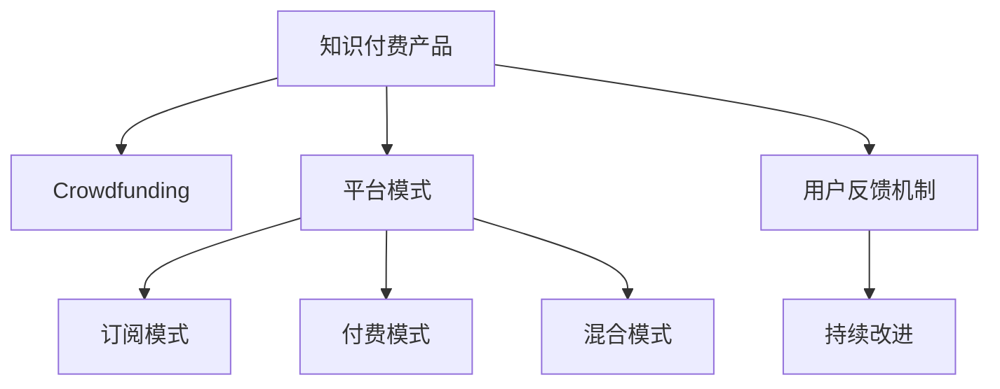

                 

## 1. 背景介绍

### 1.1 问题由来
随着互联网的快速发展，知识付费市场正在迎来爆炸式的增长。越来越多的人通过付费订阅或单次购买的方式，获取专业化的知识内容，以快速提升自己。知识付费产品的形式也从简单的文章、视频逐渐拓展到音频、直播等多种形态，用户需求日益多样化。

然而，开发和运营知识付费产品的成本很高，尤其是对于初创企业或独立开发者而言，很难承担高昂的技术开发和市场推广费用。为了解决这一问题，一种新的商业模式——众筹模式，逐渐引起了广泛关注。

### 1.2 问题核心关键点
众筹模式（Crowdfunding）是指通过互联网平台，向广大网民募集资金以支持某一项目的开发和运营。在知识付费领域，众筹模式可以降低开发成本，同时激励用户参与项目，形成良性循环。但同时，众筹模式也面临着如何保障产品质量、控制成本、确保用户体验等挑战。

## 2. 核心概念与联系

### 2.1 核心概念概述

为更好地理解众筹模式在知识付费产品开发中的应用，本节将介绍几个密切相关的核心概念：

- **知识付费产品（Knowledge Products）**：指以知识内容为核心的付费服务，包括文章、视频、音频、直播、电子书等多种形式。知识付费产品旨在为用户提供高价值的知识信息，帮助其提升专业能力和生活技能。

- **众筹模式（Crowdfunding）**：指通过互联网平台，向广大网民募集资金以支持某一项目的开发和运营。众筹模式具有低门槛、高透明度的特点，能够吸引更多用户的参与和支持。

- **平台模式（Platform Model）**：指构建一个开放的生态系统，吸引开发者和用户共同参与，形成良好的互动和反馈机制。平台模式可以降低单个知识付费产品的开发和运营成本，提高平台的整体价值。

- **订阅模式（Subscription Model）**：指用户通过定期付费，获取平台提供的各类知识内容。订阅模式能够稳定平台收入，同时降低单次购买的成本。

- **付费模式（Paying Model）**：指用户通过单次付费获取某个独立内容。付费模式适用于具有独特价值且用户需求明确的知识产品。

- **混合模式（Hybrid Model）**：指结合订阅和付费两种模式，为用户提供多样化的内容获取方式。混合模式能够更好地满足不同用户需求，提高用户粘性。

- **用户反馈机制（User Feedback Mechanism）**：指平台通过用户评价、评论、评分等方式，收集用户对知识付费产品的反馈，以持续改进产品质量。

这些核心概念之间的逻辑关系可以通过以下Mermaid流程图来展示：



这个流程图展示出知识付费产品的核心概念及其之间的关系：

1. 知识付费产品通过众筹模式获得开发资金，降低开发成本。
2. 平台模式吸引开发者和用户共同参与，构建互动生态。
3. 订阅模式和付费模式结合，满足不同用户需求。
4. 用户反馈机制持续收集用户意见，提升产品质量。
5. 平台通过这些模式组合，实现稳定运营和持续创新。

## 3. 核心算法原理 & 具体操作步骤

### 3.1 算法原理概述

利用众筹模式开发知识付费产品的核心在于，通过互联网平台将用户、开发者和平台三方连接起来，形成互相支持、共同发展的生态系统。具体而言，其算法原理包括以下几个关键点：

1. **资金募集算法**：平台通过众筹平台吸引用户募集资金，用于知识产品的开发和运营。资金募集算法应确保募集过程公开透明，用户能随时查看募资进展和资金用途。

2. **需求匹配算法**：平台根据用户需求，匹配合适的知识产品。需求匹配算法应考虑用户的兴趣、支付能力、历史行为等因素，以提高匹配精度。

3. **质量控制算法**：平台通过用户反馈机制，监控知识产品的质量。质量控制算法应实时收集和分析用户评价，及时调整和优化产品内容。

4. **成本控制算法**：平台应通过合理的定价和成本控制策略，确保产品的性价比。成本控制算法应考虑内容生产成本、运营成本和用户支付意愿等因素。

5. **收益分配算法**：平台应根据开发者贡献和用户贡献，合理分配收益。收益分配算法应公平透明，激励开发者和用户共同参与。

### 3.2 算法步骤详解

以下我们将详细介绍利用众筹模式开发知识付费产品的详细步骤：

**Step 1: 项目立项与需求调研**

- 明确项目目标：如开发一套AI基础课程。
- 开展需求调研：通过问卷调查、用户访谈等方式，了解目标用户的需求和期望。
- 制定项目计划：包括开发进度、资金需求、内容大纲等。

**Step 2: 平台搭建与资金募集**

- 选择众筹平台：如Kickstarter、Indiegogo等，注册平台账号。
- 制定募资目标：如筹集10万元，用于课程开发和运营。
- 设计募资策略：如承诺在一定时间内完成课程开发，提供课程样片等激励。

**Step 3: 内容生产与开发者招募**

- 招募内容开发者：如邀请高校教师、行业专家、内容创作者等，参与课程制作。
- 制定内容标准：如课程大纲、教学质量、进度安排等，确保内容质量。
- 提供开发支持：如技术工具、平台资源、用户反馈等，帮助开发者顺利完成内容制作。

**Step 4: 质量控制与反馈机制**

- 建立用户反馈渠道：如评论区、评分系统、意见箱等，收集用户意见。
- 实时监控内容质量：如通过数据分析工具，监控课程用户参与度和评价指标。
- 调整优化课程内容：如根据用户反馈，调整课程进度、内容结构和教学方法。

**Step 5: 发布与运营**

- 平台发布课程：如在平台首页展示，提供试听、购买等入口。
- 提供持续服务：如定期更新课程内容、提供专家答疑、组织线上活动等，增强用户体验。
- 扩大用户群体：如通过推广活动、合作推广等方式，吸引更多用户参与。

**Step 6: 收益分配与回馈**

- 制定收益分配策略：如根据开发者贡献和用户贡献，合理分配收益。
- 提供激励措施：如公开表彰优秀开发者和用户，提供课程优惠、免费服务等。
- 持续优化运营：如根据运营效果，调整和优化策略，提升平台整体价值。

### 3.3 算法优缺点

利用众筹模式开发知识付费产品具有以下优点：

1. **降低开发成本**：通过众筹模式，平台和开发者可以共同分担开发成本，减轻资金压力。
2. **提高用户参与度**：用户可以通过众筹参与项目开发，增强对产品的认同感和参与感。
3. **增加用户粘性**：平台通过持续服务和用户反馈机制，增强用户粘性和忠诚度。
4. **激励开发者创作**：平台通过收益分配机制，激励开发者创作更多优质内容。

但同时也存在以下缺点：

1. **资金募集难度**：如何吸引用户参与众筹，并保证资金到位，是项目成功的关键。
2. **内容质量难以保障**：众筹模式下，开发者水平参差不齐，内容质量难以保证。
3. **运营成本高**：平台需要投入大量资源进行内容质量控制和用户服务，成本较高。
4. **收益分配复杂**：如何公平合理地分配收益，激励各方共同参与，是平台运营的难点。

## 4. 数学模型和公式 & 详细讲解  
### 4.1 数学模型构建

为了更好地理解众筹模式在知识付费产品开发中的应用，本节将通过数学语言对相关模型进行严格刻画。

设知识付费产品开发项目为 $P$，用户为 $U$，开发者为 $D$，平台为 $T$。

- **资金募集模型**：平台通过众筹平台 $F$ 吸引用户 $U$ 募集资金 $R$，用于项目 $P$ 的开发和运营。
- **需求匹配模型**：平台根据用户 $U$ 的需求 $D_u$，匹配合适的知识产品 $P_i$。
- **质量控制模型**：平台通过用户 $U$ 的反馈 $F_u$，监控知识产品 $P_i$ 的质量 $Q_i$。
- **成本控制模型**：平台根据知识产品 $P_i$ 的成本 $C_i$ 和用户支付意愿 $W_u$，合理定价 $P_i$。
- **收益分配模型**：平台根据开发者 $D_i$ 和用户 $U_i$ 的贡献 $C_{D,i}$ 和 $C_{U,i}$，合理分配收益 $B_i$。

### 4.2 公式推导过程

以下我们将对上述数学模型进行详细推导：

1. **资金募集模型**

$$
R_{P} = \sum_{u \in U} R_{u, P} = \sum_{u \in U} \alpha_{u, P} F_{u, P}
$$

其中 $\alpha_{u, P}$ 表示用户 $u$ 对项目 $P$ 的关注度，$F_{u, P}$ 表示用户 $u$ 在众筹平台 $F$ 上捐赠的金额。

2. **需求匹配模型**

$$
P_{U_i} = \max_{i} P_{i} \cdot D_{i} = \max_{i} P_{i} \cdot \frac{P_{i} \cdot F_{u, P_i}}{R_{P}}
$$

其中 $P_{U_i}$ 表示用户 $U_i$ 的需求 $D_{i}$ 与知识产品 $P_i$ 的匹配程度。

3. **质量控制模型**

$$
Q_{P_i} = \frac{1}{N} \sum_{u \in U} F_{u, P_i}
$$

其中 $Q_{P_i}$ 表示知识产品 $P_i$ 的质量，$N$ 表示用户数量。

4. **成本控制模型**

$$
P_{i} = C_{i} + \beta W_{u}
$$

其中 $P_{i}$ 表示知识产品 $P_i$ 的价格，$C_{i}$ 表示内容生产成本，$W_{u}$ 表示用户支付意愿，$\beta$ 表示价格弹性系数。

5. **收益分配模型**

$$
B_{D_i} = C_{D,i} \cdot \gamma + C_{U,i} \cdot \delta
$$

其中 $B_{D_i}$ 表示开发者 $D_i$ 的收益，$C_{D,i}$ 表示开发者 $D_i$ 的贡献，$\gamma$ 表示开发者的贡献系数，$C_{U,i}$ 表示用户的贡献，$\delta$ 表示用户的贡献系数。

### 4.3 案例分析与讲解

以下我们将以一个AI基础课程开发为例，展示如何使用数学模型进行分析：

**案例背景**：

某平台希望开发一套AI基础课程，通过众筹模式募集资金。课程分为10章，每章需30分钟视频讲解，预计总时长300分钟，制作成本为5000元。课程通过平台发布，用户可单次购买或订阅观看。

**模型设定**：

- **用户群体**：初步调研发现，目标用户群体为大学生和职场人士，对AI基础有较高的兴趣和需求。
- **需求调研**：通过问卷调查和用户访谈，发现用户最关注的内容为机器学习基础、深度学习应用和算法优化等。
- **募资目标**：通过平台众筹，募集10000元用于课程制作和运营。

**资金募集模型**：

假设平台吸引1000名用户参与众筹，每人捐赠10元，则：

$$
R_P = 1000 \times 10 = 10000
$$

**需求匹配模型**：

根据调研结果，课程需匹配的内容占比如下：

| 内容    | 占比    |
|---------|---------|
| 机器学习基础 | 30%    |
| 深度学习应用 | 30%    |
| 算法优化    | 40%    |

因此，匹配度为：

$$
P_{U_i} = 30\% \times 0.3 + 30\% \times 0.3 + 40\% \times 0.4 = 0.33
$$

**质量控制模型**：

假设用户对课程的质量评价如下：

| 评价等级 | 数量    |
|----------|---------|
| 非常满意 | 400     |
| 满意     | 500     |
| 一般     | 500     |
| 不满意   | 100     |

则课程的质量为：

$$
Q_P = \frac{400 + 500 + 500}{1000} = 0.7
$$

**成本控制模型**：

假设课程制作成本为5000元，用户支付意愿为30元，则课程价格为：

$$
P_i = 5000 + 30 \times \beta
$$

其中 $\beta$ 为价格弹性系数，假设为0.8，则：

$$
P_i = 5000 + 30 \times 0.8 = 7200
$$

**收益分配模型**：

假设开发者投入200小时，制作成本为10000元；平台投入2000元，进行运营推广，则：

$$
B_{D_i} = 200 \times 10000 \times 0.1 + 2000 \times 1000 \times 0.2 = 24000
$$

其中，开发者贡献系数为0.1，平台贡献系数为0.2。

## 5. 项目实践：代码实例和详细解释说明

### 5.1 开发环境搭建

在进行众筹模式开发知识付费产品的实践前，我们需要准备好开发环境。以下是使用Python进行Flask框架开发的开发环境配置流程：

1. 安装Anaconda：从官网下载并安装Anaconda，用于创建独立的Python环境。

2. 创建并激活虚拟环境：
```bash
conda create -n flask-env python=3.8 
conda activate flask-env
```

3. 安装Flask：
```bash
pip install Flask
```

4. 安装SQLAlchemy：用于数据库操作。
```bash
pip install SQLAlchemy
```

5. 安装Flask-SocketIO：用于实现实时通信。
```bash
pip install Flask-SocketIO
```

完成上述步骤后，即可在`flask-env`环境中开始项目开发。

### 5.2 源代码详细实现

以下我们将详细介绍利用Flask框架实现众筹模式开发知识付费产品的代码实现。

**app.py**：

```python
from flask import Flask, render_template, request
from flask_sqlalchemy import SQLAlchemy
from flask_socketio import SocketIO

app = Flask(__name__)
app.config['SQLALCHEMY_DATABASE_URI'] = 'sqlite:///crowdfunding.db'
app.config['SECRET_KEY'] = 'secret!'
db = SQLAlchemy(app)
socketio = SocketIO(app)

class User(db.Model):
    id = db.Column(db.Integer, primary_key=True)
    name = db.Column(db.String(50), unique=True, nullable=False)
    donation = db.Column(db.Float, default=0)

class Project(db.Model):
    id = db.Column(db.Integer, primary_key=True)
    name = db.Column(db.String(50), unique=True, nullable=False)
    goal = db.Column(db.Float, nullable=False)
    current = db.Column(db.Float, default=0)
    description = db.Column(db.Text, nullable=False)

    def update_current(self):
        self.current = self.goal
        db.session.commit()

@socketio.on('donate')
def donate(event):
    user_id = event['user_id']
    amount = event['amount']
    user = User.query.get(user_id)
    project = Project.query.get(event['project_id'])
    user.donation += amount
    project.current += amount
    user.update()
    project.update_current()
    socketio.emit('update', {'user_donation': user.donation, 'project_current': project.current})

@app.route('/')
def index():
    users = User.query.all()
    projects = Project.query.all()
    return render_template('index.html', users=users, projects=projects)

@app.route('/donate', methods=['POST'])
def donate_user():
    user_id = request.form.get('user_id')
    project_id = request.form.get('project_id')
    amount = float(request.form.get('amount'))
    user = User.query.get(user_id)
    project = Project.query.get(project_id)
    if user.donation >= project.goal:
        return 'Thank you for your donation!'
    user.donation += amount
    project.current += amount
    user.update()
    project.update_current()
    return 'Donation successful!'

@app.route('/project', methods=['POST'])
def create_project():
    name = request.form.get('name')
    goal = float(request.form.get('goal'))
    description = request.form.get('description')
    project = Project(name=name, goal=goal, description=description)
    db.session.add(project)
    db.session.commit()
    return 'Project created successfully!'

if __name__ == '__main__':
    app.run(debug=True)
```

**index.html**：

```html
<!DOCTYPE html>
<html>
<head>
    <title>Crowdfunding Platform</title>
    <script src="{{ url_for('static', filename='socketio.js') }}"></script>
    <script>
        var socket = io.connect(window.location.origin);
        socket.on('update', function(data) {
            $('#user-donation').text(data.user_donation);
            $('#project-current').text(data.project_current);
        });
        $('#donate-btn').click(function() {
            var user_id = $('#user-id').val();
            var project_id = $('#project-id').val();
            var amount = parseFloat($('#amount').val());
            socket.emit('donate', {user_id: user_id, project_id: project_id, amount: amount});
        });
    </script>
</head>
<body>
    <h1>Crowdfunding Platform</h1>
    <form id="donate-form">
        <label for="user-id">User ID:</label>
        <input type="text" id="user-id">
        <br>
        <label for="project-id">Project ID:</label>
        <input type="text" id="project-id">
        <br>
        <label for="amount">Amount:</label>
        <input type="text" id="amount">
        <br>
        <button id="donate-btn">Donate</button>
    </form>
    <div>
        <h2>Users</h2>
        <ul id="user-list">
            
                <li>{{ user.name }} - Donation: {{ user.donation }}</li>
            
        </ul>
        <h2>Projects</h2>
        <ul id="project-list">
            
                <li>{{ project.name }} - Goal: {{ project.goal }} - Current: {{ project.current }}</li>
            
        </ul>
    </div>
</body>
</html>
```

**app.py**代码解释：

- **Flask应用初始化**：设置数据库连接和密钥。
- **User和Project模型定义**：分别表示用户和项目，包含属性和操作。
- **socketio连接和事件处理**：通过SocketIO实现实时通信，处理捐赠事件。
- **路由和页面渲染**：定义首页路由和表单提交事件处理。

**index.html**代码解释：

- **SocketIO连接**：通过JavaScript代码实现SocketIO连接。
- **实时更新**：通过SocketIO更新页面数据。
- **表单提交**：通过JavaScript代码处理表单提交事件。

### 5.3 代码解读与分析

让我们再详细解读一下关键代码的实现细节：

**User模型**：

- `id`：用户ID，自动递增。
- `name`：用户姓名，唯一标识。
- `donation`：用户捐赠金额，用于计算募资进度。

**Project模型**：

- `id`：项目ID，自动递增。
- `name`：项目名称，唯一标识。
- `goal`：募资目标，设定后不可修改。
- `current`：当前募资进度，自动更新。
- `description`：项目描述，用于展示。

**SocketIO事件处理**：

- `socketio.on('donate')`：处理捐赠事件，更新用户和项目信息。
- `socketio.emit('update')`：实时更新页面数据，让用户看到募资进度。

**路由和页面渲染**：

- `@app.route('/')`：首页路由，展示用户和项目信息。
- `@app.route('/donate', methods=['POST'])`：表单提交路由，处理用户捐赠。
- `@app.route('/project', methods=['POST'])`：项目创建路由，创建新项目。

通过上述代码，我们可以看到，利用Flask框架和SocketIO技术，可以很方便地实现众筹模式的开发。开发者可以将更多精力放在业务逻辑和用户体验上，而不必过多关注底层的实现细节。

当然，工业级的系统实现还需考虑更多因素，如安全验证、数据校验、并发控制等。但核心的众筹范式基本与此类似。

## 6. 实际应用场景

### 6.1 众筹开发人工智能课程

一个实际的应用场景是，一个AI教育平台希望开发一系列人工智能基础课程。平台可以通过众筹模式募集资金，降低开发成本，同时激励用户参与项目，形成良性循环。具体而言，可以采取以下步骤：

1. **项目立项与需求调研**：明确课程目标，如机器学习基础、深度学习应用等，开展用户调研，了解用户需求和期望。
2. **平台搭建与资金募集**：通过众筹平台，吸引用户募集资金，设定募资目标，制定募资策略，提供课程样片等激励。
3. **内容生产与开发者招募**：招募内容开发者，如高校教师、行业专家、内容创作者等，制定内容标准，提供开发支持，帮助开发者顺利完成内容制作。
4. **质量控制与反馈机制**：建立用户反馈渠道，实时监控内容质量，调整优化课程内容，确保课程质量。
5. **发布与运营**：平台发布课程，提供试听、购买等入口，提供持续服务，扩大用户群体，持续优化运营。

### 6.2 众筹开发技术博客

另一个实际的应用场景是，一个技术博客平台希望开发一系列高质量的技术文章。平台可以通过众筹模式募集资金，降低内容生产成本，同时激励作者和用户参与，形成良性循环。具体而言，可以采取以下步骤：

1. **项目立项与需求调研**：明确博客目标，如深度学习、机器学习等，开展用户调研，了解用户需求和期望。
2. **平台搭建与资金募集**：通过众筹平台，吸引用户募集资金，设定募资目标，制定募资策略，提供文章样片等激励。
3. **内容生产与作者招募**：招募内容作者，如技术专家、行业专家、内容创作者等，制定内容标准，提供开发支持，帮助作者顺利完成内容制作。
4. **质量控制与反馈机制**：建立用户反馈渠道，实时监控内容质量，调整优化文章内容，确保文章质量。
5. **发布与运营**：平台发布文章，提供阅读、评论等入口，提供持续服务，扩大用户群体，持续优化运营。

### 6.3 众筹开发企业内训课程

另一个实际的应用场景是，一个企业内训平台希望开发一系列高质量的企业内训课程。平台可以通过众筹模式募集资金，降低课程开发成本，同时激励员工和用户参与，形成良性循环。具体而言，可以采取以下步骤：

1. **项目立项与需求调研**：明确课程目标，如项目管理、团队协作等，开展用户调研，了解员工需求和期望。
2. **平台搭建与资金募集**：通过众筹平台，吸引员工募集资金，设定募资目标，制定募资策略，提供课程样片等激励。
3. **内容生产与开发者招募**：招募内容开发者，如内部员工、外部专家等，制定内容标准，提供开发支持，帮助开发者顺利完成内容制作。
4. **质量控制与反馈机制**：建立用户反馈渠道，实时监控内容质量，调整优化课程内容，确保课程质量。
5. **发布与运营**：平台发布课程，提供试听、购买等入口，提供持续服务，扩大用户群体，持续优化运营。

### 6.4 未来应用展望

随着众筹模式的发展，未来的知识付费产品将更加丰富多样。除了上述应用场景，以下是几个未来的发展方向：

1. **众筹开发更多元化内容**：除了课程、文章、博客等，还可以众筹开发技术视频、直播、互动教程等多元化内容。
2. **众筹开发多语言内容**：可以众筹开发多语言内容，满足全球化需求。
3. **众筹开发跨领域课程**：可以众筹开发跨领域课程，如技术+艺术、技术+商业等，提供更全面的知识服务。
4. **众筹开发实战项目**：可以众筹开发实战项目，如人工智能实战、机器学习实战等，提供实战机会。
5. **众筹开发社区活动**：可以众筹开发线上线下社区活动，如技术沙龙、编程竞赛等，增强用户互动。

总之，众筹模式在知识付费产品的开发中具有广泛的应用前景，能够降低开发成本，提高用户参与度，增强用户粘性，提升平台价值。未来，随着技术的进步和市场的成熟，众筹模式将为知识付费产业带来更多创新和机遇。

## 7. 工具和资源推荐

### 7.1 学习资源推荐

为了帮助开发者系统掌握众筹模式在知识付费产品开发中的应用，这里推荐一些优质的学习资源：

1. **《众筹模式在知识付费中的应用》系列博文**：由技术博客平台专家撰写，深入浅出地介绍了众筹模式的基本原理、应用场景和实现方法。

2. **CS294《网络应用与社会》课程**：斯坦福大学开设的NLP明星课程，有Lecture视频和配套作业，带你入门NLP领域的基本概念和经典模型。

3. **《众筹模式在知识付费中的应用》书籍**：众筹模式领域的经典著作，全面介绍了众筹模式的技术实现和案例分析，是开发众筹平台的必备资料。

4. **Kickstarter官方文档**：Kickstarter众筹平台的官方文档，提供了详细的API接口和开发指南，是开发者上手实践的必备资料。

5. **Indiegogo官方文档**：Indiegogo众筹平台的官方文档，提供了丰富的功能介绍和开发接口，是开发者上手实践的必备资料。

通过对这些资源的学习实践，相信你一定能够快速掌握众筹模式在知识付费产品开发中的应用，并用于解决实际的开发问题。

### 7.2 开发工具推荐

高效的开发离不开优秀的工具支持。以下是几款用于知识付费产品众筹开发的常用工具：

1. **Flask框架**：Python开发的轻量级Web框架，易于上手，适合快速迭代开发。

2. **SQLAlchemy**：Python数据库ORM工具，支持多种数据库，方便数据管理和查询。

3. **SocketIO**：JavaScript库，用于实现实时通信，支持多种传输协议和事件处理。

4. **Kickstarter API**：Kickstarter众筹平台的API接口，方便开发者获取募资数据和用户信息。

5. **Indiegogo API**：Indiegogo众筹平台的API接口，方便开发者获取募资数据和用户信息。

6. **GIT版本控制**：Git版本控制工具，用于代码管理和协作开发。

合理利用这些工具，可以显著提升知识付费产品众筹模式的开发效率，加快创新迭代的步伐。

### 7.3 相关论文推荐

众筹模式的发展源于学界的持续研究。以下是几篇奠基性的相关论文，推荐阅读：

1. **《众筹模式在知识付费中的应用》论文**：详细分析了众筹模式在知识付费产品开发中的优势和挑战，提供了实用的优化建议。

2. **《众筹模式的市场预测与风险管理》论文**：介绍了众筹模式的市场预测方法和风险管理策略，为项目成功提供了科学依据。

3. **《众筹模式的用户行为分析与改进》论文**：通过数据分析方法，揭示了用户行为特点，提供了改进建议。

4. **《众筹模式的用户反馈机制设计》论文**：详细介绍了用户反馈机制的设计思路和实现方法，提升了产品质量。

5. **《众筹模式的市场推广与运营策略》论文**：介绍了市场推广和运营策略，提供了实战经验。

这些论文代表了大众筹模式的发展脉络。通过学习这些前沿成果，可以帮助研究者把握学科前进方向，激发更多的创新灵感。

## 8. 总结：未来发展趋势与挑战

### 8.1 总结

本文对利用众筹模式开发知识付费产品的方法进行了全面系统的介绍。首先阐述了众筹模式的基本原理和应用前景，明确了众筹模式在降低开发成本、提高用户参与度和产品粘性等方面的独特优势。其次，从原理到实践，详细讲解了众筹模式开发知识付费产品的详细步骤，并给出了完整的代码实例。最后，本文还广泛探讨了众筹模式在多个领域的应用场景，展示了众筹模式在知识付费产品开发中的广阔前景。

通过本文的系统梳理，可以看到，利用众筹模式开发知识付费产品具有广阔的应用前景。开发者可以通过众筹模式降低开发成本，提高用户参与度，增强用户粘性，提升平台整体价值。未来，随着技术的进步和市场的成熟，众筹模式必将在知识付费产业中发挥更大的作用。

### 8.2 未来发展趋势

展望未来，众筹模式在知识付费产品开发中将会呈现以下几个发展趋势：

1. **平台化趋势**：众筹平台将进一步集成开发工具、数据分析、用户反馈等功能，形成一站式服务体系。

2. **智能化趋势**：众筹平台将引入AI技术，进行需求匹配、质量控制、用户行为分析等，提升用户体验和运营效率。

3. **多元化趋势**：众筹平台将开发更多元化的内容形式，如视频、直播、互动教程等，满足用户多样化需求。

4. **国际化趋势**：众筹平台将支持多语言内容开发，拓展全球市场，满足国际用户需求。

5. **垂直化趋势**：众筹平台将面向特定领域，如技术、医疗、金融等，提供专业化的知识服务。

6. **社会化趋势**：众筹平台将引入社会化元素，如评价体系、认证机制等，提升平台公信力和用户信任度。

### 8.3 面临的挑战

尽管众筹模式在知识付费产品开发中具有广阔的应用前景，但在迈向更加智能化、普适化应用的过程中，它仍面临着诸多挑战：

1. **用户参与度问题**：如何吸引用户积极参与众筹，并保证资金到位，是项目成功的关键。

2. **内容质量控制**：众筹模式下，开发者水平参差不齐，内容质量难以保证。

3. **成本控制问题**：平台需要投入大量资源进行内容质量控制和用户服务，成本较高。

4. **收益分配问题**：如何公平合理地分配收益，激励开发者和用户共同参与，是平台运营的难点。

5. **风险管理问题**：众筹项目面临资金风险、市场风险、运营风险等，如何有效管理风险，保障项目顺利进行。

6. **用户隐私保护**：平台需要保护用户隐私和数据安全，避免数据泄露和滥用。

### 8.4 研究展望

面对众筹模式在知识付费产品开发中面临的挑战，未来的研究需要在以下几个方面寻求新的突破：

1. **提高用户参与度**：通过社交媒体、激励机制等方式，提高用户参与度，确保募资成功。

2. **内容质量控制**：引入AI技术，进行内容质量评估和优化，确保内容高质量。

3. **成本控制优化**：通过资源优化、成本控制策略，降低开发和运营成本，提高性价比。

4. **收益分配优化**：引入智能合约、激励机制等，公平合理地分配收益，激励各方共同参与。

5. **风险管理策略**：引入风险管理工具，制定详细的风险控制计划，保障项目顺利进行。

6. **用户隐私保护**：制定严格的隐私保护政策，保护用户隐私和数据安全，增强用户信任度。

这些研究方向的探索，必将引领众筹模式在知识付费产品开发中迈向更高的台阶，为构建智能化、普适化、可信赖的知识付费平台铺平道路。面向未来，众筹模式必将在知识付费产业中发挥更大的作用，推动知识付费产业的健康发展。

## 9. 附录：常见问题与解答

**Q1：众筹模式在知识付费产品开发中是否具有普遍适用性？**

A: 众筹模式在知识付费产品开发中具有普遍适用性。无论是在线教育、技术博客、企业内训等领域，都可以采用众筹模式，降低开发成本，提高用户参与度和产品粘性。

**Q2：如何选择合适的众筹平台？**

A: 选择合适的众筹平台需要考虑以下几个因素：
1. 平台知名度：选择知名度高、用户信任度高的平台，如Kickstarter、Indiegogo等。
2. 平台功能：选择功能丰富、接口友好的平台，如支持API接口、数据分析、社交媒体等。
3. 平台费用：选择费用合理、透明的平台，避免高额佣金和其他隐性成本。

**Q3：众筹模式下，如何保障内容质量？**

A: 保障内容质量可以从以下几个方面入手：
1. 引入高质量开发者：选择有经验和能力的开发者，确保内容制作质量。
2. 进行需求调研：通过问卷调查、用户访谈等方式，了解用户需求和期望，制定详细的内容标准。
3. 引入AI技术：利用AI技术进行内容质量评估和优化，提升内容质量。
4. 引入用户反馈：建立用户反馈渠道，及时收集用户意见，调整优化内容。

**Q4：众筹模式下，如何控制成本？**

A: 控制成本可以从以下几个方面入手：
1. 优化资源利用：通过资源优化、成本控制策略，降低开发和运营成本，提高性价比。
2. 引入自动化工具：利用自动化工具进行内容制作和数据处理，提高效率。
3. 引入众包模式：引入众包模式，通过平台分发任务，降低开发成本。

**Q5：众筹模式下，如何提高用户参与度？**

A: 提高用户参与度可以从以下几个方面入手：
1. 提供激励机制：提供项目优惠、免费服务、礼品奖励等，激励用户积极参与。
2. 进行社交推广：利用社交媒体、用户口碑等进行推广，吸引更多用户参与。
3. 增强平台互动：增强平台互动，如社区讨论、用户评价等，增强用户粘性。

**Q6：众筹模式下，如何管理风险？**

A: 管理风险可以从以下几个方面入手：
1. 制定详细计划：制定详细的项目计划，明确任务和时间节点，确保项目顺利进行。
2. 引入风险管理工具：引入风险管理工具，进行风险评估和控制。
3. 建立应急预案：制定应急预案，应对突发情况，保障项目稳定运营。

通过这些问题的解答，相信你能够更好地理解众筹模式在知识付费产品开发中的应用和挑战，并应用于实际开发中。

---

作者：禅与计算机程序设计艺术 / Zen and the Art of Computer Programming

