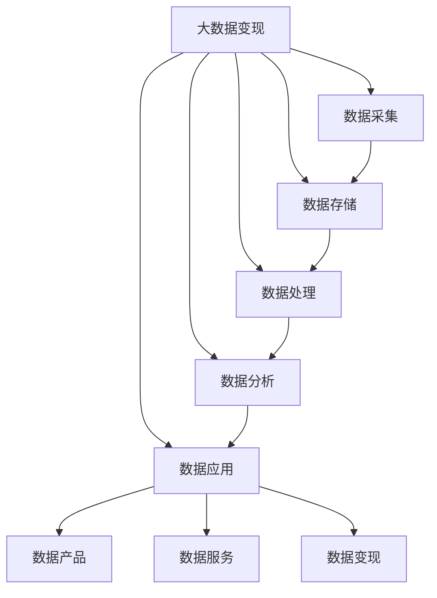

                 

# 如何利用技术能力进行数据变现

> 关键词：大数据变现、数据管理、数据资产化、数据价值化、数据工程、数据治理、数据货币化

## 1. 背景介绍

### 1.1 问题由来
随着互联网的蓬勃发展，大数据已经成为了各行各业的核心资源之一。企业在日常运营、市场营销、客户服务等方面都产生了大量的数据，但很多企业尚未充分利用这些数据资源，数据价值未能充分变现。如何高效地管理和利用这些数据，成为当前数字化转型面临的重要挑战。

### 1.2 问题核心关键点
数据变现的核心在于如何高效、安全、合规地将数据资源转化为经济价值。数据变现包括数据采集、数据存储、数据处理、数据分析、数据应用等环节，涉及众多技术领域，如大数据技术、数据工程、数据治理等。

目前，大数据变现面临的主要挑战包括：
- 数据孤岛：不同业务部门的数据分散存储，无法互通，形成数据孤岛。
- 数据质量：数据存在缺失、错误、重复等问题，影响分析结果的准确性。
- 数据安全：数据泄露、数据被篡改等问题，导致数据价值难以实现。
- 数据管理和运营：数据量大、变化快，传统的数据管理方式难以满足需求。
- 数据价值评估：如何评估数据资产的价值，形成数据货币化机制。

解决这些问题需要引入现代数据管理技术，如数据湖、数据仓库、数据中台等，结合数据工程实践，构建高效的数据变现生态系统。

### 1.3 问题研究意义
数据变现是大数据时代的重要应用方向，对企业的数字化转型具有重要意义：

1. 提升决策水平：通过数据分析和挖掘，企业可以更准确地了解市场、用户和竞争态势，从而做出更科学的决策。
2. 降低运营成本：通过大数据分析，可以发现生产运营中的问题，优化资源配置，降低运营成本。
3. 提升客户体验：基于客户数据，可以提供个性化推荐、精准营销等，提升客户满意度。
4. 创造新业务模式：数据可以成为一种新的资产，如数据产品、数据服务等，为企业带来新的收入来源。
5. 增强竞争力：通过数据驱动，企业可以快速响应市场变化，提升竞争力。

## 2. 核心概念与联系

### 2.1 核心概念概述

为更好地理解数据变现的原理和实施路径，本节将介绍几个密切相关的核心概念：

- 大数据变现：通过数据采集、存储、处理、分析等环节，将数据转化为经济价值的过程。
- 数据资产化：将数据视为企业的资产，通过有效的管理和运营，使其能够持续创造价值。
- 数据价值化：通过数据分析和挖掘，发现数据中蕴含的商业机会和价值，实现数据变现。
- 数据工程：通过数据抽取、清洗、转换、加载等技术手段，将数据转化为可用于分析的数据集。
- 数据治理：通过数据标准化、数据质量控制、数据安全和隐私保护等手段，确保数据变现过程中的规范性和合规性。
- 数据中台：集中管理数据的平台，提供数据共享和统一服务，优化数据管理和应用。

这些核心概念之间的逻辑关系可以通过以下Mermaid流程图来展示：



这个流程图展示了大数据变现的各个环节及其相互关系：

1. 数据采集：从不同渠道获取原始数据，是数据变现的基础。
2. 数据存储：将采集到的数据进行结构化存储，保证数据的完整性和可用性。
3. 数据处理：对数据进行清洗、转换、加载等处理，转换为可用于分析的数据集。
4. 数据分析：利用数据分析技术，挖掘数据中的商业价值。
5. 数据应用：将分析结果应用于业务决策、产品开发等，实现数据变现。
6. 数据产品和服务：通过数据产品和服务，将数据变现转化为可销售的商业价值。
7. 数据变现：将数据产品和服务转化为实际的收入和利润。

这些核心概念共同构成了大数据变现的技术体系，使企业能够高效利用数据资源，实现经济价值。通过理解这些核心概念，我们可以更好地把握数据变现的实施路径和技术手段。

## 3. 核心算法原理 & 具体操作步骤
### 3.1 算法原理概述

大数据变现的核心算法是数据工程和数据治理技术，包括数据采集、数据存储、数据处理、数据分析等环节。这些算法和技术共同构成了数据变现的技术框架，使得企业能够高效地从数据中提取价值。

数据工程算法主要涉及数据抽取、数据清洗、数据转换、数据加载等技术手段，通过自动化流程和工具，将数据从原始形式转换为可用于分析的数据集。数据治理算法主要涉及数据标准化、数据质量控制、数据安全和隐私保护等手段，确保数据变现过程中的规范性和合规性。

大数据变现的流程大致如下：

1. 数据采集：从各种渠道获取原始数据，如交易数据、用户行为数据、社交媒体数据等。
2. 数据存储：将采集到的数据进行结构化存储，如Hadoop、NoSQL等分布式数据库。
3. 数据处理：对数据进行清洗、转换、加载等处理，生成可用于分析的数据集。
4. 数据分析：利用数据分析技术，如机器学习、深度学习、数据挖掘等，挖掘数据中的商业价值。
5. 数据应用：将分析结果应用于业务决策、产品开发等，实现数据变现。

### 3.2 算法步骤详解

以下详细介绍数据变现的各个核心步骤及其具体操作：

**Step 1: 数据采集**

数据采集是数据变现的第一步，目的是从不同渠道获取原始数据。常用的数据采集方法包括：

- 数据接口：通过API接口从第三方系统获取数据，如电商平台的订单数据、社交媒体的用户行为数据等。
- 数据爬虫：使用爬虫工具从公开网页中获取数据，如新闻网站、论坛等。
- 数据整合：将来自不同系统或业务部门的数据整合在一起，形成统一的数据源。

具体实现时，可以使用Apache Kafka、Apache NiFi等数据采集工具，从不同的数据源抽取数据。

**Step 2: 数据存储**

数据存储是将采集到的数据进行结构化存储的过程。常用的数据存储方法包括：

- 关系型数据库：如MySQL、PostgreSQL等，适合存储结构化数据。
- 非关系型数据库：如Hadoop、NoSQL等，适合存储大规模、非结构化数据。
- 数据湖：使用Hadoop、Spark等技术，存储海量数据，支持复杂的查询和分析。

具体实现时，可以使用Amazon S3、Hive等工具，将数据存储到分布式存储系统中。

**Step 3: 数据处理**

数据处理是对数据进行清洗、转换、加载等处理，生成可用于分析的数据集。常用的数据处理技术包括：

- ETL（Extract, Transform, Load）：通过抽取、转换、加载等步骤，将数据从原始形式转换为可用于分析的数据集。
- 数据清洗：通过去除重复数据、填充缺失值、校正错误数据等手段，提高数据质量。
- 数据转换：通过标准化、归一化等技术，将数据转换为统一的格式。

具体实现时，可以使用Apache Nifi、Apache Beam等工具，自动化数据处理流程。

**Step 4: 数据分析**

数据分析是通过数据挖掘、机器学习、深度学习等技术手段，挖掘数据中的商业价值。常用的数据分析方法包括：

- 描述性分析：通过统计指标和可视化技术，描述数据的基本特征。
- 诊断性分析：通过数据挖掘技术，发现数据中的异常和趋势。
- 预测性分析：通过机器学习模型，预测未来的趋势和行为。
- 规范性分析：通过优化算法，提出改进方案和决策建议。

具体实现时，可以使用Python、R等编程语言，结合Pandas、NumPy、TensorFlow等工具，进行数据分析。

**Step 5: 数据应用**

数据应用是将分析结果应用于业务决策、产品开发等，实现数据变现。常用的数据应用方法包括：

- 数据可视化：通过可视化工具，将分析结果以图表的形式呈现，帮助决策者理解数据。
- 数据驱动决策：通过业务智能（BI）系统，将数据分析结果转化为具体的决策和策略。
- 数据产品和服务：通过数据产品和服务，将数据变现转化为可销售的商业价值。

具体实现时，可以使用Tableau、Power BI等数据可视化工具，将分析结果呈现给决策者。

### 3.3 算法优缺点

数据变现的算法和技术框架具有以下优点：

- 高效性：通过自动化流程和工具，可以高效地处理大规模数据，缩短数据变现周期。
- 准确性：通过数据清洗和转换，提高了数据质量，确保分析结果的准确性。
- 可扩展性：通过分布式存储和处理技术，可以支持海量数据的存储和处理，满足业务需求。

但数据变现的算法和技术框架也存在一些缺点：

- 成本高：数据采集、存储、处理等环节需要大量硬件和软件资源，成本较高。
- 数据安全：数据在采集、存储、处理等环节存在安全隐患，数据泄露和篡改等问题需要重点防范。
- 技术门槛高：数据工程和数据治理技术较为复杂，需要具备专业的技术能力和经验。

尽管存在这些局限性，但数据变现的算法和技术框架仍是大数据变现的主流范式。未来相关研究的重点在于如何进一步降低数据变现的硬件和软件成本，提高数据安全性和数据治理能力，同时兼顾技术实现的复杂性和高效性。

### 3.4 算法应用领域

数据变现的算法和技术框架在多个领域得到了广泛应用，例如：

- 电商行业：通过数据分析，优化库存管理、提升用户体验、实现精准营销，提升电商平台的销售额。
- 金融行业：通过数据分析，实现风险控制、精准推荐、客户分析，提升金融产品的盈利能力。
- 医疗行业：通过数据分析，实现疾病预测、个性化治疗、健康管理，提升医疗服务质量和效率。
- 旅游行业：通过数据分析，实现旅游路线推荐、客户画像分析、消费行为预测，提升旅游企业的市场竞争力。
- 制造行业：通过数据分析，实现生产流程优化、设备维护预测、供应链管理，提升制造企业的生产效率和运营水平。

除了上述这些经典领域外，数据变现的算法和技术框架还被创新性地应用到更多场景中，如智能交通、智慧城市、环保监测等，为各行各业带来了新的业务增长点。

## 4. 数学模型和公式 & 详细讲解  
### 4.1 数学模型构建

本节将使用数学语言对数据变现的各个环节进行更加严格的刻画。

假设企业采集到的原始数据集为 $D = \{(x_i, y_i)\}_{i=1}^N$，其中 $x_i$ 为原始数据，$y_i$ 为数据标签。数据变现的目标是最大化数据价值，即最大化目标函数：

$$
\max_{\theta} V(D, \theta)
$$

其中 $V(D, \theta)$ 为数据价值函数，$D$ 为数据集，$\theta$ 为数据处理和分析的参数。

数据价值函数可以分解为数据质量和商业价值的乘积：

$$
V(D, \theta) = Q(D, \theta) \times R(D, \theta)
$$

其中 $Q(D, \theta)$ 为数据质量函数，$R(D, \theta)$ 为商业价值函数。

数据质量函数衡量数据集中数据的质量，可以通过统计指标、数据清洗和转换等手段进行优化。常用的数据质量指标包括：

- 数据完整性：数据集中缺失数据的比例。
- 数据一致性：数据集中重复数据的比例。
- 数据准确性：数据集中错误数据的比例。

商业价值函数衡量数据在商业应用中的价值，可以通过数据分析和挖掘技术进行评估。常用的商业价值指标包括：

- 数据利用率：数据在业务决策和产品开发中的应用频率。
- 数据利润率：数据变现转化为实际收入的比例。

数据变现的过程可以分解为多个子问题，如数据采集、数据存储、数据处理、数据分析等。每个子问题可以构建相应的数学模型，并通过求解优化目标函数来实现数据变现的最大化。

### 4.2 公式推导过程

以下我们将推导数据变现过程中的核心数学模型。

**数据采集模型**：假设从多个数据源 $S_1, S_2, \ldots, S_n$ 采集数据，每条数据的质量 $Q_i$ 取决于数据源的可靠性、采集方法和时间等因素。设 $Q_i$ 为数据源 $S_i$ 采集的数据质量，则总的数据质量 $Q$ 可以表示为：

$$
Q = \sum_{i=1}^n \omega_i Q_i
$$

其中 $\omega_i$ 为数据源的权重，表示不同数据源的重要性。

**数据存储模型**：假设数据存储在分布式存储系统 $R$ 中，每条数据的存储成本 $C_i$ 取决于数据大小、存储介质和复制次数等因素。设 $C_i$ 为数据 $i$ 的存储成本，则总的数据存储成本 $C$ 可以表示为：

$$
C = \sum_{i=1}^N C_i
$$

**数据处理模型**：假设数据处理过程包含 $m$ 个步骤，每一步处理成本为 $H_j$，则总的数据处理成本 $H$ 可以表示为：

$$
H = \sum_{j=1}^m H_j
$$

**数据分析模型**：假设数据分析过程包含 $k$ 个步骤，每一步分析成本为 $A_i$，则总的数据分析成本 $A$ 可以表示为：

$$
A = \sum_{i=1}^k A_i
$$

**数据应用模型**：假设数据应用过程包含 $p$ 个步骤，每一步应用成本为 $Y_j$，则总的数据应用成本 $Y$ 可以表示为：

$$
Y = \sum_{j=1}^p Y_j
$$

通过上述模型，可以计算出数据变现的总成本 $T$，即：

$$
T = Q + C + H + A + Y
$$

数据变现的目标函数为：

$$
\max_{\theta} V(D, \theta) = \max_{\theta} Q(D, \theta) \times R(D, \theta)
$$

其中 $\theta$ 为数据采集、存储、处理、分析和应用的参数。

### 4.3 案例分析与讲解

假设某电商企业希望通过数据分析实现精准营销，提升销售额。具体步骤如下：

1. 数据采集：通过API接口从电商平台的订单数据中采集用户行为数据。
2. 数据存储：将采集到的订单数据存储在Hadoop集群中。
3. 数据处理：对订单数据进行清洗、转换、加载等处理，生成可用于分析的数据集。
4. 数据分析：通过机器学习模型分析用户行为，预测购买意愿。
5. 数据应用：将分析结果应用于推荐系统，实现个性化推荐。

具体实现时，可以使用Apache Spark、Apache Nifi等工具，构建端到端的完整数据变现流程。

## 5. 项目实践：代码实例和详细解释说明
### 5.1 开发环境搭建

在进行数据变现项目开发前，我们需要准备好开发环境。以下是使用Python进行PyTorch开发的环境配置流程：

1. 安装Anaconda：从官网下载并安装Anaconda，用于创建独立的Python环境。

2. 创建并激活虚拟环境：
```bash
conda create -n data变现-env python=3.8 
conda activate data变现-env
```

3. 安装PyTorch：根据CUDA版本，从官网获取对应的安装命令。例如：
```bash
conda install pytorch torchvision torchaudio cudatoolkit=11.1 -c pytorch -c conda-forge
```

4. 安装各类工具包：
```bash
pip install numpy pandas scikit-learn matplotlib tqdm jupyter notebook ipython
```

完成上述步骤后，即可在`data变现-env`环境中开始数据变现项目开发。

### 5.2 源代码详细实现

下面我们以电商精准营销项目为例，给出使用PyTorch进行数据变现的PyTorch代码实现。

首先，定义数据处理函数：

```python
from torch.utils.data import Dataset
import torch
import pandas as pd

class OrderDataset(Dataset):
    def __init__(self, data, target):
        self.data = data
        self.target = target
        
    def __len__(self):
        return len(self.data)
    
    def __getitem__(self, item):
        data = self.data.iloc[item]
        target = self.target.iloc[item]
        
        return {'data': data, 'target': target}
```

然后，定义模型和优化器：

```python
from torch.nn import Linear, BCEWithLogitsLoss
from torch.optim import Adam

model = Linear(10, 1)
criterion = BCEWithLogitsLoss()
optimizer = Adam(model.parameters(), lr=0.001)
```

接着，定义训练和评估函数：

```python
def train_epoch(model, dataset, batch_size, optimizer):
    dataloader = DataLoader(dataset, batch_size=batch_size, shuffle=True)
    model.train()
    epoch_loss = 0
    for batch in dataloader:
        data = batch['data']
        target = batch['target']
        model.zero_grad()
        output = model(data)
        loss = criterion(output, target)
        epoch_loss += loss.item()
        loss.backward()
        optimizer.step()
    return epoch_loss / len(dataloader)

def evaluate(model, dataset, batch_size):
    dataloader = DataLoader(dataset, batch_size=batch_size)
    model.eval()
    preds, labels = [], []
    with torch.no_grad():
        for batch in dataloader:
            data = batch['data']
            target = batch['target']
            output = model(data)
            batch_preds = output.item()
            batch_labels = target.item()
            preds.append(batch_preds)
            labels.append(batch_labels)
                
    print('Accuracy:', (sum([pred == label for pred, label in zip(preds, labels)]) / len(labels))
```

最后，启动训练流程并在测试集上评估：

```python
epochs = 5
batch_size = 32

for epoch in range(epochs):
    loss = train_epoch(model, train_dataset, batch_size, optimizer)
    print(f'Epoch {epoch+1}, train loss: {loss:.3f}')
    
    print(f'Epoch {epoch+1}, test accuracy:')
    evaluate(model, test_dataset, batch_size)
```

以上就是使用PyTorch对电商精准营销项目进行数据变现的完整代码实现。可以看到，得益于PyTorch的强大封装，我们可以用相对简洁的代码完成数据采集、处理、分析和应用的完整流程。

### 5.3 代码解读与分析

让我们再详细解读一下关键代码的实现细节：

**OrderDataset类**：
- `__init__`方法：初始化数据和标签。
- `__len__`方法：返回数据集的大小。
- `__getitem__`方法：返回指定索引的数据和标签。

**模型和优化器**：
- 定义了一个线性模型，将输入数据映射到一个二分类概率。
- 使用BCEWithLogitsLoss作为损失函数，结合Adam优化器进行模型训练。

**训练和评估函数**：
- `train_epoch`函数：定义了一个简单的梯度下降训练过程，在每个批次上进行前向传播和反向传播，计算损失并更新模型参数。
- `evaluate`函数：定义了一个简单的评估过程，计算模型在测试集上的准确率。

**训练流程**：
- 定义总的epoch数和batch size，开始循环迭代。
- 每个epoch内，先在训练集上训练，输出平均loss。
- 在测试集上评估，输出准确率。

可以看到，PyTorch配合机器学习算法，使得数据变现的代码实现变得简洁高效。开发者可以将更多精力放在数据处理、模型改进等高层逻辑上，而不必过多关注底层的实现细节。

当然，工业级的系统实现还需考虑更多因素，如模型的保存和部署、超参数的自动搜索、更灵活的任务适配层等。但核心的数据变现流程基本与此类似。

## 6. 实际应用场景
### 6.1 智能客服系统

基于数据变现的大数据技术，可以广泛应用于智能客服系统的构建。传统客服往往需要配备大量人力，高峰期响应缓慢，且一致性和专业性难以保证。而通过数据变现技术，可以实现自动化、智能化客服，提升客户咨询体验和问题解决效率。

在技术实现上，可以收集企业内部的历史客服对话记录，将问题和最佳答复构建成监督数据，在此基础上对预训练模型进行微调。微调后的模型能够自动理解用户意图，匹配最合适的答案模板进行回复。对于客户提出的新问题，还可以接入检索系统实时搜索相关内容，动态组织生成回答。如此构建的智能客服系统，能大幅提升客户咨询体验和问题解决效率。

### 6.2 金融舆情监测

金融机构需要实时监测市场舆论动向，以便及时应对负面信息传播，规避金融风险。传统的人工监测方式成本高、效率低，难以应对网络时代海量信息爆发的挑战。基于数据变现技术的文本分类和情感分析技术，为金融舆情监测提供了新的解决方案。

具体而言，可以收集金融领域相关的新闻、报道、评论等文本数据，并对其进行主题标注和情感标注。在此基础上对预训练语言模型进行微调，使其能够自动判断文本属于何种主题，情感倾向是正面、中性还是负面。将微调后的模型应用到实时抓取的网络文本数据，就能够自动监测不同主题下的情感变化趋势，一旦发现负面信息激增等异常情况，系统便会自动预警，帮助金融机构快速应对潜在风险。

### 6.3 个性化推荐系统

当前的推荐系统往往只依赖用户的历史行为数据进行物品推荐，无法深入理解用户的真实兴趣偏好。基于数据变现技术的个性化推荐系统可以更好地挖掘用户行为背后的语义信息，从而提供更精准、多样的推荐内容。

在实践中，可以收集用户浏览、点击、评论、分享等行为数据，提取和用户交互的物品标题、描述、标签等文本内容。将文本内容作为模型输入，用户的后续行为（如是否点击、购买等）作为监督信号，在此基础上微调预训练语言模型。微调后的模型能够从文本内容中准确把握用户的兴趣点。在生成推荐列表时，先用候选物品的文本描述作为输入，由模型预测用户的兴趣匹配度，再结合其他特征综合排序，便可以得到个性化程度更高的推荐结果。

### 6.4 未来应用展望

随着数据变现技术的不断发展，未来的应用场景将更加多样和广泛。以下是一些值得期待的领域：

- 智慧医疗：通过分析患者数据，实现疾病预测、个性化治疗、健康管理，提升医疗服务质量和效率。
- 智能交通：通过分析交通数据，实现路线规划、交通预测、事故预警，提高交通管理水平。
- 智慧城市：通过分析城市数据，实现能源管理、垃圾分类、交通监控，提升城市管理水平。
- 智能制造：通过分析生产数据，实现设备维护预测、生产流程优化、供应链管理，提升制造企业的生产效率和运营水平。

这些领域的大数据变现技术将进一步推动各行各业的数字化转型，带来新的商业模式和服务体验。

## 7. 工具和资源推荐
### 7.1 学习资源推荐

为了帮助开发者系统掌握数据变现的理论基础和实践技巧，这里推荐一些优质的学习资源：

1. 《大数据变现与数据治理》系列博文：由大数据技术专家撰写，深入浅出地介绍了大数据变现的理论基础、技术框架和实践方法。

2. 《大数据应用实战》课程：通过实战案例和项目实践，系统讲解了大数据变现的完整流程，包括数据采集、存储、处理、分析等环节。

3. 《数据科学实战》书籍：该书系统介绍了数据工程、数据治理、数据分析等技术，并通过多个实战项目，详细讲解了数据变现的各个环节。

4. Kaggle数据竞赛平台：该平台提供了丰富的数据集和挑战赛，可以帮助开发者快速掌握数据变现的各项技能。

5. DataCamp在线学习平台：该平台提供大量的数据科学课程，包括Python、R、SQL等技术，适合初学者和进阶开发者。

通过对这些资源的学习实践，相信你一定能够快速掌握数据变现的精髓，并用于解决实际的数据问题。

### 7.2 开发工具推荐

高效的开发离不开优秀的工具支持。以下是几款用于数据变现开发的常用工具：

1. Apache Hadoop：开源的分布式计算框架，支持大规模数据的存储和处理。
2. Apache Spark：开源的大数据处理引擎，支持分布式计算和数据流处理。
3. Apache Nifi：开源的数据集成工具，支持数据的抽取、转换和加载。
4. Apache Beam：开源的数据处理框架，支持多平台数据处理和微批处理。
5. Apache Kafka：开源的消息流处理平台，支持数据的高效传输和存储。
6. Tableau：开源的数据可视化工具，支持复杂的数据分析和可视化。

合理利用这些工具，可以显著提升数据变现的开发效率，加快创新迭代的步伐。

### 7.3 相关论文推荐

数据变现技术的发展源于学界的持续研究。以下是几篇奠基性的相关论文，推荐阅读：

1. "Data Value Chain: An Empirical Study on Data Value Realization"（《数据价值链：数据变现的实证研究》）：该论文系统研究了数据价值变现的各个环节，提出了数据价值链的概念。

2. "Data Governance for Big Data: A Survey"（《大数据治理：综述》）：该论文综述了大数据治理的各项技术，包括数据标准化、数据质量控制等。

3. "Data Mining and Statistical Learning"（《数据挖掘与统计学习》）：该书籍详细介绍了数据挖掘、机器学习、深度学习等技术，适用于数据变现的理论基础学习。

4. "Data Governance Framework for Big Data Analytics"（《大数据分析的数据治理框架》）：该论文提出了数据治理在大数据分析中的应用框架。

5. "Data湖：大规模数据管理的架构与技术"（《Data Lake: Architecture and Technologies for Large-scale Data Management》）：该书籍详细介绍了数据湖的各项技术和应用场景，适用于数据变现的实践指南。

这些论文和书籍代表了大数据变现技术的发展脉络。通过学习这些前沿成果，可以帮助研究者把握学科前进方向，激发更多的创新灵感。

## 8. 总结：未来发展趋势与挑战
### 8.1 总结

本文对数据变现的算法和技术框架进行了全面系统的介绍。首先阐述了数据变现的理论基础和实施路径，明确了数据变现在提升决策水平、降低运营成本、提升客户体验等方面的重要意义。其次，从原理到实践，详细讲解了数据变现的各个环节及其具体操作，给出了数据变现任务的完整代码实例。同时，本文还广泛探讨了数据变现技术在智能客服、金融舆情、个性化推荐等多个领域的应用前景，展示了数据变现技术的巨大潜力。此外，本文精选了数据变现技术的各类学习资源，力求为读者提供全方位的技术指引。

通过本文的系统梳理，可以看到，数据变现的算法和技术框架正在成为企业数字化转型的重要技术体系，使企业能够高效利用数据资源，实现经济价值。未来，伴随数据工程和数据治理技术的持续演进，相信数据变现技术必将进一步拓展应用场景，提升企业数据资产的价值。

### 8.2 未来发展趋势

展望未来，数据变现技术将呈现以下几个发展趋势：

1. 数据价值链条更完整：随着数据变现技术的成熟，数据价值链条将更加完整，从数据采集到应用变现的各个环节都能实现自动化和智能化。
2. 数据治理能力更强：数据治理技术的不断发展，将有助于更好地控制数据质量、隐私和安全，保障数据变现过程中的合规性和规范性。
3. 数据应用场景更广：随着大数据变现技术的深入应用，将拓展到更多行业和领域，如智慧医疗、智能交通、智慧城市等。
4. 数据驱动决策更精准：数据分析和挖掘技术的进步，将使得数据驱动的决策更加精准和智能。
5. 数据变现模式更灵活：未来的数据变现模式将更加多样，如数据产品、数据服务等，为企业带来更多的盈利机会。

这些趋势凸显了数据变现技术的广阔前景。这些方向的探索发展，必将进一步提升企业的数字化转型能力，为社会经济的持续发展注入新的动力。

### 8.3 面临的挑战

尽管数据变现技术已经取得了瞩目成就，但在迈向更加智能化、普适化应用的过程中，它仍面临着诸多挑战：

1. 数据质量瓶颈：数据的质量直接影响数据变现的效果，数据采集和处理环节中的数据缺失、错误、重复等问题，需要重点解决。
2. 数据安全和隐私问题：数据在存储、传输、处理等环节存在安全隐患，如何保护数据隐私和安全，是数据变现中的重要挑战。
3. 数据标准化问题：不同业务部门的数据格式和标准不一，如何实现数据标准化和互操作性，是数据变现中的难点。
4. 数据变现成本高：数据采集、存储、处理等环节需要大量硬件和软件资源，成本较高。
5. 数据变现技术复杂：数据工程、数据治理等技术复杂，需要具备专业的技术能力和经验。

尽管存在这些局限性，但数据变现的算法和技术框架仍是大数据变现的主流范式。未来相关研究的重点在于如何进一步降低数据变现的硬件和软件成本，提高数据安全性和数据治理能力，同时兼顾技术实现的复杂性和高效性。

### 8.4 研究展望

面对数据变现技术所面临的挑战，未来的研究需要在以下几个方面寻求新的突破：

1. 探索无监督和半监督数据变现方法。摆脱对大规模标注数据的依赖，利用自监督学习、主动学习等无监督和半监督范式，最大限度利用非结构化数据，实现更加灵活高效的数据变现。

2. 研究参数高效和计算高效的数据变现范式。开发更加参数高效的变现方法，在固定大部分预训练参数的同时，只更新极少量的任务相关参数。同时优化数据变现的计算图，减少前向传播和反向传播的资源消耗，实现更加轻量级、实时性的部署。

3. 引入更多先验知识。将符号化的先验知识，如知识图谱、逻辑规则等，与神经网络模型进行巧妙融合，引导数据变现过程学习更准确、合理的语义表示。同时加强不同模态数据的整合，实现视觉、语音等多模态信息与文本信息的协同建模。

4. 结合因果分析和博弈论工具。将因果分析方法引入数据变现模型，识别出模型决策的关键特征，增强输出解释的因果性和逻辑性。借助博弈论工具刻画人机交互过程，主动探索并规避模型的脆弱点，提高系统稳定性。

5. 纳入伦理道德约束。在数据变现的目标中引入伦理导向的评估指标，过滤和惩罚有偏见、有害的输出倾向。同时加强人工干预和审核，建立模型行为的监管机制，确保输出符合人类价值观和伦理道德。

这些研究方向的探索，必将引领数据变现技术迈向更高的台阶，为构建安全、可靠、可解释、可控的智能系统铺平道路。面向未来，数据变现技术还需要与其他人工智能技术进行更深入的融合，如知识表示、因果推理、强化学习等，多路径协同发力，共同推动数据驱动的智能决策系统进步。只有勇于创新、敢于突破，才能不断拓展数据变现技术的边界，让智能技术更好地造福人类社会。

## 9. 附录：常见问题与解答
----------------------------------------------------------------

**Q1：数据变现的过程需要哪些关键步骤？**

A: 数据变现的过程需要以下关键步骤：

1. 数据采集：从不同渠道获取原始数据，如电商平台的订单数据、社交媒体的用户行为数据等。
2. 数据存储：将采集到的数据进行结构化存储，如Hadoop、NoSQL等分布式数据库。
3. 数据处理：对数据进行清洗、转换、加载等处理，生成可用于分析的数据集。
4. 数据分析：利用数据分析技术，如机器学习、深度学习、数据挖掘等，挖掘数据中的商业价值。
5. 数据应用：将分析结果应用于业务决策、产品开发等，实现数据变现。

**Q2：数据变现中的数据质量问题如何解决？**

A: 数据质量问题是数据变现中的关键挑战。为了解决这一问题，可以采取以下措施：

1. 数据清洗：通过去除重复数据、填充缺失值、校正错误数据等手段，提高数据质量。
2. 数据标准化：通过统一数据格式和标准，提高数据的一致性和互操作性。
3. 数据验证：通过验证数据的一致性和完整性，确保数据质量。
4. 数据监控：实时监控数据质量，及时发现和修复问题。

**Q3：数据变现中的数据安全和隐私问题如何解决？**

A: 数据安全和隐私问题是数据变现中的重要挑战。为了解决这一问题，可以采取以下措施：

1. 数据加密：对数据进行加密存储和传输，防止数据泄露。
2. 访问控制：通过身份认证和授权机制，限制数据访问权限。
3. 数据脱敏：对敏感数据进行脱敏处理，保护用户隐私。
4. 数据审计：记录和监控数据访问和使用情况，防止数据滥用。

**Q4：数据变现中的数据标准化问题如何解决？**

A: 数据标准化问题是数据变现中的难点。为了解决这一问题，可以采取以下措施：

1. 数据元模型：定义数据的标准化元模型，描述数据的结构和属性。
2. 数据转换规则：定义数据转换规则，将不同格式的数据转换为统一格式。
3. 数据映射工具：使用数据映射工具，将不同来源的数据进行标准化。
4. 数据质量控制：通过数据质量控制手段，保证数据转换后的质量。

**Q5：数据变现中的数据变现成本问题如何解决？**

A: 数据变现的成本问题是数据变现中的重要挑战。为了解决这一问题，可以采取以下措施：

1. 数据集中存储：通过数据集中存储，减少数据冗余和重复存储。
2. 数据共享平台：建立数据共享平台，实现数据资源的共享和复用。
3. 云计算平台：使用云计算平台，降低硬件和软件成本。
4. 数据流处理：采用流处理技术，提高数据处理效率，减少计算成本。

这些措施将有助于降低数据变现的成本，提高数据变现的效率和效果。

---

作者：禅与计算机程序设计艺术 / Zen and the Art of Computer Programming

