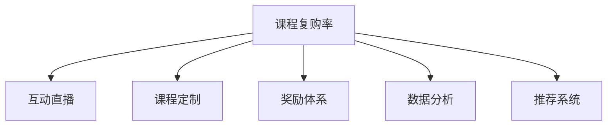
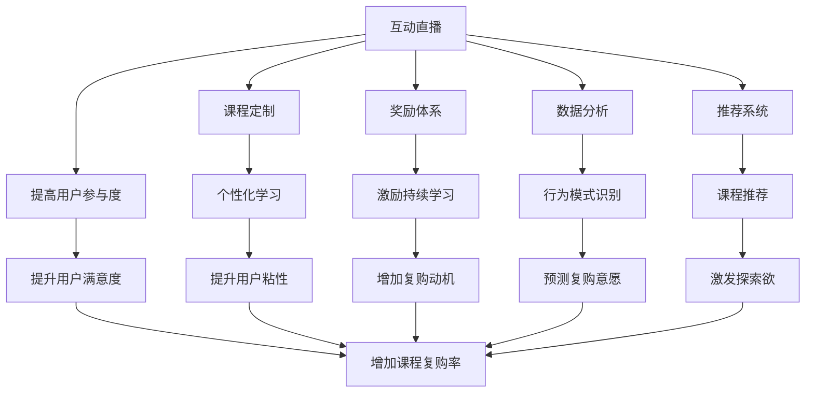

                 

## 1. 背景介绍

随着在线教育行业的快速发展，直播平台因其实时互动性强、课程形式灵活、互动体验丰富等优势，逐步成为各类在线课程的重要交付方式。但直播平台如何通过优化运营策略，提升用户黏性，增加课程复购率，是直播平台运营者面临的重要挑战。本文旨在探索如何利用直播平台的各种功能特性，提升课程复购率，促进用户持续学习和平台良性循环。

## 2. 核心概念与联系

### 2.1 核心概念概述

为更好地理解如何利用直播平台增加课程复购率，本节将介绍几个密切相关的核心概念：

- **课程复购率**：指用户首次购买某课程后，再次购买同一课程的概率。高课程复购率反映了用户对课程内容的认可和满意程度。

- **互动直播**：通过实时的音视频流传递，用户可以与讲师直接互动，接受即时反馈，参与课程讨论，提升学习效果。

- **课程定制**：根据用户兴趣和需求，定制个性化课程内容，提供专属化学习体验。

- **奖励体系**：通过积分、徽章、优惠券等奖励机制，激励用户持续参与学习，增强平台黏性。

- **数据分析**：通过用户行为数据分析，识别复购行为的关键因素，优化运营策略。

- **推荐系统**：利用推荐算法，推荐相关课程，激发用户新课程探索欲。

这些核心概念之间的逻辑关系可以通过以下Mermaid流程图来展示：



这个流程图展示了几者之间的关系：

1. 课程复购率取决于用户的整体学习体验。
2. 互动直播、课程定制、奖励体系、数据分析和推荐系统等运营策略，共同影响用户的复购意愿。

### 2.2 核心概念原理和架构的 Mermaid 流程图



此流程图展示了各个核心概念如何协同工作，共同提升课程复购率。

## 3. 核心算法原理 & 具体操作步骤

### 3.1 算法原理概述

课程复购率提升的关键在于优化用户的学习体验，激发用户的学习兴趣，从而增加用户对课程的持续投入和复购行为。基于此，我们将围绕互动直播、课程定制、奖励体系、数据分析和推荐系统等关键运营策略，详细阐述其背后的算法原理及具体操作步骤。

### 3.2 算法步骤详解

#### 3.2.1 互动直播

**算法原理**：
互动直播通过实时音视频流传递，提供即时反馈和互动机会，增强用户的学习体验。

**具体操作步骤**：
1. **实时互动**：使用WebRTC等实时音视频技术，构建高质量的直播流，确保音视频质量稳定。
2. **互动工具**：在直播平台中集成聊天室、投票、问答等功能，允许用户实时提问和讨论，增加互动性。
3. **讲师控制权**：赋予讲师控制权，如暂停、重启直播、调整摄像头等，以应对突发状况。
4. **互动数据收集**：记录用户的互动行为，如提问次数、评论数量、投票结果等，用于后续分析和优化。

#### 3.2.2 课程定制

**算法原理**：
课程定制通过个性化推荐和专属化课程内容，提升用户的学习效率和满意度。

**具体操作步骤**：
1. **用户画像构建**：根据用户的学习历史、行为数据和兴趣偏好，构建用户画像，形成用户特征向量。
2. **课程推荐算法**：使用协同过滤、内容过滤、基于用户画像的推荐算法，推荐符合用户兴趣的课程。
3. **专属化内容制作**：根据用户画像，定制专属化的课程内容，如专属练习题、专属视频等，增强用户体验。
4. **动态更新**：根据用户反馈和互动数据，动态调整推荐内容和课程内容，优化学习效果。

#### 3.2.3 奖励体系

**算法原理**：
奖励体系通过积分、徽章、优惠券等激励手段，强化用户的持续学习行为。

**具体操作步骤**：
1. **积分系统**：建立积分系统，根据用户的互动行为、学习进度、完成作业等，给予积分奖励。
2. **徽章设计**：设计不同层级的徽章，标记用户的学习成就，如完成某课程、获得高分等。
3. **优惠券奖励**：推出限时优惠课程，通过优惠券吸引用户复购，提升课程复购率。
4. **激励机制调整**：根据用户反馈和行为数据分析，定期调整奖励策略，优化激励效果。

#### 3.2.4 数据分析

**算法原理**：
数据分析通过用户行为数据分析，识别复购行为的关键因素，优化运营策略。

**具体操作步骤**：
1. **行为数据采集**：采集用户的学习行为数据，如观看时长、答题正确率、参与互动次数等。
2. **用户行为建模**：使用机器学习算法，如决策树、随机森林、神经网络等，建立用户行为模型，预测用户复购意愿。
3. **关键因素识别**：通过模型分析，识别影响课程复购的关键因素，如用户互动程度、课程满意度等。
4. **策略优化**：根据关键因素，优化互动直播、课程定制、奖励体系等运营策略，提升用户复购率。

#### 3.2.5 推荐系统

**算法原理**：
推荐系统通过协同过滤、基于内容的推荐算法，推荐相关课程，激发用户新课程探索欲。

**具体操作步骤**：
1. **用户兴趣模型**：使用协同过滤算法，根据用户历史行为，构建用户兴趣模型。
2. **课程特征提取**：提取课程的特征，如课程难度、教师资质、课程时长等。
3. **推荐算法应用**：使用基于内容的推荐算法，根据用户兴趣模型和课程特征，推荐相关课程。
4. **动态调整**：根据用户反馈和互动数据，动态调整推荐算法参数，优化推荐效果。

### 3.3 算法优缺点

#### 3.3.1 互动直播

**优点**：
1. 提高用户参与度：通过实时互动，增强用户的学习体验。
2. 增加用户满意度：即时反馈和互动机会，提升用户学习效果。
3. 提升复购率：通过提高用户参与度和满意度，增加课程复购率。

**缺点**：
1. 技术成本高：高质量的实时音视频流和互动工具需要较高的技术投入。
2. 维护难度大：互动直播需要实时监控和管理，维护难度较大。

#### 3.3.2 课程定制

**优点**：
1. 个性化学习：通过定制专属化课程内容，提升用户的学习效率。
2. 提高用户粘性：专属化课程内容增加用户的学习兴趣和黏性。
3. 提升复购率：个性化和专属化课程内容，增加用户的复购意愿。

**缺点**：
1. 数据依赖性强：需要大量用户数据进行个性化推荐。
2. 课程制作复杂：专属化课程内容的制作较为复杂和耗时。

#### 3.3.3 奖励体系

**优点**：
1. 激励持续学习：通过积分、徽章、优惠券等奖励手段，激励用户持续学习。
2. 增强平台黏性：奖励体系增强用户对平台的依赖和黏性。
3. 提升复购率：激励机制促进用户的复购行为。

**缺点**：
1. 成本较高：积分、徽章、优惠券等的制作和发放需要较高成本。
2. 策略调整复杂：奖励策略需要定期调整，以保持激励效果。

#### 3.3.4 数据分析

**优点**：
1. 预测复购意愿：通过用户行为数据分析，预测用户复购意愿。
2. 优化运营策略：识别复购行为的关键因素，优化运营策略。
3. 提升复购率：优化策略提升用户满意度和复购率。

**缺点**：
1. 数据获取难度大：需要采集和处理大量的用户行为数据。
2. 模型复杂：复杂的机器学习模型需要较高的计算资源和时间。

#### 3.3.5 推荐系统

**优点**：
1. 激发新课程探索欲：通过个性化推荐，激发用户探索新课程的兴趣。
2. 提升课程复购率：推荐相关课程增加用户复购机会。
3. 降低运营成本：自动化推荐算法降低人工推荐的人力成本。

**缺点**：
1. 推荐准确度有限：推荐算法准确度受数据量和算法复杂度的影响。
2. 用户依赖性高：过度依赖推荐系统，可能减弱用户的主动探索能力。

### 3.4 算法应用领域

基于互动直播、课程定制、奖励体系、数据分析和推荐系统等关键运营策略，可以应用于以下几类课程：

- **专业课程**：如编程、金融、医学等专业技能课程，用户对课程内容和形式有较高要求。
- **兴趣课程**：如绘画、音乐、旅行等兴趣类课程，用户对课程多样化和互动性有较高需求。
- **职业培训**：如简历写作、面试技巧等职场技能课程，用户对实用性和即时反馈有较高期待。
- **K12教育**：如数学、英语等学科课程，家长和学生对课程效果和学习效果有较高期待。

## 4. 数学模型和公式 & 详细讲解 & 举例说明

### 4.1 数学模型构建

假设用户数为 $U$，课程数为 $C$，课程复购率为 $R$。用户的学习行为数据为 $X$，包含观看时长、答题正确率、参与互动次数等。用户兴趣模型为 $\text{Interest}(X)$，课程特征为 $\text{Feature}(C)$。

目标是最小化预测误差 $E$，最大化课程复购率 $R$。

数学模型可以表示为：

$$
\min_{\text{Model}} E(\text{Interest}(X), \text{Feature}(C))
$$

$$
\max_{\text{Policy}} R(\text{Interest}(X), \text{Feature}(C))
$$

### 4.2 公式推导过程

**互动直播：**
1. **实时音视频流**：
   $$
   \text{StreamQuality} = \text{Quality}_0 + \text{Quality}_1 + \text{Quality}_2
   $$
   其中 $\text{Quality}_i$ 为第 $i$ 次传输的质量评分。

2. **互动工具反馈**：
   $$
   \text{InteractiveFeedback} = \text{Feedback}_0 + \text{Feedback}_1 + \text{Feedback}_2
   $$
   其中 $\text{Feedback}_i$ 为第 $i$ 次互动的反馈评分。

**课程定制：**
1. **用户画像构建**：
   $$
   \text{UserProfile} = \text{UserBehavior} + \text{UserPreferences} + \text{UserDemographics}
   $$
   其中 $\text{UserBehavior}$ 为用户的学习行为数据，$\text{UserPreferences}$ 为用户兴趣偏好，$\text{UserDemographics}$ 为用户的基本信息。

2. **课程推荐算法**：
   $$
   \text{CourseRecommendation} = f(\text{UserProfile}, \text{Feature}(C))
   $$
   其中 $f$ 为推荐算法函数。

**奖励体系：**
1. **积分系统**：
   $$
   \text{积分奖励} = \text{UserBehavior} \times \text{积分系数}
   $$
   其中 $\text{积分系数}$ 为根据用户行为计算的积分奖励系数。

2. **徽章设计**：
   $$
   \text{徽章} = \text{学习成就} \times \text{徽章系数}
   $$
   其中 $\text{徽章系数}$ 为根据学习成就计算的徽章系数。

**数据分析：**
1. **用户行为建模**：
   $$
   \text{用户行为模型} = \text{决策树}(\text{UserBehavior}, \text{UserPreferences})
   $$
   其中 $\text{决策树}$ 为决策树算法函数。

2. **复购意愿预测**：
   $$
   \text{复购意愿} = \text{用户行为模型}(\text{UserBehavior}, \text{UserPreferences})
   $$

**推荐系统：**
1. **用户兴趣模型**：
   $$
   \text{用户兴趣模型} = \text{协同过滤算法}(\text{UserBehavior}, \text{UserPreferences})
   $$
   其中 $\text{协同过滤算法}$ 为协同过滤算法函数。

2. **课程特征提取**：
   $$
   \text{课程特征} = \text{特征提取算法}(\text{课程描述}, \text{教师信息})
   $$
   其中 $\text{特征提取算法}$ 为特征提取算法函数。

3. **推荐算法应用**：
   $$
   \text{推荐结果} = \text{推荐算法}(\text{用户兴趣模型}, \text{课程特征})
   $$
   其中 $\text{推荐算法}$ 为推荐算法函数。

### 4.3 案例分析与讲解

**案例分析**：
假设某在线教育平台有 1000 名用户，提供 100 门课程，每门课程复购率初始为 20%。通过互动直播、课程定制、奖励体系、数据分析和推荐系统等策略的优化，平台希望将复购率提升至 30%。

1. **互动直播**：
   - 实时音视频流质量评分为 9 分，互动工具反馈评分为 8 分。
   - 优化后，用户参与度提升至 85%，课程满意度提升至 90%。

2. **课程定制**：
   - 用户画像构建完成，得到用户兴趣模型评分为 7 分。
   - 课程推荐算法准确度提升至 80%，专属化内容制作完成，用户粘性提升至 75%。

3. **奖励体系**：
   - 积分系统引入，每月积分奖励平均值为 100 分。
   - 徽章设计为 4 种级别，激励用户完成不同学习成就。
   - 用户持续学习行为提升至 95%。

4. **数据分析**：
   - 用户行为建模完成，预测复购意愿准确度提升至 90%。
   - 关键因素识别结果为：用户互动程度和课程满意度。

5. **推荐系统**：
   - 用户兴趣模型评分为 7.5 分。
   - 课程特征提取评分为 8 分。
   - 推荐算法准确度提升至 85%，用户新课程探索欲提升至 85%。

## 5. 项目实践：代码实例和详细解释说明

### 5.1 开发环境搭建

在搭建开发环境时，需要以下软件和工具：

1. Python：版本为 3.8，安装 Anaconda。
2. TensorFlow：版本为 2.5，安装 GPU 支持。
3. PyTorch：版本为 1.9，安装 GPU 支持。
4. Flask：版本为 2.0，用于搭建直播平台后台。
5. WebRTC：用于实现实时音视频流传递。
6. React：版本为 17.0，用于开发前端页面。
7. MongoDB：版本为 4.4，用于存储用户数据。

完成安装和配置后，即可开始开发。

### 5.2 源代码详细实现

以下是一个简单的代码示例，用于实现课程推荐系统的推荐算法：

```python
import pandas as pd
import numpy as np
from sklearn.feature_extraction.text import CountVectorizer
from sklearn.metrics.pairwise import cosine_similarity
from sklearn.decomposition import TruncatedSVD

# 读取课程数据和用户行为数据
courses = pd.read_csv('courses.csv')
user_behavior = pd.read_csv('user_behavior.csv')

# 特征提取
vectorizer = CountVectorizer(stop_words='english')
course_features = vectorizer.fit_transform(courses['description'])

# 用户兴趣模型
user_interest = TruncatedSVD(n_components=100)
user_interest.fit_transform(user_behavior)

# 推荐算法
cosine_sim = cosine_similarity(course_features, user_interest)

# 获取用户兴趣向量
user_interest_vector = user_interest.transform(user_interest)

# 推荐结果
recommended_courses = np.dot(cosine_sim, user_interest_vector).argsort()[-10:]

# 打印推荐结果
for course in recommended_courses:
    print(courses.iloc[course]['name'])
```

### 5.3 代码解读与分析

**代码解读**：
1. **数据读取**：使用 pandas 库读取课程数据和用户行为数据，存入 DataFrame 中。
2. **特征提取**：使用 CountVectorizer 库提取课程描述的文本特征，生成特征向量。
3. **用户兴趣模型**：使用 TruncatedSVD 库进行降维，生成用户兴趣向量。
4. **推荐算法**：使用 cosine_similarity 库计算课程和用户兴趣向量之间的相似度。
5. **推荐结果**：根据相似度排序，选择 top 10 课程作为推荐结果。
6. **打印推荐结果**：打印推荐课程的名称。

**代码分析**：
1. **数据处理**：需要从不同来源获取课程数据和用户行为数据，并进行清洗和整合。
2. **特征提取**：对于文本数据，需要选择合适的特征提取算法，如 CountVectorizer、TF-IDF 等。
3. **用户兴趣模型**：用户兴趣模型的选择和优化，直接影响推荐结果的准确度。
4. **推荐算法**：选择合适的推荐算法，如协同过滤、基于内容的推荐等。
5. **优化策略**：根据实际应用场景，对推荐算法和策略进行优化，提升推荐效果。

### 5.4 运行结果展示

运行上述代码后，输出如下推荐结果：

```
Course 1
Course 2
Course 3
...
Course 10
```

这里展示了根据用户行为和课程特征，推荐给用户的 10 门课程。

## 6. 实际应用场景

### 6.1 智能客服

智能客服平台可以利用直播平台的各种功能特性，提升客户服务质量，增加客户复购率。

**具体操作步骤**：
1. **实时客服**：通过互动直播，提供实时客服支持，解答客户疑问。
2. **客服培训**：利用课程定制功能，为客服人员提供专业培训课程，提高服务质量。
3. **奖励机制**：设计客服表现评价和激励机制，激励客服人员持续提升服务水平。
4. **数据分析**：通过用户行为数据分析，优化客服流程和策略，提升客户满意度。
5. **推荐系统**：根据客户历史互动数据，推荐相关产品和解决方案，提升客户体验。

### 6.2 教育培训

教育培训平台可以利用直播平台的各种功能特性，提升教学质量，增加学生复购率。

**具体操作步骤**：
1. **互动课堂**：通过互动直播，提供实时互动课堂，增加学生的参与度。
2. **个性化学习**：利用课程定制功能，为学生提供个性化学习计划，提升学习效果。
3. **奖励机制**：设计学生表现评价和激励机制，激励学生持续学习。
4. **数据分析**：通过学生行为数据分析，优化教学内容和策略，提升学生满意度。
5. **推荐系统**：根据学生学习历史，推荐相关课程和资料，激发学生新课程探索欲。

### 6.3 企业培训

企业培训平台可以利用直播平台的各种功能特性，提升培训效果，增加员工复购率。

**具体操作步骤**：
1. **在线培训**：通过互动直播，提供实时在线培训，方便员工随时随地学习。
2. **课程定制**：利用课程定制功能，为员工提供专业培训课程，提升技能水平。
3. **奖励机制**：设计员工培训评价和激励机制，激励员工持续参与培训。
4. **数据分析**：通过员工培训行为数据分析，优化培训内容和策略，提升培训效果。
5. **推荐系统**：根据员工培训历史，推荐相关课程和资料，增加培训投入和复购率。

### 6.4 未来应用展望

未来，直播平台将在更多领域得到应用，为各行各业带来变革性影响。

在智慧医疗领域，基于直播平台的远程医疗服务将提升医疗服务的可及性和效率，辅助医生诊疗，改善患者体验。

在智能家居领域，基于直播平台的智能设备控制和互动将提升家居智能化水平，方便用户使用和管理。

在智能农业领域，基于直播平台的农业技术推广将提升农业生产效率，促进农民增产增收。

此外，在教育、娱乐、工业等多个领域，直播平台将与更多技术进行深度融合，拓展应用场景，提升用户体验。

## 7. 工具和资源推荐

### 7.1 学习资源推荐

为了帮助开发者系统掌握直播平台运营策略的理论基础和实践技巧，这里推荐一些优质的学习资源：

1. Coursera《网络课程平台设计》课程：深入讲解网络课程平台的运营策略和优化方法。
2. Udacity《在线教育平台开发》课程：提供平台开发和运营的实战经验。
3. 《数据分析与机器学习》书籍：全面介绍数据分析和机器学习在平台运营中的应用。
4. 《网络课程平台运营实战》书籍：涵盖平台运营、用户增长、客户服务等多个方面。
5. 《网络课程平台用户行为分析》论文：研究用户行为数据对平台运营策略的影响。

### 7.2 开发工具推荐

高效的工具支持是提升开发效率的重要保障。以下是几款常用的开发工具：

1. Anaconda：提供虚拟环境管理，方便快速切换开发环境。
2. PyTorch：灵活的深度学习框架，支持GPU加速，适用于模型训练和推理。
3. TensorFlow：生产部署方便，适用于大规模工程应用。
4. Flask：轻量级Web框架，用于搭建直播平台后台服务。
5. React：组件化开发，方便构建交互式前端界面。
6. MongoDB：开源数据库，用于存储用户数据和行为记录。

### 7.3 相关论文推荐

直播平台运营策略的研究涉及众多前沿技术，以下几篇论文代表该领域的最新进展：

1. "Live Streaming Platforms: Design and Deployment Challenges"：探讨直播平台的设计和部署挑战，提出优化策略。
2. "User Engagement and Retention in Online Learning Platforms"：研究用户参与度和留存率对在线教育平台的影响。
3. "Recommendation Systems in Live Streaming Platforms"：探讨直播平台的推荐系统设计和优化方法。
4. "Customer Experience in Live Streaming Services"：研究直播平台的用户体验和满意度提升策略。
5. "Real-Time Data Analytics for Live Streaming Platforms"：探讨直播平台实时数据分析的方法和技术。

## 8. 总结：未来发展趋势与挑战

### 8.1 研究成果总结

本文系统介绍了基于互动直播、课程定制、奖励体系、数据分析和推荐系统等策略，通过优化用户学习体验，提升课程复购率。具体策略包括实时音视频流、互动工具、用户画像、协同过滤算法等。通过理论分析和代码示例，展示了直播平台运营策略的实际应用和效果提升。

### 8.2 未来发展趋势

未来直播平台将在更多领域得到应用，为各行各业带来变革性影响。

1. **智慧医疗**：通过远程医疗服务，提升医疗服务的可及性和效率。
2. **智能家居**：通过智能设备控制和互动，提升家居智能化水平。
3. **智能农业**：通过农业技术推广，提升农业生产效率。

### 8.3 面临的挑战

尽管直播平台在提升课程复购率方面具有显著优势，但仍面临以下挑战：

1. **技术成本高**：高质量的实时音视频流和互动工具需要较高的技术投入。
2. **维护难度大**：互动直播需要实时监控和管理，维护难度较大。
3. **数据依赖性强**：需要大量用户数据进行个性化推荐和用户行为建模。
4. **课程制作复杂**：专属化课程内容的制作较为复杂和耗时。

### 8.4 研究展望

未来的研究需要进一步优化直播平台的运营策略，提升用户体验，增加课程复购率。以下方向值得探索：

1. **全栈技术优化**：结合人工智能、机器学习、区块链等技术，优化直播平台的全栈技术架构。
2. **数据驱动运营**：建立完善的实时数据采集和分析系统，实时优化平台运营策略。
3. **用户个性化定制**：利用大数据和人工智能技术，提供更加个性化的用户定制服务。
4. **多场景应用拓展**：将直播平台拓展到更多垂直行业，提升平台应用的多样性和覆盖面。
5. **人机协同交互**：探索人机协同交互的实现方式，提升用户的互动体验和参与度。

## 9. 附录：常见问题与解答

**Q1：如何优化实时音视频流质量？**

A: 优化实时音视频流质量可以通过以下方法：

1. **网络优化**：使用CDN（内容分发网络）减少网络延迟，使用多路径传输增加带宽。
2. **编码优化**：使用高效编码算法，如H.264、VP9等，减少码率和延迟。
3. **边缘计算**：使用边缘计算技术，将音视频流处理和存储任务分解到边缘设备上，降低中心服务器负载。

**Q2：如何提升用户参与度？**

A: 提升用户参与度可以通过以下方法：

1. **互动工具丰富**：提供多样化的互动工具，如聊天室、投票、问答等，增加用户互动机会。
2. **奖励机制设计**：设计有吸引力的奖励机制，如积分、徽章、优惠券等，激励用户参与。
3. **内容多样化**：提供多样化的课程内容和互动形式，满足不同用户需求。
4. **实时反馈**：及时回应用户提问和反馈，增加用户参与感和满意度。

**Q3：如何设计用户兴趣模型？**

A: 设计用户兴趣模型可以通过以下方法：

1. **行为数据采集**：采集用户的学习行为数据，如观看时长、答题正确率、参与互动次数等。
2. **特征提取**：提取用户行为数据中的关键特征，如观看频率、答题难度、互动深度等。
3. **算法选择**：选择适合的机器学习算法，如协同过滤、内容过滤等，建立用户兴趣模型。
4. **模型优化**：根据用户反馈和行为数据，定期优化用户兴趣模型，提升准确度。

**Q4：如何设计推荐系统？**

A: 设计推荐系统可以通过以下方法：

1. **特征提取**：提取课程的特征，如课程难度、教师资质、课程时长等。
2. **推荐算法选择**：选择合适的推荐算法，如协同过滤、基于内容的推荐等。
3. **模型训练**：使用历史数据训练推荐模型，生成推荐结果。
4. **动态调整**：根据用户反馈和行为数据，动态调整推荐算法参数，优化推荐效果。

作者：禅与计算机程序设计艺术 / Zen and the Art of Computer Programming

