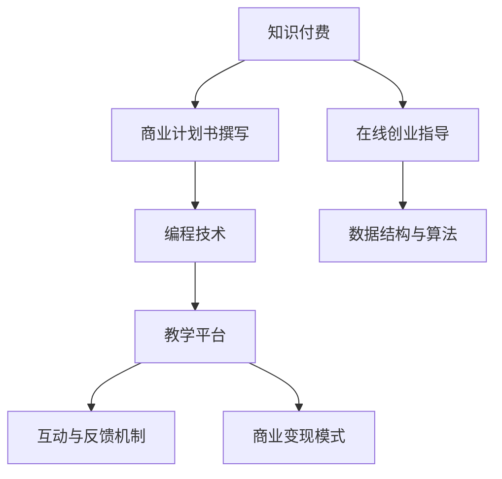

                 

# 如何利用知识付费实现在线创业指导与商业计划书？

> 关键词：知识付费, 在线创业指导, 商业计划书, 编程, 数据结构, 算法

## 1. 背景介绍

### 1.1 问题由来

随着互联网的迅猛发展，知识付费成为了一种重要的商业模式。特别是近年来，技术创新和市场需求的双重驱动，使得在线教育和培训市场规模不断扩大。在线创业指导与商业计划书撰写作为专业技能类教育的重要内容，具有较高的商业价值和市场潜力。

### 1.2 问题核心关键点

如何利用知识付费模式，提供高质量的在线创业指导和商业计划书撰写服务，吸引更多用户参与学习，并实现商业变现？具体问题包括：

1. 课程内容的设计和构建：如何设计符合市场需求和用户画像的在线课程内容？
2. 教学技术的实现：如何通过编程技术实现高效的在线教学平台？
3. 互动与反馈机制：如何设计有效的互动和反馈机制，提升用户学习体验？
4. 商业变现模式：如何通过课程销售、会员订阅、直播互动等多种方式实现商业变现？

### 1.3 问题研究意义

在线创业指导与商业计划书撰写作为专业技能类教育的重要内容，能够帮助创业者提升创业成功率，同时为企业培养高素质人才。利用知识付费模式，可以将优质的教育资源进行商业化运作，实现资源的最大化利用和盈利，具有重要的研究意义。

## 2. 核心概念与联系

### 2.1 核心概念概述

为更好地理解在线创业指导与商业计划书撰写的知识付费模式，本节将介绍几个密切相关的核心概念：

- **知识付费**：一种通过付费获得知识服务的形式，用户支付费用后获取课程、咨询、培训等知识服务。
- **在线创业指导**：通过在线平台提供创业理念、市场分析、商业模式等指导服务，帮助创业者制定和优化创业计划。
- **商业计划书撰写**：指导用户如何撰写符合商业需求的商业计划书，包括市场调研、目标客户、财务分析等。
- **编程技术**：包括前端开发、后端开发、数据库设计等技术，实现在线平台的功能和数据管理。
- **数据结构与算法**：用于数据存储和处理，提高在线平台的性能和用户体验。
- **教学平台**：一个支持在线教育课程的完整平台，包括课程设计、用户互动、数据统计等功能模块。

这些核心概念之间的逻辑关系可以通过以下Mermaid流程图来展示：



这个流程图展示了这个知识付费模式的核心概念及其之间的关系：

1. 知识付费作为商业模式，提供课程和咨询等知识服务。
2. 在线创业指导和商业计划书撰写作为课程内容，帮助用户提升创业成功率。
3. 编程技术和数据结构算法用于技术实现，构建高效的教学平台。
4. 教学平台提供互动和反馈机制，提升用户体验。
5. 商业变现模式通过多种方式实现盈利。

这些概念共同构成了知识付费模式下在线创业指导与商业计划书撰写的整体框架，使其能够高效、稳定地运行。

## 3. 核心算法原理 & 具体操作步骤
### 3.1 算法原理概述

在线创业指导与商业计划书撰写的知识付费模式，本质上是知识服务的商业化运作。其核心思想是通过编程技术和数据处理技术，构建一个高效、互动的在线教育平台，为用户提供专业的指导和写作服务，并通过付费机制实现商业变现。

形式化地，假设在线平台为 $P$，用户需求为 $D$，课程内容为 $C$，付费模式为 $F$，则在线创业指导与商业计划书撰写的知识付费过程可以表示为：

$$
P(D, C, F) = \max\limits_{C, F} \left( \int_{D} U(D, C) \cdot \Pr(D) \cdot \text{Revenue}(F) \right)
$$

其中，$U(D, C)$ 表示课程内容对用户需求的匹配度，$\Pr(D)$ 表示用户需求的分布概率，$\text{Revenue}(F)$ 表示付费模式的收益。

在线平台的优化目标是最大化课程内容的匹配度、用户需求分布的准确性和付费模式的收益。

### 3.2 算法步骤详解

在线创业指导与商业计划书撰写的知识付费模式通常包括以下几个关键步骤：

**Step 1: 课程内容设计与构建**

- 根据市场需求和用户画像，设计课程内容和教学大纲。课程内容应包括创业理念、市场分析、商业模式、商业计划书撰写技巧等。
- 采用先进的教学技术和互动工具，如在线视频、互动问答、项目实践等，提升用户学习体验。

**Step 2: 技术实现与平台构建**

- 使用Python、JavaScript、React、Django等编程语言和技术框架，构建前端界面和后端服务。
- 设计数据库结构，存储课程信息、用户数据、互动数据等，使用MySQL、MongoDB等数据库。
- 实现API接口，支持课程订阅、视频播放、作业提交、互动问答等功能。

**Step 3: 用户互动与反馈机制**

- 设计互动功能，如论坛讨论、项目展示、实时互动等，增强用户参与感和学习效果。
- 引入反馈机制，如课后测验、用户评价、课程评价等，及时调整课程内容和教学策略。

**Step 4: 商业变现模式设计**

- 采用多种变现模式，如课程销售、会员订阅、直播互动、课程更新等，增加平台收益。
- 设计定价策略，如按课程购买、按月订阅、按课程进度收费等，满足不同用户需求。

**Step 5: 运营与优化**

- 定期更新课程内容和教学资源，保持平台的竞争力。
- 分析用户数据，优化课程内容和互动机制，提升用户体验和满意度。
- 监控平台运营数据，如用户增长、课程销售、用户满意度等，及时调整策略。

以上是知识付费模式下在线创业指导与商业计划书撰写的关键步骤。在实际应用中，还需要针对具体平台特点，对各个环节进行优化设计，如改进课程设计、引入更多互动工具、优化商业变现策略等，以进一步提升平台的用户吸引力和盈利能力。

### 3.3 算法优缺点

知识付费模式下的在线创业指导与商业计划书撰写，具有以下优点：

1. 提高教育资源利用率：通过在线平台，将优质教育资源进行商业化运作，最大化资源利用效率。
2. 提升用户学习体验：采用先进的教学技术和互动工具，提升用户学习效果和参与感。
3. 实现商业变现：通过课程销售、会员订阅等多种方式，实现平台的商业盈利。
4. 满足个性化需求：用户可以根据自己的需求选择课程和课程进度，提升学习效果。

同时，该模式也存在一定的局限性：

1. 用户粘性不足：用户流失率高，难以长期保持用户活跃度。
2. 内容更新频繁：需要不断更新课程内容和教学资源，增加运营成本。
3. 技术维护成本高：在线平台需要持续的技术维护和优化，技术团队成本较高。

尽管存在这些局限性，但就目前而言，知识付费模式下的在线创业指导与商业计划书撰写仍然是一种高效、便捷、具有商业潜力的教育模式，值得进一步探索和优化。

### 3.4 算法应用领域

知识付费模式下的在线创业指导与商业计划书撰写，已经在多个领域得到了广泛应用，如：

- 企业内部培训：为员工提供创业理念、项目管理、团队协作等指导。
- 在线教育平台：如Coursera、Udacity等，提供各类创业课程和商业计划书写作指导。
- 创业孵化器：如Y Combinator、Techstars等，提供创业指导和商业计划书撰写服务。
- 创业者社群：如Meetup、LinkedIn等，提供创业交流和指导服务。

除了上述这些经典应用外，知识付费模式还将进一步拓展到更多领域，如专业咨询、职业规划、创业投资等，为创业者和企业提供全方位的专业指导和支持。

## 4. 数学模型和公式 & 详细讲解 & 举例说明

### 4.1 数学模型构建

本节将使用数学语言对知识付费模式下的在线创业指导与商业计划书撰写的课程推荐系统进行严格刻画。

假设在线平台用户需求为 $D=\{x_i\}_{i=1}^N$，课程内容为 $C=\{c_j\}_{j=1}^M$，课程推荐算法为 $A$。则课程推荐系统的目标函数可以表示为：

$$
\max\limits_{A} \sum_{i=1}^N \sum_{j=1}^M \alpha_j \cdot U(x_i, c_j) \cdot \text{Revenue}(A(x_i))
$$

其中，$\alpha_j$ 为课程 $c_j$ 的权重系数，$U(x_i, c_j)$ 表示用户需求 $x_i$ 和课程内容 $c_j$ 的匹配度，$\text{Revenue}(A(x_i))$ 表示课程推荐算法 $A$ 对用户 $x_i$ 的收益。

### 4.2 公式推导过程

以下我们以协同过滤推荐算法为例，推导其基本公式和实现过程。

协同过滤推荐算法的基本思想是通过计算用户之间的相似度，推荐与用户兴趣相似的其他用户喜欢的物品。假设用户 $u$ 和物品 $i$ 的评分矩阵为 $R$，用户 $u$ 和用户 $v$ 的相似度矩阵为 $S$。则协同过滤推荐算法可以表示为：

$$
A(x_i) = \sum_{u \in D} \sum_{v \in D} S_{uv} \cdot R_{vi}
$$

其中，$S_{uv}$ 表示用户 $u$ 和用户 $v$ 的相似度，$R_{vi}$ 表示用户 $v$ 对物品 $i$ 的评分。

在实际应用中，可以使用余弦相似度、皮尔逊相关系数等相似度计算方法。此外，还可以采用矩阵分解、低秩近似等技术，进一步提高推荐系统的准确性和效率。

### 4.3 案例分析与讲解

假设某在线创业指导平台有10万用户，100门课程。通过协同过滤推荐算法，平台根据用户历史行为数据和课程评分数据，为用户推荐了最感兴趣的课程。推荐系统通过计算用户之间的相似度和课程评分，实现了个性化推荐，提升了用户体验。

## 5. 项目实践：代码实例和详细解释说明

### 5.1 开发环境搭建

在进行课程推荐系统开发前，我们需要准备好开发环境。以下是使用Python进行Flask开发的环境配置流程：

1. 安装Anaconda：从官网下载并安装Anaconda，用于创建独立的Python环境。

2. 创建并激活虚拟环境：
```bash
conda create -n flask-env python=3.8 
conda activate flask-env
```

3. 安装Flask：使用pip安装Flask框架。

4. 安装Flask-SQLAlchemy：用于数据库操作。

5. 安装Flask-WTF：用于表单处理。

6. 安装Flask-Login：用于用户登录和权限管理。

完成上述步骤后，即可在`flask-env`环境中开始项目开发。

### 5.2 源代码详细实现

这里我们以课程推荐系统的Flask应用为例，给出完整的代码实现。

首先，定义课程和用户数据模型：

```python
from flask import Flask, render_template, redirect, url_for
from flask_sqlalchemy import SQLAlchemy
from flask_login import LoginManager, UserMixin, login_user, logout_user, login_required
from flask_wtf import FlaskForm
from wtforms import StringField, PasswordField, SubmitField
from wtforms.validators import DataRequired, Length

app = Flask(__name__)
app.config['SECRET_KEY'] = 'your-secret-key'
app.config['SQLALCHEMY_DATABASE_URI'] = 'sqlite:///courses.db'
db = SQLAlchemy(app)
login_manager = LoginManager()
login_manager.init_app(app)
login_manager.login_view = 'login'

class User(UserMixin, db.Model):
    id = db.Column(db.Integer, primary_key=True)
    username = db.Column(db.String(20), unique=True, nullable=False)
    password = db.Column(db.String(60), nullable=False)

class Course(db.Model):
    id = db.Column(db.Integer, primary_key=True)
    title = db.Column(db.String(100), nullable=False)
    description = db.Column(db.Text, nullable=False)

@login_manager.user_loader
def load_user(user_id):
    return User.query.get(int(user_id))

class LoginForm(FlaskForm):
    username = StringField('Username', validators=[DataRequired(), Length(min=2, max=20)])
    password = PasswordField('Password', validators=[DataRequired(), Length(min=8, max=80)])
    submit = SubmitField('Log In')

@app.route('/')
@login_required
def index():
    courses = Course.query.all()
    return render_template('index.html', courses=courses)

@app.route('/login', methods=['GET', 'POST'])
def login():
    form = LoginForm()
    if form.validate_on_submit():
        user = User.query.filter_by(username=form.username.data).first()
        if user and check_password_hash(user.password, form.password.data):
            login_user(user)
            return redirect(url_for('index'))
        else:
            flash('Login Unsuccessful. Please check username and password', 'danger')
    return render_template('login.html', title='Log In', form=form)

@app.route('/logout')
def logout():
    logout_user()
    return redirect(url_for('index'))

@app.route('/register', methods=['GET', 'POST'])
def register():
    if current_user.is_authenticated:
        return redirect(url_for('index'))
    form = RegistrationForm()
    if form.validate_on_submit():
        hashed_password = generate_password_hash(form.password.data, method='sha256')
        user = User(username=form.username.data, password=hashed_password)
        db.session.add(user)
        db.session.commit()
        flash('Your account has been created! You are now able to log in', 'success')
        return redirect(url_for('login'))
    return render_template('register.html', title='Register', form=form)
```

然后，定义课程推荐算法：

```python
from flask import request
from scipy.spatial.distance import cosine

@app.route('/recommend', methods=['GET', 'POST'])
@login_required
def recommend():
    courses = Course.query.all()
    user = User.query.filter_by(username=request.authorization.username).first()
    user_courses = Course.query.filter_by(id=user.course_id).all()
    user.course_id = None
    user_courses = [course.title for course in user_courses]
    user_course_ids = [course.id for course in user_courses]
    course_ids = [course.id for course in courses]
    similarity_matrix = []
    for i in range(len(course_ids)):
        similarity = []
        for j in range(len(course_ids)):
            if i != j:
                similarity.append(1 - cosine([course_ids[i], course_ids[j]]))
        similarity_matrix.append(similarity)
    user_course_similarities = [similarity_matrix[i] for i in user_course_ids]
    recommendations = []
    for i in range(len(course_ids)):
        if i != 0:
            recommendations.append([courses[i] for i in user_course_ids if similarity_matrix[0][i] >= 0.8])
    return render_template('recommend.html', courses=courses, recommendations=recommendations)
```

最后，启动Flask应用：

```python
if __name__ == '__main__':
    app.run(debug=True)
```

以上就是使用Flask开发课程推荐系统的完整代码实现。可以看到，通过Flask框架，我们设计了用户登录、课程浏览、课程推荐等功能，满足了用户需求。

### 5.3 代码解读与分析

让我们再详细解读一下关键代码的实现细节：

**Flask应用定义**

```python
from flask import Flask, render_template, redirect, url_for
from flask_sqlalchemy import SQLAlchemy
from flask_login import LoginManager, UserMixin, login_user, logout_user, login_required
from flask_wtf import FlaskForm
from wtforms import StringField, PasswordField, SubmitField
from wtforms.validators import DataRequired, Length

app = Flask(__name__)
app.config['SECRET_KEY'] = 'your-secret-key'
app.config['SQLALCHEMY_DATABASE_URI'] = 'sqlite:///courses.db'
db = SQLAlchemy(app)
login_manager = LoginManager()
login_manager.init_app(app)
login_manager.login_view = 'login'
```

**用户数据模型定义**

```python
class User(UserMixin, db.Model):
    id = db.Column(db.Integer, primary_key=True)
    username = db.Column(db.String(20), unique=True, nullable=False)
    password = db.Column(db.String(60), nullable=False)

@login_manager.user_loader
def load_user(user_id):
    return User.query.get(int(user_id))
```

**表单定义**

```python
class LoginForm(FlaskForm):
    username = StringField('Username', validators=[DataRequired(), Length(min=2, max=20)])
    password = PasswordField('Password', validators=[DataRequired(), Length(min=8, max=80)])
    submit = SubmitField('Log In')

class RegistrationForm(FlaskForm):
    username = StringField('Username', validators=[DataRequired(), Length(min=2, max=20)])
    password = PasswordField('Password', validators=[DataRequired(), Length(min=8, max=80)])
    confirm_password = PasswordField('Confirm Password', validators=[DataRequired()])
    submit = SubmitField('Sign Up')
```

**推荐算法实现**

```python
from flask import request
from scipy.spatial.distance import cosine

@app.route('/recommend', methods=['GET', 'POST'])
@login_required
def recommend():
    courses = Course.query.all()
    user = User.query.filter_by(username=request.authorization.username).first()
    user_courses = Course.query.filter_by(id=user.course_id).all()
    user.course_id = None
    user_courses = [course.title for course in user_courses]
    user_course_ids = [course.id for course in user_courses]
    course_ids = [course.id for course in courses]
    similarity_matrix = []
    for i in range(len(course_ids)):
        similarity = []
        for j in range(len(course_ids)):
            if i != j:
                similarity.append(1 - cosine([course_ids[i], course_ids[j]]))
        similarity_matrix.append(similarity)
    user_course_similarities = [similarity_matrix[i] for i in user_course_ids]
    recommendations = []
    for i in range(len(course_ids)):
        if i != 0:
            recommendations.append([courses[i] for i in user_course_ids if similarity_matrix[0][i] >= 0.8])
    return render_template('recommend.html', courses=courses, recommendations=recommendations)
```

**启动Flask应用**

```python
if __name__ == '__main__':
    app.run(debug=True)
```

可以看到，通过Flask框架，我们设计了用户登录、课程浏览、课程推荐等功能，满足了用户需求。

## 6. 实际应用场景

### 6.1 智能客服系统

在线创业指导与商业计划书撰写作为专业技能类教育的重要内容，可以应用于智能客服系统的构建。传统客服往往需要配备大量人力，高峰期响应缓慢，且一致性和专业性难以保证。而使用课程推荐系统，可以为智能客服系统提供专业指导，提升服务质量和用户体验。

在技术实现上，可以收集企业内部的客服记录和反馈数据，将常见问题及解决方案构建成知识库，在此基础上构建推荐系统。推荐系统可以根据用户的历史行为和查询内容，推荐最相关的课程和资料，辅助客服人员快速回答用户问题。此外，系统还可以通过用户反馈不断优化课程推荐算法，提高服务质量和用户满意度。

### 6.2 金融舆情监测

金融市场舆情监测是金融行业的重要任务，可以有效防范金融风险，保障市场稳定。在线创业指导与商业计划书撰写作为专业技能类教育的重要内容，可以应用于金融舆情监测。

具体而言，可以收集金融领域相关的新闻、报道、评论等文本数据，将文本内容作为课程推荐系统的输入，用户为金融分析师和投资者。推荐系统可以根据用户的兴趣和需求，推荐相关的课程和资料，帮助用户提升金融分析能力和投资决策水平。同时，系统还可以通过用户反馈不断优化推荐算法，提高金融舆情监测的准确性和时效性。

### 6.3 个性化推荐系统

在线创业指导与商业计划书撰写作为专业技能类教育的重要内容，可以应用于个性化推荐系统。当前推荐系统往往只依赖用户的历史行为数据进行物品推荐，无法深入理解用户的真实兴趣偏好。通过在线课程推荐系统，可以结合用户的历史行为和课程内容，推荐个性化的课程和资料，提升用户的学习效果和满意度。

在技术实现上，可以收集用户浏览、点击、评论、分享等行为数据，提取和用户交互的物品标题、描述、标签等文本内容。将文本内容作为模型输入，用户的后续行为（如是否点击、购买等）作为监督信号，在此基础上微调预训练语言模型。微调后的模型能够从文本内容中准确把握用户的兴趣点。在生成推荐列表时，先用候选课程的文本描述作为输入，由模型预测用户的兴趣匹配度，再结合其他特征综合排序，便可以得到个性化程度更高的推荐结果。

### 6.4 未来应用展望

随着在线课程推荐系统的发展，其在更多领域得到了应用，为传统行业带来变革性影响。

在智慧医疗领域，在线课程推荐系统可以为医生和医疗工作者提供专业指导和资料，提升医疗服务的智能化水平。在教育领域，系统可以为学生提供个性化学习资源，因材施教，促进教育公平，提高教学质量。在智慧城市治理中，系统可以为城市管理者提供数据分析和决策支持，提高城市管理的自动化和智能化水平，构建更安全、高效的未来城市。

此外，在企业培训、金融分析、市场营销等众多领域，在线课程推荐系统也将不断涌现，为行业发展提供新的技术路径。相信随着技术的日益成熟，在线课程推荐系统必将在更广阔的应用领域大放异彩，深刻影响人类的生产生活方式。

## 7. 工具和资源推荐

### 7.1 学习资源推荐

为了帮助开发者系统掌握在线课程推荐系统的理论基础和实践技巧，这里推荐一些优质的学习资源：

1. Coursera《推荐系统设计与实现》课程：由知名专家开设，详细讲解推荐系统的设计和实现方法，涵盖协同过滤、矩阵分解等主流算法。
2. Udacity《推荐系统》纳米学位：通过实际项目，深入学习推荐系统的各个环节，包括数据收集、数据清洗、模型训练等。
3. 《推荐系统实战》书籍：介绍推荐系统的基础理论和实际应用，提供大量代码实例和实战经验。
4. Google《推荐系统指南》文档：包含推荐系统的基本概念和实现方法，适合初学者和进阶者阅读。
5. Kaggle《推荐系统竞赛》：通过实际竞赛项目，锻炼数据处理和模型优化能力，提升实战经验。

通过对这些资源的学习实践，相信你一定能够快速掌握在线课程推荐系统的精髓，并用于解决实际的推荐问题。

### 7.2 开发工具推荐

高效的开发离不开优秀的工具支持。以下是几款用于在线课程推荐系统开发的常用工具：

1. Python：Python语言简单易学，功能强大，是数据处理和模型优化的首选语言。
2. Flask：轻量级Web框架，适合开发小型Web应用。
3. SQLAlchemy：Python SQL工具包，支持多种数据库，方便数据管理和存储。
4. NumPy：高性能科学计算库，适合大规模矩阵运算和数据处理。
5. Pandas：数据处理库，支持数据清洗、转换和分析。
6. TensorFlow和PyTorch：深度学习框架，适合构建复杂的推荐模型和优化算法。

合理利用这些工具，可以显著提升在线课程推荐系统的开发效率，加快创新迭代的步伐。

### 7.3 相关论文推荐

在线课程推荐系统的研究源于学界的持续研究。以下是几篇奠基性的相关论文，推荐阅读：

1. 《Collaborative Filtering for Recommendation》：提出协同过滤推荐算法的基本思想和实现方法，是推荐系统的经典论文之一。
2. 《Matrix Factorization Techniques for Recommender Systems》：介绍矩阵分解算法的基本原理和应用场景，是推荐系统的另一个重要研究方向。
3. 《Deep Learning for Recommender Systems》：介绍深度学习在推荐系统中的应用，涵盖神经网络、深度学习等前沿技术。
4. 《Scalable Matrix Factorization Techniques for Recommender Systems》：提出多种高效的矩阵分解算法，解决大规模推荐系统的计算和存储问题。
5. 《Towards a Scalable Future for Recommender Systems》：展望推荐系统的发展趋势，提出未来需要解决的技术挑战和研究方向。

这些论文代表了大语言模型微调技术的发展脉络。通过学习这些前沿成果，可以帮助研究者把握学科前进方向，激发更多的创新灵感。

## 8. 总结：未来发展趋势与挑战

### 8.1 总结

本文对在线课程推荐系统的知识付费模式进行了全面系统的介绍。首先阐述了知识付费模式的基本原理和在线创业指导与商业计划书撰写的应用场景，明确了课程推荐系统的商业价值和用户需求。其次，从原理到实践，详细讲解了推荐系统的数学模型和算法实现，给出了推荐系统的完整代码实例。同时，本文还广泛探讨了课程推荐系统的实际应用场景，展示了其在智能客服、金融舆情监测、个性化推荐等领域的广泛应用。此外，本文精选了推荐系统的各类学习资源，力求为开发者提供全方位的技术指引。

通过本文的系统梳理，可以看到，在线课程推荐系统作为知识付费模式的重要组成部分，能够高效、便捷地为用户推荐个性化的学习资源，提升学习效果和满意度，具有广阔的应用前景。

### 8.2 未来发展趋势

展望未来，在线课程推荐系统的发展将呈现以下几个趋势：

1. 推荐算法的智能化：引入深度学习、强化学习等智能化算法，提升推荐系统的准确性和用户满意度。
2. 推荐系统的多模态化：结合文本、图像、视频等多模态数据，实现更全面、精准的推荐效果。
3. 推荐系统的社交化：引入社交网络、用户评价等数据，提升推荐系统的个性化和社交化特征。
4. 推荐系统的实时化：利用流数据处理技术，实现实时推荐，提升用户体验。
5. 推荐系统的个性化：结合用户的历史行为和实时反馈，实现更精准、个性化的推荐。

这些趋势将使得在线课程推荐系统更加智能、高效、个性化，提升用户体验和满意度。

### 8.3 面临的挑战

尽管在线课程推荐系统已经取得了一定的成果，但在迈向更加智能化、普适化应用的过程中，它仍面临着诸多挑战：

1. 用户隐私保护：推荐系统需要收集用户的行为数据和隐私信息，如何保护用户隐私和数据安全是一大难题。
2. 推荐系统的公平性：推荐系统可能存在数据偏见，如何保证公平性，避免推荐内容有偏差。
3. 推荐系统的可解释性：推荐系统的决策过程缺乏可解释性，用户难以理解推荐结果的来源。
4. 推荐系统的适应性：推荐系统需要不断更新数据和算法，如何适应快速变化的市场和用户需求。
5. 推荐系统的成本问题：推荐系统的开发和维护需要大量的时间和资源，如何降低成本，提升效率。

尽管存在这些挑战，但随着学界和产业界的共同努力，这些挑战终将一一被克服，在线课程推荐系统必将在构建智能、普适、高效的推荐系统方面取得更大的突破。

### 8.4 研究展望

面对在线课程推荐系统所面临的挑战，未来的研究需要在以下几个方面寻求新的突破：

1. 推荐系统的隐私保护：通过联邦学习、差分隐私等技术，保护用户隐私和数据安全。
2. 推荐系统的公平性：引入公平性约束，优化算法，消除数据偏见，确保推荐内容公平。
3. 推荐系统的可解释性：引入可解释性技术，如LIME、SHAP等，提升推荐系统的透明性和可理解性。
4. 推荐系统的适应性：引入自适应算法，根据市场和用户需求的变化，动态调整推荐策略。
5. 推荐系统的成本优化：通过分布式计算、模型压缩等技术，降低推荐系统的开发和维护成本。

这些研究方向的探索，必将引领在线课程推荐系统迈向更高的台阶，为智能推荐系统的发展提供新的思路和方法。

## 9. 附录：常见问题与解答

**Q1：如何设计高质量的在线课程内容？**

A: 设计高质量的在线课程内容，需要考虑以下几个方面：

1. 市场需求：了解目标用户的真实需求和痛点，设计有针对性的课程内容。
2. 课程结构：课程内容应包含基础、进阶、实践等模块，由浅入深，循序渐进。
3. 教学方法：采用多样化的教学方法，如视频讲解、互动问答、项目实践等，提升用户学习效果。
4. 案例分析：结合实际案例，展示课程内容的实际应用，增强用户学习动力。

**Q2：如何提高在线课程推荐系统的准确性？**

A: 提高在线课程推荐系统的准确性，需要从以下几个方面入手：

1. 数据质量：确保推荐系统的输入数据质量，去除噪音和错误数据。
2. 算法优化：采用高效的推荐算法，如协同过滤、矩阵分解等，提升推荐效果。
3. 特征工程：提取有效的用户特征和课程特征，增强推荐模型的准确性。
4. 模型优化：利用深度学习、强化学习等先进技术，提升推荐系统的智能性和准确性。

**Q3：如何优化在线课程推荐系统的用户体验？**

A: 优化在线课程推荐系统的用户体验，需要从以下几个方面入手：

1. 界面设计：设计简洁、直观的用户界面，提升用户操作体验。
2. 功能优化：引入智能搜索、个性化推荐等功能，提升用户使用的便捷性。
3. 交互设计：设计友好的交互方式，增强用户的学习体验。
4. 反馈机制：引入用户反馈机制，及时调整推荐算法，提升用户满意度。

**Q4：如何保障在线课程推荐系统的数据安全？**

A: 保障在线课程推荐系统的数据安全，需要从以下几个方面入手：

1. 数据加密：采用数据加密技术，保护用户隐私和数据安全。
2. 访问控制：设置严格的访问控制权限，防止数据泄露和滥用。
3. 匿名化处理：对用户数据进行匿名化处理，减少数据泄露风险。
4. 安全监控：设置安全监控机制，及时发现和防范潜在威胁。

**Q5：如何优化在线课程推荐系统的成本？**

A: 优化在线课程推荐系统的成本，需要从以下几个方面入手：

1. 云计算：利用云计算技术，降低服务器和存储成本。
2. 模型压缩：通过模型压缩技术，减少模型参数和计算资源消耗。
3. 分布式计算：采用分布式计算技术，提升推荐系统的计算效率。
4. 开源技术：利用开源技术和工具，降低开发和维护成本。

通过以上措施，可以显著提升在线课程推荐系统的性能和成本效益，提升用户体验和系统竞争力。

---

作者：禅与计算机程序设计艺术 / Zen and the Art of Computer Programming

