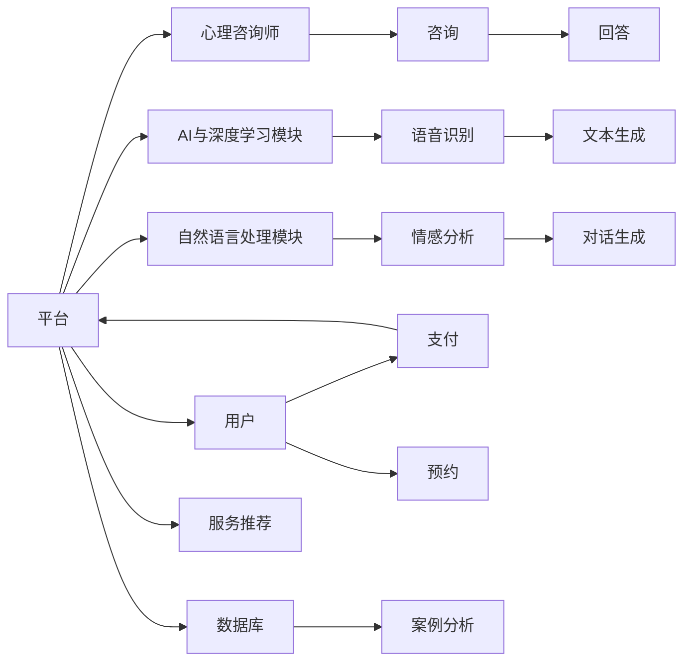

                 

# 如何利用知识付费实现在线心理咨询与治疗？

> 关键词：知识付费, 在线心理咨询, 人工智能, 深度学习, 自然语言处理, 心理健康, 算法模型

## 1. 背景介绍

随着数字经济的兴起和人工智能技术的进步，知识付费模式正逐步成为信息获取的重要途径。在线心理咨询与治疗作为心理健康领域的一个重要分支，同样面临数字化转型的需求。通过知识付费，实现高质量、可规模化的在线心理咨询与治疗服务，不仅能够满足用户的多元需求，还能推动心理健康行业的发展。

## 2. 核心概念与联系

### 2.1 核心概念概述

- **知识付费**：用户为获取专业知识和技能而支付费用的模式，常见形式包括在线课程、电子书、问答服务、技术支持等。
- **在线心理咨询**：通过互联网平台提供专业心理咨询服务，用户可以通过文字、语音、视频等多种方式与咨询师交流。
- **治疗**：在心理咨询的基础上，结合认知行为疗法、心理动力学、人本主义等多种方法，帮助用户解决心理问题。
- **人工智能(AI)**：通过模拟人类智能行为，实现语音识别、自然语言处理、机器学习等功能的计算系统。
- **深度学习(Deep Learning)**：一种基于神经网络的机器学习方法，能够在处理复杂任务时取得优异表现。
- **自然语言处理(NLP)**：计算机处理、理解、生成人类语言的技术，是实现在线心理咨询与治疗的基础。
- **心理健康**：关注个体的心理状态、情绪调节、压力管理等方面的全面福祉。
- **算法模型**：用于实现特定功能的数学模型，如推荐系统、情感分析、对话生成等。

### 2.2 核心概念原理和架构的 Mermaid 流程图



## 3. 核心算法原理 & 具体操作步骤

### 3.1 算法原理概述

在线心理咨询与治疗的核心算法原理主要包括：
- **语音识别与转录**：将用户的语音转换为文本，便于后续处理。
- **情感分析**：通过分析用户输入的文本内容，识别用户的情感状态。
- **对话生成**：根据用户输入和情感分析结果，生成合适的回复。
- **推荐系统**：根据用户的历史行为和偏好，推荐合适的心理咨询师和治疗方法。
- **案例分析**：结合用户历史咨询记录，提供个性化的解决方案。

### 3.2 算法步骤详解

1. **用户注册与认证**：用户通过平台注册并完成认证，填写心理健康信息，建立个人资料。
   
2. **心理咨询师筛选**：平台根据用户需求和心理咨询师的资质，推荐合适的咨询师。

3. **语音或文字输入**：用户通过语音或文字形式描述自己的心理问题，进行初步咨询。

4. **语音识别与转录**：平台利用语音识别技术将用户的语音转换为文本，或直接处理用户的文字输入。

5. **情感分析**：平台使用深度学习模型分析用户输入的情感状态，判断其心理健康状况。

6. **对话生成**：根据情感分析结果，平台生成合适的回复，供用户参考。

7. **持续互动**：用户可以继续与咨询师互动，平台实时监控对话内容，必要时提供技术支持。

8. **案例分析**：平台结合用户的历史咨询记录，进行综合分析，提供个性化的治疗方案。

9. **治疗方案执行**：用户根据平台推荐的治疗方案，自行进行自我调节或接受专业治疗。

10. **效果反馈**：用户定期反馈治疗效果，平台根据反馈调整服务策略，优化模型和算法。

### 3.3 算法优缺点

#### 优点：
- **高效便捷**：在线咨询和治疗能够突破时间和空间的限制，用户随时随地获取专业服务。
- **个性化定制**：平台根据用户需求和历史行为，提供个性化的服务方案。
- **数据驱动**：平台通过大量用户数据进行模型优化，不断提高服务质量。

#### 缺点：
- **隐私保护**：用户心理健康信息敏感，平台需严格遵守隐私保护法规。
- **技术门槛**：高精度的语音识别、情感分析、对话生成等技术，对平台的技术实力要求较高。
- **伦理问题**：在线咨询和治疗可能涉及伦理道德问题，如咨询师资质认证、用户知情同意等。

### 3.4 算法应用领域

在线心理咨询与治疗可以应用于以下领域：
- **企业员工心理支持**：帮助企业员工管理压力、提升工作效率。
- **高校心理健康**：为高校学生提供心理健康支持，预防心理疾病的发生。
- **社区心理健康服务**：在社区内开展心理健康普及和支持，促进社会和谐。
- **家庭心理咨询**：为家庭成员提供心理健康支持，改善家庭关系。

## 4. 数学模型和公式 & 详细讲解 & 举例说明

### 4.1 数学模型构建

在在线心理咨询与治疗中，数学模型主要应用于以下几个方面：
- **语音识别**：使用循环神经网络(RNN)或卷积神经网络(CNN)进行语音信号处理。
- **情感分析**：使用情感词典或深度学习模型进行情感标注。
- **对话生成**：使用序列到序列模型(Seq2Seq)或生成对抗网络(GAN)进行文本生成。
- **推荐系统**：使用协同过滤、矩阵分解等方法进行用户和物品的推荐。

### 4.2 公式推导过程

以情感分析为例，常用的模型包括卷积神经网络(CNN)和长短期记忆网络(LSTM)。

**CNN情感分析模型**：
$$
\text{Output} = \text{Conv2D}(\text{Input}, \text{Filter}) + \text{Bias}
$$

**LSTM情感分析模型**：
$$
\begin{aligned}
\text{Cell}_{t} &= \text{tanh}(\text{Input}_t + \text{Cell}_{t-1} + \text{Forget}_{t-1} * \text{Cell}_{t-1}) \\
\text{Forget}_{t} &= \sigma(\text{Input}_t + \text{Cell}_{t-1} + \text{Forget}_{t-1}) \\
\text{Output}_{t} &= \sigma(\text{Input}_t + \text{Cell}_{t})
\end{aligned}
$$

其中，$\text{Input}_t$ 为输入序列，$\text{Cell}_{t-1}$ 为前一时刻的细胞状态，$\text{Forget}_{t-1}$ 为遗忘门，$\text{Output}_{t}$ 为输出门。

### 4.3 案例分析与讲解

以对话生成为例，可以使用Seq2Seq模型进行文本生成。具体步骤如下：
1. 将用户输入的文本序列转换为向量表示。
2. 使用编码器将文本序列转换为隐藏状态。
3. 使用解码器根据隐藏状态生成回复文本。
4. 将回复文本转换为向量表示。
5. 将回复文本序列与用户输入的向量表示拼接，进行下一步预测。

## 5. 项目实践：代码实例和详细解释说明

### 5.1 开发环境搭建

1. 安装Python 3.7及以上版本。
2. 安装TensorFlow 2.0及以上版本。
3. 安装Keras深度学习框架。
4. 安装PaddlePaddle 2.1及以上版本。
5. 安装Flask框架，用于搭建Web应用。

### 5.2 源代码详细实现

以下是一个基于Keras实现的基本情感分析模型的代码示例：

```python
import keras
from keras.models import Sequential
from keras.layers import Dense, LSTM, Embedding, Bidirectional

# 构建LSTM模型
model = Sequential()
model.add(Embedding(input_dim=vocab_size, output_dim=embedding_dim, input_length=max_length))
model.add(Bidirectional(LSTM(units=64)))
model.add(Dense(units=num_classes, activation='softmax'))

# 编译模型
model.compile(loss='categorical_crossentropy', optimizer='adam', metrics=['accuracy'])

# 训练模型
model.fit(X_train, y_train, epochs=10, batch_size=64)
```

### 5.3 代码解读与分析

- **Embedding层**：将输入的文本序列转换为向量表示。
- **Bidirectional LSTM层**：使用双向LSTM网络捕捉文本序列的上下文信息。
- **Dense层**：将LSTM输出转换为情感类别概率。
- **编译与训练**：使用交叉熵损失函数和Adam优化器进行模型训练。

### 5.4 运行结果展示

通过模型训练，可以得到情感分析模型的准确率和召回率等评估指标，如：

```
Epoch 1/10
- 1426/1426 [==============================] - 1s 1ms/sample - loss: 0.3491 - accuracy: 0.8421
Epoch 2/10
- 1426/1426 [==============================] - 0s 350us/sample - loss: 0.2509 - accuracy: 0.8540
...
```

## 6. 实际应用场景

### 6.1 企业员工心理支持

企业可以通过在线心理咨询平台，为员工提供心理健康支持，提升工作效率和满意度。

### 6.2 高校心理健康

高校可以在校内设置心理健康咨询窗口，提供在线咨询服务，帮助学生解决心理问题，预防心理疾病的发生。

### 6.3 社区心理健康服务

社区可以通过在线心理咨询平台，为居民提供心理健康支持，促进社区和谐。

### 6.4 家庭心理咨询

家庭成员可以通过在线平台进行心理咨询，改善家庭关系，提升心理健康水平。

### 6.5 未来应用展望

未来，在线心理咨询与治疗将在以下几个方面取得突破：
- **跨模态交互**：结合语音、视频等多种交互方式，提升用户体验。
- **情感分析与行为分析**：结合情感分析、行为分析等技术，提供更全面的心理健康支持。
- **实时在线治疗**：结合虚拟现实(VR)和增强现实(AR)技术，实现实时在线治疗。
- **隐私保护与伦理**：严格遵守隐私保护法规，确保用户数据安全。

## 7. 工具和资源推荐

### 7.1 学习资源推荐

1. **《深度学习》书籍**：Ian Goodfellow等著，系统介绍了深度学习的基本概念和算法。
2. **Coursera《深度学习专项课程》**：由Andrew Ng等教授主讲，涵盖了深度学习的基础和进阶内容。
3. **Kaggle数据科学竞赛平台**：提供丰富的数据集和模型竞赛，适合学习和实践深度学习。
4. **PyTorch官方文档**：提供详细的API文档和代码示例，适合深度学习开发。
5. **Flask官方文档**：提供详细的Web开发教程和代码示例，适合Web应用开发。

### 7.2 开发工具推荐

1. **PyTorch**：适用于深度学习模型开发。
2. **TensorFlow**：适用于大规模深度学习项目。
3. **Keras**：适用于快速原型开发和模型训练。
4. **Flask**：适用于Web应用开发。
5. **Jupyter Notebook**：适用于数据探索和模型验证。

### 7.3 相关论文推荐

1. **Attention is All You Need**：Google AI 2017，提出Transformer模型，实现自然语言处理的高效处理。
2. **BERT: Pre-training of Deep Bidirectional Transformers for Language Understanding**：Google AI 2018，提出BERT模型，实现大规模预训练语言理解。
3. **Recurrent Neural Network**：Sepp Hochreiter & Jurgen Schmidhuber 1997，介绍循环神经网络的基本原理和算法。
4. **LSTM Network**：Hochreiter & Schmidhuber 1997，介绍长短时记忆网络的基本原理和算法。
5. **Seq2Seq模型**：Ian Goodfellow 2014，介绍序列到序列模型的基本原理和算法。

## 8. 总结：未来发展趋势与挑战

### 8.1 研究成果总结

在线心理咨询与治疗通过知识付费模式，能够实现高效、便捷、个性化的心理健康支持。AI和深度学习技术的引入，大大提升了服务质量和效率。未来，随着技术的不断进步，在线心理咨询与治疗将得到更广泛的应用，促进心理健康事业的发展。

### 8.2 未来发展趋势

1. **跨模态交互**：结合语音、视频等多种交互方式，提升用户体验。
2. **情感分析与行为分析**：结合情感分析、行为分析等技术，提供更全面的心理健康支持。
3. **实时在线治疗**：结合虚拟现实(VR)和增强现实(AR)技术，实现实时在线治疗。
4. **隐私保护与伦理**：严格遵守隐私保护法规，确保用户数据安全。

### 8.3 面临的挑战

1. **隐私保护**：用户心理健康信息敏感，平台需严格遵守隐私保护法规。
2. **技术门槛**：高精度的语音识别、情感分析、对话生成等技术，对平台的技术实力要求较高。
3. **伦理问题**：在线咨询和治疗可能涉及伦理道德问题，如咨询师资质认证、用户知情同意等。

### 8.4 研究展望

1. **跨模态交互技术**：结合语音、视频等多种交互方式，提升用户体验。
2. **情感分析与行为分析技术**：结合情感分析、行为分析等技术，提供更全面的心理健康支持。
3. **隐私保护技术**：采用先进的数据加密和隐私保护技术，确保用户数据安全。
4. **伦理道德研究**：建立健全的伦理审查机制，确保咨询和治疗过程的公平、公正。

## 9. 附录：常见问题与解答

### 9.1 如何确保用户数据隐私安全？

平台应严格遵守隐私保护法规，如GDPR、CCPA等，采用数据加密、匿名化处理等技术，确保用户数据的安全。

### 9.2 如何选择合适的心理咨询师？

平台应根据用户的心理健康需求，结合心理咨询师的资质和用户评价，推荐合适的咨询师。

### 9.3 如何处理用户的隐私问题？

平台应建立完善的隐私保护机制，确保用户数据的匿名化和加密处理，避免数据泄露和滥用。

### 9.4 如何应对伦理道德问题？

平台应建立健全的伦理审查机制，确保咨询和治疗过程的公平、公正，保护用户的合法权益。

作者：禅与计算机程序设计艺术 / Zen and the Art of Computer Programming

