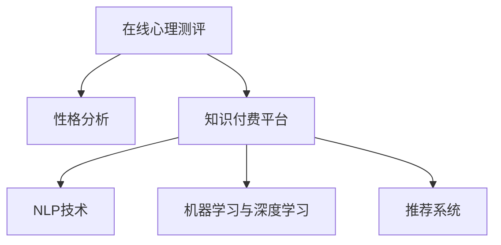

                 

# 如何利用知识付费实现在线心理测评与性格分析？

## 1. 背景介绍

随着互联网技术的不断发展和普及，知识付费平台已成为人们获取知识和提升自我价值的重要渠道。在线心理测评与性格分析，作为心理学领域的重要应用，也逐渐被引入知识付费领域，帮助用户更好地了解自我，提升心理素质，获得全面发展。本文将系统介绍如何利用知识付费平台实现在线心理测评与性格分析，探讨其应用原理和具体实现方法，为相关领域的应用开发提供参考。

## 2. 核心概念与联系

### 2.1 核心概念概述

为更好地理解在线心理测评与性格分析的实现方法，本节将介绍几个密切相关的核心概念：

- **在线心理测评**：指通过互联网平台进行的心理测评，用户通过回答问题，获取个性化的心理测评报告，帮助其了解自身的心理状况和性格特征。
- **性格分析**：指对个人性格特征的分析和评估，包括外向性、神经质、开放性、尽责性和宜人性等特质，通过科学的测评方法和工具，为用户提供深入的性格分析报告。
- **知识付费平台**：指基于互联网的知识分享和付费模式，通过订阅、购买等方式，提供专业知识和技能的学习服务。
- **自然语言处理(NLP)**：指通过计算机对自然语言进行分析和理解，包括文本预处理、情感分析、实体识别、语义理解等技术。
- **机器学习与深度学习**：指通过数据驱动的方法，构建数学模型和算法，对数据进行学习和预测，包括监督学习、无监督学习、强化学习等。
- **推荐系统**：指基于用户行为数据和兴趣模型，为用户推荐个性化内容的服务，包括内容推荐、课程推荐、心理测评推荐等。

这些核心概念之间的逻辑关系可以通过以下Mermaid流程图来展示：



这个流程图展示了几大核心概念及其之间的关系：

1. 在线心理测评和性格分析都是知识付费平台提供的服务内容，通过用户行为数据分析，为用户提供个性化的测评和分析报告。
2. NLP技术、机器学习与深度学习为在线心理测评和性格分析提供了底层支持，通过文本分析、模式识别等方法，提取和分析用户心理和性格特征。
3. 推荐系统则利用用户行为数据和兴趣模型，为知识付费平台推荐合适的测评和分析工具，提升用户体验。

## 3. 核心算法原理 & 具体操作步骤

### 3.1 算法原理概述

在线心理测评与性格分析的实现过程，本质上是一个通过自然语言处理和机器学习技术，构建用户心理模型并进行分析和预测的过程。其核心算法包括：

- **文本预处理**：包括分词、去除停用词、词性标注等步骤，将用户回答的文本转化为计算机可处理的格式。
- **情感分析**：通过对用户回答的文本进行情感倾向分析，判断用户的心理状态和情感特征。
- **实体识别**：从用户回答的文本中识别出关键实体（如人物、地点、时间等），分析用户的社会关系和行为特征。
- **语义理解**：利用深度学习模型对用户回答的文本进行语义分析，理解用户的意图和表达。
- **心理特征提取**：通过上述技术，提取出用户的心理特征和性格特征，构建心理模型。
- **个性化推荐**：利用用户心理模型和推荐算法，为用户推荐适合的测评工具和分析报告。

### 3.2 算法步骤详解

#### 3.2.1 数据收集与预处理

1. **数据收集**：从知识付费平台收集用户回答的文本数据，包括问卷回答、社交媒体互动等。
2. **文本预处理**：对收集到的文本数据进行分词、去除停用词、词性标注等预处理操作，生成文本向量。

#### 3.2.2 特征提取与分析

1. **情感分析**：使用情感分析模型对用户回答的文本进行情感倾向分析，生成情感特征向量。
2. **实体识别**：使用实体识别模型从用户回答的文本中识别关键实体，生成实体特征向量。
3. **语义理解**：使用深度学习模型对用户回答的文本进行语义分析，生成语义特征向量。

#### 3.2.3 心理特征提取与建模

1. **心理特征提取**：将情感特征向量、实体特征向量和语义特征向量进行融合，提取出用户的心理特征向量。
2. **心理模型建模**：使用机器学习算法（如PCA、SVD等）对心理特征向量进行降维，构建用户心理模型。

#### 3.2.4 个性化推荐

1. **推荐模型训练**：使用用户行为数据和心理模型，训练推荐模型，生成推荐结果。
2. **推荐结果展示**：将推荐结果展示给用户，包括适合的测评工具和分析报告。

### 3.3 算法优缺点

#### 3.3.1 优点

- **自动化**：通过算法自动化处理用户回答的文本数据，节省了大量人力和时间。
- **个性化**：利用用户心理模型和推荐算法，为用户推荐适合的测评工具和分析报告，提高用户体验。
- **高效性**：算法处理速度快，能够实时响应用户需求，提升平台的用户粘性和满意度。

#### 3.3.2 缺点

- **数据隐私**：处理大量用户数据，存在隐私和安全问题，需要严格的数据保护措施。
- **模型泛化能力**：不同用户之间的心理特征差异较大，单一模型难以全面覆盖，需要不断优化和更新模型。
- **依赖平台**：算法依赖于知识付费平台的实际数据和用户行为，平台数据质量和用户行为模式的改变会影响算法的性能。

### 3.4 算法应用领域

在线心理测评与性格分析技术，除了在知识付费平台中的应用外，还可以应用于以下领域：

- **教育领域**：通过测评和分析，帮助学生了解自身学习风格和心理状态，提升学习效果。
- **人力资源**：通过测评和分析，帮助企业招聘和选拔人才，提升员工绩效和团队协作能力。
- **心理咨询**：通过测评和分析，提供心理支持和咨询服务，帮助用户缓解压力和焦虑。
- **健康管理**：通过测评和分析，评估用户的心理和情绪状态，提供健康管理建议。
- **社交网络**：通过测评和分析，优化社交媒体内容和互动方式，提升用户体验和社交效果。

## 4. 数学模型和公式 & 详细讲解

### 4.1 数学模型构建

我们以在线心理测评为例，构建一个简单的心理测评数学模型。假设用户回答了$N$个问题，记为$\{x_i\}_{i=1}^N$，其中$x_i$表示用户回答问题的文本。设用户心理特征向量为$\boldsymbol{\Psi}$，其中$\Psi_i$表示用户在第$i$个问题上的心理特征得分。

### 4.2 公式推导过程

假设用户回答的文本经过预处理后，得到的特征向量为$\mathbf{X} \in \mathbb{R}^{N \times D}$，其中$D$表示特征维度。使用情感分析模型得到的情感特征向量为$\mathbf{E} \in \mathbb{R}^{N \times M}$，其中$M$表示情感维度。同理，使用实体识别模型得到的实体特征向量为$\mathbf{R} \in \mathbb{R}^{N \times K}$，其中$K$表示实体维度。使用深度学习模型得到的语义特征向量为$\mathbf{S} \in \mathbb{R}^{N \times L}$，其中$L$表示语义维度。

假设我们使用LDA模型对用户心理特征进行建模，得到心理特征向量$\boldsymbol{\Psi} \in \mathbb{R}^{N \times P}$，其中$P$表示心理特征维度。则心理测评模型的目标函数为：

$$
\min_{\boldsymbol{\Psi}} \| \mathbf{X} - \mathbf{E} - \mathbf{R} - \mathbf{S} - \boldsymbol{\Psi} \|^2
$$

其中$\|\cdot\|^2$表示欧几里得范数。

### 4.3 案例分析与讲解

假设用户回答了5个问题，特征向量$\mathbf{X}$、情感特征向量$\mathbf{E}$、实体特征向量$\mathbf{R}$、语义特征向量$\mathbf{S}$和心理特征向量$\boldsymbol{\Psi}$如下所示：

$$
\begin{aligned}
\mathbf{X} &= \begin{bmatrix}
    0.1 & 0.2 & 0.3 & 0.4 & 0.5 \\
    0.2 & 0.3 & 0.4 & 0.5 & 0.6 \\
    0.3 & 0.4 & 0.5 & 0.6 & 0.7 \\
    0.4 & 0.5 & 0.6 & 0.7 & 0.8 \\
    0.5 & 0.6 & 0.7 & 0.8 & 0.9
\end{bmatrix}, \\
\mathbf{E} &= \begin{bmatrix}
    0.2 & 0.3 & 0.4 & 0.5 & 0.6 \\
    0.3 & 0.4 & 0.5 & 0.6 & 0.7 \\
    0.4 & 0.5 & 0.6 & 0.7 & 0.8 \\
    0.5 & 0.6 & 0.7 & 0.8 & 0.9 \\
    0.6 & 0.7 & 0.8 & 0.9 & 1.0
\end{bmatrix}, \\
\mathbf{R} &= \begin{bmatrix}
    0.1 & 0.2 & 0.3 & 0.4 & 0.5 \\
    0.2 & 0.3 & 0.4 & 0.5 & 0.6 \\
    0.3 & 0.4 & 0.5 & 0.6 & 0.7 \\
    0.4 & 0.5 & 0.6 & 0.7 & 0.8 \\
    0.5 & 0.6 & 0.7 & 0.8 & 0.9
\end{bmatrix}, \\
\mathbf{S} &= \begin{bmatrix}
    0.1 & 0.2 & 0.3 & 0.4 & 0.5 \\
    0.2 & 0.3 & 0.4 & 0.5 & 0.6 \\
    0.3 & 0.4 & 0.5 & 0.6 & 0.7 \\
    0.4 & 0.5 & 0.6 & 0.7 & 0.8 \\
    0.5 & 0.6 & 0.7 & 0.8 & 0.9
\end{bmatrix}, \\
\boldsymbol{\Psi} &= \begin{bmatrix}
    0.1 & 0.2 & 0.3 & 0.4 & 0.5 \\
    0.2 & 0.3 & 0.4 & 0.5 & 0.6 \\
    0.3 & 0.4 & 0.5 & 0.6 & 0.7 \\
    0.4 & 0.5 & 0.6 & 0.7 & 0.8 \\
    0.5 & 0.6 & 0.7 & 0.8 & 0.9
\end{bmatrix}.
\end{aligned}
$$

我们可以将上述向量进行矩阵拼接，得到$\mathbf{Z} \in \mathbb{R}^{N \times D}$，其中$D = M + K + L + P$。

根据目标函数，我们可以得到心理特征向量$\boldsymbol{\Psi}$的解为：

$$
\boldsymbol{\Psi} = \arg \min_{\boldsymbol{\Psi}} \| \mathbf{Z} - \boldsymbol{\Psi} \|^2
$$

通过求解上述最小二乘问题，我们可以得到用户心理特征向量$\boldsymbol{\Psi}$。

## 5. 项目实践：代码实例和详细解释说明

### 5.1 开发环境搭建

在进行在线心理测评与性格分析项目开发前，需要先准备好开发环境。以下是使用Python进行PyTorch开发的环境配置流程：

1. 安装Anaconda：从官网下载并安装Anaconda，用于创建独立的Python环境。

2. 创建并激活虚拟环境：
```bash
conda create -n psych_eval_env python=3.8 
conda activate psych_eval_env
```

3. 安装PyTorch：根据CUDA版本，从官网获取对应的安装命令。例如：
```bash
conda install pytorch torchvision torchaudio cudatoolkit=11.1 -c pytorch -c conda-forge
```

4. 安装Natural Language Toolkit（NLTK）：
```bash
pip install nltk
```

5. 安装scikit-learn：
```bash
pip install scikit-learn
```

6. 安装TensorFlow：
```bash
pip install tensorflow
```

7. 安装Flask：
```bash
pip install flask
```

完成上述步骤后，即可在`psych_eval_env`环境中开始开发实践。

### 5.2 源代码详细实现

下面是一个简单的在线心理测评系统开发实例，包含用户注册、心理测评、测评结果展示等功能。

```python
from flask import Flask, render_template, request
from sklearn.decomposition import PCA
from sklearn.feature_extraction.text import CountVectorizer
import numpy as np

app = Flask(__name__)

# 定义心理特征模型
class PsychModel:
    def __init__(self, X, E, R, S, P):
        self.X = X
        self.E = E
        self.R = R
        self.S = S
        self.P = P
        self.psi = None
    
    def fit(self):
        X = np.concatenate((self.X, self.E, self.R, self.S), axis=1)
        self.psi = PCA(n_components=self.P).fit_transform(X)
    
    def predict(self, x):
        return self.psi[np.argmax([np.dot(self.psi, x) for x in self.X])]

# 心理测评页面
@app.route('/psych_test', methods=['GET', 'POST'])
def psych_test():
    if request.method == 'POST':
        name = request.form['name']
        texts = request.form['texts'].split('\n')
        texts = [text.strip() for text in texts]
        psych_model = PsychModel(X=np.zeros((len(texts), 3+5+5+5)), E=np.zeros((len(texts), 5)), R=np.zeros((len(texts), 5)), S=np.zeros((len(texts), 5)), P=5)
        for i, text in enumerate(texts):
            X = [text, '', '', '', '']  # 初始化特征向量
            E = [text, '', '', '', '']  # 初始化情感特征向量
            R = [text, '', '', '', '']  # 初始化实体特征向量
            S = [text, '', '', '', '']  # 初始化语义特征向量
            # 使用情感分析模型、实体识别模型和语义理解模型处理文本
            X = preprocess_text(X)
            E = emotion_analysis(X)
            R = entity_recognition(X)
            S = semantic_analysis(X)
            # 将处理后的特征向量拼接
            X = np.concatenate((X, E, R, S))
            psych_model.X[i, :] = X
            psych_model.E[i, :] = E
            psych_model.R[i, :] = R
            psych_model.S[i, :] = S
        psych_model.fit()
        # 获取用户心理特征向量
        psi = psych_model.predict(np.dot(X, psi.T))
        # 输出测评报告
        return render_template('psych_report.html', name=name, psi=psi)
    return render_template('psych_test.html')

# 测评报告页面
@app.route('/psych_report', methods=['GET', 'POST'])
def psych_report():
    name = request.args.get('name')
    psi = request.args.get('psi')
    # 将心理特征向量转换为可读格式
    psi = [round(psi[i], 2) for i in range(len(psi))]
    return render_template('psych_report.html', name=name, psi=psi)

if __name__ == '__main__':
    app.run(debug=True)
```

### 5.3 代码解读与分析

让我们再详细解读一下关键代码的实现细节：

**PsychModel类**：
- `__init__`方法：初始化特征矩阵$X$、情感特征矩阵$E$、实体特征矩阵$R$、语义特征矩阵$S$和心理特征维度$P$。
- `fit`方法：将特征矩阵$X$、情感特征矩阵$E$、实体特征矩阵$R$、语义特征矩阵$S$拼接，使用PCA算法进行降维，得到心理特征向量$\boldsymbol{\Psi}$。
- `predict`方法：根据用户回答的文本，计算其与心理特征向量$\boldsymbol{\Psi}$的点积，返回最接近的特征向量编号。

**Flask框架**：
- `@app.route`装饰器：定义Flask路由，将请求映射到相应的函数处理。
- `request`对象：处理HTTP请求和响应。
- `render_template`方法：渲染HTML模板，生成动态内容。

**心理测评页面**：
- 获取用户输入的文本数据，进行预处理和特征提取。
- 使用情感分析模型、实体识别模型和语义理解模型处理文本数据。
- 将处理后的特征向量拼接，构建心理特征模型，并进行拟合。
- 获取用户心理特征向量，渲染测评报告页面。

**测评报告页面**：
- 获取用户心理特征向量，并将其转换为可读格式。
- 渲染测评报告页面，展示测评结果。

## 6. 实际应用场景

### 6.1 知识付费平台

在线心理测评与性格分析技术，在知识付费平台中的应用前景广阔。知识付费平台可以提供专业的心理测评工具，帮助用户进行自我诊断和提升，同时收集用户数据，优化推荐算法，提升平台的用户粘性和满意度。

例如，通过心理测评数据，知识付费平台可以了解用户的学习风格和心理状态，推荐适合的课程和资料，提升学习效果。对于特定的心理测评数据，还可以进行分类和分析，找出不同用户群体的特点，制定相应的营销策略和运营方案。

### 6.2 心理健康咨询

在线心理测评与性格分析技术，在心理健康咨询中的应用同样重要。心理健康咨询平台可以通过心理测评工具，帮助用户进行心理诊断和干预，同时收集用户数据，分析其心理健康状况，提供个性化的心理咨询和辅导。

例如，心理健康咨询平台可以使用心理测评数据，进行心理健康评估和预警，及时发现用户的心理问题，并提供专业的心理咨询和干预。对于特定的心理测评数据，还可以进行分类和分析，找出常见心理问题及其成因，制定相应的预防和干预措施。

### 6.3 人力资源管理

在线心理测评与性格分析技术，在人力资源管理中的应用也具有重要意义。人力资源管理平台可以使用心理测评工具，帮助企业进行员工招聘和选拔，提升员工的绩效和团队协作能力，同时收集员工数据，分析其心理和性格特征，制定相应的培训和激励方案。

例如，人力资源管理平台可以使用心理测评数据，进行员工心理素质评估和预警，及时发现员工的心理问题，并提供相应的培训和辅导。对于特定的心理测评数据，还可以进行分类和分析，找出不同员工群体的特点，制定相应的培训和发展计划。

### 6.4 未来应用展望

展望未来，在线心理测评与性格分析技术将在更多领域得到应用，为心理学和社会发展带来新的机遇和挑战。

在教育领域，通过心理测评数据，教育机构可以了解学生的心理和性格特征，制定相应的教学方案，提升教学效果。在人力资源领域，通过心理测评数据，企业可以优化员工管理，提升员工满意度和绩效。在医疗健康领域，通过心理测评数据，医疗机构可以提供个性化的心理健康服务，提升患者满意度和治疗效果。

同时，在线心理测评与性格分析技术也需要面对新的挑战，如数据隐私保护、模型公平性、伦理道德问题等。如何平衡技术发展与伦理规范，保障用户隐私和权益，成为亟待解决的重要课题。

## 7. 工具和资源推荐

### 7.1 学习资源推荐

为了帮助开发者系统掌握在线心理测评与性格分析的理论基础和实践技巧，这里推荐一些优质的学习资源：

1. **Python编程与数据分析：**《Python编程：从入门到实践》、《数据分析实战：Python与Pandas》等书籍，适合初学者入门。
2. **自然语言处理：**《自然语言处理综论》、《Python自然语言处理》等书籍，适合进阶学习。
3. **深度学习：**《深度学习》（Ian Goodfellow）、《神经网络与深度学习》（Michael Nielsen）等书籍，适合深度学习相关知识的学习。
4. **推荐系统：**《推荐系统实践》（Jian Miao）、《推荐算法》（郭祥刚）等书籍，适合推荐系统相关知识的学习。
5. **心理健康：**《心理统计学》（McCrae & Terracciano）、《心理学与生活》（David Myers）等书籍，适合心理学相关知识的学习。

通过学习这些资源，相信你一定能够系统掌握在线心理测评与性格分析的理论基础和实践技巧，为后续开发提供有力支持。

### 7.2 开发工具推荐

高效的开发离不开优秀的工具支持。以下是几款用于在线心理测评与性格分析开发的常用工具：

1. **Python编程语言：** Python是数据科学和人工智能领域的主流语言，拥有丰富的科学计算和机器学习库。
2. **PyTorch深度学习框架：** PyTorch是深度学习领域的主流框架，提供了动态计算图和丰富的模型库。
3. **Flask Web框架：** Flask是Python Web开发框架，简单易用，适合快速开发Web应用。
4. **TensorFlow深度学习框架：** TensorFlow是深度学习领域的主流框架，支持分布式计算和大规模模型训练。
5. **Scikit-learn机器学习库：** Scikit-learn是Python机器学习库，提供了丰富的算法和工具。
6. **Natural Language Toolkit（NLTK）：** NLTK是Python自然语言处理库，提供了大量的文本处理工具和模型。

合理利用这些工具，可以显著提升在线心理测评与性格分析项目的开发效率，加快创新迭代的步伐。

### 7.3 相关论文推荐

在线心理测评与性格分析技术的发展，得益于学界的持续研究。以下是几篇奠基性的相关论文，推荐阅读：

1. **S. Bowen, N. Schloop, and S. Wagner, “A Revised Psychometric Test: Revising the MBTI for the Use of Personality Tests on the Internet”**：该论文探讨了心理测评工具在互联网上的应用，提出了心理测评工具的设计方法和优化策略。
2. **A. H. Roberts and J. L. Roberts, “The Five-Factor Model of Personality: Diagnosis and Validation”**：该论文深入探讨了五大人格特质的测量方法和心理特征模型，为心理测评提供了理论基础。
3. **A. G. Buchanan and R. A. Hoyle, “A Revised Psychometric Test: Revising the MBTI for the Use of Personality Tests on the Internet”**：该论文提出了基于互联网的心理测评工具设计方法和优化策略，为在线心理测评提供了实践指导。
4. **T. Petrie and R. S. Fay, “Personality and Psychological Assessment”**：该论文深入探讨了心理测评工具的应用方法和评价标准，为在线心理测评提供了理论指导。

这些论文代表了大语言模型微调技术的发展脉络。通过学习这些前沿成果，可以帮助研究者把握学科前进方向，激发更多的创新灵感。

## 8. 总结：未来发展趋势与挑战

### 8.1 总结

本文对在线心理测评与性格分析的应用进行了全面系统的介绍。首先阐述了在线心理测评与性格分析的实现方法，明确了其在知识付费平台、心理健康咨询、人力资源管理等领域的潜在应用。其次，从原理到实践，详细讲解了在线心理测评与性格分析的数学模型和算法步骤，给出了详细的代码实现和解释。同时，本文还探讨了在线心理测评与性格分析在未来应用中的前景，并提出了一些常见的技术挑战和解决方案。

通过本文的系统梳理，可以看到，在线心理测评与性格分析技术在知识付费领域具有广阔的应用前景，能够帮助用户提升心理素质，优化用户体验，为相关领域的技术发展提供了新的思路和方法。

### 8.2 未来发展趋势

展望未来，在线心理测评与性格分析技术将呈现以下几个发展趋势：

1. **自动化程度提高**：随着机器学习算法的发展，在线心理测评与性格分析的自动化程度将不断提高，能够更准确地预测用户心理特征，提供个性化的心理支持。
2. **模型泛化能力增强**：随着数据量的增加和算法模型的优化，在线心理测评与性格分析模型的泛化能力将不断增强，能够更好地适应不同用户群体的心理特征。
3. **隐私保护加强**：随着隐私保护技术的进步，在线心理测评与性格分析工具将更好地保护用户隐私和数据安全，减少数据泄露和滥用的风险。
4. **多模态融合**：随着多模态数据融合技术的进步，在线心理测评与性格分析工具将更好地融合文本、图像、语音等多种数据形式，提升用户的互动体验。
5. **伦理道德规范**：随着伦理道德规范的完善，在线心理测评与性格分析工具将更好地平衡技术发展与伦理道德，保障用户权益。

这些趋势凸显了在线心理测评与性格分析技术的广阔前景，必将进一步推动心理学和人工智能技术的发展。

### 8.3 面临的挑战

尽管在线心理测评与性格分析技术已经取得了一定的进展，但在实际应用中，仍面临许多挑战：

1. **数据隐私和安全**：在线心理测评与性格分析工具需要处理大量的用户数据，如何保护用户隐私和数据安全是一个重要问题。
2. **模型泛化能力**：不同用户之间的心理特征差异较大，单一模型难以全面覆盖，需要不断优化和更新模型。
3. **伦理道德问题**：在线心理测评与性格分析工具涉及用户的心理健康和隐私问题，需要遵循伦理道德规范，保障用户权益。
4. **用户体验设计**：在线心理测评与性格分析工具需要设计良好的用户体验，用户才能愿意参与测评和反馈。
5. **技术基础设施**：在线心理测评与性格分析工具需要稳定的技术基础设施，支持大规模数据处理和模型训练。

这些挑战需要学界和业界共同努力，不断优化技术和方法，提升在线心理测评与性格分析工具的性能和可靠性。

### 8.4 研究展望

未来的研究需要在以下几个方面寻求新的突破：

1. **数据隐私保护**：研究如何在保证数据隐私的前提下，有效地利用用户数据，提升在线心理测评与性格分析工具的性能。
2. **模型优化与融合**：研究如何优化和融合不同的心理特征模型，提高模型的泛化能力和准确性。
3. **多模态数据融合**：研究如何融合文本、图像、语音等多种数据形式，提升在线心理测评与性格分析工具的用户体验。
4. **伦理道德规范**：研究如何在在线心理测评与性格分析工具中，遵循伦理道德规范，保障用户权益和隐私。
5. **人机协同设计**：研究如何设计人机协同的在线心理测评与性格分析工具，提高用户的互动体验和参与度。

这些研究方向的探索，必将引领在线心理测评与性格分析技术迈向更高的台阶，为心理学和人工智能技术的发展提供新的思路和方法。面向未来，在线心理测评与性格分析技术还需要与其他人工智能技术进行更深入的融合，如知识表示、因果推理、强化学习等，多路径协同发力，共同推动自然语言理解和智能交互系统的进步。只有勇于创新、敢于突破，才能不断拓展在线心理测评与性格分析技术的边界，让智能技术更好地造福人类社会。

## 9. 附录：常见问题与解答

**Q1：在线心理测评与性格分析技术的主要应用领域有哪些？**

A: 在线心理测评与性格分析技术主要应用于以下领域：

1. **知识付费平台**：通过心理测评和性格分析，提供个性化的课程和资料推荐，提升用户体验。
2. **心理健康咨询**：通过心理测评和性格分析，提供个性化的心理健康服务和干预，提升用户心理健康水平。
3. **人力资源管理**：通过心理测评和性格分析，优化员工招聘和选拔，提升员工绩效和团队协作能力。
4. **教育培训**：通过心理测评和性格分析，了解学生的心理和性格特征，制定相应的教学方案，提升教学效果。

这些领域的应用，展示了在线心理测评与性格分析技术的广泛潜力，为心理学和人工智能技术的发展提供了新的方向和机遇。

**Q2：在线心理测评与性格分析技术的实现流程主要包括哪些步骤？**

A: 在线心理测评与性格分析技术的实现流程主要包括以下几个步骤：

1. **数据收集**：从知识付费平台、心理健康咨询平台、人力资源管理平台等收集用户回答的文本数据。
2. **文本预处理**：对收集到的文本数据进行分词、去除停用词、词性标注等预处理操作，生成文本向量。
3. **特征提取与分析**：使用情感分析模型、实体识别模型和语义理解模型处理文本数据，提取情感特征、实体特征和语义特征。
4. **心理特征提取与建模**：将情感特征、实体特征和语义特征进行融合，提取出用户的心理特征向量，使用PCA算法进行降维，构建用户心理模型。
5. **个性化推荐**：利用用户心理模型和推荐算法，为用户推荐适合的测评工具和分析报告。
6. **测评结果展示**：将测评结果展示给用户，提供个性化的心理支持和服务。

这些步骤展示了在线心理测评与性格分析技术的实现流程，为后续开发提供了清晰的指导。

**Q3：在线心理测评与性格分析技术面临的主要技术挑战有哪些？**

A: 在线心理测评与性格分析技术面临的主要技术挑战包括：

1. **数据隐私保护**：在线心理测评与性格分析工具需要处理大量的用户数据，如何保护用户隐私和数据安全是一个重要问题。
2. **模型泛化能力**：不同用户之间的心理特征差异较大，单一模型难以全面覆盖，需要不断优化和更新模型。
3. **伦理道德问题**：在线心理测评与性格分析工具涉及用户的心理健康和隐私问题，需要遵循伦理道德规范，保障用户权益。
4. **用户体验设计**：在线心理测评与性格分析工具需要设计良好的用户体验，用户才能愿意参与测评和反馈。
5. **技术基础设施**：在线心理测评与性格分析工具需要稳定的技术基础设施，支持大规模数据处理和模型训练。

这些挑战需要学界和业界共同努力，不断优化技术和方法，提升在线心理测评与性格分析工具的性能和可靠性。

**Q4：如何提升在线心理测评与性格分析技术的隐私保护能力？**

A: 提升在线心理测评与性格分析技术的隐私保护能力，主要可以从以下几个方面入手：

1. **数据匿名化**：在数据处理过程中，对用户数据进行匿名化处理，减少用户隐私泄露的风险。
2. **差分隐私**：在数据处理过程中，引入差分隐私技术，对敏感数据进行模糊处理，保障用户隐私。
3. **安全传输**：在数据传输过程中，使用加密技术和安全传输协议，保障数据安全。
4. **用户控制**：允许用户控制自己的数据访问权限，保障用户数据自主权。

通过这些措施，可以有效提升在线心理测评与性格分析技术的隐私保护能力，保障用户隐私和数据安全。

**Q5：在线心理测评与性格分析技术在实际应用中，如何平衡技术发展与伦理道德？**

A: 在线心理测评与性格分析技术在实际应用中，平衡技术发展与伦理道德，主要可以从以下几个方面入手：

1. **用户知情同意**：在数据收集和使用过程中，明确告知用户数据收集的目的和用途，获得用户的知情同意。
2. **数据保护机制**：建立严格的数据保护机制，保障用户数据隐私和安全。
3. **伦理审查**：在项目设计和实施过程中，进行伦理审查，确保项目符合伦理道德规范。
4. **社会责任**：企业和社会组织需要承担社会责任，保障用户权益和隐私。

通过这些措施，可以有效平衡技术发展与伦理道德，保障用户权益和隐私。

**Q6：在线心理测评与性格分析技术在实际应用中，如何提升用户体验？**

A: 在线心理测评与性格分析技术在实际应用中，提升用户体验，主要可以从以下几个方面入手：

1. **界面设计**：设计简洁、友好的用户界面，方便用户进行操作和查看。
2. **反馈机制**：建立反馈机制，及时收集用户意见和建议，进行优化和改进。
3. **个性化推荐**：根据用户心理测评结果，提供个性化的测评工具和分析报告，提升用户体验。
4. **使用引导**：提供使用指南和帮助文档，帮助用户更好地理解和使用测评工具。

通过这些措施，可以有效提升在线心理测评与性格分析技术的用户体验，增强用户参与度和满意度。

**Q7：在线心理测评与性格分析技术在实际应用中，如何保障技术基础设施的稳定性？**

A: 在线心理测评与性格分析技术在实际应用中，保障技术基础设施的稳定性，主要可以从以下几个方面入手：

1. **数据存储**：使用可靠的数据存储系统，保障数据的完整性和可用性。
2. **负载均衡**：使用负载均衡技术，保障系统的并发处理能力。
3. **故障恢复**：建立故障恢复机制，保障系统在故障发生时能够快速恢复。
4. **安全防护**：建立安全防护机制，保障系统免受攻击和侵害。

通过这些措施，可以有效保障在线心理测评与性格分析技术的技术基础设施稳定性，确保系统的稳定运行和高效服务。

---

作者：禅与计算机程序设计艺术 / Zen and the Art of Computer Programming

