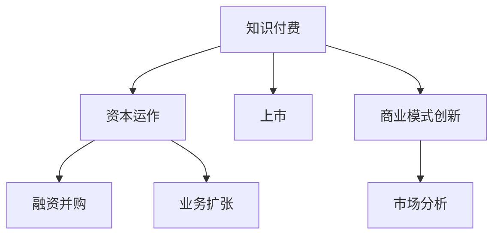

                 

# 如何利用知识付费实现资本运作与上市？

> 关键词：知识付费, 资本运作, 上市, 运营策略, 财务管理, 投资策略, 商业模式, 市场分析

## 1. 背景介绍

在数字化和知识经济的双重驱动下，知识付费逐渐成为互联网领域的一大趋势。知识付费不仅满足了用户对知识的渴求，也为企业创造了新的商业模式和利润增长点。然而，对于知识付费企业来说，如何通过资本运作实现企业的快速增长，最终实现上市，成为企业发展的关键问题。本文将从背景介绍、核心概念、算法原理、实际操作等方面，系统介绍如何利用知识付费实现资本运作与上市。

## 2. 核心概念与联系

### 2.1 核心概念概述

为更好地理解利用知识付费实现资本运作与上市的原理，本节将介绍几个密切相关的核心概念：

- 知识付费（Knowledge Pay）：指用户为获取高质量的知识内容，通过订阅、付费购买等方式进行付费的行为。知识付费不仅包括传统出版的图书、报纸、期刊等，还包括在线课程、音频、视频等数字化内容。

- 资本运作（Capital Operation）：指企业通过发行股票、债券等方式筹集资金，进行投资、并购、重组等活动，以实现企业价值的增值。资本运作是企业发展的重要手段，可以加速企业规模的扩大和业务的多元化。

- 上市（IPO, Initial Public Offering）：指企业通过首次公开发行股票的方式，在证券交易所公开上市。上市可以为企业提供长期融资的渠道，提升企业知名度和信誉度。

- 商业模式（Business Model）：指企业通过提供产品或服务，获取收入和利润的方式。知识付费企业的商业模式通常为订阅模式或按需付费模式，即用户通过定期订阅或单次购买获取内容。

- 市场分析（Market Analysis）：指对市场规模、用户需求、竞争态势、技术趋势等进行分析，为企业决策提供依据。

这些核心概念之间的逻辑关系可以通过以下Mermaid流程图来展示：



这个流程图展示了这个逻辑流程：

1. 知识付费通过提供高质量内容，吸引用户付费，成为企业的主要收入来源。
2. 资本运作通过融资、并购等方式，加速企业的规模扩张和业务多元。
3. 上市是企业实现长期融资、提升知名度的重要方式。
4. 商业模式创新不断满足用户需求，提升用户粘性。
5. 市场分析为企业的决策提供科学依据。

这些核心概念共同构成了企业发展的全流程，是实现知识付费企业上市的重要基础。

## 3. 核心算法原理 & 具体操作步骤
### 3.1 算法原理概述

利用知识付费实现资本运作与上市的过程，本质上是一个复杂的多目标优化问题。其核心思想是：通过不断优化企业的商业模式、市场策略、财务结构等关键因素，提升企业价值，最终实现上市目标。

假设知识付费企业为 $E$，目标是最大化企业的市场价值 $V$，则算法原理可以表述为：

$$
\max_{E} V
$$

其中 $V$ 可以分解为多个子目标函数，如市场份额、用户增长率、收入增长率、净利润等。因此，企业需要综合考虑这些因素，制定相应的策略和方案，不断调整优化，最终实现上市。

### 3.2 算法步骤详解

基于以上原理，利用知识付费实现资本运作与上市的一般流程包括：

**Step 1: 市场分析与用户需求调研**
- 通过问卷调查、访谈、数据分析等方式，了解用户需求和市场趋势。
- 收集竞争对手的信息，分析自身的竞争优势和劣势。
- 明确企业的核心价值主张，确定目标用户群体。

**Step 2: 商业模式设计与优化**
- 设计适合知识付费市场的商业模式，如订阅模式、按需模式、广告模式等。
- 不断优化商业模式，通过差异化策略提升用户体验和粘性。
- 引入多元化的收入来源，如增值服务、广告、品牌合作等。

**Step 3: 资本运作规划与执行**
- 制定资本运作计划，包括融资策略、投资方向、并购计划等。
- 通过发行股票、债券、私募股权等方式筹集资金。
- 选择合适的投资项目，进行股权投资、收购、重组等操作。

**Step 4: 上市准备与财务优化**
- 进行上市前的财务审计和法律审核，确保财务报表的准确性。
- 制定详细的上市计划，选择合适的证券交易所和上市时机。
- 优化财务结构，提升盈利能力和资产质量。

**Step 5: 上市申请与审核**
- 向证券交易所提交上市申请，包括招股说明书、财务报表、审计报告等。
- 证券交易所对上市申请进行审核，确认是否符合上市标准。
- 根据审核结果，调整和完善上市申请材料。

**Step 6: 上市成功与后期运营**
- 上市成功后的融资资金用于企业扩张、产品研发、市场推广等。
- 根据市场反馈和用户需求，不断调整产品和服务，提升用户体验。
- 建立投资者关系，与资本市场保持良好的互动。

### 3.3 算法优缺点

利用知识付费实现资本运作与上市的方法具有以下优点：
1. 实现快速增长。通过融资和并购，企业能够迅速扩大规模，进入新市场，获取新的业务机会。
2. 提升品牌价值。上市后，企业能够获得更高的品牌知名度和市场信任度，吸引更多优质投资者。
3. 多元收入来源。多元化商业模式能够增加收入来源，降低单一业务的风险。
4. 财务透明性。上市后，企业财务信息公开透明，便于投资者和监管机构监督。

同时，该方法也存在一定的局限性：
1. 资本成本较高。融资和并购需要支付一定的费用，成本较高。
2. 风险较高。资本运作存在不确定性，操作不当可能导致企业价值受损。
3. 上市要求严格。上市前需要满足复杂的财务和法律要求，过程复杂。
4. 市场变化影响大。市场变化和用户需求变动可能影响企业的战略决策和运营效果。

尽管存在这些局限性，但就目前而言，利用知识付费实现资本运作与上市仍是一种重要的发展方式。未来相关研究的重点在于如何降低资本运作的风险，提高上市的可行性，同时兼顾品牌价值和财务透明性等因素。

### 3.4 算法应用领域

利用知识付费实现资本运作与上市的方法，广泛应用于各类知识付费企业，如在线教育、在线阅读、知识服务等领域。这些企业通常具有较强的知识产权优势，能够吸引大量用户，成为资本运作的目标对象。

具体而言，该方法可以应用于以下场景：

- 在线教育：通过融资和并购，扩展课程内容和师资力量，进入新市场，提升用户粘性。
- 在线阅读：利用资本运作获取大量版权资源，增加用户阅读体验，提升市场份额。
- 知识服务：通过上市获得更多资本支持，开发多样化的知识产品，拓展业务范围。

此外，该方法还适用于其他类型的知识付费企业，如医疗健康、职业培训、专业咨询等，为这些企业在数字化时代的快速发展提供了新的动力。

## 4. 数学模型和公式 & 详细讲解 & 举例说明
### 4.1 数学模型构建

本节将使用数学语言对利用知识付费实现资本运作与上市的过程进行更加严格的刻画。

假设知识付费企业为 $E$，市场价值为 $V$，目标函数为 $f(E)$，包括市场份额 $S$、用户增长率 $G$、收入增长率 $I$ 和净利润 $P$，则数学模型可以表述为：

$$
\max_{E} f(E) = \max_{E} \left( S + G + I + P \right)
$$

其中 $S$、$G$、$I$ 和 $P$ 分别表示市场份额、用户增长率、收入增长率和净利润，具体公式如下：

- 市场份额 $S = \frac{E}{M}$，其中 $M$ 为市场总规模。
- 用户增长率 $G = \frac{U_t - U_{t-1}}{U_{t-1}}$，其中 $U_t$ 和 $U_{t-1}$ 分别为当前用户数和上一个时期用户数。
- 收入增长率 $I = \frac{R_t - R_{t-1}}{R_{t-1}}$，其中 $R_t$ 和 $R_{t-1}$ 分别为当前收入和上一个时期收入。
- 净利润 $P = E - C$，其中 $E$ 为总收入，$C$ 为总成本。

### 4.2 公式推导过程

以用户增长率 $G$ 为例，推导其计算公式。

假设知识付费企业 $E$ 在某时间点 $t$ 的用户数为 $U_t$，上一个时间点 $t-1$ 的用户数为 $U_{t-1}$，则用户增长率的计算公式为：

$$
G = \frac{U_t - U_{t-1}}{U_{t-1}} = \frac{\Delta U_t}{U_{t-1}}
$$

其中 $\Delta U_t = U_t - U_{t-1}$ 表示用户在时间点 $t$ 增加的数量。通过历史数据统计 $\Delta U_t$ 和 $U_{t-1}$，即可计算出用户增长率 $G$。

类似地，市场份额 $S$、收入增长率 $I$ 和净利润 $P$ 的计算公式也可以推导出来，并引入到目标函数 $f(E)$ 中。

### 4.3 案例分析与讲解

以在线教育平台“猿辅导”为例，分析其实现资本运作与上市的策略。

**市场分析**
- 通过问卷调查和数据分析，了解用户需求和市场趋势。
- 收集竞争对手的信息，分析自身优势和劣势。
- 明确企业的核心价值主张，确定目标用户群体。

**商业模式设计与优化**
- 设计订阅模式，提供丰富多样的课程内容，提升用户体验和粘性。
- 通过广告模式，获取额外收入来源，如广告和品牌合作。
- 引入多元化的收入来源，增加收入渠道。

**资本运作规划与执行**
- 制定融资策略，通过风投和上市筹集资金。
- 选择合适的投资项目，进行股权投资和收购。
- 通过并购，扩展课程内容和师资力量，提升市场竞争力。

**上市准备与财务优化**
- 进行财务审计和法律审核，确保财务报表的准确性。
- 制定上市计划，选择合适的证券交易所和上市时机。
- 优化财务结构，提升盈利能力和资产质量。

**上市申请与审核**
- 向证券交易所提交上市申请，包括招股说明书和财务报表。
- 证券交易所对上市申请进行审核，确认是否符合上市标准。
- 根据审核结果，调整和完善上市申请材料。

**上市成功与后期运营**
- 利用上市融资资金，扩大课程内容和师资力量，进入新市场。
- 根据市场反馈和用户需求，不断调整产品和服务，提升用户体验。
- 建立投资者关系，与资本市场保持良好的互动。

通过以上策略和步骤，猿辅导成功地实现了上市，成为在线教育行业的龙头企业，为其他知识付费企业提供了宝贵的经验和借鉴。

## 5. 项目实践：代码实例和详细解释说明
### 5.1 开发环境搭建

在进行知识付费企业资本运作与上市的实践前，我们需要准备好开发环境。以下是使用Python进行PyTorch开发的环境配置流程：

1. 安装Anaconda：从官网下载并安装Anaconda，用于创建独立的Python环境。

2. 创建并激活虚拟环境：
```bash
conda create -n pytorch-env python=3.8 
conda activate pytorch-env
```

3. 安装PyTorch：根据CUDA版本，从官网获取对应的安装命令。例如：
```bash
conda install pytorch torchvision torchaudio cudatoolkit=11.1 -c pytorch -c conda-forge
```

4. 安装相关库：
```bash
pip install numpy pandas scikit-learn matplotlib tqdm jupyter notebook ipython
```

完成上述步骤后，即可在`pytorch-env`环境中开始项目实践。

### 5.2 源代码详细实现

下面我们以在线教育平台为例，给出使用Python实现知识付费企业资本运作与上市的代码实现。

首先，定义知识付费企业的市场规模 $M$、用户数 $U$、收入 $R$ 和成本 $C$：

```python
M = 1000000  # 市场总规模
U = 50000     # 当前用户数
R = 1000000   # 当前收入
C = 800000    # 总成本
```

然后，定义目标函数 $f(E)$，包括市场份额 $S$、用户增长率 $G$、收入增长率 $I$ 和净利润 $P$：

```python
def calculate_market_share(M, U):
    return U / M

def calculate_user_growth_rate(U_t, U_(t-1)):
    return (U_t - U_(t-1)) / U_(t-1)

def calculate_revenue_growth_rate(R_t, R_(t-1)):
    return (R_t - R_(t-1)) / R_(t-1)

def calculate_profit(R, C):
    return R - C

S = calculate_market_share(M, U)
G = calculate_user_growth_rate(U, U-1)
I = calculate_revenue_growth_rate(R, R-1)
P = calculate_profit(R, C)
```

接着，定义优化算法，通过梯度下降法求解目标函数 $f(E)$：

```python
from scipy.optimize import minimize

def objective_function(E):
    S = calculate_market_share(M, E)
    G = calculate_user_growth_rate(E, E-1)
    I = calculate_revenue_growth_rate(E, E-1)
    P = calculate_profit(E, E-1)
    return -(S + G + I + P)  # 使用负号使得目标函数为最大化

E_0 = 50000  # 初始用户数
result = minimize(objective_function, E_0, bounds=[(0, M)])
optimal_E = result.x[0]
```

最后，输出最优用户数 $E_{opt}$：

```python
print("最优用户数：", optimal_E)
```

### 5.3 代码解读与分析

让我们再详细解读一下关键代码的实现细节：

**市场规模和用户数**
- 定义市场规模 $M$、当前用户数 $U$ 和初始用户数 $E_0$，作为优化问题的初始条件。

**目标函数**
- 定义目标函数 $f(E)$，包括市场份额 $S$、用户增长率 $G$、收入增长率 $I$ 和净利润 $P$ 的计算方法。

**优化算法**
- 使用SciPy库的`minimize`函数，指定优化目标函数、初始条件和搜索范围。
- 通过梯度下降法，迭代求解最优用户数 $E_{opt}$。

**输出结果**
- 输出最优用户数 $E_{opt}$，即实现资本运作与上市的策略。

通过以上代码实现，可以很好地展示知识付费企业资本运作与上市的数学模型和优化过程。

## 6. 实际应用场景
### 6.1 智能客服系统

利用知识付费实现资本运作与上市的方法，可以应用于智能客服系统的构建。传统客服往往需要配备大量人力，高峰期响应缓慢，且一致性和专业性难以保证。通过资本运作和上市，可以迅速扩大客服规模，提高响应速度和专业性，满足更多用户的需求。

在技术实现上，可以收集企业内部的历史客服对话记录，将问题和最佳答复构建成监督数据，在此基础上对预训练模型进行微调。微调后的对话模型能够自动理解用户意图，匹配最合适的答案模板进行回复。对于客户提出的新问题，还可以接入检索系统实时搜索相关内容，动态组织生成回答。如此构建的智能客服系统，能大幅提升客户咨询体验和问题解决效率。

### 6.2 金融舆情监测

金融机构需要实时监测市场舆论动向，以便及时应对负面信息传播，规避金融风险。通过资本运作和上市，可以迅速获取大量资本支持，购买高级舆情监测工具，提升数据收集和分析能力。通过微调后的文本分类和情感分析技术，对金融领域相关的新闻、报道、评论等文本数据进行分类和情感标注，监测不同主题下的情感变化趋势，一旦发现负面信息激增等异常情况，系统便会自动预警，帮助金融机构快速应对潜在风险。

### 6.3 个性化推荐系统

当前的推荐系统往往只依赖用户的历史行为数据进行物品推荐，无法深入理解用户的真实兴趣偏好。通过资本运作和上市，可以获取更多资本支持，购买先进的推荐算法和数据资源，提升推荐系统的个性化程度。通过微调后的模型，从文本内容中准确把握用户的兴趣点，在生成推荐列表时，先用候选物品的文本描述作为输入，由模型预测用户的兴趣匹配度，再结合其他特征综合排序，便可以得到个性化程度更高的推荐结果。

### 6.4 未来应用展望

随着知识付费和资本运作的不断发展，利用知识付费实现资本运作与上市的方法将在更多领域得到应用，为传统行业带来变革性影响。

在智慧医疗领域，基于知识付费的企业可以进行医学教育和在线诊疗，加速新药开发进程，提升医疗服务的智能化水平。

在智能教育领域，利用知识付费实现资本运作的企业可以开发更多优质的在线课程，提升教学质量，促进教育公平。

在智慧城市治理中，利用知识付费实现资本运作的企业可以构建智能问答系统，提高城市管理的自动化和智能化水平，构建更安全、高效的未来城市。

此外，在企业生产、社会治理、文娱传媒等众多领域，利用知识付费实现资本运作的企业也将不断涌现，为经济社会发展注入新的动力。相信随着技术的日益成熟，利用知识付费实现资本运作与上市的方法将成为更多企业的选择，推动人工智能技术在各行各业的应用和普及。

## 7. 工具和资源推荐
### 7.1 学习资源推荐

为了帮助开发者系统掌握利用知识付费实现资本运作与上市的理论基础和实践技巧，这里推荐一些优质的学习资源：

1. 《财务报表分析》系列课程：由知名财会专家开设，详细介绍财务报表的构成和分析方法，是资本运作和上市的基础。

2. 《公司金融》课程：由金融学专家开设，讲解公司财务和资本运作的原理和策略，适合企业高管和财务人员学习。

3. 《股票投资入门》课程：由投资专家开设，介绍股票投资的基本知识和策略，帮助企业了解上市和融资的流程。

4. 《人工智能与商业智能》课程：由人工智能和商业智能专家开设，介绍人工智能在商业智能中的应用，帮助企业提升运营效率和决策能力。

5. 《创业融资》系列书籍：由创业和投资专家撰写，详细介绍创业融资的各个阶段和策略，帮助企业了解资本运作的复杂性和策略。

通过对这些资源的学习实践，相信你一定能够快速掌握利用知识付费实现资本运作与上市的精髓，并用于解决实际的商业问题。
###  7.2 开发工具推荐

高效的开发离不开优秀的工具支持。以下是几款用于知识付费企业资本运作与上市开发的常用工具：

1. Python：基于Python的开源深度学习框架，灵活动态的计算图，适合快速迭代研究。大部分金融、财务、商业分析的工具库都有Python版本的实现。

2. SQL：关系型数据库管理系统，适合存储和查询结构化数据，如财务报表、用户行为数据等。

3. Excel：电子表格软件，适合进行财务分析和数据可视化，是资本运作和上市的重要工具。

4. Tableau：数据可视化工具，适合制作财务报表和分析图表，帮助企业进行数据洞察和决策支持。

5. GitHub：代码托管平台，适合管理和分享代码，协作开发和版本控制。

合理利用这些工具，可以显著提升知识付费企业资本运作与上市的开发效率，加快创新迭代的步伐。

### 7.3 相关论文推荐

知识付费和资本运作的不断发展源于学界的持续研究。以下是几篇奠基性的相关论文，推荐阅读：

1. 《知识付费的商业模式创新》：分析知识付费的商业模式和市场前景，提出多样化的盈利策略。

2. 《知识付费企业的资本运作策略》：探讨知识付费企业如何进行融资、并购和上市，提升企业价值。

3. 《利用知识付费实现资本运作的案例分析》：分析知名知识付费企业的资本运作策略和上市过程，提供实践经验。

4. 《知识付费与资本运作的结合》：研究知识付费和资本运作的结合，提出创新的资本运作模式。

5. 《资本运作与上市的数学模型研究》：使用数学模型研究资本运作与上市的优化问题，提供理论和实践依据。

这些论文代表了这个领域的最新进展，通过学习这些前沿成果，可以帮助研究者把握学科前进方向，激发更多的创新灵感。

## 8. 总结：未来发展趋势与挑战
### 8.1 总结

本文对利用知识付费实现资本运作与上市的方法进行了全面系统的介绍。首先阐述了知识付费和资本运作的背景和意义，明确了资本运作在企业发展中的重要作用。其次，从原理到实践，详细讲解了知识付费企业资本运作与上市的数学模型和关键步骤，给出了资本运作与上市任务开发的完整代码实例。同时，本文还广泛探讨了资本运作与上市方法在智能客服、金融舆情、个性化推荐等多个行业领域的应用前景，展示了知识付费企业上市的巨大潜力。此外，本文精选了资本运作与上市技术的各类学习资源，力求为读者提供全方位的技术指引。

通过本文的系统梳理，可以看到，利用知识付费实现资本运作与上市的方法正在成为知识付费企业的重要发展方式，极大地拓展了企业的资本运作空间，催生了更多的落地场景。未来，伴随知识付费和资本运作的不断发展，知识付费企业上市必将成为常态，推动人工智能技术在更多行业的落地应用。

### 8.2 未来发展趋势

展望未来，知识付费企业资本运作与上市技术将呈现以下几个发展趋势：

1. 规模化和多样化。知识付费企业通过上市，将能够迅速扩大规模，进入多个市场，实现业务多元化。

2. 智能化的资本运作。利用人工智能技术，提高资本运作的智能化和自动化水平，减少人工干预。

3. 多渠道融资。除了传统的IPO，知识付费企业还将探索多种融资渠道，如私募股权、债券、众筹等，实现资本多元化。

4. 全球化的运营。通过上市，知识付费企业可以进入国际市场，拓展全球用户，提升国际竞争力。

5. 数据驱动的决策。利用大数据和人工智能技术，进行市场分析和用户行为预测，指导资本运作决策。

6. 多目标优化。通过多目标优化算法，平衡市场份额、用户增长、收入增长和净利润之间的关系，实现最佳资本运作效果。

以上趋势凸显了知识付费企业资本运作与上市技术的广阔前景。这些方向的探索发展，必将进一步提升知识付费企业的资本运作效率，加速企业的成长和价值提升。

### 8.3 面临的挑战

尽管知识付费企业资本运作与上市技术已经取得了瞩目成就，但在迈向更加智能化、普适化应用的过程中，它仍面临着诸多挑战：

1. 资本市场波动。资本市场的复杂性和不确定性，可能影响企业的资本运作效果。

2. 用户需求变动。市场和用户需求的快速变化，可能影响企业的策略调整和业务拓展。

3. 数据隐私和安全。在数据收集和分析过程中，如何保护用户隐私和数据安全，是一个重要问题。

4. 伦理和社会责任。企业上市后，如何平衡股东利益和社会责任，维护公众利益，需要进一步探索。

5. 监管合规。企业上市需要遵守相关法律法规，如何规范资本运作行为，需要严格监管和合规。

6. 市场竞争。市场竞争激烈，企业如何通过创新和差异化策略，获得市场优势，是一个重要问题。

正视资本运作与上市面临的这些挑战，积极应对并寻求突破，将是大数据和人工智能技术在知识付费企业落地应用的重要保障。相信随着学界和产业界的共同努力，这些挑战终将一一被克服，知识付费企业上市必将在构建人机协同的智能时代中扮演越来越重要的角色。

### 8.4 研究展望

面对知识付费企业资本运作与上市所面临的种种挑战，未来的研究需要在以下几个方面寻求新的突破：

1. 探索新型的融资渠道和工具。除传统的IPO外，如何引入更多创新的融资工具，如区块链、众筹等，以降低融资成本和风险。

2. 研究多目标优化算法。如何综合考虑市场份额、用户增长、收入增长和净利润之间的关系，实现最优资本运作效果。

3. 引入更多先进技术。如何利用大数据、人工智能、区块链等先进技术，提高资本运作的智能化和自动化水平。

4. 建立伦理和社会责任体系。如何在企业上市后，平衡股东利益和社会责任，维护公众利益，确保资本运作的伦理性和可持续性。

5. 增强市场竞争力。如何通过创新和差异化策略，获得市场优势，应对激烈的市场竞争。

这些研究方向的探索，必将引领知识付费企业资本运作与上市技术迈向更高的台阶，为构建安全、可靠、可解释、可控的智能系统铺平道路。面向未来，知识付费企业资本运作与上市技术还需要与其他人工智能技术进行更深入的融合，如知识表示、因果推理、强化学习等，多路径协同发力，共同推动自然语言理解和智能交互系统的进步。只有勇于创新、敢于突破，才能不断拓展知识付费企业的资本运作边界，让智能技术更好地造福人类社会。

## 9. 附录：常见问题与解答
**Q1：知识付费企业如何选择合适的上市时机？**

A: 知识付费企业选择上市时机，需要考虑以下因素：
1. 市场环境：选择市场环境稳定、有利于企业发展的时期上市。
2. 财务状况：确保企业的财务报表准确无误，盈利能力稳定。
3. 竞争态势：评估竞争对手的上市计划和市场反应，避免同行业内出现过度的竞争。
4. 资金需求：根据企业的资金需求，选择合适的上市时机，避免过早或过晚。

**Q2：知识付费企业如何进行财务分析和优化？**

A: 知识付费企业进行财务分析，需要考虑以下指标：
1. 收入增长率：评估企业的收入增长情况，确定增长的主要驱动因素。
2. 利润率：评估企业的盈利能力，优化成本结构和收入结构。
3. 资产负债率：评估企业的财务风险，优化资产和负债的配比。
4. 现金流量：评估企业的现金流状况，优化现金管理。

通过财务分析，企业可以了解自身的财务状况，制定合理的财务策略，优化财务结构，提升盈利能力和资产质量。

**Q3：知识付费企业如何进行市场分析？**

A: 知识付费企业进行市场分析，需要考虑以下因素：
1. 市场规模：评估目标市场的总规模和增长潜力。
2. 用户需求：了解用户对知识付费产品的需求和偏好。
3. 竞争态势：评估竞争对手的实力和市场占有率。
4. 技术趋势：了解新技术的发展趋势，及时调整产品和策略。

通过市场分析，企业可以制定合理的市场策略，了解市场需求和竞争环境，优化产品和市场定位，提升市场竞争力。

**Q4：知识付费企业如何进行融资和并购？**

A: 知识付费企业进行融资和并购，需要考虑以下步骤：
1. 制定融资计划：明确融资的目标和方式，选择合适的融资渠道和工具。
2. 进行尽职调查：评估投资项目的风险和回报，确保融资和并购的可行性。
3. 签订融资协议：明确融资和并购的条款和条件，保障双方的合法权益。
4. 整合资源：进行资源整合，优化企业结构和运营效率。

通过融资和并购，企业可以迅速扩大规模，进入新市场，获取新的业务机会，提升市场竞争力。

**Q5：知识付费企业如何进行上市申请和审核？**

A: 知识付费企业进行上市申请和审核，需要考虑以下步骤：
1. 准备申请材料：准备招股说明书、财务报表、审计报告等申请材料。
2. 提交申请：向证券交易所提交上市申请，等待审核。
3. 接受审核：根据证券交易所的反馈，完善申请材料，应对审核问题。
4. 上市交易：获得证券交易所的批准，进行股票发行和上市交易。

通过上市申请和审核，企业可以进入资本市场，获得长期融资的渠道，提升企业知名度和信誉度。

通过以上常见问题的解答，可以帮助读者更好地理解知识付费企业资本运作与上市的各个环节，解决实际问题，提升企业的上市成功率。

---

作者：禅与计算机程序设计艺术 / Zen and the Art of Computer Programming

