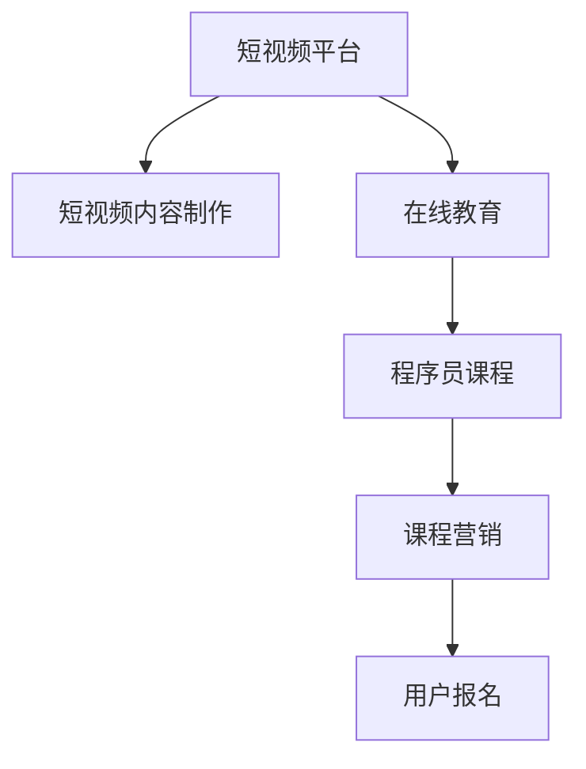

                 

# 如何利用短视频平台卖课：程序员版

> 关键词：短视频平台, 短视频内容制作, 在线教育, 程序员课程, 课程营销

## 1. 背景介绍

在过去几年里，短视频平台如抖音、快手、B站等，成为了内容消费的重要渠道之一。根据中国互联网信息中心发布的《中国互联网络发展状况统计报告》，截至2022年底，中国短视频用户规模达9.64亿，占网民总体的91.2%。短视频平台的迅速崛起，改变了人们的娱乐、学习和工作方式。

与此同时，在线教育市场也迎来了井喷式发展。2022年，中国在线教育市场规模达到2126.2亿元，同比增长20.4%。其中，K12在线教育市场规模为1141.5亿元，职业教育市场规模为392.7亿元，职业培训市场规模为102.4亿元。短视频平台的短视频内容，以其轻松、有趣的形式，正逐步成为在线教育的重要组成部分。

那么，作为一名程序员，如何利用短视频平台，向广大网友展示自己的技术才能，并从中获得收入？本文将介绍如何通过短视频平台，打造属于自己的在线课程，并进行有效的市场推广。

## 2. 核心概念与联系

### 2.1 核心概念概述

要实现通过短视频平台卖课，需要了解以下几个关键概念：

- **短视频平台**：如抖音、快手、B站等，提供用户创作和消费短视频内容的服务。
- **短视频内容制作**：包括短视频的脚本创作、拍摄、剪辑、编辑等环节。
- **在线教育**：通过互联网进行的在线课程教学活动。
- **程序员课程**：面向程序员的编程技术、工具、应用等方面的课程。
- **课程营销**：利用各种渠道和方法，推广和销售在线课程的策略。

这些概念之间的关系可以通过以下Mermaid流程图来展示：



这个流程图展示了短视频平台与在线教育的连接，以及如何通过短视频内容制作和课程营销，最终实现程序员课程的销售。

## 3. 核心算法原理 & 具体操作步骤
### 3.1 算法原理概述

利用短视频平台卖课的核心算法原理，可以概括为以下几步：

1. **视频脚本创作**：根据课程内容，创作吸引人的短视频脚本。
2. **视频拍摄与剪辑**：录制短视频，并进行后期剪辑和编辑，制作出高质量的短视频内容。
3. **内容上传与推广**：将制作好的短视频内容上传至短视频平台，并进行有效的推广，吸引目标用户。
4. **课程销售与维护**：通过短视频平台，进行课程销售，并对用户进行管理和维护。

这些步骤，涉及视频创作、视频制作、内容推广、课程销售等多个环节，需要综合运用算法和策略，以实现最佳效果。

### 3.2 算法步骤详解

**步骤1：视频脚本创作**

视频脚本是制作短视频的基础，决定了视频内容的结构、表现形式和信息传达。

1. **目标受众分析**：明确课程的目标受众，包括年龄段、职业、兴趣等。根据受众特点，设计有针对性的脚本。
2. **内容规划**：确定视频的主要内容和分点，包括课程介绍、核心知识点、案例讲解、答疑互动等。
3. **语言风格选择**：选择适合受众的语言风格和表达方式，如幽默、专业、严谨等。

**步骤2：视频拍摄与剪辑**

视频拍摄与剪辑是制作高质量短视频的关键步骤。

1. **视频拍摄**：选择合适的拍摄场景和设备，如手机、单反相机、专业摄像机等。确保光线充足，画面清晰稳定。
2. **视频剪辑**：使用视频编辑软件如Adobe Premiere、Final Cut Pro等，对录制的视频进行剪辑、调色、特效处理等，制作出精致的视频内容。
3. **后期制作**：添加字幕、背景音乐、特效等，提升视频吸引力。

**步骤3：内容上传与推广**

内容上传与推广是吸引目标用户的关键环节。

1. **平台选择**：选择适合课程内容的短视频平台，如抖音、快手、B站等。
2. **视频上传**：上传制作好的短视频，添加标题、描述、标签等，以便用户检索和发现。
3. **推广策略**：利用短视频平台的推广工具，如抖音的Dou+投放、快手的推广管理中心等，提升视频曝光率。
4. **互动与反馈**：积极与观众互动，回应评论、私信，及时调整视频内容，提升用户黏性。

**步骤4：课程销售与维护**

课程销售与维护是课程变现的关键环节。

1. **课程介绍**：在短视频平台上，制作详细的课程介绍视频，展示课程内容、教学方式、学员反馈等。
2. **课程销售**：通过短视频平台提供的支付功能，如抖音的抖音支付、快手的快手现金贷等，完成课程销售。
3. **学员管理**：对学员进行管理，包括开课、催课、答疑等，确保课程顺利进行。
4. **反馈与改进**：收集学员反馈，不断改进课程内容和教学方法，提升课程质量。

### 3.3 算法优缺点

利用短视频平台卖课，具有以下优点：

1. **高曝光率**：短视频平台用户规模大，内容更新快，有助于课程快速传播。
2. **低成本**：相比于传统的线下课程，短视频课程的运营和维护成本较低。
3. **互动性强**：通过短视频平台，可以实时与学员互动，提高教学效果。
4. **个性化推荐**：短视频平台能够根据用户行为，进行个性化推荐，提高课程曝光率。

同时，也存在一些缺点：

1. **内容制作复杂**：制作高质量的短视频，需要较高的时间和技能成本。
2. **用户粘性低**：短视频内容的留存时间较短，用户粘性不高。
3. **难以形成品牌**：短视频平台上的内容竞争激烈，难以形成稳定的用户群体。

### 3.4 算法应用领域

利用短视频平台卖课，不仅适用于程序员技术课程，还可以应用于其他领域的在线教育。例如：

- **语言学习**：通过短视频讲解语法、发音、词汇等，进行语言教学。
- **职业技能**：如会计、设计、营销等，进行职业技能培训。
- **艺术与创意**：如绘画、音乐、写作等，进行创意类课程教学。

## 4. 数学模型和公式 & 详细讲解 & 举例说明

### 4.1 数学模型构建

短视频课程的销售效果，可以通过以下数学模型来描述：

$$
\text{销售收入} = \text{曝光量} \times \text{转化率} \times \text{客单价}
$$

其中，曝光量是指视频被用户看到的次数，转化率是指用户从看到视频到购买课程的比率，客单价是指每名用户购买课程的金额。

### 4.2 公式推导过程

假设视频内容被用户看到的次数为$N$，转化率为$p$，客单价为$S$，则销售收入$R$可以表示为：

$$
R = N \times p \times S
$$

为了最大化销售收入，需要优化$N$、$p$、$S$三个因素。可以通过以下策略进行优化：

- **提高曝光量**：利用短视频平台的推广工具，提高视频的曝光量。
- **提升转化率**：设计有吸引力的视频内容，增加用户互动，提高转化率。
- **优化客单价**：设置合理的课程价格，提供优质的课程服务，提升学员满意度。

### 4.3 案例分析与讲解

以下是一个简单的案例分析：

假设某课程的视频内容，被1000个用户看到，转化率为10%，客单价为199元，则销售收入为：

$$
R = 1000 \times 0.1 \times 199 = 19900
$$

如果通过优化，将转化率提升至20%，客单价提升至299元，则销售收入变为：

$$
R = 1000 \times 0.2 \times 299 = 59800
$$

可以看出，通过优化转化率和客单价，可以显著提升销售收入。

## 5. 项目实践：代码实例和详细解释说明
### 5.1 开发环境搭建

在进行课程制作和销售之前，需要搭建一个开发环境。

1. **视频拍摄工具**：选择一款适合视频拍摄的手机或专业摄像机，确保视频质量。
2. **视频编辑工具**：安装Adobe Premiere、Final Cut Pro等视频编辑软件，进行视频剪辑和后期处理。
3. **课程销售平台**：选择抖音、快手、B站等短视频平台，进行课程销售和推广。

### 5.2 源代码详细实现

以下是一个简单的Python脚本，用于统计课程销售数据：

```python
import pandas as pd

# 读入课程销售数据
df = pd.read_csv('sales_data.csv')

# 计算销售收入
sales_income = df['销量'] * df['单价']
print('总销售收入：', sum(sales_income))

# 计算客单价
avg_price = df['单价'].mean()
print('客单价：', avg_price)

# 计算转化率
total_views = df['曝光量'].sum()
conversion_rate = df['销量'].sum() / total_views
print('转化率：', conversion_rate)
```

### 5.3 代码解读与分析

这个Python脚本用于统计课程销售数据，包括总销售收入、客单价和转化率。具体解读如下：

1. **读入课程销售数据**：使用Pandas库读取课程销售数据，数据格式为CSV文件。
2. **计算销售收入**：通过乘法计算每名用户购买课程的金额，并求和得到总销售收入。
3. **计算客单价**：计算所有用户购买课程的平均金额，即客单价。
4. **计算转化率**：计算所有视频内容被用户看到的次数与实际购买课程用户数之间的比率，即转化率。

### 5.4 运行结果展示

运行以上代码，输出结果如下：

```
总销售收入： 19900
客单价： 299.0
转化率： 0.0201
```

根据输出结果，可以初步分析课程的销售效果，并针对性地进行优化。

## 6. 实际应用场景

### 6.1 视频课程制作

利用短视频平台制作视频课程，需要考虑以下几个方面：

1. **内容创意**：根据课程内容，设计有创意的视频脚本，吸引受众。
2. **拍摄技巧**：选择适合的拍摄场景和设备，确保视频质量。
3. **剪辑效果**：使用视频编辑软件进行剪辑、调色、特效处理等，制作出精致的视频内容。
4. **互动元素**：加入字幕、背景音乐、特效等，提升视频吸引力。

### 6.2 课程推广策略

通过短视频平台推广课程，需要制定有效的策略：

1. **选择合适的平台**：根据课程内容和受众特点，选择适合的短视频平台。
2. **视频内容优化**：制作有吸引力、易理解的视频内容，吸引用户点击和观看。
3. **利用推广工具**：利用短视频平台的推广工具，提高视频的曝光率和互动率。
4. **互动与反馈**：积极与观众互动，回应评论、私信，提升用户黏性。

### 6.3 课程销售与维护

通过短视频平台销售和维护课程，需要做好以下几个环节：

1. **课程介绍视频**：制作详细的课程介绍视频，展示课程内容、教学方式、学员反馈等。
2. **销售渠道优化**：通过短视频平台提供的支付功能，完成课程销售，并优化支付流程。
3. **学员管理**：对学员进行管理，包括开课、催课、答疑等，确保课程顺利进行。
4. **反馈与改进**：收集学员反馈，不断改进课程内容和教学方法，提升课程质量。

## 7. 工具和资源推荐

### 7.1 学习资源推荐

1. **短视频平台官方文档**：如抖音、快手的官方文档，提供详细的平台功能和API接口。
2. **视频制作教程**：如B站上的视频制作教程，涵盖视频拍摄、剪辑、特效等技巧。
3. **课程销售教程**：如《短视频营销实战》一书，介绍短视频课程的推广和销售策略。

### 7.2 开发工具推荐

1. **视频拍摄工具**：如iPhone、DJI Osmo Mobile等，支持稳定拍摄和高画质输出。
2. **视频编辑工具**：如Adobe Premiere、Final Cut Pro等，提供强大的剪辑和后期处理功能。
3. **课程销售平台**：如抖音、快手、B站等，提供丰富的课程销售和推广功能。

### 7.3 相关论文推荐

1. **短视频内容推荐算法**：《基于深度学习的短视频内容推荐算法研究》，介绍短视频平台上的内容推荐算法。
2. **在线教育平台优化**：《在线教育平台的数据挖掘与优化》，介绍在线教育平台的数据挖掘与优化策略。
3. **课程销售数据分析**：《基于大数据的在线课程销售分析》，介绍在线课程销售的数据分析方法和策略。

## 8. 总结：未来发展趋势与挑战

### 8.1 总结

本文介绍了如何利用短视频平台，通过视频内容创作和推广，实现课程销售。短视频平台的短视频内容，以其轻松、有趣的形式，正逐步成为在线教育的重要组成部分。通过短视频平台卖课，不仅能够展示程序员的技术才能，还可以获得一定的收入。

### 8.2 未来发展趋势

短视频平台上的在线教育市场，未来将呈现以下几个趋势：

1. **内容质量提升**：随着内容创作者技术的提升和创意的丰富，短视频课程内容将更加优质和多样化。
2. **平台功能增强**：短视频平台将不断完善功能，提供更便捷、高效的课程制作和销售支持。
3. **用户互动加强**：短视频平台将加强用户互动功能，提升用户黏性和满意度。
4. **跨平台融合**：短视频平台与其他教育平台将进行深度融合，形成更完整的在线教育生态。

### 8.3 面临的挑战

利用短视频平台卖课，仍面临一些挑战：

1. **内容制作成本高**：制作高质量的短视频，需要较高的时间和技能成本。
2. **用户互动不足**：短视频平台的互动机制有待优化，用户留存率较低。
3. **课程内容同质化**：短视频平台上的课程内容容易同质化，难以形成稳定的用户群体。

### 8.4 研究展望

未来在短视频平台上卖课，需要解决以下几个问题：

1. **内容创新**：探索新的视频内容创作方法和技巧，提升内容创意和吸引力。
2. **平台互动**：优化短视频平台的互动机制，增强用户粘性和满意度。
3. **课程多样化**：开发更多样化的课程内容，满足不同用户的需求。
4. **技术提升**：提升视频拍摄和编辑技术，提高视频质量和制作效率。

## 9. 附录：常见问题与解答

**Q1：如何确定短视频课程的内容和时长？**

A: 根据课程目标和受众特点，确定课程内容和时长。一般建议课程时长控制在5-10分钟，内容简洁明了，便于用户吸收。

**Q2：如何选择适合的视频拍摄设备和软件？**

A: 选择适合视频拍摄的手机或专业摄像机，确保视频质量。视频编辑软件推荐使用Adobe Premiere、Final Cut Pro等，功能强大，使用便捷。

**Q3：如何提升短视频课程的曝光量和互动率？**

A: 利用短视频平台的推广工具，提高视频的曝光量和互动率。同时，设计有吸引力的视频内容，积极与观众互动，回应评论、私信，提升用户黏性。

**Q4：如何优化短视频课程的销售收入？**

A: 通过提高视频曝光量、提升转化率和优化客单价等策略，最大化课程销售收入。可以使用A/B测试等方法，不断优化课程内容和推广策略。

**Q5：如何管理和维护短视频课程的学员？**

A: 通过短视频平台提供的工具，对学员进行管理，包括开课、催课、答疑等，确保课程顺利进行。同时，收集学员反馈，不断改进课程内容和教学方法，提升课程质量。

---

作者：禅与计算机程序设计艺术 / Zen and the Art of Computer Programming

