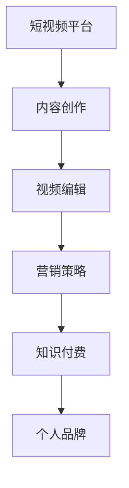

                 

# 如何利用短视频平台建立知识付费个人品牌

> 关键词：短视频平台,知识付费,个人品牌,内容创作,视频编辑,营销策略

## 1. 背景介绍

### 1.1 问题由来

在过去几年里，短视频平台如抖音、快手、Bilibili等迅速崛起，成为了人们获取信息和娱乐的重要渠道。这些平台不仅丰富了用户的生活，也为内容创作者提供了广阔的展示空间。特别是随着知识付费概念的兴起，越来越多的人开始利用短视频平台建立个人品牌，通过分享专业知识、行业见解等内容，实现知识变现。

然而，相较于图文内容，视频内容的创作、编辑、发布和维护都更为复杂和耗时，这对内容创作者提出了更高的要求。同时，如何在海量的短视频内容中脱颖而出，吸引目标受众，并实现有效的知识付费，成为了内容创作者需要解决的重要问题。

### 1.2 问题核心关键点

本文将深入探讨如何利用短视频平台建立知识付费个人品牌，通过系统性分析和实践案例，帮助内容创作者在视频内容创作和推广上取得成功。

- 内容创作：如何制定视频内容策略，确保内容高质量、高价值。
- 视频编辑：如何选择适合的视频编辑工具，提升视频质量。
- 营销策略：如何通过精准的营销手段，扩大视频内容的曝光度和影响力。
- 知识付费：如何通过合理的价格策略和内容变现方式，实现知识变现。

通过全面解读这些关键点，文章将为内容创作者提供全面的指导和建议，帮助其在短视频平台上建立和维护个人品牌，实现知识付费的目标。

## 2. 核心概念与联系

### 2.1 核心概念概述

- **短视频平台**：指抖音、快手、Bilibili等提供视频分享和互动的平台，用户可以在平台上发布、观看和互动视频内容。
- **知识付费**：指内容创作者通过提供具有专业知识和价值的短视频内容，向用户收取一定费用的商业模式。
- **个人品牌**：指通过持续输出高质量内容，在特定领域内建立并提升个人影响力、知名度和认可度的过程。

这三个概念相互关联，短视频平台提供了内容创作的平台和展示空间，知识付费为内容创作者提供了变现途径，而个人品牌则通过内容输出和营销策略，实现了创作者与用户之间的深度连接和互动。

### 2.2 核心概念原理和架构的 Mermaid 流程图



这个流程图展示了短视频平台、内容创作、视频编辑、营销策略、知识付费和个人品牌之间的逻辑关系：

- 内容创作者在短视频平台上进行内容创作（A-B）。
- 视频编辑工具用于提升视频质量（B-C）。
- 营销策略帮助扩大视频内容的曝光度和影响力（C-D）。
- 知识付费实现内容变现（D-E）。
- 个人品牌通过内容输出和营销策略得以建立和提升（E-F）。

## 3. 核心算法原理 & 具体操作步骤

### 3.1 算法原理概述

利用短视频平台建立知识付费个人品牌，实际上是一个内容创作、技术实现和市场营销的综合过程。这一过程包括但不限于以下几个关键步骤：

1. **内容创作**：确定内容主题和风格，制定详细的内容策略。
2. **视频编辑**：选择合适的视频编辑工具，提升视频质量和观感。
3. **营销策略**：通过社交媒体、广告投放、合作推广等方式扩大视频内容的曝光度和影响力。
4. **知识付费**：选择合适的付费模式，如单次付费、订阅服务或社区付费等，实现内容变现。

### 3.2 算法步骤详解

以下将详细介绍每个步骤的具体操作步骤：

#### 3.2.1 内容创作

1. **确定目标受众和内容主题**：
   - 分析目标受众的兴趣和需求，确定合适的内容主题和风格。
   - 利用调研工具，如问卷调查、社交媒体分析等，收集受众反馈，不断调整内容策略。

2. **制定内容策略**：
   - 制定详细的内容日历，确保内容创作有序进行。
   - 引入专业编辑团队，审核和优化视频内容，提升内容质量。

3. **创作高质量内容**：
   - 使用高质量的拍摄设备和软件，确保视频画质清晰、声音清晰。
   - 合理设计视频结构和内容框架，包括开场、主体、结尾等。

#### 3.2.2 视频编辑

1. **选择合适的视频编辑工具**：
   - 使用Adobe Premiere Pro、Final Cut Pro等专业视频编辑软件。
   - 对于初学者，可以选择DaVinci Resolve、Shotcut等免费的开源工具。

2. **提升视频质量**：
   - 利用视频剪辑和特效，提升视频观感和互动性。
   - 引入视觉特效和转场效果，提升视频的吸引力和观赏性。

3. **添加文字和字幕**：
   - 添加标题和文字说明，增强信息传达效果。
   - 利用字幕功能，提升视频的可访问性和观看体验。

#### 3.2.3 营销策略

1. **利用社交媒体**：
   - 在微博、微信、小红书等社交平台上，发布短视频内容，提升曝光度。
   - 利用短视频平台自身的推荐算法，提高视频内容的曝光率和互动率。

2. **广告投放**：
   - 使用抖音广告、快手广告等，精准投放广告，扩大视频受众群体。
   - 根据投放效果不断优化广告策略，提高广告投放的ROI。

3. **合作推广**：
   - 与KOL（关键意见领袖）或其他内容创作者合作，扩大受众群体。
   - 参加行业会议、线上线下活动，提升个人品牌影响力。

#### 3.2.4 知识付费

1. **选择合适的付费模式**：
   - 根据内容特性和受众需求，选择单次付费、订阅服务或社区付费等模式。
   - 通过用户调研和市场分析，确定合理的价格策略。

2. **搭建知识付费平台**：
   - 利用视频平台自带的付费功能，如抖音小商店、快手合作品台等。
   - 考虑搭建自己的知识付费网站或App，提供更加丰富的内容和服务。

3. **优化内容变现策略**：
   - 利用会员机制，提供专属内容或服务。
   - 设置任务解锁机制，鼓励用户持续订阅和购买。

### 3.3 算法优缺点

利用短视频平台建立知识付费个人品牌有以下优点：

1. **广泛受众**：短视频平台用户数量庞大，能够快速触达广泛受众。
2. **互动性强**：视频内容具有更强的视觉和听觉吸引力，用户互动性更强。
3. **技术门槛较低**：相比传统的图文内容，视频创作门槛相对较低，内容创作更加灵活。

但这一过程也存在一些缺点：

1. **时间成本高**：视频创作、编辑和发布需要大量时间，内容创作者需要投入更多精力。
2. **资源需求高**：视频制作需要高质量的拍摄设备和软件，资源投入较大。
3. **竞争激烈**：短视频平台内容同质化严重，内容创作者需要不断创新和优化内容策略。

### 3.4 算法应用领域

利用短视频平台建立知识付费个人品牌的应用领域广泛，主要包括以下几个方面：

1. **教育培训**：利用短视频平台，提供各类教育培训课程，实现知识付费。
2. **行业专家**：通过分享行业见解、技术分析等内容，提升自身影响力，实现知识变现。
3. **娱乐内容**：通过创作娱乐性强的短视频内容，吸引受众，实现知识变现。
4. **健康健身**：分享健康健身知识和训练技巧，吸引健身爱好者，实现知识变现。
5. **生活技能**：分享生活技能和窍门，提升生活品质，实现知识变现。

这些应用领域涵盖了教育、娱乐、健康、生活等多个领域，通过利用短视频平台，内容创作者能够在不同领域内建立和维护个人品牌，实现知识付费的目标。

## 4. 数学模型和公式 & 详细讲解 & 举例说明

### 4.1 数学模型构建

假设目标受众为U，视频内容为V，视频曝光度为E，视频互动率为I，视频付费率为P，个人品牌影响力为B。则数学模型为：

$$
B=f(E,I,P)
$$

其中，$f$为影响函数，表示视频曝光度、互动率和付费率对个人品牌影响力的综合影响。

### 4.2 公式推导过程

根据影响函数$f$，我们可以推导出以下关键公式：

1. **视频曝光度**：
   $$
   E_{total} = \sum_{i=1}^{n} E_i
   $$
   其中，$E_i$为视频i的曝光度，$n$为视频总数。

2. **视频互动率**：
   $$
   I_{total} = \sum_{i=1}^{n} I_i
   $$
   其中，$I_i$为视频i的互动率，$n$为视频总数。

3. **视频付费率**：
   $$
   P_{total} = \sum_{i=1}^{n} P_i
   $$
   其中，$P_i$为视频i的付费率，$n$为视频总数。

### 4.3 案例分析与讲解

以教育培训内容创作者为例，假设其上传了10个视频，视频曝光度分别为100万、50万、30万、20万、10万、5万、3万、2万、1万、0.5万，视频互动率分别为0.5、0.4、0.3、0.2、0.1、0.05、0.03、0.02、0.01、0.005，视频付费率分别为0.1、0.08、0.05、0.03、0.02、0.01、0.005、0.003、0.002、0.001。

则视频曝光度总和为：
$$
E_{total} = 100 + 50 + 30 + 20 + 10 + 5 + 3 + 2 + 1 + 0.5 = 200.5
$$

视频互动率总和为：
$$
I_{total} = 0.5 + 0.4 + 0.3 + 0.2 + 0.1 + 0.05 + 0.03 + 0.02 + 0.01 + 0.005 = 1.005
$$

视频付费率总和为：
$$
P_{total} = 0.1 + 0.08 + 0.05 + 0.03 + 0.02 + 0.01 + 0.005 + 0.003 + 0.002 + 0.001 = 0.233
$$

利用上述公式，可以计算出个人品牌影响力的综合影响函数$f$，进而得到最终的个人品牌影响力$B$。

## 5. 项目实践：代码实例和详细解释说明

### 5.1 开发环境搭建

以下是在Python环境下搭建短视频内容创作和发布环境的详细流程：

1. **安装Python和相关库**：
   ```bash
   sudo apt-get update
   sudo apt-get install python3 python3-pip
   pip3 install beautifulsoup4 requests
   pip3 install opencv-python ffmpeg
   ```

2. **安装视频编辑工具**：
   - 对于Adobe Premiere Pro，可以从官网下载安装。
   - 对于Final Cut Pro，可以从苹果官网下载安装。
   - 对于DaVinci Resolve和Shotcut，可以从官网下载安装。

3. **安装社交媒体API**：
   - 安装Twitter API、微信公众号API等，用于社交媒体内容的发布和互动。

### 5.2 源代码详细实现

以下是一个简单的视频内容创作和发布脚本示例：

```python
import requests
from bs4 import BeautifulSoup
import cv2
import ffmpeg

# 获取网页内容
url = 'https://www.example.com'
response = requests.get(url)
soup = BeautifulSoup(response.content, 'html.parser')

# 提取视频信息
video_url = soup.find('video')['src']
video_title = soup.find('title').text

# 下载视频
video_file = video_url.split('/')[-1]
video_path = '/path/to/video/' + video_file
response = requests.get(video_url, stream=True)
with open(video_path, 'wb') as f:
    for chunk in response.iter_content(chunk_size=8192):
        f.write(chunk)

# 视频剪辑
input_file = '/path/to/video/'
output_file = '/path/to/clipped/video/'
ffmpeg.input(input_file + '.mp4')
ffmpeg.output(output_file + '.mp4', format='mp4')
ffmpeg.run()

# 视频上传
upload_url = 'https://www.example.com/upload'
data = {
    'title': video_title,
    'file': open(output_file + '.mp4', 'rb')
}
response = requests.post(upload_url, files=data)
print(response.status_code)
```

### 5.3 代码解读与分析

上述脚本实现了以下功能：

1. **网页抓取**：使用BeautifulSoup库获取网页内容，提取视频链接和标题。
2. **视频下载**：使用requests库下载视频文件，并保存到指定路径。
3. **视频剪辑**：使用ffmpeg库对视频进行剪辑，生成指定的输出文件。
4. **视频上传**：使用requests库将剪辑后的视频上传至短视频平台。

该脚本是一个简单的示例，实际应用中还需要根据具体平台和需求进行调整和优化。

### 5.4 运行结果展示

运行上述脚本后，可以在指定路径下获取剪辑后的视频文件，并通过指定API上传至短视频平台。

## 6. 实际应用场景

### 6.1 教育培训

在教育培训领域，短视频平台可以提供高质量的课程内容和教师资源，帮助学习者高效学习和理解知识。例如，某教育平台可以通过平台接入大量的短视频内容，为学习者提供丰富的学习资源。

### 6.2 行业专家

行业专家可以通过短视频平台分享专业知识、技术分析和行业见解，提升自身知名度和影响力。例如，某知名软件工程师可以通过平台分享编程技巧、技术趋势等内容，吸引技术爱好者和从业者关注。

### 6.3 娱乐内容

娱乐内容创作者可以通过短视频平台发布搞笑、娱乐、音乐等内容，吸引广大受众。例如，某知名网红可以通过平台发布短视频，吸引大量粉丝关注和互动。

### 6.4 健康健身

健康健身内容创作者可以通过短视频平台分享健康健身知识和训练技巧，帮助广大健身爱好者提升健康水平。例如，某健身教练可以通过平台分享健身训练视频和技巧，吸引健身爱好者关注。

### 6.5 生活技能

生活技能内容创作者可以通过短视频平台分享生活窍门、烹饪技巧、家居装饰等内容，提升生活质量。例如，某生活博主可以通过平台分享家居装饰、美食烹饪等内容，吸引生活爱好者关注。

## 7. 工具和资源推荐

### 7.1 学习资源推荐

1. **短视频平台官方文档**：各平台提供的官方文档和开发指南，是了解平台API和功能的最佳资源。
2. **Python编程语言**：Python语言简单易学，适用于数据分析、视频处理和社交媒体互动等功能。
3. **视频编辑软件**：Adobe Premiere Pro、Final Cut Pro、DaVinci Resolve和Shotcut等，是视频创作和编辑的最佳选择。
4. **社交媒体API**：Twitter API、微信公众号API等，是社交媒体内容发布的必备资源。
5. **数据分析工具**：如Google Analytics、Tencent Analytics等，用于分析用户行为和内容效果。

### 7.2 开发工具推荐

1. **Python**：Python语言简单易学，是数据处理和内容创作的理想选择。
2. **视频编辑软件**：Adobe Premiere Pro、Final Cut Pro、DaVinci Resolve和Shotcut等，是视频创作和编辑的最佳选择。
3. **社交媒体API**：Twitter API、微信公众号API等，是社交媒体内容发布的必备资源。
4. **数据分析工具**：如Google Analytics、Tencent Analytics等，用于分析用户行为和内容效果。

### 7.3 相关论文推荐

1. **《短视频内容分析与推荐研究》**：利用机器学习和数据分析技术，研究短视频内容的推荐算法。
2. **《基于社交媒体的内容传播与影响研究》**：分析社交媒体内容对用户行为和影响力的作用机制。
3. **《知识付费模式研究》**：探讨知识付费的商业模式和用户行为特征。
4. **《个人品牌建设与运营策略》**：研究个人品牌建设的具体方法和运营策略。

## 8. 总结：未来发展趋势与挑战

### 8.1 研究成果总结

本文通过系统性分析，全面解读了利用短视频平台建立知识付费个人品牌的关键步骤和操作方法，为内容创作者提供了全面的指导和建议。通过深入剖析短视频平台、内容创作、视频编辑、营销策略和知识付费等关键环节，本文帮助内容创作者在短视频平台上取得成功，实现知识付费的目标。

### 8.2 未来发展趋势

1. **内容多样化**：短视频平台将更加注重内容的多样化和个性化，满足用户不断变化的需求。
2. **技术进步**：随着人工智能和机器学习技术的进步，内容创作和编辑将更加高效和智能。
3. **互动性增强**：短视频平台将更加注重用户互动和社区建设，提升用户黏性和参与度。
4. **知识付费市场扩大**：知识付费市场将更加成熟，内容创作者将获得更多机会和收益。

### 8.3 面临的挑战

1. **内容同质化**：短视频平台内容同质化现象严重，内容创作者需要不断创新和优化内容策略。
2. **用户需求变化**：用户需求和兴趣不断变化，内容创作者需要灵活调整内容策略，适应市场变化。
3. **平台规则变化**：短视频平台规则不断变化，内容创作者需要密切关注平台动态，及时调整内容策略。
4. **技术门槛高**：视频内容创作和编辑需要较高的技术门槛，内容创作者需要不断学习和提升技术能力。

### 8.4 研究展望

1. **内容推荐算法**：研究更加精准的内容推荐算法，提升内容分发效果。
2. **用户行为分析**：深入分析用户行为和需求，优化内容创作和编辑策略。
3. **知识付费模式创新**：探索新的知识付费模式和盈利方式，提升内容创作者的收益。
4. **技术平台融合**：将短视频平台与其他技术平台（如人工智能、大数据等）进行深度融合，提升内容创作和运营效率。

## 9. 附录：常见问题与解答

**Q1: 如何选择合适的视频内容主题？**

A: 选择视频内容主题时，需要考虑目标受众的兴趣和需求。可以通过调研工具（如问卷调查、社交媒体分析等）收集受众反馈，不断调整和优化内容策略。

**Q2: 如何选择适合的视频编辑工具？**

A: 选择视频编辑工具时，需要考虑以下几个因素：
1. 功能需求：根据视频制作需求选择功能强大的工具。
2. 学习曲线：选择易学易用的工具，降低学习成本。
3. 成本预算：选择适合自己的价格区间内的工具。

**Q3: 如何利用社交媒体扩大视频内容的曝光度？**

A: 利用社交媒体扩大视频内容曝光度的方法包括：
1. 发布有吸引力的视频内容，提升互动率。
2. 利用短视频平台自身的推荐算法，提高视频内容的曝光率。
3. 与其他内容创作者合作，扩大受众群体。

**Q4: 如何通过知识付费实现内容变现？**

A: 实现内容变现的方法包括：
1. 选择合适的付费模式，如单次付费、订阅服务或社区付费等。
2. 搭建知识付费平台，提供专属内容或服务。
3. 设置任务解锁机制，鼓励用户持续订阅和购买。

**Q5: 如何优化视频质量？**

A: 优化视频质量的方法包括：
1. 使用高质量的拍摄设备和软件，确保视频画质清晰、声音清晰。
2. 合理设计视频结构和内容框架，包括开场、主体、结尾等。
3. 利用视频剪辑和特效，提升视频观感和互动性。

**Q6: 如何通过数据分析提升内容效果？**

A: 通过数据分析提升内容效果的方法包括：
1. 利用数据分析工具（如Google Analytics、Tencent Analytics等），分析用户行为和内容效果。
2. 根据分析结果，不断调整和优化内容策略。
3. 利用数据可视化工具，直观展示内容效果和用户反馈。

**Q7: 如何构建个人品牌影响力？**

A: 构建个人品牌影响力的方法包括：
1. 持续输出高质量内容，在特定领域内建立和提升个人影响力、知名度和认可度。
2. 利用社交媒体、广告投放、合作推广等方式扩大视频内容的曝光度和影响力。
3. 通过合理的价格策略和内容变现方式，实现知识变现。

通过上述问题和解答，可以全面了解利用短视频平台建立知识付费个人品牌的关键步骤和操作方法，帮助内容创作者在短视频平台上取得成功。

