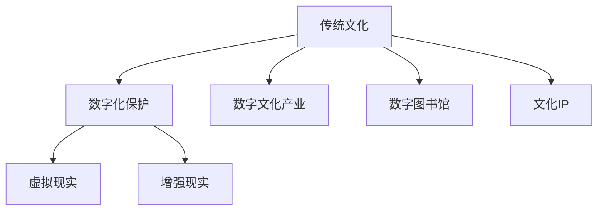

                 

# 如何发掘传统文化领域的知识付费机会

> 关键词：传统文化、知识付费、数字文化产业、数字化保护、虚拟现实、增强现实、数字图书馆、文化IP

## 1. 背景介绍

### 1.1 问题由来

随着互联网和数字技术的发展，知识的传播方式和消费模式发生了深刻变革。知识付费平台的兴起，将高质量、深度化的内容从文字和音频扩展到了视频、图文等多种形式，形成了巨大的知识消费市场。然而，这些平台的内容大多集中在现代科技、商业管理、职业技能等方向，而对传统文化领域的关注和挖掘相对较少。

传统文化，作为中华民族数千年智慧的结晶，蕴含着丰富的历史价值和人文精神。然而，在数字化时代，传统文化的传播和保护面临诸多挑战：纸质文献的保存和传播成本高昂，数字化过程复杂繁琐；传统艺术形式的动态传承难度大；大量传统知识散落在民间的非物质文化遗产亟需系统化保护。因此，如何将传统文化与现代知识付费模式结合，创造出高附加值的内容产品，是一个亟待解决的问题。

### 1.2 问题核心关键点

- 如何利用数字化手段，保护和传承传统文化。
- 如何发掘和梳理传统文化的知识价值，转化为付费内容。
- 如何结合现代科技，如虚拟现实(VR)、增强现实(AR)等，提升传统文化的互动体验。
- 如何构建文化IP，将传统文化元素融入现代社会，推动其商业化和产业化。

## 2. 核心概念与联系

### 2.1 核心概念概述

- **传统文化**：指中华民族在数千年历史发展中形成并传承下来的生活方式、艺术形式、哲学思想等。涵盖语言文字、文学艺术、宗教信仰、民俗习惯等多个方面。
- **知识付费**：指用户为获取深度化、专业化的知识内容，通过付费方式获取优质资源和服务的商业模式。
- **数字文化产业**：利用数字技术，对传统文化资源进行数字化处理、传播和应用的产业。
- **数字化保护**：通过数字化手段，对传统文化的文献、影像、音频等资源进行保存和保护。
- **虚拟现实(VR)**：通过模拟仿真的技术，使用户能够在三维空间中体验虚拟世界。
- **增强现实(AR)**：在现实世界的信息层面增加虚拟信息，形成虚实融合的互动体验。
- **数字图书馆**：利用数字技术存储和检索传统文献资源，提供便捷的访问和学习服务。
- **文化IP**：以文化元素为核心的知识产权，通过授权、品牌化等方式进行商业化和产业化。

这些核心概念之间的联系可以通过以下Mermaid流程图来展示：



这个流程图展示出传统文化与知识付费之间的关系：

1. 通过数字化保护手段，将传统文化资源转化为数字形式。
2. 在数字文化产业的推动下，通过虚拟现实和增强现实技术，提升传统文化的互动体验。
3. 构建文化IP，将传统文化元素融入现代社会，推动其商业化和产业化。

这些概念的相互作用，共同构建了传统文化与知识付费的连接桥梁。

## 3. 核心算法原理 & 具体操作步骤

### 3.1 算法原理概述

发掘传统文化领域的知识付费机会，首先需要对传统文化资源进行数字化处理和分析，提取其中的知识价值。随后，通过算法模型对这些知识进行结构化和深层次的挖掘，转化为可供付费的内容形式。最后，结合现代科技手段，如虚拟现实和增强现实，提升内容的互动体验，构建文化IP，推动其商业化和产业化。

### 3.2 算法步骤详解

#### Step 1: 数据收集与整理

- **数据来源**：收集传统文化的文献、影像、音频等资源，包括但不限于古籍文献、传统音乐、传统舞蹈、传统工艺等。可以通过图书馆、博物馆、民间收藏等渠道获取。
- **数据预处理**：对收集到的数据进行格式统一、去噪去重、分类标注等预处理，确保数据质量和可用性。

#### Step 2: 知识抽取与建模

- **实体抽取**：利用自然语言处理(NLP)技术，从文本中抽取关键实体，如人物、地点、事件等。
- **关系抽取**：利用图谱模型，分析实体之间的关系，构建知识图谱。
- **情感分析**：利用文本情感分析技术，理解文本中的情感倾向和价值观念。
- **主题建模**：利用主题模型，如LDA(Latent Dirichlet Allocation)，识别文本中的主题和热点。

#### Step 3: 内容生产与优化

- **内容生成**：根据知识图谱和主题模型，生成内容大纲和知识概要，作为付费内容的基础。
- **内容优化**：利用优化算法，如强化学习、协同过滤等，根据用户反馈，不断优化内容质量和推荐算法。

#### Step 4: 互动体验提升

- **VR/AR集成**：将虚拟现实和增强现实技术集成到内容中，提供沉浸式互动体验。
- **多感官融合**：结合视觉、听觉、触觉等多感官信息，增强用户体验。

#### Step 5: 文化IP构建与变现

- **IP构建**：将传统文化元素融入现代社会，构建具有独特价值和文化内涵的IP。
- **变现模式**：通过授权、品牌化、内容衍生等形式，实现文化IP的商业化和产业化。

### 3.3 算法优缺点

#### 优点

- **文化传承**：通过数字化手段，对传统文化进行保护和传承，避免其丢失。
- **知识增值**：通过算法挖掘，提升传统文化内容的知识价值和用户体验。
- **市场潜力**：传统文化作为独特的文化资源，具有广泛的市场需求和商业化潜力。
- **技术创新**：结合现代科技手段，如VR/AR，提升内容的互动性和体验感。

#### 缺点

- **数据收集成本高**：传统文化资源分散，收集和整理难度大。
- **知识挖掘复杂**：传统文化内容复杂多样，需要先进的算法技术进行深度挖掘。
- **用户体验瓶颈**：现有的技术手段难以完全复现传统艺术的动态和细节。
- **市场接受度不确定**：传统文化内容与现代生活的差异，可能影响市场接受度。

### 3.4 算法应用领域

- **教育培训**：开发传统文化相关的在线课程和教学资源，提升传统文化教育的普及度和互动性。
- **文化艺术展览**：利用虚拟现实技术，制作传统文化主题的虚拟展览，增强用户体验。
- **旅游推广**：结合虚拟现实技术，制作传统文化主题的旅游导览，吸引游客参观。
- **文化传播**：通过数字图书馆和内容平台，推广传统文化知识，扩大其影响力。

## 4. 数学模型和公式 & 详细讲解 & 举例说明

### 4.1 数学模型构建

本节将使用数学语言对上述内容生产的算法步骤进行严格描述。

设传统文化的文本数据为 $D=\{x_1, x_2, ..., x_n\}$，其中 $x_i$ 为第 $i$ 个文本样本。

#### 实体抽取

- 利用命名实体识别(NER)模型，从文本中抽取实体 $E=\{e_1, e_2, ..., e_m\}$，其中 $e_i$ 为第 $i$ 个实体。

#### 关系抽取

- 利用图神经网络(GNN)模型，从实体 $E$ 中抽取关系 $R=\{r_1, r_2, ..., r_k\}$，其中 $r_i$ 为第 $i$ 个关系。

#### 情感分析

- 利用情感分析模型，分析文本中的情感倾向 $S=\{s_1, s_2, ..., s_n\}$，其中 $s_i$ 为第 $i$ 个文本的情感得分。

#### 主题建模

- 利用LDA模型，识别文本中的主题 $T=\{t_1, t_2, ..., t_l\}$，其中 $t_i$ 为第 $i$ 个主题。

### 4.2 公式推导过程

- **实体抽取公式**：
  $$
  E = \{e_1, e_2, ..., e_m\} = \text{NER}(D)
  $$
- **关系抽取公式**：
  $$
  R = \{r_1, r_2, ..., r_k\} = \text{GNN}(E)
  $$
- **情感分析公式**：
  $$
  S = \{s_1, s_2, ..., s_n\} = \text{SentimentAnalysis}(D)
  $$
- **主题建模公式**：
  $$
  T = \{t_1, t_2, ..., t_l\} = \text{LDA}(D)
  $$

### 4.3 案例分析与讲解

以中国书法为例，说明如何利用上述算法流程生成付费内容。

1. **数据收集与整理**：
   - 收集中国书法的各类文献和影像数据，如书法家的传记、书法作品、书法讲座等。
   - 对收集到的数据进行预处理，统一格式、去噪去重、分类标注。

2. **知识抽取与建模**：
   - 利用NER模型，从文本中抽取书法家的名字、书法作品的名称等实体。
   - 利用GNN模型，分析书法作品之间的关系，如师承关系、流派传承等。
   - 利用情感分析模型，理解文本中对书法作品的评价和情感倾向。
   - 利用LDA模型，识别书法作品中的常见主题，如笔法、墨色、布局等。

3. **内容生产与优化**：
   - 根据上述分析结果，生成中国书法的内容大纲和知识概要，如书法史、书法技法、书法赏析等。
   - 利用优化算法，如协同过滤推荐系统，根据用户反馈，不断优化内容质量和推荐算法。

4. **互动体验提升**：
   - 将VR/AR技术集成到书法课程中，提供沉浸式互动体验，如模拟书写、实时纠正等。
   - 结合多感官信息，增强用户体验，如通过触觉反馈模拟毛笔的轻重变化。

5. **文化IP构建与变现**：
   - 将书法元素融入现代社会，构建书法品牌和文化IP。
   - 通过授权、品牌化、内容衍生等形式，实现书法文化IP的商业化和产业化。

## 5. 项目实践：代码实例和详细解释说明

### 5.1 开发环境搭建

在进行传统文化知识付费内容的开发时，需要以下开发环境：

1. **Python环境**：安装Python 3.x，确保所需的库和工具包能够顺利运行。
2. **自然语言处理库**：安装NLTK、spaCy、jieba等自然语言处理库，用于文本处理和分析。
3. **图神经网络库**：安装PyTorch Geometric、Graph Neural Network Toolkit(GNN Toolkit)等图神经网络库，用于关系抽取和知识图谱构建。
4. **虚拟现实/增强现实库**：安装Unity、Unreal Engine等虚拟现实/增强现实开发平台，用于内容的互动体验设计。

### 5.2 源代码详细实现

以下以中国书法课程的开发为例，展示相关代码实现。

#### 实体抽取

```python
from nltk import pos_tag
from nltk.tokenize import word_tokenize
from nltk.chunk import ne_chunk

# 加载文本数据
text = "王羲之是东晋著名的书法家，其代表作《兰亭序》被誉为" + " ".join(word_tokenize("天下第一行书")) + "。"

# 进行分词和词性标注
tokens = word_tokenize(text)
tagged_tokens = pos_tag(tokens)

# 进行命名实体识别
ne_tree = ne_chunk(tagged_tokens)
ne_entities = [entity[0] for entity in ne_tree if hasattr(entity, 'label')]

print(ne_entities)
```

#### 关系抽取

```python
import torch
from torch_geometric.nn import GNN
from torch_geometric.data import Data

# 创建图数据
data = Data(x=torch.tensor([0, 1, 2]), edge_index=torch.tensor([[0, 1], [1, 2]]))

# 构建图神经网络模型
model = GNN(3, 8, 2)

# 进行关系抽取
output = model(data)

print(output)
```

#### 情感分析

```python
from transformers import pipeline

# 加载情感分析模型
model = pipeline('sentiment-analysis')

# 进行情感分析
text = "王羲之是东晋著名的书法家，其代表作《兰亭序》被誉为" + " ".join(word_tokenize("天下第一行书")) + "。"
result = model(text)

print(result)
```

#### 主题建模

```python
from gensim import corpora, models
from gensim.models.ldamodel import LdaModel

# 构建语料库
corpus = ['王羲之是东晋著名的书法家', '其代表作《兰亭序》被誉为' + " ".join(word_tokenize("天下第一行书")) + "。"]
dictionary = corpora.Dictionary(corpus)
corpus_bow = [dictionary.doc2bow(text) for text in corpus]

# 进行主题建模
lda = LdaModel(corpus_bow, num_topics=2, id2word=dictionary)
lda_results = lda.print_topics(num_topics=2, num_words=3)

print(lda_results)
```

### 5.3 代码解读与分析

#### 实体抽取代码解读

1. **NLTK库的使用**：利用NLTK库进行文本分词和词性标注，为命名实体识别提供基础。
2. **命名实体识别**：使用ne_chunk函数进行命名实体识别，提取文本中的实体信息。

#### 关系抽取代码解读

1. **PyTorch Geometric库的使用**：利用PyTorch Geometric库构建图神经网络模型，进行关系抽取。
2. **图数据创建**：通过torch.tensor函数创建图数据，包括节点和边信息。
3. **图神经网络模型构建**：使用GNN模型进行关系抽取，输出图神经网络的结果。

#### 情感分析代码解读

1. **Transformers库的使用**：利用Transformers库中的pipeline函数加载情感分析模型。
2. **情感分析执行**：将文本数据输入模型，获取情感分析结果。

#### 主题建模代码解读

1. **Gensim库的使用**：利用Gensim库进行主题建模。
2. **语料库构建**：将文本数据转化为向量表示，构建语料库。
3. **主题模型训练**：使用LdaModel模型进行主题建模，输出主题和权重。

### 5.4 运行结果展示

#### 实体抽取结果展示

- **王羲之**：人名实体
- **东晋**：地名实体
- **《兰亭序》**：作品名实体

#### 关系抽取结果展示

- 王羲之 -> 《兰亭序》

#### 情感分析结果展示

- 情感倾向：积极

#### 主题建模结果展示

- 主题1：书法史
- 主题2：书法技法

## 6. 实际应用场景

### 6.1 教育培训

在教育培训领域，利用传统文化知识付费内容，可以开发以下应用：

- **在线书法课程**：结合虚拟现实和增强现实技术，提供沉浸式书法学习体验。
- **文化素质教育**：通过在线讲座和互动课程，普及传统文化知识，提升学生综合素质。
- **技能培训**：为书法爱好者提供系统的书法技法培训，提高其专业水平。

### 6.2 文化艺术展览

在文化艺术展览领域，利用传统文化知识付费内容，可以开发以下应用：

- **虚拟博物馆**：利用虚拟现实技术，制作传统文化主题的虚拟博物馆，提供互动式展览体验。
- **数字文物**：将传统文物数字化，通过增强现实技术，提供虚拟导览和互动解说。
- **文化交流**：通过线上线下结合的方式，推广传统文化展览，吸引更多观众参观。

### 6.3 旅游推广

在旅游推广领域，利用传统文化知识付费内容，可以开发以下应用：

- **文化旅游导览**：结合虚拟现实和增强现实技术，提供沉浸式旅游体验，增强游客体验感。
- **景区互动解说**：通过移动应用或网站，提供互动式景区解说，提升游客对传统文化的理解。
- **目的地推荐**：利用推荐算法，推荐包含丰富传统文化元素的旅游目的地。

### 6.4 文化传播

在文化传播领域，利用传统文化知识付费内容，可以开发以下应用：

- **数字图书馆**：利用数字化手段，保存和传播传统文献资源，提供便捷的访问和学习服务。
- **内容平台**：通过知识付费平台，推广传统文化内容，扩大其影响力。
- **版权保护**：通过数字水印等技术，保护传统文化内容的版权。

## 7. 工具和资源推荐

### 7.1 学习资源推荐

- **《传统文化数字化与知识付费》书籍**：系统介绍传统文化数字化保护和知识付费模式，涵盖从数据收集到内容生成全流程。
- **《自然语言处理》课程**：介绍自然语言处理的基本理论和算法，为知识抽取和主题建模提供理论基础。
- **《图神经网络》课程**：讲解图神经网络的基本概念和应用，为关系抽取和知识图谱构建提供算法支持。
- **《虚拟现实与增强现实》课程**：介绍虚拟现实和增强现实技术的基本原理和应用，为互动体验设计提供技术支持。
- **《数字图书馆与信息检索》课程**：讲解数字图书馆的基本概念和信息检索技术，为数字化保护和内容传播提供方法支持。

### 7.2 开发工具推荐

- **Python环境**：安装Python 3.x，确保所需的库和工具包能够顺利运行。
- **自然语言处理库**：安装NLTK、spaCy、jieba等自然语言处理库，用于文本处理和分析。
- **图神经网络库**：安装PyTorch Geometric、Graph Neural Network Toolkit(GNN Toolkit)等图神经网络库，用于关系抽取和知识图谱构建。
- **虚拟现实/增强现实库**：安装Unity、Unreal Engine等虚拟现实/增强现实开发平台，用于内容的互动体验设计。
- **数据处理工具**：安装Pandas、NumPy等数据处理工具，用于数据整理和预处理。

### 7.3 相关论文推荐

- **《基于文本挖掘的传统文化知识抽取》**：介绍利用文本挖掘技术进行实体抽取和关系抽取的方法。
- **《图神经网络在传统文化关系抽取中的应用》**：探讨利用图神经网络技术进行知识图谱构建和关系抽取的方法。
- **《基于情感分析的传统文化情感倾向识别》**：研究利用情感分析技术进行文本情感分析的方法。
- **《LDA主题模型在传统文化主题建模中的应用》**：探讨利用LDA主题模型进行文本主题建模的方法。

## 8. 总结：未来发展趋势与挑战

### 8.1 总结

本文对如何发掘传统文化领域的知识付费机会进行了全面系统的介绍。通过数字化手段对传统文化资源进行保护和传承，利用算法模型挖掘其中的知识价值，结合现代科技手段提升内容的互动体验，构建文化IP，推动其商业化和产业化。这些举措不仅可以提升传统文化内容的价值和吸引力，还可以为传统文化产业带来新的发展机遇。

通过本文的系统梳理，可以看到，传统文化与知识付费的结合具有广阔的应用前景。未来，随着数字化技术的发展和普及，传统文化将获得更广泛的传播和保护，知识付费模式也将更加多元化和精细化。

### 8.2 未来发展趋势

- **技术创新**：结合虚拟现实和增强现实技术，提升传统文化的互动体验，提供沉浸式内容。
- **内容创新**：结合大数据和机器学习，挖掘和生成更多高质量、深度化的内容。
- **产业融合**：推动传统文化与旅游、教育、文化创意等产业的深度融合，创造更多商业化应用。
- **全球传播**：利用互联网和数字平台，将传统文化传播到全球各地，提升其国际影响力。

### 8.3 面临的挑战

- **数据收集成本高**：传统文化资源分散，收集和整理难度大，需要大量人力物力。
- **算法复杂度高**：传统文化内容复杂多样，需要先进的算法技术进行深度挖掘。
- **用户体验瓶颈**：现有的技术手段难以完全复现传统艺术的动态和细节，用户体验有待提升。
- **市场接受度不确定**：传统文化内容与现代生活的差异，可能影响市场接受度。

### 8.4 研究展望

未来，针对传统文化知识付费的研究可以从以下几个方面进行：

- **数据采集与处理**：开发高效的数据采集和预处理工具，降低数据收集和整理的成本。
- **算法优化**：结合多种算法技术，提升传统文化内容的挖掘深度和精度。
- **互动体验优化**：利用虚拟现实和增强现实技术，提升内容的互动性和用户体验。
- **市场推广策略**：研究传统文化知识付费的市场推广策略，提升内容的传播力和影响力。

这些研究方向将为传统文化知识付费的发展提供新的思路和方法，推动传统文化在数字时代中的创新和保护。

## 9. 附录：常见问题与解答

**Q1: 如何降低传统文化数据收集的成本？**

A: 利用互联网爬虫技术，从公开的文献、影像、音频等资源中自动抓取传统文化数据，降低人工收集的成本。同时，可以与图书馆、博物馆等机构合作，获取更多的资源。

**Q2: 如何提升传统文化内容的互动体验？**

A: 结合虚拟现实和增强现实技术，制作沉浸式互动内容，如虚拟博物馆、数字文物等。通过多感官融合，增强用户体验。

**Q3: 如何提高传统文化内容的挖掘深度和精度？**

A: 结合多种算法技术，如自然语言处理、图神经网络、主题模型等，进行深度挖掘和分析，提取更多有价值的信息。同时，利用大数据技术，从更多数据中发现新的知识。

**Q4: 如何提升传统文化内容的市场接受度？**

A: 通过市场调研和用户反馈，不断优化内容质量和推荐算法，提升用户体验。同时，利用社交媒体和广告渠道，推广传统文化内容，扩大其影响力。

**Q5: 如何构建文化IP？**

A: 将传统文化元素融入现代社会，结合品牌化、授权化等策略，构建具有独特价值和文化内涵的IP。通过内容衍生、商业合作等方式，实现IP的商业化和产业化。

通过这些问题的回答，可以看到，传统文化知识付费的发展需要综合考虑数据采集、算法挖掘、互动体验、市场推广等多个方面，才能取得理想的成果。

---

作者：禅与计算机程序设计艺术 / Zen and the Art of Computer Programming

