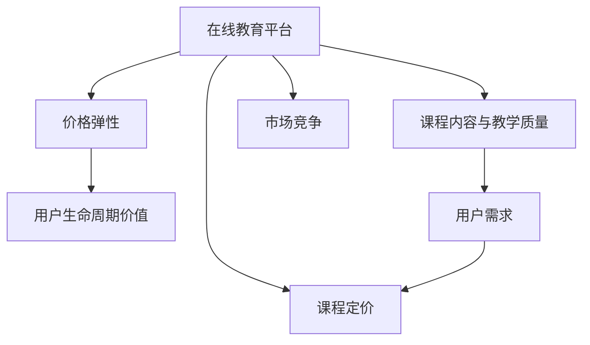

                 

# 如何定价你的程序员知识课程

> 关键词：在线教育, 定价策略, 程序员, 知识付费, 用户心理, 课程设计

## 1. 背景介绍

### 1.1 问题由来
在信息爆炸的今天，程序员和软件开发者面临着前所未有的知识更新挑战。为了满足职业发展的需求，越来越多的开发者通过在线教育平台获取新的技能和知识。在线教育平台的崛起，使得程序员知识课程市场日益火爆，同时也催生了许多程序员知识课程的提供商。但与此同时，如何定价程序员知识课程，成为了一个亟待解决的问题。

### 1.2 问题核心关键点
定价程序员知识课程需要考虑的因素包括课程内容、教学质量、用户需求、市场竞争、价格弹性以及成本结构等。一个合理的定价策略，不仅能最大化利润，还能吸引更多的用户，促进平台的长期发展。

### 1.3 问题研究意义
了解如何定价程序员知识课程，有助于在线教育平台更好地理解用户行为，优化定价策略，提高课程销量，同时也能指导潜在课程提供商合理定价，提高市场竞争力。

## 2. 核心概念与联系

### 2.1 核心概念概述

为更好地理解如何定价程序员知识课程，本节将介绍几个密切相关的核心概念：

- **在线教育平台**：利用互联网技术和多媒体手段，提供个性化学习资源和互动学习环境，支持学习者自主学习的网络平台。
- **课程定价**：课程提供方根据课程内容、质量、市场需求等因素，对课程设置的价格。
- **价格弹性**：指需求量对价格变动的敏感程度，即当价格变动时，用户对课程的需求是否敏感。
- **用户生命周期价值**：指用户从注册到流失，在整个生命周期中为平台带来的收益总和。
- **课程内容与教学质量**：课程的深度、广度、更新频率以及教师的资历和教学方法等因素。
- **市场竞争**：课程市场中其他平台和课程的竞争态势。

这些核心概念之间的逻辑关系可以通过以下Mermaid流程图来展示：



这个流程图展示了一节在线课程定价过程中各个因素之间的关系：

1. 在线教育平台通过课程定价吸引用户。
2. 用户需求直接影响课程价格和弹性。
3. 课程内容和教学质量影响用户满意度和回购率。
4. 市场竞争压力可能影响课程定价策略。
5. 用户生命周期价值分析决定课程长期价值。

## 3. 核心算法原理 & 具体操作步骤
### 3.1 算法原理概述

程序员知识课程的定价通常遵循一定的算法原理，这包括：

- **成本加成定价法**：根据课程开发和维护的成本，加上一定的利润率来定价。
- **价值定价法**：根据课程提供的价值和用户的预期收益，确定合理的定价。
- **竞争定价法**：基于市场上类似课程的定价水平，结合自身竞争优势来定价。
- **动态定价法**：根据市场需求、用户购买行为等因素，动态调整课程价格。

### 3.2 算法步骤详解

以下是具体的定价操作步骤：

**Step 1: 评估课程价值**

1. **识别课程价值点**：分析课程的主要内容和特点，识别用户可能从中获得的收益。
2. **对比竞争对手**：研究市场上类似课程的定价和内容，评估其竞争优势。
3. **用户需求分析**：通过市场调研和用户反馈，了解目标用户对课程的需求和期望。

**Step 2: 计算课程成本**

1. **固定成本**：课程开发、维护、营销等方面的固定支出。
2. **变动成本**：每次课程购买时的变动成本，如平台服务费、广告费等。
3. **沉淀成本**：课程开发和维护过程中已经投入的成本。

**Step 3: 确定利润率**

1. **毛利润率**：目标利润与课程总收入的比例。
2. **净利润率**：扣除固定成本和变动成本后的净收入与总收入的比例。

**Step 4: 设置定价策略**

1. **成本加成定价**：课程售价 = 成本 + 利润。
2. **价值定价**：课程售价 = 用户价值 / 用户感知成本。
3. **竞争定价**：课程售价 = 竞争课程售价 * (1 + 竞争优势系数)。
4. **动态定价**：根据市场需求变化，动态调整课程价格。

**Step 5: 测试与优化**

1. **A/B测试**：对比不同定价策略下的用户反应和购买率，选择最佳策略。
2. **用户反馈**：收集用户对课程定价的反馈，及时调整策略。
3. **市场反应**：分析市场变化和竞争态势，调整定价策略。

### 3.3 算法优缺点

程序员知识课程定价的优势包括：

- **灵活性**：动态定价策略可以根据市场变化及时调整价格。
- **竞争力**：通过合理定价提高市场竞争力，吸引更多用户。
- **透明度**：明确告知用户课程定价的依据，增加信任感。

然而，定价策略也存在一些不足：

- **不确定性**：市场和用户需求可能变化，影响定价策略的有效性。
- **复杂性**：涉及多个因素，需要复杂的计算和分析。
- **风险**：过高或过低的定价可能影响收益和用户体验。

### 3.4 算法应用领域

程序员知识课程定价在以下几个领域具有广泛应用：

- **在线教育平台**：如Udemy、Coursera等，需要制定合理的课程定价策略，吸引并留住用户。
- **技术培训公司**：如Pluralsight、Lynda等，通过合理的定价和促销策略，提高课程销量。
- **个人知识创作者**：如在Udemy、Gumroad等平台创建课程的个人开发者，需要优化定价策略以提高收益。

## 4. 数学模型和公式 & 详细讲解 & 举例说明

### 4.1 数学模型构建

程序员知识课程定价的数学模型可以表述为：

$$
\text{课程售价} = f(\text{课程价值}, \text{成本}, \text{竞争定价}, \text{用户需求}, \text{市场弹性}, \text{用户反馈}, \text{市场变化})
$$

其中，$f$为定价函数，包含多个自变量和因变量。

### 4.2 公式推导过程

以价值定价法为例，假设课程为用户带来的价值为$V$，用户感知成本为$C$，定价公式为：

$$
\text{课程售价} = \frac{V}{C}
$$

具体推导如下：

1. **用户价值分析**：通过调研和用户反馈，确定课程为用户带来的价值$V$。
2. **用户成本分析**：根据用户的使用场景，估算用户感知成本$C$，包括时间成本、经济成本等。
3. **定价计算**：将$V$和$C$代入上述公式，计算出课程售价。

### 4.3 案例分析与讲解

假设一个程序员知识课程，用户价值为$V=100$，用户感知成本为$C=50$，课程售价为：

$$
\text{课程售价} = \frac{100}{50} = 2
$$

### 5. 项目实践：代码实例和详细解释说明
### 5.1 开发环境搭建

在Python环境下搭建定价模型需要以下步骤：

1. **安装Python**：从官网下载并安装Python。
2. **安装依赖包**：安装NumPy、Pandas等常用数据处理库。
3. **配置环境**：设置项目目录、配置文件等。

### 5.2 源代码详细实现

以下是一个简单的Python代码示例，用于计算基于价值定价法的课程售价：

```python
import numpy as np

def calculate_course_price(value, cost):
    price = value / cost
    return price

# 假设课程价值为100，用户感知成本为50
price = calculate_course_price(100, 50)
print("课程售价为：", price)
```

### 5.3 代码解读与分析

- **变量定义**：`value`和`cost`分别代表用户价值和用户感知成本。
- **计算公式**：通过公式$\text{课程售价} = \frac{V}{C}$计算课程售价。
- **结果输出**：将计算结果输出为字符串，以便于查看。

### 5.4 运行结果展示

```
课程售价为： 2.0
```

## 6. 实际应用场景
### 6.1 在线教育平台定价策略

在线教育平台需要根据课程内容、市场需求、用户反馈等多方面因素，制定合理的定价策略。以Coursera为例，其在定价时通常采用价值定价法，结合课程难度、市场竞争力、用户需求等因素，设置不同的课程售价。

### 6.2 技术培训公司课程定价

技术培训公司如Pluralsight，其课程定价不仅考虑成本，还关注用户的学习效果和职业发展。例如，高级课程如云计算、大数据等，价格通常较高，而初级课程如Python基础、Web开发等，价格相对较低。

### 6.3 个人知识创作者课程定价

个人知识创作者在定价时，需要综合考虑成本、市场需求、用户反馈等因素。例如，在Udemy上，一个售价为$99的课程，可能需要制作数周甚至数月，而售价为$19的课程，则可能只需几天。

### 6.4 未来应用展望

随着在线教育市场的进一步发展，程序员知识课程定价将更加精细化和智能化。未来可能出现以下趋势：

- **动态定价**：根据市场需求和用户行为动态调整价格，提高收益。
- **个性化定价**：根据用户的学习路径和行为，提供个性化的定价方案。
- **用户评分定价**：根据用户评分和反馈，动态调整课程价格。
- **跨平台定价**：不同平台间的课程定价差异化策略，如联盟销售等。

## 7. 工具和资源推荐
### 7.1 学习资源推荐

为了帮助程序员知识课程提供商更好地理解定价策略，这里推荐一些优质的学习资源：

1. **Coursera定价策略课程**：提供系统性的在线教育定价知识和案例分析。
2. **Pluralsight课程开发指南**：详细讲解技术培训课程的开发和定价策略。
3. **Udemy定价优化指南**：提供用户价值分析和定价优化技巧。
4. **Google Pricing Analytics**：Google提供的定价分析工具，帮助理解市场和用户需求。
5. **《定价的艺术》**：一本系统讲解定价策略和案例分析的经典书籍。

### 7.2 开发工具推荐

在程序员知识课程定价过程中，以下工具可以提高效率和准确性：

1. **Excel**：用于数据处理和计算，支持多种函数和图表。
2. **Tableau**：数据可视化工具，便于理解市场变化和用户反馈。
3. **Google Analytics**：用户行为分析工具，帮助理解用户需求和市场趋势。
4. **A/B测试工具**：如Optimizely、Google Optimize等，用于测试不同的定价策略。
5. **CRM系统**：如Salesforce，用于记录和管理用户信息，进行精准营销。

### 7.3 相关论文推荐

程序员知识课程定价的研究涉及多个领域，以下是几篇经典的论文推荐：

1. **《在线课程定价策略研究》**：介绍在线教育课程定价的理论和实践。
2. **《技术培训课程的定价优化》**：研究技术培训课程的定价策略和方法。
3. **《个性化定价模型》**：提出基于用户行为的个性化定价模型。
4. **《动态定价方法》**：介绍动态定价的理论和实现方法。
5. **《知识付费市场分析》**：分析知识付费市场和用户需求，提出合理的定价策略。

## 8. 总结：未来发展趋势与挑战
### 8.1 总结

本文对程序员知识课程定价的各个环节进行了详细的介绍，包括定价算法、操作步骤、案例分析等。通过系统的梳理，可以看出，合理定价不仅能最大化利润，还能提高用户满意度，促进平台的长期发展。

### 8.2 未来发展趋势

未来程序员知识课程定价将呈现以下几个趋势：

1. **智能化定价**：利用AI和大数据技术，实现动态和个性化的定价。
2. **用户体验优化**：更加注重用户体验，通过定价策略提升用户满意度。
3. **市场细分**：针对不同用户群体，制定差异化的定价策略。
4. **数据驱动**：以用户行为数据为基础，进行定价优化。

### 8.3 面临的挑战

尽管程序员知识课程定价已经取得了一定的进展，但在实际操作中仍面临以下挑战：

1. **用户需求多样化**：不同用户的需求和期望不同，定价策略需要更加灵活。
2. **市场竞争激烈**：市场竞争压力使得定价策略必须不断调整，以保持竞争力。
3. **定价透明性**：定价策略的复杂性可能导致用户对课程价值的认知差异。
4. **成本控制**：课程开发和维护的成本需要严格控制，避免高成本低收益。
5. **用户体验**：定价过高可能影响用户购买意愿，定价过低可能降低课程质量。

### 8.4 研究展望

未来需要在以下几个方面进行更多的研究：

1. **定价算法优化**：开发更加高效的定价算法，提高定价的准确性和灵活性。
2. **用户行为分析**：深入研究用户行为，制定更加精准的定价策略。
3. **多平台定价策略**：研究跨平台的定价策略，最大化平台收益。
4. **人工智能应用**：引入AI技术，实现定价的自动化和智能化。
5. **用户需求调研**：定期进行用户需求调研，根据用户反馈调整定价策略。

## 9. 附录：常见问题与解答

**Q1：如何确定课程的价值？**

A: 课程价值可以通过市场调研、用户反馈和专家评估等方式确定。例如，用户调研问卷、专家评审、市场需求分析等。

**Q2：如何评估用户感知成本？**

A: 用户感知成本包括时间成本、经济成本、学习难度等。可以通过问卷调查、用户反馈、市场数据等方式评估。

**Q3：如何确定合适的利润率？**

A: 利润率通常根据课程成本和市场竞争情况确定。建议从5%-20%的毛利润率开始，根据市场反馈进行调整。

**Q4：如何进行定价测试？**

A: 定价测试可以通过A/B测试、价格弹性测试、市场反应测试等方式进行。测试时，控制其他变量，只改变定价策略，观察用户反应。

**Q5：如何应对市场变化？**

A: 市场变化需要及时调整定价策略，可以通过定期市场调研、用户反馈分析、竞争对手动态等方式进行监控和调整。

---

作者：禅与计算机程序设计艺术 / Zen and the Art of Computer Programming

