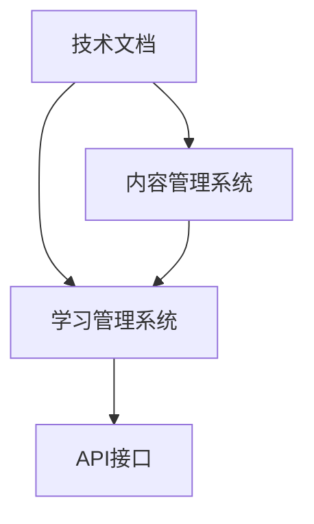

                 

## 1. 背景介绍

### 1.1 问题由来
随着科技的不断进步，技术文档已不仅仅是一份资料，它成为了一种重要的学习资源，特别是在软件开发、IT架构设计等领域，技术文档是技术交流、知识传承和技能培训的重要工具。然而，传统技术文档往往以静态、文本的形式存在，难以满足现代学习者个性化、互动化的学习需求。因此，如何将技术文档转化为互动式学习平台，成为当前技术教育领域的一个重要课题。

### 1.2 问题核心关键点
互动式学习平台的建设涉及技术文档的数字化、互动化处理，具体包括但不限于以下几个方面：

1. **技术文档数字化**：将传统纸质文档、PDF文档等转化为数字格式，便于学习者在线阅读和搜索。
2. **内容互动化**：通过添加交互元素（如问题、测试、互动练习等），提升学习者的主动参与度和知识掌握效率。
3. **个性化学习**：根据学习者的兴趣、能力等个性化特征，推荐合适的学习路径和内容。
4. **实时反馈和评估**：通过学习测试、行为跟踪等手段，提供即时反馈和成绩评估，帮助学习者及时了解自己的学习进度和效果。

### 1.3 问题研究意义
将技术文档转化为互动式学习平台，具有以下重要意义：

1. **提升学习效果**：互动式学习通过问题、测试和实时反馈等方式，增强学习者的理解和记忆，提高学习效率。
2. **促进知识传递**：互动平台可以支持多人协作学习，促进知识在团队中的传递和交流。
3. **降低学习成本**：相较于传统培训课程，互动平台可以在线学习，节省时间和成本。
4. **支持终身学习**：互动式平台可以不断更新内容，满足学习者终身学习的需要。

## 2. 核心概念与联系

### 2.1 核心概念概述

为了更好地理解如何将技术文档转化为互动式学习平台，本节将介绍几个关键概念及其相互之间的联系。

- **技术文档（Technical Document）**：包括但不限于API文档、用户手册、技术报告等，是记录技术知识、经验和实践的文本资料。
- **互动式学习平台（Interactive Learning Platform）**：利用技术手段，将静态文档转化为具有互动功能的数字资源，支持学习者的个性化、互动式学习。
- **内容管理系统（Content Management System, CMS）**：一种用于管理和发布内容的软件系统，是互动式学习平台的核心组件。
- **学习管理系统（Learning Management System, LMS）**：提供学习活动、内容发布、成绩管理等功能，支持学习者在线学习、评估和反馈。
- **API接口**：通过API接口，实现技术文档与互动平台之间的数据交互和内容更新。

这些核心概念之间的逻辑关系可以通过以下Mermaid流程图来展示：



这个流程图展示了几类概念之间的相互关系：

1. 技术文档通过内容管理系统被数字化，变为数字资源。
2. 数字化的技术文档与学习管理系统集成，支持互动学习。
3. 学习管理系统通过API接口与外部系统进行数据交互，实现内容的动态更新。

## 3. 核心算法原理 & 具体操作步骤
### 3.1 算法原理概述

将技术文档转化为互动式学习平台，本质上是一个内容数字化和互动化的过程。其核心思想是：通过技术手段将传统技术文档转化为具有互动功能的数字资源，利用现代信息技术（如Web技术、数据库技术等）构建互动式学习平台，实现个性化、互动式学习。

形式化地，假设原始技术文档为 $D$，通过内容管理系统转化为数字资源 $D'$，在互动式学习平台上的呈现为 $L$。互动平台的目标是：

$$
\min_{L} \text{Dist}(D',L)
$$

其中，$\text{Dist}(D',L)$ 为数字资源 $D'$ 与互动平台上的呈现 $L$ 之间的差异度量（如文本相似度、图片匹配度等），最小化差异度量可以确保互动平台上的内容与原始技术文档保持一致。

### 3.2 算法步骤详解

将技术文档转化为互动式学习平台的一般包括以下几个关键步骤：

**Step 1: 准备原始文档和数字化工具**

- 收集原始技术文档，如PDF、HTML、Markdown等格式的文档。
- 选择适合的技术工具和软件，将原始文档转化为数字格式，如通过OCR技术识别PDF文档中的文本内容，使用Markdown格式构建文档结构。

**Step 2: 添加互动元素**

- 在数字化后的文档中加入互动元素，如问题、测试、互动练习等。这可以通过HTML、JavaScript等技术实现。
- 设计互动元素的具体形式，如选择题、填空题、编程练习等，根据学习目标和文档内容进行定制。
- 在文档中添加反馈机制，如即时评分、进度跟踪等，以便学习者了解自己的学习效果。

**Step 3: 集成学习管理系统**

- 将数字化并带有互动元素的文档整合到学习管理系统中，如Moodle、Canvas等。
- 通过API接口将文档内容与学习管理系统集成，实现数据和内容的同步更新。
- 设置学习管理系统的参数，如学习路径、进度跟踪、成绩评估等，提供个性化学习方案。

**Step 4: 部署互动平台**

- 选择合适的服务器和云平台，部署互动式学习平台。
- 对平台进行测试和优化，确保系统的稳定性和用户体验。
- 提供用户界面和操作手册，帮助学习者顺利使用互动平台。

**Step 5: 持续维护和更新**

- 定期收集学习者反馈，优化互动平台的功能和内容。
- 根据技术发展和文档更新，持续更新互动平台的内容。
- 提供社区支持和技术支持，帮助解决学习者在使用过程中遇到的问题。

### 3.3 算法优缺点

将技术文档转化为互动式学习平台的方法具有以下优点：

1. **提升学习效果**：通过问题、测试和实时反馈等方式，增强学习者的理解和记忆，提高学习效率。
2. **促进知识传递**：支持多人协作学习，促进知识在团队中的传递和交流。
3. **降低学习成本**：相较于传统培训课程，互动平台可以在线学习，节省时间和成本。
4. **支持终身学习**：互动平台可以不断更新内容，满足学习者终身学习的需要。

同时，该方法也存在一定的局限性：

1. **技术要求较高**：需要具备一定的技术开发和维护能力，非技术背景的人员可能难以实施。
2. **内容质量要求高**：互动平台的内容需要高质量且结构合理，否则可能影响学习效果。
3. **交互设计复杂**：需要精心设计互动元素，确保用户体验和互动效果。
4. **数据安全问题**：学习管理系统中的数据需要安全保护，防止信息泄露和数据篡改。

尽管存在这些局限性，但就目前而言，将技术文档转化为互动式学习平台的方法仍是一种高效且可行的技术教育方式。

### 3.4 算法应用领域

将技术文档转化为互动式学习平台的方法在多个领域得到了广泛应用，包括但不限于：

- **软件开发**：提供API文档、开发指南等互动学习资源，帮助开发者快速上手新技术。
- **IT架构设计**：提供系统架构图、配置文档等互动学习资源，帮助架构师理解复杂系统。
- **网络安全**：提供渗透测试、漏洞利用等互动学习资源，帮助安全专家提升实战能力。
- **数据分析**：提供数据处理、机器学习等互动学习资源，帮助数据分析师掌握技能。
- **智能制造**：提供设备操作手册、维护指南等互动学习资源，帮助制造工程师提升操作和维护能力。

## 4. 数学模型和公式 & 详细讲解
### 4.1 数学模型构建

为了更准确地描述将技术文档转化为互动式学习平台的过程，我们可以构建一个数学模型来表示这一过程。

假设原始技术文档为 $D$，数字化并带有互动元素后的文档为 $D'$，互动平台上的呈现为 $L$。互动平台的目标是：

$$
\min_{L} \text{Dist}(D',L)
$$

其中，$\text{Dist}(D',L)$ 为数字资源 $D'$ 与互动平台上的呈现 $L$ 之间的差异度量。

我们可以使用以下公式来度量 $D'$ 与 $L$ 之间的差异：

$$
\text{Dist}(D',L) = \sum_{i=1}^n |d_i' - l_i|
$$

其中，$d_i'$ 表示 $D'$ 中的第 $i$ 个元素，$l_i$ 表示 $L$ 中与 $d_i'$ 对应的元素。

### 4.2 公式推导过程

在上述公式的基础上，我们可以进一步推导互动平台的设计方案。假设我们希望最大化 $L$ 的互动性，可以定义以下目标函数：

$$
\max_{L} \text{Engagement}(L) - \text{Dist}(D',L)
$$

其中，$\text{Engagement}(L)$ 表示互动平台 $L$ 的互动性，可以通过互动元素的数量、学习路径的复杂度等因素来量化。

为了求解上述目标函数，我们可以采用遗传算法、强化学习等优化算法，通过迭代优化，找到最优的互动平台设计方案。

### 4.3 案例分析与讲解

下面以一个具体的案例来进一步讲解如何将技术文档转化为互动式学习平台：

**案例：Python编程教程的互动化**

原始的Python编程教程通常以静态的文本形式呈现，学习者需要自行阅读和练习。为了将其转化为互动式学习平台，可以采取以下步骤：

1. **准备原始文档**：收集Python编程教程的PDF文档。
2. **添加互动元素**：在PDF文档中添加编程练习、测试题目等互动元素，使用JavaScript等技术实现。
3. **集成学习管理系统**：将PDF文档整合到Moodle等学习管理系统中，通过API接口实现数据同步。
4. **部署互动平台**：选择合适的服务器和云平台，部署互动式学习平台。
5. **持续维护和更新**：定期收集学习者反馈，优化互动平台的功能和内容，更新学习资源。

## 5. 项目实践：代码实例和详细解释说明
### 5.1 开发环境搭建

在进行互动式学习平台的开发前，我们需要准备好开发环境。以下是使用Python进行Flask开发的环境配置流程：

1. 安装Anaconda：从官网下载并安装Anaconda，用于创建独立的Python环境。

2. 创建并激活虚拟环境：
```bash
conda create -n flask-env python=3.8 
conda activate flask-env
```

3. 安装Flask：
```bash
pip install flask
```

4. 安装相关库：
```bash
pip install flask-wtf flask-sqlalchemy flask-socketio
```

5. 安装Web前端框架：
```bash
pip install flask-wtf
```

完成上述步骤后，即可在`flask-env`环境中开始开发互动式学习平台。

### 5.2 源代码详细实现

这里我们以一个简单的编程练习作为示例，展示如何在Flask中实现互动式学习平台。

首先，定义Flask应用程序：

```python
from flask import Flask, render_template, request
from flask_sqlalchemy import SQLAlchemy
from flask_wtf import FlaskForm
from wtforms import StringField, SubmitField
from wtforms.validators import DataRequired
from flask_socketio import SocketIO

app = Flask(__name__)
app.config['SQLALCHEMY_DATABASE_URI'] = 'sqlite:///db.sqlite'
db = SQLAlchemy(app)
socketio = SocketIO(app)

class User(db.Model):
    id = db.Column(db.Integer, primary_key=True)
    name = db.Column(db.String(80))
    email = db.Column(db.String(120), unique=True)

class Todo(db.Model):
    id = db.Column(db.Integer, primary_key=True)
    title = db.Column(db.String(120))
    completed = db.Column(db.Boolean, default=False)
    user_id = db.Column(db.Integer, db.ForeignKey('user.id'))

class UserForm(FlaskForm):
    name = StringField('Name', validators=[DataRequired()])
    email = StringField('Email', validators=[DataRequired()])
    submit = SubmitField('Submit')

@app.route('/')
def index():
    return render_template('index.html')

@app.route('/form', methods=['GET', 'POST'])
def form():
    form = UserForm()
    if form.validate_on_submit():
        new_user = User(name=form.name.data, email=form.email.data)
        db.session.add(new_user)
        db.session.commit()
        return render_template('index.html', message='User added')
    return render_template('form.html', form=form)

@app.route('/tasks')
def tasks():
    tasks = Task.query.all()
    return render_template('tasks.html', tasks=tasks)

@app.route('/task/<int:task_id>', methods=['POST'])
def update_task(task_id):
    task = Task.query.get(task_id)
    task.completed = True
    db.session.commit()
    return render_template('tasks.html', message='Task completed')

if __name__ == '__main__':
    app.run(debug=True)
```

然后，定义SQLAlchemy模型和Flask表单：

```python
from flask_sqlalchemy import SQLAlchemy
from flask_wtf import FlaskForm
from wtforms import StringField, SubmitField
from wtforms.validators import DataRequired

db = SQLAlchemy(app)
class Todo(db.Model):
    id = db.Column(db.Integer, primary_key=True)
    title = db.Column(db.String(120))
    completed = db.Column(db.Boolean, default=False)
    user_id = db.Column(db.Integer, db.ForeignKey('user.id'))

class UserForm(FlaskForm):
    name = StringField('Name', validators=[DataRequired()])
    email = StringField('Email', validators=[DataRequired()])
    submit = SubmitField('Submit')
```

接着，定义Flask视图函数：

```python
from flask import Flask, render_template, request
from flask_sqlalchemy import SQLAlchemy
from flask_wtf import FlaskForm
from wtforms import StringField, SubmitField
from wtforms.validators import DataRequired
from flask_socketio import SocketIO

app = Flask(__name__)
app.config['SQLALCHEMY_DATABASE_URI'] = 'sqlite:///db.sqlite'
db = SQLAlchemy(app)
socketio = SocketIO(app)

class User(db.Model):
    id = db.Column(db.Integer, primary_key=True)
    name = db.Column(db.String(80))
    email = db.Column(db.String(120), unique=True)

class Todo(db.Model):
    id = db.Column(db.Integer, primary_key=True)
    title = db.Column(db.String(120))
    completed = db.Column(db.Boolean, default=False)
    user_id = db.Column(db.Integer, db.ForeignKey('user.id'))

class UserForm(FlaskForm):
    name = StringField('Name', validators=[DataRequired()])
    email = StringField('Email', validators=[DataRequired()])
    submit = SubmitField('Submit')

@app.route('/')
def index():
    return render_template('index.html')

@app.route('/form', methods=['GET', 'POST'])
def form():
    form = UserForm()
    if form.validate_on_submit():
        new_user = User(name=form.name.data, email=form.email.data)
        db.session.add(new_user)
        db.session.commit()
        return render_template('index.html', message='User added')
    return render_template('form.html', form=form)

@app.route('/tasks')
def tasks():
    tasks = Todo.query.all()
    return render_template('tasks.html', tasks=tasks)

@app.route('/task/<int:task_id>', methods=['POST'])
def update_task(task_id):
    task = Todo.query.get(task_id)
    task.completed = True
    db.session.commit()
    return render_template('tasks.html', message='Task completed')

if __name__ == '__main__':
    app.run(debug=True)
```

最后，启动Flask应用程序并运行互动式学习平台：

```bash
python app.py
```

### 5.3 代码解读与分析

让我们再详细解读一下关键代码的实现细节：

**Flask应用程序**：
- 定义Flask应用程序 `app`，设置数据库连接。
- 定义SQLAlchemy模型 `User` 和 `Todo`，分别表示用户和任务。
- 定义Flask表单 `UserForm`，用于用户信息的收集和验证。
- 定义Flask视图函数 `index`、`form`、`tasks` 和 `update_task`，分别实现首页、表单提交、任务列表和任务更新等功能。

**SQLAlchemy模型**：
- 定义 `User` 模型，包含用户的基本信息。
- 定义 `Todo` 模型，包含任务的标题和完成状态。

**Flask表单**：
- 定义 `UserForm` 表单，包含用户的姓名和邮箱，并通过 `DataRequired` 验证器确保信息完整。

**Flask视图函数**：
- 实现 `index` 视图函数，返回首页内容。
- 实现 `form` 视图函数，处理表单提交逻辑，并将用户信息保存到数据库中。
- 实现 `tasks` 视图函数，查询数据库中的任务列表并渲染到模板中。
- 实现 `update_task` 视图函数，更新任务的完成状态并保存。

在实际开发中，还需要根据具体需求，进一步优化交互元素的设计和功能，实现更丰富的互动学习体验。

## 6. 实际应用场景
### 6.1 智能制造

在智能制造领域，将技术文档转化为互动式学习平台，可以帮助制造工程师更快地掌握新设备的安装、维护和操作技能。通过互动平台，工程师可以模拟设备操作、进行故障排查和维护练习，提升实战能力。例如，可以开发一套针对智能制造设备的互动式操作手册，包含视频、动画、虚拟实验室等功能，帮助工程师深入理解设备工作原理和操作流程。

### 6.2 网络安全

在网络安全领域，互动式学习平台可以用于培训渗透测试、漏洞利用等实战技能。通过互动平台，安全专家可以进行模拟攻击、扫描漏洞等练习，了解不同攻击手段的效果和防范措施。例如，可以开发一套基于虚拟环境的网络安全互动平台，提供模拟攻击、漏洞扫描等功能，帮助安全专家提升实战能力。

### 6.3 数据分析

在数据分析领域，互动式学习平台可以用于培训数据处理、机器学习等技能。通过互动平台，数据分析师可以进行数据清洗、特征工程、模型训练等练习，提升实战技能。例如，可以开发一套基于真实数据集的数据分析互动平台，提供数据预处理、模型训练等功能，帮助分析师提升数据处理能力。

### 6.4 未来应用展望

随着技术的发展，互动式学习平台的应用前景将更加广阔。未来，互动式学习平台可能会在以下几个方向取得新的突破：

1. **多模态学习**：支持文本、图片、视频等多种形式的学习内容，提供更加丰富的互动体验。
2. **增强现实**：结合AR技术，提供沉浸式的学习体验，增强学习效果。
3. **个性化推荐**：通过数据分析和机器学习，提供个性化的学习路径和内容推荐。
4. **自适应学习**：根据学习者的进度和反馈，动态调整学习内容，提高学习效率。
5. **虚拟助手**：结合自然语言处理技术，提供智能化的学习助手，帮助学习者解决学习过程中遇到的问题。

## 7. 工具和资源推荐
### 7.1 学习资源推荐

为了帮助开发者系统掌握将技术文档转化为互动式学习平台的技术，这里推荐一些优质的学习资源：

1. **《Python Web开发实战》**：一本介绍Flask框架的实战教程，涵盖Flask的基础知识和应用场景。
2. **《Flask Web开发：快速入门与项目实战》**：一本详细介绍Flask框架开发的书籍，涵盖Flask的基本原理和项目实战案例。
3. **《Web前端开发实战》**：一本介绍HTML、CSS、JavaScript等前端技术的实战教程，涵盖Web前端开发的基本知识和应用场景。
4. **《React实战》**：一本介绍React框架的实战教程，涵盖React的基础知识和应用场景。
5. **《React + Redux 实战》**：一本详细介绍React和Redux框架开发的书籍，涵盖React和Redux的基本原理和项目实战案例。

通过对这些资源的学习实践，相信你一定能够快速掌握将技术文档转化为互动式学习平台的技术，并用于解决实际的NLP问题。

### 7.2 开发工具推荐

高效的开发离不开优秀的工具支持。以下是几款用于互动式学习平台开发的常用工具：

1. **Flask**：基于Python的轻量级Web框架，简单易用，适合快速迭代开发。
2. **SQLAlchemy**：Python SQL工具包和ORM框架，用于数据库连接和数据操作。
3. **WTForms**：基于Flask的表单库，用于构建表单和收集用户输入。
4. **Flask-SocketIO**：基于Flask的实时通信库，用于实现互动功能。
5. **Bootstrap**：基于HTML、CSS、JavaScript的前端框架，用于构建漂亮的Web界面。

合理利用这些工具，可以显著提升互动式学习平台的开发效率，加快创新迭代的步伐。

### 7.3 相关论文推荐

将技术文档转化为互动式学习平台的研究，涉及多个学科的前沿技术。以下是几篇奠基性的相关论文，推荐阅读：

1. **《Online Learning with Double Transit-Passing Existence: A Framework for Incorporating Constraint Violations》**：提出基于在线学习的互动式教育平台，实现实时反馈和动态评估。
2. **《Intelligent Tutoring Systems: An Overview》**：综述了智能辅导系统的发展历程和应用现状，提供大量实例和案例。
3. **《Supporting Learning Through Social Media: The Case of Piazza》**：研究社交媒体在互动式学习中的应用，提出基于社交媒体的学习平台设计方案。
4. **《Educational Data Mining for Smart Tutoring Systems: A Review》**：综述了教育数据挖掘在智能辅导系统中的应用，提供大量实例和案例。
5. **《The Future of Work: How Virtual, Shared, and Distributed Collaboration Will Transform Your Company and the Economy》**：探讨虚拟协作在教育中的应用，提出基于虚拟协作的学习平台设计方案。

这些论文代表了大语言模型微调技术的发展脉络。通过学习这些前沿成果，可以帮助研究者把握学科前进方向，激发更多的创新灵感。

## 8. 总结：未来发展趋势与挑战
### 8.1 总结

本文对将技术文档转化为互动式学习平台的方法进行了全面系统的介绍。首先阐述了互动式学习平台的研究背景和意义，明确了将技术文档转化为互动式学习平台的独特价值。其次，从原理到实践，详细讲解了互动式学习平台的数学模型和核心算法，给出了互动平台开发的完整代码实例。同时，本文还广泛探讨了互动平台在智能制造、网络安全、数据分析等多个行业领域的应用前景，展示了互动平台范式的巨大潜力。此外，本文精选了互动平台学习的各类学习资源，力求为读者提供全方位的技术指引。

通过本文的系统梳理，可以看到，将技术文档转化为互动式学习平台的方法正在成为教育技术领域的重要范式，极大地拓展了教育资源的数字化和互动化应用。互动式学习平台可以支持个性化、互动式学习，提升学习效率和效果，满足学习者终身学习的需要，对教育方式和理念带来了深刻变革。未来，随着技术的发展，互动式学习平台的应用将更加广泛，为教育技术和产业发展注入新的动力。

### 8.2 未来发展趋势

展望未来，互动式学习平台的发展将呈现以下几个趋势：

1. **多模态学习**：支持文本、图片、视频等多种形式的学习内容，提供更加丰富的互动体验。
2. **增强现实**：结合AR技术，提供沉浸式的学习体验，增强学习效果。
3. **个性化推荐**：通过数据分析和机器学习，提供个性化的学习路径和内容推荐。
4. **自适应学习**：根据学习者的进度和反馈，动态调整学习内容，提高学习效率。
5. **虚拟助手**：结合自然语言处理技术，提供智能化的学习助手，帮助学习者解决学习过程中遇到的问题。

### 8.3 面临的挑战

尽管将技术文档转化为互动式学习平台的方法已经取得了瞩目成就，但在迈向更加智能化、普适化应用的过程中，仍面临诸多挑战：

1. **技术要求较高**：需要具备一定的技术开发和维护能力，非技术背景的人员可能难以实施。
2. **内容质量要求高**：互动平台的内容需要高质量且结构合理，否则可能影响学习效果。
3. **交互设计复杂**：需要精心设计互动元素，确保用户体验和互动效果。
4. **数据安全问题**：学习管理系统中的数据需要安全保护，防止信息泄露和数据篡改。

尽管存在这些挑战，但随着技术的发展和教育的普及，互动式学习平台必将迎来更加广泛的应用，成为教育技术的重要工具。

### 8.4 未来突破

面对互动式学习平台所面临的挑战，未来的研究需要在以下几个方面寻求新的突破：

1. **无监督和半监督学习**：摆脱对大规模标注数据的依赖，利用自监督学习、主动学习等无监督和半监督范式，最大限度利用非结构化数据，实现更加灵活高效的互动学习。
2. **多模态内容融合**：结合图像、视频、音频等多模态数据，提升学习内容的丰富度和表现力。
3. **交互设计优化**：通过用户研究和技术创新，优化互动元素的设计和功能，提高用户参与度和满意度。
4. **数据安全保护**：结合区块链、加密技术等手段，保护学习数据的安全性和隐私性。
5. **自适应学习算法**：通过学习理论和方法，实现更加智能化的学习路径和内容推荐。

这些研究方向的探索，必将引领互动式学习平台技术迈向更高的台阶，为构建更加智能化、个性化、安全可靠的学习系统铺平道路。

## 9. 附录：常见问题与解答

**Q1：如何选择合适的互动元素？**

A: 选择合适的互动元素需要根据学习目标和内容特点进行评估。例如，对于概念理解类内容，可以设计选择题、填空题等互动元素；对于技能训练类内容，可以设计编程练习、模拟操作等互动元素。

**Q2：如何设计互动元素的反馈机制？**

A: 设计互动元素的反馈机制需要考虑即时反馈和逐步反馈的平衡。例如，对于选择题，可以即时显示正确答案和解析；对于编程练习，可以逐步展示代码提示和错误信息，引导学习者逐步改进。

**Q3：如何优化互动平台的用户体验？**

A: 优化互动平台的用户体验需要综合考虑界面设计、交互流畅性、功能便捷性等因素。例如，界面设计需要简洁直观，避免过于复杂的操作；交互流畅性需要确保响应速度快，减少卡顿；功能便捷性需要提供快捷操作和一键保存等功能，提高学习效率。

**Q4：如何保障互动平台的数据安全？**

A: 保障互动平台的数据安全需要采用多种手段，如数据加密、访问控制、定期备份等。例如，对于用户数据，可以采用AES加密算法进行加密存储；对于访问权限，可以采用RBAC等访问控制策略进行严格控制；对于数据备份，可以定期进行数据备份和恢复测试，确保数据的安全性。

**Q5：如何评估互动平台的学习效果？**

A: 评估互动平台的学习效果需要结合多种评估指标，如知识掌握度、技能提升率、学习满意度等。例如，可以通过学习测试、行为跟踪等手段，收集学习者的测试成绩和行为数据，进行统计分析，评估学习效果。

通过上述问题的解答，希望能为互动式学习平台的开发和应用提供一些指导和参考。互动式学习平台的发展和优化是一个持续的过程，需要不断地改进和创新，才能更好地服务于学习者，提升教育效果。

