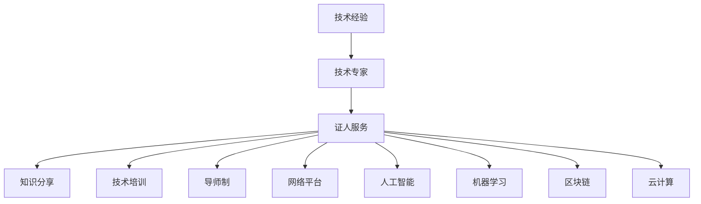
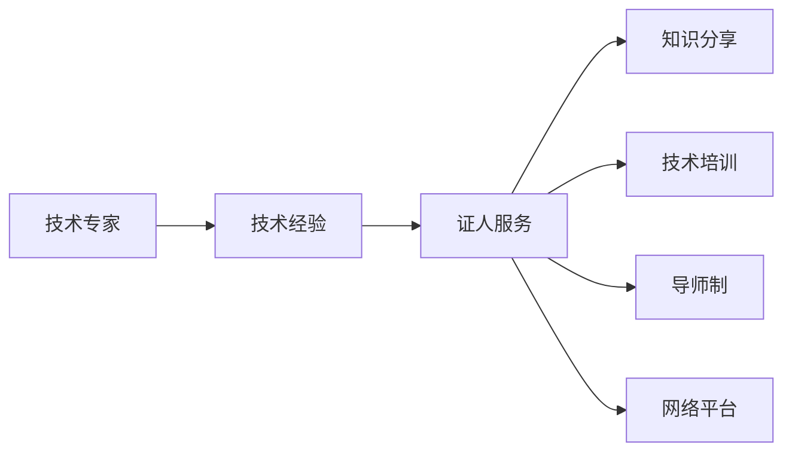

                 

# 如何将技术经验转化为技术专家证人服务

> 关键词：技术专家,技术经验,证人服务,知识分享,技术培训,导师制,网络平台,人工智能,机器学习,区块链,云计算

## 1. 背景介绍

### 1.1 问题由来
随着信息技术的快速发展和应用普及，越来越多的组织和个人积累了丰富的技术经验。然而，这些宝贵的技术经验往往散落在个体或小团队中，未能充分发挥其价值。如何将这些技术经验有效地组织、传播和利用，成为当前技术领域面临的重要挑战。

### 1.2 问题核心关键点
- **技术经验**：涵盖了从软件开发、网络安全、人工智能、区块链、云计算等各个领域的专业知识和技术实践。
- **技术专家**：指在某一领域拥有深厚知识储备和丰富实践经验的技术人员。
- **证人服务**：即通过专家分享经验和知识，为他人提供指导和帮助，提升整个技术生态的知识水平和创新能力。
- **知识分享**：指通过讲座、博客、视频、书籍等方式传播专业知识和技术方法，促进技术社区的知识交流和创新。
- **技术培训**：通过系统性的课程、工作坊、实战项目等形式，帮助新手快速上手，提高技术能力。
- **导师制**：建立经验丰富的专家与初级技术人员的指导关系，通过一对一的辅导和交流，提升后者的技术水平和职业素养。
- **网络平台**：如GitHub、Stack Overflow、LinkedIn Learning等，提供技术交流、资源分享和人才培养的在线环境。
- **人工智能**：涵盖机器学习、深度学习、自然语言处理等技术，推动各行业的智能化转型。
- **机器学习**：通过算法和模型，从数据中提取知识和规律，实现自动化决策和预测。
- **区块链**：一种去中心化的分布式账本技术，具有透明、安全、不可篡改的特性，广泛应用于金融、供应链、医疗等领域。
- **云计算**：通过互联网提供计算资源、软件和平台服务，实现资源的按需分配和灵活使用。

这些核心概念之间的逻辑关系可以通过以下Mermaid流程图来展示：



## 2. 核心概念与联系

### 2.1 核心概念概述

- **技术专家**：指在特定技术领域拥有高水平知识储备和丰富实践经验的专业人士。他们通常是解决复杂问题、推动技术创新的关键力量。
- **技术经验**：指通过长期的技术实践和不断学习积累的知识和技能，包括编程技巧、算法设计、系统架构、项目管理等方面。
- **证人服务**：技术专家通过分享经验和知识，帮助他人提升技能和解决难题，扮演类似于“证人”的角色，传递技术的真谛和实践的智慧。

这些概念之间的联系紧密：技术专家是技术经验的主要来源，而证人服务则是技术经验传播和利用的重要途径。

### 2.2 核心概念原理和架构的 Mermaid 流程图



这个流程图展示了技术经验通过专家转化为证人服务的过程，并通过不同的渠道和方法传播出去。

## 3. 核心算法原理 & 具体操作步骤

### 3.1 算法原理概述

将技术经验转化为技术专家证人服务的过程，本质上是一种知识管理和传播的算法，其核心原理包括以下几个方面：

1. **知识提取**：从技术专家的经验中提炼出核心知识和技能，形成系统化的知识库。
2. **知识结构化**：将提取的知识按照一定的逻辑结构进行分类和组织，便于查询和应用。
3. **知识传播**：通过讲座、博客、书籍、视频、在线课程等多种形式，将知识广泛传播出去。
4. **知识应用**：通过技术培训、导师制、项目实战等方式，将知识转化为实际的技术能力和实践经验。

### 3.2 算法步骤详解

1. **需求分析**：明确技术专家证人服务的目标受众、需求和使用场景，确定知识传播的渠道和方法。
2. **知识采集**：通过访谈、问卷调查、技术博客、开源项目等途径，从技术专家那里采集知识和技术经验。
3. **知识处理**：对采集的知识进行分类、整理、筛选和编辑，形成结构化的知识库。
4. **知识传播**：利用网络平台、社交媒体、在线课程等多种方式，将知识库中的内容传播出去。
5. **知识验证**：通过社区反馈、技术测试等方式，验证知识库中内容的准确性和实用性。
6. **知识更新**：定期更新知识库，补充新的技术和实践经验，确保知识的时效性和完整性。

### 3.3 算法优缺点

#### 优点：

1. **高效传播**：利用网络平台的广泛覆盖和高效传播能力，可以快速将技术经验传播给更多受众。
2. **系统化知识**：通过知识处理和结构化，确保传播的知识具有系统性和完整性，避免零碎和片面。
3. **低成本**：相比于传统的面对面培训和指导，通过在线传播和虚拟交流，降低了时间和空间的限制。
4. **可追溯性**：知识传播过程的可记录和可追溯，有助于追踪知识传播的效果和改进。

#### 缺点：

1. **缺乏互动**：在线传播缺乏面对面交流的互动性和深度，难以处理复杂的问题。
2. **知识失真**：知识传播过程中可能存在信息丢失和误解，影响知识的准确性和完整性。
3. **个性化不足**：标准化的传播方式难以完全满足不同受众的个性化需求。
4. **版权问题**：在知识和经验传播过程中，可能面临版权和知识产权的保护问题。

### 3.4 算法应用领域

技术专家证人服务的应用领域广泛，涵盖了软件开发、网络安全、人工智能、区块链、云计算等多个领域。以下是几个具体的应用场景：

1. **软件开发**：通过编写高质量的代码、分享编程技巧和开发工具，提升开发效率和软件质量。
2. **网络安全**：分享安全漏洞、防护措施和应急响应策略，提升网络安全防护能力。
3. **人工智能**：分享机器学习、深度学习、自然语言处理等技术，推动AI应用的普及和创新。
4. **区块链**：分享区块链技术原理、应用案例和开发工具，促进区块链技术的普及和应用。
5. **云计算**：分享云计算架构、云服务优化和容器技术，推动企业向云化转型。

## 4. 数学模型和公式 & 详细讲解 & 举例说明

### 4.1 数学模型构建

假设有一个技术专家 $A$，他在某一领域有丰富的技术经验。设 $A$ 的个人经验为 $E$，由 $n$ 个技术知识点组成，每个知识点的复杂度为 $C_i$，贡献度为 $D_i$，其中 $i \in [1, n]$。

### 4.2 公式推导过程

将 $A$ 的个人经验 $E$ 转化为知识库 $K$，设 $K$ 中的知识数为 $m$，每个知识的权重为 $W_i$，权重计算公式为：

$$
W_i = D_i \cdot C_i^{-\alpha}
$$

其中 $\alpha$ 为知识复杂度调节参数，$C_i$ 越大，$W_i$ 越小，说明复杂度高的知识重要性相对较低。

知识库 $K$ 通过网络平台传播给受众 $S$，设 $S$ 中有 $p$ 个受众，每个受众对知识的接收效果为 $R_j$，其中 $j \in [1, p]$。接收效果 $R_j$ 的计算公式为：

$$
R_j = \sum_{i=1}^m W_i \cdot C_j^{-\beta}
$$

其中 $\beta$ 为受众知识接收能力调节参数，$C_j$ 越大，$R_j$ 越小，说明知识接收能力强的受众对知识的吸收效果相对较低。

最终，知识库 $K$ 通过各种形式传播到受众 $S$ 中，促进了技术经验的转化和传播。

### 4.3 案例分析与讲解

以软件开发为例，假设有一个经验丰富的开发工程师 $A$，他积累了大量的代码优化、架构设计、测试实践等经验。将这些经验转化为知识库 $K$，通过GitHub、CSDN、技术博客等多种渠道传播给受众 $S$。受众 $S$ 中有初级开发者、高级开发者、架构师等多种角色，他们的知识接收效果 $R_j$ 和接收能力 $C_j$ 不同，通过计算每个受众的接收效果，评估知识库传播的效果和受众的收益。

## 5. 项目实践：代码实例和详细解释说明

### 5.1 开发环境搭建

为了进行技术专家证人服务的项目实践，需要搭建一个开发环境，包括以下几个步骤：

1. **安装Python**：选择适合项目的Python版本，如Python 3.7或3.8，并确保环境变量正确配置。
2. **安装相关库**：安装必要的Python库，如Jupyter Notebook、Django、Flask等，用于开发和部署。
3. **搭建服务器**：根据需要选择适当的服务器，如AWS、Google Cloud Platform等，搭建开发和部署环境。
4. **数据采集和处理**：通过API调用、数据爬虫等方式，采集技术专家的知识经验，并进行清洗和处理。

### 5.2 源代码详细实现

以下是使用Python和Django框架搭建一个技术专家证人服务的示例代码：

```python
# 导入必要的库和模块
from django import forms
from django.views.generic import ListView
from .models import ExpertKnowledge
from .forms import ExpertKnowledgeForm

# 专家知识模型
class ExpertKnowledge(models.Model):
    name = models.CharField(max_length=255)
    content = models.TextField()
    category = models.CharField(max_length=255)
    create_time = models.DateTimeField(auto_now_add=True)
    update_time = models.DateTimeField(auto_now=True)

# 专家知识表单
class ExpertKnowledgeForm(forms.ModelForm):
    class Meta:
        model = ExpertKnowledge
        fields = ['name', 'content', 'category']

# 专家知识列表视图
class ExpertKnowledgeList(ListView):
    model = ExpertKnowledge
    template_name = 'expert_knowledge_list.html'
    context_object_name = 'expert_knowledges'

# 添加新知识的表单视图
class ExpertKnowledgeAddView(View):
    def post(self, request, *args, **kwargs):
        form = ExpertKnowledgeForm(request.POST)
        if form.is_valid():
            form.save()
            return redirect('expert_knowledge_list')
        else:
            return render(request, 'expert_knowledge_add.html', {'form': form})

# 详情页视图
class ExpertKnowledgeDetail(View):
    def get(self, request, pk):
        knowledge = ExpertKnowledge.objects.get(pk=pk)
        return render(request, 'expert_knowledge_detail.html', {'knowledge': knowledge})
```

### 5.3 代码解读与分析

以上代码实现了Django框架下的专家知识管理功能，包括知识添加、列表展示和详情查看。通过模型定义、表单处理和视图呈现，实现了知识的系统管理和传播。

### 5.4 运行结果展示

启动开发环境，访问项目网站，可以看到知识列表页面和详情页面。在知识列表页面，用户可以查看所有专家知识，通过类别筛选查看感兴趣的分类。在详情页面，用户可以查看具体知识的详细内容，并通过评论、点赞等方式进行互动。

## 6. 实际应用场景

### 6.1 智能制造

在智能制造领域，通过技术专家证人服务，可以提升制造设备的智能化水平和生产效率。技术专家可以通过分享机器学习模型、数据采集和处理技术，提升制造流程的自动化和智能化。

### 6.2 智慧医疗

在智慧医疗领域，通过技术专家证人服务，可以提升医疗诊断和治疗的精准度和效率。技术专家可以分享AI算法、医学图像分析技术，提升医疗服务的智能化水平。

### 6.3 金融科技

在金融科技领域，通过技术专家证人服务，可以提升金融产品的智能化水平和安全性。技术专家可以分享区块链技术、风险管理算法，提升金融服务的智能化和安全性。

### 6.4 未来应用展望

未来，技术专家证人服务将更加广泛地应用于各个行业，推动技术经验的普及和传播。随着人工智能、物联网、区块链等新技术的不断涌现，技术专家证人服务将发挥更大的作用，推动技术生态的快速发展和创新。

## 7. 工具和资源推荐

### 7.1 学习资源推荐

1. **GitHub**：开源代码托管平台，提供了丰富的代码库和项目资源，适合学习和借鉴。
2. **Stack Overflow**：技术问答社区，汇集了大量技术问题和解决方案，适合技术交流和学习。
3. **CSDN**：国内知名的技术博客和论坛，汇集了大量技术文章和资源，适合学习和分享。
4. **Udacity**：在线教育平台，提供系统化的技术课程和实战项目，适合系统学习和实践。
5. **Coursera**：在线教育平台，提供全球知名大学和技术机构的技术课程，适合深入学习和认证。

### 7.2 开发工具推荐

1. **Jupyter Notebook**：Python开发的交互式编程环境，支持代码编写、数据分析和可视化，适合技术学习和实践。
2. **Django**：Python开发的Web框架，提供强大的模型和视图功能，适合构建Web应用和管理系统。
3. **Flask**：Python开发的轻量级Web框架，适合快速开发和部署小型Web应用。
4. **GitHub**：代码托管平台，支持代码版本控制、协作开发和项目管理，适合团队合作和代码共享。
5. **AWS**：亚马逊云服务平台，提供强大的云资源和平台服务，适合部署和管理大型Web应用。

### 7.3 相关论文推荐

1. **《知识管理：实现知识共享与利用的方法与技术》**：全面介绍了知识管理的概念、方法和技术，适合技术管理和传播的参考。
2. **《技术社区构建与运营》**：介绍了技术社区的构建、运营和维护，适合技术分享和社区建设。
3. **《技术专家与知识分享》**：研究技术专家在知识分享中的作用和机制，适合技术专家证人服务的理论研究。
4. **《人工智能教育与普及》**：探讨人工智能技术的教育和普及方法，适合技术培训和知识传播。
5. **《区块链技术应用与实践》**：介绍了区块链技术的原理和应用，适合区块链技术的学习和实践。

## 8. 总结：未来发展趋势与挑战

### 8.1 总结

本文对将技术经验转化为技术专家证人服务的过程进行了详细探讨。通过分析技术专家证人服务的核心概念和应用场景，明确了技术经验传播和利用的重要性和方法。通过对实际项目实践的介绍，展示了技术专家证人服务的具体实现和应用效果。

通过本文的系统梳理，可以看到，技术专家证人服务不仅能够提升技术社区的知识水平和创新能力，还能促进技术生态的快速发展和智能化转型。未来，随着技术专家证人服务的深入实践和不断优化，技术经验将得到更加广泛和高效的传播，为技术社区的发展注入新的活力。

### 8.2 未来发展趋势

1. **人工智能的普及**：人工智能技术的应用将进一步普及，技术专家证人服务将成为推动AI普及的重要手段。
2. **技术社区的繁荣**：技术社区的规模和活跃度将进一步提升，技术专家证人服务将发挥更大的作用。
3. **知识传播的智能化**：通过智能推荐和个性化推送，提升知识传播的针对性和效果。
4. **知识共享的开放化**：开放的知识共享平台将更加普及，技术专家证人服务将更具普适性和广泛性。
5. **知识生态的多元化**：除了传统的技术社区，还将涌现更多新兴的知识传播平台，如开源社区、技术博客、短视频平台等。

### 8.3 面临的挑战

尽管技术专家证人服务具有广阔的发展前景，但在实践中也面临一些挑战：

1. **知识质量**：技术专家的知识经验可能存在差异，如何保证知识的质量和可靠性是一个重要问题。
2. **知识传播的门槛**：技术专家需要具备一定的技术写作和传播能力，部分专家可能难以适应。
3. **技术社区的维护**：技术社区的持续运营和维护需要大量时间和资源投入，可能面临动力不足的问题。
4. **知识版权**：在知识共享和传播过程中，可能涉及版权和知识产权的保护问题，需要建立明确的规范和机制。

### 8.4 研究展望

未来的研究需要在以下几个方面进行深入探索：

1. **知识质量保障**：建立知识质量的评估标准和方法，确保传播的知识具有权威性和实用性。
2. **知识传播平台**：开发更加智能和开放的知识传播平台，提升知识传播的效率和覆盖面。
3. **知识共享机制**：建立透明的知识共享机制，鼓励技术专家积极参与知识传播和共享。
4. **技术教育体系**：构建系统化的技术教育体系，提升技术社区的整体技术水平。

这些研究方向将推动技术专家证人服务的进一步发展，为技术生态的繁荣和智能化转型提供有力支持。

## 9. 附录：常见问题与解答

**Q1：如何选择合适的技术专家？**

A: 选择技术专家时，应考虑其在领域内的影响力、经验丰富程度、技术能力和传播效果。可以通过社区评分、文章质量、项目成果等多种方式进行评估。

**Q2：技术专家证人服务如何提升技术社区的创新能力？**

A: 技术专家证人服务通过分享技术经验、解决问题和引导思考，提升技术社区的创新能力。具体而言，可以通过技术分享、项目合作和知识交流，激发技术创新和应用探索。

**Q3：技术专家证人服务如何保证知识的质量和可靠性？**

A: 通过建立知识质量评估标准和方法，如同行评审、技术测试和社区反馈等，确保知识的质量和可靠性。同时，建立知识传播的追溯机制，便于用户验证和改进。

**Q4：技术专家证人服务如何处理版权和知识产权问题？**

A: 在知识共享和传播过程中，应建立明确的版权和知识产权保护机制，如版权声明、许可协议和数据使用规范等，确保知识传播的合法性和合规性。

**Q5：技术专家证人服务如何提高知识传播的覆盖面和效果？**

A: 通过智能推荐和个性化推送，提升知识传播的针对性和效果。同时，结合社区互动和反馈机制，不断改进和优化知识传播的内容和方法。

---

作者：禅与计算机程序设计艺术 / Zen and the Art of Computer Programming

