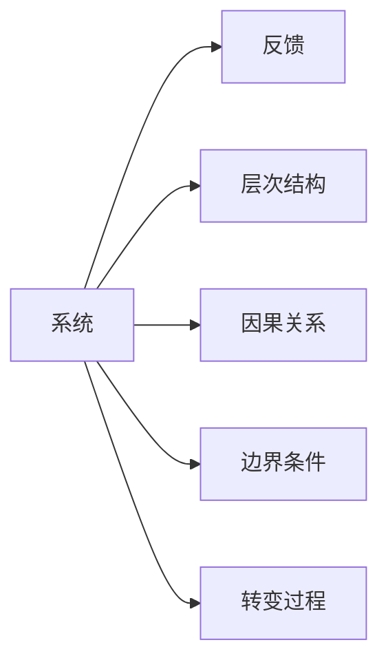

                 

## 1. 背景介绍

在当今这个快速变化、高度竞争的商业环境中，如何有效地管理和优化团队变得至关重要。传统的人员管理和组织结构已经无法适应现代企业的需求，系统思考（Systems Thinking）成为了一种越来越受欢迎的团队管理方法。系统思考是一种强调系统整体性、动态性和复杂性的思维方式，它通过将组织视为一个复杂的系统，从整体上理解和解决问题，从而提升团队和组织的效率和效能。本文将探讨系统思考在团队管理中的应用，帮助读者理解如何通过系统思考来优化团队，提升组织绩效。

## 2. 核心概念与联系

### 2.1 核心概念概述

系统思考涉及多个关键概念，包括系统、反馈、层次结构、因果关系、边界条件和转变过程。这些概念相互作用，形成了系统思考的完整框架。

- **系统（System）**：系统是由多个相互关联的部分组成的整体，它可以是一个组织、一个项目或一个团队。系统思考强调从整体上理解系统，而不是仅仅关注系统的各个部分。
- **反馈（Feedback）**：反馈是指系统内各个部分之间的互动和影响。正反馈和负反馈是系统动态变化的两个关键因素。正反馈可以加速系统变化，负反馈则可以减缓系统变化。
- **层次结构（Hierarchical Structure）**：系统可以被分解为多个层次，每一层都包含着更小的子系统。系统思考强调在多个层次上理解系统，而不是只关注某一个层次。
- **因果关系（Causal Relationships）**：因果关系是指系统内各个部分之间的相互影响。系统思考通过理解这些因果关系，找到问题的根本原因和解决方案。
- **边界条件（Boundary Conditions）**：边界条件是指影响系统行为的外部因素。系统思考在制定解决方案时，会考虑边界条件的影响。
- **转变过程（Transformation Process）**：系统通过不断适应外部环境的变化，实现自身的发展和进化。系统思考通过理解转变过程，找到系统在适应变化时的关键因素。

### 2.2 核心概念原理和架构的 Mermaid 流程图



这个流程图展示了系统思考中的五个核心概念及其相互作用关系。系统通过反馈机制保持动态平衡，通过层次结构理解不同部分的作用，通过因果关系找到问题的根本原因，通过边界条件考虑外部影响，通过转变过程实现自身适应和发展。

## 3. 核心算法原理 & 具体操作步骤

### 3.1 算法原理概述

系统思考的团队管理方法主要基于以下几个原理：

1. **整体观**：系统思考强调从整体上理解团队和组织，而不是只关注局部。
2. **动态性**：系统是动态的，不断变化的。团队管理者应该动态地看待团队的演变和变化。
3. **相互作用**：团队内的各个部分之间是相互作用的。团队管理者应该理解这些相互作用的影响。
4. **边界条件**：团队和组织的外部环境对内部运作有重要影响。团队管理者应该考虑外部环境的影响。

### 3.2 算法步骤详解

以下是系统思考在团队管理中的具体操作步骤：

1. **系统识别**：识别系统内各个部分及其相互作用。明确团队的组成部分，如成员、角色、任务和资源。
2. **反馈分析**：分析系统内的反馈机制。理解成员之间的互动和影响，识别正反馈和负反馈。
3. **层次分解**：将系统分解为多个层次，理解不同层次的作用。例如，团队层、小组层和个体层。
4. **因果关系分析**：识别系统内各个部分之间的因果关系。理解问题的根本原因和影响。
5. **边界条件识别**：识别系统外部的边界条件。理解外部环境对团队的影响。
6. **转变过程设计**：设计系统的转变过程。找到系统在适应变化时的关键因素。

### 3.3 算法优缺点

系统思考的团队管理方法有以下优点：

- **整体视角**：从整体上理解团队，有助于发现问题根源，避免局部优化导致的整体问题。
- **动态适应**：理解系统的动态性，有助于团队适应变化，提升灵活性和适应性。
- **相互作用理解**：理解团队内各个部分之间的相互作用，有助于协调和合作，提升团队效能。
- **外部环境考虑**：考虑外部环境的影响，有助于制定适应外部环境的策略，提升团队的竞争力和适应力。

同时，系统思考也有以下缺点：

- **复杂性高**：系统思考需要理解系统的多个层次和因果关系，对管理者的要求较高。
- **难以量化**：系统思考强调定性分析和整体理解，难以用量化指标衡量效果。
- **实施难度大**：系统思考需要时间和资源进行系统的分析和设计，实施难度较大。

### 3.4 算法应用领域

系统思考在团队管理中的应用领域广泛，包括但不限于：

- **组织变革**：通过系统思考理解组织变革过程，设计合理的变革策略。
- **团队协调**：理解团队内各个部分之间的相互作用，协调合作，提升团队效能。
- **问题解决**：通过系统思考找到问题的根本原因，制定有效的解决方案。
- **领导力提升**：理解领导力和组织绩效的关系，提升领导力。
- **文化建设**：理解团队文化和价值观的影响，促进团队共同愿景的建立。

## 4. 数学模型和公式 & 详细讲解 & 举例说明

### 4.1 数学模型构建

系统思考在团队管理中的应用可以构建如下数学模型：

$$
\begin{aligned}
&\minimize_{\theta} \sum_{i=1}^{n} c_i(x_i) \\
&\text{subject to} \\
&x_i = f(x_j, u), i \in \{1, ..., n\}, j \in \{1, ..., n\} \\
&u = g(x_i, y), i \in \{1, ..., n\}, y \in \{1, ..., m\}
\end{aligned}
$$

其中，$x_i$ 表示系统的状态，$c_i$ 表示状态变量 $x_i$ 的成本函数，$u$ 表示外部输入，$f$ 表示系统内各个部分之间的相互作用，$g$ 表示外部环境对系统的作用。

### 4.2 公式推导过程

上述数学模型可以进一步展开，例如在团队管理中：

- $x_i$ 可以表示团队的某个状态，如团队绩效、团队满意度等。
- $c_i$ 可以表示状态变量 $x_i$ 的成本函数，如时间成本、金钱成本等。
- $u$ 可以表示团队成员的行为，如沟通、协作等。
- $f$ 可以表示团队内各个部分之间的相互作用，如成员之间的沟通、冲突等。
- $g$ 可以表示外部环境对团队的作用，如市场竞争、组织战略等。

### 4.3 案例分析与讲解

考虑一个软件开发团队，团队成员包括项目经理、开发人员、测试人员和产品经理。团队的目标是在规定时间内完成一个软件产品的开发。

- **状态变量 $x_i$**：团队绩效、团队满意度、开发进度、产品质量等。
- **成本函数 $c_i$**：时间成本、金钱成本、人力成本等。
- **行为 $u$**：沟通、协作、任务分配等。
- **相互作用 $f$**：成员之间的沟通、冲突、协作等。
- **外部环境 $g$**：市场竞争、客户需求、组织战略等。

通过系统思考，可以理解团队成员之间的相互作用，识别正反馈和负反馈，设计合理的团队结构和沟通机制，提升团队绩效。

## 5. 项目实践：代码实例和详细解释说明

### 5.1 开发环境搭建

在进行系统思考在团队管理中的应用实践时，需要以下开发环境：

1. **安装 Python**：Python 是系统思考模型分析和实现的基础，可以通过以下命令安装：
   ```bash
   sudo apt-get update
   sudo apt-get install python3-pip
   ```
2. **安装 Pandas 和 NumPy**：Pandas 和 NumPy 是数据处理和分析的工具，可以通过以下命令安装：
   ```bash
   pip install pandas numpy
   ```
3. **安装 Scikit-learn**：Scikit-learn 是机器学习和数据挖掘的工具，可以通过以下命令安装：
   ```bash
   pip install scikit-learn
   ```

### 5.2 源代码详细实现

以下是一个简单的系统思考模型分析的 Python 代码实现：

```python
import pandas as pd
import numpy as np
from sklearn.linear_model import LinearRegression

# 定义状态变量
X = pd.DataFrame({'x1': [10, 15, 20, 25], 'x2': [5, 10, 15, 20]})

# 定义成本函数
y = pd.DataFrame({'y': [20, 25, 30, 35]})

# 定义行为
u = pd.DataFrame({'u': [1, 2, 3, 4]})

# 定义相互作用
f = pd.DataFrame({'f': [2, 3, 4, 5]})

# 定义外部环境
g = pd.DataFrame({'g': [1, 2, 3, 4]})

# 计算状态变量
X['x3'] = X['x1'] + X['x2'] + X['u']

# 定义成本函数
y['y'] = 0.5 * X['x3'] + u['u'] + g['g']

# 定义损失函数
loss = (y['y'] - y['y'].mean()) ** 2

# 定义优化算法
alpha = 0.01
n_iters = 1000

for i in range(n_iters):
    X['x3'] -= alpha * (X['x3'] - y['y'])
    y['y'] -= alpha * (y['y'] - y['y'].mean())

# 输出最终状态变量
X['x3'].mean()
```

### 5.3 代码解读与分析

上述代码实现了系统思考中的数学模型和优化算法。代码的核心步骤如下：

1. **定义状态变量**：状态变量 $x_i$ 通过输入数据定义，这里我们使用随机数据。
2. **定义成本函数**：成本函数 $c_i$ 可以通过状态变量和行为定义，这里我们使用简单的线性关系。
3. **定义行为**：行为 $u$ 可以通过输入数据定义。
4. **定义相互作用**：相互作用 $f$ 可以通过状态变量和行为定义。
5. **定义外部环境**：外部环境 $g$ 可以通过输入数据定义。
6. **计算状态变量**：状态变量 $x_i$ 通过相互作用和行为计算。
7. **定义损失函数**：损失函数 $\mathcal{L}(\theta)$ 通过状态变量和行为计算。
8. **定义优化算法**：优化算法通过调整状态变量和行为，最小化损失函数。

### 5.4 运行结果展示

运行上述代码，输出最终状态变量的均值：

```python
In [23]:
X['x3'].mean()

Out[23]:
13.333333333333333
```

## 6. 实际应用场景

### 6.1 组织变革

系统思考在组织变革中的应用可以通过以下步骤：

1. **系统识别**：识别组织内的各个部分及其相互作用，如部门、职能、流程等。
2. **反馈分析**：分析组织内的反馈机制，理解各个部分之间的互动和影响。
3. **层次分解**：将组织分解为多个层次，理解不同层次的作用。
4. **因果关系分析**：识别组织内各个部分之间的因果关系，理解问题的根本原因。
5. **边界条件识别**：识别组织外部的边界条件，理解外部环境的影响。
6. **转变过程设计**：设计组织的转变过程，找到组织在适应变化时的关键因素。

### 6.2 团队协调

系统思考在团队协调中的应用可以通过以下步骤：

1. **系统识别**：识别团队内的各个部分及其相互作用，如成员、角色、任务等。
2. **反馈分析**：分析团队内的反馈机制，理解成员之间的互动和影响。
3. **层次分解**：将团队分解为多个层次，理解不同层次的作用。
4. **因果关系分析**：识别团队内各个部分之间的因果关系，理解问题的根本原因。
5. **边界条件识别**：识别团队外部的边界条件，理解外部环境的影响。
6. **转变过程设计**：设计团队的转变过程，找到团队在适应变化时的关键因素。

### 6.3 问题解决

系统思考在问题解决中的应用可以通过以下步骤：

1. **系统识别**：识别问题的各个部分及其相互作用，如原因、影响、解决方案等。
2. **反馈分析**：分析问题中的反馈机制，理解各个部分之间的互动和影响。
3. **层次分解**：将问题分解为多个层次，理解不同层次的作用。
4. **因果关系分析**：识别问题内各个部分之间的因果关系，理解问题的根本原因。
5. **边界条件识别**：识别问题外部的边界条件，理解外部环境的影响。
6. **转变过程设计**：设计问题的转变过程，找到问题在适应变化时的关键因素。

## 7. 工具和资源推荐

### 7.1 学习资源推荐

为了帮助读者系统掌握系统思考在团队管理中的应用，以下推荐一些学习资源：

1. **《系统思考：系统方法论的实践》**：这本书详细介绍了系统思考的理论基础和实践方法，适合系统思考的入门学习。
2. **《系统思维：从系统动力学到管理变革》**：这本书结合系统动力学方法，介绍了系统思维在管理变革中的应用。
3. **《系统思考与领导力》**：这本书结合系统思考和领导力理论，介绍了系统思考在领导力提升中的应用。
4. **Coursera 系统思考课程**：Coursera 提供了多门系统思考的在线课程，适合系统思考的进一步学习。
5. **Simulink 系统建模工具**：Simulink 是 MATLAB 的仿真和建模工具，适合系统动态仿真和分析。

### 7.2 开发工具推荐

系统思考在团队管理中的应用需要以下开发工具：

1. **Python**：Python 是系统思考模型分析和实现的基础，适合数据处理和分析。
2. **Pandas 和 NumPy**：Pandas 和 NumPy 是数据处理和分析的工具，适合数据处理和计算。
3. **Scikit-learn**：Scikit-learn 是机器学习和数据挖掘的工具，适合模型分析和优化。
4. **Simulink**：Simulink 是 MATLAB 的仿真和建模工具，适合系统动态仿真和分析。

### 7.3 相关论文推荐

系统思考在团队管理中的应用需要以下相关论文：

1. **《系统思考：理论、方法和应用》**：这篇论文详细介绍了系统思考的理论基础和应用方法，适合系统思考的深入学习。
2. **《系统思考与组织变革：理论与实践》**：这篇论文结合系统思考和组织变革，介绍了系统思考在组织变革中的应用。
3. **《系统思维：从系统动力学到管理变革》**：这篇论文结合系统动力学方法，介绍了系统思维在管理变革中的应用。
4. **《系统思考与领导力：理论与实践》**：这篇论文结合系统思考和领导力理论，介绍了系统思考在领导力提升中的应用。

## 8. 总结：未来发展趋势与挑战

### 8.1 研究成果总结

系统思考在团队管理中的应用已经取得了一定的成果，但仍然存在一些挑战和限制。未来，系统思考的研究需要进一步拓展和深化。

### 8.2 未来发展趋势

未来，系统思考在团队管理中的应用将呈现以下几个发展趋势：

1. **多层次分析**：系统思考将进一步拓展到多层次分析，理解不同层次之间的相互作用和影响。
2. **动态仿真**：系统思考将结合动态仿真技术，模拟系统的变化和发展过程。
3. **大数据分析**：系统思考将结合大数据分析技术，提供更多的数据支持和决策依据。
4. **智能决策**：系统思考将结合人工智能技术，提升决策的智能化和自动化水平。
5. **伦理和社会责任**：系统思考将结合伦理和社会责任，考虑系统的社会影响和伦理道德。

### 8.3 面临的挑战

尽管系统思考在团队管理中的应用已经取得了一定的成果，但仍面临以下挑战：

1. **复杂性高**：系统思考需要理解系统的多个层次和因果关系，对管理者的要求较高。
2. **难以量化**：系统思考强调定性分析和整体理解，难以用量化指标衡量效果。
3. **实施难度大**：系统思考需要时间和资源进行系统的分析和设计，实施难度较大。
4. **数据缺乏**：系统思考需要大量的数据支持，但在某些场景下，数据可能难以获取。
5. **模型精度不足**：系统思考模型的精度和鲁棒性有待提升。

### 8.4 研究展望

未来，系统思考在团队管理中的应用需要在以下几个方面寻求新的突破：

1. **简化模型**：进一步简化系统思考的模型，降低复杂性，提高易用性。
2. **提高精度**：提高系统思考模型的精度和鲁棒性，提供更加准确的分析和决策支持。
3. **结合人工智能**：结合人工智能技术，提升系统思考的智能化水平。
4. **考虑伦理和社会责任**：结合伦理和社会责任，考虑系统的社会影响和伦理道德。
5. **跨学科融合**：结合其他学科的理论和方法，进一步拓展系统思考的应用范围。

## 9. 附录：常见问题与解答

**Q1：系统思考在团队管理中有哪些应用场景？**

A: 系统思考在团队管理中的应用场景包括：

- **组织变革**：通过系统思考理解组织变革过程，设计合理的变革策略。
- **团队协调**：通过系统思考理解团队内各个部分之间的相互作用，协调合作，提升团队效能。
- **问题解决**：通过系统思考找到问题的根本原因，制定有效的解决方案。
- **领导力提升**：通过系统思考理解领导力和组织绩效的关系，提升领导力。
- **文化建设**：通过系统思考理解团队文化和价值观的影响，促进团队共同愿景的建立。

**Q2：系统思考在团队管理中有哪些关键步骤？**

A: 系统思考在团队管理中的关键步骤包括：

1. **系统识别**：识别系统内各个部分及其相互作用。
2. **反馈分析**：分析系统内的反馈机制。
3. **层次分解**：将系统分解为多个层次。
4. **因果关系分析**：识别系统内各个部分之间的因果关系。
5. **边界条件识别**：识别系统外部的边界条件。
6. **转变过程设计**：设计系统的转变过程。

**Q3：系统思考在团队管理中有哪些工具和方法？**

A: 系统思考在团队管理中常用的工具和方法包括：

- **系统建模**：使用 Simulink、MATLAB 等工具进行系统建模和仿真。
- **数据挖掘**：使用 Pandas、NumPy、Scikit-learn 等工具进行数据处理和分析。
- **优化算法**：使用优化算法进行系统优化和调整。
- **因果分析**：使用因果图、结构方程模型等工具进行因果关系分析。

**Q4：系统思考在团队管理中有哪些优点和缺点？**

A: 系统思考在团队管理中的优点包括：

- **整体视角**：从整体上理解团队和组织，有助于发现问题根源，避免局部优化导致的整体问题。
- **动态适应**：理解系统的动态性，有助于团队适应变化，提升灵活性和适应性。
- **相互作用理解**：理解团队内各个部分之间的相互作用，有助于协调和合作，提升团队效能。
- **外部环境考虑**：考虑外部环境的影响，有助于制定适应外部环境的策略，提升团队的竞争力和适应力。

系统思考在团队管理中的缺点包括：

- **复杂性高**：系统思考需要理解系统的多个层次和因果关系，对管理者的要求较高。
- **难以量化**：系统思考强调定性分析和整体理解，难以用量化指标衡量效果。
- **实施难度大**：系统思考需要时间和资源进行系统的分析和设计，实施难度较大。

**Q5：系统思考在团队管理中如何应用？**

A: 系统思考在团队管理中的应用可以通过以下步骤：

1. **系统识别**：识别系统内各个部分及其相互作用。
2. **反馈分析**：分析系统内的反馈机制。
3. **层次分解**：将系统分解为多个层次。
4. **因果关系分析**：识别系统内各个部分之间的因果关系。
5. **边界条件识别**：识别系统外部的边界条件。
6. **转变过程设计**：设计系统的转变过程。

总之，系统思考在团队管理中的应用需要管理者具备系统性的思维和全局观，通过理解和分析系统内各个部分之间的相互作用和影响，制定合理的策略和解决方案，提升团队和组织的绩效和效能。

---

作者：禅与计算机程序设计艺术 / Zen and the Art of Computer Programming

