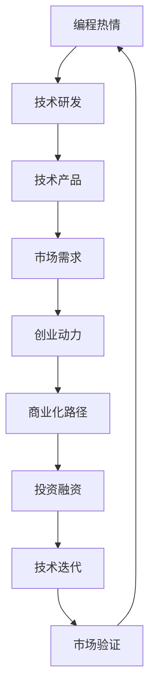

                 

# 如何将编程热情转化为创业动力

> 关键词：编程热情,创业动力,技术创业,人工智能创业,数据科学创业,创新驱动,商业化路径,技术迭代,市场验证,投资融资

## 1. 背景介绍

### 1.1 问题由来
在现代社会，编程不仅仅是开发软件、构建网络服务的技能，更是推动技术创新、实现商业价值的重要工具。编程的热情让许多开发者投入到技术研发中，但如何将这种热情转化为实际的市场竞争力，是许多创业者面临的难题。如何有效地将编程热情转化为创业动力，将技术成果转化为商业价值，是本文探讨的核心话题。

### 1.2 问题核心关键点
将编程热情转化为创业动力，主要关注以下几个关键点：
- 如何将个人技术爱好与市场需求有效结合？
- 如何评估技术产品的市场需求和潜力？
- 如何在技术研发和市场推广中取得平衡？
- 如何获得投资融资和商业合作？
- 如何应对技术迭代和市场变化？

这些关键点构成了技术创业的基石，帮助创业者在复杂多变的市场环境中脱颖而出。

### 1.3 问题研究意义
技术创业不仅能够实现个人价值，还能推动技术进步、促进经济发展。将编程热情转化为创业动力，可以帮助创业者更好地理解市场需求，快速迭代技术产品，实现从技术研发到市场应用的顺畅转换，最终形成具有竞争力的技术企业和商业模式。

## 2. 核心概念与联系

### 2.1 核心概念概述

要深入探讨如何将编程热情转化为创业动力，首先需要理解几个核心概念：

- **编程热情(Programming Enthusiasm)**：指开发者对编程的热情和兴趣，包括对新技术的探索、对解决问题的热情等。这种热情是技术创业的驱动力。
- **创业动力(Entrepreneurial Drive)**：指创业者在技术创业过程中所表现出的积极态度、持续努力和创新精神，包括对市场机会的敏锐感知、对技术应用的深刻理解等。
- **技术创业(Technology Venture)**：指以技术创新为核心，通过开发新技术、新应用来解决实际问题的创业活动。
- **市场需求(Market Demand)**：指市场上对产品或服务的需求程度，包括消费者的购买意愿、支付能力等。
- **商业化路径(Commercialization Path)**：指从技术研发到市场应用的路径，包括产品开发、市场推广、销售渠道、用户反馈等环节。
- **投资融资(Venture Capital)**：指创业者通过各种方式获取资金支持，包括天使投资、风险投资、政府支持等。
- **技术迭代(Technology Iteration)**：指在市场和用户反馈的基础上，不断改进和优化技术产品的过程。
- **市场验证(Market Validation)**：指通过小规模市场测试，验证产品或服务的市场需求和竞争力的过程。

这些核心概念之间存在着紧密的联系，编程热情为技术创业提供动力，市场需求驱动产品创新，创业动力和市场需求共同决定商业化路径，而技术迭代和投资融资则是实现创业成功的关键手段。

### 2.2 核心概念原理和架构的 Mermaid 流程图



这个流程图展示了编程热情转化为创业动力的主要路径和关键环节。编程热情驱动技术研发，技术产品满足市场需求，创业动力推动商业化路径，投资融资提供资金支持，技术迭代保证产品竞争力，市场验证确保产品方向的正确性。

## 3. 核心算法原理 & 具体操作步骤

### 3.1 算法原理概述

将编程热情转化为创业动力的过程，可以视为一种优化问题，目标是最大化创业成功的可能性。这里的"成功"包括产品被市场接受、获得投资融资、形成商业模式等。核心算法原理包括以下几个步骤：

1. **需求分析**：识别潜在市场需求，确定技术产品的价值主张。
2. **技术研发**：开发具有竞争力的技术产品，满足市场需求。
3. **市场验证**：通过小规模测试验证技术产品的市场需求和竞争力。
4. **商业化策略**：根据市场反馈调整商业化路径，制定有效的销售和营销策略。
5. **投资融资**：获取资金支持，加速产品迭代和市场推广。
6. **技术迭代**：根据市场反馈和技术趋势，持续改进技术产品。

### 3.2 算法步骤详解

下面详细讲解每个步骤的具体操作方法：

**Step 1: 需求分析**

需求分析是技术创业的第一步，需要通过市场调研、用户访谈等方式，明确目标用户的需求和痛点。具体步骤如下：

1. **市场调研**：收集行业报告、竞争对手分析、用户反馈等数据，了解市场现状和趋势。
2. **用户访谈**：与目标用户进行深入访谈，了解他们的具体需求、期望和痛点。
3. **需求分析**：综合调研和访谈结果，识别关键需求和痛点，确定技术产品的价值主张。

**Step 2: 技术研发**

技术研发阶段需要开发具有创新性的技术产品，满足市场需求。具体步骤如下：

1. **选择技术框架**：根据市场需求和自身技术优势，选择合适的技术框架和开发工具。
2. **团队组建**：组建一支具备技术研发能力、市场洞察力的团队。
3. **产品设计**：设计符合市场需求的技术产品，明确产品的功能和特性。
4. **原型开发**：开发产品原型，进行初步测试和验证。

**Step 3: 市场验证**

市场验证阶段需要通过小规模测试，验证技术产品的市场需求和竞争力。具体步骤如下：

1. **定义测试目标**：明确测试目标和评价指标，如用户满意度、市场占有率等。
2. **选择测试样本**：选择代表性的目标用户群体，进行小规模测试。
3. **数据收集与分析**：收集测试数据，分析用户反馈和市场表现，评估产品的市场需求和竞争力。

**Step 4: 商业化策略**

商业化策略阶段需要根据市场反馈调整商业化路径，制定有效的销售和营销策略。具体步骤如下：

1. **市场定位**：根据测试结果，明确产品的市场定位和目标用户群体。
2. **销售策略**：制定合理的销售策略，包括定价、渠道选择、促销活动等。
3. **营销策略**：制定有效的营销策略，通过广告、公关、社交媒体等渠道推广产品。

**Step 5: 投资融资**

投资融资阶段需要获取资金支持，加速产品迭代和市场推广。具体步骤如下：

1. **撰写商业计划书**：详细描述技术产品、市场需求、商业化策略和财务预测，吸引潜在投资者。
2. **寻找投资者**：通过天使投资、风险投资、政府支持等方式寻找资金支持。
3. **谈判投资条款**：与投资者进行谈判，达成投资协议，明确投资金额、股权分配、融资用途等。

**Step 6: 技术迭代**

技术迭代阶段需要根据市场反馈和技术趋势，持续改进技术产品。具体步骤如下：

1. **收集用户反馈**：定期收集用户反馈和市场数据，了解产品使用情况和用户需求。
2. **产品优化**：根据反馈和数据，优化产品功能和特性，提升用户体验。
3. **技术升级**：引入新技术、新方法，提升产品性能和竞争力。

### 3.3 算法优缺点

将编程热情转化为创业动力的算法具有以下优点：

1. **系统性**：通过明确的步骤和流程，系统地实现从技术研发到市场应用的转换，避免盲目尝试。
2. **灵活性**：可以根据市场需求和技术趋势，灵活调整产品策略和商业化路径。
3. **高效性**：通过市场验证和用户反馈，快速迭代产品，缩短市场进入时间。

同时，也存在一些缺点：

1. **风险高**：市场需求和竞争环境复杂多变，技术创业具有较高的失败风险。
2. **资金需求大**：技术研发和市场推广需要大量资金支持，可能面临资金不足的挑战。
3. **技术迭代难度大**：技术产品迭代涉及多方面因素，需要团队协作和技术积累。

### 3.4 算法应用领域

将编程热情转化为创业动力的算法广泛应用于以下领域：

- **人工智能创业**：利用AI技术解决实际问题，开发智能应用和产品。
- **数据科学创业**：通过数据分析和机器学习技术，提供数据驱动的解决方案。
- **互联网创业**：开发互联网平台和应用，满足用户需求，提升用户体验。
- **物联网创业**：开发物联网设备和系统，实现智能控制和数据监测。
- **可穿戴设备创业**：开发可穿戴设备和应用，提升健康和生产效率。

这些领域的技术创业都需要将编程热情转化为创业动力，通过技术研发和市场验证，实现商业化目标。

## 4. 数学模型和公式 & 详细讲解 & 举例说明

### 4.1 数学模型构建

假设市场需求为 $D$，技术产品的价值主张为 $V$，创业者的时间成本为 $T$，创业所需资金为 $C$，技术迭代的速度为 $\alpha$，市场验证的结果为 $M$，则创业成功的数学模型可以表示为：

$$
S = f(D, V, T, C, \alpha, M)
$$

其中 $S$ 表示创业成功的概率，$f$ 为非线性函数，反映了多个因素的综合作用。

### 4.2 公式推导过程

根据上述模型，我们可以推导出以下公式：

1. **市场需求**：$D = f(U)$，其中 $U$ 为用户群体规模和用户需求。
2. **价值主张**：$V = f(P)$，其中 $P$ 为产品功能和用户体验。
3. **时间成本**：$T = f(N)$，其中 $N$ 为团队规模和技术积累。
4. **资金需求**：$C = f(S)$，其中 $S$ 为销售渠道和市场推广策略。
5. **技术迭代速度**：$\alpha = f(E)$，其中 $E$ 为技术研发和测试的效率。
6. **市场验证结果**：$M = f(T, U, C)$，反映了市场验证的有效性和可靠性。

通过这些公式，我们可以更深入地理解创业成功的关键因素，并进行针对性的优化。

### 4.3 案例分析与讲解

以人工智能创业为例，分析如何将编程热情转化为创业动力。

**案例背景**：
一家创业公司希望通过开发智能客服系统，解决企业客户服务效率低下的问题。公司创始人对编程充满热情，拥有丰富的技术背景。

**需求分析**：
通过市场调研和用户访谈，了解企业对智能客服的需求，发现主要痛点在于响应时间长、服务质量不稳定。

**技术研发**：
选择Python作为开发语言，使用TensorFlow构建智能客服模型，引入自然语言处理和机器学习技术。

**市场验证**：
选择几家企业进行小规模测试，收集用户反馈和满意度数据，评估模型性能和市场需求。

**商业化策略**：
根据测试结果，确定目标市场和企业客户，制定销售策略和营销方案。

**投资融资**：
撰写商业计划书，吸引天使投资，获得100万美元的资金支持。

**技术迭代**：
根据用户反馈，不断优化智能客服模型，引入多轮次测试和用户反馈机制。

最终，这家创业公司在市场验证后获得了多家企业的认可，成功签署了合作协议，实现了技术创业的成功。

## 5. 项目实践：代码实例和详细解释说明

### 5.1 开发环境搭建

在进行技术创业时，开发环境搭建至关重要。以下是使用Python进行技术创业的开发环境配置流程：

1. **安装Anaconda**：从官网下载并安装Anaconda，用于创建独立的Python环境。

2. **创建并激活虚拟环境**：
```bash
conda create -n my_env python=3.9 
conda activate my_env
```

3. **安装必要的工具包**：
```bash
pip install numpy pandas matplotlib scikit-learn
```

4. **配置开发环境**：
```bash
# 安装TensorFlow
pip install tensorflow
# 安装PyTorch
pip install torch
# 安装Pandas
pip install pandas
```

### 5.2 源代码详细实现

以下是一个简单的Python程序示例，用于演示技术创业的基本流程。

```python
import pandas as pd
from sklearn.model_selection import train_test_split
from sklearn.linear_model import LogisticRegression
from sklearn.metrics import accuracy_score

# 读取数据集
data = pd.read_csv('sales_data.csv')

# 数据预处理
X = data[['feature1', 'feature2', 'feature3']]
y = data['sales']
X_train, X_test, y_train, y_test = train_test_split(X, y, test_size=0.2)

# 模型训练
model = LogisticRegression()
model.fit(X_train, y_train)

# 模型评估
y_pred = model.predict(X_test)
accuracy = accuracy_score(y_test, y_pred)
print('Accuracy:', accuracy)
```

### 5.3 代码解读与分析

在上述代码中，我们使用了Python的Pandas和Scikit-Learn库，对一个简单的销售数据集进行了预测模型的训练和评估。具体解读如下：

1. **数据预处理**：将数据集分为特征集 $X$ 和标签集 $y$，并进行划分训练集和测试集。
2. **模型训练**：使用逻辑回归模型对训练集进行训练，生成预测模型。
3. **模型评估**：在测试集上进行预测，并计算模型准确率。

## 6. 实际应用场景

### 6.1 人工智能创业

人工智能创业是技术创业的重要领域之一，通过开发智能应用和产品，解决实际问题，满足市场需求。例如，智能客服、智能推荐系统、医疗影像诊断等都是人工智能创业的典型应用。

### 6.2 数据科学创业

数据科学创业主要利用数据分析和机器学习技术，提供数据驱动的解决方案。例如，数据挖掘、商业智能、金融分析等。

### 6.3 互联网创业

互联网创业通过开发互联网平台和应用，满足用户需求，提升用户体验。例如，社交网络、电子商务、在线教育等。

### 6.4 物联网创业

物联网创业开发物联网设备和系统，实现智能控制和数据监测。例如，智能家居、智能制造、智慧城市等。

### 6.5 可穿戴设备创业

可穿戴设备创业开发可穿戴设备和应用，提升健康和生产效率。例如，智能手表、健康监测、工业安全等。

## 7. 工具和资源推荐

### 7.1 学习资源推荐

为了帮助创业者系统掌握技术创业的理论基础和实践技巧，这里推荐一些优质的学习资源：

1. **《创业圣经》**：著名创业导师彼得·蒂蒙斯（Peter Thiel）撰写的经典创业指南，涵盖创业的各个方面。
2. **Coursera《创业成功之道》**：斯坦福大学开设的创业课程，通过视频和作业，深入讲解创业的各个环节。
3. **Udemy《技术创业》**：由多位创业者和技术专家共同授课，涵盖技术创业的各个阶段。
4. **Startup Lessons Learned**：由Y Combinator提供的一站式创业资源，包含大量的创业案例和经验分享。
5. **Leonardo Troisi的博客**：深度剖析技术创业的各个环节，提供实用的创业建议和技术洞见。

### 7.2 开发工具推荐

高效的开发离不开优秀的工具支持。以下是几款用于技术创业开发的常用工具：

1. **GitHub**：全球最大的代码托管平台，提供丰富的代码库和协作工具。
2. **Jupyter Notebook**：交互式编程环境，适合进行数据分析和模型开发。
3. **Google Colab**：免费的GPU/TPU资源，方便开发者进行大数据和深度学习实验。
4. **Heroku**：云平台服务，方便部署和维护技术创业应用。
5. **Slack**：团队协作工具，方便团队成员实时沟通和协作。

### 7.3 相关论文推荐

技术创业需要持续学习和创新。以下是几篇奠基性的相关论文，推荐阅读：

1. **《技术创业与市场规模》**：这篇文章分析了技术创业的市场规模和驱动因素，提供了宝贵的理论指导。
2. **《技术创业成功因素》**：文章通过数据分析，总结了技术创业成功的关键因素，包括技术优势、市场需求、团队协作等。
3. **《技术创业中的风险管理》**：文章详细介绍了技术创业中的风险管理和策略，帮助创业者规避风险。
4. **《技术创业的商业模式》**：文章探讨了技术创业中的商业模式设计，提供多种创业思路和案例。
5. **《技术创业的创新路径》**：文章分析了技术创业中的创新路径和策略，帮助创业者快速迭代技术产品。

## 8. 总结：未来发展趋势与挑战

### 8.1 研究成果总结

本文系统探讨了将编程热情转化为创业动力的关键步骤和方法，提供了理论指导和实践参考。通过需求分析、技术研发、市场验证等环节，创业者可以有效地将技术优势转化为市场竞争力。

### 8.2 未来发展趋势

未来技术创业将呈现出以下趋势：

1. **技术融合加速**：大数据、人工智能、物联网等技术将深度融合，提供更加全面和精准的解决方案。
2. **市场需求多样化**：随着用户需求的不断变化，技术创业将更加注重用户体验和市场细分。
3. **创新驱动**：技术创业将更加注重原创技术和算法，推动技术创新和产品迭代。
4. **国际化发展**：技术创业将更加注重全球市场，通过跨文化合作和国际化运营，拓展市场空间。
5. **可持续发展**：技术创业将更加注重环保和社会责任，推动可持续发展。

### 8.3 面临的挑战

尽管技术创业充满机遇，但也面临着诸多挑战：

1. **市场竞争激烈**：技术创业市场竞争激烈，需要在技术创新和市场推广上保持领先。
2. **资金不足**：技术创业需要大量资金支持，资金不足可能影响项目的持续发展。
3. **技术迭代难度大**：技术产品迭代涉及多方面因素，需要团队协作和技术积累。
4. **市场验证复杂**：市场验证需要投入大量时间和资源，可能面临市场风险和不确定性。
5. **监管环境变化**：技术创业需要应对不断变化的监管环境，保持合规运营。

### 8.4 研究展望

未来技术创业的研究方向包括：

1. **技术融合与创新**：研究大数据、人工智能、物联网等技术融合的创新应用，推动技术创新和市场突破。
2. **市场细分与定制化**：研究市场细分和定制化策略，提供更加精准和个性化的解决方案。
3. **可持续发展与环保**：研究技术创业中的环保和社会责任，推动可持续发展。
4. **监管环境与合规**：研究技术创业中的监管环境变化，制定合规运营策略。

## 9. 附录：常见问题与解答

**Q1: 如何评估市场需求？**

A: 评估市场需求需要从多个维度进行分析，包括市场规模、用户需求、竞争对手分析等。通过市场调研、用户访谈、数据分析等手段，综合评估市场需求。

**Q2: 如何选择合适的技术框架？**

A: 选择合适的技术框架需要考虑多个因素，包括市场需求、技术优势、开发难度等。建议通过市场调研和用户反馈，确定技术框架，并进行小规模测试。

**Q3: 如何获取投资融资？**

A: 获取投资融资需要撰写详细的商业计划书，明确项目背景、市场需求、商业模式、财务预测等关键信息。通过天使投资、风险投资、政府支持等方式寻找资金支持。

**Q4: 如何应对技术迭代？**

A: 技术迭代需要持续进行市场调研和用户反馈，及时优化产品功能和特性，引入新技术和方法，提升产品性能和竞争力。

**Q5: 如何平衡技术研发和市场推广？**

A: 平衡技术研发和市场推广需要制定合理的时间表和资源分配策略，确保产品开发和市场推广并行推进。同时，定期进行市场验证，调整产品策略和推广方案。

---

作者：禅与计算机程序设计艺术 / Zen and the Art of Computer Programming

