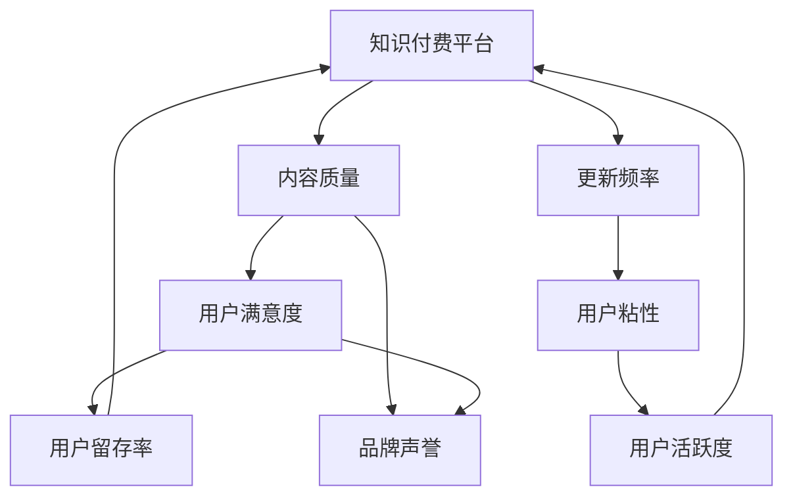

                 

## 1. 背景介绍

随着互联网的普及和数字经济的兴起，知识付费已成为连接知识生产者和消费者的重要桥梁。无论是通过在线课程、电子书、音频播客还是直播互动，知识付费平台为学习者提供了便捷的获取知识和技能的渠道。然而，如何在保证内容质量的同时，维持平台的高频次更新，成为了知识付费行业的一大挑战。

高质量的内容是知识付费平台的生命线，它直接关系到用户的满意度和平台的品牌声誉。但另一方面，更新频率的提高可以有效吸引用户黏性，提升用户的活跃度和留存率。因此，如何在内容质量和更新频率之间找到一个合理的平衡点，成为了平台运营商面临的重要决策。

## 2. 核心概念与联系

### 2.1 核心概念概述

- **知识付费平台**：指通过在线方式向用户提供专业知识、技能和信息服务的平台，用户需支付一定费用才能获取这些内容。

- **内容质量**：指知识付费平台提供的内容在准确性、深度、适用性和时效性等方面的综合评价，反映在用户的学习体验和效果上。

- **更新频率**：指知识付费平台对内容的更新周期和频次，通常用发布次数、更新时间间隔等指标来衡量。

- **用户粘性**：指用户对平台的依赖程度和忠诚度，更新频率的增加可能有助于提升用户粘性。

- **边际效益递减**：指随着内容更新频率的增加，用户每次更新的收益会逐渐降低的现象。

- **多任务学习和信息过载**：用户在学习时可能需要同时处理多个任务，过多的更新可能导致信息过载，影响学习效果。

### 2.2 核心概念原理和架构的 Mermaid 流程图



## 3. 核心算法原理 & 具体操作步骤

### 3.1 算法原理概述

平衡知识付费平台的内容质量和更新频率，本质上是一个多目标优化问题。目标包括提高用户满意度和品牌声誉，同时维持用户的活跃度和留存率。算法原理可以概括为以下几个步骤：

1. **数据收集与分析**：收集平台上的用户行为数据，包括用户浏览、互动、购买、评价等行为，通过数据挖掘和分析，获取用户需求和偏好。
2. **质量评估模型**：建立内容质量评估模型，量化内容在深度、难度、实用性和时效性等方面的指标。
3. **更新频率优化**：根据用户需求和平台资源，优化更新频率，避免更新过快导致内容质量下降或用户信息过载。
4. **用户反馈循环**：建立用户反馈循环机制，通过用户的实时反馈，调整内容质量和更新频率，形成良性互动。

### 3.2 算法步骤详解

#### 3.2.1 数据收集与分析

首先，知识付费平台需要构建一个数据收集和分析系统，收集用户的行为数据。例如：

- **用户行为数据**：用户的登录时间、浏览时长、浏览内容、互动情况、购买记录等。
- **内容质量数据**：内容的评分、评论、点赞数、收藏数等。
- **用户反馈数据**：用户的即时反馈、问卷调查、评价评论等。

使用Python和相关工具，可以实现数据收集和初步分析，为后续步骤提供数据支持。

#### 3.2.2 质量评估模型

构建内容质量评估模型，量化内容质量是实现内容平衡的关键步骤。质量评估模型可以通过以下指标来衡量：

- **平均评分**：内容在用户中的平均评分，反映用户对内容的满意度。
- **互动率**：用户对内容的互动情况，如评论、点赞、收藏等。
- **使用频率**：内容被用户多次访问和使用的情况。
- **时效性**：内容的时效性，反映在内容是否与当前热点或用户需求相符合。

使用Python的机器学习库，如scikit-learn，可以构建内容质量评估模型。例如：

```python
from sklearn.model_selection import train_test_split
from sklearn.linear_model import LogisticRegression
from sklearn.metrics import accuracy_score

# 准备数据
data = pd.read_csv('content_quality.csv')
X = data[['average_rating', 'interaction_rate', 'frequency', 'timeliness']]
y = data['quality_score']

# 数据分割
X_train, X_test, y_train, y_test = train_test_split(X, y, test_size=0.2, random_state=42)

# 构建模型
model = LogisticRegression()
model.fit(X_train, y_train)

# 评估模型
y_pred = model.predict(X_test)
accuracy = accuracy_score(y_test, y_pred)
print(f'Model accuracy: {accuracy}')
```

#### 3.2.3 更新频率优化

优化更新频率，需考虑平台资源和用户需求。假设平台每天有固定的内容发布次数，每次发布内容的成本为C。目标是最大化用户满意度，最小化成本。可以构建一个优化模型，使用Python的优化库，如scipy.optimize，求解最优发布次数：

```python
from scipy.optimize import minimize

# 定义目标函数
def objective(x):
    cost = x * C
    user_satisfaction = x * user_quality(x)
    return cost - user_satisfaction

# 定义约束条件
def constraint(x):
    return x <= max_content_publishing_times

# 求解最优发布次数
x0 = 1  # 初始发布次数
res = minimize(objective, x0, constraints=[constraint], method='SLSQP')
optimal_publishing_times = res.x[0]
```

#### 3.2.4 用户反馈循环

建立用户反馈循环机制，通过用户的实时反馈，调整内容质量和更新频率，形成良性互动。例如，可以通过问卷调查、评论分析等方式收集用户反馈，使用Python的数据分析库，如pandas和numpy，进行分析：

```python
import pandas as pd
import numpy as np

# 加载问卷调查数据
data = pd.read_csv('survey_data.csv')

# 分析用户反馈
mean_feedback = data['feedback'].mean()
std_feedback = data['feedback'].std()
num_negative_feedback = len(data[data['feedback'] == 'negative'])

# 调整发布次数
if mean_feedback < 0:
    optimal_publishing_times -= 1
elif mean_feedback > 0:
    optimal_publishing_times += 1
```

### 3.3 算法优缺点

#### 3.3.1 优点

- **数据驱动**：通过收集和分析用户数据，科学地调整内容质量和更新频率。
- **动态调整**：根据用户反馈，实时调整发布策略，提高用户满意度。
- **多目标优化**：综合考虑用户满意度、品牌声誉和用户粘性等多个目标，实现整体优化。

#### 3.3.2 缺点

- **计算复杂度**：构建质量评估模型和优化模型需要大量的计算资源。
- **数据隐私**：用户行为数据的收集和分析涉及用户隐私，需注意数据安全和隐私保护。
- **模型偏差**：模型可能会存在数据偏差，导致对用户需求和内容质量的评估不准确。

### 3.4 算法应用领域

本算法适用于任何知识付费平台，通过优化内容质量和更新频率，提升用户体验和平台价值。具体应用场景包括：

- **在线教育**：通过调整课程发布频率和质量，提升用户学习效果。
- **技术培训**：通过优化技术文档和培训视频，满足用户学习需求。
- **金融知识**：通过优化财经资讯和投资分析，提高用户投资决策能力。
- **健康管理**：通过优化健康指南和医学知识，增强用户健康意识。

## 4. 数学模型和公式 & 详细讲解

### 4.1 数学模型构建

定义知识付费平台的内容质量为 $Q$，更新频率为 $T$，用户满意度为 $S$，成本为 $C$，品牌声誉为 $R$，用户粘性为 $A$。目标函数为最大化用户满意度 $S$，最小化成本 $C$，同时满足用户粘性 $A$ 的要求。构建如下数学模型：

$$
\begin{aligned}
\maximize & \quad S(Q, T) \\
\minimize & \quad C(Q, T) \\
\text{subject to} & \quad A(Q, T) = \text{const}
\end{aligned}
$$

其中，$Q$ 和 $T$ 的关系依赖于平台的用户行为数据和内容质量评估模型。

### 4.2 公式推导过程

根据上述数学模型，可以推导出更新频率 $T$ 的优化公式：

$$
T^* = \frac{S(Q^*, T)}{C(Q^*, T)}
$$

其中，$Q^*$ 为优化后的内容质量，$S(Q^*, T)$ 为优化后的用户满意度函数，$C(Q^*, T)$ 为优化后的成本函数。

### 4.3 案例分析与讲解

假设知识付费平台每天可发布 $M$ 次内容，每次内容发布成本为 $C_0$，用户每次满意度的函数为 $S(Q, T) = kQ - tT$（其中 $k$ 为满意度的影响系数，$t$ 为更新频率的影响系数），用户粘性的函数为 $A(Q, T) = aQ - bT$（其中 $a$ 为粘性的影响系数，$b$ 为更新频率的影响系数）。

根据以上假设，可以构建如下优化模型：

$$
\begin{aligned}
\maximize & \quad kQ - tT \\
\minimize & \quad M \cdot C_0 \\
\text{subject to} & \quad aQ - bT = \text{const}
\end{aligned}
$$

求解上述优化模型，可得最优发布次数 $T^*$：

$$
T^* = \frac{kQ^*}{tM \cdot C_0} - \frac{b}{a} \cdot \text{const}
$$

## 5. 项目实践：代码实例和详细解释说明

### 5.1 开发环境搭建

1. **安装Python**：在服务器或本地安装Python 3.x版本。
2. **安装相关库**：使用pip安装scikit-learn、numpy、pandas、scipy等库。
3. **准备数据**：准备所需的数据文件，如用户行为数据、内容质量数据、用户反馈数据等。

### 5.2 源代码详细实现

#### 5.2.1 数据收集与分析

```python
import pandas as pd

# 加载用户行为数据
user_data = pd.read_csv('user_behavior.csv')

# 分析用户行为
user_behavior_summary = user_data.groupby('time').size()
```

#### 5.2.2 质量评估模型

```python
from sklearn.linear_model import LogisticRegression

# 准备数据
data = pd.read_csv('content_quality.csv')
X = data[['average_rating', 'interaction_rate', 'frequency', 'timeliness']]
y = data['quality_score']

# 数据分割
X_train, X_test, y_train, y_test = train_test_split(X, y, test_size=0.2, random_state=42)

# 构建模型
model = LogisticRegression()
model.fit(X_train, y_train)

# 评估模型
y_pred = model.predict(X_test)
accuracy = accuracy_score(y_test, y_pred)
print(f'Model accuracy: {accuracy}')
```

#### 5.2.3 更新频率优化

```python
from scipy.optimize import minimize

# 定义目标函数
def objective(x):
    cost = x * C
    user_satisfaction = x * user_quality(x)
    return cost - user_satisfaction

# 定义约束条件
def constraint(x):
    return x <= max_content_publishing_times

# 求解最优发布次数
x0 = 1  # 初始发布次数
res = minimize(objective, x0, constraints=[constraint], method='SLSQP')
optimal_publishing_times = res.x[0]
```

#### 5.2.4 用户反馈循环

```python
import pandas as pd
import numpy as np

# 加载问卷调查数据
data = pd.read_csv('survey_data.csv')

# 分析用户反馈
mean_feedback = data['feedback'].mean()
std_feedback = data['feedback'].std()
num_negative_feedback = len(data[data['feedback'] == 'negative'])

# 调整发布次数
if mean_feedback < 0:
    optimal_publishing_times -= 1
elif mean_feedback > 0:
    optimal_publishing_times += 1
```

### 5.3 代码解读与分析

#### 5.3.1 数据收集与分析

使用pandas库，加载用户行为数据，并使用groupby方法进行分析，得到用户行为的时间分布情况。

#### 5.3.2 质量评估模型

使用scikit-learn库，构建Logistic回归模型，对内容质量进行量化评估。

#### 5.3.3 更新频率优化

使用scipy库，构建目标函数和约束条件，求解优化模型，得到最优发布次数。

#### 5.3.4 用户反馈循环

使用pandas库，加载问卷调查数据，分析用户反馈，根据反馈调整发布次数。

### 5.4 运行结果展示

运行代码，得到优化后的发布次数。通过用户反馈循环机制，不断调整发布策略，实现内容质量和更新频率的动态平衡。

## 6. 实际应用场景

### 6.1 在线教育

在线教育平台通过优化课程发布频率和质量，提升用户学习效果。例如，Coursera平台根据用户的学习行为和评价反馈，动态调整课程发布时间和频率，提高用户满意度和课程完成率。

### 6.2 技术培训

技术培训平台通过优化技术文档和培训视频，满足用户学习需求。例如，GitHub提供的学习路径，根据用户的阅读行为和反馈，推荐合适的学习资源和课程。

### 6.3 金融知识

金融知识平台通过优化财经资讯和投资分析，提高用户投资决策能力。例如，WallStreetOasis平台根据用户的搜索行为和互动反馈，推荐相关的财经文章和投资策略。

### 6.4 健康管理

健康管理平台通过优化健康指南和医学知识，增强用户健康意识。例如，Fitbit应用根据用户的运动行为和健康数据，推荐合适的健康建议和运动计划。

## 7. 工具和资源推荐

### 7.1 学习资源推荐

1. **《深度学习：理论与实现》**：由深度学习领域的权威专家撰写，系统介绍了深度学习的理论基础和实践技巧。
2. **Coursera《深度学习专项课程》**：由斯坦福大学开设的深度学习系列课程，覆盖深度学习的核心概念和最新进展。
3. **Kaggle**：提供丰富的数据集和竞赛，提升数据处理和机器学习技能。
4. **GitHub**：提供大量的开源项目和代码库，学习最新的技术实现和最佳实践。

### 7.2 开发工具推荐

1. **Jupyter Notebook**：强大的交互式开发环境，支持Python、R、SQL等多种编程语言。
2. **SciPy**：用于数值计算和科学计算的Python库，提供多种优化算法和数学函数。
3. **TensorFlow**：由Google开发的深度学习框架，支持分布式计算和GPU加速。
4. **PyTorch**：由Facebook开发的深度学习框架，灵活性高，支持动态计算图。

### 7.3 相关论文推荐

1. **《大规模预训练模型的效果评估与优化》**：探讨如何评估大规模预训练模型的效果，并进行优化。
2. **《基于用户反馈的学习资源推荐系统》**：研究如何通过用户反馈优化推荐系统，提升推荐质量。
3. **《动态内容发布策略的优化》**：探讨如何优化内容发布策略，提高用户满意度和平台价值。

## 8. 总结：未来发展趋势与挑战

### 8.1 研究成果总结

本文探讨了如何平衡知识付费平台的内容质量和更新频率，通过构建优化模型和反馈机制，实现用户满意度和品牌声誉的最大化，同时降低成本和避免信息过载。研究成果总结如下：

1. **数据驱动优化**：通过收集和分析用户数据，科学地调整发布策略。
2. **多目标优化**：综合考虑用户满意度、品牌声誉和用户粘性等多个目标。
3. **动态调整**：根据用户反馈，实时调整发布策略，形成良性互动。

### 8.2 未来发展趋势

未来，知识付费平台的内容质量和更新频率将进一步优化，主要趋势如下：

1. **数据自动化**：引入自动化数据收集和分析工具，提高数据处理的效率和准确性。
2. **智能推荐**：通过机器学习算法，实现个性化推荐，提高用户满意度和平台价值。
3. **实时反馈**：引入实时反馈机制，根据用户的即时反馈，动态调整发布策略。
4. **多模态数据融合**：结合文本、图像、视频等多模态数据，提高内容的丰富性和吸引力。

### 8.3 面临的挑战

知识付费平台在平衡内容质量和更新频率时，仍面临以下挑战：

1. **数据隐私**：用户行为数据的收集和分析涉及用户隐私，需注意数据安全和隐私保护。
2. **模型偏差**：模型可能会存在数据偏差，导致对用户需求和内容质量的评估不准确。
3. **计算资源**：构建质量评估模型和优化模型需要大量的计算资源。
4. **用户反馈管理**：如何有效管理用户反馈，避免噪音干扰，获取有价值的反馈信息。

### 8.4 研究展望

未来的研究需要在以下几个方向上进一步深入：

1. **数据隐私保护**：研究如何在保证数据隐私的前提下，进行数据收集和分析。
2. **模型优化**：研究如何优化质量评估模型和优化模型，提高评估和优化的准确性。
3. **实时反馈系统**：研究如何建立高效、可靠的实时反馈系统，及时调整发布策略。
4. **多模态融合**：研究如何结合多种模态数据，提高内容的丰富性和吸引力。

通过不断优化和创新，知识付费平台有望在内容和更新频率之间找到最佳的平衡点，为用户提供更加优质的学习体验。

## 9. 附录：常见问题与解答

**Q1: 如何收集用户行为数据？**

A: 用户行为数据可以从平台的用户登录、浏览、互动、购买、评价等行为中获取。具体方法包括：

1. **日志记录**：使用日志记录工具，如ELK Stack（Elasticsearch、Logstash、Kibana），记录用户的操作日志。
2. **行为追踪**：使用JavaScript和浏览器插件，如Google Analytics、Mixpanel等，追踪用户的浏览和互动行为。
3. **交易记录**：记录用户的购买记录和支付行为，通过订单记录获取用户行为数据。

**Q2: 如何进行内容质量评估？**

A: 内容质量评估可以通过以下方法：

1. **用户评分**：通过用户评分（如1-5分），量化内容的深度、实用性和准确性。
2. **互动率**：统计内容的点赞、评论、分享等互动情况，反映用户对内容的认可和反馈。
3. **使用频率**：统计内容的使用频率，反映内容的受欢迎程度和实用性。
4. **时效性**：通过内容发布时间和热点话题的对比，评估内容的时效性和相关性。

**Q3: 如何处理数据隐私问题？**

A: 处理数据隐私问题，需要采取以下措施：

1. **数据脱敏**：对用户数据进行匿名化处理，去除敏感信息，保护用户隐私。
2. **数据加密**：使用加密算法，对用户数据进行加密存储，防止数据泄露。
3. **权限控制**：对数据访问进行严格的权限控制，限制非授权人员访问数据。
4. **合规审查**：遵守相关的数据隐私法规，如GDPR、CCPA等，确保数据使用的合法性。

**Q4: 如何构建优化模型？**

A: 构建优化模型需要以下步骤：

1. **目标函数**：根据业务目标，定义优化函数，如最大化用户满意度、最小化成本等。
2. **约束条件**：根据实际情况，定义约束条件，如用户粘性的限制等。
3. **求解算法**：选择合适的优化算法，如梯度下降、遗传算法等，求解优化模型。
4. **模型评估**：通过测试数据集，评估优化模型的效果，进行迭代优化。

**Q5: 如何处理用户反馈？**

A: 处理用户反馈，需要以下步骤：

1. **收集反馈**：通过问卷调查、评论分析等方式，收集用户反馈。
2. **分析反馈**：使用自然语言处理技术，分析用户反馈，提取关键信息和情感倾向。
3. **反馈处理**：根据反馈内容，进行分类和优先级排序，识别重要反馈。
4. **反馈应用**：根据反馈内容，调整发布策略，优化内容质量和更新频率。

---

作者：禅与计算机程序设计艺术 / Zen and the Art of Computer Programming

