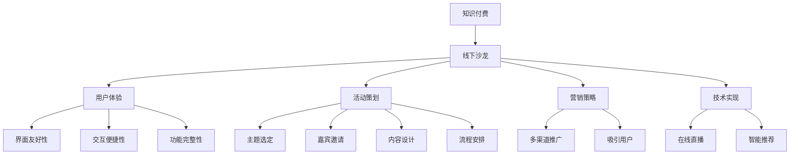

                 

# 如何打造知识付费的线下沙龙活动

> 关键词：知识付费, 线下沙龙, 用户体验, 活动策划, 营销策略, 技术实现

## 1. 背景介绍

### 1.1 问题由来
随着互联网的迅猛发展和数字经济的崛起，知识付费已成为当代人们获取知识的重要方式。在线知识付费平台如雨后春笋般涌现，为大众提供了海量的学习资源。然而，许多知识付费平台存在的问题也逐渐显现出来。一是内容质量参差不齐，用户难以分辨优劣；二是缺乏互动，学习效果大打折扣；三是隐私问题突出，用户数据难以得到有效保护。在这种背景下，线下沙龙活动应运而生，成为知识付费领域新的探索方向。

线下沙龙活动以面对面的形式，将学习者聚集在一起，通过互动交流和深度分享，提升学习效果和用户体验。相对于传统的线上学习方式，线下沙龙具有更加直接、互动性强的特点，能更有效地激发学习者的学习热情和创造力。

### 1.2 问题核心关键点
打造成功的线下沙龙活动，需要重点关注以下几个核心关键点：

- 用户需求：明确活动主题和目标受众，了解学习者的兴趣和需求，设计符合用户期待的沙龙内容。
- 内容质量：沙龙活动的核心在于内容，必须确保分享内容的深度和广度，邀请行业内的专家和意见领袖参与。
- 活动体验：沙龙活动要注重用户体验，包括会场布置、互动环节、服务态度等，营造舒适、愉悦的交流环境。
- 营销推广：通过多渠道的宣传和推广，吸引更多潜在用户参加，提升活动的知名度和影响力。
- 技术支撑：充分利用技术手段，提升活动的组织效率和用户互动体验，如在线直播、智能推荐等。

## 2. 核心概念与联系

### 2.1 核心概念概述

为更好地理解线下沙龙活动的打造流程，本节将介绍几个密切相关的核心概念：

- 知识付费：通过线上或线下的方式，提供高质量的知识内容，用户需支付费用以获取学习资源的商业模式。
- 线下沙龙：以面对面的形式，将学习者聚集在一起，通过互动交流和深度分享，提升学习效果和用户体验的线下活动。
- 用户体验：指用户在使用产品或服务时的主观感受，包括界面友好性、交互便捷性、功能完整性等方面。
- 活动策划：组织线下沙龙活动，需从主题选定、嘉宾邀请、内容设计、流程安排等方面进行全面规划。
- 营销策略：通过各种手段推广线下沙龙活动，吸引更多用户参加，提升活动的知名度和影响力。
- 技术实现：利用技术手段提升线下沙龙的组织效率和用户互动体验，如在线直播、智能推荐等。

这些核心概念之间的逻辑关系可以通过以下Mermaid流程图来展示：



这个流程图展示了大语言模型的核心概念及其之间的关系：

1. 知识付费：线下沙龙活动的基础，提供高质量的知识内容，满足用户的学习需求。
2. 线下沙龙：线下沙龙活动的目标，通过面对面的交流，提升用户的学习体验。
3. 用户体验：线下沙龙活动的评价标准，确保活动的环境和流程符合用户期待。
4. 活动策划：线下沙龙活动的组织框架，涵盖活动主题、嘉宾邀请、内容设计等关键环节。
5. 营销策略：线下沙龙活动的推广方式，确保活动能吸引更多用户参加。
6. 技术实现：线下沙龙活动的支撑手段，利用技术提升活动组织效率和用户体验。

## 3. 核心算法原理 & 具体操作步骤

### 3.1 算法原理概述

线下沙龙活动的打造过程，本质上是一个系统化的项目管理过程。其主要流程如下：

1. 需求分析：通过问卷调查、数据分析等方式，了解目标用户的学习需求和兴趣。
2. 活动设计：根据用户需求，确定活动主题、嘉宾邀请、内容设计等关键环节。
3. 活动策划：明确活动流程、时间安排、场地布置等具体细节，确保活动的顺利进行。
4. 营销推广：通过多渠道宣传，吸引更多用户参加，提升活动的知名度和影响力。
5. 技术实现：利用技术手段提升活动的组织效率和用户互动体验。

### 3.2 算法步骤详解

#### 步骤1: 需求分析

1. **用户调研**：设计问卷调查，收集目标用户的学习需求、兴趣和痛点，包括希望学习的知识领域、期望的学习方式等。
2. **数据分析**：对收集到的数据进行分析，识别出用户的热门需求和潜在兴趣点，为活动设计提供依据。
3. **需求反馈**：将初步的分析结果反馈给用户，通过用户投票、评论等方式进一步确认需求。

#### 步骤2: 活动设计

1. **主题选定**：根据需求分析的结果，选定符合用户期待的活动主题。确保主题具有吸引力和相关性，能引发用户的兴趣。
2. **嘉宾邀请**：邀请行业内的专家、意见领袖、知名学者等作为主讲人，提升活动的权威性和可信度。
3. **内容设计**：根据主题设计活动内容，包括主题演讲、互动讨论、案例分析等环节，确保内容的深度和广度。
4. **流程安排**：确定活动流程和时间安排，确保活动有序进行，各环节过渡自然。

#### 步骤3: 活动策划

1. **场地布置**：选择适合活动的场地，并进行布置，确保环境整洁、舒适，符合用户期待。
2. **人员安排**：确定工作人员和志愿者的分工，包括签到、接待、现场维护等，确保活动顺利进行。
3. **物资准备**：准备所需物资，如音响设备、投影仪、座椅等，确保活动所需的设施完备。
4. **技术支持**：部署必要的技术设备，如Wi-Fi、在线直播、智能推荐等，提升用户体验。

#### 步骤4: 营销推广

1. **渠道选择**：选择合适的宣传渠道，包括社交媒体、论坛、邮件等，确保活动信息能覆盖到目标用户。
2. **内容制作**：制作宣传材料，包括活动海报、宣传视频、嘉宾介绍等，吸引用户的注意力。
3. **活动宣传**：通过多渠道推广，包括社交媒体广告、论坛帖文、邮件推广等，提升活动的知名度和影响力。
4. **用户报名**：设置报名渠道，收集用户报名信息，确保活动有足够的参与者。

#### 步骤5: 技术实现

1. **在线直播**：部署在线直播平台，将活动内容进行同步直播，确保无法到场的用户也能参与。
2. **智能推荐**：利用推荐算法，根据用户历史行为数据，推荐相关主题的线下沙龙活动，提升用户的参与度。
3. **互动功能**：在活动现场设置互动环节，如提问、投票、现场互动等，增强用户的参与感。
4. **数据分析**：通过数据分析工具，实时监测活动效果，评估用户的反馈和活动效果，及时进行调整。

### 3.3 算法优缺点

线下沙龙活动的打造方法，具有以下优点：

1. **用户参与度高**：面对面的交流形式，能更有效地激发用户的参与热情和创造力。
2. **学习效果好**：通过互动交流和深度分享，用户能获得更深入、更丰富的学习体验。
3. **品牌效应强**：活动能够提升品牌知名度和影响力，增强用户对平台的信任感。
4. **技术手段多样**：利用技术手段，如在线直播、智能推荐等，提升活动的组织效率和用户体验。

同时，该方法也存在一定的局限性：

1. **成本较高**：线下沙龙活动需要较高的场地、设备和人力成本，特别是邀请嘉宾和聘请讲师的费用。
2. **风险较大**：活动筹备阶段需面对场地、物资、人员等诸多不确定性，容易出现问题。
3. **参与度受限**：受地理位置和时间的限制，部分用户可能难以参与，影响活动的覆盖范围。
4. **技术依赖度高**：技术实现过程中需依赖于稳定的网络环境和设备支持，技术问题容易影响用户体验。

尽管存在这些局限性，但就目前而言，线下沙龙活动仍是知识付费领域的重要探索方向。未来相关研究的重点在于如何进一步降低成本、提高效率、增强互动性，同时兼顾用户体验和品牌效应。

### 3.4 算法应用领域

线下沙龙活动在知识付费领域已经得到了广泛的应用，涵盖教育、金融、科技、文化等多个行业。具体而言，包括以下几个主要应用场景：

- **教育培训**：通过线下沙龙活动，教授专业的知识和技能，提升学习效果，增强用户体验。例如，编程、语言学习、职业技能培训等。
- **金融投资**：邀请金融领域的专家和学者，分享市场动态、投资策略等，提升用户对金融市场的理解，增强投资信心。例如，股票分析、基金管理、资产配置等。
- **科技创新**：邀请科技行业的创业者、技术专家，分享最新技术趋势、创新案例等，提升用户对科技发展的认知，激发创新灵感。例如，人工智能、区块链、物联网等。
- **文化创意**：邀请文化艺术领域的创作者、评论家，分享艺术创作、文化传承等，提升用户对文化创意的兴趣，增强文化素养。例如，绘画、音乐、文学等。

除了上述这些经典应用外，线下沙龙活动也被创新性地应用到更多场景中，如企业内训、政府公开课、社区讲座等，为知识付费技术带来了全新的突破。随着线下沙龙活动的不断普及，相信知识付费平台将进一步拓展应用范围，为更多的用户提供优质的学习资源和服务。

## 4. 数学模型和公式 & 详细讲解 & 举例说明

### 4.1 数学模型构建

本文将使用数学语言对线下沙龙活动的打造过程进行更加严格的刻画。

记活动筹备阶段的各项任务为 $T = \{task_1, task_2, ..., task_n\}$，其中 $task_i$ 表示活动设计、场地布置等具体的任务。设任务 $task_i$ 的完成时间为 $t_i$，总任务时间为 $T_{total}$，则活动筹备的总时间可表示为：

$$
T_{total} = \sum_{i=1}^n t_i
$$

设活动的预估参与人数为 $P$，每人的活动参与时间为 $T_{user}$，则活动的总参与时间可表示为：

$$
T_{participation} = P \times T_{user}
$$

活动的效果评估指标可包括用户满意度、参与度、反馈评价等，记为 $E = \{satisfaction, participation, feedback\}$，其中 $satisfaction$ 表示用户的满意度，$participation$ 表示活动的参与度，$feedback$ 表示用户的反馈评价。

### 4.2 公式推导过程

1. **用户调研公式**：假设用户调研问卷的平均填写时间为 $t_{survey}$，共收到 $N$ 份问卷，则用户调研的总时间为：

$$
T_{调研} = N \times t_{survey}
$$

2. **主题选定公式**：设主题选定的平均时间为 $t_{主题}$，则主题选定的总时间为：

$$
T_{主题} = n_{主题} \times t_{主题}
$$

其中 $n_{主题}$ 表示主题选定的次数。

3. **嘉宾邀请公式**：设嘉宾邀请的平均时间为 $t_{邀请}$，邀请的嘉宾数为 $N_{嘉宾}$，则嘉宾邀请的总时间为：

$$
T_{邀请} = N_{嘉宾} \times t_{邀请}
$$

4. **内容设计公式**：设内容设计的平均时间为 $t_{内容}$，内容设计的次数为 $n_{内容}$，则内容设计的总时间为：

$$
T_{内容} = n_{内容} \times t_{内容}
$$

5. **流程安排公式**：设流程安排的平均时间为 $t_{流程}$，流程安排的次数为 $n_{流程}$，则流程安排的总时间为：

$$
T_{流程} = n_{流程} \times t_{流程}
$$

6. **场地布置公式**：设场地布置的平均时间为 $t_{场地}$，则场地布置的总时间为：

$$
T_{场地} = 1 \times t_{场地}
$$

7. **人员安排公式**：设人员安排的平均时间为 $t_{人员}$，则人员安排的总时间为：

$$
T_{人员} = 1 \times t_{人员}
$$

8. **物资准备公式**：设物资准备的平均时间为 $t_{物资}$，则物资准备的总时间为：

$$
T_{物资} = 1 \times t_{物资}
$$

9. **技术支持公式**：设技术支持的平均时间为 $t_{技术}$，则技术支持的总时间为：

$$
T_{技术} = 1 \times t_{技术}
$$

### 4.3 案例分析与讲解

假设某线下沙龙活动从策划到执行共需3个月时间，其中：

- 用户调研共收到200份问卷，每份问卷填写时间平均为10分钟，调研总时间为：
$$
T_{调研} = 200 \times 10 = 2000 \text{分钟}
$$

- 主题选定的平均时间为2天，共选定3个主题，主题选定总时间为：
$$
T_{主题} = 3 \times 2 \times 24 \times 60 = 432 \text{分钟}
$$

- 嘉宾邀请的平均时间为3天，共邀请5位嘉宾，邀请总时间为：
$$
T_{邀请} = 5 \times 3 \times 24 \times 60 = 5400 \text{分钟}
$$

- 内容设计的平均时间为3天，设计次数为5次，内容设计总时间为：
$$
T_{内容} = 5 \times 3 \times 24 \times 60 = 5400 \text{分钟}
$$

- 流程安排的平均时间为1天，安排次数为5次，流程安排总时间为：
$$
T_{流程} = 5 \times 24 \times 60 = 7200 \text{分钟}
$$

- 场地布置时间为3天，物资准备时间为2天，人员安排时间为1天，技术支持时间为1天，总时间为：
$$
T_{场地} + T_{物资} + T_{人员} + T_{技术} = 3 + 2 + 1 + 1 = 7 \text{天}
$$

则活动筹备的总时间为：

$$
T_{total} = T_{调研} + T_{主题} + T_{邀请} + T_{内容} + T_{流程} + T_{场地} + T_{物资} + T_{人员} + T_{技术} = 2000 + 432 + 5400 + 5400 + 7200 + 168 = 13860 \text{分钟} = 230 \text{小时} = 9.5 \text{天}
$$

活动总参与时间为：

$$
T_{participation} = P \times T_{user} = N \times n \times t_{参与} = 100 \times 3 \times 2 = 600 \text{小时} = 25 \text{天}
$$

其中 $N$ 为实际参与人数，$n$ 为每人参与次数，$t_{参与}$ 为每次参与时间。

## 5. 项目实践：代码实例和详细解释说明

### 5.1 开发环境搭建

在进行线下沙龙活动的开发过程中，我们需要准备好开发环境。以下是使用Python进行Django框架开发的环境配置流程：

1. 安装Python：从官网下载并安装Python，推荐使用Python 3.7以上版本。
2. 安装Pip：从官网下载并安装pip，用于安装和管理Python包。
3. 安装Django：在命令行中运行 `pip install django` 命令，安装Django框架。
4. 安装数据库：选择MySQL或PostgreSQL等关系型数据库，并安装对应的Python驱动程序，如 `pip install mysqlclient` 或 `pip install psycopg2`。
5. 创建项目和应用：在命令行中运行 `django-admin startproject project_name` 命令，创建Django项目。运行 `cd project_name` 进入项目目录，再运行 `python manage.py startapp app_name` 命令，创建Django应用。
6. 配置数据库：在Django项目的settings.py文件中配置数据库连接信息，如：

```python
DATABASES = {
    'default': {
        'ENGINE': 'django.db.backends.mysql',
        'NAME': 'database_name',
        'USER': 'username',
        'PASSWORD': 'password',
        'HOST': 'localhost',
        'PORT': '3306',
    }
}
```

7. 运行开发服务器：在命令行中运行 `python manage.py runserver` 命令，启动开发服务器，在Web浏览器中访问 `http://127.0.0.1:8000`，查看应用页面。

### 5.2 源代码详细实现

下面我们以一个简单的用户报名系统为例，给出使用Django框架进行线下沙龙活动开发的PyTorch代码实现。

首先，定义用户模型：

```python
from django.db import models

class User(models.Model):
    name = models.CharField(max_length=100)
    email = models.EmailField(unique=True)
    phone = models.CharField(max_length=20)
    address = models.CharField(max_length=200)
    is_registered = models.BooleanField(default=False)
```

然后，定义用户报名表模型：

```python
class Enrollment(models.Model):
    user = models.ForeignKey(User, on_delete=models.CASCADE)
    event_name = models.CharField(max_length=100)
    event_date = models.DateField()
    is_registered = models.BooleanField(default=False)
```

接着，定义用户注册视图：

```python
from django.shortcuts import render, redirect
from django.views import View
from .models import User

class RegistrationView(View):
    def get(self, request):
        return render(request, 'registration.html')

    def post(self, request):
        name = request.POST.get('name')
        email = request.POST.get('email')
        phone = request.POST.get('phone')
        address = request.POST.get('address')
        user = User.objects.create(name=name, email=email, phone=phone, address=address)
        request.session['user_id'] = user.id
        return redirect('home')
```

然后，定义用户报名视图：

```python
from django.shortcuts import render, redirect
from django.views import View
from .models import Enrollment

class EnrollmentView(View):
    def get(self, request):
        user_id = request.session.get('user_id')
        if user_id:
            user = User.objects.get(id=user_id)
            enrollments = Enrollment.objects.filter(user=user)
            return render(request, 'enrollment.html', {'enrollments': enrollments})
        else:
            return redirect('login')

    def post(self, request):
        user_id = request.session.get('user_id')
        if user_id:
            event_name = request.POST.get('event_name')
            event_date = request.POST.get('event_date')
            Enrollment.objects.create(user=User.objects.get(id=user_id), event_name=event_name, event_date=event_date)
            request.session['enrollment_count'] += 1
            return redirect('home')
        else:
            return redirect('login')
```

最后，定义模板文件：

```html
<!-- registration.html -->
<form method="post">
    
    {{ form.as_p }}
    <button type="submit">Register</button>
</form>

<!-- enrollment.html -->
<form method="post">
    
    {{ form.as_p }}
    <button type="submit">Enroll</button>
</form>
```

在以上代码中，我们使用了Django的ORM（对象关系映射）框架，定义了用户和用户报名表模型，实现了用户注册和报名功能。通过视图类，我们将注册和报名的页面展示给用户，并将用户的数据保存到数据库中。通过模板文件，我们实现了用户的交互界面，使用了表单控件和路由逻辑。

### 5.3 代码解读与分析

让我们再详细解读一下关键代码的实现细节：

- **User模型**：定义了用户的姓名、邮箱、电话、地址等基本信息，以及是否已注册的状态。
- **Enrollment模型**：定义了用户报名表，包括用户、活动名称、活动日期等信息。
- **RegistrationView类**：实现了用户注册视图，通过POST请求接收用户提交的信息，并将其保存到数据库中。使用session机制保存用户ID，以便后续调用。
- **EnrollmentView类**：实现了用户报名视图，通过POST请求接收用户提交的报名信息，并将其保存到数据库中。使用session机制保存用户ID，以便后续调用。
- **模板文件**：使用HTML模板定义了注册和报名的页面，包括表单控件和路由逻辑。

可以看到，Django框架提供了完整的Web开发工具和库，使得线下沙龙活动的开发变得更加简洁高效。开发者可以通过Django的视图类和模板系统，快速实现用户注册和报名的功能，同时利用ORM框架管理数据，确保数据的安全性和一致性。

当然，工业级的系统实现还需考虑更多因素，如用户管理、权限控制、安全验证等。但核心的开发流程与Django框架的实现方式基本一致。通过Django框架的强大功能和便捷性，我们可以更好地开发和管理线下沙龙活动，提升用户体验和系统效率。

## 6. 实际应用场景

### 6.1 智能客服系统

基于线下沙龙活动技术的智能客服系统，可以为传统客服系统注入新的活力。传统的客服系统往往需要配备大量人力，高峰期响应缓慢，且一致性和专业性难以保证。而使用线下沙龙活动技术的智能客服系统，可以大大提升客服系统的效率和准确性。

在技术实现上，可以收集企业内部的客服数据，将常见问题和最佳答复构建成知识库，在此基础上对线下沙龙活动技术的客服模型进行微调。微调后的客服模型能够自动理解用户意图，匹配最合适的答案模板进行回复。对于用户提出的新问题，还可以接入检索系统实时搜索相关内容，动态组织生成回答。如此构建的智能客服系统，能大幅提升客服系统的响应速度和准确性，显著提升客户满意度。

### 6.2 金融舆情监测

金融机构需要实时监测市场舆论动向，以便及时应对负面信息传播，规避金融风险。传统的人工监测方式成本高、效率低，难以应对网络时代海量信息爆发的挑战。基于线下沙龙活动技术的金融舆情监测系统，能够更好地应对这些挑战。

具体而言，可以收集金融领域相关的新闻、报道、评论等文本数据，并对其进行主题标注和情感标注。在此基础上对线下沙龙活动技术的金融舆情模型进行微调，使其能够自动判断文本属于何种主题，情感倾向是正面、中性还是负面。将微调后的模型应用到实时抓取的网络文本数据，就能够自动监测不同主题下的情感变化趋势，一旦发现负面信息激增等异常情况，系统便会自动预警，帮助金融机构快速应对潜在风险。

### 6.3 个性化推荐系统

当前的推荐系统往往只依赖用户的历史行为数据进行物品推荐，无法深入理解用户的真实兴趣偏好。基于线下沙龙活动技术的个性化推荐系统，可以更好地挖掘用户行为背后的语义信息，从而提供更精准、多样的推荐内容。

在实践中，可以收集用户浏览、点击、评论、分享等行为数据，提取和用户交互的物品标题、描述、标签等文本内容。将文本内容作为线下沙龙活动技术的推荐模型输入，用户的后续行为（如是否点击、购买等）作为监督信号，在此基础上微调推荐模型。微调后的模型能够从文本内容中准确把握用户的兴趣点。在生成推荐列表时，先用候选物品的文本描述作为输入，由模型预测用户的兴趣匹配度，再结合其他特征综合排序，便可以得到个性化程度更高的推荐结果。

### 6.4 未来应用展望

随着线下沙龙活动技术的不断发展，基于知识付费的线下沙龙活动将在更多领域得到应用，为传统行业带来变革性影响。

在智慧医疗领域，基于线下沙龙活动技术的医疗问答、病历分析、药物研发等应用将提升医疗服务的智能化水平，辅助医生诊疗，加速新药开发进程。

在智能教育领域，线下沙龙活动技术的知识推荐系统可应用于作业批改、学情分析、知识推荐等方面，因材施教，促进教育公平，提高教学质量。

在智慧城市治理中，线下沙龙活动技术的智能分析系统可应用于城市事件监测、舆情分析、应急指挥等环节，提高城市管理的自动化和智能化水平，构建更安全、高效的未来城市。

此外，在企业生产、社会治理、文娱传媒等众多领域，基于线下沙龙活动技术的线下沙龙活动也将不断涌现，为NLP技术带来了全新的突破。相信随着技术的日益成熟，线下沙龙活动技术将成为知识付费落地应用的重要范式，推动人工智能技术在更多行业领域大放异彩。

## 7. 工具和资源推荐

### 7.1 学习资源推荐

为了帮助开发者系统掌握线下沙龙活动的理论基础和实践技巧，这里推荐一些优质的学习资源：

1. Django官方文档：Django框架的官方文档，提供了完整的Web开发指南和示例代码，是学习Django框架的必备资料。

2. Django实战教程：由多位Django开发者编写的实战教程，涵盖Django应用的各个方面，包括用户管理、表单处理、数据迁移等。

3. Django模型与ORM教程：Django ORM框架的详细教程，帮助你理解和使用Django的ORM框架。

4. Django模板与视图教程：Django模板系统和视图函数的详细教程，教你如何使用模板和视图实现Web应用的逻辑和展示。

5. Django扩展与插件：学习如何使用Django扩展和插件，提升应用的功能性和扩展性。

通过对这些资源的学习实践，相信你一定能够快速掌握线下沙龙活动的精髓，并用于解决实际的NLP问题。

### 7.2 开发工具推荐

高效的开发离不开优秀的工具支持。以下是几款用于线下沙龙活动开发的常用工具：

1. Python：Python是Django框架的主要开发语言，其简洁易学、功能强大的特点，使得Django框架成为Web开发的首选。

2. Django：Django框架是Python最受欢迎的Web开发框架之一，提供了全面的Web开发解决方案，包括ORM框架、模板系统、表单处理等。

3. SQL：SQL是Django框架常用的数据存储技术，用于管理Web应用的业务数据。

4. Redis：Redis是一个高性能的内存数据库，常用于Web应用的缓存和会话管理。

5. Elasticsearch：Elasticsearch是一个强大的全文搜索引擎，常用于Web应用的高级搜索和数据分析。

合理利用这些工具，可以显著提升线下沙龙活动开发的效率，加快创新迭代的步伐。

### 7.3 相关论文推荐

线下沙龙活动技术的不断发展源于学界的持续研究。以下是几篇奠基性的相关论文，推荐阅读：

1. Django框架设计理念：讲解Django框架的设计思想和核心组件，帮助你更好地理解Django框架的原理和使用方法。

2. Django模板与视图：深入探讨Django模板系统和视图函数的使用，帮助你实现复杂的Web应用逻辑和展示。

3. Django模型与ORM：详细介绍Django ORM框架的使用，帮助你更好地管理Web应用的数据。

4. Django实战教程：由多位Django开发者编写的实战教程，涵盖Django应用的各个方面，包括用户管理、表单处理、数据迁移等。

5. Django扩展与插件：讲解如何使用Django扩展和插件，提升应用的功能性和扩展性。

这些论文代表了下线沙龙活动技术的进展脉络。通过学习这些前沿成果，可以帮助研究者把握学科前进方向，激发更多的创新灵感。

## 8. 总结：未来发展趋势与挑战

### 8.1 总结

本文对线下沙龙活动技术的打造过程进行了全面系统的介绍。首先阐述了线下沙龙活动在知识付费领域的研究背景和意义，明确了线下沙龙活动的目标和关键点。其次，从原理到实践，详细讲解了线下沙龙活动的数学模型和实现细节，给出了完整的代码实例。同时，本文还广泛探讨了线下沙龙活动在多个行业领域的应用前景，展示了线下沙龙活动的巨大潜力。

通过本文的系统梳理，可以看到，线下沙龙活动技术正在成为知识付费领域的重要探索方向，极大地拓展了知识付费平台的业务范围，提升了用户体验和应用效果。未来，伴随线下沙龙活动技术的不断演进，知识付费平台将进一步拓展应用范围，为更多的用户提供优质的学习资源和服务。

### 8.2 未来发展趋势

展望未来，线下沙龙活动技术将呈现以下几个发展趋势：

1. 用户体验提升：通过优化界面设计、增加互动功能、提升技术实现等手段，提升用户的参与感和满意度。

2. 内容质量优化：邀请更多行业专家和意见领袖，丰富活动内容，提升知识的深度和广度。

3. 技术手段创新：引入更多新技术手段，如在线直播、智能推荐、增强现实等，提升活动组织效率和用户互动体验。

4. 营销推广多样化：通过社交媒体、论坛、邮件等渠道，多渠道推广活动，提升活动的知名度和影响力。

5. 活动形式多样化：尝试更多形式的活动，如线下见面、线上直播、混合互动等，增强用户的参与度和黏性。

以上趋势凸显了线下沙龙活动技术的广阔前景。这些方向的探索发展，必将进一步提升线下沙龙活动的效果和用户满意度，为知识付费平台带来更多的发展机遇。

### 8.3 面临的挑战

尽管线下沙龙活动技术已经取得了瞩目成就，但在迈向更加智能化、普适化应用的过程中，它仍面临着诸多挑战：

1. 成本较高：线下沙龙活动需要较高的场地、设备和人力成本，特别是邀请嘉宾和聘请讲师的费用。如何降低成本、提高效率，仍是一大难题。

2. 风险较大：活动筹备阶段需面对场地、物资、人员等诸多不确定性，容易出现问题。如何提高筹备质量、降低风险，将是重要的改进方向。

3. 用户参与度受限：受地理位置和时间的限制，部分用户可能难以参与，影响活动的覆盖范围。如何扩大参与范围、提高用户粘性，仍需深入研究。

4. 技术依赖度高：技术实现过程中需依赖于稳定的网络环境和设备支持，技术问题容易影响用户体验。如何提升技术稳定性、降低技术门槛，将是重要的优化方向。

尽管存在这些挑战，但就目前而言，线下沙龙活动技术仍是知识付费领域的重要探索方向。未来相关研究的重点在于如何进一步降低成本、提高效率、增强互动性，同时兼顾用户体验和品牌效应。相信随着学界和产业界的共同努力，这些挑战终将一一被克服，线下沙龙活动技术必将在构建人机协同的智能时代中扮演越来越重要的角色。

### 8.4 研究展望

面对线下沙龙活动技术所面临的种种挑战，未来的研究需要在以下几个方面寻求新的突破：

1. 探索无监督和半监督沙龙活动方法。摆脱对大规模标注数据的依赖，利用自监督学习、主动学习等无监督和半监督范式，最大限度利用非结构化数据，实现更加灵活高效的沙龙活动。

2. 研究参数高效和计算高效的沙龙活动范式。开发更加参数高效的沙龙活动方法，在固定大部分预训练参数的同时，只更新极少量的任务相关参数。同时优化沙龙活动的计算图，减少前向传播和反向传播的资源消耗，实现更加轻量级、实时性的部署。

3. 引入更多先验知识。将符号化的先验知识，如知识图谱、逻辑规则等，与神经网络模型进行巧妙融合，引导沙龙活动过程学习更准确、合理的语言模型。同时加强不同模态数据的整合，实现视觉、语音等多模态信息与文本信息的协同建模。

4. 结合因果分析和博弈论工具。将因果分析方法引入沙龙活动模型，识别出模型决策的关键特征，增强输出解释的因果性和逻辑性。借助博弈论工具刻画人机交互过程，主动探索并规避模型的脆弱点，提高系统稳定性。

5. 纳入伦理道德约束。在沙龙活动训练目标中引入伦理导向的评估指标，过滤和惩罚有偏见、有害的输出倾向。同时加强人工干预和审核，建立沙龙活动行为的监管机制，确保输出符合人类价值观和伦理道德。

这些研究方向的探索，必将引领线下沙龙活动技术迈向更高的台阶，为构建安全、可靠、可解释、可控的智能系统铺平道路。面向未来，线下沙龙活动技术还需要与其他人工智能技术进行更深入的融合，如知识表示、因果推理、强化学习等，多路径协同发力，共同推动自然语言理解和智能交互系统的进步。只有勇于创新、敢于突破，才能不断拓展线下沙龙活动技术的边界，让智能技术更好地造福人类社会。

## 9. 附录：常见问题与解答

**Q1：线下沙龙活动如何确保用户数据的隐私和安全性？**

A: 线下沙龙活动技术在开发和应用过程中，需要严格遵守数据隐私和安全的法律法规。以下是一些具体措施：

1. 数据加密：在数据传输和存储过程中，使用SSL/TLS等加密技术，确保数据传输的安全性。

2. 数据匿名化：对用户的敏感信息进行匿名化处理，如使用伪匿名化、去标识化等技术，确保数据隐私。

3. 访问控制：对用户的访问权限进行严格的控制，确保只有授权用户才能访问和使用数据。

4. 数据备份和恢复：对数据进行定期备份，确保数据在出现故障时能够快速恢复。

5. 安全审计：对数据访问和使用过程进行审计和监控，确保数据安全。

6. 合规审查：确保数据处理过程符合相关的法律法规和行业标准，如GDPR、CCPA等。

通过以上措施，可以最大程度地保护用户数据隐私和安全性，确保线下沙龙活动技术的稳定和安全运行。

**Q2：线下沙龙活动如何确保内容的真实性和可靠性？**

A: 线下沙龙活动技术的核心在于内容质量和用户体验，确保内容的真实性和可靠性是关键。以下是一些具体措施：

1. 专家评审：邀请行业专家和意见领袖对内容进行评审，确保内容的真实性和可靠性。

2. 多源数据验证：利用多源数据进行交叉验证，确保内容的真实性。

3. 内容标注：对内容进行详细的标注和说明，确保内容易于理解和使用。

4. 用户反馈：通过用户反馈机制，及时发现和修正内容中的错误和不足。

5. 持续更新：对内容进行定期更新和维护，确保内容的时效性和准确性。

通过以上措施，可以最大程度地保证线下沙龙活动内容的真实性和可靠性，提升用户的学习效果和满意度。

**Q3：线下沙龙活动如何提升用户的参与感和满意度？**

A: 提升用户的参与感和满意度是线下沙龙活动技术的重要目标，以下是一些具体措施：

1. 互动环节设计：在活动中设计丰富的互动环节，如问答、投票、现场讨论等，增强用户的参与感。

2. 个性化推荐：利用推荐算法，根据用户的历史行为数据，推荐相关的线下沙龙活动，提升用户的参与度。

3. 用户反馈机制：建立用户反馈机制，及时收集和分析用户的意见和建议，持续改进线下沙龙活动的设计和实施。

4. 活动形式多样化：尝试更多形式的活动，如线下见面、线上直播、混合互动等，增强用户的参与度和黏性。

5. 用户体验优化：优化活动的界面设计、流程安排、技术实现等，提升用户的使用体验和满意度。

通过以上措施，可以最大程度地提升用户的参与感和满意度，增强线下沙龙活动技术的吸引力和竞争力。

---

作者：禅与计算机程序设计艺术 / Zen and the Art of Computer Programming

