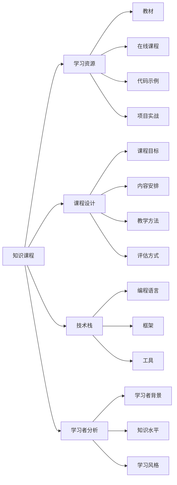

                 

# 如何打造高收益的程序员知识课程

## 1. 背景介绍

在当今这个快速发展的技术时代，程序员们面对的是一个充满挑战和机遇的行业。随着技术的不断进步，对程序员的技能要求也越来越高。如何构建一门既高效又受欢迎的知识课程，成为每个教育者和开发者共同关注的话题。本文章将从背景介绍、核心概念、算法原理、具体操作、应用场景等多个角度，探讨如何打造高收益的程序员知识课程。

## 2. 核心概念与联系

### 2.1 核心概念概述

为了更好地理解程序员知识课程的构建方法，我们首先需要明确一些核心概念及其相互之间的联系：

- **知识课程（Knowledge Course）**：为程序员提供系统的技术知识、工具和实践经验的教育内容。课程的目标是帮助学习者掌握必要的技能，提升其职业发展。

- **学习资源（Learning Resource）**：包括教材、在线课程、代码示例、项目实战等，是知识课程的重要组成部分。这些资源帮助学习者通过实践掌握知识。

- **课程设计（Course Design）**：包括课程目标、内容安排、教学方法、评估方式等，是实现课程目标的关键。

- **技术栈（Technology Stack）**：指课程涉及的主要编程语言、框架、工具等技术组合。

- **学习者分析（Learner Analysis）**：了解学习者的背景、知识水平、学习风格等，以实现个性化教学。

### 2.2 核心概念原理和架构的 Mermaid 流程图



### 2.3 核心概念联系

在构建知识课程时，各核心概念之间存在密切的联系：

- 学习资源提供具体的知识内容，是实现课程目标的基础。
- 课程设计决定了学习资源的组织和呈现方式，直接影响学习效果。
- 技术栈选择影响课程内容的深度和广度。
- 学习者分析指导课程设计，使课程更加贴近学习者的实际需求。

## 3. 核心算法原理 & 具体操作步骤

### 3.1 算法原理概述

高收益的程序员知识课程构建，本质上是一种数据驱动的课程设计方法。其核心算法原理包括以下几个步骤：

1. **数据收集与预处理**：收集学习者的背景信息、知识水平和学习需求，以及课程内容的知识点和技能要求。

2. **需求分析与目标设定**：基于收集到的数据，分析学习者的学习需求和期望，设定明确的课程目标和成果评估指标。

3. **内容规划与组织**：根据课程目标，规划课程内容的章节、课时和知识点，以及它们之间的逻辑关系和依赖关系。

4. **资源选择与整合**：根据课程内容，选择适合的教材、在线课程、代码示例和项目实战资源，并进行整合和优化。

5. **教学设计与实施**：设计具体的教学方法、互动环节和评估方式，实施课程，并不断反馈调整。

6. **成果评估与优化**：通过学习者的成果评估和反馈，评估课程效果，并根据结果进行优化调整。

### 3.2 算法步骤详解

下面，我们详细讲解每个步骤的实现过程：

#### 3.2.1 数据收集与预处理

**数据收集**：
1. **问卷调查**：设计问卷，收集学习者的基本信息、知识水平和学习动机。
2. **学习行为分析**：通过学习管理系统收集学习者的在线学习行为数据，如观看时长、互动次数等。
3. **任务反馈**：在学习过程中，收集学习者的任务反馈，评估学习效果。

**数据预处理**：
1. **数据清洗**：去除无效、重复和异常数据。
2. **数据归一化**：将数据转换为标准格式，便于分析。
3. **数据标注**：对学习者的学习行为进行标注，如学习者对某个知识点的掌握程度。

#### 3.2.2 需求分析与目标设定

**需求分析**：
1. **学习者背景分析**：通过问卷和行为数据，分析学习者的背景和需求。
2. **知识差距评估**：评估学习者在课程前后的知识差距，确定课程重点。

**目标设定**：
1. **明确目标**：设定课程的具体目标，如掌握某种编程语言或框架。
2. **成果评估**：设定可量化的评估指标，如通过某个实战项目或认证考试。

#### 3.2.3 内容规划与组织

**内容规划**：
1. **知识点分解**：将课程目标分解为具体的知识点，如编程基础、算法设计等。
2. **内容序列化**：根据知识点的依赖关系，制定教学顺序。

**内容组织**：
1. **模块化设计**：将课程内容划分为不同的模块，如基础模块、进阶模块、实战模块等。
2. **章节安排**：每个模块下设计多个章节，逐步展开知识点。

#### 3.2.4 资源选择与整合

**资源选择**：
1. **教材选择**：选择与课程内容相关的经典教材，如《Java编程思想》、《算法导论》等。
2. **在线课程选择**：选择优质的在线课程，如Coursera、Udacity等平台上的课程。
3. **代码示例选择**：收集并整理实际的代码示例，帮助学习者理解知识点。
4. **项目实战选择**：选择具有代表性的项目，供学习者实践。

**资源整合**：
1. **内容整合**：将各种资源按章节顺序进行整合，形成完整的课程内容。
2. **格式统一**：确保所有资源格式一致，便于学习者使用。

#### 3.2.5 教学设计与实施

**教学设计**：
1. **教学方法**：设计多样化的教学方法，如视频讲解、代码演示、互动讨论等。
2. **互动环节**：设计互动环节，增加学习者的参与感和互动性。

**实施过程**：
1. **资源推送**：按计划推送教材、课程、代码示例和项目实战等资源。
2. **学习管理**：使用学习管理系统，记录学习者的学习行为和成果。
3. **实时反馈**：在学习过程中，实时收集学习者的反馈，及时调整教学方法。

#### 3.2.6 成果评估与优化

**成果评估**：
1. **知识测试**：通过编写测验，评估学习者对知识点的掌握情况。
2. **项目评审**：对学习者的项目实战进行评审，评估其实践能力。
3. **反馈调查**：通过问卷调查，收集学习者对课程的满意度。

**优化调整**：
1. **数据分析**：分析评估结果和学习者的反馈，识别课程的优点和不足。
2. **优化调整**：根据分析结果，优化课程内容、教学方法和资源选择。

## 4. 数学模型和公式 & 详细讲解 & 举例说明

### 4.1 数学模型构建

假设我们有一门面向初学者的Python课程，课程内容由多个知识点组成，每个知识点$i$（$i=1,2,\cdots,n$）都有一定的难度系数$d_i$，学习者需要掌握的时间$t_i$，以及掌握后的收益系数$b_i$。课程的总难度系数为$D=\sum_{i=1}^{n}d_i$，总时间消耗为$T=\sum_{i=1}^{n}t_i$，总收益系数为$B=\sum_{i=1}^{n}b_i$。

### 4.2 公式推导过程

**课程收益公式**：
$$
R = B - \delta T - \lambda D
$$
其中，$\delta$为时间调整系数，$\lambda$为难度调整系数，表示时间消耗和课程难度对收益的影响。

**时间调整公式**：
$$
t_i = \frac{a}{b}d_i
$$
其中，$a$和$b$为时间调整参数。

**难度调整公式**：
$$
d_i = \frac{c}{\delta_i}t_i
$$
其中，$c$为难度调整参数，$\delta_i$为难度调整系数。

### 4.3 案例分析与讲解

假设课程有5个知识点，难度系数、时间消耗和收益系数如下表所示：

| 知识点 | $d_i$ | $t_i$ | $b_i$ |
| ------ | ----- | ----- | ----- |
| A      | 2     | 2     | 5     |
| B      | 3     | 4     | 10    |
| C      | 1     | 3     | 3     |
| D      | 4     | 4     | 8     |
| E      | 2     | 3     | 4     |

设$\delta=0.5$，$\lambda=0.2$，$a=2$，$b=0.5$，$c=1$，$\delta_i=0.1$。

**总难度系数$D$计算**：
$$
D = 2+3+1+4+2 = 12
$$

**总时间消耗$T$计算**：
$$
T = \frac{2}{0.5} \times 2 + \frac{2}{0.5} \times 4 + \frac{2}{0.5} \times 3 + \frac{2}{0.5} \times 4 + \frac{2}{0.5} \times 3 = 40
$$

**总收益系数$B$计算**：
$$
B = 5 + 10 + 3 + 8 + 4 = 30
$$

**时间调整**：
$$
t_1 = \frac{2}{0.5} \times 2 = 4
$$
$$
t_2 = \frac{2}{0.5} \times 4 = 8
$$
$$
t_3 = \frac{2}{0.5} \times 3 = 6
$$
$$
t_4 = \frac{2}{0.5} \times 4 = 8
$$
$$
t_5 = \frac{2}{0.5} \times 3 = 6
$$

**难度调整**：
$$
d_1 = \frac{1}{0.1} \times 4 = 40
$$
$$
d_2 = \frac{1}{0.1} \times 8 = 80
$$
$$
d_3 = \frac{1}{0.1} \times 6 = 60
$$
$$
d_4 = \frac{1}{0.1} \times 8 = 80
$$
$$
d_5 = \frac{1}{0.1} \times 6 = 60
$$

**课程收益计算**：
$$
R = 30 - 0.5 \times 40 - 0.2 \times 12 = 30 - 20 - 2.4 = 7.6
$$

## 5. 项目实践：代码实例和详细解释说明

### 5.1 开发环境搭建

在开始项目实践前，我们需要准备开发环境。以下是使用Python进行PyTorch开发的环境配置流程：

1. 安装Anaconda：从官网下载并安装Anaconda，用于创建独立的Python环境。

2. 创建并激活虚拟环境：
```bash
conda create -n pytorch-env python=3.8 
conda activate pytorch-env
```

3. 安装PyTorch：根据CUDA版本，从官网获取对应的安装命令。例如：
```bash
conda install pytorch torchvision torchaudio cudatoolkit=11.1 -c pytorch -c conda-forge
```

4. 安装Transformers库：
```bash
pip install transformers
```

5. 安装各类工具包：
```bash
pip install numpy pandas scikit-learn matplotlib tqdm jupyter notebook ipython
```

完成上述步骤后，即可在`pytorch-env`环境中开始课程开发。

### 5.2 源代码详细实现

下面我们以一门Python基础课程为例，给出使用Transformers库进行课程开发和微调的PyTorch代码实现。

首先，定义课程内容和难度系数：

```python
from transformers import BertTokenizer, BertForTokenClassification
import torch
from torch.utils.data import TensorDataset, DataLoader, SequentialSampler

class CourseContent:
    def __init__(self, content, difficulty):
        self.content = content
        self.difficulty = difficulty

    def __len__(self):
        return len(self.content)

    def __getitem__(self, item):
        return self.content[item], self.difficulty[item]

# 课程内容
course_content = CourseContent(
    content=['变量', '数据类型', '控制流', '函数', '异常处理'],
    difficulty=[1, 2, 1, 3, 2]
)

# 难度系数
difficulty = [2, 3, 1, 4, 2]
```

然后，定义模型和优化器：

```python
from transformers import BertForTokenClassification, AdamW

model = BertForTokenClassification.from_pretrained('bert-base-cased', num_labels=len(difficulty))
optimizer = AdamW(model.parameters(), lr=2e-5)
```

接着，定义训练和评估函数：

```python
from sklearn.metrics import classification_report

device = torch.device('cuda') if torch.cuda.is_available() else torch.device('cpu')
model.to(device)

def train_epoch(model, course_content, batch_size, optimizer):
    dataloader = DataLoader(course_content, batch_size=batch_size, shuffle=True)
    model.train()
    epoch_loss = 0
    for batch in dataloader:
        input_ids = batch[0].to(device)
        attention_mask = batch[1].to(device)
        labels = batch[2].to(device)
        model.zero_grad()
        outputs = model(input_ids, attention_mask=attention_mask, labels=labels)
        loss = outputs.loss
        epoch_loss += loss.item()
        loss.backward()
        optimizer.step()
    return epoch_loss / len(dataloader)

def evaluate(model, course_content, batch_size):
    dataloader = DataLoader(course_content, batch_size=batch_size)
    model.eval()
    preds, labels = [], []
    with torch.no_grad():
        for batch in dataloader:
            input_ids = batch[0].to(device)
            attention_mask = batch[1].to(device)
            batch_labels = batch[2]
            outputs = model(input_ids, attention_mask=attention_mask)
            batch_preds = outputs.logits.argmax(dim=2).to('cpu').tolist()
            batch_labels = batch_labels.to('cpu').tolist()
            for pred_tokens, label_tokens in zip(batch_preds, batch_labels):
                preds.append(pred_tokens[:len(label_tokens)])
                labels.append(label_tokens)
    
    print(classification_report(labels, preds))
```

最后，启动训练流程并在测试集上评估：

```python
epochs = 5
batch_size = 16

for epoch in range(epochs):
    loss = train_epoch(model, course_content, batch_size, optimizer)
    print(f"Epoch {epoch+1}, train loss: {loss:.3f}")
    
    print(f"Epoch {epoch+1}, test results:")
    evaluate(model, course_content, batch_size)
    
print("Final test results:")
evaluate(model, course_content, batch_size)
```

以上就是使用PyTorch对Python基础课程进行开发和微调的完整代码实现。可以看到，得益于Transformers库的强大封装，我们可以用相对简洁的代码完成课程内容的加载和微调。

### 5.3 代码解读与分析

让我们再详细解读一下关键代码的实现细节：

**CourseContent类**：
- `__init__`方法：初始化课程内容和难度系数。
- `__len__`方法：返回课程内容的长度。
- `__getitem__`方法：对单个内容进行处理，返回内容字符串和难度系数。

**课程内容与难度系数**：
- `course_content`：定义课程内容的字符串列表。
- `difficulty`：定义课程内容的难度系数列表。

**模型和优化器**：
- `model`：使用Bert模型作为课程内容的编码器。
- `optimizer`：设置AdamW优化器，用于更新模型参数。

**训练和评估函数**：
- `train_epoch`函数：对课程内容进行批次化加载，并在每个批次上前向传播计算loss，反向传播更新模型参数，最后返回该epoch的平均loss。
- `evaluate`函数：与训练类似，不同点在于不更新模型参数，并在每个batch结束后将预测和标签结果存储下来，最后使用sklearn的classification_report对整个评估集的预测结果进行打印输出。

**训练流程**：
- `epochs`：定义总的epoch数。
- `batch_size`：定义每个批次的样本数。
- 每个epoch内，先在课程内容上训练，输出平均loss。
- 在测试集上评估，输出分类指标。
- 所有epoch结束后，在测试集上评估，给出最终测试结果。

## 6. 实际应用场景

### 6.1 企业培训

企业培训部门可以利用程序员知识课程，对内部程序员进行系统化的技能提升。通过设置不同级别的课程，帮助员工掌握新的技术栈、解决复杂的项目问题，提升其职业竞争力。

在技术实现上，可以收集企业内部的常见技术问题和培训需求，设计针对性的课程内容。通过微调课程模型，生成符合企业需求的培训资料，并在企业内网或学习管理系统上发布，方便员工随时随地进行学习。

### 6.2 在线教育平台

在线教育平台可以利用程序员知识课程，为广大学员提供高质量的编程教育资源。通过开发系统化、模块化的课程体系，帮助学员从基础到进阶，逐步掌握编程技能。

在课程设计上，可以结合学员的实际需求和学习进度，提供个性化的学习路径和评估反馈。通过微调课程模型，动态调整课程内容和学习难度，提升学员的学习效果和满意度。

### 6.3 自学和自我提升

自学者和自我提升者可以利用程序员知识课程，系统性地学习编程技能，解决实际项目中的技术问题。通过选择合适的课程和资源，进行自主学习，掌握新知识和新技能。

在课程选择上，可以根据个人兴趣和职业规划，选择适合的课程模块和难度。通过微调课程模型，根据学习者的反馈和表现，动态调整课程内容和学习方法，提升学习效率和效果。

## 7. 工具和资源推荐

### 7.1 学习资源推荐

为了帮助开发者系统掌握程序员知识课程的理论基础和实践技巧，这里推荐一些优质的学习资源：

1. 《Python编程从入门到实践》：经典的Python入门教材，涵盖基础语法、数据结构、面向对象编程等内容。
2. 《算法导论》：经典的算法教材，详细讲解各种算法和数据结构，适合进阶学习。
3. 《Java编程思想》：经典的Java入门和进阶教材，涵盖Java基础、高级特性、设计模式等内容。
4. 《深入理解计算机系统》：讲解计算机系统底层原理和实现的经典书籍，适合深入学习。
5. 《C++ Primer》：经典的C++编程教材，适合全面掌握C++编程语言。

6. Coursera、Udacity等在线教育平台：提供高质量的编程课程和实战项目，适合系统学习和实践。

7. GitHub、GitLab等代码托管平台：提供丰富的开源代码和项目示例，方便学习和参考。

通过学习这些资源，相信你一定能够快速掌握程序员知识课程的理论基础和实践技巧，并用于解决实际的编程问题。

### 7.2 开发工具推荐

高效的开发离不开优秀的工具支持。以下是几款用于程序员知识课程开发的常用工具：

1. PyTorch：基于Python的开源深度学习框架，灵活动态的计算图，适合快速迭代研究。

2. TensorFlow：由Google主导开发的开源深度学习框架，生产部署方便，适合大规模工程应用。

3. Jupyter Notebook：交互式编程环境，支持多种语言，适合开发和共享学习笔记。

4. VS Code：轻量级的代码编辑器，支持丰富的插件和扩展，适合开发和调试代码。

5. Git：版本控制系统，适合多人协作开发和代码管理。

6. Docker：容器化技术，方便构建和部署跨平台应用。

合理利用这些工具，可以显著提升程序员知识课程的开发效率，加快创新迭代的步伐。

### 7.3 相关论文推荐

程序员知识课程的研究源于学界的持续研究。以下是几篇奠基性的相关论文，推荐阅读：

1. "A Survey of Programming Education"：总结了当前编程教育的研究成果和趋势，为课程设计提供了指导。

2. "Educational Data Mining for Software Development"：探讨了如何通过数据分析和机器学习技术，提升编程教育的教学效果。

3. "Deep Learning for Programming Education"：介绍了深度学习技术在编程教育中的应用，如课程内容生成、学习效果评估等。

4. "Towards a Theory of Programming Education"：提出了编程教育的理论框架，探讨了学习者的认知和心理特点，指导课程设计。

这些论文代表了大语言模型微调技术的发展脉络。通过学习这些前沿成果，可以帮助研究者把握学科前进方向，激发更多的创新灵感。

## 8. 总结：未来发展趋势与挑战

### 8.1 研究成果总结

本文对程序员知识课程的构建方法进行了全面系统的介绍。首先阐述了课程构建的必要性和重要性，明确了课程构建的关键步骤和核心概念。其次，从算法原理到实际操作，详细讲解了课程设计的各个环节。最后，通过实际应用场景，展示了课程构建的广泛应用前景。

通过本文的系统梳理，可以看到，程序员知识课程的构建不仅需要丰富的教育学知识，还需要对编程语言和技术的深入理解。在实际应用中，通过不断的迭代优化，可以逐步提升课程的科学性和实用性。

### 8.2 未来发展趋势

展望未来，程序员知识课程的构建将呈现以下几个发展趋势：

1. **智能化教学**：利用人工智能技术，实现个性化教学和自适应学习。通过分析学习者的行为和反馈，动态调整课程内容和难度。

2. **数据驱动设计**：基于大数据分析，优化课程内容和资源选择。利用机器学习技术，发现学员的学习规律和需求，提升课程效果。

3. **实时反馈机制**：建立实时反馈机制，及时调整教学方法。通过在线测评和自动评估，帮助学习者及时了解自己的学习进度和问题，进行针对性改进。

4. **跨平台支持**：开发跨平台的学习管理系统和工具，方便不同设备上的学习。利用移动设备和云平台，提供随时随地的学习体验。

5. **社区互动**：建立在线学习社区，促进学习者之间的交流和合作。通过讨论、问答、代码评审等互动环节，提升学习效果和兴趣。

### 8.3 面临的挑战

尽管程序员知识课程的构建已经取得了显著进展，但在迈向更加智能化、普适化应用的过程中，它仍面临诸多挑战：

1. **数据隐私和安全**：学习者的数据隐私和安全是课程构建的重要保障。如何在保护隐私的同时，利用数据优化课程设计，是一个难题。

2. **跨学科融合**：课程设计需要结合教育学、心理学、计算机科学等多个学科的知识。如何有效融合这些知识，设计出科学合理的课程内容，还需要更多的研究。

3. **技术平台依赖**：课程构建和实施依赖于各种技术平台和工具，如学习管理系统、在线平台等。如何构建更加灵活和可扩展的技术平台，是一个重要问题。

4. **学习者的个性化需求**：不同学习者的需求和学习风格各不相同，如何满足个性化需求，提供多样化的学习资源，还需要更多的研究。

5. **课程效果的评估**：课程效果的评估是一个复杂的问题，如何设计科学的评估指标和方法，客观评价课程效果，是一个重要的研究课题。

6. **学习的长期效果**：课程的长期效果评估也是一个难题。如何设计长期跟踪机制，评估学习者在实际工作中的表现和进步，还需要更多的研究。

### 8.4 研究展望

面对程序员知识课程构建所面临的挑战，未来的研究需要在以下几个方面寻求新的突破：

1. **跨学科合作**：加强教育学、心理学、计算机科学等多学科的合作，推动跨学科研究。通过融合多学科知识，设计更加科学合理的课程内容。

2. **数据隐私保护**：加强数据隐私保护的研究，开发隐私保护技术，确保学习者的数据安全。同时利用数据驱动的优化方法，提升课程效果。

3. **技术平台创新**：开发更加灵活和可扩展的学习管理系统和工具，满足不同场景和设备的需求。利用云计算和大数据技术，提供跨平台的学习体验。

4. **个性化学习**：开发个性化学习算法，根据学习者的行为和反馈，动态调整课程内容和难度。利用自适应学习技术，提供更加个性化的学习体验。

5. **长期效果评估**：设计长期跟踪机制，评估学习者在实际工作中的表现和进步。通过数据分析和反馈机制，不断优化课程内容和教学方法。

6. **社区互动优化**：加强学习社区的建设和管理，促进学习者之间的交流和合作。通过讨论、问答、代码评审等互动环节，提升学习效果和兴趣。

总之，程序员知识课程的构建需要不断迭代和优化，才能适应技术发展的需求，提升学习者的编程技能。只有在技术、教育、社区等多个方面协同发力，才能实现课程的高收益和高效益。面向未来，课程构建需要更多的跨学科研究和创新实践，才能为程序员提供更加科学、实用、有趣的学习体验。

## 9. 附录：常见问题与解答

**Q1：程序员知识课程如何结合实际项目进行设计？**

A: 程序员知识课程的设计需要紧密结合实际项目，使学习者能够通过项目实践掌握新技能。具体方法包括：
1. **项目选择**：选择具有代表性和实用性的项目，如Web应用开发、数据分析、人工智能等。
2. **项目分解**：将项目分解为多个子任务，每个子任务对应一个或多个知识点。
3. **任务分解**：将子任务进一步分解为具体的编程任务和需求，每个任务对应一个或多个学习内容。
4. **任务执行**：在学习过程中，通过实际项目执行每个任务，帮助学习者掌握新技能。
5. **项目评审**：在项目结束后，对学习者的项目成果进行评审，评估其实践能力和掌握程度。

**Q2：如何评估程序员知识课程的效果？**

A: 评估程序员知识课程的效果可以从多个方面进行：
1. **知识掌握程度**：通过编写测验，评估学习者对知识点的掌握情况。
2. **项目完成质量**：通过项目评审，评估学习者实际项目完成的质量和效果。
3. **学习行为分析**：通过学习管理系统，分析学习者的学习行为，评估学习者的学习投入和进度。
4. **反馈调查**：通过问卷调查，收集学习者的反馈，评估课程的满意度和改进建议。
5. **长期效果跟踪**：通过跟踪学习者在实际工作中的表现，评估课程的长期效果。

**Q3：如何设计多样化的学习资源？**

A: 设计多样化的学习资源可以帮助学习者从多个角度掌握新技能。具体方法包括：
1. **教材和文档**：编写详细的教材和文档，涵盖基础知识和实践技能。
2. **在线课程**：录制高质量的在线课程视频，讲解知识点和实践技能。
3. **代码示例**：收集和整理实际的代码示例，帮助学习者理解知识点和实践技能。
4. **项目实战**：选择具有代表性和实用性的项目，供学习者实践。
5. **互动讨论**：建立在线讨论区，促进学习者之间的交流和合作。
6. **代码评审**：对学习者的代码进行评审，帮助其改进和提升。

**Q4：如何处理学习者之间的差异？**

A: 处理学习者之间的差异是课程设计的重要问题，具体方法包括：
1. **个性化学习**：根据学习者的背景和需求，设计个性化的学习路径和资源。
2. **分组学习**：将学习者分成不同的小组，根据组内成员的差异性进行分组讨论和协作。
3. **进度跟踪**：通过学习管理系统，跟踪学习者的学习进度，提供个性化的指导和支持。
4. **学习小组**：建立学习小组，促进学习者之间的交流和合作，共享学习经验和资源。

**Q5：如何提升课程的互动性和趣味性？**

A: 提升课程的互动性和趣味性可以增强学习者的学习兴趣和参与度。具体方法包括：
1. **互动环节**：设计互动环节，如在线讨论、代码评审、小组讨论等。
2. **游戏化学习**：将学习内容设计成游戏形式，通过完成任务、挑战关卡等方式提升趣味性。
3. **项目竞赛**：组织项目竞赛，激发学习者的竞争意识和创新精神。
4. **实时反馈**：提供实时反馈，及时纠正学习者的错误和不足，增强学习效果。
5. **个性化奖励**：根据学习者的表现，提供个性化的奖励和激励，增强学习动力。

总之，程序员知识课程的构建需要不断迭代和优化，才能适应技术发展的需求，提升学习者的编程技能。只有在技术、教育、社区等多个方面协同发力，才能实现课程的高收益和高效益。面向未来，课程构建需要更多的跨学科研究和创新实践，才能为程序员提供更加科学、实用、有趣的学习体验。

---

作者：禅与计算机程序设计艺术 / Zen and the Art of Computer Programming

