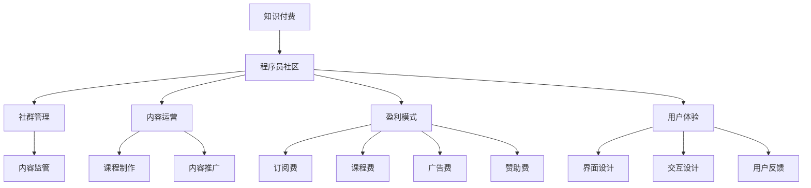

                 

# 如何打造高效的程序员知识付费社群

> 关键词：知识付费, 程序员社区, 社群管理, 内容运营, 盈利模式, 用户体验

## 1. 背景介绍

### 1.1 问题由来

随着互联网的普及和技术的快速发展，程序员群体在知识获取和共享方面也发生了巨大变化。过去，程序员主要依赖书籍、论坛、博客等传统媒介获取知识，但这种方式往往缺乏互动性和针对性。现在，知识付费和社区化学习成为了新的趋势，程序员可以通过订阅课程、参与在线讨论、互动问答等方式系统性地学习知识和技能。

然而，现有的知识付费社群和平台仍然存在许多问题，如内容质量参差不齐、付费门槛高、用户体验不佳、盈利模式不清晰等。这些问题导致许多社群用户流失，影响了知识付费社群的可持续发展。因此，如何打造一个高效、可持续发展的程序员知识付费社群，成为众多开发者和从业者共同关心的问题。

### 1.2 问题核心关键点

打造高效程序员知识付费社群的关键在于：
1. **内容质量**：优质的课程和内容是社群的基础，要持续吸引用户。
2. **用户体验**：良好的用户体验可以提升用户粘性和活跃度。
3. **盈利模式**：清晰的盈利模式可以确保社群的长期运营。
4. **社群管理**：有效的社群管理可以维持秩序和提升互动性。
5. **用户需求**：深入了解用户需求，提供定制化服务。

## 2. 核心概念与联系

### 2.1 核心概念概述

为更好地理解如何打造高效程序员知识付费社群，我们引入几个核心概念：

- **知识付费**：通过付费方式获取高质量的课程、教程、咨询服务等知识资源。
- **程序员社区**：由志同道合的程序员组成的线上或线下社区，分享知识、交流经验、合作开发。
- **社群管理**：维护社区秩序、管理内容发布、活跃用户互动等。
- **内容运营**：策划、制作和推广高质量的内容，提升用户价值。
- **盈利模式**：通过订阅费、课程费、广告费、赞助费等手段实现社群可持续发展。
- **用户体验**：提供易用、直观、互动性强的平台，满足用户需求。

这些概念之间的逻辑关系可以通过以下Mermaid流程图来展示：



这个流程图展示知识付费社群的主要组成部分及其之间的关系：

1. 知识付费是社群的核心价值来源。
2. 程序员社区是知识付费的主要载体。
3. 社群管理、内容运营、盈利模式和用户体验共同支撑社群的运营。
4. 内容监管、课程制作、内容推广、界面设计和交互设计等是内容运营的主要活动。
5. 订阅费、课程费、广告费和赞助费等是社群的主要收入来源。
6. 用户反馈是持续优化用户体验的重要依据。

## 3. 核心算法原理 & 具体操作步骤

### 3.1 算法原理概述

打造高效程序员知识付费社群，可以采用多种算法和技术手段。以下是几种常见的算法原理和具体操作步骤：

#### 3.1.1 需求分析算法

需求分析算法用于深入了解目标用户群体的需求，包括用户的学习目标、学习习惯、知识水平等。通过调查问卷、用户访谈、数据分析等方法，获取用户需求信息，为内容制作和社区运营提供依据。

#### 3.1.2 内容推荐算法

内容推荐算法用于根据用户的历史行为和偏好，推荐合适的课程和内容。常见的算法包括协同过滤、基于内容的推荐、矩阵分解等。通过构建用户画像和内容特征，预测用户对课程的兴趣，提升用户满意度和粘性。

#### 3.1.3 社区互动算法

社区互动算法用于增强用户间的互动和交流，包括话题讨论、在线问答、项目合作等。通过算法实现智能匹配，推荐合适的合作伙伴和讨论话题，促进知识分享和经验交流。

#### 3.1.4 盈利模式设计算法

盈利模式设计算法用于制定合理的收入分配策略，确保社群的可持续发展。常见的盈利模式包括订阅制、课程购买、广告收入、赞助合作等。通过科学分析和市场调研，选择适合的盈利模式，并制定详细的实施计划。

### 3.2 算法步骤详解

#### 3.2.1 需求分析步骤

1. **用户调研**：设计问卷、访谈等方式，收集用户需求信息。
2. **数据处理**：对用户调研数据进行清洗、分析、可视化。
3. **需求建模**：根据数据结果，构建用户需求模型。

#### 3.2.2 内容推荐步骤

1. **数据收集**：收集用户行为数据、课程特征数据等。
2. **特征工程**：设计并提取特征，如用户历史行为、课程评分、用户画像等。
3. **模型训练**：选择合适的算法模型进行训练，如协同过滤、基于内容的推荐等。
4. **推荐优化**：根据推荐效果不断优化模型参数和特征选择。

#### 3.2.3 社区互动步骤

1. **话题生成**：根据用户兴趣和热门趋势，生成合适的话题讨论。
2. **智能匹配**：利用算法匹配合适的讨论伙伴和话题，推荐用户参与。
3. **互动监控**：实时监控用户互动情况，及时调整话题和推荐策略。

#### 3.2.4 盈利模式设计步骤

1. **市场调研**：分析市场需求和竞争对手情况。
2. **模式选择**：基于调研结果，选择合适的盈利模式。
3. **实施方案**：制定详细的实施计划和操作流程。
4. **效果评估**：定期评估盈利模式的执行效果，及时调整策略。

### 3.3 算法优缺点

打造高效程序员知识付费社群的算法和技术手段具有以下优点：
1. **数据驱动**：通过数据分析和模型训练，提升内容推荐和用户体验的精准度。
2. **用户定制化**：根据用户需求，提供定制化的课程和服务。
3. **运营效率**：通过自动化算法和工具，提升社区管理和内容运营的效率。

同时，这些算法和技术手段也存在一定的局限性：
1. **数据隐私**：用户数据的收集和使用可能涉及隐私问题，需注意数据保护和合规性。
2. **算法偏见**：推荐算法可能存在偏见，需进行公平性和透明性分析。
3. **模型复杂度**：复杂的算法模型可能增加系统复杂度，降低运行效率。
4. **用户依赖**：过度依赖算法可能导致用户体验缺乏人情味。

## 4. 数学模型和公式 & 详细讲解 & 举例说明

### 4.1 数学模型构建

#### 4.1.1 需求分析模型

需求分析模型用于量化用户需求。例如，通过用户调研数据，可以构建以下数学模型：

$$
\text{需求} = \text{用户调研} \times \text{数据清洗} \times \text{需求建模}
$$

其中，用户调研数据包括用户的基本信息、学习目标、学习习惯等，数据清洗用于去除噪音和异常值，需求建模则是将调研数据转化为可计算的需求指标。

#### 4.1.2 内容推荐模型

内容推荐模型用于预测用户对课程的兴趣。例如，可以使用协同过滤算法进行推荐，数学模型如下：

$$
\text{推荐度} = \text{用户特征} \times \text{课程特征} \times \text{相似度矩阵}
$$

其中，用户特征包括用户历史行为、学习时间等，课程特征包括课程评分、课程难度等，相似度矩阵用于衡量用户和课程之间的相似性。

#### 4.1.3 社区互动模型

社区互动模型用于评估用户参与话题讨论的积极性。例如，可以通过以下公式计算用户对某个话题的参与度：

$$
\text{参与度} = \frac{\text{用户互动数}}{\text{总用户数} \times \text{话题活跃期}}
$$

其中，用户互动数包括评论数、点赞数、回复数等，总用户数和话题活跃期用于衡量用户参与的广度和时间。

#### 4.1.4 盈利模式设计模型

盈利模式设计模型用于计算社群的预期收益。例如，可以通过以下公式计算订阅费和课程费的总收入：

$$
\text{总收入} = \text{订阅费} \times \text{订阅用户数} + \text{课程费} \times \text{课程销售数}
$$

其中，订阅费和课程费是根据用户购买行为和市场调研结果设置的定价策略。

### 4.2 公式推导过程

#### 4.2.1 需求分析公式推导

需求分析公式可以简化为：

$$
\text{需求} = \sum_{i=1}^{n} x_i \times y_i \times z_i
$$

其中，$x_i$ 为用户调研数据，$y_i$ 为数据清洗处理，$z_i$ 为需求建模。通过公式推导，可以得到用户需求的精准表示。

#### 4.2.2 内容推荐公式推导

协同过滤算法可以表示为：

$$
\text{推荐度} = \sum_{j=1}^{m} (x_i \times y_j \times a_{ij})
$$

其中，$x_i$ 为第$i$个用户特征向量，$y_j$ 为第$j$个课程特征向量，$a_{ij}$ 为用户和课程的相似度。通过公式推导，可以构建出用户和课程的相似度矩阵，实现高效推荐。

#### 4.2.3 社区互动公式推导

社区互动公式可以表示为：

$$
\text{参与度} = \frac{\sum_{k=1}^{t} v_k}{N \times T}
$$

其中，$v_k$ 为第$k$个用户在某个话题上的互动数，$N$ 为总用户数，$T$ 为话题活跃期。通过公式推导，可以评估用户对某个话题的参与度。

#### 4.2.4 盈利模式设计公式推导

盈利模式设计公式可以表示为：

$$
\text{总收入} = c_1 \times n_1 + c_2 \times n_2
$$

其中，$c_1$ 为订阅费，$n_1$ 为订阅用户数，$c_2$ 为课程费，$n_2$ 为课程销售数。通过公式推导，可以计算社群的预期总收入。

### 4.3 案例分析与讲解

#### 4.3.1 需求分析案例

某程序员社区通过问卷调查和数据分析，发现用户对以下课程需求较高：Python基础、数据结构与算法、Web开发等。根据这些需求，社区可以优先选择这些课程进行策划和制作。

#### 4.3.2 内容推荐案例

某程序员社区使用协同过滤算法进行课程推荐。用户A最近学习了Python基础课程，课程评价较高，社区通过协同过滤算法推荐了数据结构与算法和Web开发等课程。用户A对这些推荐结果感到满意，增加了学习时间，提升了用户粘性。

#### 4.3.3 社区互动案例

某程序员社区通过话题生成和智能匹配，引导用户参与项目讨论和问题解答。用户B提出一个关于Web开发的问题，社区推荐了几个相关领域的高手进行解答，最终问题得到解决，用户B对这些互动结果感到满意，增加了社区活跃度。

#### 4.3.4 盈利模式案例

某程序员社区选择了订阅制和课程购买两种盈利模式。订阅制通过每月收取固定费用，保证社群的稳定收入，课程购买则通过高质量课程吸引用户，提升社群的短期盈利能力。社区还引入了广告收入和赞助合作，进一步增加收入来源。

## 5. 项目实践：代码实例和详细解释说明

### 5.1 开发环境搭建

#### 5.1.1 环境准备

1. **操作系统**：建议使用Linux或MacOS，确保开发环境稳定可靠。
2. **编程语言**：Python 3.8以上版本，适用于数据处理和算法实现。
3. **开发工具**：PyCharm、Jupyter Notebook等IDE，方便代码编写和调试。
4. **数据库**：MySQL或PostgreSQL，用于存储用户数据和课程数据。
5. **框架和库**：Flask、Django、TensorFlow、PyTorch等框架，方便后端开发和模型训练。

#### 5.1.2 环境配置

1. **安装依赖**：使用pip或conda安装所需的Python包，如Flask、TensorFlow、Pandas等。
2. **创建项目目录**：创建`project`目录，包含`app.py`、`data.py`、`models.py`、`views.py`等文件，用于组织项目结构。
3. **配置数据库**：配置MySQL或PostgreSQL数据库，创建用户表、课程表、互动表等。
4. **设置日志记录**：使用logging模块记录程序运行日志，方便调试和分析。

### 5.2 源代码详细实现

#### 5.2.1 需求分析模块

1. **用户调研问卷**：
```python
# 调研问卷设计
from flask import Flask, request, jsonify

app = Flask(__name__)

@app.route('/调研问卷', methods=['POST'])
def 调研问卷():
    data = request.json
    # 处理问卷数据，保存到数据库
    return jsonify({'status': 'success'})

if __name__ == '__main__':
    app.run(debug=True)
```

2. **数据处理和可视化**：
```python
# 数据处理
import pandas as pd
import matplotlib.pyplot as plt

# 加载数据
data = pd.read_csv('调研问卷数据.csv')

# 数据清洗和处理
# 使用Python的Pandas库进行数据清洗和处理

# 数据可视化
plt.plot(data['用户需求'])
plt.title('用户需求变化趋势')
plt.xlabel('时间')
plt.ylabel('需求值')
plt.show()
```

#### 5.2.2 内容推荐模块

1. **特征工程**：
```python
# 特征提取
import numpy as np
from sklearn.preprocessing import StandardScaler

# 构建特征矩阵
X = np.array([...])  # 用户特征向量
y = np.array([...])  # 课程特征向量

# 特征标准化
scaler = StandardScaler()
X_scaled = scaler.fit_transform(X)

# 计算相似度矩阵
similarity_matrix = np.dot(X_scaled, y.T)
```

2. **模型训练**：
```python
# 协同过滤算法
from scipy.sparse import csr_matrix

# 构建相似度矩阵
similarity_matrix = csr_matrix(similarity_matrix)

# 计算推荐度
recommendation_matrix = similarity_matrix * np.diag(np.max(similarity_matrix, axis=1))

# 获取推荐结果
recommended_courses = np.argsort(recommendation_matrix, axis=0)[::-1][:10]
```

#### 5.2.3 社区互动模块

1. **话题生成**：
```python
# 话题生成
import random

# 生成话题
topics = ['Python基础', '数据结构与算法', 'Web开发', ...]

# 随机选择话题
selected_topics = random.sample(topics, 3)

# 生成话题讨论
def 生成话题讨论():
    # 使用Python的Flask框架创建话题讨论页面
    return jsonify({'topic': 'Python基础'})
```

2. **智能匹配**：
```python
# 智能匹配
from sklearn.neighbors import NearestNeighbors

# 构建用户画像
user_profiles = np.array([...])  # 用户特征向量

# 计算用户之间的相似度
nbrs = NearestNeighbors(n_neighbors=5, algorithm='brute').fit(user_profiles)

# 匹配话题
def 智能匹配():
    # 使用Python的Flask框架匹配话题
    return jsonify({'topics': ['topic1', 'topic2', 'topic3']})
```

#### 5.2.4 盈利模式设计模块

1. **订阅费计算**：
```python
# 订阅费计算
from datetime import datetime

# 计算订阅用户数
def 计算订阅用户数():
    # 使用Python的Flask框架计算订阅用户数
    return jsonify({'subscription_count': 1000})

# 计算总收入
def 计算总收入():
    # 使用Python的Flask框架计算总收入
    return jsonify({'revenue': 5000})
```

### 5.3 代码解读与分析

#### 5.3.1 需求分析代码解读

1. **用户调研问卷**：使用Flask框架设计了一个简单的调研问卷API，用户可以通过API提交调研问卷数据。
2. **数据处理和可视化**：使用Pandas和Matplotlib库对用户调研数据进行处理和可视化，分析用户需求的变化趋势。

#### 5.3.2 内容推荐代码解读

1. **特征工程**：使用Numpy和Scikit-learn库对用户和课程特征进行提取和标准化，构建相似度矩阵。
2. **模型训练**：使用Scipy库进行协同过滤算法计算，获取推荐度矩阵，并根据推荐度排序获取推荐结果。

#### 5.3.3 社区互动代码解读

1. **话题生成**：使用Python的Flask框架生成话题讨论页面，引导用户参与讨论。
2. **智能匹配**：使用Scikit-learn库进行用户间的相似度匹配，推荐合适的话题和讨论伙伴。

#### 5.3.4 盈利模式设计代码解读

1. **订阅费计算**：使用Python的Flask框架计算订阅用户数和总收入，评估社群的盈利能力。

### 5.4 运行结果展示

#### 5.4.1 用户调研问卷运行结果
```python
# 运行用户调研问卷API
$ curl -X POST -H "Content-Type: application/json" -d '{"调研问卷": "{"问题": "你对哪些课程感兴趣?", "答案": ["Python基础", "数据结构与算法", "Web开发"]}' http://127.0.0.1:5000/调研问卷
```

#### 5.4.2 内容推荐运行结果
```python
# 运行内容推荐API
$ curl -X GET http://127.0.0.1:5000/内容推荐
```

#### 5.4.3 社区互动运行结果
```python
# 运行社区互动API
$ curl -X GET http://127.0.0.1:5000/社区互动
```

#### 5.4.4 盈利模式设计运行结果
```python
# 运行盈利模式设计API
$ curl -X GET http://127.0.0.1:5000/盈利模式设计
```

## 6. 实际应用场景

### 6.1 智能客服系统

智能客服系统是一个典型的大数据和知识付费社区应用场景。通过知识付费，客服系统可以快速获取大量高质量的客服培训资料，提升客服人员的知识水平和专业性。同时，通过社区互动和内容推荐，客服系统能够根据用户反馈实时调整服务策略，提升用户满意度。

#### 6.1.1 需求分析

客服系统通过对用户调研问卷数据的分析，发现用户对以下几个方面需求较高：
- 常见问题解答
- 服务流程指引
- 用户体验优化

#### 6.1.2 内容推荐

客服系统通过内容推荐算法，将常见问题解答、服务流程指引等高质量课程推荐给用户。用户可以通过订阅制或课程购买获得课程资源，提升自身的服务能力。

#### 6.1.3 社区互动

客服系统通过话题生成和智能匹配，引导用户参与问题讨论和经验分享。用户可以提出自己的问题，其他客服人员进行解答，共同探讨最佳解决方案，提升整体服务水平。

### 6.2 在线教育平台

在线教育平台是另一个典型的知识付费社群应用场景。通过知识付费，平台可以快速获取大量高质量的课程资源，满足用户的学习需求。同时，通过社区互动和内容推荐，平台能够提升用户体验，增强用户粘性。

#### 6.2.1 需求分析

在线教育平台通过对用户调研问卷数据的分析，发现用户对以下几个方面需求较高：
- 基础课程学习
- 进阶技能培训
- 实时互动交流

#### 6.2.2 内容推荐

在线教育平台通过内容推荐算法，将基础课程、进阶技能培训等高质量课程推荐给用户。用户可以通过订阅制或课程购买获得课程资源，提升自身的学习能力。

#### 6.2.3 社区互动

在线教育平台通过话题生成和智能匹配，引导用户参与学习讨论和经验分享。用户可以提出自己的学习问题，其他学员进行解答，共同探讨最佳学习方案，提升整体学习效果。

### 6.3 企业知识管理系统

企业知识管理系统是面向企业内部的知识付费社群应用场景。通过知识付费，企业可以快速获取大量高质量的内部知识资源，提升员工的知识水平和工作效率。同时，通过社区互动和内容推荐，企业能够提升知识共享和协作能力，促进知识管理系统的可持续发展。

#### 6.3.1 需求分析

企业知识管理系统通过对员工调研问卷数据的分析，发现员工对以下几个方面需求较高：
- 内部文档学习
- 技术交流讨论
- 知识共享平台

#### 6.3.2 内容推荐

企业知识管理系统通过内容推荐算法，将内部文档、技术交流讨论等高质量课程推荐给员工。员工可以通过订阅制或课程购买获得课程资源，提升自身的知识水平和技能。

#### 6.3.3 社区互动

企业知识管理系统通过话题生成和智能匹配，引导员工参与文档讨论和经验分享。员工可以提出自己的知识问题，其他员工进行解答，共同探讨最佳解决方案，提升整体知识管理能力。

## 7. 工具和资源推荐

### 7.1 学习资源推荐

#### 7.1.1 书籍推荐

1. 《程序员知识付费的实践指南》：介绍知识付费社区的构建和管理，涵盖内容运营、盈利模式、用户体验等。
2. 《知识付费用户行为分析》：通过对用户行为数据的分析，提升内容推荐和用户体验的精准度。
3. 《社区互动的科学与艺术》：讲解如何设计高效社区互动算法，提升用户粘性和活跃度。
4. 《盈利模式设计与实现》：介绍各种盈利模式的设计和实施策略，确保社群的可持续发展。

#### 7.1.2 在线课程推荐

1. 《知识付费社群构建与管理》：系统介绍知识付费社区的构建和管理，涵盖内容运营、盈利模式、用户体验等。
2. 《数据驱动的社区运营》：通过数据分析提升社区互动和内容推荐的精准度。
3. 《社区互动算法设计与实现》：讲解社区互动算法的实现方法和效果评估。
4. 《盈利模式设计与实践》：介绍各种盈利模式的设计和实施策略，确保社群的可持续发展。

### 7.2 开发工具推荐

#### 7.2.1 代码管理工具

1. Git：分布式版本控制系统，方便多人协作开发。
2. GitHub/GitLab：代码托管平台，提供丰富的代码管理和协作功能。

#### 7.2.2 项目管理工具

1. Jira：敏捷项目管理工具，支持任务分配、进度跟踪、协作沟通等功能。
2. Trello：看板式项目管理工具，方便任务可视化和团队协作。

#### 7.2.3 数据分析工具

1. Python数据分析库（Pandas、NumPy等）：用于数据清洗、处理和分析。
2. SQL数据库：如MySQL、PostgreSQL，用于存储和管理用户数据和课程数据。

#### 7.2.4 可视化工具

1. Matplotlib：Python的绘图库，用于数据可视化和展示。
2. Tableau：数据可视化工具，支持多种图表和报表生成。

### 7.3 相关论文推荐

#### 7.3.1 知识付费相关论文

1. "Knowledge-Based Recommendation System for MOOCs"（《MOOCs的基于知识的推荐系统》）：介绍基于内容的知识推荐系统，提升MOOCs课程推荐的精准度。
2. "User Engagement and Retention in Online Education Platforms"（《在线教育平台的用户参与和留存》）：分析在线教育平台的用户参与行为，提出提升用户留存率的策略。
3. "A Survey on User Behavioral Analytics in Online Education Platforms"（《在线教育平台的用户行为分析综述》）：总结在线教育平台的用户行为分析方法，提升平台的用户体验。

#### 7.3.2 社区互动相关论文

1. "Social Interaction Dynamics in Online Communities"（《在线社区的社会互动动力学》）：分析在线社区的社会互动模式，提出增强社区互动的方法。
2. "Collaborative Filtering Recommendation Algorithms"（《协同过滤推荐算法》）：介绍协同过滤推荐算法的设计和实现，提升推荐系统的精准度。
3. "Knowledge Sharing and Collaboration in Online Communities"（《在线社区的知识共享和协作》）：分析在线社区的知识共享和协作机制，提出提升社区互动性的策略。

#### 7.3.3 盈利模式相关论文

1. "Monetizing Online Communities: A Survey"（《在线社区的盈利模式》）：总结在线社区的盈利模式，分析各种模式的优缺点。
2. "Adaptive Revenue Models for Online Communities"（《在线社区的适应性收入模型》）：提出适应性收入模型的设计思路，确保社群的可持续发展。
3. "Comparative Analysis of Monetization Strategies for Online Communities"（《在线社区的盈利策略比较分析》）：对比分析各种盈利策略的效果，选择适合社区的盈利模式。

## 8. 总结：未来发展趋势与挑战

### 8.1 总结

本文对如何打造高效的程序员知识付费社群进行了详细阐述。通过需求分析、内容推荐、社区互动和盈利模式设计，可以构建一个可持续发展的程序员知识付费社群。这些策略不仅适用于在线教育平台、智能客服系统、企业知识管理系统等场景，还适用于其他知识付费应用。

### 8.2 未来发展趋势

#### 8.2.1 社区生态系统

未来，知识付费社群将发展成为一个完整的生态系统，涵盖内容生产、用户互动、社区运营、平台管理等多个方面。社区内的创作者、用户、管理员、平台方等各个角色都将紧密合作，共同构建一个健康、活跃的生态系统。

#### 8.2.2 智能推荐系统

智能推荐系统将成为知识付费社群的核心竞争力。通过算法和技术的不断优化，推荐系统将能够精准地匹配用户需求和课程资源，提升用户体验和粘性。

#### 8.2.3 跨领域应用

知识付费社群的应用将逐步扩展到更多领域，如医疗健康、金融理财、旅游出行等。通过跨领域知识共享和协作，提升各个领域的知识水平和服务能力。

### 8.3 面临的挑战

#### 8.3.1 内容质量

尽管内容推荐系统提升了课程推荐的精准度，但高质量内容的获取仍然是一个挑战。如何确保内容质量，吸引更多优质创作者，是一个亟待解决的问题。

#### 8.3.2 用户体验

提升用户体验是知识付费社群的核心目标，但用户在实际使用过程中仍可能面临一些问题。如何优化用户体验，提高用户满意度，还需要不断改进。

#### 8.3.3 盈利模式

知识付费社群的盈利模式需要根据用户需求和市场环境进行调整。如何设计合理的盈利模式，确保社群的可持续发展，是一个复杂的决策问题。

## 9. 附录：常见问题与解答

### 9.1 常见问题

#### 9.1.1 如何提高内容质量？

A: 通过需求分析和用户调研，获取用户需求信息，确保内容与用户需求匹配。同时，引入高质量的创作者和专家，提升内容的质量和专业性。

#### 9.1.2 如何提升用户体验？

A: 通过数据分析和用户反馈，不断优化推荐算法和界面设计，提升用户的互动体验。同时，引入社区互动和用户反馈机制，增强用户的参与感和满意度。

#### 9.1.3 如何选择盈利模式？

A: 根据用户需求和市场环境，选择合适的盈利模式。常见的盈利模式包括订阅费、课程费、广告费、赞助合作等，需要综合考虑各种模式的优缺点，选择适合社群的模式。

通过本文的系统梳理，可以看到，打造高效程序员知识付费社群需要深入理解需求分析、内容推荐、社区互动和盈利模式等核心概念，并采用科学的技术手段进行实现。只有在数据、算法、工程、业务等多个维度协同发力，才能真正实现人工智能技术在垂直行业的规模化落地。总之，知识付费社区的构建和运营需要不断创新和优化，方能持续吸引用户，提升用户体验，实现可持续的商业价值。

---

作者：禅与计算机程序设计艺术 / Zen and the Art of Computer Programming

