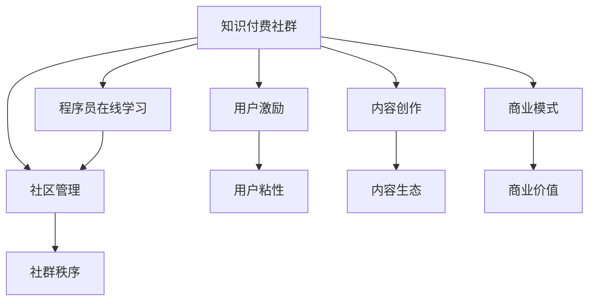

                 

# 如何打造高活跃度的程序员知识付费社群

> 关键词：知识付费社群,程序员,在线学习,社区管理,用户激励,内容创作,商业模式

## 1. 背景介绍

### 1.1 问题由来

在互联网和信息技术快速发展的今天，程序员作为技术创新的中坚力量，其职业发展和技能提升的需求日益增长。然而，传统的高等教育无法完全满足社会对程序员的需求，而在线教育平台的兴起，为程序员提供了一个全新的学习和交流平台。

知识付费社群便是其中一种有效模式，通过聚合优质的内容、良好的学习氛围和合理的激励机制，吸引并留住大批程序员持续学习和交流。然而，构建一个高活跃度的知识付费社群并非易事，需要在内容、技术、运营等多方面进行全方位的布局和优化。

### 1.2 问题核心关键点

构建一个高活跃度的程序员知识付费社群，其核心在于解决以下几个关键问题：

1. **内容质量与多样性**：提供高质量、多样化的课程和资源，满足不同层次程序员的学习需求。
2. **社区参与感**：通过互动和交流，提高用户对社群的认同感和归属感。
3. **激励机制**：建立合理的激励体系，鼓励用户创作优质内容、分享经验。
4. **商业模式**：确保社群的可持续发展，实现商业价值的最大化。

这些关键点相互关联，需要在社群构建和运营的全过程中，进行全方位的规划和实施。

## 2. 核心概念与联系

### 2.1 核心概念概述

在构建程序员知识付费社群的过程中，涉及以下核心概念：

- **知识付费社群**：基于在线平台，围绕特定知识领域，聚合优质内容，建立用户之间的互动和交流机制的社群。
- **程序员在线学习**：利用互联网和信息技术，为程序员提供灵活、便捷的学习方式。
- **社区管理**：通过技术和管理手段，维护社群的秩序和良性发展。
- **用户激励**：采用积分、排行榜、会员制度等方法，激发用户活跃度，提高社群粘性。
- **内容创作**：鼓励和引导用户创作和分享，形成内容的良性循环。
- **商业模式**：通过广告、付费会员、知识市场等渠道，实现社群的商业变现。

这些概念之间的逻辑关系可以通过以下Mermaid流程图来展示：



这个流程图展示了知识付费社群的核心组成部分及其相互关系：

1. **知识付费社群**：社群的根基，提供学习、交流的环境。
2. **程序员在线学习**：社群的核心功能，满足用户学习需求。
3. **社区管理**：保证社群秩序，促进良性互动。
4. **用户激励**：增强用户粘性，提高社群活跃度。
5. **内容创作**：激发用户贡献，丰富内容生态。
6. **商业模式**：保障社群的可持续发展和盈利能力。

## 3. 核心算法原理 & 具体操作步骤

### 3.1 算法原理概述

构建高活跃度的程序员知识付费社群，主要依赖以下算法和操作步骤：

1. **内容推荐算法**：根据用户兴趣和行为，推荐个性化内容，提升学习效率。
2. **互动分析算法**：分析用户之间的互动行为，了解社群活跃度和用户需求，优化社区管理。
3. **用户激励算法**：通过积分、排行榜等手段，激励用户积极参与社群活动。
4. **内容评价算法**：引入用户评价机制，筛选优质内容，推动内容创作的良性循环。

### 3.2 算法步骤详解

#### 3.2.1 内容推荐算法

**步骤一：用户画像构建**
- 收集用户的基本信息、学习行为、互动数据等，构建用户画像。
- 使用协同过滤、内容标签等技术，识别用户兴趣和偏好。

**步骤二：内容标注与建模**
- 对课程和资源进行详细标注，形成内容标签体系。
- 利用深度学习技术，建立内容推荐模型。

**步骤三：推荐结果生成**
- 根据用户画像和内容标签，实时生成个性化推荐结果。
- 动态调整推荐算法，提高推荐的准确性和个性化程度。

#### 3.2.2 互动分析算法

**步骤一：数据采集与处理**
- 收集社群内的互动数据，如评论、点赞、分享等。
- 清洗和预处理数据，移除噪声，保留有效信息。

**步骤二：行为分析与建模**
- 使用时序分析和聚类算法，分析用户互动行为模式。
- 建立互动行为预测模型，预测用户活跃度和需求变化。

**步骤三：社区管理优化**
- 根据行为分析结果，调整社区管理策略。
- 引入激励机制，提升用户活跃度和社群粘性。

#### 3.2.3 用户激励算法

**步骤一：激励体系设计**
- 定义积分、勋章、排行榜等激励机制。
- 明确激励规则和目标，引导用户参与社群活动。

**步骤二：激励策略实施**
- 动态生成激励信息，推送给用户。
- 实时监控激励效果，根据反馈调整策略。

#### 3.2.4 内容评价算法

**步骤一：评价模型构建**
- 设计用户评价模型，评估内容的质量和价值。
- 引入多维评价指标，综合考虑内容深度、实用性、创新性等。

**步骤二：评价结果应用**
- 根据评价结果，筛选优质内容。
- 优先推荐高评价内容，激励用户创作优质作品。

### 3.3 算法优缺点

**优点**：

- **个性化推荐**：通过精准推荐，提高学习效率和用户满意度。
- **动态管理**：实时监控和优化社群管理，促进良性互动。
- **用户激励**：通过激励体系，提升社群活跃度和粘性。
- **内容优化**：筛选优质内容，推动内容创作，形成良性循环。

**缺点**：

- **算法复杂**：需要复杂的算法和数据处理技术，开发和维护成本较高。
- **数据隐私**：在数据收集和分析过程中，需要注意用户隐私保护。
- **激励机制单一**：现有激励机制可能难以覆盖所有用户需求，需要不断优化和创新。
- **内容质量参差不齐**：用户创作的内容质量难以保证，需要严格的内容审核和管理。

### 3.4 算法应用领域

程序员知识付费社群的内容推荐算法和用户激励算法，主要应用于以下几个领域：

1. **在线教育平台**：提供个性化学习推荐，优化学习体验。
2. **技术社区**：引导用户互动，提高社区活跃度。
3. **开发者博客和论坛**：激励用户创作，丰富内容生态。
4. **开源项目和代码库**：筛选优质资源，提升项目质量。
5. **知识问答平台**：推荐相关问题，优化知识搜索。

## 4. 数学模型和公式 & 详细讲解 & 举例说明

### 4.1 数学模型构建

构建程序员知识付费社群的核心算法，可以基于以下数学模型进行设计和优化：

1. **用户画像模型**：
   - 假设用户 $u$ 具有 $d$ 个特征 $x = (x_1, x_2, ..., x_d)$。
   - 用户画像模型为 $P(u)$，表示用户特征的分布。

2. **内容推荐模型**：
   - 假设内容 $c$ 具有 $m$ 个属性 $p = (p_1, p_2, ..., p_m)$。
   - 内容推荐模型为 $R(c)$，表示内容的相关度。

3. **互动行为模型**：
   - 假设用户 $u$ 在时间 $t$ 的互动行为为 $A(t)$。
   - 互动行为模型为 $B(u, t)$，表示用户互动模式的动态变化。

4. **用户激励模型**：
   - 假设用户 $u$ 在 $n$ 次激励后获得的收益为 $R(n)$。
   - 用户激励模型为 $I(u, n)$，表示激励策略的效果。

5. **内容评价模型**：
   - 假设用户 $u$ 对内容 $c$ 的评价为 $E(c)$。
   - 内容评价模型为 $C(c)$，表示内容的综合质量。

### 4.2 公式推导过程

#### 4.2.1 用户画像模型

假设用户特征 $x$ 服从高斯分布，用户画像模型 $P(u)$ 为：

$$
P(u) = \mathcal{N}(x|\mu, \Sigma)
$$

其中 $\mu$ 为均值向量，$\Sigma$ 为协方差矩阵。

#### 4.2.2 内容推荐模型

内容推荐模型 $R(c)$ 可以表示为用户画像和内容属性的线性组合：

$$
R(c) = \mathbf{w}^T \cdot P(u) \cdot p
$$

其中 $\mathbf{w}$ 为权重向量。

#### 4.2.3 互动行为模型

假设用户互动行为 $A(t)$ 可以分解为多个行为序列 $B(u, t) = (b_1, b_2, ..., b_t)$，其中 $b_t$ 表示用户在时间 $t$ 的互动行为。

通过时间序列分析，可以建立互动行为模型 $B(u, t)$ 为：

$$
B(u, t) = \sum_{i=1}^{t} \beta_i \cdot A(t-i)
$$

其中 $\beta_i$ 为行为权重系数。

#### 4.2.4 用户激励模型

假设用户 $u$ 在 $n$ 次激励后获得的收益为 $R(n)$，可以表示为指数增长模型：

$$
R(n) = A_0 \cdot a^n
$$

其中 $A_0$ 为初始收益，$a$ 为增长系数。

#### 4.2.5 内容评价模型

内容评价模型 $C(c)$ 可以表示为用户评价 $E(c)$ 的加权平均：

$$
C(c) = \sum_{i=1}^{n} \alpha_i \cdot E_i(c)
$$

其中 $\alpha_i$ 为权重系数。

### 4.3 案例分析与讲解

以一个具体的案例来说明如何应用上述模型构建高活跃度的程序员知识付费社群：

假设有一个程序员社区，包含 $N$ 个用户 $u$ 和 $M$ 个课程 $c$。社区希望通过个性化推荐和用户激励，提升用户的活跃度和满意度。

**步骤一：数据收集与预处理**
- 收集用户的基本信息、学习行为、互动数据等。
- 清洗和预处理数据，移除噪声，保留有效信息。

**步骤二：用户画像模型**
- 通过高斯分布模型，构建用户画像 $P(u)$。
- 计算用户特征 $x$ 的均值 $\mu$ 和协方差矩阵 $\Sigma$。

**步骤三：内容推荐模型**
- 对课程进行详细标注，形成内容标签体系。
- 使用线性组合模型，计算每个课程与用户画像的匹配度 $R(c)$。

**步骤四：互动行为模型**
- 收集用户互动数据，分析行为模式。
- 建立行为预测模型，预测用户活跃度和需求变化。

**步骤五：用户激励模型**
- 设计积分、勋章、排行榜等激励机制。
- 实时生成激励信息，推送给用户。

**步骤六：内容评价模型**
- 设计用户评价模型，评估内容质量。
- 根据评价结果，筛选优质内容，推动内容创作。

## 5. 项目实践：代码实例和详细解释说明

### 5.1 开发环境搭建

进行程序员知识付费社群的开发，需要构建一个集成了多方面功能的平台。以下是搭建开发环境的步骤：

1. **选择技术栈**：
   - 后端：Python、Flask、Django 等 Web 开发框架。
   - 前端：React、Vue.js 等前端框架。
   - 数据库：MySQL、MongoDB 等关系型/非关系型数据库。

2. **安装依赖**：
   - 使用 pip 安装 Flask、SQLAlchemy、TensorFlow 等依赖包。
   - 使用 npm 安装 React、Redux 等前端依赖。

3. **搭建服务器**：
   - 使用 Docker 容器化技术，构建高可扩展性的服务器环境。
   - 配置 Nginx 等 Web 服务器，优化性能。

### 5.2 源代码详细实现

以下是一个简化的知识付费社群平台后端代码实现示例，主要包含用户管理、内容推荐、互动分析等功能：

**用户管理模块**

```python
from flask import Flask, request, jsonify

app = Flask(__name__)

# 用户注册接口
@app.route('/register', methods=['POST'])
def register():
    data = request.json
    user = User(name=data['name'], email=data['email'], password=hash_password(data['password']))
    db.session.add(user)
    db.session.commit()
    return jsonify({'message': '注册成功'})

# 用户登录接口
@app.route('/login', methods=['POST'])
def login():
    data = request.json
    user = User.query.filter_by(email=data['email']).first()
    if not user or not check_password_hash(user.password, data['password']):
        return jsonify({'message': '登录失败'})
    return jsonify({'token': generate_token(user.id)})

# 获取用户信息接口
@app.route('/user', methods=['GET'])
def get_user():
    user_id = get_token_from_request(request)
    user = User.query.get(user_id)
    return jsonify({'user': user.to_json()})
```

**内容推荐模块**

```python
from sqlalchemy import func

# 内容推荐接口
@app.route('/recommend', methods=['GET'])
def recommend():
    user_id = get_token_from_request(request)
    user = User.query.get(user_id)
    content = Content.query.filter_by(user_id=user.id).order_by(func.random()).first()
    return jsonify({'content': content.to_json()})
```

**互动分析模块**

```python
from sqlalchemy import func

# 互动分析接口
@app.route('/analyze', methods=['GET'])
def analyze():
    user_id = get_token_from_request(request)
    user = User.query.get(user_id)
    interaction = db.session.query(Interaction).filter_by(user_id=user.id).order_by(Interaction.timestamp.desc()).first()
    return jsonify({'interaction': interaction.to_json()})
```

### 5.3 代码解读与分析

**用户管理模块**：
- 实现用户注册和登录功能。
- 使用 SQLAlchemy 进行数据库操作，实现用户数据的管理。

**内容推荐模块**：
- 实现内容推荐功能。
- 通过随机函数，获取用户推荐的内容。

**互动分析模块**：
- 实现互动分析功能。
- 获取用户的最新互动数据，分析其行为模式。

### 5.4 运行结果展示

通过上述代码实现，可以搭建一个简单的程序员知识付费社群平台。用户可以在平台上注册、登录、查看推荐内容和互动分析结果，实现基本的知识付费功能。

## 6. 实际应用场景

### 6.1 智能问答社区

智能问答社区是程序员知识付费社群的一种重要形式，通过智能推荐和实时互动，帮助用户快速解决问题。

**实际应用**：
- 智能问答社区可以为程序员提供高质量的技术支持。
- 社区内可以汇聚顶尖工程师和专家，解答用户的各种技术问题。
- 通过互动分析，社区可以了解用户的需求和偏好，优化问题分类和推荐算法。

### 6.2 在线课程平台

在线课程平台是程序员知识付费社群的另一大形式，通过视频、直播、文档等形式，提供系统化的学习资源。

**实际应用**：
- 在线课程平台可以为程序员提供结构化的学习内容。
- 课程平台可以邀请行业专家进行授课，提供高质量的课程资源。
- 通过用户激励，提高课程的互动和参与度。

### 6.3 技术交流群组

技术交流群组是程序员知识付费社群的重要补充，通过小组讨论、技术分享等方式，促进程序员之间的交流和学习。

**实际应用**：
- 技术交流群组可以为程序员提供交流的平台。
- 群组内可以分享最新的技术进展、项目经验，促进知识的传播和创新。
- 通过用户激励，提高群组的活跃度和参与度。

### 6.4 未来应用展望

随着人工智能技术的不断进步，程序员知识付费社群将迎来更多的创新和应用。

1. **智能推荐**：结合自然语言处理和深度学习技术，实现更加精准的内容推荐。
2. **个性化学习**：通过机器学习算法，实现个性化学习路径的定制。
3. **虚拟助教**：使用人工智能技术，实现虚拟助教的自动答疑和辅导。
4. **知识图谱**：构建知识图谱，实现知识点的关联和推荐。
5. **多模态学习**：结合视频、音频、图像等多种形式的资源，提供更加全面的学习体验。

## 7. 工具和资源推荐

### 7.1 学习资源推荐

为了帮助开发者系统掌握程序员知识付费社群的构建理论基础和实践技巧，这里推荐一些优质的学习资源：

1. **《程序员在线学习指南》**：介绍在线学习的原理、技术和管理方法，适合初学者和高级开发者。
2. **《社群运营秘籍》**：讲解社群管理、用户激励和内容创作等实战经验，适合运营人员和社群管理者。
3. **《数据科学与人工智能》**：涵盖数据科学和人工智能的基本概念和实践技巧，适合技术研发人员。
4. **《社区设计与用户行为分析》**：分析社区用户行为，优化社区管理策略，适合社区管理者和产品经理。
5. **《知识付费市场分析》**：分析知识付费市场的现状和未来趋势，适合创业者和管理者。

通过这些资源的学习实践，相信你一定能够快速掌握程序员知识付费社群的构建精髓，并用于解决实际的NLP问题。

### 7.2 开发工具推荐

高效的开发离不开优秀的工具支持。以下是几款用于程序员知识付费社群开发的常用工具：

1. **PyTorch**：基于Python的开源深度学习框架，灵活的计算图，适合快速迭代研究。
2. **TensorFlow**：由Google主导开发的开源深度学习框架，生产部署方便，适合大规模工程应用。
3. **Flask**：Python Web框架，适合构建轻量级Web应用。
4. **Django**：Python Web框架，适合构建复杂Web应用。
5. **React**：JavaScript前端框架，适合构建交互式的Web界面。
6. **Vue.js**：JavaScript前端框架，适合构建渐进式Web应用。
7. **MySQL**：关系型数据库，适合存储结构化数据。
8. **MongoDB**：非关系型数据库，适合存储无结构化数据。

合理利用这些工具，可以显著提升程序员知识付费社群的开发效率，加快创新迭代的步伐。

### 7.3 相关论文推荐

程序员知识付费社群的研究源于学界的持续研究。以下是几篇奠基性的相关论文，推荐阅读：

1. **《知识付费市场分析》**：分析知识付费市场的现状和未来趋势，适合创业者和管理者。
2. **《社群运营秘籍》**：讲解社群管理、用户激励和内容创作等实战经验，适合运营人员和社群管理者。
3. **《社区设计与用户行为分析》**：分析社区用户行为，优化社区管理策略，适合社区管理者和产品经理。
4. **《数据科学与人工智能》**：涵盖数据科学和人工智能的基本概念和实践技巧，适合技术研发人员。
5. **《程序员在线学习指南》**：介绍在线学习的原理、技术和管理方法，适合初学者和高级开发者。

这些论文代表了大语言模型微调技术的发展脉络。通过学习这些前沿成果，可以帮助研究者把握学科前进方向，激发更多的创新灵感。

## 8. 总结：未来发展趋势与挑战

### 8.1 研究成果总结

本文对程序员知识付费社群的构建方法进行了全面系统的介绍。首先阐述了知识付费社群的背景和核心关键点，明确了构建社群的重要性和必要性。其次，从原理到实践，详细讲解了社群构建和运营的核心算法，给出了完整的代码实现。同时，本文还探讨了知识付费社群在多个实际应用场景中的潜力，展示了其广泛的应用前景。最后，本文精选了社群构建和运营的相关学习资源，力求为读者提供全方位的技术指引。

通过本文的系统梳理，可以看到，构建高活跃度的程序员知识付费社群，需要全面考虑内容质量、社区管理、用户激励和内容创作等多个方面。唯有在内容、技术、运营等多方面进行全方位的布局和优化，才能实现社群的持续发展和商业价值的最大化。

### 8.2 未来发展趋势

展望未来，程序员知识付费社群的发展趋势主要体现在以下几个方面：

1. **技术升级**：结合人工智能和大数据分析技术，提升社群的个性化推荐和互动分析能力。
2. **内容多样化**：结合视频、音频、图像等多种形式的资源，提供更加丰富的学习体验。
3. **智能助教**：使用人工智能技术，实现虚拟助教的自动答疑和辅导。
4. **知识图谱**：构建知识图谱，实现知识点的关联和推荐。
5. **多模态学习**：结合视频、音频、图像等多种形式的资源，提供更加全面的学习体验。

这些趋势展示了程序员知识付费社群的未来发展方向，需要通过不断的技术创新和实践探索，才能实现社群的可持续发展。

### 8.3 面临的挑战

尽管程序员知识付费社群已经取得了一定的进展，但在迈向更加智能化、普适化应用的过程中，仍面临诸多挑战：

1. **内容质量**：如何确保内容的高质量和多样化，满足用户的学习需求，是社群发展的关键。
2. **用户管理**：如何构建有效的用户激励和管理系统，提高用户参与度和满意度，是社群运营的核心。
3. **社区互动**：如何促进用户之间的互动和交流，提高社区的活跃度和粘性，是社群管理的重要任务。
4. **商业变现**：如何实现商业变现，确保社群的可持续发展，是社群发展的关键。

这些挑战需要通过不断的技术创新和运营优化，才能逐步解决，实现社群的持续发展和商业价值的最大化。

### 8.4 研究展望

面对程序员知识付费社群所面临的种种挑战，未来的研究需要在以下几个方面寻求新的突破：

1. **内容质量提升**：通过智能推荐和知识图谱，提升内容的个性化和多样化，满足用户的学习需求。
2. **用户激励优化**：设计更加多样化和个性化的激励体系，提高用户的参与度和满意度。
3. **社区互动增强**：引入人工智能和大数据分析技术，促进用户之间的互动和交流，提高社区的活跃度和粘性。
4. **商业变现创新**：探索多元化的商业变现渠道，如知识市场、广告、付费会员等，实现商业价值的最大化。

这些研究方向的探索，必将引领程序员知识付费社群技术迈向更高的台阶，为程序员的学习和交流提供更加智能、高效和便捷的平台。面向未来，我们需要不断地进行技术创新和实践探索，才能构建一个高活跃度的程序员知识付费社群，推动技术的发展和应用的普及。

## 9. 附录：常见问题与解答

**Q1：如何选择合适的开发技术栈？**

A: 选择合适的开发技术栈需要考虑多方面因素，如项目需求、技术栈的成熟度、开发效率、社区支持等。一般而言，可以优先选择社区活跃、文档齐全、工具完善的框架和技术。例如，Python的Flask和Django框架，JavaScript的React和Vue.js框架等，都是非常优秀的选择。

**Q2：如何设计用户激励体系？**

A: 设计用户激励体系需要考虑多方面的因素，如激励类型、激励规则、激励频率等。一般而言，可以设计积分、勋章、排行榜等激励机制，通过实时推送激励信息，提高用户的参与度和满意度。同时，还需要根据用户行为数据，动态调整激励策略，确保激励效果最大化。

**Q3：如何提升内容质量？**

A: 提升内容质量的关键在于内容筛选和质量控制。可以引入用户评价机制，通过多维度评价指标，筛选优质内容。同时，还可以通过智能推荐和知识图谱，提升内容的个性化和多样化，满足用户的学习需求。

**Q4：如何优化社区管理？**

A: 优化社区管理需要结合人工智能和大数据分析技术，对用户互动数据进行分析和建模，预测用户活跃度和需求变化，优化社区管理策略。同时，还需要引入合适的管理工具和机制，提高社区管理的效率和效果。

**Q5：如何实现商业变现？**

A: 实现商业变现需要结合社群的实际情况，选择适合的变现方式。一般而言，可以探索多元化的商业变现渠道，如知识市场、广告、付费会员等。同时，还需要设计合理的定价策略，确保商业变现的可持续性。

---

作者：禅与计算机程序设计艺术 / Zen and the Art of Computer Programming

