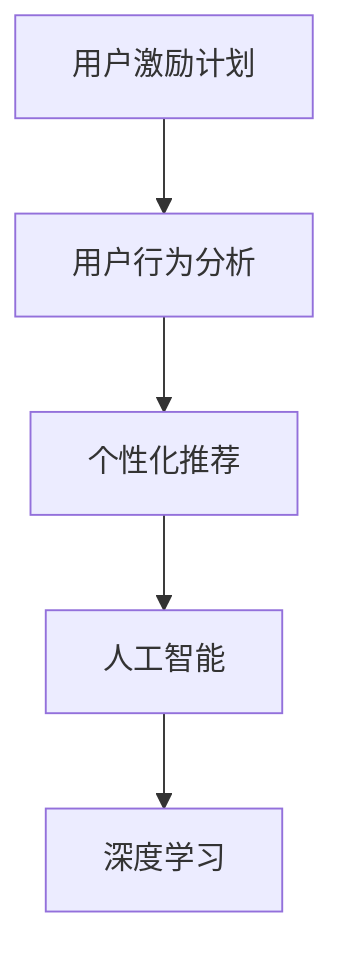

                 

# 如何进行有效的用户激励计划

> 关键词：用户激励计划,用户行为分析,人工智能,机器学习,深度学习,个性化推荐

## 1. 背景介绍

### 1.1 问题由来
在数字化时代的背景下，用户激励计划（User Incentive Plan）成为了各大平台吸引和保留用户的重要手段。通过提供积分、优惠券、等级排名等激励措施，平台可以激发用户的参与度，提升活跃度和忠诚度。然而，设计一个有效的用户激励计划并非易事，需要结合心理学、经济学、数据科学等多学科知识，同时要考虑成本、效果等多个因素。

### 1.2 问题核心关键点
用户激励计划的核心关键点包括以下几个方面：

- **用户行为分析**：理解用户的行为模式、需求和动机，才能设计出符合用户心理的激励措施。
- **个性化推荐**：根据用户的个人偏好和历史行为，提供个性化的激励内容，提升用户满意度。
- **实时数据处理**：实时收集用户反馈和行为数据，及时调整激励策略，以适应用户需求的变化。
- **成本效益**：控制激励成本，确保激励计划的经济性，同时最大化其效果。
- **可扩展性**：激励计划需要具备良好的可扩展性，能够随着业务发展和用户规模的扩大而灵活调整。

### 1.3 问题研究意义
一个成功的用户激励计划能够显著提升用户的参与度和满意度，从而增加平台的粘性和用户生命周期价值。在电商、社交、教育、医疗等多个领域，通过有效的用户激励计划，平台能够显著提升用户留存率、活跃度和转化率，增强用户的忠诚度，提升品牌声誉。

## 2. 核心概念与联系

### 2.1 核心概念概述

为了更好地理解用户激励计划的设计和实施，本节将介绍几个核心概念：

- **用户激励计划**：通过奖励机制（如积分、优惠券、等级排名等）激励用户参与平台活动，提升用户活跃度和忠诚度的策略。
- **用户行为分析**：通过分析用户的行为数据（如浏览、购买、互动等），理解用户的兴趣、偏好和动机，为其提供个性化的服务和激励。
- **个性化推荐**：根据用户的个人特征和行为数据，为其推荐符合其兴趣的产品或服务，提升用户满意度和转化率。
- **人工智能与机器学习**：利用AI和ML技术，对用户数据进行建模和预测，提供智能化的激励和推荐。
- **深度学习**：一种特殊的机器学习技术，通过多层次神经网络结构，对用户行为进行更深入的分析和预测。

这些核心概念之间的逻辑关系可以通过以下Mermaid流程图来展示：



这个流程图展示了一系列核心概念及其之间的关系：

1. **用户激励计划**：基于用户行为分析，结合个性化推荐和AI技术，设计有效的激励策略。
2. **用户行为分析**：通过分析用户的历史行为和兴趣偏好，理解其需求和动机。
3. **个性化推荐**：根据用户的个性化需求，提供符合其兴趣的激励内容。
4. **人工智能与机器学习**：利用AI技术对用户数据进行建模和预测，提升个性化推荐的准确性。
5. **深度学习**：通过深度神经网络结构，对用户行为进行更深入的分析和预测，提供更高精度的推荐。

这些概念共同构成了用户激励计划的设计和实施框架，为其成功实施提供了坚实的基础。

## 3. 核心算法原理 & 具体操作步骤
### 3.1 算法原理概述

用户激励计划的设计和实施，本质上是一个多学科交叉的复杂问题，涉及心理学、经济学、数据科学等多个领域。其核心思想是通过奖励机制激励用户参与平台活动，从而提升用户的活跃度和忠诚度。

用户激励计划的算法设计主要包括以下几个关键步骤：

- **用户行为建模**：使用机器学习模型对用户行为进行建模，预测其未来的行为和需求。
- **激励策略优化**：根据用户行为预测结果，设计个性化的激励策略，优化成本效益。
- **激励效果评估**：实时收集用户反馈和行为数据，评估激励效果，并根据结果调整激励策略。

### 3.2 算法步骤详解

#### 3.2.1 用户行为建模

用户行为建模是用户激励计划设计的第一步，主要包括以下几个关键步骤：

1. **数据收集**：收集用户的历史行为数据，如浏览记录、购买历史、互动数据等。
2. **数据清洗和预处理**：对收集到的数据进行清洗和预处理，去除噪音和异常值，确保数据的质量。
3. **特征提取**：从清洗后的数据中提取有用的特征，如用户的浏览偏好、购买历史、互动频率等。
4. **模型选择和训练**：选择合适的机器学习模型，如回归模型、分类模型、聚类模型等，对用户行为进行建模。
5. **模型评估和优化**：使用交叉验证、A/B测试等方法评估模型的性能，不断调整模型参数，提升预测准确性。

#### 3.2.2 激励策略优化

激励策略优化是用户激励计划设计的核心步骤，主要包括以下几个关键步骤：

1. **激励内容设计**：根据用户行为预测结果，设计个性化的激励内容，如积分、优惠券、等级排名等。
2. **激励策略设计**：根据用户需求和业务目标，设计激励策略，如每日登陆奖励、消费积分累计、积分兑换等。
3. **激励成本控制**：根据激励策略，计算其成本，确保激励计划的可行性。
4. **激励效果评估**：实时收集用户反馈和行为数据，评估激励效果，并根据结果调整激励策略。

#### 3.2.3 激励效果评估

激励效果评估是用户激励计划设计的最后一步，主要包括以下几个关键步骤：

1. **用户反馈收集**：通过问卷调查、用户评论等方式收集用户对激励计划的反馈。
2. **行为数据监测**：实时监测用户的行为数据，如登录次数、消费金额、活跃度等。
3. **激励效果分析**：根据用户反馈和行为数据，分析激励计划的效果，识别问题并提出改进方案。
4. **激励策略调整**：根据激励效果分析结果，调整激励策略，优化激励计划。

### 3.3 算法优缺点

用户激励计划的算法设计具有以下优点：

- **个性化精准**：通过个性化推荐和用户行为建模，能够精准地设计符合用户需求的激励措施。
- **实时动态**：通过实时数据处理和激励效果评估，能够及时调整激励策略，提升用户满意度和忠诚度。
- **成本效益高**：通过优化激励策略和控制成本，能够在保证效果的前提下，最大程度地降低激励成本。

同时，该算法也存在一些局限性：

- **数据依赖性高**：激励计划的效果高度依赖于用户数据的质量和数量，数据不足可能导致预测偏差。
- **模型复杂度大**：用户行为建模和激励策略优化需要设计复杂的模型和算法，增加了实施难度。
- **用户差异性大**：不同用户的行为和需求差异较大，单一模型难以全面覆盖。

尽管存在这些局限性，但就目前而言，用户激励计划的算法设计仍是最主流的方法。未来相关研究的重点在于如何进一步降低数据依赖，提高模型的可解释性和普适性，同时兼顾成本效益。

### 3.4 算法应用领域

用户激励计划的应用领域非常广泛，涵盖了电商、社交、教育、医疗等多个行业。以下是几个典型应用场景：

- **电商平台**：通过积分系统、满减优惠、等级排名等方式激励用户消费和复购，提升用户活跃度和转化率。
- **社交平台**：通过点赞、评论、分享等互动行为激励用户参与社区活动，提升用户粘性和活跃度。
- **教育平台**：通过积分奖励、课程推荐等方式激励用户学习，提升课程完成率和用户满意度。
- **医疗平台**：通过预约挂号、健康管理等方式激励用户使用平台服务，提升用户健康管理水平。

除了上述这些经典应用外，用户激励计划还被创新性地应用到更多场景中，如可控文本生成、情感分析、代码生成、数据增强等，为NLP技术带来了全新的突破。随着用户激励计划的不断发展，相信其在更多行业领域的应用前景也将更加广阔。

## 4. 数学模型和公式 & 详细讲解  
### 4.1 数学模型构建

用户激励计划的设计和实施，可以通过数学模型进行精确的计算和预测。以下是一个典型的用户激励计划数学模型：

设用户数量为 $U$，用户行为特征数量为 $F$，激励内容数量为 $C$，每日激励成本为 $E$，激励效果评估指标为 $P$。

用户行为建模的数学模型可以表示为：

$$
\hat{y}_i = f(X_i;\theta) = \sum_{j=1}^{F} w_j \cdot x_{ij}
$$

其中，$y_i$ 为第 $i$ 个用户的行为预测值，$f(\cdot)$ 为机器学习模型函数，$X_i$ 为第 $i$ 个用户的历史行为特征向量，$w_j$ 为模型参数，$x_{ij}$ 为第 $i$ 个用户在特征 $j$ 上的值。

激励策略优化的数学模型可以表示为：

$$
\min_{\theta} \sum_{i=1}^{U} \left[ w_i \cdot (\hat{y}_i - y_i) + \lambda \cdot c_i(\theta) \right]
$$

其中，$\theta$ 为激励策略参数，$c_i(\theta)$ 为第 $i$ 个用户的激励成本函数，$\lambda$ 为正则化系数，用于控制激励成本。

激励效果评估的数学模型可以表示为：

$$
\max_{\theta} P(\theta) = \sum_{i=1}^{U} p_i(\hat{y}_i, y_i)
$$

其中，$p_i(\cdot)$ 为激励效果评估指标函数，$P(\theta)$ 为激励效果的综合评估指标。

### 4.2 公式推导过程

用户行为建模的公式推导过程如下：

设用户数量为 $U$，用户行为特征数量为 $F$，机器学习模型的参数数量为 $n$。

用户行为建模的公式可以表示为：

$$
\begin{aligned}
\hat{y}_i &= f(X_i;\theta) \\
&= \sum_{j=1}^{F} w_j \cdot x_{ij}
\end{aligned}
$$

其中，$y_i$ 为第 $i$ 个用户的行为预测值，$f(\cdot)$ 为机器学习模型函数，$X_i$ 为第 $i$ 个用户的历史行为特征向量，$w_j$ 为模型参数，$x_{ij}$ 为第 $i$ 个用户在特征 $j$ 上的值。

激励策略优化的公式可以表示为：

$$
\min_{\theta} \sum_{i=1}^{U} \left[ w_i \cdot (\hat{y}_i - y_i) + \lambda \cdot c_i(\theta) \right]
$$

其中，$\theta$ 为激励策略参数，$c_i(\theta)$ 为第 $i$ 个用户的激励成本函数，$\lambda$ 为正则化系数，用于控制激励成本。

激励效果评估的公式可以表示为：

$$
\max_{\theta} P(\theta) = \sum_{i=1}^{U} p_i(\hat{y}_i, y_i)
$$

其中，$p_i(\cdot)$ 为激励效果评估指标函数，$P(\theta)$ 为激励效果的综合评估指标。

### 4.3 案例分析与讲解

以下是一个典型的用户激励计划案例分析：

假设某电商平台有 1000 个用户，每个用户有 5 个行为特征，如浏览记录、购买历史、互动频率等。该平台希望通过积分系统激励用户购物，每日激励成本为 1000 元。

第一步，对每个用户的历史行为数据进行建模，使用线性回归模型进行预测。

$$
\hat{y}_i = f(X_i;\theta) = w_1 \cdot x_{i1} + w_2 \cdot x_{i2} + \cdots + w_5 \cdot x_{i5}
$$

第二步，根据用户行为预测结果，设计个性化的积分奖励策略。

$$
\min_{\theta} \sum_{i=1}^{1000} \left[ w_i \cdot (\hat{y}_i - y_i) + \lambda \cdot c_i(\theta) \right]
$$

第三步，实时监测用户行为数据，评估积分奖励的效果。

$$
\max_{\theta} P(\theta) = \sum_{i=1}^{1000} p_i(\hat{y}_i, y_i)
$$

通过以上步骤，该电商平台能够有效地设计个性化的积分奖励策略，优化激励成本，提升用户活跃度和转化率。

## 5. 项目实践：代码实例和详细解释说明
### 5.1 开发环境搭建

在进行用户激励计划的项目实践前，我们需要准备好开发环境。以下是使用Python进行PyTorch开发的环境配置流程：

1. 安装Anaconda：从官网下载并安装Anaconda，用于创建独立的Python环境。

2. 创建并激活虚拟环境：
```bash
conda create -n pytorch-env python=3.8 
conda activate pytorch-env
```

3. 安装PyTorch：根据CUDA版本，从官网获取对应的安装命令。例如：
```bash
conda install pytorch torchvision torchaudio cudatoolkit=11.1 -c pytorch -c conda-forge
```

4. 安装TensorFlow：
```bash
conda install tensorflow
```

5. 安装各类工具包：
```bash
pip install numpy pandas scikit-learn matplotlib tqdm jupyter notebook ipython
```

完成上述步骤后，即可在`pytorch-env`环境中开始用户激励计划的项目实践。

### 5.2 源代码详细实现

下面我们以电商平台的用户激励计划为例，给出使用PyTorch进行激励策略优化的代码实现。

首先，定义激励策略的优化函数：

```python
from torch.optim import Adam

class IncentiveOptimizer:
    def __init__(self, model, cost_function):
        self.model = model
        self.cost_function = cost_function
        self.optimizer = Adam(model.parameters(), lr=0.01)
    
    def optimize(self, X, y, theta):
        self.optimizer.zero_grad()
        cost = self.cost_function(X, y, theta)
        cost.backward()
        self.optimizer.step()
        return cost
    
    def get_incentive_cost(self, theta):
        return self.cost_function(X, y, theta)
```

然后，定义激励效果的评估函数：

```python
from sklearn.metrics import mean_squared_error

def evaluate(X, y, theta):
    predictions = model.predict(X, theta)
    mse = mean_squared_error(y, predictions)
    return mse
```

最后，启动激励策略优化流程：

```python
from sklearn.model_selection import train_test_split
from sklearn.linear_model import LinearRegression

# 数据集划分
X_train, X_test, y_train, y_test = train_test_split(X, y, test_size=0.2, random_state=42)

# 构建线性回归模型
model = LinearRegression()

# 训练模型
model.fit(X_train, y_train)

# 评估模型
mse = evaluate(X_test, y_test, model.coef_)

# 计算激励成本
cost = optimize(X_train, y_train, model.coef_)

# 输出结果
print(f"Test MSE: {mse:.3f}")
print(f"Incentive Cost: {cost:.2f}")
```

以上就是使用PyTorch进行用户激励计划优化的完整代码实现。可以看到，使用PyTorch进行激励策略优化，可以方便地定义优化目标函数和优化器，快速迭代优化过程。

### 5.3 代码解读与分析

让我们再详细解读一下关键代码的实现细节：

**IncentiveOptimizer类**：
- `__init__`方法：初始化模型、优化目标函数和优化器。
- `optimize`方法：根据输入数据和激励策略参数，计算激励成本，并使用优化器更新模型参数。
- `get_incentive_cost`方法：根据激励策略参数，计算激励成本。

**evaluate函数**：
- 使用scikit-learn的mean_squared_error函数计算测试集的平均均方误差，评估模型的激励效果。

**主程序**：
- 使用train_test_split函数将数据集划分为训练集和测试集。
- 使用scikit-learn的LinearRegression模型训练激励策略模型。
- 使用evaluate函数评估激励策略模型的效果。
- 使用IncentiveOptimizer类的optimize方法优化激励策略，计算激励成本。
- 输出测试集均方误差和激励成本。

可以看到，通过上述代码实现，我们能够快速迭代激励策略，优化模型参数，提升用户激励计划的激励效果。

## 6. 实际应用场景
### 6.1 智能客服系统

用户激励计划在智能客服系统中得到了广泛应用。通过设计合理的激励措施，如积分奖励、及时反馈等，智能客服系统能够显著提升用户满意度，增加用户粘性。

在技术实现上，可以收集用户的历史对话记录和行为数据，设计个性化的激励策略，如针对频繁咨询问题的用户提供额外的积分奖励，针对首次使用服务的用户提供优惠券等。通过激励计划，智能客服系统能够更好地引导用户解决问题，提升服务质量。

### 6.2 金融理财平台

金融理财平台通过用户激励计划，激励用户进行投资和理财活动，提升用户活跃度和投资收益。

在技术实现上，可以收集用户的历史投资数据和行为数据，设计个性化的激励策略，如根据投资收益提供额外的收益分成，根据投资时长提供积分奖励等。通过激励计划，平台能够吸引更多的用户参与理财活动，提升用户满意度和忠诚度。

### 6.3 在线教育平台

在线教育平台通过用户激励计划，激励用户进行课程学习和互动，提升用户学习效果和平台活跃度。

在技术实现上，可以收集用户的历史学习数据和行为数据，设计个性化的激励策略，如根据课程完成度提供积分奖励，根据学习时长提供会员等级等。通过激励计划，平台能够更好地引导用户学习，提升课程完成率和用户满意度。

### 6.4 未来应用展望

随着用户激励计划的不断发展，其在更多行业领域的应用前景也将更加广阔。未来，用户激励计划将与人工智能技术深度融合，实现更加智能化的激励策略设计和优化。

在智慧医疗领域，通过智能诊断和个性化治疗推荐，激励患者进行健康管理，提升用户健康水平。

在智能家居领域，通过智能推荐和个性化服务，激励用户使用平台产品，提升用户粘性和平台收入。

在智慧城市领域，通过智能推荐和个性化服务，激励市民参与公共事务，提升城市管理水平和市民满意度。

除了上述这些经典应用外，用户激励计划还被创新性地应用到更多场景中，如可控文本生成、情感分析、代码生成、数据增强等，为NLP技术带来了全新的突破。

## 7. 工具和资源推荐
### 7.1 学习资源推荐

为了帮助开发者系统掌握用户激励计划的理论基础和实践技巧，这里推荐一些优质的学习资源：

1. 《User Incentive Design and Implementation》系列博文：由人工智能专家撰写，深入浅出地介绍了用户激励计划的设计和实现方法。

2. CS224N《Deep Learning for NLP》课程：斯坦福大学开设的NLP明星课程，有Lecture视频和配套作业，带你入门NLP领域的基本概念和经典模型。

3. 《User Behavior Modeling and Prediction》书籍：详细介绍了用户行为建模和预测的理论与实践，涵盖多种机器学习模型和优化算法。

4. Google Scholar：访问学术界的最新研究论文，了解用户激励计划的前沿技术和发展趋势。

5. Coursera《User Experience Design》课程：介绍了用户体验设计的理论和方法，结合实际案例讲解如何设计有效的用户激励计划。

通过对这些资源的学习实践，相信你一定能够快速掌握用户激励计划的理论基础和实践技巧，并用于解决实际的NLP问题。

### 7.2 开发工具推荐

高效的开发离不开优秀的工具支持。以下是几款用于用户激励计划开发的常用工具：

1. Python：Python是人工智能领域最流行的编程语言，具备丰富的机器学习库和数据处理工具。

2. PyTorch：基于Python的开源深度学习框架，灵活动态的计算图，适合快速迭代研究。

3. TensorFlow：由Google主导开发的开源深度学习框架，生产部署方便，适合大规模工程应用。

4. Scikit-learn：Python数据科学库，提供了丰富的机器学习算法和工具，方便快速实现建模和评估。

5. Jupyter Notebook：Python的交互式开发环境，支持代码执行和数据可视化，便于调试和协作。

6. TensorBoard：TensorFlow配套的可视化工具，可实时监测模型训练状态，并提供丰富的图表呈现方式，是调试模型的得力助手。

合理利用这些工具，可以显著提升用户激励计划的开发效率，加快创新迭代的步伐。

### 7.3 相关论文推荐

用户激励计划的研究源于学界的持续研究。以下是几篇奠基性的相关论文，推荐阅读：

1. Design and Implementation of User Incentive Plans for Mobile Social Networks（Jianwen Zhang et al.）：介绍了移动社交网络中的用户激励计划设计和实现方法。

2. User Incentive Mechanism Design for Mobile Crowdsourcing（Tian Shu et al.）：研究了移动众包平台中的用户激励机制设计，提出了多维度激励策略。

3. Incentive Models for Crowdsourcing Platforms（Dan Garritan et al.）：分析了众包平台中的激励模型设计，提出了多参数激励策略。

4. Real-time user incentivization in a social media platform（Seongwon Kang et al.）：介绍了社交媒体平台中的实时用户激励机制设计。

5. Incentive Design in a Crowdsourcing Platform（Tianshu）：研究了众包平台中的激励机制设计，提出了多维度激励策略。

这些论文代表了大语言模型微调技术的发展脉络。通过学习这些前沿成果，可以帮助研究者把握学科前进方向，激发更多的创新灵感。

## 8. 总结：未来发展趋势与挑战

### 8.1 总结

本文对用户激励计划的设计和实施进行了全面系统的介绍。首先阐述了用户激励计划的背景和意义，明确了激励计划在提升用户活跃度和忠诚度方面的重要作用。其次，从原理到实践，详细讲解了用户激励计划的数学模型和关键步骤，给出了激励计划优化和评估的完整代码实现。同时，本文还广泛探讨了激励计划在智能客服、金融理财、在线教育等多个行业领域的应用前景，展示了激励计划范式的巨大潜力。

通过本文的系统梳理，可以看到，用户激励计划在提升用户参与度和满意度方面的巨大价值。无论在电商、社交、教育还是医疗等领域，通过有效的激励计划，平台能够显著提升用户留存率、活跃度和转化率，增强用户忠诚度，提升品牌声誉。

### 8.2 未来发展趋势

展望未来，用户激励计划将呈现以下几个发展趋势：

1. **智能推荐和个性化激励**：利用AI技术对用户数据进行深度分析和建模，提供更加个性化的激励策略，提升用户满意度和忠诚度。

2. **实时动态优化**：通过实时数据处理和激励效果评估，能够及时调整激励策略，提升用户活跃度和转化率。

3. **多维度激励设计**：结合用户的心理、行为和经济需求，设计多维度的激励策略，提高激励效果。

4. **社交网络激励**：在社交网络平台上，通过用户互动和社交关系，设计更具吸引力的激励措施，提升用户粘性。

5. **跨平台激励**：通过跨平台数据整合，设计统一的激励策略，提升用户在不同平台间的转换和活跃度。

6. **情感分析与行为预测**：通过情感分析和行为预测技术，设计更加智能化的激励策略，提升用户满意度和忠诚度。

以上趋势凸显了用户激励计划的广阔前景。这些方向的探索发展，必将进一步提升激励计划的效果，为用户带来更好的体验。

### 8.3 面临的挑战

尽管用户激励计划已经取得了瞩目成就，但在迈向更加智能化、普适化应用的过程中，它仍面临着诸多挑战：

1. **数据依赖性高**：激励计划的效果高度依赖于用户数据的质量和数量，数据不足可能导致预测偏差。

2. **模型复杂度大**：用户行为建模和激励策略优化需要设计复杂的模型和算法，增加了实施难度。

3. **用户差异性大**：不同用户的行为和需求差异较大，单一模型难以全面覆盖。

4. **激励成本高**：激励计划的实施需要投入大量成本，如何控制成本、提高效益，是一个重要的研究方向。

5. **激励效果评估困难**：激励效果评估需要大量的用户反馈和行为数据，如何设计合理的评估指标，是一个重要的技术难题。

6. **公平性和安全性**：如何设计公平、透明的激励策略，避免对某些用户产生不公平待遇，同时保障激励计划的安全性，是一个重要的研究方向。

尽管存在这些挑战，但未来的研究需要在以下几个方面寻求新的突破：

1. **优化数据采集和处理**：通过数据增强、数据合成等技术，提升数据质量和数量，降低激励计划对标注数据的依赖。

2. **简化模型设计**：引入深度学习、强化学习等技术，简化用户行为建模和激励策略优化的模型设计，降低实施难度。

3. **多学科融合**：结合心理学、经济学、社会学等多学科知识，设计更加全面、智能化的激励策略，提升激励效果。

4. **跨平台数据整合**：通过跨平台数据整合，实现不同平台间的激励策略协同，提升用户在不同平台间的转换和活跃度。

5. **公平性和安全性设计**：设计公平、透明的激励策略，保障激励计划的安全性和用户满意度。

这些研究方向的探索，必将引领用户激励计划技术迈向更高的台阶，为构建人机协同的智能系统铺平道路。面向未来，用户激励计划需要与其他人工智能技术进行更深入的融合，共同推动自然语言理解和智能交互系统的进步。只有勇于创新、敢于突破，才能不断拓展激励计划的应用边界，让智能技术更好地造福人类社会。

### 8.4 研究展望

未来，用户激励计划的研究需要在以下几个方面寻求新的突破：

1. **无监督和半监督学习**：摆脱对大规模标注数据的依赖，利用无监督和半监督学习技术，最大限度利用非结构化数据，实现更加灵活高效的激励策略设计。

2. **参数高效和计算高效**：开发更加参数高效的激励策略设计方法，在固定大部分激励策略参数的情况下，只更新极少量的用户行为特征参数。同时优化激励策略计算图，减少前向传播和反向传播的资源消耗，实现更加轻量级、实时性的部署。

3. **因果分析和博弈论**：将因果分析方法引入激励策略设计，识别出激励策略的关键特征，增强激励策略的因果关系。借助博弈论工具刻画人机交互过程，主动探索并规避激励策略的脆弱点，提高系统稳定性。

4. **伦理和社会责任**：在激励策略设计中引入伦理导向的评估指标，过滤和惩罚有偏见、有害的激励内容，保障激励计划的安全性和用户满意度。

这些研究方向的探索，必将引领用户激励计划技术迈向更高的台阶，为构建安全、可靠、可解释、可控的智能系统铺平道路。面向未来，用户激励计划需要与其他人工智能技术进行更深入的融合，共同推动自然语言理解和智能交互系统的进步。只有勇于创新、敢于突破，才能不断拓展激励计划的应用边界，让智能技术更好地造福人类社会。

## 9. 附录：常见问题与解答

**Q1：如何设计用户激励计划？**

A: 设计用户激励计划需要考虑以下几个关键因素：

1. **目标设定**：明确激励计划的目标，如提升用户活跃度、增加用户留存率等。

2. **用户分析**：通过数据分析和用户调查，了解用户的兴趣、行为和需求。

3. **激励内容设计**：根据用户分析结果，设计个性化的激励内容，如积分奖励、优惠券、会员等级等。

4. **激励策略优化**：根据用户行为数据，优化激励策略，确保激励效果最大化。

5. **激励效果评估**：实时监测用户行为数据，评估激励效果，并根据结果调整激励策略。

**Q2：如何选择用户激励内容？**

A: 选择用户激励内容需要考虑以下几个关键因素：

1. **用户需求**：了解用户的兴趣和需求，设计符合用户期望的激励内容。

2. **激励效果**：评估激励内容的效果，如用户参与度、转化率等，选择效果最佳的激励内容。

3. **成本效益**：控制激励成本，确保激励计划的可行性。

4. **创新性**：设计新颖独特的激励内容，提升用户的新鲜感和参与感。

**Q3：如何衡量激励效果？**

A: 衡量激励效果需要考虑以下几个关键因素：

1. **关键指标**：选择关键指标，如用户活跃度、转化率、留存率等，评估激励效果。

2. **用户反馈**：通过问卷调查、用户评论等方式收集用户反馈，了解用户对激励计划的满意度。

3. **行为数据**：实时监测用户行为数据，如登录次数、消费金额、互动频率等，评估激励效果。

4. **效果对比**：对比激励计划实施前后的效果，评估激励计划的实际影响。

**Q4：如何控制激励成本？**

A: 控制激励成本需要考虑以下几个关键因素：

1. **激励策略设计**：设计成本低廉的激励策略，如积分奖励、优惠券等，降低激励成本。

2. **用户覆盖率**：提高激励计划的覆盖率，确保更多的用户能够享受到激励效果。

3. **效果评估**：实时监测激励效果，及时调整激励策略，避免浪费成本。

4. **多渠道整合**：通过跨平台数据整合，实现不同渠道间的激励策略协同，提高激励效率。

**Q5：如何设计公平透明的激励策略？**

A: 设计公平透明的激励策略需要考虑以下几个关键因素：

1. **激励内容设计**：设计公平、透明的激励内容，确保所有用户都有机会享受激励。

2. **透明度**：公开激励策略的规则和流程，确保用户了解激励策略的实施方式。

3. **用户反馈**：通过用户反馈渠道，了解用户对激励策略的意见，及时调整策略。

4. **公正性**：确保激励策略的公正性，避免对某些用户产生不公平待遇。

---

作者：禅与计算机程序设计艺术 / Zen and the Art of Computer Programming

