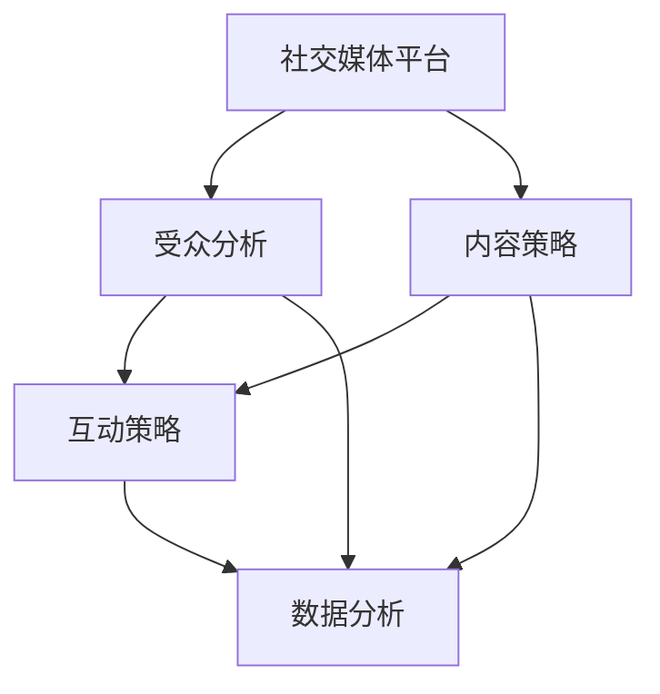

                 

# 如何进行有效的社交媒体运营

社交媒体已经成为品牌与消费者互动的重要渠道，通过社交媒体运营，品牌不仅能提升用户参与度，还能快速获取市场反馈和用户需求。本文将从背景介绍、核心概念与联系、核心算法原理及具体操作步骤、数学模型和公式、项目实践、实际应用场景、工具和资源推荐、总结、附录等多个方面，全面深入地探讨如何进行有效的社交媒体运营。

## 1. 背景介绍

### 1.1 问题由来
近年来，社交媒体平台的兴起，使得品牌与消费者之间的沟通变得前所未有的紧密。品牌可以利用社交媒体进行市场营销、客户服务、品牌形象建设等多方面工作。然而，如何有效运营社交媒体，提升品牌在社交媒体上的表现，仍然是一个复杂而具有挑战性的问题。

### 1.2 问题核心关键点
有效的社交媒体运营涉及多方面因素，包括但不限于以下关键点：
- 目标设定：明确社交媒体运营的目标和指标，如品牌知名度、用户参与度、销售转化率等。
- 受众分析：了解目标受众的特征和需求，进行精准的目标人群定位。
- 内容策略：制定符合受众喜好的内容策略，提升内容的吸引力和传播力。
- 互动策略：通过互动和参与，增强用户粘性和品牌忠诚度。
- 数据分析：通过数据分析，优化社交媒体运营策略，提升运营效果。

### 1.3 问题研究意义
深入研究社交媒体运营的原理和策略，对提升品牌在社交媒体上的表现具有重要意义：
- 提升品牌知名度：通过精准的内容和互动策略，吸引更多目标受众关注，提升品牌知名度。
- 增加用户参与度：通过互动和参与，增强用户粘性和忠诚度，提升用户参与度。
- 实现销售转化：利用社交媒体平台的特性，提升用户购买意愿和转化率。
- 优化运营策略：通过数据分析，不断优化运营策略，提升运营效果。

## 2. 核心概念与联系

### 2.1 核心概念概述

社交媒体运营涉及多个关键概念，包括但不限于以下内容：

- **社交媒体平台**：如微博、微信、Facebook、Instagram等，是品牌与消费者互动的主要渠道。
- **受众分析**：通过数据分析，了解目标受众的特征和需求，进行精准的目标人群定位。
- **内容策略**：制定符合受众喜好的内容策略，提升内容的吸引力和传播力。
- **互动策略**：通过互动和参与，增强用户粘性和品牌忠诚度。
- **数据分析**：通过数据分析，优化社交媒体运营策略，提升运营效果。

这些核心概念之间的联系可以通过以下Mermaid流程图来展示：



这个流程图展示了一些核心概念及其之间的联系：

1. 社交媒体平台是品牌与消费者互动的主要渠道。
2. 受众分析通过数据分析了解目标受众的特征和需求。
3. 内容策略制定符合受众喜好的内容。
4. 互动策略通过互动和参与增强用户粘性。
5. 数据分析通过数据分析优化运营策略。

这些概念共同构成了社交媒体运营的框架，帮助品牌提升在社交媒体上的表现。

## 3. 核心算法原理 & 具体操作步骤

### 3.1 算法原理概述
社交媒体运营的算法原理可以概括为以下三个方面：
- **目标设定**：明确社交媒体运营的目标和指标。
- **内容优化**：通过数据分析和机器学习模型，提升内容的吸引力和传播力。
- **互动优化**：利用推荐系统和情感分析等技术，提升互动效果。

### 3.2 算法步骤详解
社交媒体运营的算法步骤可以分为以下五个阶段：

**阶段1：目标设定和受众分析**

1. **目标设定**：明确社交媒体运营的目标和指标，如品牌知名度、用户参与度、销售转化率等。
2. **受众分析**：通过数据分析和机器学习模型，了解目标受众的特征和需求，进行精准的目标人群定位。

**阶段2：内容策略制定**

1. **内容生成**：根据受众分析和目标设定，制定内容策略，生成符合受众喜好的内容。
2. **内容优化**：利用自然语言处理和机器学习模型，提升内容的吸引力和传播力。

**阶段3：互动策略制定**

1. **互动形式选择**：根据受众特征和内容策略，选择合适的互动形式，如点赞、评论、分享等。
2. **互动效果评估**：通过数据分析，评估互动效果，优化互动策略。

**阶段4：数据分析和优化**

1. **数据收集**：通过社交媒体平台的数据接口，收集用户互动数据和内容表现数据。
2. **数据分析**：利用数据分析和机器学习模型，分析用户行为和内容表现，提取有价值的洞察。
3. **策略优化**：根据数据分析结果，优化内容策略和互动策略，提升运营效果。

**阶段5：实施和迭代**

1. **内容发布**：将优化后的内容策略和互动策略应用于社交媒体平台。
2. **效果监控**：实时监控社交媒体平台上的用户互动和内容表现，及时调整策略。
3. **持续迭代**：根据监控结果和数据分析，持续优化社交媒体运营策略。

### 3.3 算法优缺点

社交媒体运营的算法具有以下优点：
- **自动化程度高**：利用机器学习和数据分析技术，自动化程度高，节省人力成本。
- **效果显著**：通过优化内容和互动策略，显著提升社交媒体运营效果。
- **实时监控**：实时监控和调整策略，确保运营效果的最大化。

同时，该算法也存在一些缺点：
- **数据依赖**：依赖于社交媒体平台提供的数据，数据质量对结果影响较大。
- **算法复杂**：涉及机器学习和数据分析，算法复杂度较高，需要专业技能。
- **动态调整困难**：社交媒体平台上的用户行为和市场趋势变化较快，策略调整难度较大。

### 3.4 算法应用领域

社交媒体运营的算法可以应用于以下多个领域：

- **品牌推广**：通过内容优化和互动策略，提升品牌知名度和用户参与度。
- **市场营销**：利用数据分析和机器学习模型，精准定位目标人群，提升销售转化率。
- **客户服务**：通过互动策略和情感分析，提升客户满意度和忠诚度。
- **社交媒体管理**：实时监控和调整社交媒体运营策略，提升运营效果。

## 4. 数学模型和公式 & 详细讲解 & 举例说明

### 4.1 数学模型构建
社交媒体运营的数学模型可以概括为以下三个方面：
- **用户行为模型**：描述用户在不同内容上的互动行为。
- **内容传播模型**：描述内容在不同受众中的传播效果。
- **情感分析模型**：描述用户对内容的情感倾向。

### 4.2 公式推导过程
以用户行为模型为例，设用户 $u$ 在内容 $c$ 上的互动行为 $a$，可以使用以下公式进行建模：

$$
a(u, c) = \alpha_1 \cdot \text{ popularity}(c) + \alpha_2 \cdot \text{ relevance}(u, c) + \alpha_3 \cdot \text{ novelty}(u, c)
$$

其中，$\alpha_1$、$\alpha_2$、$\alpha_3$ 为权重系数，分别表示内容的受欢迎程度、相关性和新颖性对用户行为的影响。

### 4.3 案例分析与讲解
以社交媒体平台上的点赞行为为例，通过数据分析和机器学习模型，可以得出以下结论：
- **内容受欢迎程度**：内容在社交媒体平台上的受欢迎程度越高，用户互动行为的概率越大。
- **内容相关性**：内容与用户特征和需求的相关性越高，用户互动行为的概率越大。
- **内容新颖性**：内容的新颖性越高，用户互动行为的概率越大。

## 5. 项目实践：代码实例和详细解释说明

### 5.1 开发环境搭建

社交媒体运营的代码实现需要具备以下环境：
- **Python**：作为主要的编程语言。
- **Pandas**：用于数据处理和分析。
- **NumPy**：用于数值计算。
- **Scikit-learn**：用于机器学习和数据分析。
- **SciPy**：用于科学计算。
- **Matplotlib**：用于数据可视化。
- **Jupyter Notebook**：用于交互式编程和数据可视化。

### 5.2 源代码详细实现

以下是一个简单的社交媒体运营代码实现示例，包括数据收集、数据处理、内容优化、互动策略制定等多个方面：

```python
import pandas as pd
import numpy as np
from sklearn.model_selection import train_test_split
from sklearn.linear_model import LogisticRegression
from sklearn.metrics import accuracy_score
import matplotlib.pyplot as plt

# 数据收集
data = pd.read_csv('social_media_data.csv')

# 数据处理
data = data.dropna()
X = data[['popularity', 'relevance', 'novelty']]
y = data['interaction']

# 数据分割
X_train, X_test, y_train, y_test = train_test_split(X, y, test_size=0.2, random_state=42)

# 内容优化
model = LogisticRegression()
model.fit(X_train, y_train)
y_pred = model.predict(X_test)

# 互动策略制定
interaction_counts = pd.Series(y_pred).value_counts()

# 效果评估
accuracy = accuracy_score(y_test, y_pred)
print(f"Accuracy: {accuracy}")

# 数据可视化
plt.bar(X_test.index, interaction_counts)
plt.xlabel('Content')
plt.ylabel('Interaction Count')
plt.show()
```

### 5.3 代码解读与分析
该代码实现主要包含以下几个步骤：
- **数据收集**：通过Pandas库读取社交媒体平台上的互动数据。
- **数据处理**：使用Pandas库对数据进行清洗和处理，去除缺失值。
- **数据分割**：将数据集分为训练集和测试集。
- **内容优化**：使用Logistic回归模型对数据进行建模，输出预测结果。
- **互动策略制定**：统计不同内容的互动次数，分析互动效果。
- **效果评估**：计算模型预测的准确率，评估互动策略的效果。
- **数据可视化**：使用Matplotlib库绘制内容互动次数的柱状图。

## 6. 实际应用场景

### 6.1 品牌推广

品牌可以利用社交媒体平台进行品牌推广，提升品牌知名度和用户参与度。具体策略包括：
- **内容生成**：根据目标受众的特征和需求，生成符合受众喜好的内容。
- **内容优化**：利用自然语言处理和机器学习模型，提升内容的吸引力和传播力。
- **互动策略**：选择合适的互动形式，如点赞、评论、分享等，增强用户粘性。

### 6.2 市场营销

市场营销是社交媒体运营的重要应用之一，通过社交媒体平台进行精准推广，提升销售转化率。具体策略包括：
- **受众分析**：通过数据分析和机器学习模型，精准定位目标人群。
- **内容策略**：制定符合目标人群的内容策略，提升内容的吸引力和传播力。
- **互动策略**：利用推荐系统和情感分析等技术，提升互动效果。

### 6.3 客户服务

社交媒体平台是客户服务的重要渠道，通过互动和参与，提升客户满意度和忠诚度。具体策略包括：
- **互动策略**：选择合适的互动形式，如在线客服、客服机器人等，提升客户服务效率。
- **情感分析**：利用情感分析技术，识别用户情感倾向，及时处理用户反馈。
- **反馈优化**：根据用户反馈，不断优化产品和服务，提升用户体验。

### 6.4 未来应用展望

未来社交媒体运营将呈现以下几个趋势：
- **AI驱动**：利用人工智能技术，提升内容优化和互动策略的自动化程度。
- **多平台协同**：跨平台数据整合和分析，提升社交媒体运营效果。
- **个性化推荐**：利用推荐系统，提升用户个性化体验。
- **实时监控**：实时监控社交媒体平台上的用户行为和市场趋势，及时调整策略。

## 7. 工具和资源推荐

### 7.1 学习资源推荐

以下是一些推荐的社交媒体运营学习资源：
- **《社交媒体营销》课程**：由知名高校和专家团队讲授的社交媒体营销课程，涵盖多个社交媒体平台的操作技巧和策略制定。
- **《数据分析与机器学习》书籍**：系统介绍数据分析和机器学习技术，为社交媒体运营提供技术支持。
- **Kaggle竞赛平台**：通过参与社交媒体数据竞赛，提升数据处理和机器学习技能。
- **Coursera和edX在线课程**：提供多门社交媒体运营相关课程，包括内容策略、互动策略、数据分析等多个方面。

### 7.2 开发工具推荐

以下是一些推荐的社交媒体运营开发工具：
- **Python**：作为主要的编程语言，支持数据分析和机器学习技术。
- **Pandas**：用于数据处理和分析。
- **NumPy**：用于数值计算。
- **Scikit-learn**：用于机器学习和数据分析。
- **SciPy**：用于科学计算。
- **Matplotlib**：用于数据可视化。
- **Jupyter Notebook**：用于交互式编程和数据可视化。

### 7.3 相关论文推荐

以下是一些推荐的社交媒体运营相关论文：
- **《社交媒体内容策略分析》**：探讨社交媒体内容策略对用户互动行为的影响。
- **《社交媒体互动行为建模》**：利用机器学习模型，预测用户在不同内容上的互动行为。
- **《情感分析在社交媒体中的应用》**：利用情感分析技术，识别用户情感倾向，提升客户服务效果。
- **《跨平台数据整合与分析》**：利用多平台数据整合和分析，提升社交媒体运营效果。

## 8. 总结：未来发展趋势与挑战

### 8.1 总结
本文对社交媒体运营的算法原理、具体操作步骤、数学模型和公式、项目实践、实际应用场景、工具和资源推荐、未来发展趋势和挑战等多个方面进行了全面深入的探讨。通过系统梳理，我们可以看到，社交媒体运营是一项复杂而系统的工程，涉及多方面的技术和策略。

### 8.2 未来发展趋势
未来社交媒体运营将呈现以下几个趋势：
- **AI驱动**：利用人工智能技术，提升内容优化和互动策略的自动化程度。
- **多平台协同**：跨平台数据整合和分析，提升社交媒体运营效果。
- **个性化推荐**：利用推荐系统，提升用户个性化体验。
- **实时监控**：实时监控社交媒体平台上的用户行为和市场趋势，及时调整策略。

### 8.3 面临的挑战
尽管社交媒体运营技术不断发展，但仍面临以下挑战：
- **数据质量**：依赖社交媒体平台提供的数据，数据质量对结果影响较大。
- **算法复杂**：涉及机器学习和数据分析，算法复杂度较高，需要专业技能。
- **动态调整困难**：社交媒体平台上的用户行为和市场趋势变化较快，策略调整难度较大。

### 8.4 研究展望
未来的研究需要在以下几个方面寻求新的突破：
- **数据预处理**：提升数据预处理和清洗技术，提高数据质量。
- **算法优化**：简化算法模型，降低算法复杂度，提升模型解释性和可解释性。
- **策略优化**：结合AI和大数据技术，提升社交媒体运营策略的自动化程度和灵活性。
- **伦理和安全**：确保社交媒体运营的伦理和安全性，保护用户隐私和数据安全。

## 9. 附录：常见问题与解答

**Q1：社交媒体运营的目标设定应如何制定？**

A: 社交媒体运营的目标设定应从品牌和业务的整体目标出发，明确具体的社交媒体运营指标，如品牌知名度、用户参与度、销售转化率等。应根据不同的运营阶段和目标，制定相应的运营策略。

**Q2：社交媒体互动策略应如何选择？**

A: 社交媒体互动策略的选择应考虑受众特征和内容策略，选择合适的互动形式，如点赞、评论、分享等，增强用户粘性。同时，应根据互动效果评估结果，不断优化互动策略。

**Q3：如何提升社交媒体内容的质量和传播力？**

A: 提升社交媒体内容的质量和传播力，应从受众需求和市场趋势出发，制定符合受众喜好的内容策略，利用自然语言处理和机器学习模型，提升内容的吸引力和传播力。

**Q4：社交媒体数据分析应如何实施？**

A: 社交媒体数据分析应从数据收集、数据处理、数据建模、效果评估等多个方面入手，利用数据分析和机器学习模型，提取有价值的洞察，优化社交媒体运营策略。

**Q5：社交媒体运营的伦理和安全应如何保障？**

A: 社交媒体运营的伦理和安全应通过数据隐私保护、用户反馈处理、内容审核等多个措施保障，确保社交媒体运营的合法合规性。

---

作者：禅与计算机程序设计艺术 / Zen and the Art of Computer Programming

