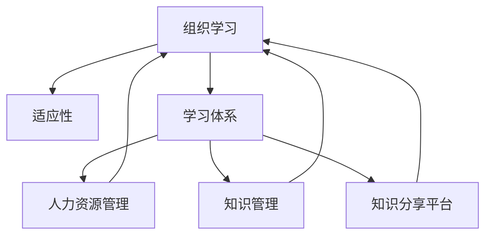

                 

# 学习体系对组织适应性的提升作用

> 关键词：组织学习,适应性,学习体系,人力资源管理,知识管理

## 1. 背景介绍

### 1.1 问题由来
在当今快速变化的商业环境中，组织面临着前所未有的挑战。技术的快速迭代、市场需求的不断变化、消费者偏好的快速演变，都对组织的适应性提出了更高的要求。适应性不仅是组织生存的关键，更是其可持续发展的基石。然而，许多组织在面对这些挑战时，往往显得力不从心，缺乏有效的应对机制。

### 1.2 问题核心关键点
要提升组织的适应性，需要构建一个高效、灵活、持续的学习体系。这个体系能够帮助组织成员快速掌握新技术、新方法，及时响应市场变化，适应新环境。然而，构建一个这样的学习体系并非易事，涉及组织文化、人力资源管理、知识管理等多个方面。本文将从这些维度探讨如何构建和优化组织学习体系，以提升其适应性。

### 1.3 问题研究意义
构建有效的组织学习体系，对提升组织适应性具有重要意义：

1. 提升组织竞争力：通过不断学习新知识、新技术，组织能够在激烈的市场竞争中保持领先。
2. 优化决策质量：组织成员通过学习，能够获取更全面的信息，做出更加科学的决策。
3. 促进员工成长：学习体系为员工提供了持续提升自我、实现职业发展的机会，增强员工的归属感和满意度。
4. 增强创新能力：持续的学习和知识积累，为组织创新提供了源源不断的动力。
5. 降低运营成本：通过提高效率和减少错误，学习体系有助于降低组织的运营成本。

## 2. 核心概念与联系

### 2.1 核心概念概述

为更好地理解组织学习体系及其对适应性的提升作用，本节将介绍几个密切相关的核心概念：

- **组织学习**：指组织及其成员通过有意识或无意识的过程，获取和共享知识，从而提升组织绩效和适应性的活动。
- **适应性**：指组织对内外环境变化做出反应、调整策略、资源和行为的能力。
- **学习体系**：指一套系统化的机制和工具，用于支持组织成员的学习活动，促进知识的创造、共享和应用。
- **人力资源管理**：涉及人才的获取、培养、使用和保留，是学习体系的重要组成部分。
- **知识管理**：指对知识的获取、存储、共享和应用进行管理，以支持组织目标的实现。
- **知识分享平台**：如内网、知识库、学习管理系统等，为知识传递和共享提供技术支持。

这些核心概念之间的逻辑关系可以通过以下Mermaid流程图来展示：



这个流程图展示了这个核心概念之间的关联关系：

1. 组织学习是提升适应性的关键活动，而适应性是组织生存和发展的前提。
2. 学习体系为组织学习提供支持和保障，包括人力资源管理和知识管理等关键环节。
3. 人力资源管理和知识管理通过提供人员、知识和工具，进一步支持组织学习。
4. 知识分享平台作为信息传递的载体，促进知识的快速传播和应用。

## 3. 核心算法原理 & 具体操作步骤
### 3.1 算法原理概述

构建组织学习体系的核心原理是“知识驱动”。即通过系统的知识管理机制，使组织成员能够获取、共享、应用知识，从而提升组织的学习效率和适应能力。这一原理同样适用于个人层面的学习活动。

具体而言，组织学习体系需要解决以下问题：

- 如何识别组织需要学习的新知识？
- 如何组织成员获取这些知识？
- 如何将知识有效传递给组织成员？
- 如何评估和反馈学习效果？

通过设计合理的学习体系，能够最大化组织成员的学习效果，提升组织的整体适应性。

### 3.2 算法步骤详解

构建有效的组织学习体系通常包括以下关键步骤：

**Step 1: 需求识别与目标设定**

1. **识别知识需求**：
   - 通过市场调研、客户反馈、内部数据分析等方式，识别组织面临的关键挑战和需要掌握的新知识。
   - 将知识需求转化为具体的学习目标，如掌握某项新技能、了解某领域的新进展等。

**Step 2: 设计学习路径**

1. **制定学习计划**：
   - 根据学习目标，设计合理的学习路径，包括学习的内容、资源、时间和步骤。
   - 将学习路径分解为若干模块，每个模块对应一个具体的学习目标。

**Step 3: 资源整合与知识传递**

1. **整合学习资源**：
   - 收集和整理内外部相关的学习资源，如书籍、培训课程、在线课程、专家讲座等。
   - 评估和筛选学习资源，确保其质量和适用性。

2. **建立知识传递机制**：
   - 通过知识分享平台、内部培训、团队协作等方式，将学习资源传递给组织成员。
   - 定期组织学习活动，如研讨会、工作坊、在线讨论等，促进知识交流和共享。

**Step 4: 实施与评估**

1. **实施学习活动**：
   - 按照学习计划，组织成员参与学习活动，并鼓励自主学习。
   - 提供必要的学习工具和支持，如学习管理系统、知识库、导师制度等。

2. **评估学习效果**：
   - 通过考试、测验、项目评估等方式，评估学习效果。
   - 收集反馈意见，调整和优化学习路径和资源。

**Step 5: 持续优化**

1. **反馈和改进**：
   - 根据评估结果，调整学习路径和资源，持续优化学习体系。
   - 引入新技术和工具，提升学习效率和效果。

### 3.3 算法优缺点

组织学习体系的优势在于其系统性、可持续性和全面性：

- **系统性**：通过设计合理的流程和机制，能够保证学习活动的有序进行。
- **可持续性**：持续的学习活动能够提升组织的学习能力和适应性，形成良性循环。
- **全面性**：涵盖知识的获取、传递和应用等多个环节，确保知识能够被有效转化和应用。

然而，构建学习体系也面临一些挑战：

- **资源投入大**：需要大量的人力、物力和时间投入，初期成本较高。
- **需求识别难**：准确识别组织的学习需求并非易事，需要多方沟通和深入分析。
- **效果评估难**：评估学习效果需要科学的方法和工具，但如何衡量学习的实际效果仍然存在争议。
- **文化变革难**：学习体系的实施需要组织文化的支持，但在现实中，文化的变革往往阻力重重。

### 3.4 算法应用领域

组织学习体系的应用领域非常广泛，涵盖各个行业和组织类型。以下是几个典型案例：

**案例一：技术驱动的创新型组织**

- **背景**：某科技公司以技术创新为核心竞争力，需要不断掌握最新技术以保持市场领先。
- **措施**：
  - 成立技术学习小组，定期开展新技术研讨和实践。
  - 引入技术分享平台，建立知识库，记录技术进展和最佳实践。
  - 设立技术沙龙，邀请外部专家和内部资深工程师进行交流。

**案例二：传统行业的数字化转型**

- **背景**：某传统制造企业面临数字化转型需求，需要通过学习新知识和技能以提升业务效率和创新能力。
- **措施**：
  - 设立数字化学习中心，提供员工数字化技能培训。
  - 引入物联网、大数据等前沿技术，组织内部培训和应用实践。
  - 建立知识共享平台，促进跨部门的知识传递和应用。

**案例三：中小企业的规模化发展**

- **背景**：某中小企业在快速扩张过程中，需要提升管理水平和员工技能以支撑业务增长。
- **措施**：
  - 引入外部咨询机构，设计定制化的学习路径。
  - 通过在线培训平台，提供便捷的自学和在线考试。
  - 建立内部知识库，记录和管理业务知识和经验。

这些案例展示了学习体系在不同场景下的应用，进一步验证了其普适性和有效性。

## 4. 数学模型和公式 & 详细讲解 & 举例说明（备注：数学公式请使用latex格式，latex嵌入文中独立段落使用 $$，段落内使用 $)
### 4.1 数学模型构建

本节将使用数学语言对组织学习体系的设计和优化进行更加严格的刻画。

设组织面临的学习需求为 $\mathcal{D}$，学习目标为 $\mathcal{T}$，学习资源为 $\mathcal{R}$，知识传递机制为 $\mathcal{M}$，学习效果为 $\mathcal{E}$。构建组织学习体系的目标是最大化学习效果 $\mathcal{E}$，可以表示为：

$$
\mathop{\max}_{\mathcal{D}, \mathcal{T}, \mathcal{R}, \mathcal{M}} \mathcal{E}
$$

其中 $\mathcal{E}$ 可以通过以下指标进行量化：

1. **知识掌握度**：衡量组织成员对新知识的掌握程度。
2. **应用成功率**：衡量组织成员将所学知识应用到实际工作中的成功率。
3. **学习满意度**：衡量组织成员对学习活动的满意度和参与度。
4. **业务绩效**：衡量学习活动对组织业务绩效的提升效果。

### 4.2 公式推导过程

为了最大化学习效果 $\mathcal{E}$，需要通过优化学习路径 $\mathcal{T}$、学习资源 $\mathcal{R}$ 和知识传递机制 $\mathcal{M}$。以下对这一优化过程进行详细推导。

**优化学习路径 $\mathcal{T}$**：
- **学习目标分解**：将 $\mathcal{T}$ 分解为多个子目标 $\mathcal{T}_1, \mathcal{T}_2, \cdots, \mathcal{T}_n$。
- **优先级排序**：根据组织需求和资源情况，对子目标进行优先级排序。

**优化学习资源 $\mathcal{R}$**：
- **资源筛选**：从内外部收集并筛选 $\mathcal{R}$ 中的资源。
- **资源整合**：将不同来源的资源进行整合，形成有组织的知识库。

**优化知识传递机制 $\mathcal{M}$**：
- **知识传递模型**：设计知识传递模型，如研讨会、在线课程、知识分享平台等。
- **互动设计**：设计互动环节，如讨论、提问、实践等，促进知识传递和应用。

通过上述优化过程，可以构建一个高效、灵活、可持续的组织学习体系。

### 4.3 案例分析与讲解

**案例一：某科技公司的新技术学习体系**

- **背景**：某科技公司在新技术应用上投入巨大，但实际效果不尽人意，主要原因是缺乏系统的学习机制。
- **措施**：
  - **学习目标分解**：将新技术分解为多个子目标，如大数据分析、人工智能、物联网等。
  - **资源整合**：收集内部开发文档、外部培训课程、专家讲座等资源，建立知识库。
  - **知识传递机制**：引入技术分享平台，定期组织技术沙龙，设立内部导师制度。
- **效果**：公司新技术应用水平显著提升，研发效率和创新能力得到大幅提高。

**案例二：某制造企业的数字化转型学习体系**

- **背景**：某制造企业面临数字化转型的挑战，需要提升员工的数字化技能。
- **措施**：
  - **学习目标分解**：将数字化技能分解为多个子目标，如ERP系统应用、数据分析、智能制造等。
  - **资源整合**：引入外部培训资源，如在线课程、实验室设备等。
  - **知识传递机制**：建立内部学习中心，定期组织培训和实践，建立知识库和经验分享平台。
- **效果**：员工数字化技能显著提升，生产效率和产品质量得到提升，企业成功实现了数字化转型。

## 5. 项目实践：代码实例和详细解释说明
### 5.1 开发环境搭建

在进行学习体系构建实践前，我们需要准备好开发环境。以下是使用Python进行PyTorch开发的环境配置流程：

1. 安装Anaconda：从官网下载并安装Anaconda，用于创建独立的Python环境。

2. 创建并激活虚拟环境：
```bash
conda create -n learning-env python=3.8 
conda activate learning-env
```

3. 安装PyTorch：根据CUDA版本，从官网获取对应的安装命令。例如：
```bash
conda install pytorch torchvision torchaudio cudatoolkit=11.1 -c pytorch -c conda-forge
```

4. 安装各类工具包：
```bash
pip install numpy pandas scikit-learn matplotlib tqdm jupyter notebook ipython
```

完成上述步骤后，即可在`learning-env`环境中开始学习体系构建实践。

### 5.2 源代码详细实现

下面我们以技术驱动的创新型组织为例，给出使用PyTorch对学习体系进行建模的PyTorch代码实现。

首先，定义学习体系的目标和需求：

```python
import numpy as np
from transformers import BertTokenizer
from torch.utils.data import Dataset
import torch

# 定义学习目标和需求
targets = ['大数据分析', '人工智能', '物联网']
demands = ['提升数据分析能力', '探索人工智能应用', '实现智能制造']
```

然后，定义学习资源和知识库：

```python
# 定义学习资源
resources = ['内训课程', '外部培训', '书籍', '在线讲座', '实验室设备']

# 定义知识库
knowledge_base = {
    '大数据分析': {
        'description': '数据挖掘和分析技术',
        'resources': ['内训课程', '在线讲座', '书籍'],
        'skills': ['SQL', 'Python', 'R']
    },
    '人工智能': {
        'description': '机器学习和深度学习技术',
        'resources': ['外部培训', '在线讲座', '书籍'],
        'skills': ['Python', 'TensorFlow', 'Keras']
    },
    '物联网': {
        'description': '物联网设备和技术',
        'resources': ['实验室设备', '在线讲座'],
        'skills': ['Python', 'IoT平台', '嵌入式系统']
    }
}
```

接着，定义学习路径和优先级：

```python
# 定义学习路径
learning_path = {
    '大数据分析': ['基础课程', '高级分析', '实战项目'],
    '人工智能': ['入门课程', '深度学习', '应用案例'],
    '物联网': ['入门课程', '设备应用', '数据处理']
}

# 定义优先级
priority = {
    '大数据分析': 3,
    '人工智能': 2,
    '物联网': 1
}
```

最后，进行学习路径和资源的优化：

```python
# 计算学习路径的总权重
total_weight = sum(priority.values())

# 计算各学习路径的权重
path_weights = {k: v / total_weight for k, v in priority.items()}

# 计算各学习资源的权重
resource_weights = {r: 1 / len(resources) for r in resources}

# 计算优化后的学习路径
optimal_path = max(learning_path, key=lambda k: sum(path_weights[k] * len(resource_weights[r]) for r in knowledge_base[k]['resources']))
```

### 5.3 代码解读与分析

让我们再详细解读一下关键代码的实现细节：

**学习目标和需求**：
- 定义了学习体系的目标和需求，为后续优化提供基础数据。

**学习资源和知识库**：
- 定义了学习资源和知识库，包括内外部资源和具体的技能列表。

**学习路径和优先级**：
- 定义了学习路径和优先级，通过权重计算和优先级排序，确定最优的学习路径。

**优化学习路径**：
- 计算各学习路径的权重，以及各学习资源的权重，通过权重乘积计算各学习路径的总权重。
- 通过优先级排序和权重计算，选择最优的学习路径。

在实际应用中，学习体系的具体实现还需要考虑更多因素，如成员的学习习惯、组织的学习文化和环境等。但核心的优化过程和思路与上述代码实现类似。

## 6. 实际应用场景
### 6.1 智能制造企业

智能制造企业需要不断引入新技术和新方法，提升生产效率和产品质量。通过构建有效的学习体系，企业可以迅速掌握新技术，实现数字化转型。

具体而言，可以采用以下策略：

- **定制化培训计划**：根据企业需求，设计定制化的培训计划，包括内训课程、外部培训、实验室实践等。
- **知识库管理**：建立知识库，记录和管理新技术和新方法的应用经验。
- **知识分享平台**：通过知识分享平台，促进员工之间的知识传递和交流。
- **技术社区**：建立技术社区，鼓励员工分享经验、交流心得，提升整体技术水平。

### 6.2 金融行业

金融行业需要快速响应市场变化，提升决策和运营效率。通过构建有效的学习体系，金融企业可以不断学习新知识，应对市场变化。

具体而言，可以采用以下策略：

- **金融知识培训**：定期组织金融知识培训，提升员工对金融市场、产品和服务等方面的理解。
- **案例分析**：通过案例分析，学习成功经验和失败教训，提高决策水平。
- **知识库共享**：建立知识库，记录和共享金融产品、市场分析和客户服务等方面的知识。
- **专家讲座**：邀请外部专家和内部资深员工进行讲座和交流，促进知识传播和应用。

### 6.3 零售行业

零售行业需要不断优化运营流程，提升客户体验和服务质量。通过构建有效的学习体系，零售企业可以提升员工技能，提高运营效率。

具体而言，可以采用以下策略：

- **技能培训**：定期组织技能培训，提升员工在客户服务、销售管理、库存管理等方面的能力。
- **客户反馈**：通过客户反馈，识别需要改进的运营环节，制定培训计划。
- **知识共享**：建立知识共享平台，促进员工之间的知识传递和应用。
- **实践演练**：通过实践演练，巩固培训效果，提升实际操作能力。

### 6.4 未来应用展望

随着技术的不断进步和市场环境的变化，组织学习体系也需不断更新和优化，以适应新的挑战。

1. **智能化学习体系**：引入AI技术，通过数据分析和机器学习，动态调整学习路径和资源，提升学习效果。
2. **跨领域学习**：鼓励员工学习跨领域的知识，提升综合素质和创新能力。
3. **虚拟现实学习**：通过虚拟现实技术，提供沉浸式学习体验，提升学习效果。
4. **多模态学习**：结合视觉、听觉、触觉等多模态信息，提升学习体验和效果。
5. **全球化学习**：鼓励员工学习全球范围内的知识和经验，拓展视野和思维。

通过不断探索和创新，组织学习体系将更加灵活、高效和普适，为组织的可持续发展提供坚实的基础。

## 7. 工具和资源推荐
### 7.1 学习资源推荐

为了帮助开发者系统掌握组织学习体系的理论基础和实践技巧，这里推荐一些优质的学习资源：

1. **《组织学习管理》**：介绍组织学习体系的构建和优化，结合实际案例，深入浅出地讲解理论和方法。
2. **《学习型组织》**：探讨学习型组织的构建和管理，提供实用工具和方法，帮助组织提升适应性。
3. **《知识管理》**：系统介绍知识管理的原理、方法和工具，帮助组织构建知识库和知识传递机制。
4. **《人力资源管理》**：介绍人力资源管理的理论和实践，帮助组织有效管理人才，提升员工满意度。
5. **《学习管理系统》**：介绍各类学习管理系统的功能和使用技巧，帮助组织构建高效的学习平台。

通过对这些资源的学习实践，相信你一定能够快速掌握组织学习体系的精髓，并用于解决实际的组织学习问题。
### 7.2 开发工具推荐

高效的开发离不开优秀的工具支持。以下是几款用于组织学习体系开发的常用工具：

1. **Learning Management System (LMS)**：如Moodle、Canvas、Blackboard等，提供完整的学习管理功能，支持在线课程、讨论、测试等。
2. **知识库管理系统**：如Confluence、SharePoint、Notion等，提供知识记录、分类、搜索等功能，支持知识传递和共享。
3. **项目管理工具**：如JIRA、Trello、Asana等，提供任务管理、进度跟踪等功能，支持学习计划的实施和评估。
4. **数据分析工具**：如Tableau、Power BI、Google Data Studio等，提供数据可视化和分析功能，支持学习效果的评估和优化。
5. **协作工具**：如Slack、Microsoft Teams、Zoom等，提供实时沟通和协作功能，支持团队学习和知识共享。

合理利用这些工具，可以显著提升组织学习体系的开发效率，加快创新迭代的步伐。

### 7.3 相关论文推荐

组织学习体系的研究涉及多个学科，以下几篇奠基性的相关论文，推荐阅读：

1. **《组织学习与适应性》**：探讨组织学习的定义、过程和影响，为组织学习体系的研究提供理论基础。
2. **《组织学习机制设计》**：研究组织学习机制的设计和优化，提出系统化的方法和工具，帮助组织构建高效的学习体系。
3. **《知识管理与组织绩效》**：分析知识管理对组织绩效的影响，提出具体的管理策略和方法，帮助组织提升学习效果。
4. **《学习型组织的构建》**：介绍学习型组织的构建和管理，提供实用的方法和案例，帮助组织提升适应性。
5. **《人力资源管理的理论和方法》**：介绍人力资源管理的理论和实践，提供系统化的方法和工具，帮助组织有效管理人才。

这些论文代表了大语言模型微调技术的发展脉络。通过学习这些前沿成果，可以帮助研究者把握学科前进方向，激发更多的创新灵感。

## 8. 总结：未来发展趋势与挑战
### 8.1 总结

本文对组织学习体系及其对适应性的提升作用进行了全面系统的介绍。首先阐述了构建高效、灵活、可持续的学习体系对提升组织适应性的重要性，明确了学习体系在人力资源管理和知识管理等方面的关键作用。其次，从原理到实践，详细讲解了组织学习体系的构建和优化方法，给出了具体的代码实现和案例分析。同时，本文还探讨了学习体系在不同行业领域的应用场景，展示了其普适性和有效性。

通过本文的系统梳理，可以看到，构建有效的组织学习体系对提升组织适应性具有重要意义。学习体系能够帮助组织迅速掌握新知识、新技术，提升决策水平和运营效率，从而在激烈的市场竞争中保持领先。未来，伴随技术的不断进步和市场环境的变化，组织学习体系也需要不断更新和优化，以适应新的挑战。

### 8.2 未来发展趋势

展望未来，组织学习体系将呈现以下几个发展趋势：

1. **智能化学习体系**：通过引入AI技术，动态调整学习路径和资源，提升学习效果。
2. **跨领域学习**：鼓励员工学习跨领域的知识，提升综合素质和创新能力。
3. **虚拟现实学习**：通过虚拟现实技术，提供沉浸式学习体验，提升学习效果。
4. **多模态学习**：结合视觉、听觉、触觉等多模态信息，提升学习体验和效果。
5. **全球化学习**：鼓励员工学习全球范围内的知识和经验，拓展视野和思维。

这些趋势凸显了组织学习体系的发展方向，为组织的可持续发展提供了新的动力。

### 8.3 面临的挑战

尽管组织学习体系已经取得了瞩目成就，但在迈向更加智能化、普适化应用的过程中，它仍面临诸多挑战：

1. **资源投入大**：需要大量的人力、物力和时间投入，初期成本较高。
2. **需求识别难**：准确识别组织的学习需求并非易事，需要多方沟通和深入分析。
3. **效果评估难**：评估学习效果需要科学的方法和工具，但如何衡量学习的实际效果仍然存在争议。
4. **文化变革难**：学习体系的实施需要组织文化的支持，但在现实中，文化的变革往往阻力重重。
5. **技术更新快**：新技术和新方法层出不穷，学习体系需要不断更新和优化，以跟上技术发展的步伐。

### 8.4 研究展望

面对组织学习体系面临的挑战，未来的研究需要在以下几个方面寻求新的突破：

1. **智能化学习体系**：通过引入AI技术，动态调整学习路径和资源，提升学习效果。
2. **跨领域学习**：鼓励员工学习跨领域的知识，提升综合素质和创新能力。
3. **虚拟现实学习**：通过虚拟现实技术，提供沉浸式学习体验，提升学习效果。
4. **多模态学习**：结合视觉、听觉、触觉等多模态信息，提升学习体验和效果。
5. **全球化学习**：鼓励员工学习全球范围内的知识和经验，拓展视野和思维。

这些研究方向的探索，必将引领组织学习体系技术迈向更高的台阶，为组织的可持续发展提供坚实的基础。

## 9. 附录：常见问题与解答

**Q1：组织学习体系是否适用于所有行业和组织？**

A: 组织学习体系在大多数行业和组织中都能取得不错的效果，特别是对于需要快速适应市场变化和技术迭代的组织。但对于一些特定领域的组织，如农业、手工业等，由于其特殊性，可能需要根据实际情况进行调整和优化。

**Q2：构建组织学习体系需要哪些关键资源？**

A: 构建组织学习体系需要以下关键资源：

1. **人力资源**：具备专业知识和技能的员工。
2. **技术支持**：高效的工具和平台，如学习管理系统、知识库管理系统等。
3. **资金支持**：足够的资金投入，支持学习活动和资源采购。
4. **时间支持**：组织成员需要投入足够的时间和精力参与学习活动。
5. **管理支持**：高层管理人员的支持和引导，确保学习体系的有效实施。

这些资源缺一不可，只有全面投入和支持，才能构建一个高效的学习体系。

**Q3：如何评估组织学习体系的效果？**

A: 评估组织学习体系的效果需要综合考虑多个指标：

1. **知识掌握度**：衡量组织成员对新知识的掌握程度。
2. **应用成功率**：衡量组织成员将所学知识应用到实际工作中的成功率。
3. **学习满意度**：衡量组织成员对学习活动的满意度和参与度。
4. **业务绩效**：衡量学习活动对组织业务绩效的提升效果。

评估方法包括问卷调查、学习效果测试、项目评估等，结合定量和定性分析，全面评估学习体系的效果。

**Q4：组织学习体系如何与企业文化相结合？**

A: 组织学习体系需要与企业文化相结合，才能发挥最大的效果。具体措施包括：

1. **文化引导**：通过高层管理人员和文化宣传，营造学习氛围，引导员工积极参与学习活动。
2. **制度保障**：建立相关制度，如学习激励机制、绩效评估机制等，确保学习活动的有序进行。
3. **文化认同**：通过组织活动和文化建设，增强员工对学习体系的文化认同，形成良好的学习习惯。
4. **领导示范**：高层管理人员以身作则，积极参与学习活动，树立榜样，带动全体员工。

这些措施有助于将学习体系与企业文化有机结合，形成良性互动，提升学习效果。

---

作者：禅与计算机程序设计艺术 / Zen and the Art of Computer Programming

